# 1. Read First

## 1.1 Introduction to miniHexa

### 1.1.1 Product Introduction

miniHexa is an intelligent hexapod robot powered by a high-performance ESP32 controller. It integrates Bluetooth/Wi-Fi dual-mode communication and supports multi-terminal control through a mobile APP, PC software, and programmable APIs. Its innovative three-degree-of-freedom leg structure works with 18 high-speed PWM servos and an integrated inverse kinematics gait control algorithm to calculate the joint-space trajectories of 18 degrees of freedom in real time, making the robot move with greater agility and flexibility.

miniHexa integrates an ultrasonic sensor, IMU, and sensor expansion ports to support creative functions such as APP control, distance measurement and obstacle avoidance, and self-balancing. Official learning and development materials and real-person video tutorials are provided to help start hexapod robot development.

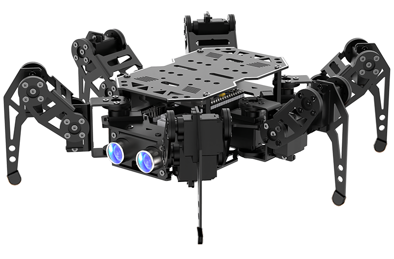

### 1.1.2 Packing List

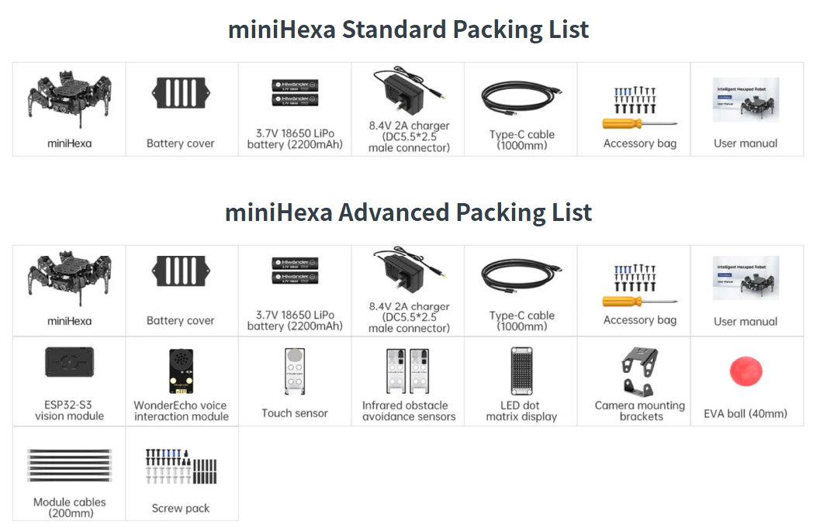

### 1.1.3 Notes

Pay attention to the following when using and storing this product:

- This product has small parts and sharp pins, so it is not suitable for children under 12 years old.
- Minors must use this product under adult supervision and guidance.
- This product contains small and sharp parts. Do not swallow or press them to avoid injury.
- This product contains conductive parts. Do not touch it with metal objects while powered on.
- Do not forcibly move the robot after power-on to avoid damaging the servos.
- When the product will not be used for a long time, store it in a cool and dry place.
- When the robot is equipped with servos and is running, if a servo output shaft cannot rotate smoothly due to external resistance, **stop the driving operation immediately!** Continued operation may cause stalling. The current will increase sharply and may seriously damage or even burn out the servo.
- **Servo damage caused by human operation such as stalling, overload, or installation error is not covered by the warranty.** Follow standard operating procedures and avoid overloaded operation to ensure normal and safe operation of the robot and servos.

### 1.1.4 Copyright Notice

This manual is copyrighted by Shenzhen Hiwonder Technology Co., Ltd. No organization or individual may extract, copy, translate, or distribute the content of this manual without permission.

If any organization or individual is found to infringe the copyright of this reference material, the company reserves the right to pursue legal responsibility.

### 1.1.5 Disclaimer

The products described in this manual, including hardware and software, are provided **as is**. Every effort has been made to ensure the accuracy of the content during writing, but the manual cannot be guaranteed to be completely free of errors or omissions. The materials will be checked regularly, and improvement suggestions are welcome.

As the product version is upgraded, the corresponding product content may also change. Contact customer service when ordering to obtain the latest product information.

In addition, Hiwonder is not responsible for losses caused by malfunction or damage when the product is used in extreme conditions unless Hiwonder has explicitly stated that the product is suitable for that use.

## 1.2 Battery Charging and First Startup

### 1.2.1 Charging Instructions

Lithium batteries cannot be fully charged during transportation. Charge the batteries before first use. The charging time is about 1 hour.

Follow these charging steps:

1) Make sure the device switch is set to **OFF**.

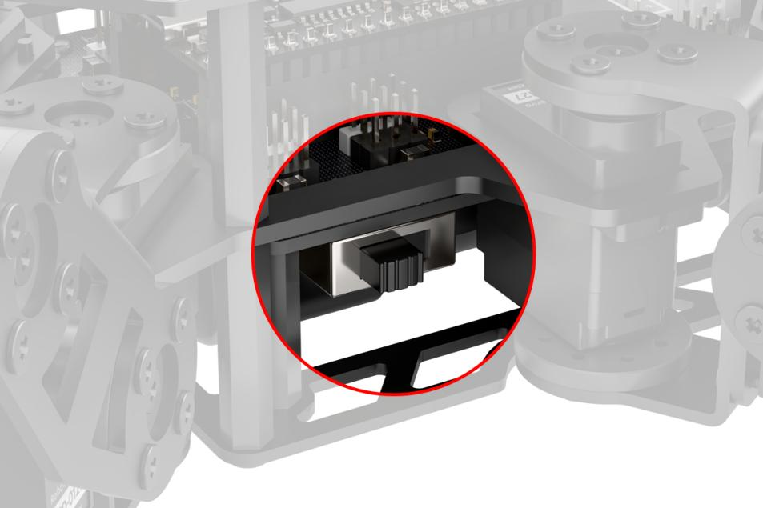

2) Insert two 18650 lithium batteries according to the positive and negative polarity markings on the battery holder.

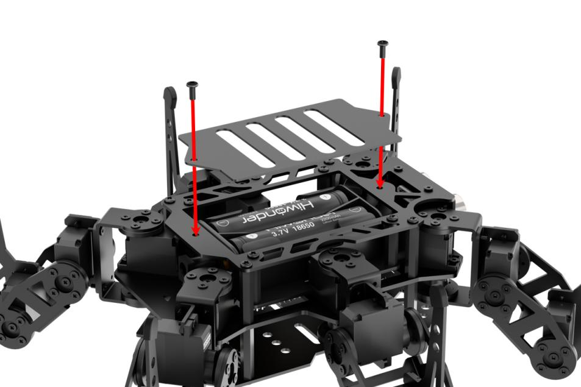

3) Reinstall the battery cover and secure it with M3*6 screws.

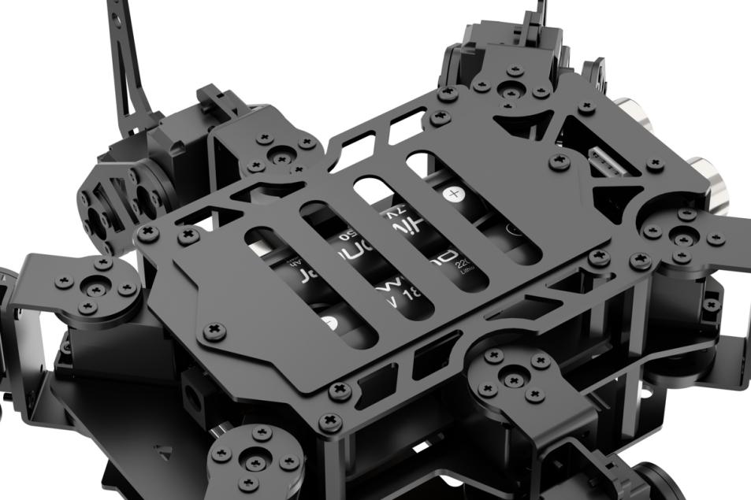

4) Plug the charger into the DC port of the hexapod robot. A red charger indicator means charging is in progress. A green indicator means charging is complete.

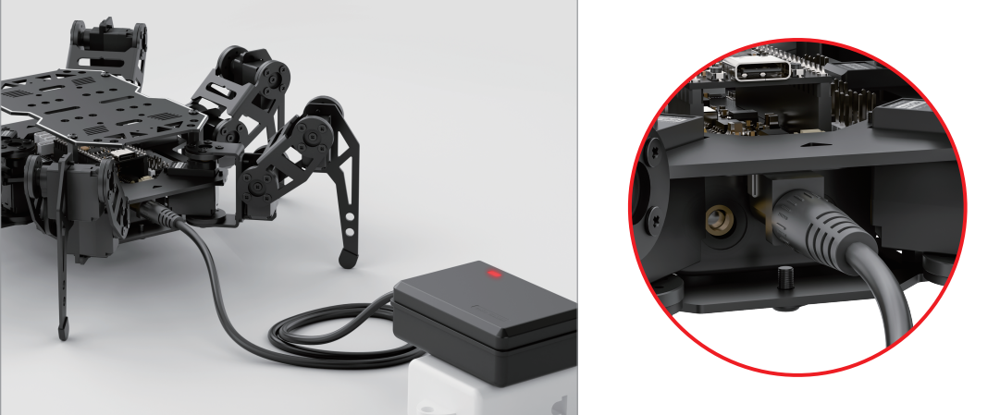

### 1.2.2 Battery Usage Guidelines

1) Use the included 8.4V charger to charge the batteries.

2) During charging, the adapter indicator turns red. After the batteries are fully charged, the indicator turns green. Disconnect the power supply in time after charging is complete to avoid overcharging the batteries.

3) If the robot will not be used for a long time, fully charge the batteries, switch the expansion board to **OFF**, remove the batteries, and store them in a cool and dry place.

**Important Notice: Hiwonder assumes no responsibility for product damage, economic loss, safety accidents, or other consequences caused by operation that does not follow this manual.**

### 1.2.3 Device Usage Precautions

1) Do not forcibly move the servos after power-on to avoid servo damage.

2) Do not keep the servos at their limit positions for a long time to avoid servo stalling.

3) Keep fingers away from the joints of miniHexa to avoid pinching.

4) The servos of miniHexa are precision components and consumable parts. Long-term or excessive use may require replacement.

5) Use the official miniHexa APP Wonderbot for connection. Do not pair through the phone settings with a pairing key.

### 1.2.4 First Startup

1) To avoid sudden servo force and servo damage, place the 6 legs of miniHexa parallel to the tabletop before power-on. Start it in the standard resting posture.

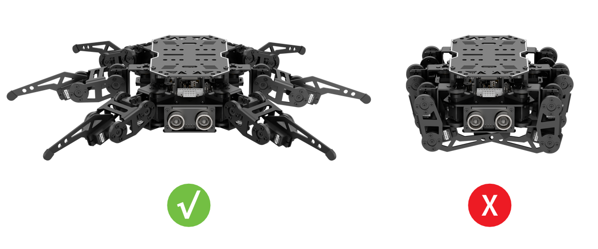

2. Push the power switch to **ON**.

3. After miniHexa stands up, startup is successful.

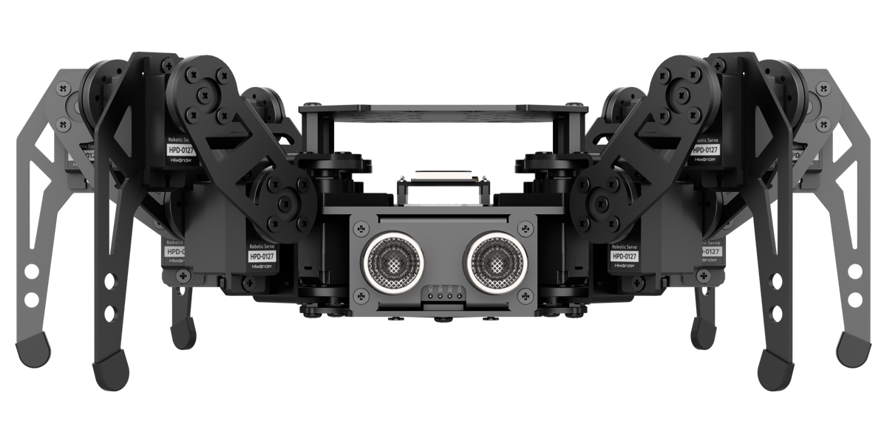

## 1.3 miniHexa Interface Overview

### 1.3.1 Mainboard Introduction

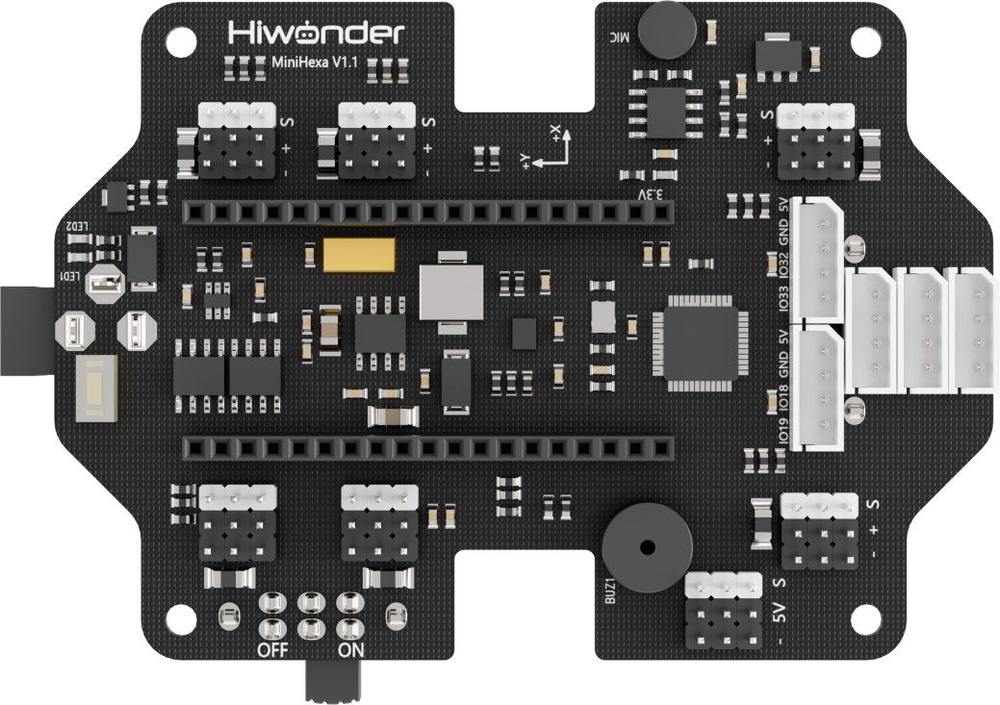

The miniHexa mainboard uses a modular controller architecture. The onboard microcontroller base can connect to an external ESP32 microcontroller as the main controller. The controller integrates an IMU sensor, 21 PWM servo ports, a buzzer, custom buttons, I2C ports, GPIO ports, and other peripheral support, making secondary development and function expansion easier.

### 1.3.2 Interface Description

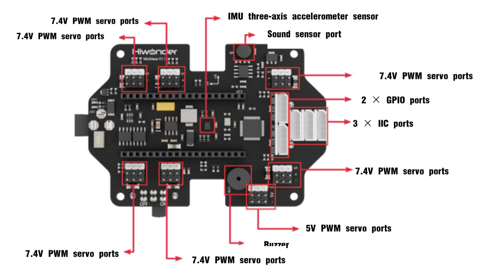

<table>
<colgroup>
<col style="width: 49%" />
<col style="width: 50%" />
</colgroup>
<tbody>
<tr>
<td style="text-align: center;"><strong>Interface / Onboard Sensor Name</strong></td>
<td style="text-align: center;"><strong>Interface / Onboard Sensor Function</strong></td>
</tr>
<tr>
<td style="text-align: center;">PWM Servo Port</td>
<td style="text-align: center;">Controls PWM servos</td>
</tr>
<tr>
<td style="text-align: center;">Power Switch</td>
<td style="text-align: center;">Turns the controller power on or off</td>
</tr>
<tr>
<td style="text-align: center;">GPIO Port</td>
<td rowspan="2" style="text-align: center;">Connects external sensor modules</td>
</tr>
<tr>
<td style="text-align: center;">I2C Port</td>
</tr>
<tr>
<td style="text-align: center;">Buzzer</td>
<td style="text-align: center;">Provides sound prompts</td>
</tr>
<tr>
<td style="text-align: center;">Sound Sensor</td>
<td style="text-align: center;">Detects ambient sound intensity</td>
</tr>
<tr>
<td style="text-align: center;">IMU Sensor</td>
<td style="text-align: center;">Detects robot posture</td>
</tr>
</tbody>
</table>

### 1.3.3 Specifications

| **Programming Software** | Official Arduino IDE |
| ------------ | ---------------------------- |
| **Input** | Sound sensor, IO port |
| **Output** | Buzzer, PWM servo output, indicator |
| **Microprocessor** | Compatible with ESP32 controller board |
| **Communication Method** | Bluetooth communication, Wi-Fi communication, serial port communication |
| **Control Method** | PC software, mobile APP |

### 1.3.4 Core Board Introduction

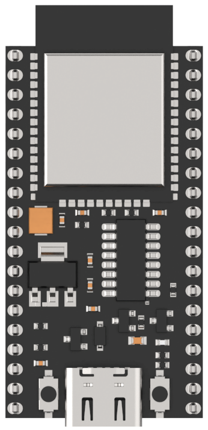

The main control chip of this development board is ESP32-WROOM. It has an onboard Type-C port for program download and serial port communication. The button on the left is the IO0 button. Press it to control the high and low level of the corresponding pin, and customize triggered events in the program. The button on the right is the EN reset button. Press it to perform a hardware reset.

| **Core Module** | **ESP32** |
| :------------------: | :----------------------------------------------------------: |
| **Chip Model** | ESP32-WROOM |
| **Main Frequency** | <= 240 MHz |
| **Communication Method** | UART/USART/I2C/SPI, etc. |
| **Peripheral Resources** | Wi-Fi/Bluetooth, 12-bit ADC, DMA, UART, SPI, QSPI, I2S, I2C, four 64-bit timers, four 64-bit high-precision timers, PWM, etc. |
| **Features** | High performance, rich peripherals, supports multitasking |
| **Source Code / Schematic** | Fully open source |
| **Control Method** | Mobile APP / PC software |
| **Code Programming** | Arduino, Python, Scratch |
| **Voltage Detection (Low-Voltage Alarm)** | Supported |
