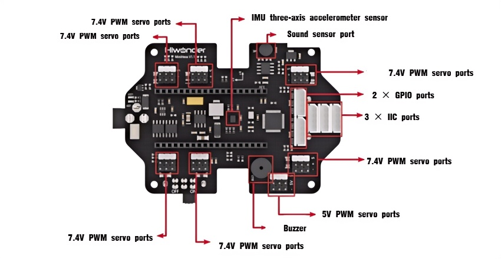

# 1. Read First Course

## 1.1 Introduction to miniHexa

**1.1.1 Product Overview** 

The miniHexa is an intelligent hexapod robot powered by a high-performance ESP32 controller, featuring built-in Bluetooth/Wi-Fi dual-mode communication. It supports multi-platform control via mobile app, PC software, and programmable APIs. Its innovative three-degree-of-freedom leg design, paired with 18 high-speed PWM servo motors, works in tandem with an integrated inverse kinematics gait control algorithm. This enables real-time calculation of joint-space trajectories for all 18 degrees of freedom, delivering smooth, agile, and lifelike movements.

The miniHexa also integrates an ultrasonic sensor, IMU, and sensor expansion ports, enabling creative functions such as app-based control, distance measurement and obstacle avoidance, and self-balancing. Comprehensive tutorials and step-by-step video tutorials are provided to help you easily start your journey into hexapod robotics development.

**1.1.2 Notes**

Please observe the following guidelines when using and storing the robot:

(1) The robot contains small parts and sharp pins, making it unsuitable for children under 12 years old.

(2) Minors must use this product under the supervision and guidance of an adult.

(3) Small and pointed components may pose a choking or injury risk. Do not put them in your mouth or apply pressure.

(4) The robot includes conductive components. Do not touch it with metal objects while powered on.

(5) Do not forcefully twist or move the robot after powering it on, as this may damage the servos.

(6) If the product will not be used for an extended period, please store it in a cool and dry place.

(7) When the robot is equipped with servos and powered on, stop operation immediately if any servo's output shaft is obstructed from rotating freely. Continued operation under such conditions can cause the servo to stall, dramatically increasing current and potentially leading to severe damage or burnout.

**Damage to servos caused by stalling, overloading, or improper installation is not covered under warranty.** It is essential to follow proper operating procedures and avoid overloading to ensure the safe and reliable performance of both the robot and its servos.

**1.1.3 Copyright Notice**

This manual is the intellectual property of Shenzhen Hiwonder Technology Co., Ltd. No part of this document may be copied, reproduced, translated, or distributed without prior written permission.

Any unauthorized use or infringement will be subject to legal action.

**1.1.4 Disclaimer**

The products described in this manual are provided on an "as-is" basis, including hardware, software, etc. While every effort has been made to ensure the accuracy of the content at the time of writing, we do not guarantee that the manual is completely free of errors or omissions. The material will be periodically reviewed, and we encourage users to provide feedback for improvements.

As the product is updated with new versions, its features and specifications may change. Please contact customer service at the time of purchase for the latest product information.

Furthermore, Hiwonder is not responsible for any malfunctions or damages caused by using the product in extreme conditions unless explicitly stated by Hiwonder as suitable for such use.

## 1.2 Packing List

**1.2.1 miniHexa Standard Packing List**

| **No.** |               **Components**                | Quantity |                         **Picture**                          |
| :-----: | :-----------------------------------------: | :------: | :----------------------------------------------------------: |
|    1    |                  miniHexa                   |    1     |  |
|    2    |                Battery cover                |    1     |  |
|    3    |      3.7V 18650 Lipo battery(2200mAh)       |    2     |  |
|    4    | 8.4V 2A charger(DC5.5 * 2.5 male connector) |    1     |  |
|    5    |                Type-C Cable                 |    1     |  |
|    6    |                Accessory bag                |    1     |  |
|    7    |                 User manual                 |    1     |  |

**1.2.2 miniHexa Advanced Packing List**

| **No.** |               **Components**                | Quantity |                                                                                    **Picture**                                                                                     |
| :-----: | :-----------------------------------------: | :------: |:----------------------------------------------------------------------------------------------------------------------------------------------------------------------------------:|
|    1    |                  miniHexa                   |    1     |                                                                                                     |
|    2    |                Battery cover                |    1     |                                                                                                     |
|    3    |      3.7V 18650 Lipo battery(2200mAh)       |    1     |                                                                                                     |
|    4    | 8.4V 2A charger(DC5.5 * 2.5 male connector) |    1     |                                                                                                     |
|    5    |                Type-C Cable                 |    1     |                                                                                                     |
|    6    |                Accessory bag                |    1     |  |
|    7    |                 User manual                 |    1     |                                                                                                     |
|    8    |           ESP32-S3 vision module            |    1     |                                                                                                     |
|    9    |     WonderEcho vioce interaction module     |    1     |                                                                                                      |
|   10    |                Touch sensor                 |    1     |                                                                                                     |
|   11    |     Infrared obstacle avoidance sensors     |    2     |                                                                                                    |
|   12    |           LED dot matrix display            |    1     |                                                                                                     |
|   13    |          Camara mounting brackets           |    2     |                                                                                                    |
|   14    |               EVA ball(40mm)                |    1     |                                                                                                     |
|   15    |            Module cables(200mm)             |    6     |                                                                                                    |
|   16    |                 Screw pack                  |    1     |                                                                                                     |

## 1.3 Battery Charging and First Startup

**1.3.1 Charging Instructions** 

Lithium batteries are not fully charged during transportation. Please charge the battery before first use. The recommended charging time is approximately 1 hour.

Charging Steps:

(1) Make sure the device’s power switch is set to **OFF**.

(2) Insert two 18650 lithium batteries into the battery holder, following the polarity markings (+/–) on the case.

(3) Replace the battery cover and secure it with M3×6 screws.

(4) Plug the charger into the robot’s DC port. The charger’s indicator light will be red while charging and green when charging is complete.

**1.3.2 Battery Usage Guidelines** 

(1) Only use the included 8.4V charger to charge the battery.

(2) While charging, the indicator light of the adapter will be red, and it will turn green when fully charged. Please unplug the charger promptly after the battery is fully charged to avoid overcharging.

(3) If the robot will not be used for an extended period, fully charge the battery, set the expansion board switch to **OFF**, remove the battery, and store it in a cool, dry place.

:::{Note}
Hiwonder is not responsible for any damage, economic loss, or safety incidents resulting from improper use of the product that does not follow the instructions outlined in this manual.
:::

**1.3.3 Notes**

(1) Do not forcibly twist or move the servos after powering on the robot, as this may damage the servo motors.

(2) Avoid keeping the servos at their limit positions for extended periods to prevent stalling or burnout.

(3) Keep your fingers away from the miniHexa’s joints to avoid injury.

(4) The servos used in the miniHexa are precision components and wear parts. Prolonged or heavy use may require replacement.

(5) Always connect using the official Wonderbot app. Do not attempt to pair the robot through your phone’s Bluetooth settings using a pairing code.

**1.3.4 First Startup** 

(1) To prevent sudden torque from damaging the servos, place all six legs parallel to the table in the standard resting position before powering on.

(2) Switch the power to **ON**.

(3) Once the miniHexa stands up, it is successfully powered on.

## 1.4 miniHexa Interface Overview

**1.4.1 Mainboard Description**

The miniHexa mainboard adopts a modular control architecture. Using the onboard microcontroller base, it can connect to an external ESP32 MCU as the primary controller. The controller integrates an IMU sensor, 21-channel PWM servo ports, a buzzer, customizable key, IIC ports, GPIO ports, and other rich peripheral support, making it ideal for secondary development and function expansion.

**1.4.2 Interface Details**

| **Interface / Onboard Sensor** | **Function** |
| :---: | :--: |
| PWM Servo Port | Controls PWM servo |
| Power Switch | Turns the controller power on/off |
| GPIO Port | Connects external sensor modules |
| IIC Port | Connects external sensor modules |
| Buzzer | Provides audible alerts or feedback |
| Sound Sensor | Detects ambient sound levels |
| IMU Sensor | Detects the robot’s orientation and movement |

**1.4.3 Specifications**

| **Programming Software** | Official Arduino IDE |
| :---: | :--: |
| **Inputs** | Sound Sensor, IO Port |
| **Outputs** | Buzzer, PWM Servo Outputs, Indicators |
| **Microprocessor** | Compatible with ESP32 Controller |
| **Communication Methods** | Bluetooth, Wi-Fi, Serial Communication |
| **Control Methods** | PC Software, Mobile App |

**1.4.4 Controller Overview**

The development board’s main controller chip is the ESP32-WROOM. It features a built-in Type-C port for programming and serial communication. The left button is the IO0 key, which can control the logic level of the corresponding pin. You can define custom events triggered by this button in your code. The right button is the EN reset button, which performs a hardware reset when pressed.

| **Core Module Details** | **ESP32** |
| :---: | :---: |
| Chip Model | ESP32-WROOM |
| Operating Frequency | Up to 240 MHz |
| Communication Methods | UART / USART / I2C / SPI |
| Peripheral Resources | Wi-Fi / Bluetooth, 12-bit ADC, DMA, UART, SPI, QSPI, I2S, I2C, Four 64-bit Timers, Four 64-bit High-Precision Timers, PWM, etc. |
| Key Features | High performance, rich peripherals, supports multitasking |
| Open Source | Full source code and schematics available |
| Control Methods | Mobile App / PC Software |
| Programming Language | Arduino IDE |
| Voltage Detection | Supports low-voltage alarm |