# 2. APP Control

> [!NOTE]
>
> **miniHexa is preloaded with the APP control program before shipment and can be used directly. Android is used as an example here.**

## 2.1 Mobile APP Installation

For iOS: Search for **Wonderbot** in the App Store and download it.

For Android: Find the **Wonderbot** installation package in the same directory as this section or in the appendix, then install it.

Alternatively, scan the QR code to download it:

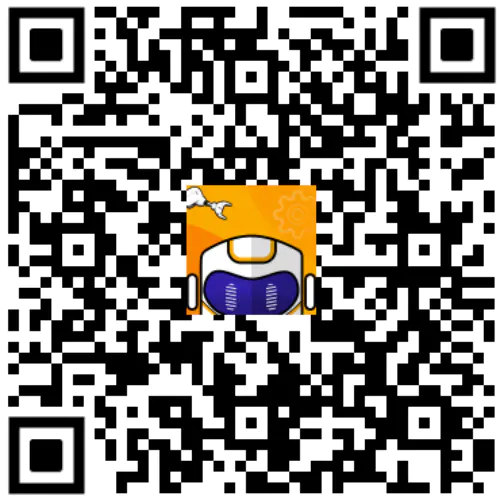

> [!NOTE]
>
> **Before using the APP, enable Bluetooth and Location Services in the phone settings.**
>
> **Use the Bluetooth button in the APP to pair and connect the device. Do not pair through the phone settings with a pairing key.**

1. Turn on the miniHexa power switch.

2. Open the **Wonderbot** mobile APP. Tap the  icon in the upper-left corner to select the robot type. Select **miniHexa** here.

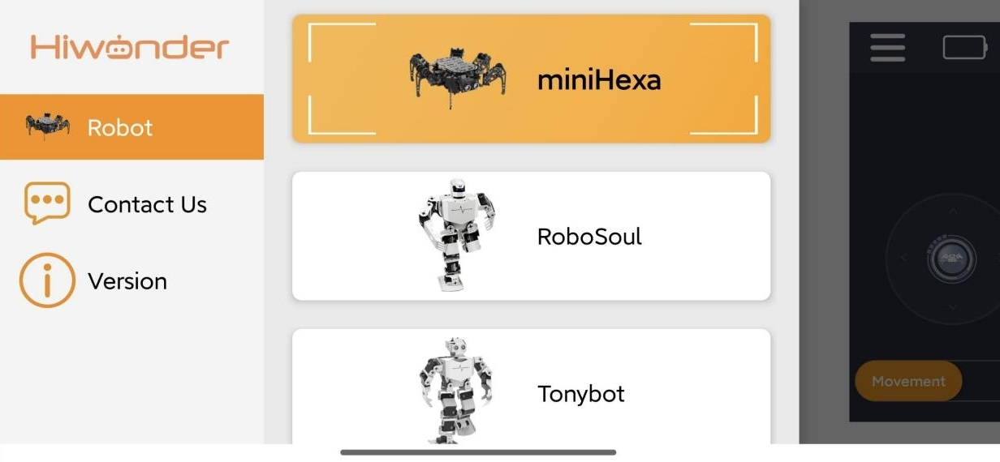

3. After selection, enter the feature interface. Tap the flashing  icon in the upper-right corner, find **miniHexa** in the Bluetooth list, then tap it to connect.

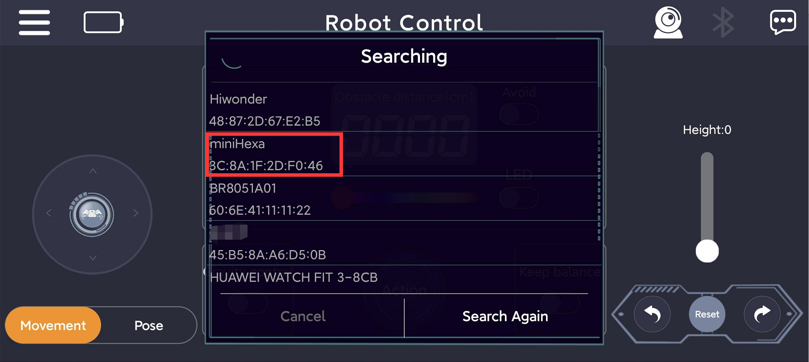

> [!NOTE]
>
> **If a name related to "miniHexa" is not displayed at first, tap "Search Again" to find the device.**

4. After the connection succeeds, the Bluetooth icon in the upper-right corner stays on, and the battery level appears on the left.

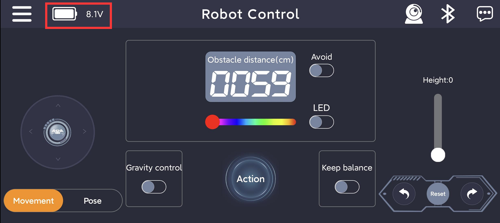

## 2.2 Feature Introduction

In Basic Control, miniHexa movement, posture adjustment, ultrasonic obstacle avoidance, action group execution, self-balancing, height adjustment, and reset can be controlled.

The interface is divided into two areas, as shown below:

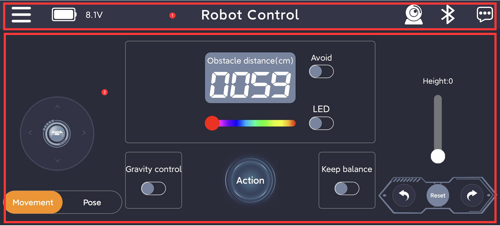

1. Menu Bar

| Icon | Function Description |
|:--:|:--:|
|  | Return to the main interface to select the robot type |
|  | Display the current miniHexa battery level in real time |
|  | Image transmission function. View the image returned by the ESP32-S3 AI vision module |
|  | Bluetooth connection. The icon flashes when disconnected and stays on after connection |
|  | More information |

2. Control Area

<table>
<colgroup>
<col style="width: 50%" />
<col style="width: 50%" />
</colgroup>
<tbody>
<tr>
<td style="text-align: center;">Icon</td>
<td style="text-align: center;">Function Description</td>
</tr>
<tr>
<td style="text-align: center;">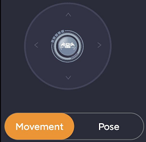</td>
<td style="text-align: center;">Controls miniHexa movement</td>
</tr>
<tr>
<td style="text-align: center;">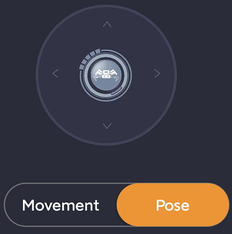</td>
<td style="text-align: center;">Controls the planar position point of the miniHexa body center</td>
</tr>
<tr>
<td style="text-align: center;"></td>
<td style="text-align: center;">Switches the corresponding control mode</td>
</tr>
<tr>
<td style="text-align: center;">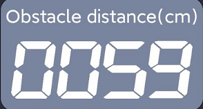</td>
<td style="text-align: center;">Displays the ultrasonic distance</td>
</tr>
<tr>
<td style="text-align: center;">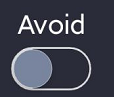</td>
<td style="text-align: center;">Switches the ultrasonic obstacle avoidance function on or off</td>
</tr>
<tr>
<td style="text-align: center;">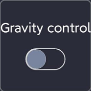</td>
<td style="text-align: center;">Controls the miniHexa body Euler angles through the phone gyroscope</td>
</tr>
<tr>
<td style="text-align: center;">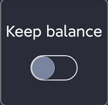</td>
<td style="text-align: center;">Switches the IMU self-balancing feature on or off</td>
</tr>
<tr>
<td style="text-align: center;"></td>
<td style="text-align: center;">Runs action groups</td>
</tr>
<tr>
<td style="text-align: center;">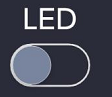</td>
<td style="text-align: center;">Switches the ultrasonic RGB lights on or off</td>
</tr>
<tr>
<td style="text-align: center;"></td>
<td style="text-align: center;">Adjusts the color of the ultrasonic RGB lights</td>
</tr>
<tr>
<td style="text-align: center;">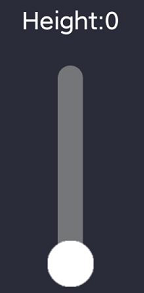</td>
<td style="text-align: center;">
Controls the standing height of miniHexa

Height adjustment range: 0-30
</td>
</tr>
<tr>
<td style="text-align: center;"></td>
<td style="text-align: center;">
The left and right sides control miniHexa left and right turning

The center resets miniHexa to the attention pose
</td>
</tr>
</tbody>
</table>

## 2.3 APP Program Download Instructions (Optional)

miniHexa is factory-flashed with the APP program. Downloading other feature programs overwrites the APP control function. To use this function again, download the program again.

1. Connect miniHexa to the PC with a Type-C data cable.

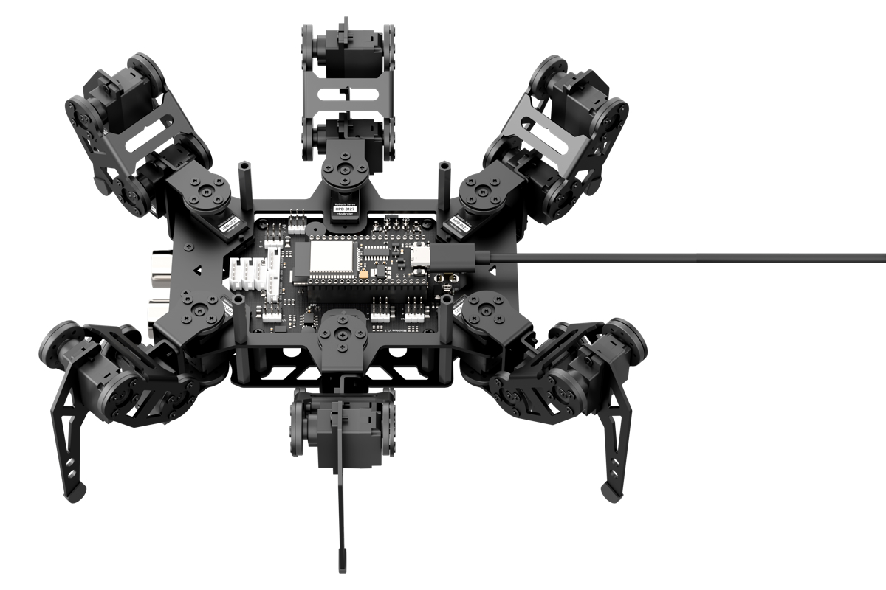

2. Open [**03 APP Program Files\remote\remote.ino**](https://drive.google.com/drive/folders/1s7fKEospJLvDZExfZjF4gAmH1fBm4nRb?usp=sharing), which is in the same path as this document.

3. After the file opens, select the development board model shown below.

4. Click **Tools** in the menu bar, then select the corresponding ESP32 development board configuration shown below.

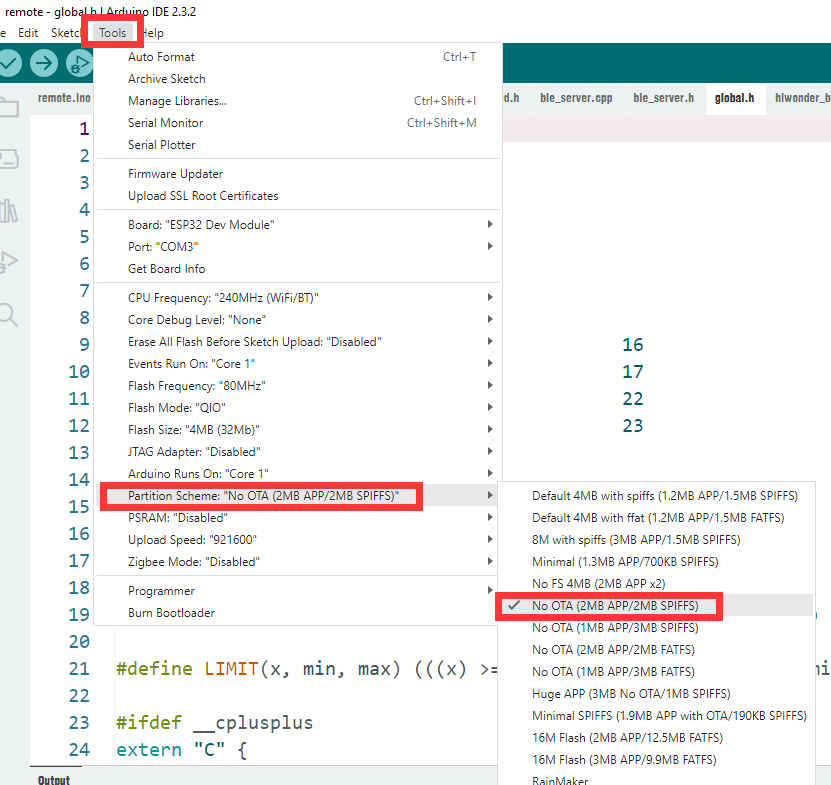

> [!NOTE]
>
> **Make sure the development board configuration is modified before downloading the program.**

5. Click **Compile** first, then click **Upload**. When the following screen appears in the output box at the bottom of the software after upload is complete, the program download is complete.

