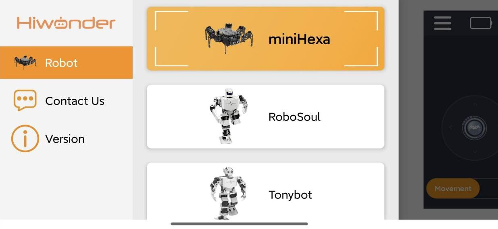

# 2. APP Control

The miniHexa comes with the App control program pre-installed, so you can start using it right away. The instructions below use Android as an example.

## 2.1 App Installation

iOS users: Download the app [Wonderbot](https://apps.apple.com/us/app/wonderbot-robot/id1519146341) in the App Store.

Android users: You can find the [Wonderbot](https://play.google.com/store/apps/details?id=com.Wonder.bot) installation package in the same directory as this section or in [Appendix->App Installation Package](Appendix.md), then install it on your phone.

:::{Note}
* Ensure that both Bluetooth and Location Services are enabled in your phone's settings before launching the app.
* Do not pair the device manually via system Bluetooth settings. Instead, use the Bluetooth button within the app to initiate pairing and connection.
:::

(1) Turn on the miniHexa power switch.

(2) Open the Wonderbot app, tap the icon  in the top-left corner, and select your robot model — miniHexa.

(3) Once selected, enter the control interface, tap the blinking icon  in the top-right corner, and select **miniHexa** from the Bluetooth device list.

If miniHexa does not appear in the list at first, tap **"Searching Again"** to refresh the list.

(4) Once connected, the Bluetooth icon in the top-right corner will stay solid, and the battery level will be displayed on the left side of the screen.

## 2.2 Function Introduction

In the basic control mode, you can manage miniHexa's movement, posture adjustment, ultrasonic obstacle avoidance, action group execution, self-balancing, height adjustment, and reset.

This interface is divided into two sections:

* **Menu Bar**

| **Icon** | **Function** |
|:--:|:---|
|  | Return to the main screen to select the robot type |
|  | Display the current battery level of miniHexa in real time |
|  | View live video from the ESP32S3 vision module |
|  | Bluetooth connection, blinking when disconnected, solid when connected |
|  | Additional information |

* **Control Area**

| **Icon** | **Function** |
|:--:|:---|
|  | Control miniHexa's movement |
|  | Control the planar position of miniHexa's body center |
|  | Switch between different control modes |
|  | Display distance measured by the ultrasonic sensor |
|  | Toggle ultrasonic obstacle avoidance on/off |
|  | Control miniHexa's Euler angles using the phone's gyroscope |
|  | Toggle IMU self-balancing mode on/off |
|  | Execute predefined action groups |
|  | Toggle ultrasonic RGB lights on/off |
|  | Adjust the color of the ultrasonic RGB lights |
|  | Adjust miniHexa's standing height Value range: 0 ~ 30 |
|  | Left/right sides: control miniHexa's turning. Center: reset to upright position |

## 2.3 App Program Download Instructions (Optional)

[Source Code](https://drive.google.com/drive/folders/1mNnrcIngyjdzhke1Y8t24vxM5DLOykgW?usp=sharing)

The miniHexa comes with the App control program pre-installed. Downloading other feature's program will overwrite the existing App control functionality. To use this feature again, you will need to re-download the App program.

(1) Connect miniHexa to your computer using a Type-C data cable.

(2) Open the program file located at: `2. App Control->2.3 App Program Files->remote->remote.ino`

(3) Select the development board model when you open the program, and the specific model is shown in the figure below.

(4) In the menu bar, click **"Tools"**, and choose the corresponding ESP32 controller configuration as illustrated.

:::{Note}
Make sure to set the correct controller configuration before uploading the program.
:::

(5) Click **"Compile"** first, then click **"Upload"**. After the upload is completed, the program download is completed if the following interface appears in the output box below the software.

