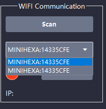
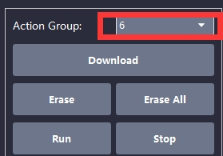
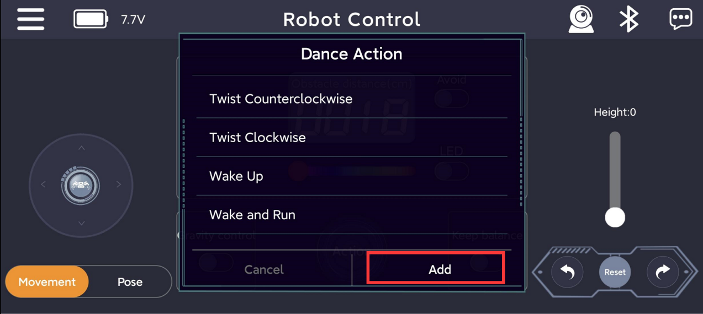

# 3. PC Control and Action Group Editing

## 3.1 Introduction to PC Software

### 3.1.1 Install Serial Driver

(1) Navigate to the folder: [Appendix-> PC Software Package-> Driver Files]() and double-click ch341ser.exe.

(2) Click the Install button. Once the installation is complete, a confirmation message will appear indicating that the driver has been successfully installed.

### 3.1.2 Launch PC Software

:::{Note}

The PC software is portable——no installation required. Ensure the driver is installed beforehand.

:::

(1) Open the folder: [Appendix->PC Software Package]() and locate miniHexa.exe.

(2) You can switch the software language in the top-left corner of the interface according to your preference.

### 3.1.3 Device Connection

* **Preparation**

:::{Note}

* Before proceeding, ensure that the factory program (App program) is already uploaded to the ESP32 controller. This program supports both App control and PC software control.
* miniHexa comes with the factory program pre-installed, allowing immediate use. If you has downloaded other programs that overwrite the factory program, the original factory program can be found at: 3.3 PC Software Program Files. Refer to section 5. APP Program Download Instructions (Optional) in this document for instructions on re-uploading the factory program.

:::

(1) Turn on the miniHexa power switch.

* **Serial Connection**

(1) After powering on the robot, connect miniHexa to your computer using a Type-C data cable.

(2) Open the PC software and select the corresponding device port to connect.

(3) When the red circular icon turns green, the connection is successful.

* **Wi-Fi Connection**

:::{Note}

To connect via Wi-Fi, a hotspot must be prepared before powering on the robot, both Wi-Fi router and mobile hotspot supported. The hotspot name and password should both be set to “hiwonder”.

:::

(1) Power on miniHexa. It will automatically search for the hotspot named “hiwonder” and attempt to connect using the password “hiwonder”. Once the robot connects, connect your computer to the same hotspot.

(2) Open the PC software and click **Scan**. The software will automatically detect miniHexa.

(3) After scanning, miniHexa will appear in the device list. Select it and click **Connect**.

(4) When the red circular icon turns green and the device IP of miniHexa is displayed, the connection is successful.

### 3.1.4 Function Overview

The PC software allows interaction with miniHexa in three modes, each providing different functions:

(1) General Mode – Used to control omni-directional movement of miniHexa.

(2) Attitude Mode – Used to adjust miniHexa’s posture and center of gravity.

(3) Action Edit – Adjust miniHexa’s servo deviations and edit/download its action groups.

:::{Note}

Detailed instructions for Deviation Mode can be found in: [4. Arduino IDE Installation & Servo Calibration->4.2 Servo Calibration]().

:::

Detailed instructions for General Mode and Attitude Mode are presented in sections [3.2 Omnidirectional Movement Control]() and  [3.3 Posture Control]() .

Detailed instructions for Action Edit are presented in sections 3.4–3.8 under the folder [3. PC Control and Action Group Editing]().

### 3.1.5 APP Program Download Instructions (Optional)

The miniHexa comes with the App control program pre-installed. Downloading other feature’s program will overwrite the existing App control functionality. To use this feature again, you will need to re-download the App program.

(1) Connect miniHexa to your computer using a Type-C data cable.

(2) Open the program file located at: [PC Software Program Files\remote\remote.ino]().

(3) Select the development board model when you open the program, and the specific model is shown in the figure below.

(4) In the menu bar, click **Tools**, and choose the corresponding ESP32 controller configuration as illustrated.

:::{Note}

Make sure to set the correct controller configuration before uploading the program.

:::

(5) Click "**Compile**” first, then click "**Upload**". After the upload is completed, the program download is completed if the following interface appears in the output box below the software.

## 3.2 Omnidirectional Movement Control

### 3.2.1 Overview

In General Mode, you can move the miniHexa robot in any direction on the X-Y plane, move along the positive or negative Z-axis, and rotate in place to the left or right.

### 3.2.2 Interface Description

① In-Place Rotation Control

|                           **Icon**                           |              **Function**               |
| :----------------------------------------------------------: | :-------------------------------------: |
|  |  Rotate the robot in place to the left  |
|  | Rotate the robot in place to the right  |
|  | Restore the robot to the attention pose |

② 2D Movement Control

|                           **Icon**                           |                         **Function**                         |
| :----------------------------------------------------------: | :----------------------------------------------------------: |
|  |            Move the robot forward (Y+ direction)             |
|  |            Move the robot backward (Y- direction)            |
|  |          Move the robot to the left (X- direction)           |
|  |          Move the robot to the right (X+ direction)          |
|  |                Immediately stop all movement                 |
|  | Control the robot to move in any angle from 0–360°, enabling omni-directional movement |

③ Height Control

|                           **Icon**                           |                         **Function**                         |
| :----------------------------------------------------------: | :----------------------------------------------------------: |
|  | Adjust the robot’s standing height, which is the movement along the Z-axis |

## 3.3 Posture Control

### 3.3.1 Overview

In Attitude Mode, you can adjust the miniHexa robot’s center of gravity and posture within a three-dimensional coordinate system.

### 3.3.2 Interface Description

* **Reset Control**

|                           **Icon**                           |              **Function**               |
| :----------------------------------------------------------: | :-------------------------------------: |
|  | Restore the robot to the attention pose |

* **Center of Gravity Control**

When controlling the center of gravity, the robot remains stationary and level. By moving the joystick, you can shift the entire body in a specific direction, which is known as center of gravity translation.

|                           **Icon**                           |                         **Function**                         |
| :----------------------------------------------------------: | :----------------------------------------------------------: |
|  | Controls the robot to shift its center of gravity in any direction from 0–360° while staying stationary |
|  | Controls the robot to shift its center of gravity vertically along the Z-axis while staying stationary |

* **Posture Control**

When controlling posture, the robot remains stationary with a fixed center of gravity. By moving the joystick, you can rotate the entire body around any of the X, Y, or Z axes, which is known as posture rotation.

|                           **Icon**                           |                         **Function**                         |
| :----------------------------------------------------------: | :----------------------------------------------------------: |
|  | Rotates the robot’s posture around the X or Y axis while staying stationary |
|  | Rotates the robot’s posture around the Z axis while staying stationary |

## 3.4 Action Group Editing – Feature Overview

### 3.4.1 Launch PC Software

:::{Note}

The PC software is portable——no installation required. Ensure the driver is installed beforehand.

:::

(1) Open the folder: [Appendix->PC Software Package]() and locate MiniHexa.exe.

(2) Copy it to any directory, then double-click to open the program.

(3) You can switch the software language in the top-left corner of the interface according to your preference.

### 3.4.2 Device Connection

:::{Note}

The following steps use a serial connection as an example. For Wi-Fi connection, see the file [3.1 Introduction to PC Software]().

:::

(1) Turn on the miniHexa controller.

(2) Use a USB cable to connect to the Type-C port on the core board.

(3) Launch the PC software and select the COM port corresponding to your device.

(4) When the red circular icon turns green, the connection is successful.

(5) From the menu bar, click **Action Edit** to enter the editing interface.

### 3.4.3 Function Description

**① Device Connection Status**

|                           **Icon**                           |                         **Function**                         |
| :----------------------------------------------------------: | :----------------------------------------------------------: |
|  | Displays the current connection status of the device. The icon turns green indicating that the device is successfully connected, while red indicating that the device is disconnected or not detected and the message “Disconnect” will appear. |

**② Servo Control Area**

The servo control area displays the icons of the selected servos. By adjusting the corresponding slider values, you can directly control the position of each servo.

|                           **Icon**                           |                         **Function**                         |
| :----------------------------------------------------------: | :----------------------------------------------------------: |
|  | Indicates the servo ID number, for example, ID 18 is used as an example here. |
|  |  Adjust the servo position, with a range from 500 to 2500.   |

**③ Action Details List**

This section displays the details of the current action group, including the execution time for each action and the values of all involved servos.

|                           **Icon**                           |                         **Function**                         |
| :----------------------------------------------------------: | :----------------------------------------------------------: |
|  |   The frame number of each action within an action group.    |
|  |  Indicates the execution time for the corresponding action.  |
|  | The action value or position value corresponding to the given servo ID. |

**④: Action Group Settings**

<table  class="docutils-nobg" style="margin:0 auto" border="1">
<colgroup>
<col  />
<col  />
</colgroup>
<tbody>
<tr>
<td ><strong>Icon</strong></td>
<td ><strong>Function</strong></td>
</tr>
<tr>
<td ></td>
<td >Dropdown menu to select Action group number. Click to choose an action group number between 0 and 254.</td>
</tr>
<tr>
<td ></td>
<td >Download the current list of actions to the controller, which will overwrite the original actions in the selected action group.</td>
</tr>
<tr>
<td ></td>
<td >Erase all actions in the currently selected action group.</td>
</tr>
<tr>
<td ></td>
<td >Use with caution! Click to erase all actions in groups 0 to 254.</td>
</tr>
<tr>
<td ></td>
<td >Execute the selected action group once.</td>
</tr>
<tr>
<td ></td>
<td >Stop the currently running action group.</td>
</tr>
<tr>
<td ></td>
<td >Add the current servo values from the Servo Control Area as a new action to the last row of the Action Details List.</td>
</tr>
<tr>
<td ></td>
<td >Delete the selected action from the Action Details List.</td>
</tr>
<tr>
<td ></td>
<td >
Replace the selected angle values in the Action Details List.

The angle values will be replaced with those in the center Servo Control Area, and the duration will be replaced by the value in “Duration(ms)”.
</td>
</tr>
<tr>
<td ></td>
<td >
Insert a new action above the selected action.

The inserted action will use the servo values from the center Servo Control Area and the duration set in “Duration(ms)”.
</td>
</tr>
<tr>
<td ></td>
<td >Move the selected action one position earlier in the Action Details List.</td>
</tr>
<tr>
<td ></td>
<td >Move the selected action one position later in the Action Details List.</td>
</tr>
<tr>
<td ></td>
<td >Open an action group file in .rob format. For our provided files, see 2. Software\10. Action Group Files.</td>
</tr>
<tr>
<td ></td>
<td >Save the actions currently in the Action Details List to a specified location.</td>
</tr>
<tr>
<td ></td>
<td >After opening one action group file, click the "Integrate File" button to load another file and combine the two into a new group.</td>
</tr>
<tr>
<td ></td>
<td >Click to run the actions in Action Details List once. If “Loop” is checked, the robot will repeat the sequence.</td>
</tr>
<tr>
<td ></td>
<td >Display the duration of the currently selected frame in the Action Details List.</td>
</tr>
<tr>
<td ></td>
<td >Display the total cumulative duration of all frames in the current Action Details List.</td>
</tr>
</tbody>
</table>

**⑤ Action Group Settings Area**

The servo control area displays the icons of the selected servos. By adjusting the corresponding slider values, you can directly adjust the deviation of each servo.

|                           **Icon**                           |                         **Function**                         |
| :----------------------------------------------------------: | :----------------------------------------------------------: |
|  |            Read the deviation value of the servo.            |
|  | Download the current servo deviations to the controller. Once downloaded, all previous servo actions will be overwritten. |
|  | Reset all servos to the central position at the value of 1500. |

## 3.5 Execute and Download Actions

### 3.5.1 Objective

Use the PC software to burn the “**No.6 Obstacle Crossing**” action group file into the miniHexa’s controller and run it once.

### 3.5.2 Download an Action 

:::{Note}

Do not separate the ESP32 main controller from the control board when downloading action groups.

:::

(1) Turn on the miniHexa.

(2) Connect it to the computer using a USB cable.

(3) Switch to the Action Edit tab in the software.

(4) In the Action Edit tab, go to the folder [Appendix-> Action Group Files]() and select the action group file you want to download.

(5) In the action group list, choose the storage slot where the file will be saved. Here, select slot 6.

(6) Click **Download**. The action group will be automatically transferred to the robot.

### 3.5.3 Execute an Action

* **Method 1**

(1) As learned earlier, turn on the robot and connect it to the computer.

(2) Open the PC software and click **Open action file**. Navigate to [Appendix->Action Group Files]() and select the **No.6 Obstacle Crossing** file.

(3) Click the button  .The robot will immediately execute the action group once.

:::{Note}

 If you check the Loop option, the robot will repeat the action continuously.

:::

*  **Method 2**

(1) Turn on the robot and connect it to the computer.

(2) Double-click to launch the PC software. In the Action Group drop-down menu, select number 6.

(3) Click the **Run** button. The robot will immediately execute Action Group No.6 once.

:::{Note}

To use this method, the action group must have been previously downloaded to the robot.

:::

* **Other Methods**

miniHexa also supports other ways to call action group files, such as:

① Calling action groups via the app, see the file [3.8 App Custom Control]().

② Calling action groups via serial commands, see the folder [9. Serial Communication Hands-on Course]().

## 3.6 Action Editing

### 3.6.1 Objective

Create a 9-step action group called **“Wave”**.

:::{Note}

This example is for tutorial purposes only, designed to help you quickly learn action editing. For reference to standard action groups, see the folder [Appendix->Action Group Files]().

:::

### 3.6.2 Implement the Action

(1) Turn on the miniHexa.

(2) Connect it to the computer using a USB cable.

(3) Switch to the Action Edit tab in the software.

* **Editing Actions**

(1) Open Action Group **No.6 Obstacle Crossing** and keep only the first action. This becomes your first action.

(2) Raise the robot’s right leg by adjusting the slider for Servo ID 8 to the values shown below.

:::{Note}

To adjust the value, hold down the left mouse button and drag the slider. For fine-tuning, quickly click on the left or right side of the slider.

:::

(3) Click **Add action** to add this initial leg-bending motion to the Action Details List.

(4) Raise the lower part of the right leg by adjusting Servo ID 9 to the values shown, then click **Add action**.

(5) Lower the lower part of the right leg to create the waving effect. Adjust Servo ID 9 to the values shown, then click **Add action**.

(6) Repeat steps 3–4 twice more to create the next two actions.

(7) Finally, return the leg to its initial position. Click the first action in the list to reset the leg, then click **Add action**.

* **Download the Action Group**

(1) After completing the actions, save them locally for future testing or modification. Click **Save action file**, enter the file name and number (in this example: “**No.20 Wave**”), and save it. As shown in the figure below:

(2) Next, download the saved actions to the corresponding action groups. On the right side of the interface, select action group number 22, then click **Download**.

(3) After the download is complete, a pop-up will appear to indicate the download completed. Click “**OK**” to close the pop-up.

## 3.7 Integrating Action Files

### 3.7.1 Objective

In this section, you will learn how to integrate action group files on miniHexa, combining multiple action groups into one.

### 3.7.2 Implementation

(1) Turn on the miniHexa.

(2) Connect it to the computer using a USB cable.

:::{Note}

If the controller is running the factory program, briefly press the K1 button on the servo controller once after powering on to switch the working mode. When the buzzer beeps twice, the robot enters PC software control mode and is ready to process user commands from the PC software.

:::

(3) Launch the PC software and connect to the serial port. Click “**Integrate file**” in the Action Group Settings area. Open Action Group 6 located under the path: [Appendix->Action Group Files]().

(4) The parameters of Action Group 6 are displayed in the Action Details List.

(5) Click “**Integrate file**” again, and this time select Action Group 14 to append it to the current list.

  

(6) You can click  to test the newly integrated action group in real time.

(7) To save the integrated action group for future debugging, click “**Save action file**”. The file is named **No.21 Obstacle Crossing Followed by Wave** in this example.

:::{Note}

If too many actions are concatenated, the PC software will display a limit warning. In this case, the action group cannot be downloaded to the controller and can only be run online for preview.

:::

## 3.8 App Custom Control

### 3.8.1 Objective

In this section, you will learn to use the mobile app to execute the action group “**No.20 Wave**”, which was created in the file [3.6 Action Editing]().

### 3.8.2 Implementation

* **Preparation**

(1) Make sure Bluetooth and location services are enabled on your phone.

(2) Confirm that Action Group No.20 has been successfully downloaded to miniHexa. The PC software will display a confirmation when the download is complete.

* **Operation Steps**

(1) Turn on the miniHexa to power it up.

(2) Open the **Wonderbot** app on your phone and connect to the device.

(3) On the main screen, tap the **Action** button.

(4) In the pop-up screen, tap **Add**.

(5) In the form that appears, enter an action group name and action group number. The name can be anything you like, but the action group number must be entered correctly or the action will not work.

(6) After adding, tap **Action** again to open the **Custom Action Group** interface. Tap the action name button to execute the action once.

(7) To modify or delete an action, long-press the action name button and select **Delete**.

