# 3. PC Control and Action Group Editing

## 3.1 PC Software Introduction

### 3.1.1 Install the Serial Port Driver

1) Double-click [**02 PC Software Installation Package\01 Driver\ch341ser.exe**](https://drive.google.com/drive/folders/1qN7LtmMBUqRqhJRAbwXvCm2j593ODaK7?usp=sharing).

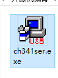

2) Click **Install**. After installation succeeds, a message appears indicating that the driver has been installed successfully.

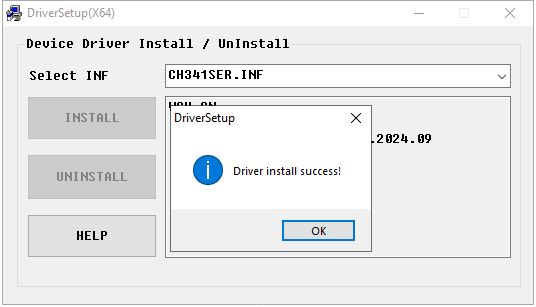

### 3.1.2 Launch the Software

:::{Note}
**The PC software is portable and does not need installation. Install the driver on the PC before use.**
:::

1) Find the PC software [**02 PC Software Installation Package\02 PC Software\MiniHexa.exe**](https://drive.google.com/drive/folders/1mL_xzRC31Jd9fkhl4Ro52ILncmW3Jg3U?usp=sharing).

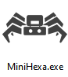

2) Switch the software language in the top-left corner of the interface as needed.

### 3.1.3 Device Connection

#### Preparation

:::{Note}
* **Before this step, make sure the factory APP program has been flashed to the ESP32 controller. This program supports both APP control and PC software control.**
* **miniHexa is preloaded with the factory program before shipment and can be powered on for direct operation. If another program has overwritten it, find the factory program in [03 PC Software Program Files](https://drive.google.com/drive/folders/16SWjUtvrDMPfkTLHSJdKKmKxgA4cDKFW?usp=sharing) and download it again. For the download method, see [3.1.5 APP Program Download Instructions (Optional)](#anther3.1.5).**
:::

1) Turn on the miniHexa power switch.

* **Serial Port Connection**

1) After the robot powers on, connect miniHexa to the PC with a Type-C data cable.

2) Open the PC software, then select the corresponding device port for connection.

3) Check that the red circular icon turns green. This indicates a successful connection.

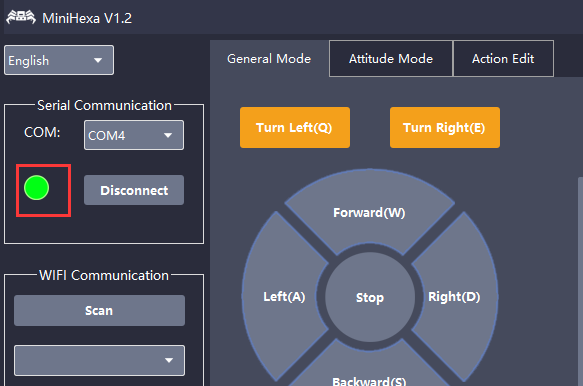

* **Wi-Fi Connection**

:::{Note}
**To connect the robot in this way, prepare a hotspot before powering on the robot. A Wi-Fi router or mobile hotspot can be used. Set both the hotspot name and password to "hiwonder".**
:::

1) After the robot powers on, it automatically searches for and connects to the hotspot named **hiwonder** with the password **hiwonder**. Wait a moment, then connect the PC to the same hotspot.

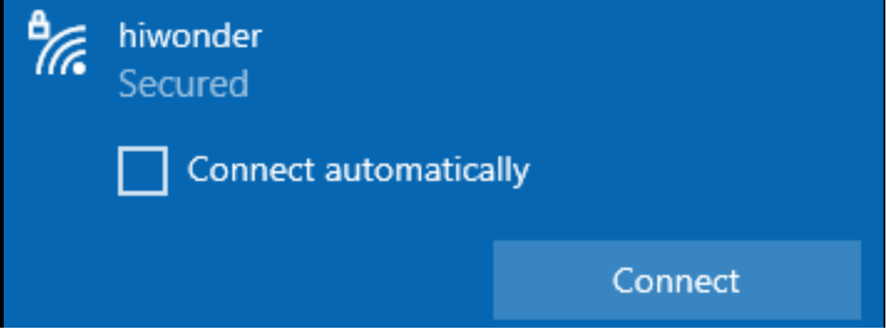

2) After the hotspot connection succeeds, open the PC software and click **Scan**. The software automatically matches miniHexa.

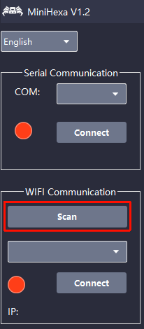

3) After scanning is complete, the miniHexa device option appears in the option bar below. Select it, then click **Connect**.

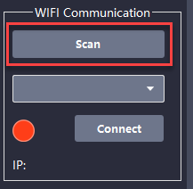

4) Check that the red circular icon turns green and that the device IP shows the miniHexa IP address. This indicates a successful connection.

### 3.1.4 Feature Overview

The PC software interacts with miniHexa in three modes for different functions:

1) General Mode: controls miniHexa omnidirectional movement.

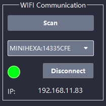

2) Attitude Mode: controls the posture and center of gravity of miniHexa.

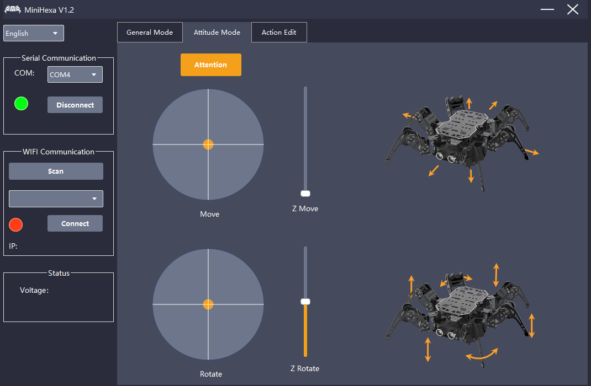

3) Action Edit: adjusts miniHexa servo deviation and edits or downloads miniHexa action groups.

:::{Note}
**For details about Deviation Mode in the PC software, see [5.1 Arduino IDE Installation and Deviation Calibration\5.1.2 Deviation Calibration](https://drive.google.com/drive/folders/1_sjERc-lw-v9gUabl3QbM24jkGcvWKrN?usp=sharing). This section does not explain it further.**
:::

The **General Mode** and **Posture Control** modes in the PC software are introduced in [3.2 Omnidirectional Movement Control](#anther3.2) and [3.3 Posture Control](#anther3.3).

The **Action Edit** mode in the PC software is introduced in sections **3.4-3.7**.

### 3.1.5 APP Program Download Instructions (Optional)

The miniHexa is factory-flashed with the APP program. Downloading other feature programs will overwrite the APP control function. To use this function again, download the program again.

1) Connect miniHexa to the PC with a Type-C data cable.

2) Open [**03 PC Software Program Files\remote\remote.ino**](https://drive.google.com/drive/folders/1yruiHCUgS6uSqDsVWiONNdxExU9UQBUs?usp=sharing), which is in the same path as this document.

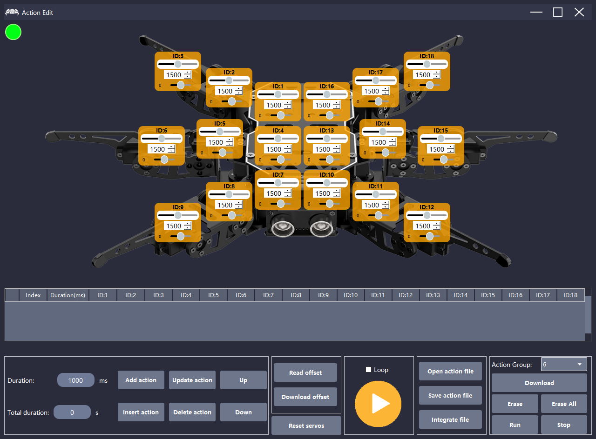

3) After the file opens, select the development board model shown below.

4) Click **Tools** in the menu bar, then select the corresponding ESP32 development board configuration shown below.

:::{Note}
**Make sure the development board configuration is modified before downloading the program.**
:::

5) Click **Compile** first, then click **Upload**. When the following screen appears in the output box at the bottom of the software after upload is complete, the program download is complete.

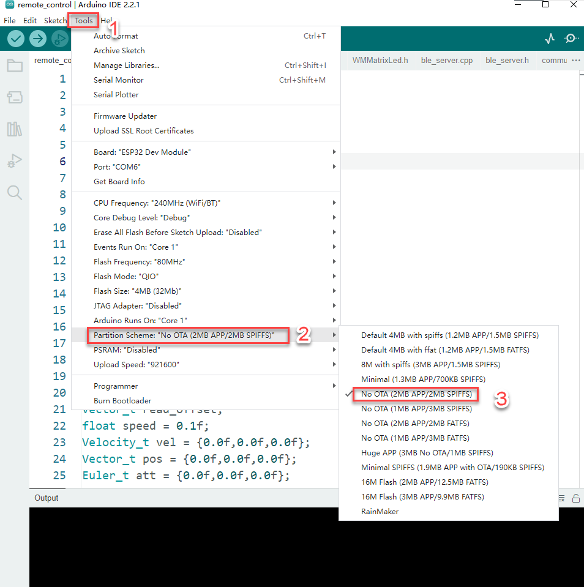

## 3.2 Omnidirectional Movement Control

### 3.2.1 Omnidirectional Movement Overview

In **General Mode**, the miniHexa robot can move in any direction on the X-Y plane in a three-dimensional coordinate system, move in the positive or negative Z-axis direction, and rotate left or right in place.

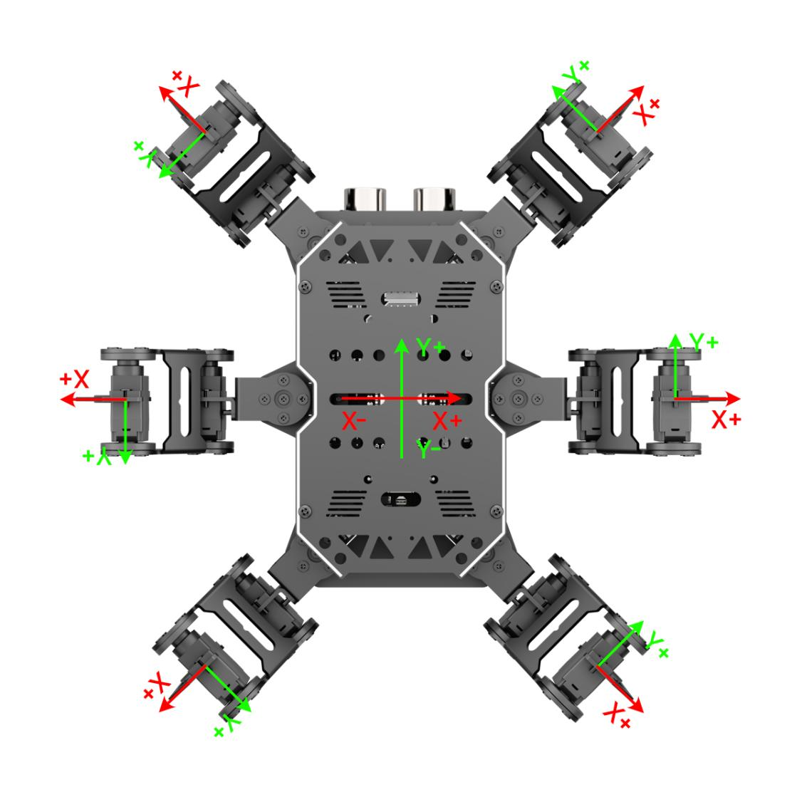

### 3.2.2 Interface Description

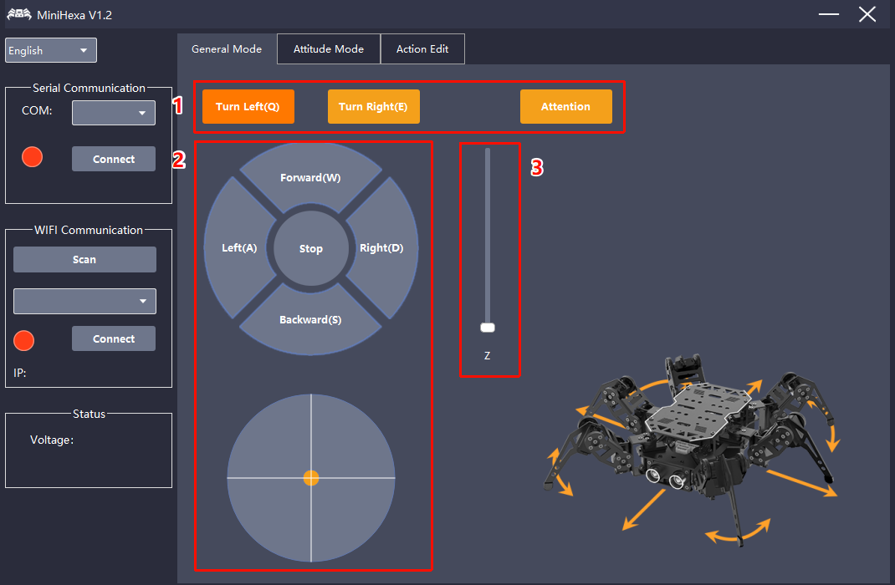

* **In-Place Rotation Control**

| **Icon** | **Function** |
|:--:|:--:|
| | Rotate the robot left in place |
| | Rotate the robot right in place |
| | Restore the robot to the attention pose |

* **2D Movement Control**

| **Icon** | **Function** |
|:--:|:--:|
|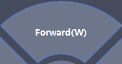 | Move the robot forward in the Y+ direction |
|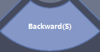 | Move the robot backward in the Y- direction |
|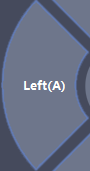 | Move the robot left in the X- direction |
|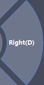 | Move the robot right in the X+ direction |
|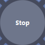 | Stop the robot immediately |
|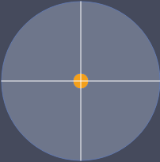 | Control the robot to move at any heading from 0 to 360 degrees for omnidirectional movement |

* **Height Control**

| **Icon** | **Function** |
|:--:|:--:|
| | Control the standing height of the robot by moving along the Z-axis |

## 3.3 Posture Control

### 3.3.1 Posture Control Overview

In **Posture Control** mode, the miniHexa robot can control its center of gravity and posture in a three-dimensional coordinate system.

### 3.3.2 Interface Description

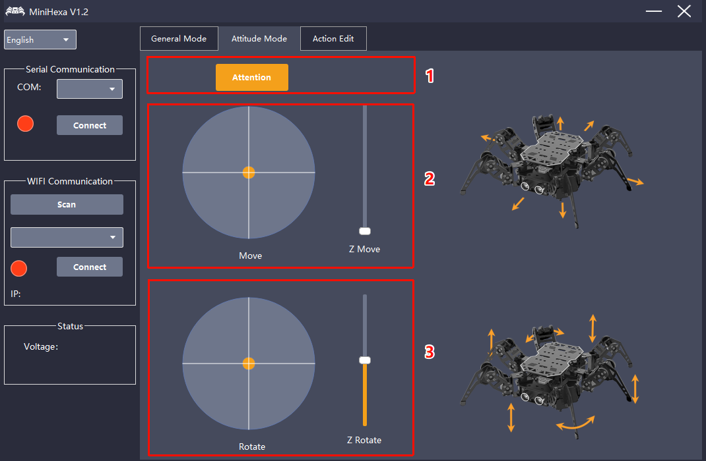

* **Reset**

| **Icon** | **Function** |
|:--:|:--:|
| | Restore the robot to the attention pose |

* **Center of Gravity Control**

When controlling the center of gravity, the robot stands still in place and keeps a level posture. Drag the joystick to shift the whole body in the specified direction. This is center of gravity translation.

| **Icon** | **Function** |
|:--:|:--:|
|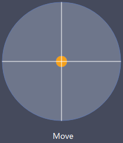 | Control the robot to shift its center of gravity at any angle from 0 to 360 degrees while standing still |
| | Control the robot to shift its center of gravity along the Z-axis while standing still |

* **Posture Control**

When controlling posture, the robot stands still in place and keeps its center of gravity unchanged. Drag the joystick to rotate the whole body around any X, Y, or Z coordinate axis. This is posture twisting.

| **Icon** | **Function** |
|:--:|:--:|
|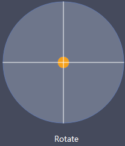 | Control the robot posture by rotating around the X/Y axes while standing still |
| | Control the robot posture by rotating around the Z-axis while standing still |

## 3.4 Action Group Download and Editing Feature Overview

### 3.4.1 Launch the Software

:::{Note}
**The PC software is portable and does not need installation. Install the [driver](https://drive.google.com/drive/folders/1qN7LtmMBUqRqhJRAbwXvCm2j593ODaK7?usp=sharing) on the PC before use.**
:::

1. Find the PC software [**MiniHexa.exe**](https://drive.google.com/drive/folders/1mL_xzRC31Jd9fkhl4Ro52ILncmW3Jg3U?usp=sharing).

2. Copy it to any folder, then double-click it to use it.

3. Switch the software language in the top-left corner of the interface as needed.

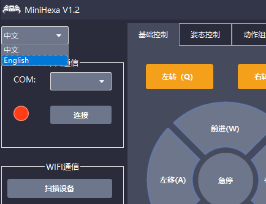

### 3.4.2 Device Connection

:::{Note}
**This section uses serial port connection as an example. For the Wi-Fi connection method, see [3.1 PC Software Introduction](#anther3.1).**
:::

1) Turn on the miniHexa controller board switch.

2) Use a USB cable to connect the Type-C port on the core board.

3) Open the PC software, then select the corresponding device port.

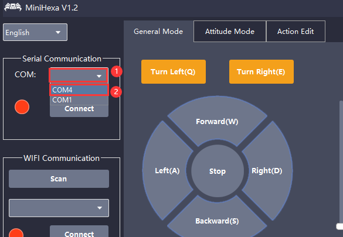

4) Check that the red circular icon turns green. This indicates a successful connection.

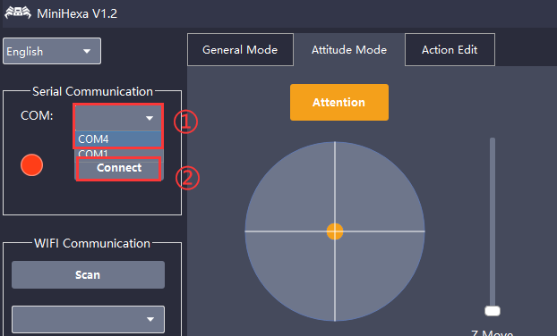

5) Find **Action Edit** in the menu bar and click it to enter the mode.

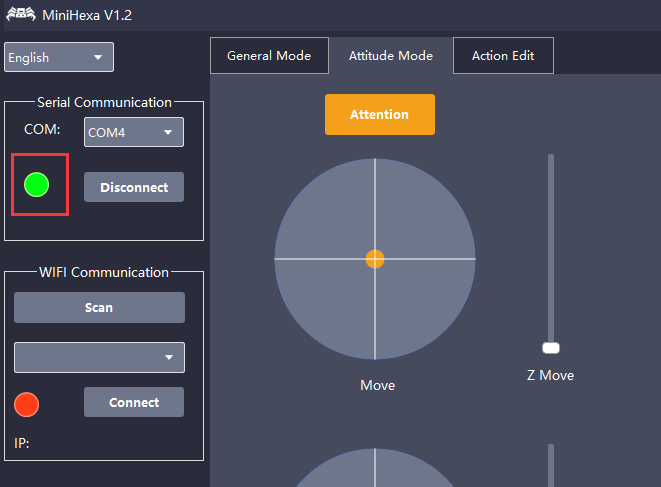

### 3.4.3 Action Edit Feature Description

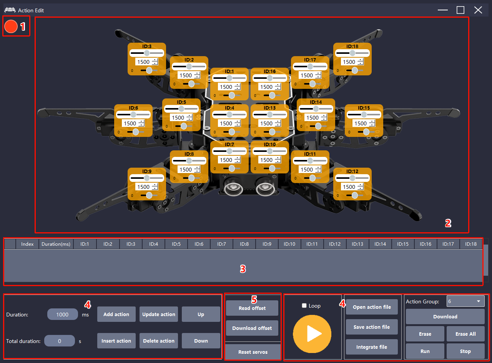

**1.Device Connection Status**

| Icon | Function |
|:---|:---|
| | Displays the device connection status. Green indicates a successful connection. Red indicates that the device is not connected or has disconnected, and the prompt **Wired Not Connected** appears. |

**2.Servo Control Area:**

The Servo Control Area displays the selected servo icons. Adjust the corresponding slider value to adjust the servo position.

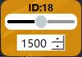

| Icon | Function |
|:--:|:--:|
| | Indicates the servo ID number. ID 18 is used as an example here. |
|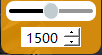 | Adjusts the servo position. The minimum value is 500, and the maximum value is 2500. |

**3.Action Group Detail List**

The Action Group Detail List shows the duration of each action in the current action group and the servo values in each action.

| Icon | Function |
|:--:|:--:|
|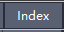 | Frame number of each action in an action group. |
| | Duration of the action, which is the time required to execute the action. |
|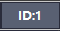 | Action value under the corresponding ID, which is the position value. |

**4.Action Group Settings Area**

| Icon | Function |
|:--:|:--:|
|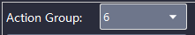 | Action group number selection button. Click it to select a number from 0 to 254. |
| | Downloads the actions in the current list to the controller board. After download, the original actions in that action group are overwritten. |
| | Erases the actions in the currently selected action group. |
| | Use with caution. Erases all actions in action groups 0 to 254. |
| | Runs the action group with the selected number once. |
| | Stops the action group that is currently running. |
| | Adds the servo values in the Servo Control Area as an action to the last row of the Action Group Detail List. |
| | Deletes the selected action from the Action Group Detail List. |
|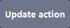 | Replaces the selected angle values in the Action Group Detail List. The angle values are replaced with the servo values in the center Servo Control Area, and the action duration is replaced with the time set in **duration(ms)**. |
| | Inserts one action row above the selected action. The action duration is the time set in **duration(ms)**, and the angle values are the servo values in the center Servo Control Area. |
| | Moves the selected frame in the Action Group Detail List up and swaps its execution order with the previous frame. |
| | Moves the selected frame in the Action Group Detail List down and swaps its execution order with the next frame. |
| | Opens an action group file saved in .rob format. For the provided action group files, see **2. Software\10. Action Group Files**. |
| | Saves the actions currently in the Action Group Detail List to a specified location. |
| | After one action group is opened, click the Integrate Action File button to continue opening another action group file and integrate the two action group files into a new action group. |
|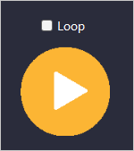 | Click this button to run the actions in the Action Group Detail List once. If **Loop** is selected, the robot repeats the action. |
|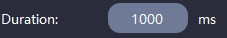 | Duration of the selected frame in the current **Action Group Detail List** area. |
|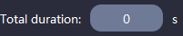 | Total accumulated duration of all frames in the current **Action Group Detail List** area. |

**5.Deviation Settings Area**

The Servo Control Area displays the selected servo icons. Adjust the corresponding slider value to adjust the servo deviation.

| Icon | Function |
|:--:|:--:|
| | Reads the robot servo deviations. |
| | Downloads the current robot servo deviations to the controller board. After download, the original actions of all servos are overwritten. |
| | Restores all robot servos to the central position value of 1500. |

## 3.5 Action Group Download Tutorial

### 3.5.1 Objective

Download the reference sample action group file in [**2. Software\10. Action Group Files**](https://drive.google.com/drive/folders/1bR30Kn7b84IqUfwQ5Mr-kZmwecwTGkwo?usp=sharing) to miniHexa.

### 3.5.2 Action Download

1) Turn on the miniHexa switch.

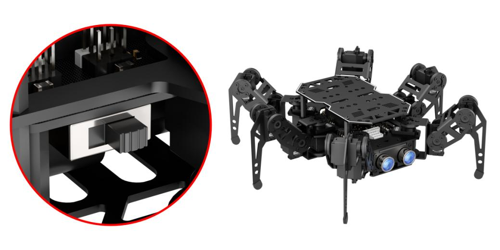

2) Connect it to the PC with a USB cable.

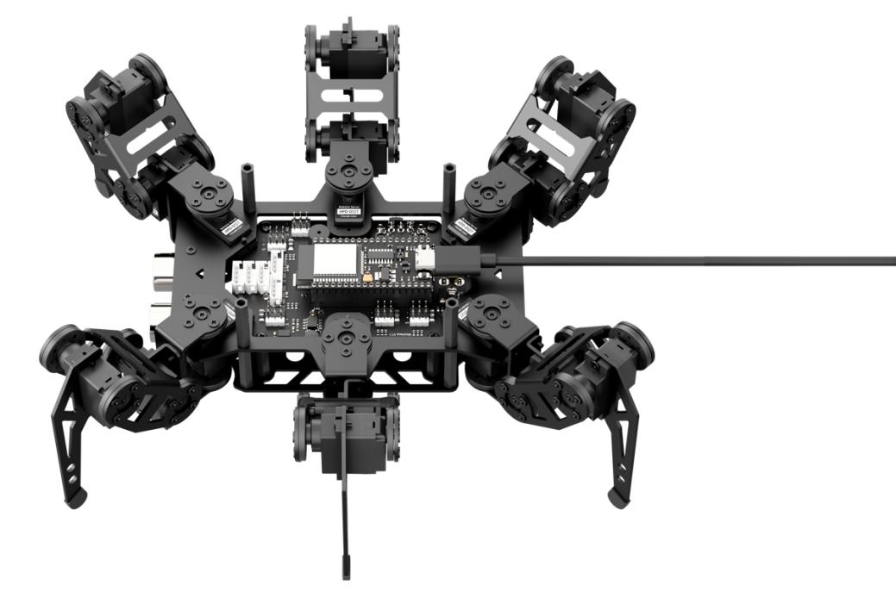

3) Click to switch to the Action Edit area.

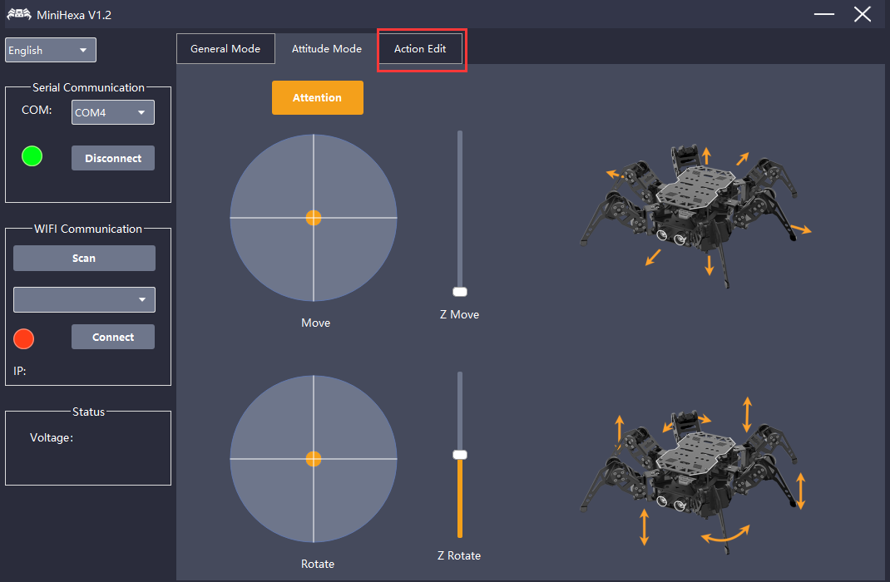

4. The following uses downloading Action Group 6 as an example. First change the action group number to 6. Make sure the download number matches the action group.

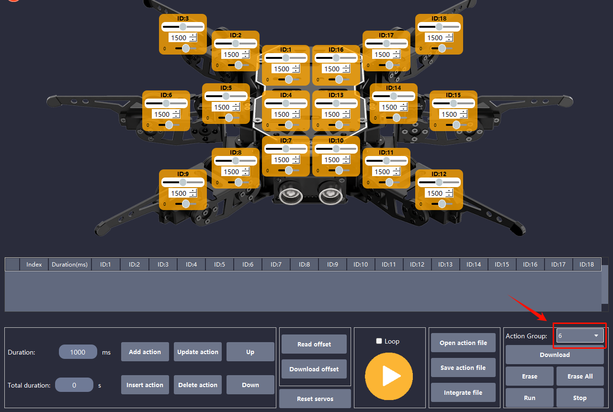

5. Click **Open Action Group**, select the corresponding action group path [**2. Software\10. Action Group Files**](https://drive.google.com/drive/folders/1bR30Kn7b84IqUfwQ5Mr-kZmwecwTGkwo?usp=sharing), select Action Group 6, then open it.

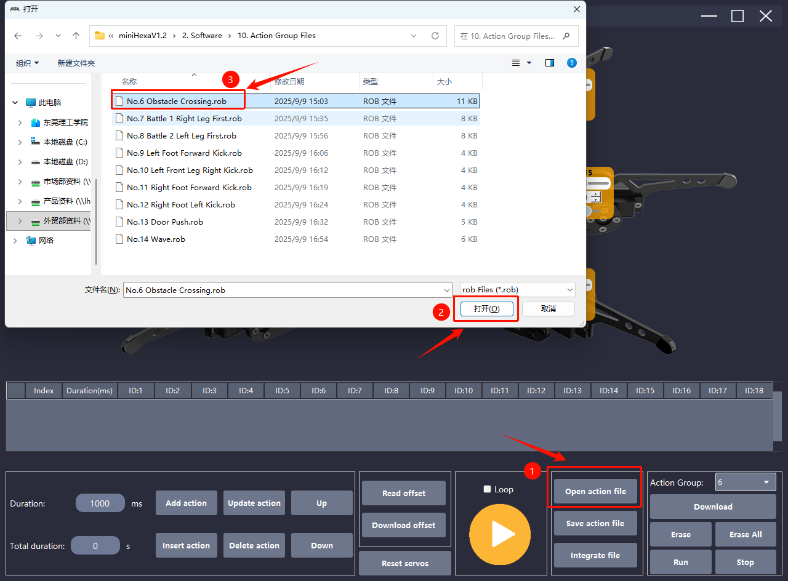

6. Click **Download** to download the action group to the miniHexa.

## 3.6 Action Editing

### 3.6.1 Objective

Create a **Wave** action group consisting of 9 actions.

:::{Note}
**The actions in this section are only examples and are intended to help quickly learn the Action Edit feature. To reference standard actions, go to the reference sample action group files in [2. Software\10. Action Group Files](https://drive.google.com/drive/folders/1bR30Kn7b84IqUfwQ5Mr-kZmwecwTGkwo?usp=sharing).**
:::

### 3.6.2 Action Implementation

1) Turn on the miniHexa switch.

2) Connect it to the PC with a USB cable.

3) Click to switch to the Action Edit area.

* **Action Editing**

1) Switch to the Action Edit area, open **No. 6 Obstacle Crossing**, and keep only the first action. This creates the first action.

2) Raise the robot's right leg. Slide the slider for servo ID 8 to the value shown below.

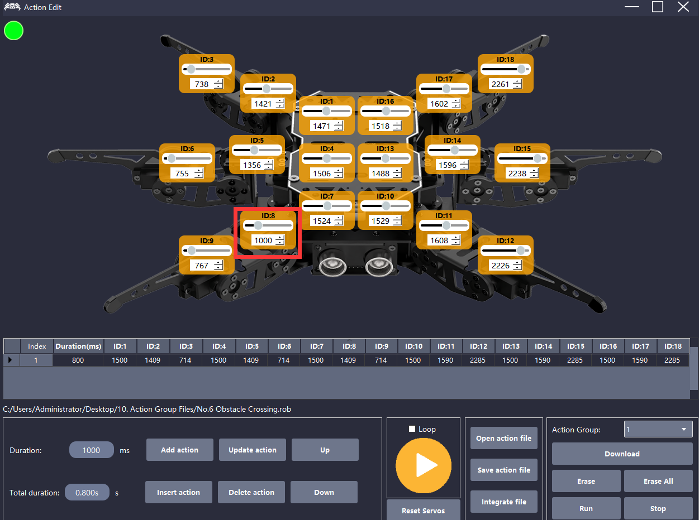

:::{Note}
**Hold down the left mouse button and quickly click the slider for fine adjustment.**
:::

3) Click **Add Action** to add the bent and extended action to the action list on the right.

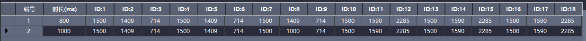

4) Raise the lower part of the robot's right leg. Slide the slider for servo ID 9 to the value shown below, then add the action.

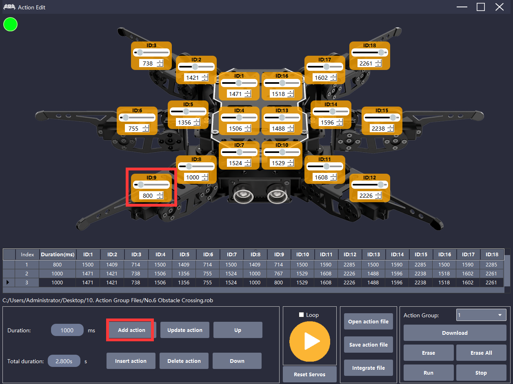

5) Lower the lower part of the robot's right leg to create the waving effect. Slide the slider for servo ID 9 to the value shown below, then add the action.

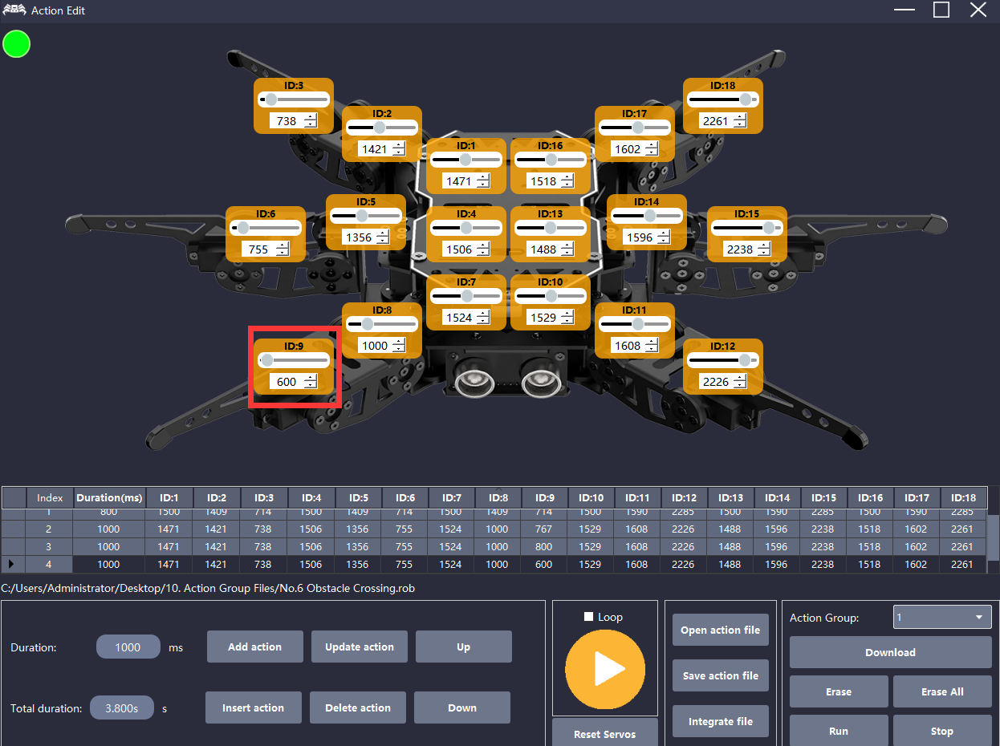

6) Repeat actions 3 and 4 twice.

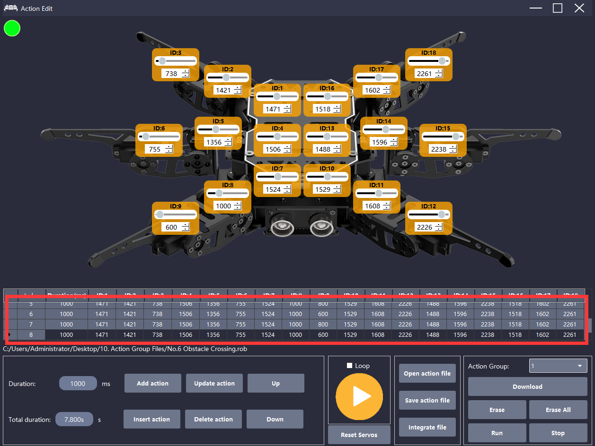

7. Finally, return the mechanical leg to its initial position. Click the first action in the action list. The mechanical leg rotates back to its initial posture. Then click **Add Action**.

* **Action Download**

1) After the actions are edited, save the action locally for later debugging. Click **Save File**. In the pop-up window, enter the file name and number, which is named **20 Wave** in this example, then save it as shown below.

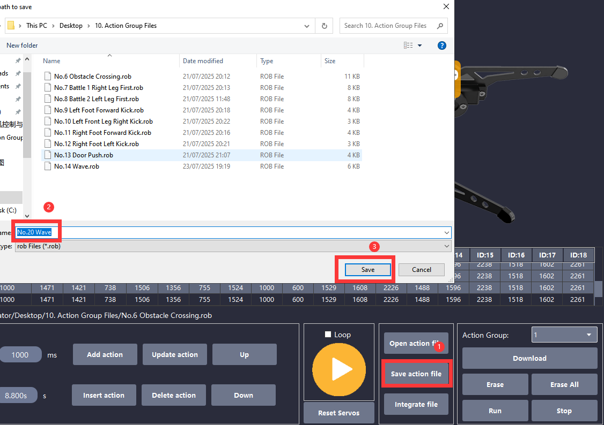

2) After the file is saved, download the action to the corresponding action group. Select action group number 20 on the right side of the interface, then click **Download**.

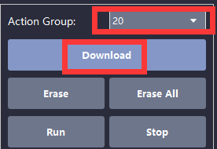

3) After the download is complete, the interface also displays the **Download Complete** pop-up. Click **OK** to close it.

## 3.7 Integrating Action Files

### 3.7.1 Objective

Learn the miniHexa action file integration function and merge action groups.

### 3.7.2 Hands-on Practice

1) Turn on the miniHexa switch.

2) Connect it to the PC with a USB cable.

:::{Note}
**If the factory program is running on the core board, briefly press the K1 button on the servo controller once after power-on to switch the working mode. When the buzzer beeps twice, the robot enters PC software control mode and starts processing PC software control operations.**
:::

3) Open the PC software, connect the software serial port, click the **Integrate Action File** button in the Action Group Settings Area, and open Action Group 6 in [**2. Software\10. Action Group Files**](https://drive.google.com/drive/folders/1bR30Kn7b84IqUfwQ5Mr-kZmwecwTGkwo?usp=sharing).

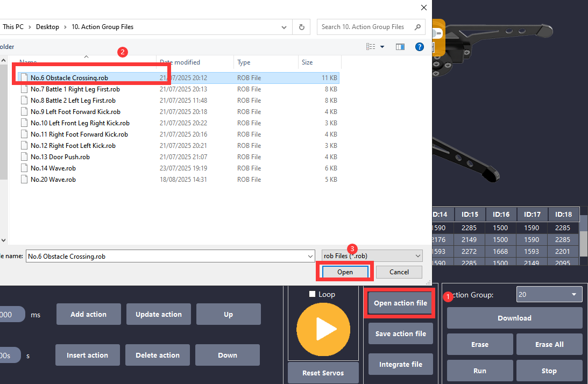

4) The parameters of Action Group 6 are now displayed in the Action Group Detail List.

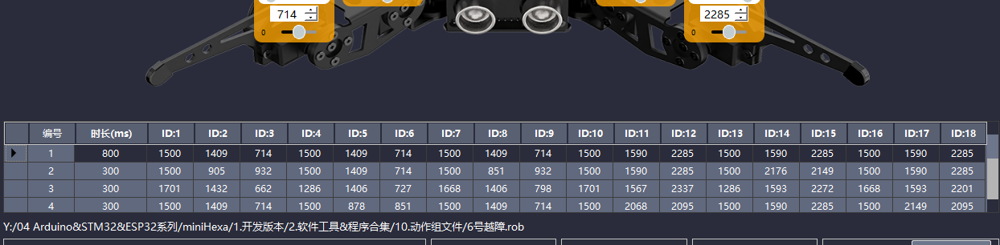

5) Click **Integrate Action File** again, then select Action Group 14 for integration.

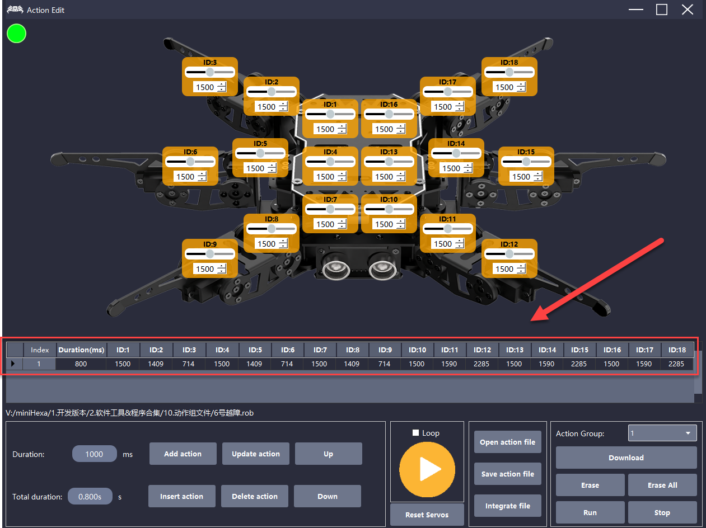

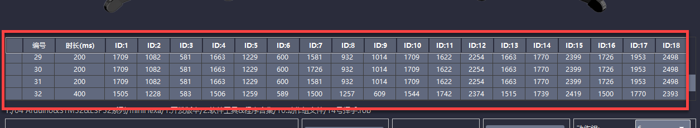

6) Click the "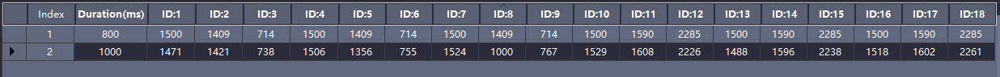" button to run the newly integrated action group online once.

7) Click the **Save Action File** button to save the newly integrated action group for later debugging. This example names it **21**.

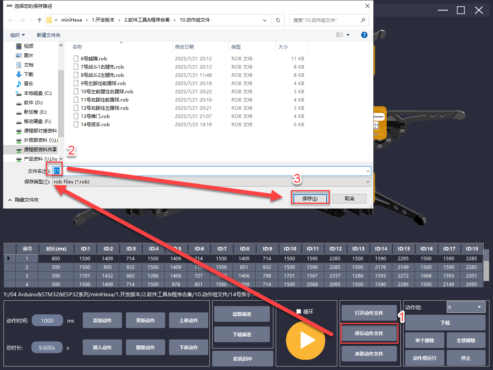

:::{Note}
**If too many actions are integrated in the Action Group Detail List, the PC software prompts that the limit has been exceeded. In this case, the action cannot be downloaded to the controller board and can only be run online for preview.**
:::

## 3.8 APP Custom Control

### 3.8.1 Objective

Use the custom control function in the mobile APP to execute the **20 Wave** action group file edited in **Action Editing Tutorial** in this unit.

### 3.8.2 Hands-on Practice

#### Preparation

1) Confirm that Bluetooth and location services are enabled on the phone.

2) Confirm that Action Group 20 has been downloaded to miniHexa successfully. The PC software displays a prompt after a successful download.

#### Operation Steps

1. Turn on the robot switch to power on the device.

2. Open the **Wonderbot** mobile APP and connect the device.

3. Tap **Action** on the main interface.

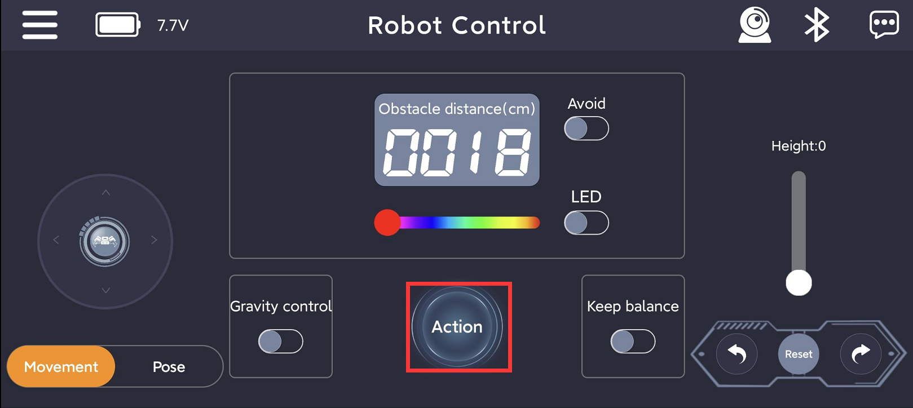

4. Tap **Add** in the pop-up interface.

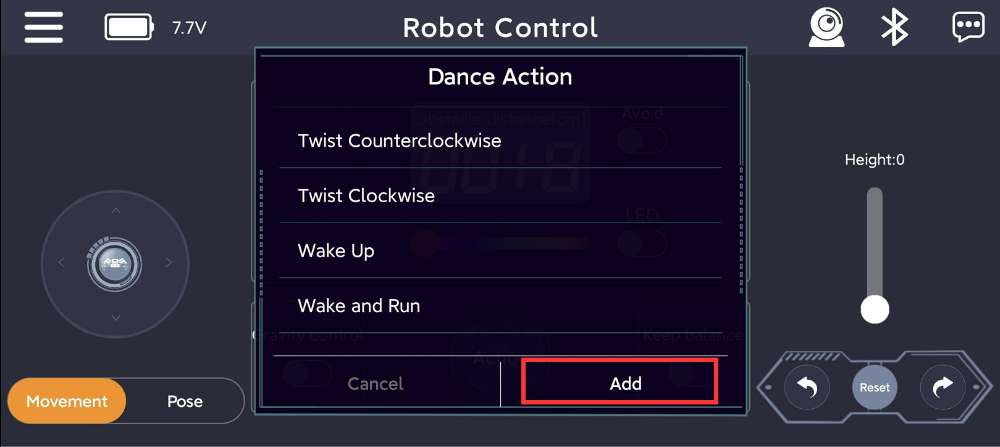

5. In the pop-up interface, enter the action group name and action group number. The action name can be filled in freely, but the action group number must be correct. Otherwise, the action cannot be executed.

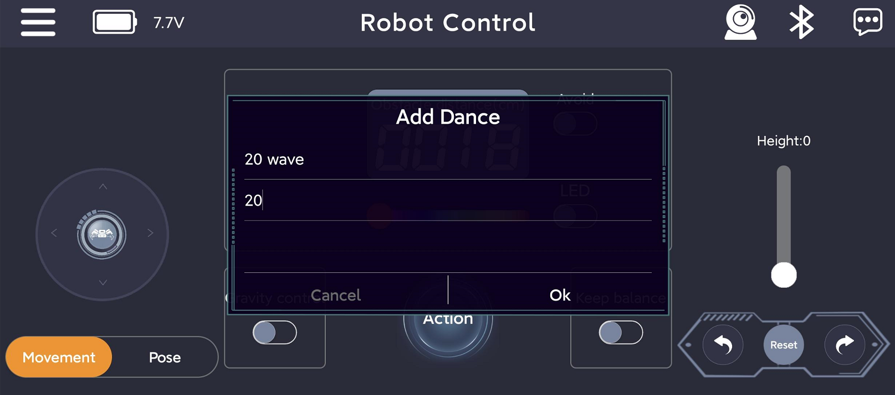

6. After adding is complete, tap **Action Group** again to open the Custom Action Group interface. Tap the action name button to execute it once.

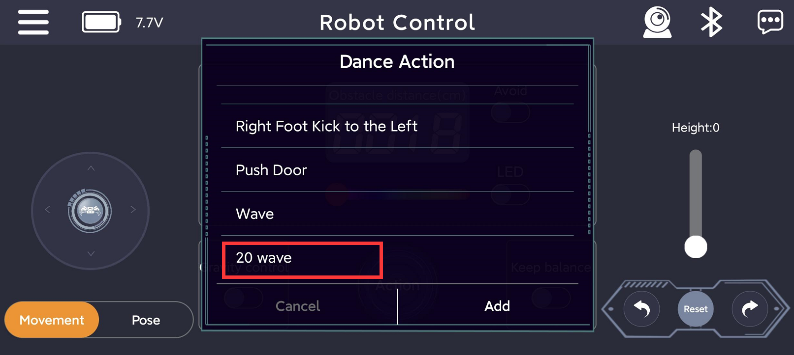

7. To modify or delete it, long-press the action name button, then tap **Delete**.

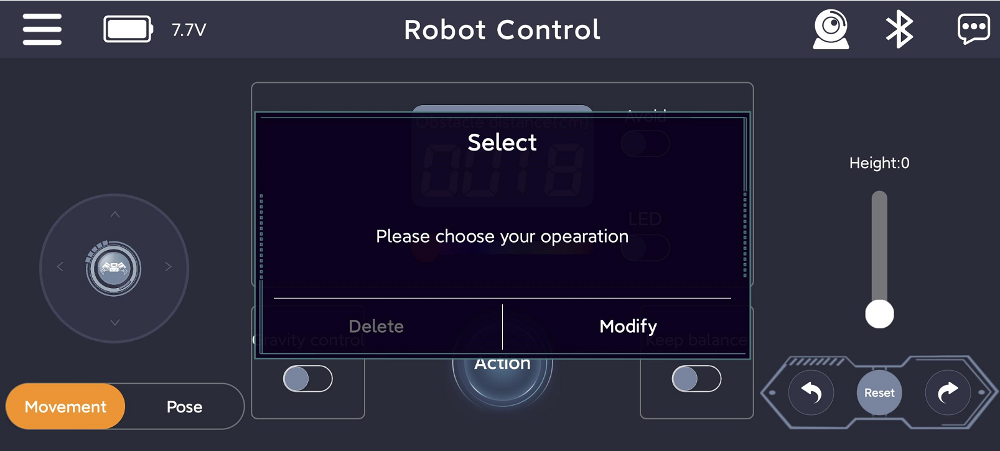

