# 4. Development Environment Setup

## 4.1 Arduino IDE Installation and Deviation Calibration

### 4.1.1 Programming Tool Installation and Introduction

#### 4.1.1.1 Arduino IDE Installation and Interface Overview

Arduino IDE is a powerful software platform designed for Arduino microcontrollers. The installation process is the same for all versions. This section uses the Windows version of Arduino IDE 2.2.1 as an example.

1. Find [**02 ArduinoIDE Installation Package\ArduinoIDE.exe**](https://drive.google.com/drive/folders/1ee1KIROgF1P5Sb8J8OkE_Eipua4i2kV5?usp=sharing) in the same directory as this document, then double-click it to open the installer. To download the latest software version, visit the official Arduino website: [**<u>https://www.arduino.cc/en/software</u>**](https://www.arduino.cc/en/software).


2. Click **I Agree** to start installation.


3. Keep the default selected options, then click **Next** to continue.


4. Click **Browse** to select the installation path, then click **Install** to start installation.


5. Wait for the software installation to complete.


> [!NOTE]
> 
> **If the installation prompts for chip driver installation, select "Always trust software from Arduino LLC (A)", then click "Install".**

6. After installation is complete, click **Finish**.


* **Interface Overview**

The main interface of Arduino IDE is shown below. It can be divided into five areas.


1. **Menu Bar**: Configures Arduino IDE settings.

| **Icon**                                                     | **Function**                                                 |
| ------------------------------------------------------------ | ------------------------------------------------------------ |
|  | Create or open project files, and configure interface preferences |
|  | Edit options for commenting, indenting, finding text, and other text editing tasks |
|  | Project options for project settings, compiling and running, and adding libraries |
|  | Tools options for selecting the development board and port, and viewing development board information |
|  | Help options for getting started and troubleshooting common issues |

2. **Toolbar**: Provides project tools, including program compilation, program download, and serial monitor.

| **Icon**                                                     | **Function**                                                 |
| ------------------------------------------------------------ | ------------------------------------------------------------ |
|  | Verify. Check whether a program is written correctly. If no errors are found, compile the project |
|  | Upload. Upload the program to the Arduino controller         |
|  | Debug. Some development boards support real-time debugging through Arduino IDE |
|  | Select Board. Select different development boards for project development |
|  | Serial Plotter. Plot data printed to the Arduino serial port as a chart |
|  | Serial Monitor. Print serial port information                |

3. **Editor Area**: Edits code.

4. **Status Bar**: Displays editor status, such as code line and column information and development board information.

5. **Sidebar**: The core area of Arduino IDE. It displays the workspace folder, code debugging tools, library installation tools, and other functions.

| **Icon**                                                     | **Function**                                          |
| ------------------------------------------------------------ | ----------------------------------------------------- |
|  | Project folder. Displays files in the current project |
|  | Board Manager. Adds development board packages        |
|  | Library Manager. Adds or removes program libraries    |
|  | Debug. Performs real-time project debugging           |
|  | Search. Searches or replaces code or variables        |

#### 4.1.1.2 Arduino IDE Instructions

* **Arduino IDE Interface Settings**

1. To switch the interface to Chinese, select **File -> Preferences** in Arduino IDE. In the pop-up window, select the language as needed, then click **OK**.


2. Select **File -> Preferences** to modify the project file path, editor font size, color theme, and other settings in the pop-up window.


* **Arduino Program Download**

1. This section uses a sample program that prints `hiwonder` as an example. Double-click [**03 Demo\Demo.ino**](https://drive.google.com/drive/folders/1Z6aXv9RwrABSYsazCFOaSWRROnPHPqN_?usp=sharing) in the same directory as this document to open the sample program.


2. Connect the controller board to the PC with a data cable.

3. Find the corresponding development board in **Select Board**. This section uses **ESP32 Dev Module** as an example. The COM port is not fixed. Check Device Manager on the PC to view the COM number. This example uses **COM6**.


4. Click  to compile the program and check whether syntax errors or other issues exist.


5. After compiling successfully, click  to upload the program to the ESP32 controller board.


6. After upload is complete, click  to open Serial Monitor. The text `hiwonder` is printed in Serial Monitor.


* **Library Import**

Import the required Kinematics and SensorLib libraries before running the program. Use the following method. The Kinematics library is used as an example.

1. In Arduino IDE, select **Sketch -> Include Library -> Add .ZIP Library**.


2. In the pop-up window, find [**02 ArduinoIDE Installation Package\kinematics.zip**](https://drive.google.com/drive/folders/1ee1KIROgF1P5Sb8J8OkE_Eipua4i2kV5?usp=sharing), then click **Open**.


3. If the following prompt appears, the library file has been installed.


### 4.1.2 Deviation Calibration

> [!NOTE]
>
> **If a new servo is installed or an original servo is removed, deviation calibration must be performed again.**
>
> **After long-term use, calibrated servos may develop deviations again due to external force. Adjust them again if needed. Perform deviation calibration based on the actual motion behavior of the robot.**

#### 4.1.2.1 Preparation

After miniHexa assembly is complete, perform deviation calibration to ensure that miniHexa can move properly in later tutorials. Before starting deviation calibration, make sure the following work is complete.

1. The deviation calibration program in [**04 Deviation Calibration Program Files**](https://drive.google.com/drive/folders/1hq2QDwmlLqv3EcMR9Z6F49bJ2o6qJZrs?usp=sharing) has been downloaded to miniHexa.

2. Open miniHexa PC software, then connect miniHexa to the PC with a data cable.

3. Open the corresponding calibration PC software, then switch to **Action Edit** mode.


#### 4.1.2.2 Deviation Adjustment Standards

Click . All servos of the miniHexa legs rotate to position value `1500`. Check the legs according to the following standards.

1. After the servos return to the central position, the starting segment of the miniHexa legs should be perpendicular to the red line along the top cover edge.


2. The horizontal axis of the middle-joint servo horn should be perpendicular to the longitudinal axis of its servo body. The horizontal axis of the end-joint servo horn should be perpendicular to the horizontal axis of the other servo horn body.


#### 4.1.2.3 Calibration Steps

After long-term use, calibrated servos may develop deviations again due to external force and need to be adjusted again. Follow the steps below to manually calibrate them with PC software. No. 10 servo is used as an example.


1. Click  to read the current servo deviation values.

2. In the miniHexa icon area above, select the slider below the corresponding servo icon. Drag the slider to adjust the servo position deviation value.


3. The figure above shows that the right leg of the robot shifts to the right. Move the deviation slider to the left to calibrate the corresponding deviation.


4. After one leg is calibrated, be sure to click **Download offset** to save the calibration values.


5. After all six legs are checked and calibrated, evaluate the calibration result according to the following standards. If one or more legs fail to meet the standards, calibrate those legs again.

6. Lightly touch a leg of the robot. The contact point of the leg should not show obvious deviation.

7. Slightly shake the robot body. The legs should remain at their original positions without obvious deviation.

8. Place the hexapod robot on the ground. The six legs should have no obvious height difference. Switch to **General Mode** or **Attitude Mode**, and miniHexa will stand automatically.


## 4.2 MicroPython Development Environment Setup and Configuration

### 4.2.1 Programming Tool Installation and Overview

#### 4.2.1.1 Firmware Flashing

> [!NOTE]
>
> **Before flashing the firmware, make sure to save the servo deviation values according to [Read the Deviation Values in the PC Software](#anther4.2.2.1).**

1. Download [**2. Software/5.ESP32S3 Firmware Flashing Tool/flash_download_tool_3.9.7_1**](https://drive.google.com/drive/folders/1rbPG3zhbXIqjQKnRd51mkg0iL94MHgjL?usp=sharing). Then double-click **flash_download_tool_3.9.7.exe** to open the flash tool.


2. Select **ESP32** for ChipType and **Develop** for WorkMode.


3. Power on miniHexa and connect it to the PC.

4. Select [**2. Software/8.miniHexa Factory Firmware/MicroPython & Scratch Firmware/minihexa_20250929_0x000.bin**](https://drive.google.com/drive/folders/1Lc49i8d9m1sI6gzmsgEuQdy1uPvO0Stg?usp=sharing) and set the address to `0x0000`. Select the correct serial port and baud rate. Click **ERASE** first, then click **START** to begin flashing. Wait until the process is complete.


5. After flashing is complete, restart the robot to return it to the initial position. Then follow [4.2.2 Deviation Calibration](#anther4.2.2) to write the deviation values.

#### 4.2.1.2 Python Editor Overview and Usage

This section explains how to connect the [Hiwonder Python Editor](https://drive.google.com/drive/folders/1f9hSVelLa2x4sF1miJddl4e2izL7kGYJ?usp=sharing) and use its main features. The software allows switching the language to English.

> [!NOTE]
>
> **If the editor cannot be opened, rename the editor folder to an English-only name such as `Hiwonder`.**

The editor interface is divided into five areas as shown below:


The functions of each area are listed in the table below:

| No.  | Area        | Function                                                     |
| ---- | ----------- | ------------------------------------------------------------ |
| 1    | Menu Bar    | Includes **File**, **Edit**, **View**, **Connect**, **Run**, and **Help**. |
| 2    | Toolbar     | Includes several common shortcut buttons. Their functions correspond to commands in the menu bar. |
| 3    | File List   | Contains project files stored on the device and on the local PC. Folders and source code files can be viewed here. |
| 4    | Code Editor | Used to view and edit code.                                  |
| 5    | Terminal    | Displays message logs and debugging information. When no device is connected, only message logs are available. |

**Operation Guide**

1. For the first import, left-click **Local Project** to open the file selection list. For later imports, right-click **Local Project -> Switch Project Path**.


2. Select **2. Software/4. Program Collection/5. Python Project**, then click **Select Folder**.


3. The files in the folder are automatically added to the local project and can be viewed under **Local Project**.


> [!NOTE]
>
> **Importing a local project only imports files from the PC into the editor. It does not download them to the ESP32 controller board.**

**View Files and Programs**

Double-click a program file in the file list to view the code. **02 Omnidirectional Movement Program/main.py** is used here as an example:


After a program file is downloaded to the ESP32 controller board, double-click the file under **Device** to view it in the same way.

**Code Writing and Saving**

The code editor on the right side supports code creation, viewing, editing, modification, and saving. Read the following notes before writing code:

1. Files cannot be created directly under the **Device** tab. Changes to files under **Device** can be saved only through the download operation. For backup, copy the files to the local project first.

2. Do not modify action group files with the `.rob` extension in the editor. Unknown format errors may occur. Edit action group files in the PC software when needed.

3. Among the provided low-level program files, `main.py` is the main program of the device. All robot functions are launched through this file. Reset and power-on operations also depend on this file. If `main.py` stops responding, subsequent operations cannot continue. For safety, rename the program first if additional features need to be added. If `main.py` is changed to another name and the program becomes stuck during debugging, even when **Ctrl+C** and **Ctrl+D** both fail, reset the controller board, delete the program, and download the required program again.

**Program Download and Execution**

Program download is an interaction between the editor and the device. **02 Omnidirectional Movement Program/main.py** is used here as an example:

1. Under the **Local Project** tab, select **02 Omnidirectional Movement Program/main.py**. Click the toolbar icon  to connect to the ESP32 controller board. Then click the toolbar icon  or right-click the file and select **Download and Run**.


2. The terminal displays the download progress and completion status. Since **Download and Run** is used in the previous step, the running result can also be viewed there.


3. After the download is complete, the program appears in the file list under **Device**.


> [!NOTE]
>
> - **If the downloaded file is not named `main.py`, delete the original `main.py` and rename the downloaded file to `main.py`. Another option is to rename the file to `main.py` before downloading.**
>
> - **"Download and Run" first resets the device, which means a restart, and then downloads and runs the program. This helps improve program stability.**
>
> - **If the program does not need to run immediately, click the button  or right-click the target file and select "Download". Before running the program later, click the icon  to reset the device first, then run the program.**

**Terminal Debugging**

The terminal combines the message window and the debugging console. When no device is connected, the terminal can display messages only and cannot be used for editing or debugging. The message viewing function has already been shown in the previous steps. The following section focuses on debugging features.

1. The terminal supports code input. Enter `print(123)` in the terminal and press **Enter**. The result is shown below:


2. The terminal also supports automatic indentation. When a Python statement ends with a colon, such as `if`, `for`, or `while`, pressing **Enter** continues on the next line with the appropriate indentation. Press **Backspace** to remove one indentation level.


3. To copy and paste code, select the target code and right-click in the terminal.


> [!NOTE]
>
> **Press "Ctrl+E" to enter edit mode before pasting code. Otherwise, indentation errors may occur during debugging.**

The image below shows the correct result after copy and paste. The indentation is correct.


The image below shows incorrect indentation:


To exit edit mode, press **Ctrl+C**. If an infinite loop is running, press **Ctrl+C** to interrupt it as well.

> [!NOTE]
>
> **"Ctrl+C" only interrupts a running program in the terminal. It does not copy text. "Ctrl+V" does not paste text in the terminal.**

4. Use **Tab** to complete code when entering commands in the terminal. For example, enter `os` and press **Tab**. The result is shown below:


If two or more completions are available, the terminal lists all available options. If only one completion is available, the terminal completes it automatically. If no completion is available, no action is taken.

5. Use the **Up Arrow** and **Down Arrow** keys in the terminal to view previously entered commands and reduce repeated input.

For more commands and command descriptions, visit [http://docs.micropython.org/en/latest/library/uos.html](http://docs.micropython.org/en/latest/library/uos.html)

<p id ="anther4.2.2"></p>

### 4.2.2 Deviation Calibration

<p id ="anther4.2.2.1"></p>

#### 4.2.2.1 Read the Deviation Values in the PC Software

Downloading an Arduino program erases the MicroPython firmware on the ESP32. The original servo deviation values are cleared at the same time. Before programming a MicroPython project, open the PC software and save the servo deviation values.

1. Open [**2. Software/3. PC Software Package/MiniHexa.exe**](https://drive.google.com/drive/folders/1L2N8oZFAkDJX_iJaABmMiacG2YC4CMB5?usp=sharing). Connect miniHexa to the PC with a USB data cable. Then follow the steps shown below. Select the corresponding port. `COM4` is used here as an example. Click **Connect**, then click **Action Edit**.


2. Click **Read offset** to read the servo deviation values.


> [!NOTE]
>
> **After the servo deviation values are read, take a screenshot to keep a backup and prevent data loss.**

#### 4.2.2.2 Write the Deviation Values

1. Open the [Hiwonder Python Editor](https://drive.google.com/drive/folders/1f9hSVelLa2x4sF1miJddl4e2izL7kGYJ?usp=sharing).


2. Open [**02 Program Files/Deviation Writing Program/main.py**](https://drive.google.com/drive/folders/1hWTJBswm3QXBqs_q7zQrjuteBzIwvEbe?usp=sharing), then drag it into the Hiwonder Python Editor. The drag operation takes effect only when the file is dropped inside the red box.


3. Locate the code section that sets the deviation values:

```
# Set servo deviation values
robot.set_deviation(1 , 0)
robot.set_deviation(2 , 0)
robot.set_deviation(3 , 0)
robot.set_deviation(4 , 0)
robot.set_deviation(5 , 0)
robot.set_deviation(6 , 0)
robot.set_deviation(7 , 0)
robot.set_deviation(8 , 0)
robot.set_deviation(9 , 0)
robot.set_deviation(10 , 0)
robot.set_deviation(11 , 0)
robot.set_deviation(12 , 0)
robot.set_deviation(13 , 0)
robot.set_deviation(14 , 0)
robot.set_deviation(15 , 0)
robot.set_deviation(16 , 0)
robot.set_deviation(17 , 0)
robot.set_deviation(18 , 0)
```

4. Write the deviation data read in [Read the Deviation Values in the PC Software](#anther4.2.2.1) into the code.

```
robot.set_deviation(1 , 24)
robot.set_deviation(2 , 28)
robot.set_deviation(3 , 9)
robot.set_deviation(4 , -20)
robot.set_deviation(5 , -13)
robot.set_deviation(6 , -13)
robot.set_deviation(7 , 0)
robot.set_deviation(8 , -7)
robot.set_deviation(9 , 14)
robot.set_deviation(10 , 21)
robot.set_deviation(11 , -11)
robot.set_deviation(12 , 16)
robot.set_deviation(13 , 21)
robot.set_deviation(14 , 31)
robot.set_deviation(15 , -5)
robot.set_deviation(16 , 0)
robot.set_deviation(17 , -33)
robot.set_deviation(18 , -9)
```

5. After setting the deviation values, connect miniHexa to the PC with a Type-C data cable. Click . After the connection is successful, the icon turns green . Then click  to download the program to miniHexa.


> [!NOTE]
>
> **The deviation setting program needs to be downloaded and run on miniHexa only once. After that, the settings are stored in the miniHexa Arduino programming environment. No additional setup is required.**

#### 4.2.2.3 Read the Written Deviation Values

After the deviation values are written, click . The serial port continuously prints the stored servo deviation values.


## 4.3 Scratch Development Environment Setup

### 4.3.1 Programming Tool Installation and Overview

#### 4.3.1.1 Firmware Flashing

> [!NOTE]
>
> **Before flashing the firmware, make sure to save the servo deviation values according to [Read the Deviation Values in the PC Software](#anther4.3.2.1).**

1. Extract [**2. Software/5.ESP32S3 Firmware Flashing Tool/flash_download_tool_3.9.7_1.zip**](https://drive.google.com/drive/folders/1rbPG3zhbXIqjQKnRd51mkg0iL94MHgjL?usp=sharing). Then double-click `flash_download_tool_3.9.7.exe` to open the flash tool.


2. Select **ESP32** for ChipType and **Develop** for WorkMode.


3. Power on miniHexa and connect it to the PC.

4. Select [**2. Software/8.miniHexa Factory Firmware/MicroPython & Scratch Firmware/minihexa_20250929_0x000.bin**](https://drive.google.com/drive/folders/1Lc49i8d9m1sI6gzmsgEuQdy1uPvO0Stg?usp=sharing) and set the address to `0x0000`. Select the correct serial port and baud rate. Click **ERASE** first, then click **START** to begin flashing. Wait until the process is complete.


5. After flashing is complete, restart the robot to return it to the initial position. Then follow [Deviation Calibration](#anther4.3.2) to write the deviation values.

#### 4.3.1.2 WonderCode Overview and Usage

* **WonderCode Overview and Installation**

WonderCode is a Scratch programming tool developed for Hiwonder products. It supports automatic conversion between graphical instruction blocks and Python code. Programs can be created by dragging and arranging blocks. This makes it a good choice for beginners who are learning to code.

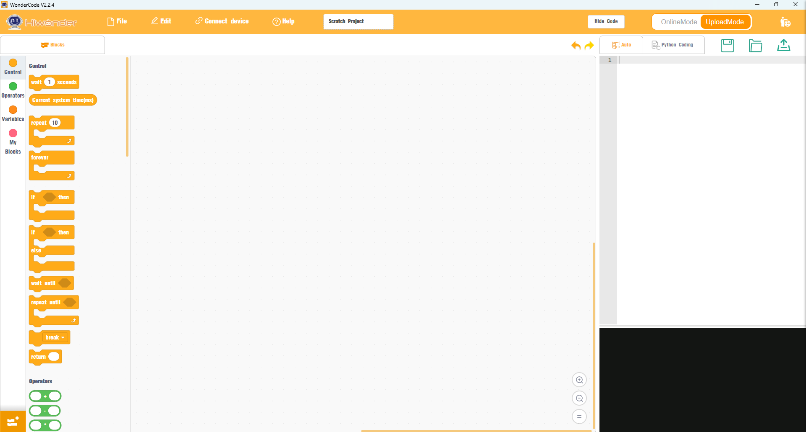

1. Open [**02 WonderCode Installation Package/WonderCode setup.exe** ](https://drive.google.com/drive/folders/1g9nZuXWNgOqQaxgcV7MN2c_-jN-bExFn?usp=sharing)in the same path as this document.

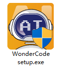

2. In the language selection window, select **English**, then click **OK**.

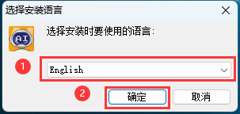

3. Select the installation path. Keep the default path or choose a different one as needed. Then click **Next**.

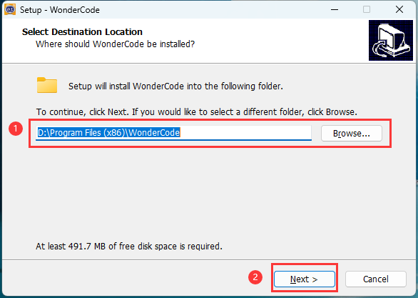

4. In the additional tasks window, **Create a desktop shortcut** is selected by default. Keep the default setting, then continue to the next step.

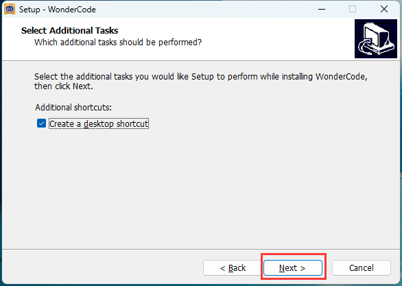

5. Click **Install** to start the installation.

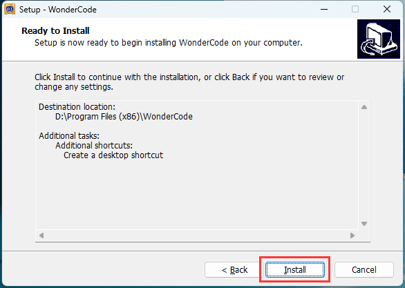

6. The software installation starts and the progress bar is displayed.

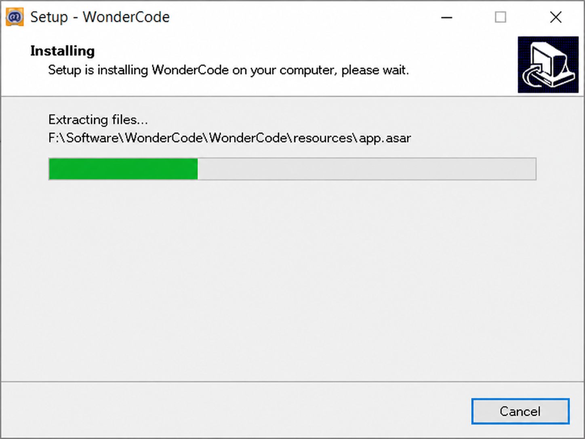

7. After the installation is complete, click **Finish**.

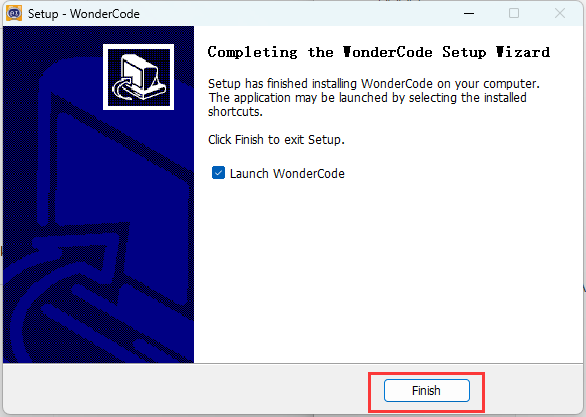

8. After the installation is complete, the **WonderCode** icon appears on the desktop.


* **Device Connection**

1. Connect the device, then double-click **WonderCode** to open the software.


2. Add the device extension before connecting. Otherwise, the connection cannot be established. Click the **Add Extension** button  in the lower-left corner of the main interface. In the pop-up window, select **Robot -> and then select **miniHexa**.

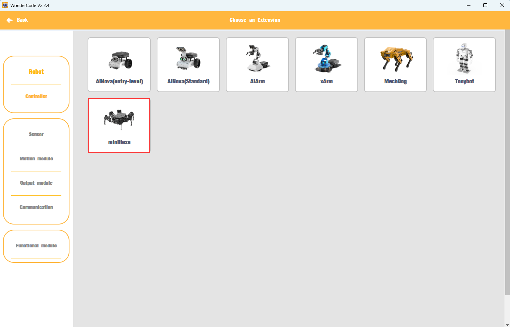

3. Click **Connect**, then connect to the corresponding port.

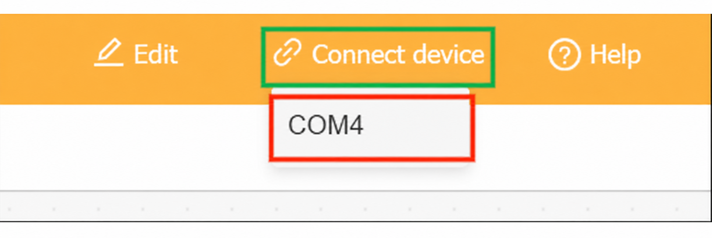

> [!NOTE]
>
> **The port number is not fixed and depends on the actual connection on each PC. In this section, "COM4" is used as an example. Do not select "COM1", which is usually reserved for system communication.**

If multiple USB devices are connected and the port number is unclear, open **This PC** on the desktop. Then click **Properties -> Device Manager** to check the port number of the controller.

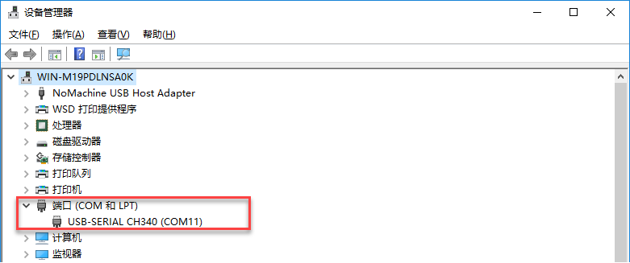

4. After the device is paired with the software successfully, a connection success message is displayed.

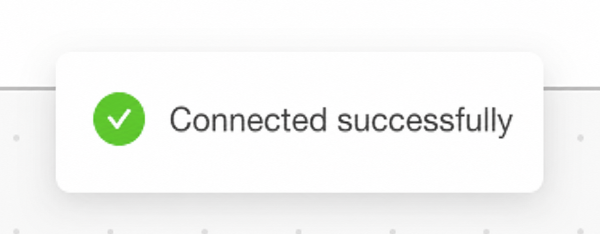

* **Function Description**

The figure below shows the functional layout of the **WonderCode** software.  
① is the menu bar. ② is the blocks area. ③ is the script area. ④ is the code display and upload area.

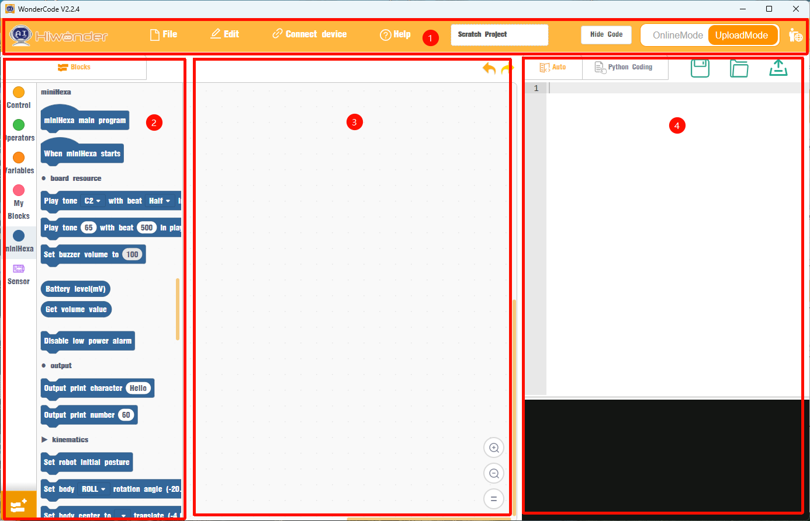

The corresponding functions are listed in the table below:

| Icon                                                         | Function                                                     |
| ------------------------------------------------------------ | ------------------------------------------------------------ |
|  | Creates, saves, and opens program files.                     |
|  | Switches to online mode. This mode is for reference only and is not required for this course. |
|  | Connects the device to the software and selects the connection port. |
|  | Opens help materials, checks for updates, and installs drivers. |
|  | Displays the program file name. Before programming starts or before the file is saved, the default name is "scratch project". |
|  | Switches between **Online Mode** and **Upload Mode**. Save the edited program before switching. Otherwise, the file may be lost. Online mode is used for Scratch native content such as animations and games. Upload Mode works with the robot hardware to implement different functions. |
|  | Switches the interface language between English, Simplified Chinese, and Traditional Chinese. |
|  | Undoes or restores editing operations while writing the program. |
|  | Switches the editing mode. **Auto Transcode** converts block-based programs into Python. Switching to **Python Programming** allows direct editing in Python. |
|  | Saves the program as Python code.                            |
|  | Opens a saved Python file.                                   |
|  | Interacts with the device and downloads the program to the controller board. |
|  | Adds the extension package for the device.                   |
|  | Controls zoom in, zoom out, and restore default size for the code editing area from top to bottom. |

<p id ="anther4.3.2"></p>

### 4.3.2 Deviation Calibration

<p id ="anther4.3.2.1"></p>

#### 4.3.2.1 Read the Deviation Values in the PC Software

Downloading an Arduino program to the ESP32 erases the existing firmware, which clears the original servo deviation values. Before programming a Scratch project, open the PC software and save the servo deviation values.

1. Open [**2. Software/3. PC Software Package/MiniHexa.exe**](https://drive.google.com/drive/folders/1L2N8oZFAkDJX_iJaABmMiacG2YC4CMB5?usp=sharing). Connect miniHexa to the PC with a USB data cable. Then follow the steps shown below. Select the corresponding port. `COM4` is used here as an example. Click **Connect**, then click **Action Edit**.


2. Click **Read offset** to read the servo deviation values.


> [!NOTE]
>
> **After the servo deviation values are read, take a screenshot to keep a backup and prevent data loss.**

<p id ="anther4.3.2.2"></p>

#### 4.3.2.2 Write the Deviation Values

1. Open the Hiwonder Python Editor.


2. Open [**03 Program Files/Deviation Calibration Program/main.py**](https://drive.google.com/drive/folders/1wz4VI5Fbgzaa72nXQOk2dubsMRCYK5-Z?usp=sharing), then drag it into the Hiwonder Python Editor. The drag operation takes effect only when the file is dropped inside the red box.


3. Locate the code section that sets the deviation values:

```
# Set servo deviation values
robot.set_deviation(1 , 0)
robot.set_deviation(2 , 0)
robot.set_deviation(3 , 0)
robot.set_deviation(4 , 0)
robot.set_deviation(5 , 0)
robot.set_deviation(6 , 0)
robot.set_deviation(7 , 0)
robot.set_deviation(8 , 0)
robot.set_deviation(9 , 0)
robot.set_deviation(10 , 0)
robot.set_deviation(11 , 0)
robot.set_deviation(12 , 0)
robot.set_deviation(13 , 0)
robot.set_deviation(14 , 0)
robot.set_deviation(15 , 0)
robot.set_deviation(16 , 0)
robot.set_deviation(17 , 0)
robot.set_deviation(18 , 0)
```

4. Write the deviation data read in [Read the Deviation Values in the PC Software](#anther4.3.2.1) into the code.

```
robot.set_deviation(1 , 24)
robot.set_deviation(2 , 28)
robot.set_deviation(3 , 9)
robot.set_deviation(4 , -20)
robot.set_deviation(5 , -13)
robot.set_deviation(6 , -13)
robot.set_deviation(7 , 0)
robot.set_deviation(8 , -7)
robot.set_deviation(9 , 14)
robot.set_deviation(10 , 21)
robot.set_deviation(11 , -11)
robot.set_deviation(12 , 16)
robot.set_deviation(13 , 21)
robot.set_deviation(14 , 31)
robot.set_deviation(15 , -5)
robot.set_deviation(16 , 0)
robot.set_deviation(17 , -33)
robot.set_deviation(18 , -9)
```

5. After the deviation values are set, connect miniHexa to the PC with a Type-C data cable. Click . After the connection is successful, the icon turns green . Then click  to download the program to miniHexa.


> [!NOTE]
>
> **The deviation calibration program needs to be downloaded to miniHexa and run only once. After that, the settings are stored in the miniHexa Arduino programming environment. No additional setup is required.**

#### 4.3.2.3 Read the Written Deviation Values

After the deviation values are written, click . The serial port continuously prints the stored servo deviation values.

