# 4. Arduino IDE Installation & Servo Calibration

## 4.1 Introduction and Installation of the Arduino IDE

### 4.1.1 Installation and Interface Overview of the Arduino IDE

:::{Note}

Installation instructions for Mac can be found in the corresponding section of this guide.

:::

* **Installation**

The Arduino IDE is a powerful software platform specifically designed for use with Arduino microcontroller. The installation process is consistent across different versions. The following instructions use the Windows version of Arduino IDE 2.2.1 as an example.

(1) Locate the Arduino IDE installation package provided in the same directory as this document. Double-click the installer to begin. To download the latest version of the software, visit the official Arduino website: [**<u>https://www.arduino.cc/en/software</u>**](https://www.arduino.cc/en/software)

(2) Click "**I Agree**" to accept the license agreement to proceed with the installation.

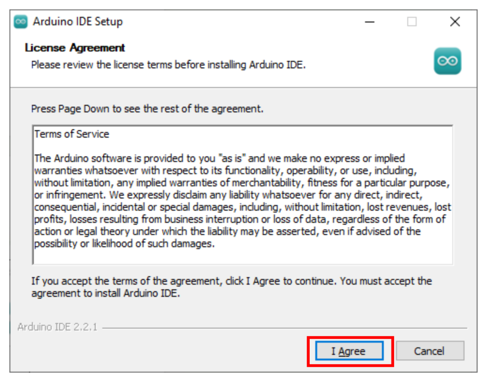

(3) Use the default selected options and click "**Next**" to continue.

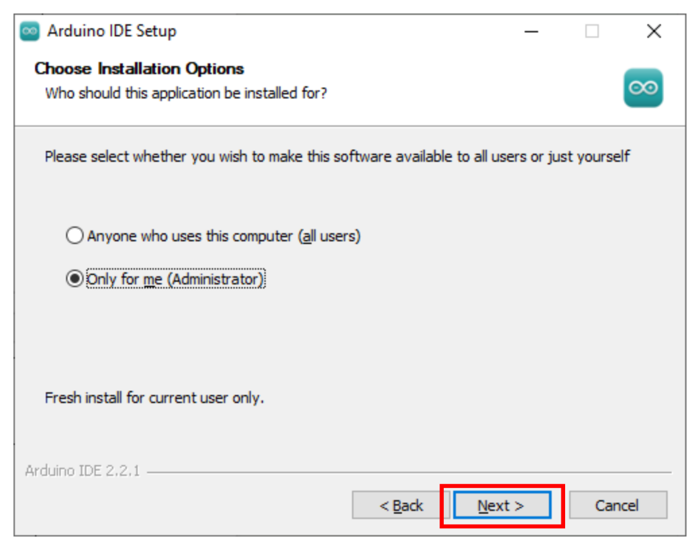

(4) Choose the desired installation path by clicking "**Browse**," then click "**Install**" to begin installation.

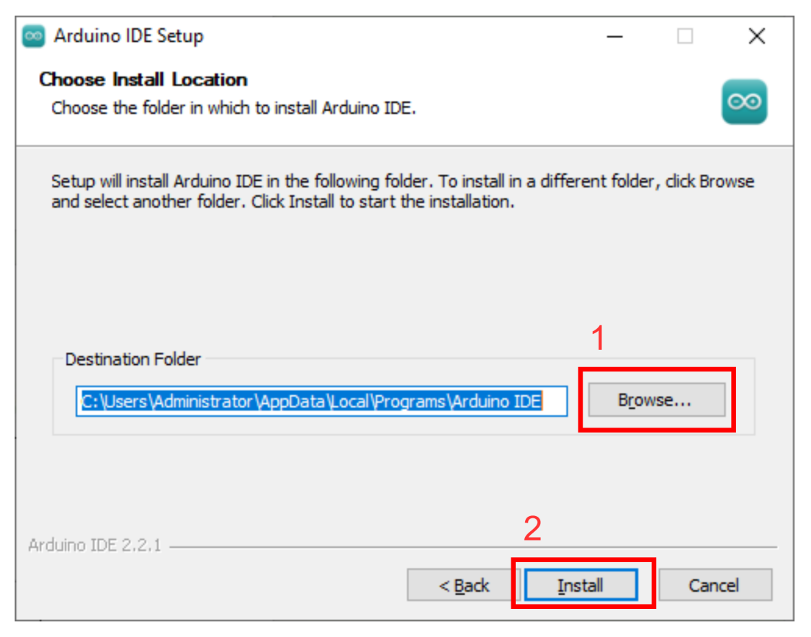

(5) Wait for the installation process to complete.

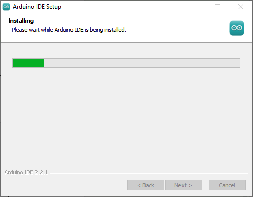

:::{Note}

If prompted to install USB drivers during the installation, select "**Always trust software from Arduino LLC**" and click "**Install**."

:::

(6) Once installation is complete, click "**Finish**" to exit the installer.

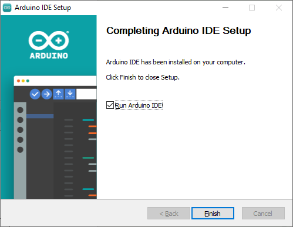

* **Interface Overview**

(1) The main interface of the Arduino IDE is divided into five primary sections:

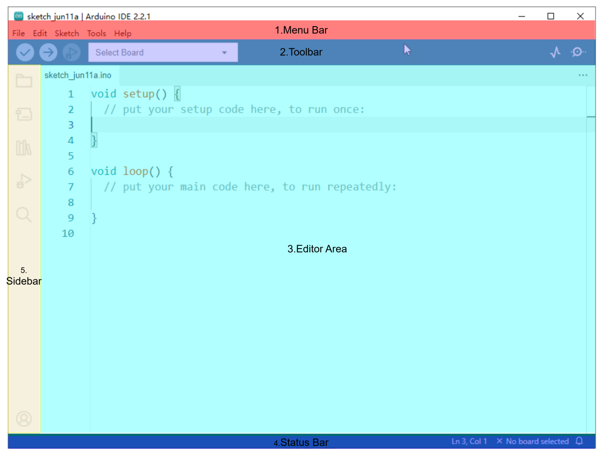

(2) Menu Bar provides access to key settings and configuration options for the Arduino IDE.

| **Icon**                                                     | **Function**                                                 |
| :----------------------------------------------------------- | :----------------------------------------------------------- |
| 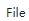 | Create or open projects, and configure interface preferences |
|  | Comment, indent, find/replace text                           |
|  | Configure and compile projects, manage libraries             |
|  | Select controllers and ports, access controller information  |
|  | Access tutorials, troubleshooting resources                  |

(3) Toolbar contains essential tools for project development, including program compilation, uploading, and serial monitoring.

| **Icon**                                                     | **Function**                                                 |
| :----------------------------------------------------------- | :----------------------------------------------------------- |
|  | Verify: Check for errors and compile the code                |
|  | Upload: Upload the program to the Arduino controller         |
|  | Debug: Real-time debugging for supported controllers         |
|  | Select Controller: Select the target controller for the project |
|  | Serial Plotter: Visualize serial data as a graph             |
|  | Serial Monitor: Display data from the serial port            |

Editor Area: The primary area for writing and editing code.

Status Bar: Displays relevant editor and project information, such as cursor position, controller selection, and other status indicators.

Sidebar: A key component of the Arduino IDE, providing tools for file management, code debugging, and library installation.

| **Icon**                                                     | **Function**                                        |
| :----------------------------------------------------------- | :-------------------------------------------------- |
|  | Explorer: shows the current project's files         |
|  | Board Manager: add or manage packages of controller |
|  | Library Manager: install or remove code libraries   |
|  | Debug: perform real-time project debugging          |
|  | Search: search or replace code and variables        |

### 4.1.2 Using the Arduino IDE

* **Arduino IDE Interface Overview**

(1) To switch the interface language to English, navigate to **File** \> **Preferences**, then locate the **Language** setting in the pop-up window. Select "**English**" from the list and click **OK** to apply the changes.

(2) Additional preferences such as project file location, editor font size, and color theme can also be configured from this menu.

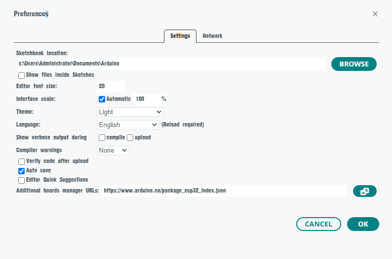

* **Arduino Program Download**

(1) This section demonstrates how to upload a simple program that prints the text "**hiwonder**". Locate and open the sample sketch file **Demo.ino** found in the [Demo](../_static/source_code/Demo.zip) folder under the same directory as this document.

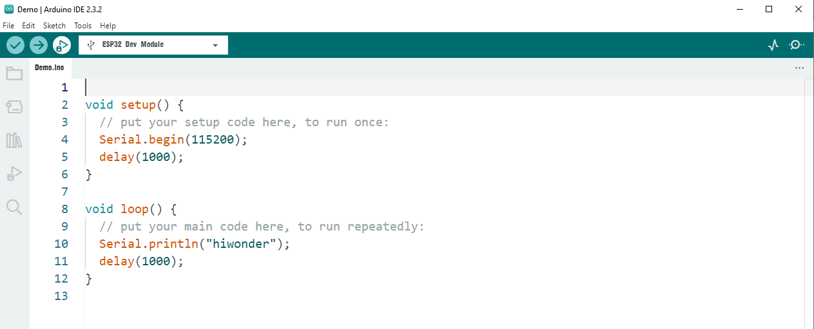

(2) Connect the controller to your computer using a USB data cable.

(3) From the **Select Board** menu, choose the appropriate controller type. For example, when using an ESP32 Dev Module, select it accordingly. The COM port may vary, but you can refer to the Device Manager on the computer to identify the correct COM number, COM4 is taken as the port.

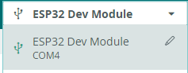

(4) Click the  button to compile the sketch and check for syntax errors or other issues.

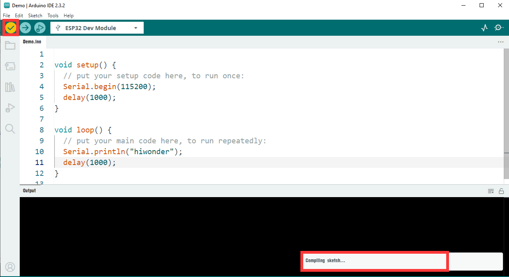

(5) Once compiled successfully, click  button to transfer the program to the ESP32 controller.

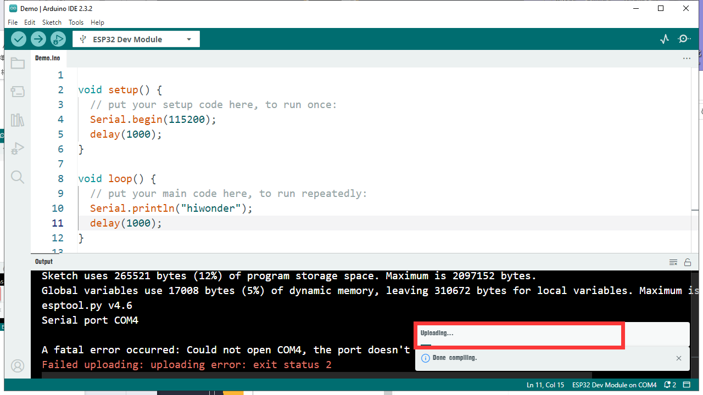

(6) After uploading, open the Serial Monitor. The text "**hiwonder**" should appear, confirming that the program is running correctly.

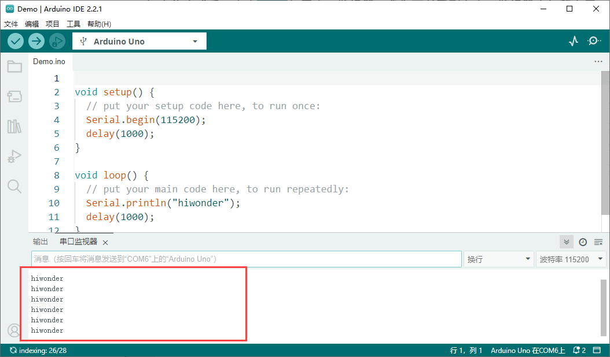

* **Importing Libraries**

To run the program, you need to import the required libraries, such as Kinematics and SensorLib. You can follow the steps below to import them. The following example demonstrates how to import the Kinematics library.

(1) Go to **Sketch \> Include Library \> Add .ZIP** Library in the Arduino IDE.

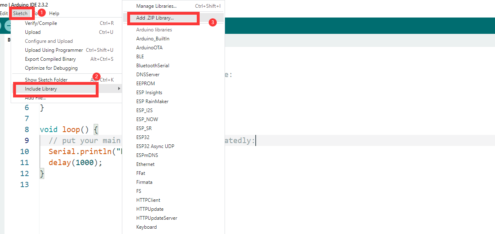

(2) In the dialog box, locate the Kinematics.zip file, which can be found in [Appendix->Arduino IDE Installation Package](Appendix.md) in the same directory of this document.

(3) A confirmation message will indicate successful installation.

## 4.2 Deviation Calibration

:::{Note}

* If a new servo is installed or the original servo is removed, deviation calibration must be redone.

* After long-term use, even servos that have been previously calibrated may develop deviations due to external forces and will need recalibration. Deviation calibration should be performed based on the actual motion behavior of the robot.

:::

### 4.2.1 Preparation

After assembling miniHexa, perform deviation calibration to ensure proper motion in subsequent tutorials. Before starting calibration, make sure the following steps are completed:

(1) Download the deviation calibration program from the [Deviation Calibration Program Files](Appendix.md) folder to miniHexa.

(2) Open the miniHexa PC software and connect miniHexa to the computer using the data cable.

(3) Open the corresponding PC software and switch to Action Edit mode.

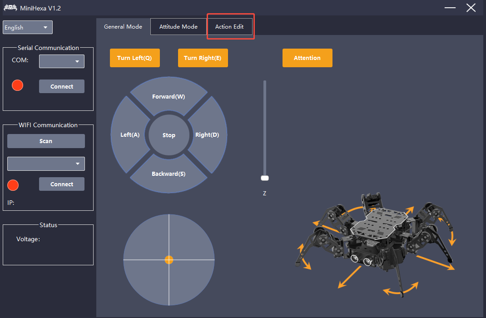

### 4.2.2 Adjustment Standards

Click  to reset all servos of the six legs to position value 1500. At this point, check the legs according to the following standards:

(1) After returning to the central position, the starting segment of the miniHexa's legs should be perpendicular to the red line along the top cover edge.

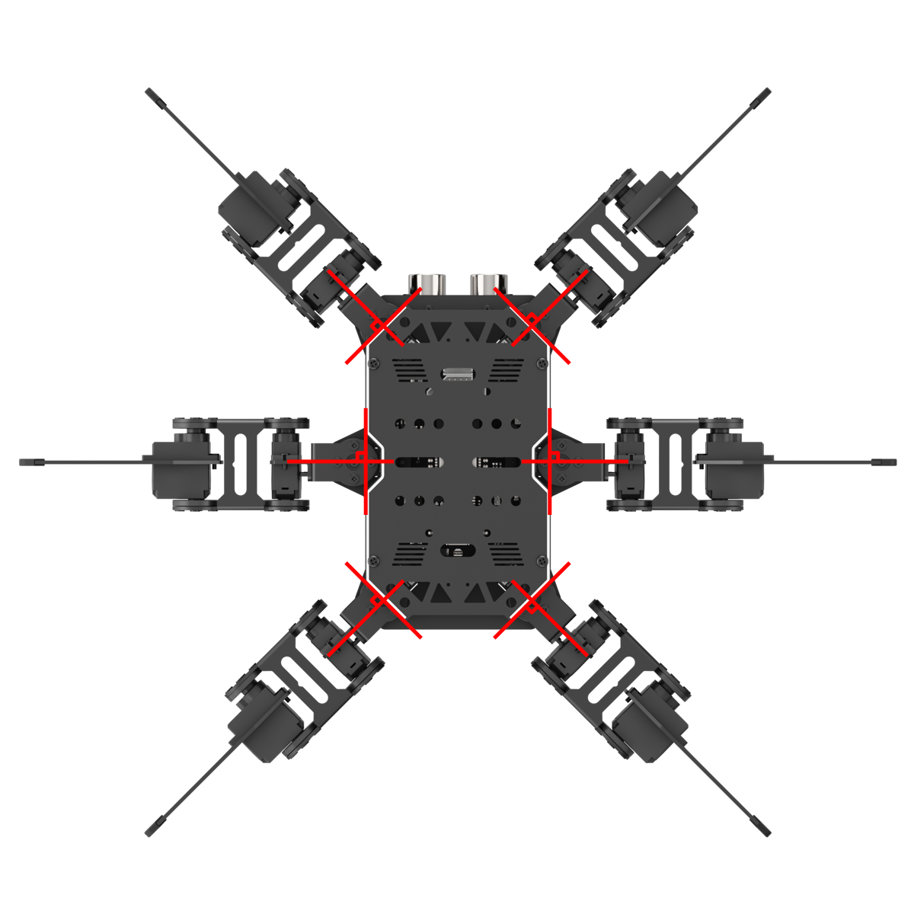

(2) The horizontal axis of the middle joint horn should be perpendicular to the vertical axis of its body. The horizontal axis of the end joint horn of each leg should be parallel to the horizontal axes of the other horns.

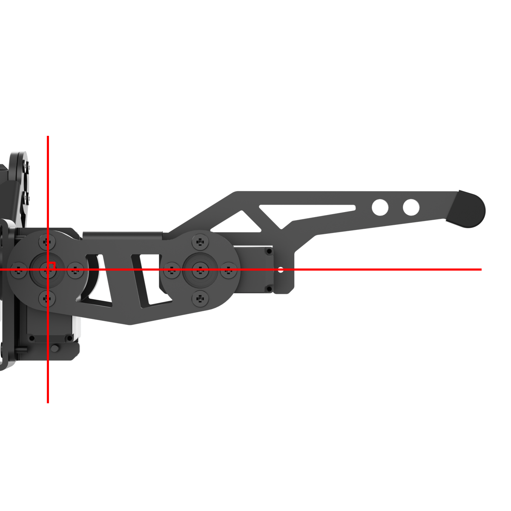

### 4.2.3 Calibration Steps

After long-term use, even servos that have been previously calibrated may develop deviations due to external forces and will need recalibration. You can manually correct them with the PC software by following these steps. Using servo ID 10 as an example:

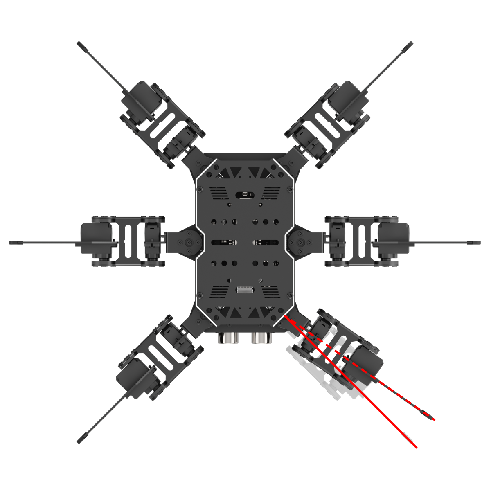

(1) Click  to read the current deviation value of the servos.

(2) In the miniHexa interface area, locate the slider below the corresponding servo icon and drag it to adjust the servo deviation.

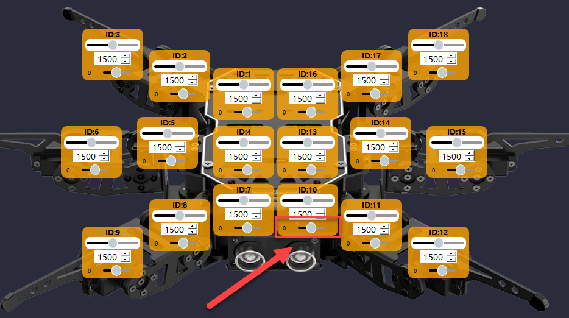

(3) From the figure above, you can see that the robot's right leg is shifted to the right. By moving the deviation slider to the left, the deviation can be corrected.

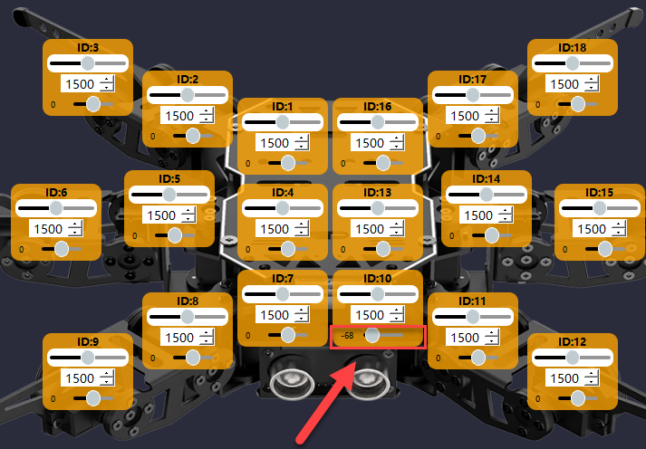

(4) After calibrating each leg, be sure to click Save to save the calibration values.

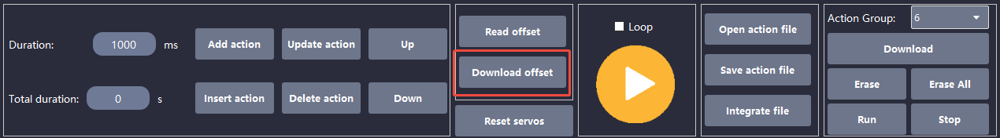

(5) Once all six legs have been checked and adjusted, evaluate the calibration according to the following standards. If one or more legs fail to meet the standard, the affected leg must be recalibrated.

① Lightly touch a leg. The endpoint should not visibly shift.

② Slightly shake the robot body. All legs should remain at their original positions without noticeable movement.

③ Place miniHexa on the ground. All six legs should have no significant height differences. When switching to General Mode or Attitude Mode, miniHexa will automatically stand upright.