# 5. Arduino Project

## 5.1 Arduino IDE Installation and Deviation Calibration

### 5.1.1 Programming Tool Installation and Introduction

#### 5.1.1.1 Arduino IDE Installation and Interface Overview

Arduino IDE is a powerful software platform designed for Arduino microcontrollers. The installation process is the same for all versions. This section uses the Windows version of Arduino IDE 2.2.1 as an example.

1. Find [**02 ArduinoIDE Installation Package\ArduinoIDE.exe**](https://drive.google.com/drive/folders/1ee1KIROgF1P5Sb8J8OkE_Eipua4i2kV5?usp=sharing) in the same directory as this document, then double-click it to open the installer. To download the latest software version, visit the official Arduino website: [**<u>https://www.arduino.cc/en/software</u>**](https://www.arduino.cc/en/software).


2. Click **I Agree** to start installation.


3. Keep the default selected options, then click **Next** to continue.


4. Click **Browse** to select the installation path, then click **Install** to start installation.


5. Wait for the software installation to complete.


> [!NOTE]
>
> **If the installation prompts for chip driver installation, select "Always trust software from Arduino LLC (A)", then click "Install".**

6. After installation is complete, click **Finish**.


* **Interface Overview**

The main interface of Arduino IDE is shown below. It can be divided into five areas.


1. **Menu Bar**: Configures Arduino IDE settings.

| **Icon**                                                     | **Function**                                                 |
| ------------------------------------------------------------ | ------------------------------------------------------------ |
|  | Create or open project files, and configure interface preferences |
|  | Edit options for commenting, indenting, finding text, and other text editing tasks |
|  | Project options for project settings, compiling and running, and adding libraries |
|  | Tools options for selecting the development board and port, and viewing development board information |
|  | Help options for getting started and troubleshooting common issues |

2. **Toolbar**: Provides project tools, including program compilation, program download, and serial monitor.

| **Icon**                                                     | **Function**                                                 |
| ------------------------------------------------------------ | ------------------------------------------------------------ |
|  | Verify. Check whether a program is written correctly. If no errors are found, compile the project |
|  | Upload. Upload the program to the Arduino controller         |
|  | Debug. Some development boards support real-time debugging through Arduino IDE |
|  | Select Board. Select different development boards for project development |
|  | Serial Plotter. Plot data printed to the Arduino serial port as a chart |
|  | Serial Monitor. Print serial port information                |

3. **Editor Area**: Edits code.

4. **Status Bar**: Displays editor status, such as code line and column information and development board information.

5. **Sidebar**: The core area of Arduino IDE. It displays the workspace folder, code debugging tools, library installation tools, and other functions.

| **Icon**                                                     | **Function**                                          |
| ------------------------------------------------------------ | ----------------------------------------------------- |
|  | Project folder. Displays files in the current project |
|  | Board Manager. Adds development board packages        |
|  | Library Manager. Adds or removes program libraries    |
|  | Debug. Performs real-time project debugging           |
|  | Search. Searches or replaces code or variables        |

#### 5.1.1.2 Arduino IDE Instructions

* **Arduino IDE Interface Settings**

1. To switch the interface to Chinese, select **File -> Preferences** in Arduino IDE. In the pop-up window, select the language as needed, then click **OK**.


2. Select **File -> Preferences** to modify the project file path, editor font size, color theme, and other settings in the pop-up window.


* **Arduino Program Download**

1. This section uses a sample program that prints `hiwonder` as an example. Double-click [**03 Demo\Demo.ino**](https://drive.google.com/drive/folders/1Z6aXv9RwrABSYsazCFOaSWRROnPHPqN_?usp=sharing) in the same directory as this document to open the sample program.


2. Connect the controller board to the PC with a data cable.

3. Find the corresponding development board in **Select Board**. This section uses **ESP32 Dev Module** as an example. The COM port is not fixed. Check Device Manager on the PC to view the COM number. This example uses **COM6**.


4. Click  to compile the program and check whether syntax errors or other issues exist.


5. After compiling successfully, click  to upload the program to the ESP32 controller board.


6. After upload is complete, click  to open Serial Monitor. The text `hiwonder` is printed in Serial Monitor.


* **Library Import**

Import the required Kinematics and SensorLib libraries before running the program. Use the following method. The Kinematics library is used as an example.

1. In Arduino IDE, select **Sketch -> Include Library -> Add .ZIP Library**.


2. In the pop-up window, find [**02 ArduinoIDE Installation Package\kinematics.zip**](https://drive.google.com/drive/folders/1ee1KIROgF1P5Sb8J8OkE_Eipua4i2kV5?usp=sharing), then click **Open**.


3. If the following prompt appears, the library file has been installed.


### 5.1.2 Deviation Calibration

> [!NOTE]
>
> **If a new servo is installed or an original servo is removed, deviation calibration must be performed again.**
>
> **After long-term use, calibrated servos may develop deviations again due to external force. Adjust them again if needed. Perform deviation calibration based on the actual motion behavior of the robot.**

#### 5.1.2.1 Preparation

After miniHexa assembly is complete, perform deviation calibration to ensure that miniHexa can move properly in later tutorials. Before starting deviation calibration, make sure the following work is complete.

1. The deviation calibration program in [**04 Deviation Calibration Program Files**](https://drive.google.com/drive/folders/1hq2QDwmlLqv3EcMR9Z6F49bJ2o6qJZrs?usp=sharing) has been downloaded to miniHexa.

2. Open miniHexa PC software, then connect miniHexa to the PC with a data cable.

3. Open the corresponding calibration PC software, then switch to **Action Edit** mode.


#### 5.1.2.2 Deviation Adjustment Standards

Click . All servos of the miniHexa legs rotate to position value `1500`. Check the legs according to the following standards.

1. After the servos return to the central position, the starting segment of the miniHexa legs should be perpendicular to the red line along the top cover edge.


2. The horizontal axis of the middle-joint servo horn should be perpendicular to the longitudinal axis of its servo body. The horizontal axis of the end-joint servo horn should be perpendicular to the horizontal axis of the other servo horn body.


#### 5.1.2.3 Calibration Steps

After long-term use, calibrated servos may develop deviations again due to external force and need to be adjusted again. Follow the steps below to manually calibrate them with PC software. No. 10 servo is used as an example.


1. Click  to read the current servo deviation values.

2. In the miniHexa icon area above, select the slider below the corresponding servo icon. Drag the slider to adjust the servo position deviation value.


3. The figure above shows that the right leg of the robot shifts to the right. Move the deviation slider to the left to calibrate the corresponding deviation.


4. After one leg is calibrated, be sure to click **Download offset** to save the calibration values.


5. After all six legs are checked and calibrated, evaluate the calibration result according to the following standards. If one or more legs fail to meet the standards, calibrate those legs again.

6. Lightly touch a leg of the robot. The contact point of the leg should not show obvious deviation.

7. Slightly shake the robot body. The legs should remain at their original positions without obvious deviation.

8. Place the hexapod robot on the ground. The six legs should have no obvious height difference. Switch to **General Mode** or **Attitude Mode**, and miniHexa will stand automatically.

## 5.2 Basic Motion Control

### 5.2.1 Kinematics and Gait Overview

#### 5.2.1.1 Coordinate System Introduction

1. To control miniHexa, specify the contact point coordinates of the six legs. Inverse kinematics is then used to calculate the rotation angles of all servos, which controls the movement of miniHexa.

2. First establish the coordinate system of miniHexa. Use the center of the body as the origin `0, 0, 0`. From the robot's own perspective, the front is the positive Y-axis, the right side is the positive X-axis, and the upward direction is the positive Z-axis, as shown below:


3. When setting coordinates, only the X-axis, Y-axis, and Z-axis values of the six leg contact points need to be specified.

#### 5.2.1.2 Gait Overview

1. Gait is a periodic summary of the walking characteristics of animals. In simple terms, it describes how an animal walks. Common gait patterns of hexapods include tripod gait and wave gait. Under all conditions, at least three legs must remain in contact with the ground to keep the system stable.

2. The table below lists several common terms used in gait descriptions:

|     **Term**     | **Description**                                              |
| :--------------: | :----------------------------------------------------------- |
|      Phase       | The most direct interpretation is angle. The position in periodic motion. |
| Phase Difference | The lead or lag difference in motion between different legs. |
|   Swing Phase    | The leg is lifted and off the ground.                        |
|   Stance Phase   | The leg is in contact with the ground.                       |
|      Cycle       | During locomotion, the complete process from one touchdown of the foot to the next touchdown of the same foot is one cycle. |
|  Gait Frequency  | The number of gait cycles completed per unit time.           |
|   Step Length    | The distance traveled by the foot endpoint from lift-off to touchdown within one cycle. |
|  Stride Length   | The distance traveled by the body within one cycle.          |
|    Duty Cycle    | The ratio between the time a single leg stays in the stance phase and the gait cycle. |

#### 5.2.1.3 Tripod Gait Introduction

1. Tripod gait is a typical walking gait for hexapod robots. In six-legged insects, all six legs do not move forward at the same time. Instead, the three pairs of legs are divided into two groups and advance alternately in a triangular support structure. In simple terms, three legs move up and down alternately with the other three.

2. This triangular support structure keeps the body in a statically stable state.

3. Most hexapod robots currently use an insect-inspired structure. The six legs are distributed on both sides of the body. The front and rear legs on the left side together with the middle leg on the right side form one group. The front and rear legs on the right side together with the middle leg on the left side form the other group. These two groups form two triangular supports. Support and swing are achieved through the forward and backward swing of the thighs. This is the typical tripod gait walking method.

4. When the hexapod robot uses tripod gait, the two leg groups operate alternately. For clarity, the legs are numbered from the robot's own perspective as shown below:


5. The diagram below is used to analyze tripod gait:


6. As shown on the right side of the figure, legs 2, 4, and 6 lift and swing forward. Legs 1, 3, and 5 support the body and keep the center of gravity at the intersection of the diagonals. At this time, legs 2, 4, and 6 are in the swing phase. Legs 1, 3, and 5 are in the stance phase.

7. Then all six legs touch the ground at the same time. Legs 1, 3, and 5 stay in place. Legs 2, 4, and 6 are farther forward. All legs are in the stance phase.

8. As shown on the left side of the figure, legs 1, 3, and 5 lift and swing forward. Legs 2, 4, and 6 support the body and keep the center of gravity at the intersection of the diagonals. At this time, legs 1, 3, and 5 are in the swing phase. Legs 2, 4, and 6 are in the stance phase.

9. Then all six legs touch the ground at the same time. Legs 2, 4, and 6 stay in place. Legs 1, 3, and 5 are farther forward. All legs are in the stance phase.

10. After these four actions are completed, the robot completes one full gait cycle.

#### 5.2.1.4 Robot Motion Process Analysis

This section uses one leg as an example to explain the motion process from the standing standby stage to the final standing return stage after movement is completed. For ease of description, assume the robot is standing still and receives a command to move straight forward.

**Initial Stage**

1. Before the robot receives the motion command, observe the leg in the figure below. It is touching the ground.


2. After the robot receives the motion command, overall movement begins. When the observed leg is ready to move, it lifts upward to the position directly above, which is the **initial position**, as shown below.


**Motion Stage**

1. During the motion stage, the leg always starts moving from the **initial position**.


2. Based on the motion parameters, the robot controls the leg to swing forward or backward. In the assumed scenario, the robot moves forward, so the leg first swings forward from top to bottom until the toe touches the ground, as shown below.


3. After the toe touches the ground, the leg continues to swing backward. The resulting force drives the robot forward, as shown below.


4. Finally, the leg swings upward from bottom to top and returns to the **initial position**. This completes one full motion cycle of the leg. In the `move` function, which is used to control body movement, the movement step count `step_num` can be specified. The movement step count refers to how many cycles one leg completes, starting from the **initial position**, landing on the ground, and swinging back to the **initial position**.


**Finishing Stage**

1. After the leg completes the last swing, it enters the finishing stage. The motion still starts from the **initial position**.


2. As shown below, the leg drops to the ground and completes the final finishing movement.


#### 5.2.1.5 Robot Kinematics Analysis

Because the overall motion of the robot involves the coupling of the gait algorithm and the inverse kinematics algorithm, analyzing the full system directly is relatively complex. Therefore, one leg is used here as an example so that the gait algorithm can be separated from the discussion and the kinematics can be analyzed directly.

**Single-Leg Structural Modeling**

1. The figure below shows the coordinate-system model of a single leg:


> [!NOTE]
>
> - **In the actual design, a metal plate is mounted at joint `O3` at the end of the leg. Its width extends in the same direction as link r<sub>2</sub>. Therefore, in the following calculations, that width is treated as the foot-end offset `offset` and is included as part of link r<sub>2</sub>.**
> - **In the D-H parameter table and in the forward and inverse kinematics derivations below, r<sub>2</sub> already includes the foot-end offset `offset`.**

<table>
<colgroup>
<col style="width: 19%" />
<col style="width: 19%" />
<col style="width: 19%" />
<col style="width: 20%" />
<col style="width: 20%" />
</colgroup>
<tbody>
<tr>
<td colspan="5" style="text-align: center;">D-H Parameter Table</td>
</tr>
<tr>
<td style="text-align: center;">i</td>
<td style="text-align: center;">d</td>
<td style="text-align: center;">theta</td>
<td style="text-align: center;">r</td>
<td style="text-align: center;">alpha</td>
</tr>
<tr>
<td style="text-align: center;">1</td>
<td style="text-align: center;">0</td>
<td style="text-align: center;">0</td>
<td style="text-align: center;">2.85</td>
<td style="text-align: center;">90</td>
</tr>
<tr>
<td style="text-align: center;">2</td>
<td style="text-align: center;">0</td>
<td style="text-align: center;">0</td>
<td style="text-align: center;">5.2</td>
<td style="text-align: center;">0</td>
</tr>
<tr>
<td style="text-align: center;">3</td>
<td style="text-align: center;">0</td>
<td style="text-align: center;">0</td>
<td style="text-align: center;">7.2</td>
<td style="text-align: center;">0</td>
</tr>
<tr>
<td colspan="5" style="text-align: left;">Description of the four D-H parameters:<br />
1. d is the offset of coordinate system a(i+1) relative to coordinate system a(i) along the Z(i) axis<br />
2. theta is the angle between the X-axes of coordinate systems a(i) and a(i+1)<br />
3. r is the mathematical length of the link<br />
4. alpha is the angle from Z(i-1) to Z(i+1) after rotation around X(i)</td>
</tr>
</tbody>
</table>


**Single-Leg Forward Kinematics Overview**

1. Forward kinematics is a fundamental basis for trajectory planning in joint space and for robot control. For this robot, forward kinematics means calculating the foot-end coordinates from the rotation angles of the three servos on one leg.

2. The forward kinematics process is as follows: given the rotation angles of the three servos on one leg, determine the leg position and then calculate the corresponding foot-end coordinates.

**Single-Leg Forward Kinematics Derivation**

**Known parameters:** joint rotation angles Q<sub>1</sub>, Q<sub>2</sub>, and Q<sub>3</sub>

**Unknown parameters:** the D-H parameter table and the foot-end coordinates p<sub>x</sub>, p<sub>y</sub>, and p<sub>z</sub>

1. The transformation matrix expressions of each joint coordinate system are obtained as follows:

$$
T_{2}^{1} = \begin{bmatrix}
\cos(Q_{1}) & 0 & \sin(Q_{1}) & r_{1}\cos(Q_{1}) \\
\sin(Q_{1}) & 0 & - \cos(Q_{1}) & r_{1}\sin(Q_{1}) \\
0 & 1 & 0 & 0 \\
0 & 0 & 0 & 1
\end{bmatrix}
$$

$$
T_{3}^{2} = \begin{bmatrix}
\cos(Q_{2}) & - \sin(Q_{2}) & 0 & r_{2}\cos(Q_{2}) \\
\sin(Q_{2}) & \cos(Q_{2}) & 0 & r_{2}\sin(Q_{2}) \\
0 & 0 & 1 & 0 \\
0 & 0 & 0 & 1
\end{bmatrix}
$$

$$
T_{4}^{3} = \begin{bmatrix}
\cos(Q_{3}) & - \sin(Q_{3}) & 0 & r_{3}\cos(Q_{3}) \\
\sin(Q_{3}) & \cos(Q_{3}) & 0 & r_{3}\sin(Q_{3}) \\
0 & 0 & 1 & 0 \\
0 & 0 & 0 & 1
\end{bmatrix}
$$

2. By multiplying the matrices sequentially, the overall transformation matrix T<sup>1</sup><sub>4</sub> from the base coordinate system to the foot endpoint coordinate system can be obtained:

$$
T_{2}^{1}T_{3}^{2}T_{4}^{3} = T_{4}^{1} = \begin{bmatrix}
\cos(Q_{2} + Q_{3}) \cdot \cos(Q_{1}) & - \sin(Q_{2} + Q_{3}) \cdot \cos(Q_{1}) & \sin(Q_{1}) & px \\
\cos(Q_{2} + Q_{3}) \cdot \sin(Q_{1}) & - \sin(Q_{2} + Q_{3}) \cdot \sin(Q_{1}) & - \cos(Q_{1}) & py \\
\sin(Q_{2} + Q_{3}) & \cos(Q_{2} + Q_{3}) & 0 & pz \\
0 & 0 & 0 & 1
\end{bmatrix}
$$

3. Here p<sub>x</sub>, p<sub>y</sub>, and p<sub>z</sub> are the end-point coordinates, namely the foot-end coordinates. Their expressions are as follows:

$$
\begin{matrix}
px & = r_{1}\cos(Q_{1}) + r_{2}\cos(Q_{1})\cos(Q_{2}) + r_{3}\cos(Q_{1})\cos(Q_{2})\cos(Q_{3}) + r_{3}\cos(Q_{1})\sin(Q_{2})\sin(Q_{3}) \\
py & = r_{1}\sin(Q_{1}) + r_{2}\cos(Q_{2})\sin(Q_{1}) + r_{3}\cos(Q_{2})\cos(Q_{3})\sin(Q_{1}) - r_{3}\sin(Q_{1})\sin(Q_{2})\sin(Q_{3}) \\
pz & = r_{2}\sin(Q_{2}) + r_{3}\cos(Q_{2})\sin(Q_{3}) + r_{3}\cos(Q_{3})\sin(Q_{2})
\end{matrix}
$$

4. After further simplification:

$$
px = \cos(Q_{1}) \cdot (r_{1} + r_{3} \cdot \cos(Q_{2} + Q_{3}) + r_{2} \cdot \cos(Q_{2}))
$$

$$
py = \sin(Q_{1}) \cdot (r_{1} + r_{3} \cdot \cos(Q_{2} + Q_{3}) + r_{2} \cdot \cos(Q_{2}))
$$

$$
pz = r_{3} \cdot \sin(Q_{2} + Q_{3}) + r_{2} \cdot \sin(Q_{2})
$$

5. This yields the forward kinematics expressions that map servo rotation angles to foot-end coordinates.

**Single-Leg Inverse Kinematics Overview**

1. Inverse kinematics is a fundamental basis for trajectory planning based on the end effector and for robot control. For this robot, inverse kinematics means calculating the rotation angles of the three servos on one leg from the foot-end coordinates.

2. The inverse kinematics process is as follows: given the foot-end coordinates of one leg, determine the leg position and then solve for the corresponding servo rotation angles.

3. After the servo rotation angles are obtained, the corresponding values can be calculated to drive the servos directly and achieve robot motion control.

**Single-Leg Inverse Kinematics Derivation**

**Known parameters:** the D-H parameter table and the foot-end coordinates p<sub>x</sub>, p<sub>y</sub>, and p<sub>z</sub>

**Unknown parameters:** joint rotation angles Q<sub>1</sub>, Q<sub>2</sub>, and Q<sub>3</sub>

1. First, define a matrix that contains the known foot-end coordinates. It will later be multiplied by other matrices containing Q<sub>1</sub>, Q<sub>2</sub>, and Q<sub>3</sub> so that several expressions can be derived for further solving. From the forward kinematics derivation above, T<sup>1</sup><sub>4</sub> meets this requirement. Only the first three elements of the fourth column need to be considered here because they are known values:

$$
T = T_{4}^{1} = \begin{bmatrix}
ax & bx & cx & px \\
ay & by & cy & py \\
az & bz & cz & pz \\
0 & 0 & 0 & 1
\end{bmatrix}
$$

2. Based on the expression of the transformation matrix:

$$
(T_{2}^{1})^{- 1} \cdot T = (T_{2}^{1})^{- 1} \cdot T_{2}^{1} \cdot T_{3}^{2} \cdot T_{4}^{3} = T_{3}^{2} \cdot T_{4}^{3}
$$

3. Derive the expressions on both sides:

$$
(T_{2}^{1})^{- 1} \cdot T = \begin{bmatrix}
\cos(Q_{2} + Q_{3}) & - \sin(Q_{2} + Q_{3}) & 0 & px\cos(Q_{1}) - r_{1} + py\sin(Q_{1}) \\
\sin(Q_{2} + Q_{3}) & \cos(Q_{2} + Q_{3}) & 0 & pz \\
0 & 0 & 1 & px\sin(Q_{1}) - py\cos(Q_{1}) \\
0 & 0 & 0 & 1
\end{bmatrix}
$$

$$
T_{3}^{2} \cdot T_{4}^{3} = \begin{bmatrix}
\cos(Q_{2} + Q_{3}) & - \sin(Q_{2} + Q_{3}) & 0 & r_{3}\cos(Q_{2} + Q_{3}) + r_{2}\cos(Q_{2}) \\
\sin(Q_{2} + Q_{3}) & \cos(Q_{2} + Q_{3}) & 0 & r_{3}\sin(Q_{2} + Q_{3}) + r_{2}\sin(Q_{2}) \\
0 & 0 & 1 & 0 \\
0 & 0 & 0 & 1
\end{bmatrix}
$$

4. By equating the first three elements of the fourth column of these two matrices, three expressions are obtained:

`(1-1)`

$$
r_{3} \cdot \cos(Q_{2} + Q_{3}) = px \cdot \cos(Q_{1}) - r_{1} + py \cdot \sin(Q_{1}) - r_{2} \cdot \cos(Q_{2})
$$

`(1-2)`

$$
r_{3} \cdot \sin(Q_{2} + Q_{3}) = pz - r_{2} \cdot \sin(Q_{2})
$$

`(1-3)`

$$
px \cdot \sin(Q_{1}) - py \cdot \cos(Q_{1}) = 0
$$

5. Further derivation of equation `(1-3)` gives the expression for Q<sub>1</sub> in terms of p<sub>x</sub>, p<sub>y</sub>, and p<sub>z</sub>:

$$
Q_{1} = \arctan\left( \frac{px}{py} \right)
$$

6. By observing equations `(1-1)` and `(1-2)`, it can be seen that the two expressions contain trigonometric functions of Q<sub>2</sub> and Q<sub>2</sub>+Q<sub>3</sub>. The next step is to simplify them using the identity sin<sup>2</sup>x + cos<sup>2</sup>x = 1. First, isolate the parts that are not trigonometric functions of Q<sub>2</sub> and Q<sub>2</sub>+Q<sub>3</sub>, and consolidate them into m<sub>1</sub> and m<sub>2</sub>. **Since Q<sub>1</sub> has already been obtained above, both m<sub>1</sub> and m<sub>2</sub> are known values.**

$$
m_{1} = px \cdot \cos(Q_{1}) - r_{1} + py \cdot \sin(Q_{1})
$$

$$
m_{2} = pz
$$

7. After simplification, equations `(1-1)` and `(1-2)` can be rewritten as:

`(1-4)`

$$
r_{3} \cdot \cos(Q_{2} + Q_{3}) = m_{1} - r_{2} \cdot \cos(Q_{2})
$$

`(1-5)`

$$
r_{3} \cdot \sin(Q_{2} + Q_{3}) = m_{2} - r_{2} \cdot \sin(Q_{2})
$$

8. Square both sides of equations `(1-4)` and `(1-5)`, then add the left-hand sides and the right-hand sides respectively to obtain:

`(1-6)`

$$
{r_{3}}^{2} = {r_{2}}^{2} - 2 \cdot \cos(Q_{2}) \cdot r_{2} \cdot m_{1} - 2 \cdot \sin(Q_{2}) \cdot r_{2} \cdot m_{2} + {m_{1}}^{2} + {m_{2}}^{2}
$$

9. Further consolidate parts of the expression above. From the following definitions, n<sub>1</sub>, n<sub>2</sub>, and n<sub>3</sub> are **all known values**:

$$
n_{1} = 2 \cdot r_{2} \cdot m_{1}
$$

$$
n_{2} = 2 \cdot r_{2} \cdot m_{2}
$$

$$
n_{3} = {r_{2}}^{2} + {m_{1}}^{2} + {m_{2}}^{2} - {r_{3}}^{2}
$$

10. After further simplification of equation `(1-6)`:

$$
n_{1} \cdot \cos(Q_{2}) + n_{2} \cdot \sin(Q_{2}) = n_{3}
$$

11. Further derivation yields the expression for Q<sub>2</sub> in terms of p<sub>x</sub>, p<sub>y</sub>, and p<sub>z</sub>:

$$
Q_{2} = \arctan\left( \frac{{n_{1}}^{2} + {n_{2}}^{2} - {n_{3}}^{2}}{n_{3}} \right) + \arctan\left( \frac{n_{2}}{n_{1}} \right)
$$

12. Substitute the expression for Q<sub>2</sub> back into equation `(1-4)` or `(1-5)` to obtain the expression for Q<sub>3</sub>:

$$
Q_{3} = \arctan\left( \frac{m_{2} - r_{2}\sin Q_{2}}{m_{1} - r_{2}\cos Q_{2}} \right) - Q_{2}
$$

13. After consolidation, the inverse kinematics expressions for the joint rotation angles Q<sub>1</sub>, Q<sub>2</sub>, and Q<sub>3</sub> are listed again below:

$$
Q_{1} = \arctan\left( \frac{px}{py} \right)
$$

$$
Q_{2} = \arctan\left( \frac{{n_{1}}^{2} + {n_{2}}^{2} - {n_{3}}^{2}}{n_{3}} \right) + \arctan\left( \frac{n_{2}}{n_{1}} \right)
$$

$$
Q_{3} = \arctan\left( \frac{m_{2} - r_{2}\sin Q_{2}}{m_{1} - r_{2}\cos Q_{2}} \right) - Q_{2}
$$

### 5.2.2 Omnidirectional Movement

#### 5.2.2.1 Feature Overview

This section controls miniHexa to move in different directions.

#### 5.2.2.2 Project Process


#### 5.2.2.3 Program Download

1. Connect miniHexa to the PC with a Type-C data cable.


2. Open [**02 Program Files\02 Omnidirectional Motion Program Files\omnidirectional_movement\omnidirectional_movement.ino**](https://drive.google.com/drive/folders/1-PDXSoWZ5acbfqOSB0exrhrJIsEYGBzN?usp=sharing) in the same directory as this document.


3. After the file is opened, select the development board model shown below:


4. Click **Tools** in the menu bar and select the corresponding ESP32 development board configuration as shown below.


> [!NOTE]
>
> **Make sure to modify the development board configuration before program download.**

5. Click **Compile** first, then click **Upload**. When the output panel at the bottom displays the success message, the program has been downloaded successfully.


#### 5.2.2.4 Project Outcome

After power-on, the hexapod robot cycles through movement in ten directions: forward, forward-right, right, backward-right, backward, backward-left, left, forward-left, turn left in place, and turn right in place.

#### 5.2.2.5 Program Analysis

1. Import the `hiwonder_robot.h` library file. This library contains the low-level control interfaces of the robot.

```cpp
    #include "hiwonder_robot.h"
```

2. Initialize the `miniHexa` object and define the motion mode variable `count`. Then create the robot motion arrays `vel`, `pos`, and `att`, which represent velocity, position, and Euler angles.

```cpp
    // Initialize miniHexa object
    Robot minihexa;
    
    // Define variable `count` to record the motion mode
    uint8_t count = 0;
    // Initialize motion state
    Velocity_t vel = {0.0f,0.0f,0.0f};
    Vector_t pos = {0.0f,0.0f,0.0f};
    Euler_t att = {0.0f,0.0f,0.0f};
```

3. In the `setup()` function, set the initial serial communication baud rate to `115200`, then initialize the robot.

```cpp
   void setup() {
     Serial.begin(115200);
     minihexa.begin();
   }
```

4. In the `loop()` main function, the ten different movement directions are executed cyclically according to the loop of variable `count`. By modifying the three parameters in `vel`, the direction of body movement can be changed. The first parameter of `vel` controls the left and right movement speed of the body along the X-axis. The second parameter controls the forward and backward movement speed of the body along the Y-axis. The third parameter controls the in-place rotation speed of the body around the Z-axis. After `vel` is passed into the `move` function, the robot starts moving according to the specified parameters. After `5.5 s`, the next group of motion parameters is passed into the `move` function, and the robot switches to the next motion state.

```cpp
    void loop() {
      switch(count) {
        case 0:// Forward
          count++;
          vel = {0.0f, 3.0f, 0.0f};
          break;
      
        case 1:// Forward-right
          count++;
          vel = {2.0f, 2.0f, 0.0f};
          break;

        case 2:// Move right
          count++;
          vel = {3.0f, 0.0f, 0.0f};
          break;

        case 3:// Backward-right
          count++;
          vel = {2.0f, -2.0f, 0.0f};
          break;

        case 4:// Backward
          count++;
          vel = {0.0f, -3.0f, 0.0f};
          break;

        case 5:// Backward-left
          count++;
          vel = {-2.0f, -2.0f, 0.0f};
          break;

        case 6:// Move left
          count++;
          vel = {-3.0f, 0.0f, 0.0};
          break;

        case 7:// Forward-left
          count++;
          vel = {-2.0f, 2.0f, 0.0f};
          break;

        case 8:// Turn left in place
          count++;
          vel = {0.0f, 0.0f, 2.0f};
          break;

        case 9:// Turn right in place
          count = 0;
          vel = {0.0f, 0.0f, -2.0f};
          break;
      }
      delay(5500);
      minihexa.move(&vel, &pos, &att, 1800, 3);
    }
```

5. `case 0` is used here as an example. The movement direction of the body is mainly changed by modifying the parameters of `vel`. When the Y-axis speed is set to `3`, the body moves forward.

```cpp
    case 0:// Forward
      count++;
      vel = {0.0f, 3.0f, 0.0f};  // Set the Y-axis speed to 3 so the body moves forward
      break;
```

6. `case 1` is used here as an example. Set the X-axis speed to `2` so the body translates to the right. Then add a Y-axis speed of `2` so the body moves forward. Under the combined effect of these two directions, the body moves toward the forward-right direction.

```cpp
    case 1:// Forward-right
      count++;
      vel = {2.0f, 2.0f, 0.0f};  // X-axis speed 2 to the right and Y-axis speed 2 forward
      break;
```

7. `case 8` is used here as an example. Set the Z-axis speed to `2.0f`, and the body rotates to the left in place.

```cpp
    case 8:// Turn left in place
      count++;
      vel = {0.0f, 0.0f, 2.0f};  // Z-axis speed 2 so the body turns left in place
      break;
```

### 5.2.3 Turn Left and Right

#### 5.2.3.1 Feature Overview

This section controls miniHexa to perform left and right turning motion.

#### 5.2.3.2 Project Process


<p id="5.2.3.3"></p>

#### 5.2.3.3 Program Download

1. Connect miniHexa to the PC with a Type-C data cable.


2. Open [**02 Program Files\03 Turn Left and Right Program Files\Turn_left_and_right_movement\Turn_left_and_right_movement.ino**](https://drive.google.com/drive/folders/1_9am8CzUiqHpKP4njosw1dgbK9aok-vu?usp=sharing) in the same directory as this document.


3. After the file is opened, select the development board model shown below:


4. Click **Tools** in the menu bar and select the corresponding ESP32 development board configuration as shown below.


> [!NOTE]
>
> **Make sure to modify the development board configuration before program download.**

5. Click **Compile** first, then click **Upload**. When the output panel at the bottom displays the success message, the program has been downloaded successfully.


#### 5.2.3.4 Project Outcome

After power-on, the hexapod robot repeatedly performs left and right arc turns.

#### 5.2.3.5 Program Analysis

1. Import the `hiwonder_robot.h` library file. This library contains the low-level control interfaces of the robot.

```cpp
    #include "hiwonder_robot.h"
```

2. Initialize the `miniHexa` object and create the robot motion arrays `vel`, `pos`, and `att`, which represent velocity, position, and Euler angles.

```cpp
    // Initialize miniHexa object
    Robot minihexa;

    // Initialize motion state
    Velocity_t vel = {0.0f,0.0f,0.0f};
    Vector_t pos = {0.0f,0.0f,0.0f};
    Euler_t att = {0.0f,0.0f,0.0f};
```

3. In the `setup()` function, set the initial serial communication baud rate to `115200`, then initialize the robot.

```cpp
    void setup() {
      Serial.begin(115200);
      minihexa.begin();
    }
```

4. In the `loop()` main function, the robot repeatedly performs left and right turns by changing the `vel` array. First execute a left arc turn. Set the Y-axis speed in `vel` to `5` so the robot translates forward. Set the Z-axis speed to `0.2` so the robot rotates to the left. The combined effect of these two motions makes the robot turn left.

```cpp
    void loop() {
        vel = {0.0f, 5.0f, 0.2f};// Left arc forward
        minihexa.move(&vel, &pos, &att);// Execute movement
        delay(5000);
    }
```

5. Set the Y-axis speed to `5` and the Z-axis speed to `-0.2` to make the robot turn right.

```cpp
        vel = {0.0f, 5.0f, -0.2f};// Right arc forward
        minihexa.move(&vel, &pos, &att);// Execute movement
        delay(5000);
    }
```

#### 5.2.3.6 Feature Extension

**This section uses changing the turning angle of miniHexa as an example to show how to modify the turning angle.** Refer to the steps below:

1. Locate the turning code in the main function.

```cpp
    void loop() {
        vel = {0.0f, 5.0f, 0.2f};// Left arc forward
        minihexa.move(&vel, &pos, &att);// Execute movement
        delay(5000);

        vel = {0.0f, 5.0f, -0.2f};// Right arc forward
        minihexa.move(&vel, &pos, &att);// Execute movement
        delay(5000);
    }
```

2. Modify the third value `omega` in `vel`. Here it is changed to `0.3f` to increase the turning angle.

> [!NOTE]
>
> **The third `omega` value in `vel` should not be set too high. Otherwise, the effect of left rotation will greatly exceed the effect of forward translation, and the robot will behave more like it is rotating in place.**

```cpp
void loop() {
    vel = {0.0f, 5.0f, 0.3f};// Left arc forward with a larger turning angle
    minihexa.move(&vel, &pos, &att);// Execute movement
    delay(5000);

    vel = {0.0f, 5.0f, -0.3f};// Right arc forward with a larger turning angle
    minihexa.move(&vel, &pos, &att);// Execute movement
    delay(5000);
}
```

3. After the modification is completed, refer to [5.2.3.3 Program Download](#5.2.3.3) to run the program.

### 5.2.4 Speed Adjustment

#### 5.2.4.1 Feature Overview

This section controls miniHexa to move at different speeds.

#### 5.2.4.2 Project Process


#### 5.2.4.3 Program Download

1. Connect miniHexa to the PC with a Type-C data cable.


2. Open [**02 Program Files\04 Speed Adjustment Program Files\velocity_adjust\velocity_adjust.ino**](https://drive.google.com/drive/folders/1cbZT9ZwS16bd6tIxicxnN_1bP3KLC3fB?usp=sharing) in the same directory as this document.


3. After the file is opened, select the development board model shown below:


4. Click **Tools** in the menu bar and select the corresponding ESP32 development board configuration as shown below.


> [!NOTE]
>
> **Make sure to modify the development board configuration before program download.**

5. Click **Compile** first, then click **Upload**. When the output panel at the bottom displays the success message, the program has been downloaded successfully.


#### 5.2.4.4 Project Outcome

After power-on, the hexapod robot repeatedly performs left rotation in place from slow to fast. The speed increases by `0.5` each time, from `0.5` to `2.0`, then returns to `0.5` and repeats in sequence.

#### 5.2.4.5 Program Analysis

1. Import the `hiwonder_robot.h` library file. This library contains the low-level control interfaces of the robot.

```cpp
    #include "hiwonder_robot.h"
```

2. Initialize the `miniHexa` object, define the variable `count`, and create the robot motion arrays `vel`, `pos`, and `att` for velocity, position, and Euler angles.

```cpp
    Robot minihexa;

    uint8_t count = 0;
    // Initialize robot motion
    Velocity_t vel = {0.0f,0.0f,0.0f};
    Vector_t pos = {0.0f,0.0f,0.0f};
    Euler_t att = {0.0f,0.0f,0.0f};
```

3. In the `setup()` function, set the initial serial communication baud rate to `115200`, then initialize the robot.

```cpp
    void setup() {
      Serial.begin(115200);
      minihexa.begin();
    }
```

4. In the `loop()` main function, four different movement speeds are executed cyclically according to the changing value of variable `count`.

```cpp
    void loop() {
      switch(count) {
        case 0:// Slowest left turn in place
          count++;
          vel = {0.0f, 0.0f, 1.0f};
          delay(5000);
          break;
      
        case 1:// Slower left turn in place
          count++;
          vel = {0.0f, 0.0f, 1.5f};
          delay(5000);
          break;

        case 2:// Medium-speed left turn in place
          count++;
          vel = {0.0f, 0.0f, 2.0f};
          delay(5000);
          break;

        case 3:// High-speed left turn in place
          count = 0;
          vel = {0.0f, 0.0f, 2.5f};
          delay(5000);
          break;
      }

      minihexa.move(&vel, &pos, &att);// Execute movement
    }
```

5. In the `switch` statement, the rotation speed of miniHexa is changed by modifying the variable `count` and the `vel` array.

```cpp
        case 0:// Slowest left turn in place
          count++;
          vel = {0.0f, 0.0f, 1.0f};  // Z-axis speed 1.0 for the slowest speed
          delay(5000);
          break;
```

### 5.2.5 Gait Parameter Adjustment

#### 5.2.5.1 Feature Overview

This section modifies the gait parameters of miniHexa so the robot can move in different postures.

#### 5.2.5.2 Project Process


#### 5.2.5.3 Program Download

1. Connect miniHexa to the PC with a Type-C data cable.


2. Open [**02 Program Files\05 Gait Parameter Adjustment Program Files\gait_parameter_adjust\gait_parameter_adjust.ino**](https://drive.google.com/drive/folders/12S6JA_7KVoTGgjJ5aOSdOn8Dzdp4dpyi?usp=sharing) in the same directory as this document.


3. After the file is opened, select the development board model shown below:


4. Click **Tools** in the menu bar and select the corresponding ESP32 development board configuration as shown below.


> [!NOTE]
>
> **Make sure to modify the development board configuration before program download.**

5. Click **Compile** first, then click **Upload**. When the output panel at the bottom displays the success message, the program has been downloaded successfully.


#### 5.2.5.4 Project Outcome

After power-on, the hexapod robot repeatedly performs movement in six different gait modes.

#### 5.2.5.5 Program Analysis

1. Import the `hiwonder_robot.h` library file. This library contains the low-level control interfaces of the robot.

```cpp
    #include "hiwonder_robot.h"
```

2. Initialize the `miniHexa` object and define the variable `count`. Create `step_num`, which is the number of iterations in the motion discretization process, and `move_time`, which is the motion duration. Then create the robot motion arrays `vel`, `pos`, and `att`, which represent velocity, position, and Euler angles.

```cpp
    // Initialize miniHexa object
    Robot minihexa;

    // Define motion mode variable `count`
    uint8_t count = 0;
    // Number of iterations in the discretized motion process, which is the foothold count
    int step_num = -1;
    // Initialize motion duration
    uint32_t move_time = 1000;
    // Leg lift height
    float leg_lift = 2.0f;
    // Initialize body motion
    Velocity_t vel = {0.0f,0.0f,0.0f};
    Vector_t pos = {0.0f,0.0f,0.0f};
    Euler_t att = {0.0f,0.0f,0.0f};
```

3. In the `setup()` function, set the initial serial communication baud rate to `115200`, then initialize miniHexa.

```cpp
    void setup() {
      Serial.begin(115200);
      minihexa.begin();
    }
```

4. In the `loop()` main function, six different gait modes are executed cyclically according to the changing value of variable `count`.

```cpp
    void loop() {
      switch(count) {
        case 0:
          count++;
          vel = {0.0f, 2.0f, 0.0f};// Forward
          move_time = 600;// Define runtime
          step_num = 3;
          break;
      
        case 1:
          count++;
          vel = {0.0f, 2.0f, 0.0f};
          move_time = 1000;
          step_num = 2;
          break;

        case 2:
          count++;
          vel = {0.0f, -2.0f, 0.0f};
          move_time = 600;
          step_num = 3;
          break;

        case 3:
          count++;
          vel = {0.0f, -2.0f, 0.0f};
          move_time = 1000;
          step_num = 2;
          break;

        case 4:
          count++;
          vel = {0.0f, 0.0f, 2.0f};
          move_time = 600;
          step_num = 2;
          break;

        case 5:
          vel = {0.0f, 0.0f, -2.0f};
          move_time = 1000;
          step_num = -1;
          break;
      }

      minihexa.move(&vel, &pos, &att, move_time, step_num);
      delay(4000);
    }
```

5. The parameters that affect gait are `move_time`, which is the motion duration, and `step_num`, which is the foothold count. The robot gait can be changed by modifying these parameters. In `case 0`, the Y-axis speed in `vel` is set to `2.0`, the motion duration is set to `600 ms`, and the foothold count is `3`. In this state, the robot moves forward along the positive Y-axis at a speed of `2.0`. The motion lasts `600 ms` and completes `3` footholds.

```cpp
        case 0:
          count++;
          vel = {0.0f, 2.0f, 0.0f};// Forward
          move_time = 600;// Define runtime
          step_num = 3;
          break;
```

6. In `case 5`, the motion duration is set to `1000 ms` and the foothold count is set to `-1`, which means continuous walking. In this state, the robot continuously performs the specified movement pattern for `1000 ms`.

```cpp
        case 5:
          vel = {0.0f, 0.0f, -2.0f};
          move_time = 1000;
          step_num = -1;
          break;
```

### 5.2.6 Posture Adjustment

#### 5.2.6.1 Feature Overview

This section changes the motion posture of the hexapod robot by modifying posture parameters.

#### 5.2.6.2 Project Process


#### 5.2.6.3 Program Download

1. Connect miniHexa to the PC with a Type-C data cable.


2. Open [**02 Program Files\06 Posture Adjustment Program Files\pose_adjust\pose_adjust.ino**](https://drive.google.com/drive/folders/14KB6sxrt94CMVHDjD0xlkMtRpMXGixe4?usp=sharing) in the same directory as this document.


3. After the file is opened, select the development board model shown below:


4. Click **Tools** in the menu bar and select the corresponding ESP32 development board configuration as shown below.


> [!NOTE]
>
> **Make sure to modify the development board configuration before program download.**

5. Click **Compile** first, then click **Upload**. When the output panel at the bottom displays the success message, the program has been downloaded successfully.


#### 5.2.6.4 Project Outcome

After power-on, miniHexa repeatedly changes among `12` different postures.

#### 5.2.6.5 Program Analysis

1. Import the `hiwonder_robot.h` library file. This library contains the low-level control interfaces of the robot.

```cpp
    #include "hiwonder_robot.h"
```

2. Initialize the `miniHexa` object. Then initialize the variable `count` and create the robot motion arrays `vel`, `pos`, and `att`, which represent velocity, position, and Euler angles.

```cpp
    Robot minihexa;

    uint8_t count = 0;
    Velocity_t vel = {0.0f,0.0f,0.0f};
    Vector_t pos = {0.0f,0.0f,0.0f};
    Euler_t att = {0.0f,0.0f,0.0f};
```

3. In the `setup()` function, set the initial serial communication baud rate to `115200`, then initialize the robot.

```cpp
    void setup() {
      Serial.begin(115200);
      minihexa.begin();
    }
```

4. In the `loop()` main function, twelve different posture movements are executed cyclically according to the changing value of variable `count`.

```cpp
    void loop() {
      switch(count) {
        case 0:
          count++;
          pos = {3.0f, 0.0f, 0.0f};
          att = {0.0f, 0.0f, 0.0f};
          delay(1000);
          break;
      
        case 1:
          count++;
          pos = {0.0f, 3.0f, 0.0f};
          delay(1000);
          break;

        case 2:
          count++;
          pos = {-3.0f, 0.0f, 0.0f};
          delay(1000);
          break;

        case 3:
          count++;
          pos = {0.0f, -3.0f, 0.0f};
          delay(1000);
          break;

        case 4:
          count++;
          pos = {0.0f, 0.0f, 3.0f};
          delay(1000);
          break;

        case 5:
          count++;
          pos = {0.0f, -2.0f, -1.0f};
          delay(1000);
          break;

        case 6:
          count++;
          att = {8.0f, 0.0f, 0.0f};
          pos = {0.0f, 0.0f, 0.0f};
          delay(1000);
          break;

        case 7:
          count++;
          att = {-8.0f, 0.0f, 0.0};
          delay(1000);
          break;

        case 8:
          count++;
          att = {0.0f, 12.0f, 0.0f};
          delay(1000);
          break;

        case 9:
          count++;
          att = {0.0f, -12.0f, 0.0f};
          delay(1000);
          break;

        case 10:
          count++;
          att = {0.0f, 0.0f, 12.0f};
          delay(1000);
          break;
      
        case 11:
          count = 0;
          att = {0.0f, 0.0f, -12.0f};
          delay(1000);
          break;
      }

      minihexa.move(&vel, &pos, &att, 600);
    }
```

5. The three parameters in the `pos` center-of-gravity position array control posture translation of miniHexa along the X-axis, Y-axis, and Z-axis. The first parameter controls left and right translation of the body center of gravity along the X-axis. The second parameter controls forward and backward translation along the Y-axis. The third parameter controls the height of the body center of gravity along the Z-axis. Modify the corresponding parameter values to change the body posture.

```cpp
        case 0:
          count++;
          pos = {3.0f, 0.0f, 0.0f};  // Shift the center of gravity 3.0 to the right along the X-axis
          att = {0.0f, 0.0f, 0.0f};
          delay(1000);
          break;
      
        case 1:
          count++;
          pos = {0.0f, 3.0f, 0.0f};  // Shift the center of gravity forward by 3.0 along the Y-axis
          delay(1000);
          break;

        case 4:
          count++;
          pos = {0.0f, 0.0f, 3.0f};  // Shift the center of gravity upward by 3.0 along the Z-axis
          delay(1000);
          break;
```

6. The three parameters in the `att` posture array control posture tilt of miniHexa around the X-axis, Y-axis, and Z-axis. The first parameter is the Euler angle around the X-axis, which controls pitch. The second parameter is the Euler angle around the Y-axis, which controls roll. The third parameter is the Euler angle around the Z-axis, which controls yaw. Modify the corresponding parameter values on each axis to change the body posture.

```cpp
        case 6:
          count++;
          att = {8.0f, 0.0f, 0.0f};  // Pitch 8 degrees around the X-axis
          pos = {0.0f, 0.0f, 0.0f};
          delay(1000);
          break;
    
        case 8:
          count++;
          att = {0.0f, 12.0f, 0.0f};  // Roll 12 degrees around the Y-axis
          delay(1000);
          break;
    
        case 10:
          count++;
          att = {0.0f, 0.0f, 12.0f};  // Yaw 12 degrees around the Z-axis
          delay(1000);
          break;
```

## 5.3 Secondary Development Project

### 5.3.1 Action Group Overview and Hands-on Instructions

#### 5.3.1.1 Feature Overview

This lesson introduces miniHexa action groups and explains how to execute actions through a program.

A robot action group is a predefined sequence of action steps. The robot follows these steps to complete specific tasks, such as moving, dancing, and other motions.

miniHexa includes 14 built-in action groups. These action groups are directly available. The action group names are listed below.

| Action Group Number | Action Description      |
| :-----------------: | :---------------------- |
|          1          | Twist Counterclockwise  |
|          2          | Twist Clockwise         |
|          3          | Wake Up                 |
|          4          | Wake Up and Run         |
|          5          | Act Cute                |
|          6          | Obstacle Crossing       |
|          7          | Battle 1                |
|          8          | Battle 2                |
|          9          | Left Foot Kick Forward  |
|         10          | Left Foot Kick Right    |
|         11          | Right Foot Kick Forward |
|         12          | Right Foot Kick Left    |
|         13          | Push Door               |
|         14          | Waving                  |

#### 5.3.1.2 Project Process

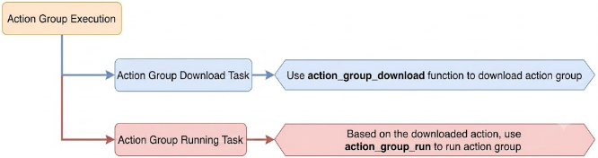

<p id ="anther5.3.1.3"></p>

#### 5.3.1.3 Program Download

1. Connect miniHexa to a PC with a Type-C data cable.


2. Open [**02 Program Files\01 Action Group Execution Program\action_group\action_group.ino**](https://drive.google.com/drive/folders/1RYo2L1ZhlKrbUaDsvX4cIeTVxYnk9TD1?usp=sharing).

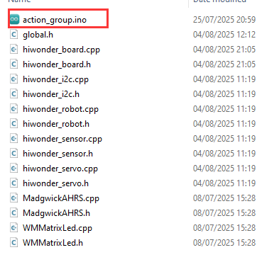

3. After the file opens, select the development board model shown below.


4. Click **Tools** in the menu bar, then select the ESP32 development board configuration shown below.


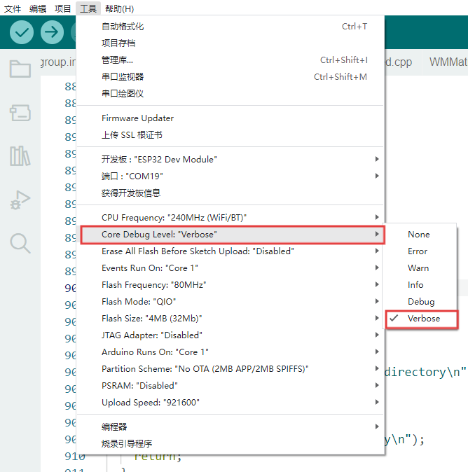

> [!NOTE]
>
> **Make sure the development board configuration is modified before downloading the program.**

5. Click **Compile**, then click **Upload**. When the following screen appears in the output box at the bottom of the software, the program download is complete.


#### 5.3.1.4 Project Outcome

After miniHexa powers on, it runs the pre-edited action group.

#### 5.3.1.5 Program Analysis

1. Import the `hiwonder_robot.h` library. This library contains methods for interacting with the robot system.

```cpp
    #include "hiwonder_robot.h"
```

2. Create and define the two-dimensional array `write_data`. The two arrays store the action data.

```cpp
    Robot minihexa;

    uint8_t result;

    uint8_t write_data[2][60] = {{0,2,1,18,200,0,1,173,6,2,58,4,3,69,2,4,127,6,5,205,4,6,88,2,7,190,6,8,164,3,9,246,3,10,173,6,11,86,6,12,206,8,13,127,6,14,234,6,15,95,9,16,190,6,17,161,7,18,194,9},
                                 {0,2,2,18,144,1,1,225,5,2,204,4,3,71,2,4,226,5,5,235,4,6,77,2,7,220,5,8,233,4,9,97,2,10,8,6,11,206,6,12,70,9,13,235,5,14,203,6,15,115,9,16,220,5,17,234,6,18,89,9}};
```

3. In the `setup()` function, set the serial communication baud rate to `115200`, then initialize the robot.

```cpp
    void setup() {
      Serial.begin(115200);
      minihexa.begin();
    }
```

4. Call `list_action_group_dir()` to list the action files and their file sizes. The listed action files are displayed only when log output is enabled.

```cpp
      /* List action group files */
      minihexa.list_action_group_dir();
```

5. Use `minihexa.action_group_download()` to download the action group. This action group consists of two actions, so two actions need to be downloaded. Then call `action_group_run()` to run the action group.

```cpp
      /* Download the action group */
      minihexa.action_group_download(0, write_data[0], 60);
      minihexa.action_group_download(0, write_data[1], 60);
      /* Run the action group */
      minihexa.action_group_run(0);
    }
```

6. The `loop()` main program contains no running logic, so this program runs only once.

```cpp
    void loop() {
    }
```

#### 5.3.1.6 Program Analysis

The `action_group_download()` and `action_group_run()` functions are defined in [**02 Program Files\01 Action Group Execution Program\action_group\hiwonder_robot.cpp**](https://drive.google.com/drive/folders/1RYo2L1ZhlKrbUaDsvX4cIeTVxYnk9TD1?usp=sharing). miniHexa downloads the action group data and runs the corresponding action sequence.

#### 5.3.1.7 Feature Extension

Modify the two-dimensional array `write_data` to add, remove, or edit custom action groups.

1. In `action_group.ino`, find the `write_data` array and modify it. In this example, the original action group is copied once so that miniHexa performs the **waving motion twice**.

```cpp
    uint8_t write_data[2][60] = {{0,2,1,18,200,0,1,173,6,2,58,4,3,69,2,4,127,6,5,205,4,6,88,2,7,190,6,8,164,3,9,246,3,10,173,6,11,86,6,12,206,8,13,127,6,14,234,6,15,95,9,16,190,6,17,161,7,18,194,9},
                                 {0,2,2,18,144,1,1,225,5,2,204,4,3,71,2,4,226,5,5,235,4,6,77,2,7,220,5,8,233,4,9,97,2,10,8,6,11,206,6,12,70,9,13,235,5,14,203,6,15,115,9,16,220,5,17,234,6,18,89,9}};
```

2. Copy the original action group and modify the circled data in the figure. Change `write_data[2][60]` to `write_data[4][60]` to modify the size of the two-dimensional array. Change the second element in the array to `4` to indicate that the action group contains four actions. Change the third element to the action number. For example, set the first action to `1` and the second action to `2`.

```cpp
   // Change the array size from [2][60] to [4][60]
   // Change the action count: change the third element from 2 to 4 to indicate four actions
   // Change the action numbers: the first action is 1, the second is 2, the third is 3, and the fourth is 4
   uint8_t write_data[4][60] = {{0,2,1,18,200,0,1,173,6,2,58,4,3,69,2,4,127,6,5,205,4,6,88,2,7,190,6,8,164,3,9,246,3,10,173,6,11,86,6,12,206,8,13,127,6,14,234,6,15,95,9,16,190,6,17,161,7,18,194,9},
                                {0,2,2,18,144,1,1,225,5,2,204,4,3,71,2,4,226,5,5,235,4,6,77,2,7,220,5,8,233,4,9,97,2,10,8,6,11,206,6,12,70,9,13,235,5,14,203,6,15,115,9,16,220,5,17,234,6,18,89,9},
                                {0,2,1,18,200,0,1,173,6,2,58,4,3,69,2,4,127,6,5,205,4,6,88,2,7,190,6,8,164,3,9,246,3,10,173,6,11,86,6,12,206,8,13,127,6,14,234,6,15,95,9,16,190,6,17,161,7,18,194,9},
                                {0,2,2,18,144,1,1,225,5,2,204,4,3,71,2,4,226,5,5,235,4,6,77,2,7,220,5,8,233,4,9,97,2,10,8,6,11,206,6,12,70,9,13,235,5,14,203,6,15,115,9,16,220,5,17,234,6,18,89,9}};
```

3. Add the code that downloads two more actions.

```cpp
    void setup() {
      Serial.begin(115200);
      minihexa.begin();
      /* List action group files */
      minihexa.list_action_group_dir();
      /* Download the action group with four actions */
      minihexa.action_group_download(0, write_data[0], 60);
      minihexa.action_group_download(0, write_data[1], 60);
      minihexa.action_group_download(0, write_data[2], 60);
      minihexa.action_group_download(0, write_data[3], 60);
      /* Run the action group */
      minihexa.action_group_run(0);
    }
```

4. After the modification is complete, refer to [5.3.1.3 Program Download](#anther5.3.1.3) to run the program.

### 5.3.2 Intelligent Voice Control

#### 5.3.2.1 Feature Overview

This lesson uses the sound sensor to detect sound intensity and controls the robot's movement based on the detected sound level.

#### 5.3.2.2 Project Process

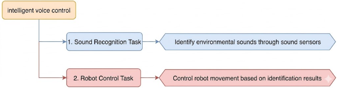

#### 5.3.2.3 Module Description

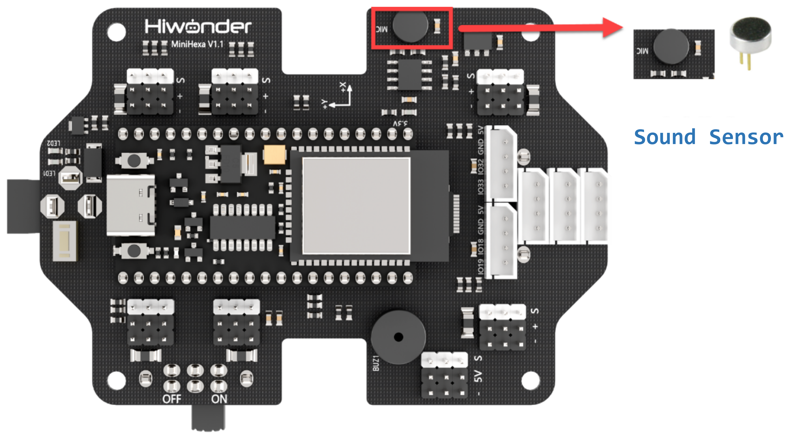

The onboard sound sensor detects the intensity of external sound. The sound level is obtained by reading the pin value through the ADC pin. Its main working principle is based on sound vibration at the microphone capsule. Sound waves cause the electret diaphragm inside the microphone to vibrate, which changes the capacitance and generates a small corresponding voltage. This voltage is converted into an electrical signal output.

<p id ="anther5.3.2.4"></p>

#### 5.3.2.4 Program Download

1. Connect miniHexa to a PC with a Type-C data cable.


2. Open [**02 Program Files\02 Voice Control Program\sound_control\sound_control.ino**](https://drive.google.com/drive/folders/1coonfZINUxFjI-2qVNKtobOUumyc_W25?usp=sharing).

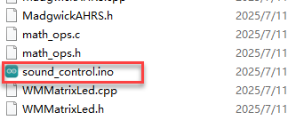

3. After the file opens, select the development board model shown below.


4. Click **Tools** in the menu bar, then select the ESP32 development board configuration shown below.


> [!NOTE]
>
> **Make sure the development board configuration is modified before downloading the program.**

5. Click **Compile**, then click **Upload**. When the following screen appears in the output box at the bottom of the software, the program download is complete.


#### 5.3.2.5 Project Outcome

After miniHexa powers on, it performs the startup initialization action and stands on six legs. Then it continuously detects the ambient sound. When the sound level is greater than or equal to **600**, miniHexa moves forward.

#### 5.3.2.6 Program Analysis

1. Import the `hiwonder_robot.h` library. This library contains definitions for sensors and interaction methods, as well as methods for interacting with the robot system.

```cpp
   #include "hiwonder_robot.h"
```

2. Initialize the miniHexa object and the sound sensor object. Define the `sound_value` variable for storing sound intensity. Create the robot movement speed, center of gravity position, and posture arrays `velocity`, `position`, and `_euler`.

```cpp
    Robot minihexa;

    uint16_t sound_value;

    Velocity_t velocity = {0.0f, 0.0f, 0.0f};
    Vector_t position = {0.0f, 0.0f, 0.0f};
    Euler_t _euler = {0.0f, 0.0f, 0.0f};
```

3. In the `setup()` function, set the serial communication baud rate to `115200`, then initialize the robot and sensors.

```cpp
    void setup() {
      Serial.begin(115200);
      minihexa.begin();
    }
```

4. In the `loop()` main program, first read the sound intensity data `sound_value` detected by the sound module. Then check whether the value is greater than or equal to `600`. If so, execute the forward movement.

```cpp
    void loop() {
      sound_value = minihexa.board.get_sound_val();
      if(sound_value >= 600) {
        velocity = {0.0f, 2.0f, 0.0f};
        minihexa.move(&velocity, &position, &_euler, 1000, 1);
        delay(1000);
      }
    }
```

#### 5.3.2.7 Feature Extension

Adjust the `sound_value` threshold as needed. For example, increasing the threshold makes the trigger level higher, so only louder sounds trigger robot movement.

1. In the main function, find the trigger threshold check.

```cpp
    if(sound_value >= 600) {
      velocity = {0.0f, 2.0f, 0.0f};
      minihexa.move(&velocity, &position, &_euler, 1000, 1);
      delay(1000);
    }
```

2. In this example, change the original value from `600` to `1000`.

```cpp
    if(sound_value >= 1000) {  // Increase the threshold from 600 to 1000
      velocity = {0.0f, 2.0f, 0.0f};
      minihexa.move(&velocity, &position, &_euler, 1000, 1);
      delay(1000);
    }
```

3. After the modification is complete, refer to [5.3.2.4 Program Download](#anther5.3.2.4) to run the program.

### 5.3.3 Ultrasonic Distance Measurement

#### 5.3.3.1 Feature Overview

This lesson uses the Glowy Ultrasonic Module to detect distance, then controls the color of the RGB lights according to the measured distance.

#### 5.3.3.2 Project Process

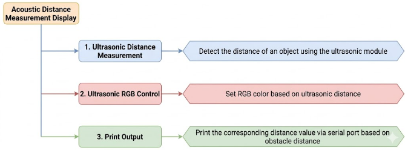

#### 5.3.3.3 Module Description

The Glowy Ultrasonic Module integrates an I2C communication interface and supports reading ultrasonic distance data through the I2C protocol. Two RGB LEDs are integrated at the ultrasonic probe. They support brightness adjustment and colorful lighting effects by changing and combining the red, green, and blue color channels.


During distance measurement, the module automatically sends eight 40 kHz square wave pulses and checks whether a signal returns. If a signal returns, the module outputs a high-level signal. The duration of this high-level signal is the time from ultrasonic transmission to return.

> [!NOTE]
>
> **The Glowy Ultrasonic Module is factory-connected to the onboard I2C port. No additional wiring is required.**

<p id ="anther5.3.3.4"></p>

#### 5.3.3.4 Program Download

1. Connect miniHexa to a PC with a Type-C data cable.


2. Open [**02 Program Files\03 Ultrasonic Distance Measurement Program\ultrasound\ultrasound.ino**](https://drive.google.com/drive/folders/1PlgVSYjApMPL5fmn2iGERofs0Dtizf6-?usp=sharing).

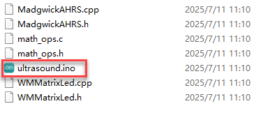

3. After the file opens, select the development board model shown below.


4. Click **Tools** in the menu bar, then select the ESP32 development board configuration shown below.

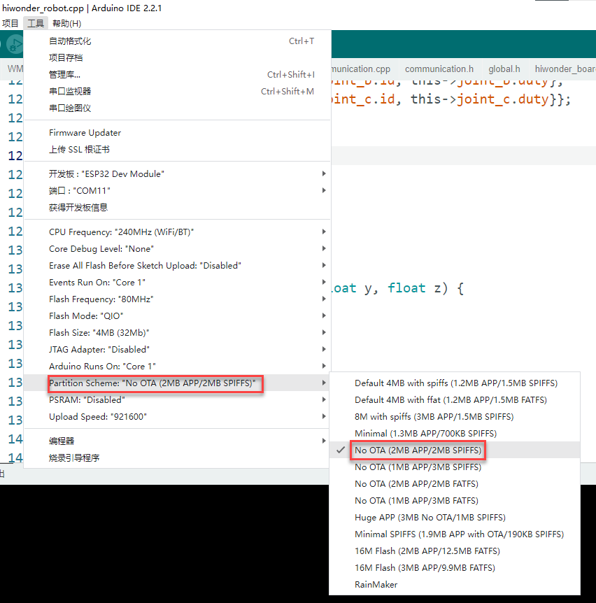

> [!NOTE]
>
> **Make sure the development board configuration is modified before downloading the program.**

5. Click **Compile**, then click **Upload**. When the following screen appears in the output box at the bottom of the software, the program download is complete.


#### 5.3.3.5 Project Outcome

When an obstacle approaches the Glowy Ultrasonic Module, the color of the RGB lights changes.

#### 5.3.3.6 Program Analysis

1. Import the `hiwonder_robot.h` library. This library contains definitions for sensors and interaction methods, as well as methods for interacting with the robot system.

```cpp
   #include "hiwonder_robot.h"
```

2. Initialize the `miniHexa` object and the sensor object. Create the `dis` variable for storing distance and the mapping variable `s`. Create the three-channel light intensity arrays `rgb1` and `rgb2` for the two RGB LEDs on the Glowy Ultrasonic Module.

```cpp
    Robot minihexa;

    uint8_t s;
    uint16_t dis;
    uint8_t rgb1[3] = {0};
    uint8_t rgb2[3] = {0};
```

3. In the `setup()` function, set the serial communication baud rate to `115200`, then initialize the robot and sensors.

```cpp
    void setup() {
      Serial.begin(115200);
      minihexa.begin();
    }
```

4. In the `loop()` main program, read the distance detected by the Glowy Ultrasonic Module. Use the ultrasonic distance data `dis` to change the Glowy Ultrasonic Module color, then print the distance value through the serial port.

```cpp
    void loop() {
      dis = minihexa.sensor.get_distance();
      if (dis > 0 && dis <= 80){         // Breathing light mode, 0.1s cycle, red
        rgb1[0] = 1;
        rgb1[1] = 0;
        rgb1[2] = 0;
        memcpy(rgb2, rgb1, sizeof(rgb1));
        minihexa.sensor.set_ultrasound_rgb(1, rgb1, rgb2);
      }
      else if (dis > 80 && dis <= 180){   // Red gradient
        s = map(dis,80,180,0,255);
        rgb1[0] = 255-s;
        rgb1[1] = 0;
        rgb1[2] = 0;
        memcpy(rgb2, rgb1, sizeof(rgb1));
      }
      else if (dis > 180 && dis <= 320){              // Blue gradient
        s = map(dis,180,320,0,255);
        rgb1[0] = 0;
        rgb1[1] = 0;
        rgb1[2] = s;   
        memcpy(rgb2, rgb1, sizeof(rgb1)); 
      }
      else if (dis > 320 && dis <= 500){     // Green gradient
        s = map(dis,320,500,0,255);
        rgb1[0] = 0;
        rgb1[1] = s;
        rgb1[2] = 255-s;
        memcpy(rgb2, rgb1, sizeof(rgb1));
      }
      else if (dis > 500){         // Green 
        rgb1[0] = 0;
        rgb1[1] = 255;
        rgb1[2] = 0;    
        memcpy(rgb2, rgb1, sizeof(rgb1));
      }
      minihexa.sensor.set_ultrasound_rgb(1, rgb1, rgb2);
      Serial.printf("Distance: %d mm\n", dis);
    }
```

5. If the detected distance is between `0` and `80`, the RGB lights on the Glowy Ultrasonic Module are set to red.

```cpp
    if (dis > 0 && dis <= 80){         // Breathing light mode, 0.1s cycle, red
      rgb1[0] = 1;
      rgb1[1] = 0;
      rgb1[2] = 0;
      memcpy(rgb2, rgb1, sizeof(rgb1));
      minihexa.sensor.set_ultrasound_rgb(1, rgb1, rgb2);
    }
```

6. When the detected distance is between `80` and `180`, the ultrasonic RGB lights show a red gradient effect.

```cpp
   else if (dis > 80 && dis <= 180){   // Red gradient
       s = map(dis,80,180,0,255);
       rgb1[0] = 255-s;
       rgb1[1] = 0;
       rgb1[2] = 0;
       memcpy(rgb2, rgb1, sizeof(rgb1));
   }
```

7. If the detected distance is in the range of `180` to `320`, the ultrasonic RGB lights change to a blue gradient.

```cpp
   else if (dis > 180 && dis <= 320){              // Blue gradient
       s = map(dis,180,320,0,255);
       rgb1[0] = 0;
       rgb1[1] = 0;
       rgb1[2] = s;   
       memcpy(rgb2, rgb1, sizeof(rgb1)); 
     }
```

8. When the detected distance is greater than `500`, the ultrasonic RGB lights turn green.

```cpp
   else if (dis > 500){         // Green 
       rgb1[0] = 0;
       rgb1[1] = 255;
       rgb1[2] = 0;    
       memcpy(rgb2, rgb1, sizeof(rgb1));
     }
```

9. Set the Glowy Ultrasonic Module to the corresponding color and print `dis` through the serial port.

```cpp
  minihexa.sensor.set_ultrasound_rgb(1, rgb1, rgb2);
  Serial.printf("Distance: %d mm\n", dis);
```

#### 5.3.3.7 Feature Extension

Modify parameters 1, 2, and 3 of `sensor.set_ultrasound_rgb()`. Parameter 1 sets the lighting mode. `0` is steady light mode, and `1` is breathing mode. Parameters 2 and 3 set the independent RGB color values.

1. In the main function, find the code that sets the Glowy Ultrasonic Module color.

```cpp
   else if (dis > 500){         // Green 
       rgb1[0] = 0;
       rgb1[1] = 255;
       rgb1[2] = 0;    
       memcpy(rgb2, rgb1, sizeof(rgb1));
     }
```

2. In this example, change the original green color to black, which turns the light off.

```cpp
   else if (dis > 500){         // Black 
       rgb1[0] = 0;
       rgb1[1] = 0;
       rgb1[2] = 0;    
       memcpy(rgb2, rgb1, sizeof(rgb1));
     }
```

3. After the modification is complete, refer to [5.3.3.4 Program Download](#anther5.3.3.4) to run the program.

### 5.3.4 Automatic Obstacle Avoidance

#### 5.3.4.1 Feature Overview

This lesson uses the ultrasonic sensor to detect distance and perform obstacle avoidance based on the detected value.

#### 5.3.4.2 Project Process

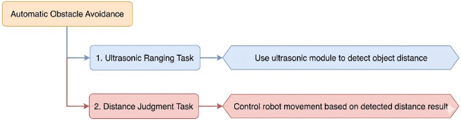

#### 5.3.4.3 Module Description

The Glowy Ultrasonic Module integrates an I2C communication interface and supports reading ultrasonic distance data through the I2C protocol. Two RGB LEDs are integrated at the ultrasonic probe. They support brightness adjustment and colorful lighting effects by changing and combining the red, green, and blue color channels.


During distance measurement, the module automatically sends eight 40 kHz square wave pulses and checks whether a signal returns. If a signal returns, the module outputs a high-level signal. The duration of this high-level signal is the time from ultrasonic transmission to return.

> [!NOTE]
>
> **The Glowy Ultrasonic Module is factory-connected to the onboard I2C port. No additional wiring is required.**

#### 5.3.4.4 Program Download

1. Connect miniHexa to a PC with a Type-C data cable.


2. Open [**02 Program Files\04 Ultrasonic Obstacle Avoidance Program\ultrasound_avoidance\ultrasound_avoidance.ino**](https://drive.google.com/drive/folders/1yKtD8zweLK1I59jkAAcPJMJR76YoWluH?usp=sharing).

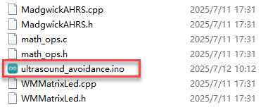

3. After the file opens, select the development board model shown below.


4. Click **Tools** in the menu bar, then select the ESP32 development board configuration shown below.


> [!NOTE]
>
> **Make sure the development board configuration is modified before downloading the program.**

5. Click **Compile**, then click **Upload**. When the following screen appears in the output box at the bottom of the software, the program download is complete.


#### 5.3.4.5 Project Outcome

After miniHexa powers on, the Glowy Ultrasonic Module lights are red, and the ultrasonic sensor detects the distance to objects. If the distance is greater than `200`, the robot moves forward. If the distance is less than `100`, the robot moves backward. If neither condition is met, the robot rotates.

#### 5.3.4.6 Program Analysis

1. Import the `hiwonder_robot.h` library. This library contains definitions for sensors and interaction methods, as well as methods for interacting with the robot system.

```cpp
   #include "hiwonder_robot.h"
```

2. Initialize the `miniHexa` object and the sensor object. Create the three-channel light intensity arrays `rgb1` and `rgb2` for the two RGB LEDs on the Glowy Ultrasonic Module.

```cpp
    Robot minihexa;
    
    uint8_t rgb1[3] = {0, 0, 100};
    uint8_t rgb2[3] = {0, 0, 100};
```

3. Create the `dis` variable for storing distance. Create the robot movement speed, center of gravity position, and posture arrays `velocity`, `position`, and `_euler`.

```cpp
   uint16_t dis;
   
   Velocity_t velocity = {0.0f, 0.0f, 0.0f};
   Vector_t position = {0.0f, 0.0f, 0.0f};
   Euler_t euler = {0.0f, 0.0f, 0.0f};
```

4. In the `setup()` function, set the serial communication baud rate to `115200`, then initialize the robot and sensors.

```cpp
    void setup() {
      Serial.begin(115200);
      minihexa.begin();
      delay(1000);
      minihexa.sensor.set_ultrasound_rgb(0, rgb1, rgb2);
    }
```

5. In the `loop()` main program, use `dis` to obtain the ultrasonic value through `minihexa.sensor.get_distance()`, then pass the ultrasonic value to `minihexa.avoid()`. The `avoid()` function performs the judgment logic.

```cpp
void loop() {
  dis = minihexa.sensor.get_distance();
  minihexa.avoid(dis);
  delay(50);
}
```

#### 5.3.4.7 Feature Extension

Learn the writing and implementation method of the `minihexa.avoid()` function.

1. In `hiwonder_robot.h`, four ultrasonic detection results are defined. `Avoid_State {FORWARD, BACK, TURN, WAIT}` corresponds to `FORWARD` for moving forward, `BACK` for moving backward, `TURN` for rotating, and `WAIT` for waiting.

```cpp
    enum Avoid_State {
      FORWARD,  // Move forward
      BACK,     // Move backward
      TURN,     // Rotate in place
      WAIT      // Wait
    };
```

2. The default state of `avoid_state` is `FORWARD`.

```cpp
Avoid_State avoid_state = FORWARD;  // Default state is moving forward
```

3. When `minihexa.avoid()` is called in the main program, it enters the default `FORWARD` branch in `switch`. The robot first moves forward for a short distance, then checks the ultrasonic value `dis`. If the ultrasonic value is less than `200` and greater than `100`, the robot switches to the right-rotation state. If the ultrasonic value is less than `100`, the robot switches to the backward state.

```cpp
switch(avoid_state) {
  case FORWARD:
    // Move forward for a short distance
    velocity = {0.0f, 2.0f, 0.0f};
    minihexa.move(&velocity, &position, &euler);
    
    if(dis < 100) {
      avoid_state = BACK;  // Too close, move backward
    } else if(dis < 200) {
      avoid_state = TURN;  // Medium distance, turn
    }
    break;
    
  case BACK:
    // Move backward logic
    velocity = {0.0f, -2.0f, 0.0f};
    minihexa.move(&velocity, &position, &euler);
    if(dis > 200) {
      avoid_state = FORWARD;
    }
    break;
    
```

4. After the `FORWARD` branch in `switch` determines the next branch, miniHexa enters the corresponding movement state.

```cpp
      case TURN:
        velocity = {0.0f, 0.0f, 2.0f};
        minihexa.move(&velocity, &position, &euler);
        if(dis > 200) {
          avoid_state = FORWARD;
        }
        break;
    
      case WAIT:
          if(_step_num == 0) {
            if(dis > 200) {
              avoid_state = FORWARD;
            }
            else if(dis < 200 && dis > 100) {
              avoid_state = TURN;
            }
            else if(dis < 100) {
              avoid_state = BACK;
            }        
          }
          break;
```

### 5.3.5 Automatic Following

#### 5.3.5.1 Feature Overview

This lesson uses the Glowy Ultrasonic Module to detect distance, then controls the robot's movement based on the detected distance.

#### 5.3.5.2 Project Process

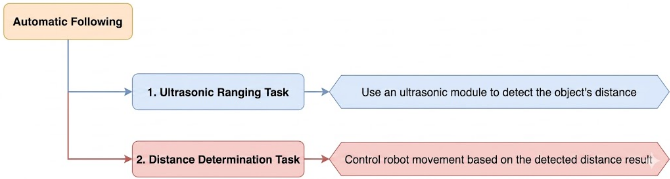

#### 5.3.5.3 Module Description

The Glowy Ultrasonic Module uses an I2C communication interface and can read distance data measured by the ultrasonic sensor through I2C communication. Two RGB LEDs are integrated at the ultrasonic probe. They support brightness adjustment and colorful lighting effects by changing and combining the red, green, and blue color channels.


During distance measurement, the module automatically sends eight 40 kHz square wave pulses and checks whether a signal returns. If a signal returns, the module outputs a high-level signal. The duration of this high-level signal is the time from ultrasonic transmission to return.

> [!NOTE]
>
> **The Glowy Ultrasonic Module is factory-connected to the onboard I2C port. No additional wiring is required.**

<p id ="anther5.3.5.4"></p>

#### 5.3.5.4 Program Download

1. Connect miniHexa to a PC with a Type-C data cable.


2. Open [**02 Program Files\05 Automatic Following Program\follow\follow.ino**](https://drive.google.com/drive/folders/1oNiY6qv18p4WW9XeuCZ7xUHWPz0aMV2r?usp=sharing).


3. After the file opens, select the development board model shown below.


4. Click **Tools** in the menu bar, then select the ESP32 development board configuration shown below.


> [!NOTE]
>
> **Make sure the development board configuration is modified before downloading the program.**

5. Click **Compile**, then click **Upload**. When the following screen appears in the output box at the bottom of the software, the program download is complete.


#### 5.3.5.5 Project Outcome

After miniHexa powers on, the RGB lights on the Glowy Ultrasonic Module turn red. The ultrasonic sensor detects the distance to an object. If the distance is greater than `200`, the robot moves forward. If the distance is less than `100`, the robot moves backward. If neither condition is met, the robot stops moving.

#### 5.3.5.6 Program Analysis

1. Import the `hiwonder_robot.h` library. This library contains definitions for sensors and interaction methods, as well as methods for interacting with the robot system.

```cpp
   #include "hiwonder_robot.h"
```

2. Initialize the `miniHexa` object and the sensor object. Then create the `dis` variable for storing distance.

```cpp
    Robot minihexa;
    
    uint16_t dis;
```

3. Create the three-channel light intensity arrays `rgb1` and `rgb2` for the two RGB LEDs on the Glowy Ultrasonic Module. Create the robot movement speed, center of gravity position, and posture arrays `velocity`, `position`, and `_euler`.

```cpp
   uint8_t rgb1[3] = {0, 0, 100};
   uint8_t rgb2[3] = {0, 0, 100};
   Velocity_t velocity = {0.0f, 0.0f, 0.0f};
   Vector_t position = {0.0f, 0.0f, 0.0f};
   Euler_t euler = {0.0f, 0.0f, 0.0f};
```

4. In the `setup()` function, set the serial communication baud rate to `115200`, then initialize the robot and sensors and initialize the Glowy Ultrasonic Module light color.

```cpp
    void setup() {
      Serial.begin(115200);
      minihexa.begin();
      delay(1000);
      minihexa.sensor.set_ultrasound_rgb(0, rgb1, rgb2);
    }
```

5. In the `loop()` main program, read the distance detected by the Glowy Ultrasonic Module. According to the ultrasonic distance data `dis`, execute the corresponding movement. When `dis` is greater than `200`, move forward. When `dis` is less than `100`, move backward. Otherwise, stop moving.

```cpp
    void loop() {
      dis = minihexa.sensor.get_distance();
      if(dis > 200) {
        velocity = {0.0f, 2.0f, 0.0f};  // Move forward
      }
      else if(dis < 100) {
        velocity = {0.0f, -2.0f, 0.0f}; // Move backward
      }
      else {
        velocity = {0.0f, 0.0f, 0.0f};  // Stop
      }
      minihexa.move(&velocity, &position, &euler);
      delay(100);
    }
```

#### 5.3.5.7 Feature Extension

This example modifies the judgment condition so that miniHexa stops moving when `dis` is greater than `999`. This changes the target following distance. Follow the steps below.

1. Find the conditional judgment function in the main function code.

```cpp
   void loop() {
     dis = minihexa.sensor.get_distance();
     if(dis > 200) {
       velocity = {0.0f, 2.0f, 0.0f};
     }
     else if(dis < 100) {
       velocity = {0.0f, -2.0f, 0.0f};
     }
     else {
       velocity = {0.0f, 0.0f, 0.0f};
     }
     minihexa.move(&velocity, &position, &euler);
     delay(100);
   }
```

2. Modify the judgment statement. Change `dis > 200` to `dis > 999` to stop movement. Changing the judgment range of `dis` changes the target following distance.

```cpp
   void loop() {
     dis = minihexa.sensor.get_distance();
     if(dis > 999) {
       velocity = {0.0f, 2.0f, 0.0f};
     }
     else if(dis < 100) {
       velocity = {0.0f, -2.0f, 0.0f};
     }
     else {
       velocity = {0.0f, 0.0f, 0.0f};
     }
     minihexa.move(&velocity, &position, &euler);
     delay(100);
   }
```

To modify other movement directions, refer to the **Section 5.2.2  Omnidirectional Motion** in the [5. Arduino Programming Project/5.2 Basic Motion Control/01 Basic Motion Control](https://drive.google.com/drive/folders/11_xw8T0dfiM7oOCkNK0pRqMwyRzwxvm0?usp=sharing) tutorial.

3. After the modification is complete, refer to [5.3.5.4 Program Download](#anther5.3.5.4) to run the program.

### 5.3.6 Self-Balancing

#### 5.3.6.1 Feature Overview

This lesson uses the IMU sensor to detect the robot body tilt angle, then controls the body balance based on the detection result.

#### 5.3.6.2 Project Process

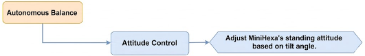

#### 5.3.6.3 Module Description

This lesson uses the onboard QMI8658 motion sensor. This sensor is widely used in handheld game products, 3D remote controllers, portable navigation devices, and similar devices.

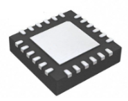

It integrates a 3-axis MEMS gyroscope, a 3-axis MEMS accelerometer, and an expandable Digital Motion Processor, also called DMP.

#### 5.3.6.4 Program Download

1. Connect miniHexa to a PC with a Type-C data cable.


2. Open [**02 Program Files\06 Self-Balancing Program\balance\balance.ino**](https://drive.google.com/drive/folders/12qiTKthZvXKDjtk9hllYaBWqeiAOoARb?usp=sharing).

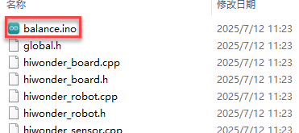

3. After the file opens, select the development board model shown below.


4. Click **Tools** in the menu bar, then select the ESP32 development board configuration shown below.


> [!NOTE]
>
> **Make sure the development board configuration is modified before downloading the program.**

5. Click **Compile**, then click **Upload**. When the following screen appears in the output box at the bottom of the software, the program download is complete.


#### 5.3.6.5 Project Outcome

miniHexa obtains real-time tilt angle values from the IMU sensor, performs correction calculation, and achieves self-balancing through inverse kinematics.

#### 5.3.6.6 Program Analysis

1. Import the `hiwonder_robot.h` library. This library contains definitions for sensors and interaction methods, as well as methods for interacting with the robot system.

```cpp
#include "hiwonder_robot.h"
```

2. Initialize the `miniHexa` object. Create the robot movement speed, center of gravity position, and posture arrays `velocity`, `position`, and `_euler`.

```cpp
    Robot minihexa;

    Velocity_t velocity = {0.0f, 0.0f, 0.0f};
    Vector_t position = {0.0f, 0.0f, 0.0f};
    Euler_t _euler = {0.0f, 0.0f, 0.0f};
```

3. In the `setup()` function, set the serial communication baud rate to `115200`, then initialize the robot and sensors. Also modify the robot body Z-axis value.

```cpp
    void setup() {
      Serial.begin(115200);
      minihexa.begin();
      delay(2000);
      position = {0.0f, 0.0f, 1.5f};
      minihexa.move(&velocity, &position, &_euler, 1000);
      delay(1000);
    }
```

4. In the main program `loop()`, call `balance()` to implement self-balancing.

```cpp
void loop() {
  minihexa.balance();
}
```

5. The `balance()` function is defined in [**02 Program Files\06 Self-Balancing Program\balance\hiwonder_robot.cpp**](https://drive.google.com/drive/folders/12qiTKthZvXKDjtk9hllYaBWqeiAOoARb?usp=sharing). miniHexa reads the current IMU posture, limits the angle, and adjusts `roll` and `pitch` in the opposite direction to maintain balance.

```cpp
void Robot::balance(bool state) {
  float euler[3];
  Velocity_t _velocity = {0.0f, 0.0f, 0.0f};
  Vector_t _position = {0.0f, 0.0f, 0.0f};
  Euler_t _euler = {0.0f, 0.0f, 0.0f};

  if(state == true) {
    if(millis() - balance_tick_start > 50) {
      board.imu_update(true);
      _position = position;
      board.get_imu_euler(euler);
      euler[0] = euler[0] > 18.0f ? 18.0f : (euler[0] < -18.0f ? -18.0f : euler[0]);
      euler[1] = euler[1] > 18.0f ? 18.0f : (euler[1] < -18.0f ? -18.0f : euler[1]);
      _euler = {-euler[0],-euler[1],0};
      move(&_velocity, &_position, &_euler, 100);
      balance_tick_start = millis();
    }
  }
  else {
    board.imu_update(false);
    balance_tick_start = 0;
  }
}
```

### 5.3.7 Dot Matrix Display

#### 5.3.7.1 Feature Overview

This lesson uses the dot matrix module to display characters.

#### 5.3.7.2 Project Process

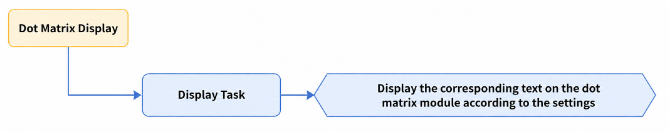

#### 5.3.7.3 Module Description

The LED dot matrix module is an LED dot matrix display module. It features high brightness, no flicker during display, and easy wiring. It can display numbers, text, patterns, and other content. The module consists of two red 8x8 LED matrices and uses the TM640B driver control chip to control the dot matrix display.

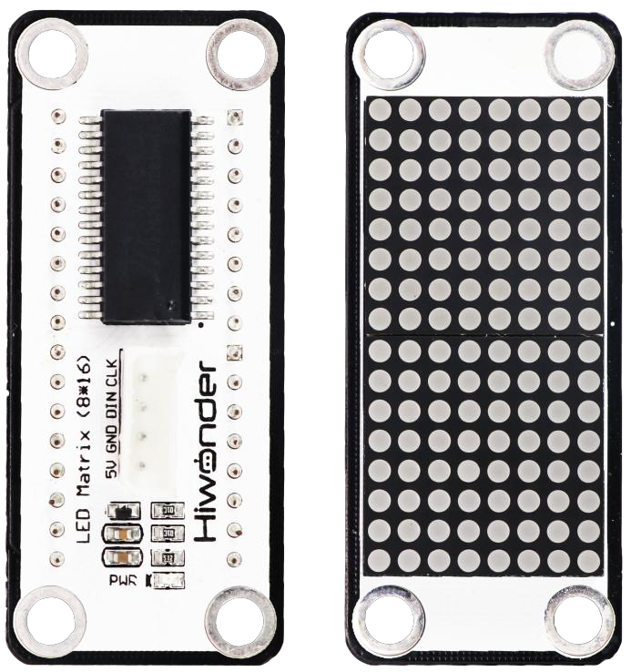

Module wiring: Before running this program, connect the module to the miniHexa controller GPIO ports `IO32` and `IO14` as shown below.


1. Installation: Mount the dot matrix module onto the miniHexa rear panel.


#### 5.3.7.4 Program Download

1. Connect miniHexa to a PC with a Type-C data cable.


2. Open [**02 Program Files\07 Dot Matrix Display Program\matrix_led\matrix_led.ino**](https://drive.google.com/drive/folders/1bs32RaKWojfb0mXpevu1yYlJNwUcvPIq?usp=sharing).

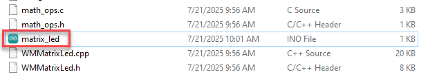

3. After the file opens, select the development board model shown below.


4. Click **Tools** in the menu bar, then select the ESP32 development board configuration shown below.


> [!NOTE]
>
> **Make sure the development board configuration is modified before downloading the program.**

5. Click **Compile**, then click **Upload**. When the following screen appears in the output box at the bottom of the software, the program download is complete.


#### 5.3.7.5 Project Outcome

After miniHexa powers on, the dot matrix screen continuously scrolls the text "Hiwonder" from right to left.

#### 5.3.7.6 Program Analysis

1. Import the `hiwonder_robot.h`, `hiwonder_sensor.h`, and `WMMatrixLED.h` libraries. `hiwonder_robot.h` contains methods for interacting with the robot system, and `WMMatrixLED.h` contains the library functions for the dot matrix module.

```cpp
    #include "hiwonder_robot.h"
    #include "hiwonder_sensor.h"
    #include "WMMatrixLED.h"
```

2. Initialize the `miniHexa` object and the pins of the dot matrix module. Then define the variable `x` to store the X-axis coordinate for scrolling display.

```cpp
    // Create the minihexa object
    Robot minihexa;
    // Initialize the dot matrix module pins
    WMMatrixLed matrix(14, 32);  //  SCK / DIN pin numbers
```

3. In the `setup()` function, set the serial communication baud rate to `115200`, then initialize the robot and the dot matrix module. Set the screen brightness to `5`, then clear the screen.

```cpp
    void setup() {
      Serial.begin(115200);
      minihexa.begin();
      matrix.setBrightness(5);// Set brightness
      matrix.clearScreen();// Clear the screen
    }
```

4. In the main program `loop()`, define the variables `text` and `textWidth`. `text` stores the characters to display, and `textWidth` limits the pixel width of each character. Then use a `for` loop to implement scrolling display.

```cpp
int x;
void loop() {
  const char* text = "Hiwonder";
  int textWidth = 6 * strlen(text); // About 6 pixels per character
  for (int x = 16; x > -textWidth; x--) {
    matrix.drawStr(x, 8, text);       // Start display
    delay(100);
  }
}
```

### 5.3.8 Ultrasonic Distance Measurement and Displaying

#### 5.3.8.1 Feature Overview

This lesson uses the dot matrix module to display the distance detected by the ultrasonic distance measurement module in real time, and also sets the RGB light color of the Glowy Ultrasonic Module.

#### 5.3.8.2 Project Process

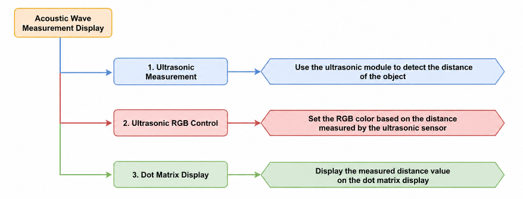

#### 5.3.8.3 Module Description

1. Ultrasonic module

The module uses an I2C communication interface and can read distance data measured by the ultrasonic sensor through I2C communication. Two RGB LEDs are integrated at the ultrasonic probe. They support brightness adjustment and colorful lighting effects by changing and combining the red, green, and blue color channels.

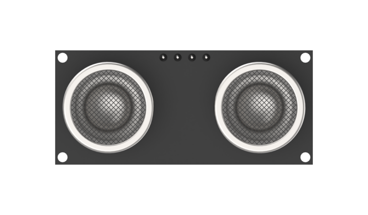

During distance measurement, the module automatically sends eight 40 kHz square wave pulses and checks whether a signal returns. If a signal returns, the module outputs a high-level signal. The duration of this high-level signal is the time from ultrasonic transmission to return.

> [!NOTE]
>
> **The Glowy Ultrasonic Module is factory-connected to the onboard I2C port. No additional wiring is required.**

2. Dot matrix module

The LED dot matrix module is an LED dot matrix display module. It features high brightness, no flicker during display, and easy wiring. It can display numbers, text, patterns, and other content. The module consists of two red 8x8 LED matrices and uses the TM640B driver control chip to control the dot matrix display.

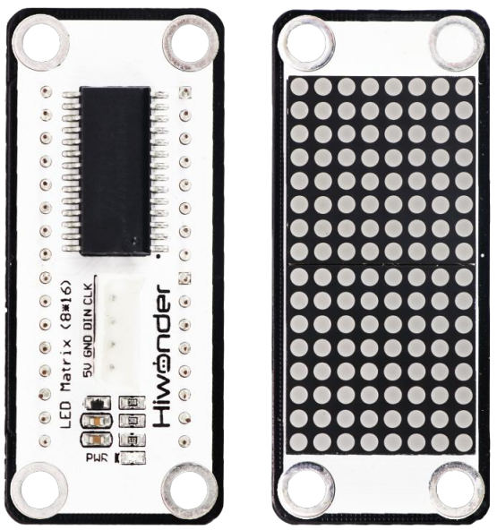

Module wiring: Before running this program, connect the module to the miniHexa controller GPIO ports `IO33` and `IO32` as shown below.

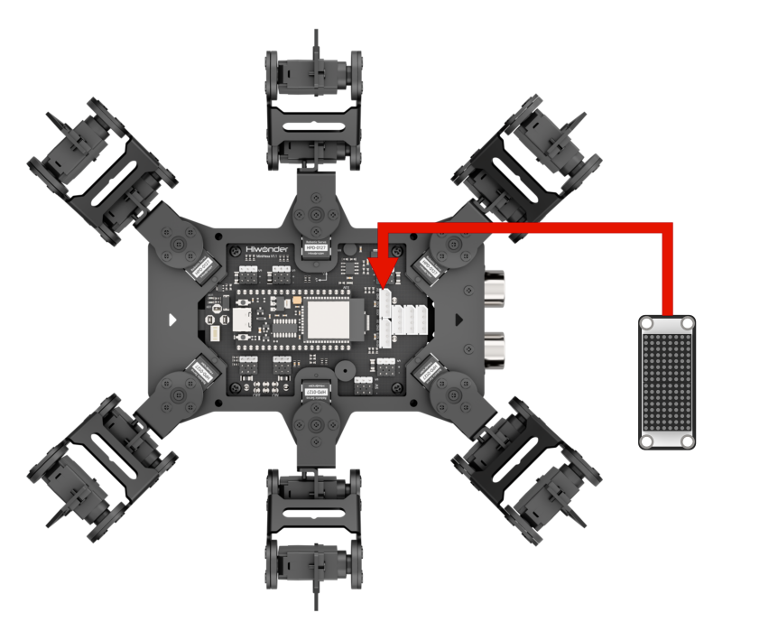

Installation: Mount the dot matrix module onto the miniHexa rear panel.


<p id ="anther5.3.8.4"></p>

#### 5.3.8.4 Program Download

1. Connect miniHexa to a PC with a Type-C data cable.

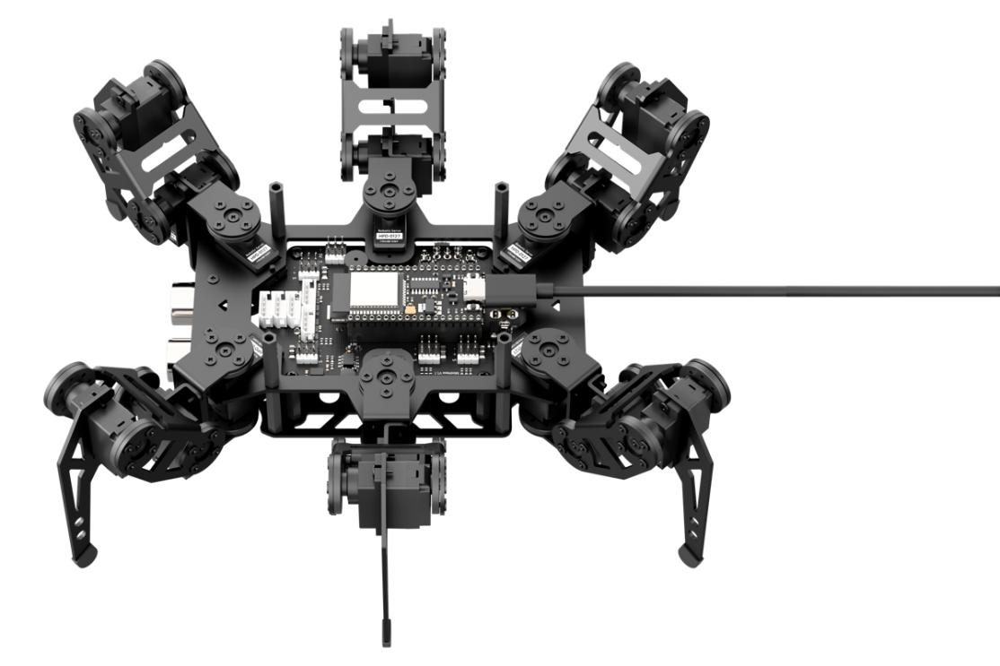

2. Open [**02 Program Files\08 Ultrasonic Distance Measurement and Displaying Program\ultrasound\ultrasound.ino**](https://drive.google.com/drive/folders/17cT62MTRXW6oR9rEhen2s5yhIPVI_Ugg?usp=sharing).


3. After the file opens, select the development board model shown below.


4. Click **Tools** in the menu bar, then select the ESP32 development board configuration shown below.


> [!NOTE]
>
> **Make sure the development board configuration is modified before downloading the program.**

5. Click **Compile**, then click **Upload**. When the following screen appears in the output box at the bottom of the software, the program download is complete.


#### 5.3.8.5 Project Outcome

When an obstacle approaches the Glowy Ultrasonic Module, the detected distance is shown on the dot matrix module. The RGB lights on the Glowy Ultrasonic Module also change according to the detected distance.

#### 5.3.8.6 Program Analysis

1. Import the `hiwonder_robot.h` and `WMMatrixLED.h` libraries. `hiwonder_robot.h` contains methods for interacting with the robot system, and `WMMatrixLED.h` contains interaction methods for the dot matrix screen.

```cpp
    #include "hiwonder_robot.h"
    #include "WMMatrixLED.h"
```

2. Initialize the `miniHexa` object, sensor object, and dot matrix module object.

```cpp
    Robot minihexa;
    
    WMMatrixLed tm(14,32);
```

3. Create the `dis` variable for storing distance and the mapping variable `s`. Create the three-channel light intensity arrays `rgb1` and `rgb2` for the two RGB LEDs on the Glowy Ultrasonic Module. Create the robot movement speed, center of gravity position, and posture arrays `velocity`, `position`, and `_euler`.

```cpp
   uint8_t s;
   uint8_t rgb1[3] = {0, 0, 0};
   uint8_t rgb2[3] = {0, 0, 0};
   uint16_t dis;
   Velocity_t velocity = {0.0f, 0.0f, 0.0f};
   Vector_t position = {0.0f, 0.0f, 0.0f};
   Euler_t _euler = {0.0f, 0.0f, 0.0f};
```

4. In the `setup()` function, set the serial communication baud rate to `115200`, then initialize the robot and sensors and initialize the Glowy Ultrasonic Module brightness and color.

```cpp
    void setup() {
      Serial.begin(115200);
      minihexa.begin();
      tm.setBrightness(4); // Set brightness
      minihexa.sensor.set_ultrasound_rgb(1, rgb1, rgb2);
    }
```

5. In `loop()`, limit the detected distance. If `dis` is greater than `9999`, set the maximum value of `dis` to `9999`.

```cpp
    void loop() {
      dis = minihexa.sensor.get_distance();
      if(dis > 9999) {
        dis = 9999;
      }
    }
```

6. If the detected distance is greater than `0` and less than or equal to `80`, set the RGB lights of the Glowy Ultrasonic Module to breathing mode with a cycle of 0.1s and the color red.

```cpp
    if (dis > 0 && dis <= 80){         // Breathing light mode, 0.1s cycle, red
      rgb1[0] = 1;
      rgb1[1] = 0;
      rgb1[2] = 0;
      memcpy(rgb2, rgb1, sizeof(rgb1));
    }
```

7. If the detected distance is greater than `80` and less than or equal to `180`, set the RGB lights of the Glowy Ultrasonic Module to a red gradient.

```cpp
    else if (dis > 80 && dis <= 180){   // Red gradient
      s = map(dis,80,180,0,255);
      rgb1[0] = 255-s;
      rgb1[1] = 0;
      rgb1[2] = 0;
      memcpy(rgb2, rgb1, sizeof(rgb1));
    }
```

8. If the detected distance is greater than `180` and less than or equal to `320`, set the RGB lights of the Glowy Ultrasonic Module to a blue gradient.

```cpp
    else if (dis > 180 && dis <= 320){              // Blue gradient
      s = map(dis,180,320,0,255);
      rgb1[0] = 0;
      rgb1[1] = 0;
      rgb1[2] = s;   
      memcpy(rgb2, rgb1, sizeof(rgb1)); 
    }
```

9. If the detected distance is greater than `500`, set the RGB lights of the Glowy Ultrasonic Module to green.

```cpp
    else if (dis > 500){         // Green 
      rgb1[0] = 0;
      rgb1[1] = 255;
      rgb1[2] = 0;    
      memcpy(rgb2, rgb1, sizeof(rgb1));
    }
```

10. Set the Glowy Ultrasonic Module to the corresponding color and display `dis` on the OLED dot matrix screen.

```cpp
minihexa.sensor.set_ultrasound_rgb(1, rgb1, rgb2);
// Dot matrix module displays the distance
tm.showNum((float)dis,0); 
delay(20);
```

#### 5.3.8.7 Feature Extension

Modify parameters 1, 2, and 3 of `sensor.set_ultrasound_rgb()`. Parameter 1 sets the lighting mode. `0` is steady light mode, and `1` is breathing mode. Parameters 2 and 3 set the independent RGB color values.

1. In the main function, find the code that sets the Glowy Ultrasonic Module color.

```cpp
   else if (dis > 500){         // Green 
       rgb1[0] = 0;
       rgb1[1] = 255;
       rgb1[2] = 0;    
       memcpy(rgb2, rgb1, sizeof(rgb1));
     }
     minihexa.sensor.set_ultrasound_rgb(1, rgb1, rgb2);
```

2. In this example, change the original green color to black, which turns the light off.

```cpp
   else if (dis > 500){         // Black 
       rgb1[0] = 0;
       rgb1[1] = 0;
       rgb1[2] = 0;    
       memcpy(rgb2, rgb1, sizeof(rgb1));
     }
     minihexa.sensor.set_ultrasound_rgb(1, rgb1, rgb2);
```

3. After the modification is complete, refer to [5.3.8.4 Program Download](#anther5.3.8.4) to run the program.

### 5.3.9 Touch Control

#### 5.3.9.1 Feature Overview

This lesson controls miniHexa movement by touching the touch sensor.

#### 5.3.9.2 Project Process

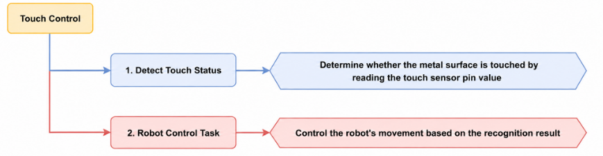

#### 5.3.9.3 Module Description

The touch sensor is based on capacitive sensing. It mainly detects the human body or metal through the gold-plated contact surface on the sensor.

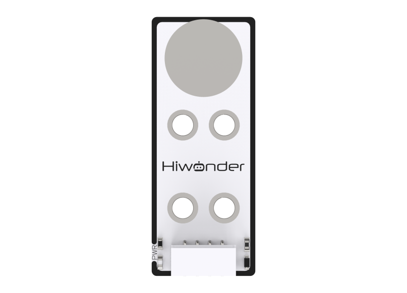

When no human body or metal touches the metal surface, the signal pin outputs a high level. When a human body or metal touches the metal surface, the signal pin outputs a low level.

Module wiring: Before running this program, connect the module to the miniHexa controller GPIO ports `IO33` and `IO32` as shown below.

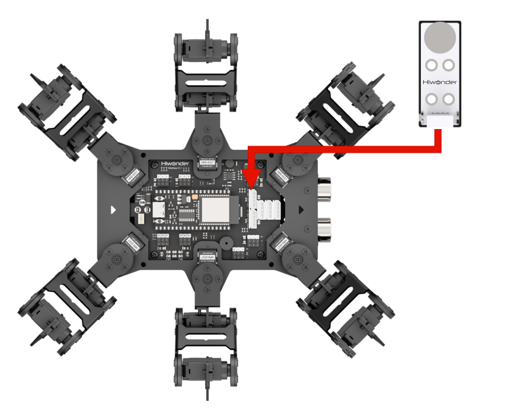

Installation: Mount the touch module onto the miniHexa rear panel.

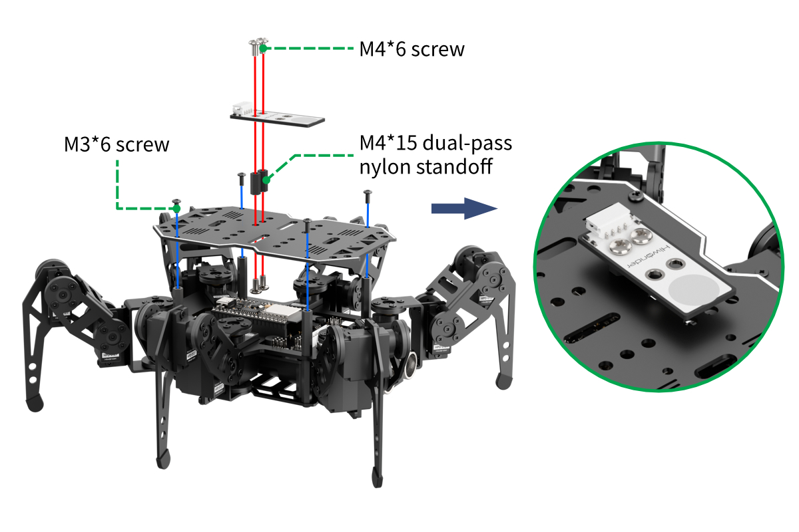

<p id ="anther5.3.9.4"></p>

#### 5.3.9.4 Program Download

1. Connect miniHexa to a PC with a Type-C data cable.


2. Open [**02 Program Files\09 Touch Control Program\touch_control\touch_control.ino**](https://drive.google.com/drive/folders/1ynA5cNqwy3d6lTVPNRU1hrsalmuHNUan?usp=sharing).


3. After the file opens, select the development board model shown below.


4. Click **Tools** in the menu bar, then select the ESP32 development board configuration shown below.


> [!NOTE]
>
> **Make sure the development board configuration is modified before downloading the program.**

5. Click **Compile**, then click **Upload**. When the following screen appears in the output box at the bottom of the software, the program download is complete.


#### 5.3.9.5 Project Outcome

Touch the metal surface on the touch sensor with a finger, and miniHexa marches in place.

#### 5.3.9.6 Program Analysis

1. Import the `hiwonder_robot.h` library. This library contains definitions for sensors and interaction methods, as well as methods for interacting with the robot system.

```cpp
    #include "hiwonder_robot.h"
```

2. Initialize the `miniHexa` object and the sensor object. Create the touch sensor flag and the robot movement speed, center of gravity position, and posture arrays `velocity`, `position`, and `_euler`.

```cpp
    Robot minihexa;

    uint8_t touch_state;
    Velocity_t velocity = {0.0f, 0.0f, 0.0f};
    Vector_t position = {0.0f, 0.0f, 0.0f};
    Euler_t _euler = {0.0f, 0.0f, 0.0f};
```

3. In the `setup()` function, set the serial communication baud rate to `115200`, then initialize the robot and sensors.

```cpp
    void setup() {
      Serial.begin(115200);
      minihexa.begin();
    }
```

4. In the `loop()` main program, obtain the sensor value and check whether the touch sensor flag is `0`. If it is `0`, move one step forward.

```cpp
    void loop() {
      touch_state = minihexa.sensor.get_touch_state();
      if(touch_state == 0) {
        velocity = {0.0f, 0.02f, 0.0f};
        minihexa.move(&velocity, &position, &_euler, 800, 1);
        delay(2000);
      }
    }
```

#### 5.3.9.7 Feature Extension

This example modifies touch control so that miniHexa moves backward. Follow the steps below.

1. Find the function in the main function code that executes the motion.

```cpp
   void loop() {
     touch_state = minihexa.sensor.get_touch_state();
     if(touch_state == 0) {
       velocity = {0.0f, 0.02f, 0.0f};
       minihexa.move(&velocity, &position, &_euler, 800, 1);
       delay(2000);
     }
   }
```

2. Change `velocity = {0.0f, 0.02f, 0.0f}` to `velocity = {0.0f, -0.02f, 0.0f}`.

```cpp
   void loop() {
     touch_state = minihexa.sensor.get_touch_state();
     if(touch_state == 0) {
       velocity = {0.0f, -0.02f, 0.0f};
       minihexa.move(&velocity, &position, &_euler, 800, 1);
       delay(2000);
     }
   }
```

To modify other movement directions, refer to the **Section 5.2.2  Omnidirectional Motion** in the [5. Arduino Programming Project/5.2 Basic Motion Control/01 Basic Motion Control](https://drive.google.com/drive/folders/11_xw8T0dfiM7oOCkNK0pRqMwyRzwxvm0?usp=sharing) tutorial.

3. After the modification is complete, refer to [5.3.9.4 Program Download](#anther5.3.9.4) to run the program.

### 5.3.10 Infrared Obstacle Avoidance

#### 5.3.10.1 Feature Overview

This lesson uses infrared obstacle avoidance sensors to detect distance and control the robot's movement.

#### 5.3.10.2 Project Process

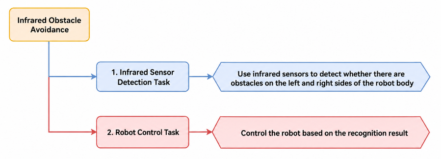

#### 5.3.10.3 Module Description


The infrared obstacle avoidance sensor detects whether an obstacle is present in front. The sensor has an infrared emitter and an infrared receiver. When the sensor encounters an obstacle, the infrared light is reflected back and received by the receiver.

Module wiring: Before running this program, connect the module to the miniHexa controller GPIO ports `IO32`, `IO14`, `IO18`, and `IO19` as shown below.


Installation: Mount the infrared sensor module onto the miniHexa rear panel.

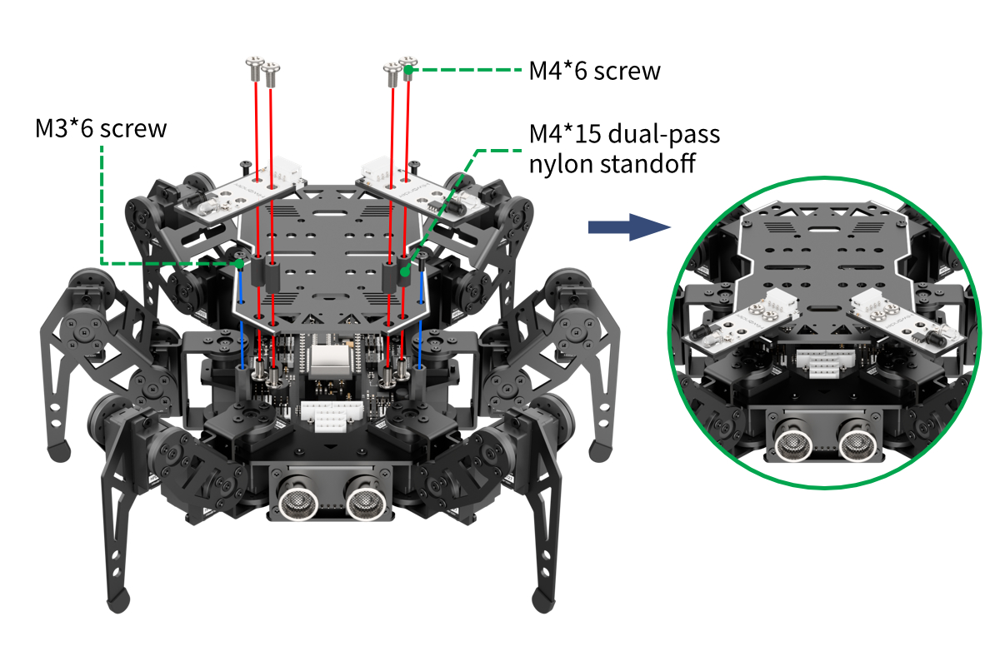

#### 5.3.10.4 Program Download

1. Connect miniHexa to a PC with a Type-C data cable.


2. Open [**02 Program Files\10 Infrared Obstacle Avoidance Program\ir_avoidance\ir_avoidance.ino**](https://drive.google.com/drive/folders/1_LNZp5ENrXItcteIahTiAw6lbVF41BMF?usp=sharing).


3. After the file opens, select the development board model shown below.


4. Click **Tools** in the menu bar, then select the ESP32 development board configuration shown below.


> [!NOTE]
>
> **Make sure the development board configuration is modified before downloading the program.**

5. Click **Compile**, then click **Upload**. When the following screen appears in the output box at the bottom of the software, the program download is complete.


#### 5.3.10.5 Project Outcome

After miniHexa powers on, it uses two infrared sensor modules to determine whether obstacles are present on the left and right sides of the body. If no obstacle is present, the robot moves forward. If an obstacle appears on the right side, the robot turns left in place. If an obstacle appears on the left side, the robot turns right in place. If obstacles appear on both sides, the robot first moves backward, then turns left in place.

#### 5.3.10.6 Program Analysis

1. Import the `hiwonder_robot.h` library. This library contains definitions for sensors and interaction methods, as well as methods for interacting with the robot system.

```cpp
    #include "hiwonder_robot.h"
```

2. Initialize the `miniHexa` object and the sensor object. Define the infrared sensor status variables `ir1_state` and `ir2_state`. Create the robot movement speed, center of gravity position, and posture arrays `velocity`, `position`, and `_euler`.

```cpp
    Robot minihexa;

    uint8_t ir1_state;
    uint8_t ir2_state;

    Velocity_t vel = {0.0f, 0.0f, 0.0f};
    Vector_t pos = {0.0f, 0.0f, 1.0f};
    Euler_t att = {0.0f, 0.0f, 0.0f};
```

3. In the `setup()` function, set the serial communication baud rate to `115200`, then initialize the robot and sensors.

```cpp
    void setup() {
      Serial.begin(115200);
      minihexa.begin();
      delay(1000);
    }
```

4. In the `loop()` main program, read the infrared sensor values. When `ir1_state` or `ir2_state` equals `1`, the robot moves backward. Otherwise, the robot moves forward.

```cpp
void loop() {
  ir1_state = minihexa.sensor.get_ir1_state();
  ir2_state = minihexa.sensor.get_ir2_state();
```

5. When obstacles appear on both the left and right sides, the robot first moves backward, then turns left in place.

```cpp
    if(ir1_state == 0 && ir2_state == 0) {
      vel = {0.0f, -2.0f, 0.0f};  // Move backward
      minihexa.move(&vel, &pos, &att, 800, 2);
      delay(2000);
      vel = {0.0f, 0.0f, 2.0f};   // Turn left
      minihexa.move(&vel, &pos, &att, 800, 2);  
      delay(2000);  
    }
```

6. When an obstacle appears on the right side, the robot turns left in place.

```cpp
    else if(ir1_state == 0 && ir2_state == 1) {
      vel = {0.0f, 0.0f, 2.0f};  // Turn left
      minihexa.move(&vel, &pos, &att, 800, 2);
      delay(2000);
    }
```

7. When an obstacle appears on the left side, the robot turns right in place.

```cpp
    else if(ir1_state == 1 && ir2_state == 0) {
      vel = {0.0f, 0.0f, -2.0f};  // Turn right
      minihexa.move(&vel, &pos, &att, 800, 2);
      delay(2000);
    }
```

8. When neither side detects an obstacle, the robot moves forward.

```cpp
      else if(ir1_state == 1 && ir2_state == 1){
        vel = {0.0f, 2.0f, 0.0f};  // Move forward
        minihexa.move(&vel, &pos, &att, 800, -1);
      }
    }
```

#### 5.3.10.7 Feature Extension

1. If the infrared sensors cannot detect obstacles, adjust the potentiometers on the sensors. Turning the knob **clockwise** **shortens** the detection distance, and turning it **counterclockwise** **increases** the detection distance.

2. If obstacles cannot be detected, turn the knob counterclockwise to increase the detection distance. After adjustment, obstacles can be detected normally.

3. Adjust the infrared sensor until the LED on the sensor lights up when an obstacle is detected and turns off when no obstacle is detected.

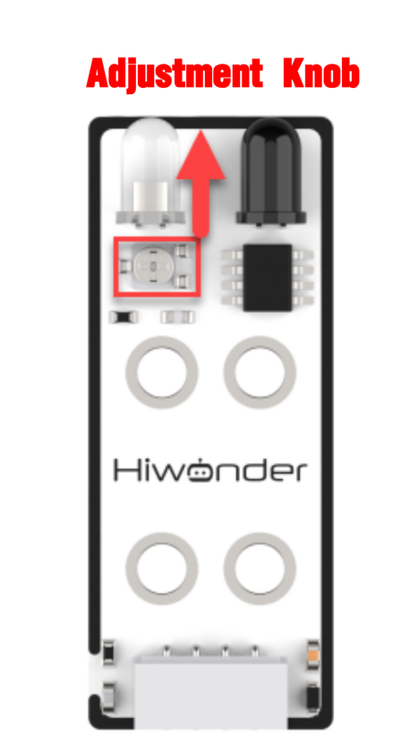

### 5.3.11 Intelligent Fall Prevention

#### 5.3.11.1 Feature Overview

This lesson uses infrared obstacle avoidance sensors to detect distance and control the robot's movement to prevent falling.

#### 5.3.11.2 Project Process

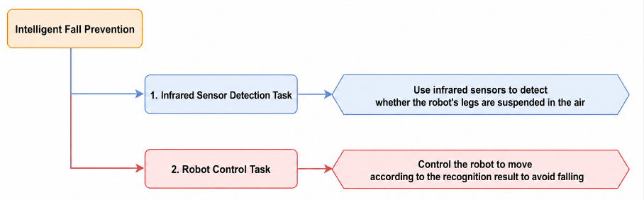

#### 5.3.11.3 Module Description


The infrared obstacle avoidance sensor detects whether an obstacle is present in front. The sensor has an infrared emitter and an infrared receiver. When the sensor encounters an obstacle, the infrared light is reflected back and received by the receiver.

Module wiring: Before running this program, connect the module to the miniHexa controller GPIO ports `IO32`, `IO14`, `IO18`, and `IO19` as shown below.


Installation: Mount the infrared sensor modules onto the two front legs of miniHexa.


<p id ="anther5.3.11.4"></p>

#### 5.3.11.4 Program Download

1. Connect miniHexa to a PC with a Type-C data cable.


2. Open [**02 Program Files\11 Intelligent Fall Prevention Program\fall\fall.ino**](https://drive.google.com/drive/folders/12fYr2jbN8UFtRZO_kq27xX_Ven4xUob0?usp=sharing).


3. After the file opens, select the development board model shown below.


4. Click **Tools** in the menu bar, then select the ESP32 development board configuration shown below.


> [!NOTE]
>
> **Make sure the development board configuration is modified before downloading the program.**

5. Click **Compile**, then click **Upload**. When the following screen appears in the output box at the bottom of the software, the program download is complete.


#### 5.3.11.5 Project Outcome

miniHexa uses the infrared sensor modules to detect whether the legs are suspended in the air. If a suspended leg is detected, the robot moves backward. Otherwise, it moves forward.

#### 5.3.11.6 Program Analysis

1. Import the `hiwonder_robot.h` library. This library contains definitions for sensors and interaction methods, as well as methods for interacting with the robot system.

```cpp
    #include "hiwonder_robot.h"
```

2. Initialize the `miniHexa` object and the sensor object. Define the infrared sensor status variables `ir1_state` and `ir2_state`. Create the robot movement speed, center of gravity position, and posture arrays `velocity`, `position`, and `_euler`.

```cpp
    Robot minihexa;

    uint8_t ir1_state;
    uint8_t ir2_state;

    Velocity_t vel = {0.0f, 0.0f, 0.0f};
    Vector_t pos = {0.0f, 0.0f, 0.0f};
    Euler_t att = {0.0f, 0.0f, 0.0f};
```

3. In the `setup()` function, set the serial communication baud rate to `115200`, then initialize the robot and sensors.

```cpp
    void setup() {
      Serial.begin(115200);
      minihexa.begin();
      delay(1000);
    }
```

4. In the `loop()` main program, read the digital values of the infrared sensors. According to the infrared sensor flags `ir1_state` and `ir2_state`, execute the corresponding movement. When `ir1_state` or `ir2_state` equals `1`, move backward. Otherwise, move forward.

```cpp
void loop() {
  ir1_state = minihexa.sensor.get_ir1_state();
  ir2_state = minihexa.sensor.get_ir2_state();
  if(ir1_state == 1 || ir2_state == 1) {
    vel = {0.0f, -3.0f, 0.0f};
    minihexa.move(&vel, &pos, &att, 600, 3);
    delay(2400);
    vel = {0.0f, 0.0f, 2.0f};
    minihexa.move(&vel, &pos, &att, 600, 4);
    delay(3000);
  }
  else {
    vel = {0.0f, 3.0f, 0.0f};
    minihexa.move(&vel, &pos, &att);
  }
}
```

#### 5.3.11.7 Feature Extension

This example modifies miniHexa so that it stops moving when a leg is detected as suspended in the air. Follow the steps below.

1. Find the infrared sensor judgment section in the main function code that checks whether the legs are suspended in the air.

```cpp
   if(ir1_state == 1 || ir2_state == 1) {
       vel = {0.0f, -3.0f, 0.0f};
       minihexa.move(&vel, &pos, &att, 600, 3);
       delay(2400);
       vel = {0.0f, 0.0f, 2.0f};
       minihexa.move(&vel, &pos, &att, 600, 4);
       delay(3000);
     }
```

2. Modify the `vel` value in the suspended-leg judgment section to `vel = {0.0f, 0.0f, 0.0f}`.

```cpp
   if(ir1_state == 1 || ir2_state == 1) {
       vel = {0.0f, 0.0f, 0.0f};
       minihexa.move(&vel, &pos, &att, 600, 3);
       delay(2400);
       vel = {0.0f, 0.0f, 2.0f};
       minihexa.move(&vel, &pos, &att, 600, 4);
       delay(3000);
     }
```

3. After the modification is complete, refer to [5.3.11.4 Program Download](#anther5.3.11.4) to run the program.

4. If the infrared sensors cannot detect obstacles, adjust the potentiometers on the sensors. Turning the knob **clockwise** **shortens** the detection distance, and turning it **counterclockwise** **increases** the detection distance. If obstacles cannot be detected, turn the knob counterclockwise to increase the detection distance. After adjustment, obstacles can be detected normally. Adjust the infrared sensor until the LED on the sensor lights up when an obstacle is detected and turns off when no obstacle is detected.


## 5.4 AI Vision Project

### 5.4.1 Introduction to ESP32-S3 AI Vision Module

#### 5.4.1.1 Product Introduction

The ESP32-S3 AI Vision Module is a compact camera module that can operate independently as a minimum system.

It captures images through the built-in camera, processes the data with the ESP32 microcontroller, and transmits it wirelessly via the Wi-Fi module. It also supports multiple communication protocols and low-power operation, making it widely applicable in various IoT scenarios.

#### 5.4.1.2 Interface Description


| **Interface Name** | **Description**                                              |
| :----------------: | :----------------------------------------------------------- |
|  USB Serial Port   | Used for serial communication and firmware flashing          |
|     Custom Key     | User-definable key events programmable in code               |
|      I2C Port      | Interface for connecting to the controller for secondary development |

#### 5.4.1.3 Notice

1. If the captured image shows water ripple patterns, it may be caused by the input power supply providing <=2A of rated current. Please check the current output of the power supply device.

2. **The module comes with a default program for image transmission. For vision recognition functions, flash the corresponding program as needed.**

#### 5.4.1.4 Module Wiring

Use a 4-pin cable to connect the module to any I2C Port highlighted in red on the servo controller.


### 5.4.2 Getting Started

#### 5.4.2.1 Notice

1. If the captured image shows water ripple patterns, it may be caused by the input power supply providing <=2A of rated current. Please check the current output of the power supply device.

2. The module comes preloaded with firmware for video transmission. The module can be used out of the box without flashing any additional firmware. To enable other functions, reflash the corresponding firmware.

#### 5.4.2.2 Device Connection

1. Connect the vision module to the computer using a Type-C cable. Check Device Manager to confirm that the port has been successfully recognized.


> [!NOTE]
>
> **If the device does not appear in the port list, the computer may be missing the required driver. Locate the installation package in [2. Software\\7.ch34x Driver\ch341ser.exe](https://drive.google.com/drive/folders/1DQjHDVH7Nvnxklj2mXLUrNuWhbSHIlCe?usp=sharing) and install it manually.**

2. Connect to the hotspot generated by the module: `HW_ESP32S3CAM`.


#### 5.4.2.3 Image Transmission

Open a web browser on mobile or PC. Here the PC browser is used as an example. Enter `192.168.5.1` in the address bar and press **Enter**. On the opened page, click the button shown below to access the camera video feed.


### 5.4.3 Controller-Device Communication Principle and Coordinate System Description

#### 5.4.3.1 Introduction

This section introduces how the ESP32S3 module, abbreviated below as ESP32S3, communicates with controllers such as Arduino and ESP32 boards. It explains how the ESP32S3 operates as a device and how the controller accesses ESP32S3 data and control functions.

In this chapter, the ESP32S3 always operates as a device. Information is transmitted through the I2C protocol.

#### 5.4.3.2 Controller-Device Relationship

In a controller-device system, the ESP32S3 operates as the device. Other microcontrollers and similar devices operate as the controller.

**Functions of the ESP32S3 as the device**

1. Receive and parse the signals sent by the controller:

Wait for an I2C signal interrupt. If I2C data is received, call the corresponding function according to the register address contained in the received I2C data.

2. Process data and send feedback:

When the ESP32S3 receives a register read command, call the corresponding transmission function and send the recognized data to the controller.

When the ESP32S3 receives a register setting command, set the fill light brightness.

**Functions of other devices as the controller**

1. Send commands:

Send a data read request to the ESP32S3.

2. Coordinate control:

Manage the coordinated operation of the entire system. Ensure that communication and operation among the controller, the ESP32S3, and other devices connected to the controller remain conflict-free and stable.

3. Receive data:

When the controller reads data, receive the status information sent by the ESP32S3 after the read command is sent. Then parse the data packet and extract the useful information.

#### 5.4.3.3 Device Address and Registers

When the ESP32S3 runs the face detection function:

|       **Address**       |                         **Function**                         |
| :---------------------: | :----------------------------------------------------------: |
|  `0x52` device address  |             Communication address of the ESP32S3             |
| `0x01` register address | Read face data `[int16_t x, y, w, h]`. All data values are `0` when no face is detected |

> [!NOTE]
>
> **In the face data, `x`, `y`, `w`, and `h` represent the face detection box marked in the original image. These values are the center point `x` coordinate, center point `y` coordinate, detection box width, and detection box height. The unit is pixels. See [5.4.3.4 Module Coordinate System Description](#anther5.4.3.4) for details about the pixel coordinate system used in this mode.**

When the ESP32S3 runs the color recognition function:

<table>
<colgroup>
<col style="width: 49%" />
<col style="width: 50%" />
</colgroup>
<tbody>
<tr>
<td style="text-align: center;"><strong>Address</strong></td>
<td style="text-align: center;"><strong>Function</strong></td>
</tr>
<tr>
<td style="text-align: center;">0x52 device address</td>
<td style="text-align: center;">Communication address of the ESP32S3</td>
</tr>
<tr>
<td style="text-align: center;">0x00 register address</td>
<td style="text-align: center;"><p>Read color 0 data. The read data format is</p>
<p>int16_t x, y, w, h. All zeros if not detected.</p></td>
</tr>
<tr>
<td style="text-align: center;">0x01 register address</td>
<td style="text-align: center;"><p>Read color 1 data. The read data format is</p>
<p>int16_t x, y, w, h. All zeros if not detected.</p></td>
</tr>
</tbody>
</table>


> [!NOTE]
>
> **The `x`, `y`, `w`, and `h` values in the color data represent the color block detection box marked in the original image. These values are the center point `x` coordinate, center point `y` coordinate, detection box width, and detection box height. The unit is pixels. See [5.4.3.4 Module Coordinate System Description](#anther5.4.3.4) for details about the pixel coordinate system used in this mode.**
> **If multiple color blocks that meet the preset color thresholds appear in the camera view, the module selects the two largest by area and stores their bounding box data sequentially in registers `0x00` and `0x01`.**

<p id ="anther5.4.3.4"></p>

#### 5.4.3.4 Module Coordinate System Description

This section briefly introduces the image coordinate system design of the camera module when operating in different modes. Understand this before studying the example routines.

When porting the example routines for secondary development, refer to this document and establish the mapping relationship between the module's image coordinate system and the real-world coordinate system.

The following are key points about the module image coordinate system:

**1. The origin is not at the center of the screen but at the top-left corner.**

**2. The Y-axis direction is opposite to the common Cartesian coordinate system.**

* **Image Transmission Mode**


> [!NOTE]
>
> **The image transmission mode uses a resolution of 320*240 to match the image data interface requirements of Hiwonder's mobile app.**

* **Face Recognition Mode**


> [!NOTE]
>
> **To ensure smooth image processing, the face recognition mode uses a resolution of 240*240, which is the value determined from Hiwonder's internal testing.**

* **Color Recognition Mode**


> [!NOTE]
>
> **To ensure smooth image processing, the color recognition mode uses a resolution of 160*140, which is the value determined from Hiwonder's internal testing.**

#### 5.4.3.5 Notice

The controller and the ESP32S3 module can use different power supplies. However, they must share a common ground during connection to provide stable communication levels.

### 5.4.4 Color Recognition

#### 5.4.4.1 Overview

In this lesson, the ESP32-S3 vision module is used to detect red, green, and blue colors. Based on the detected color, the corresponding color on the light-up ultrasonic module will be activated.

#### 5.4.4.2 Project Process

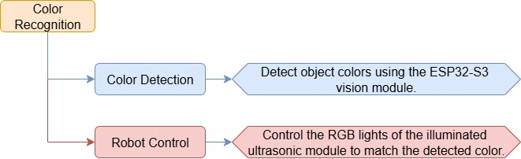

#### 5.4.4.3 Module Instruction

* **ESP32-S3 AI Vision Module**


This development board integrates an ESP32-S3 chip and a camera module. After it is installed on the carrier board, it communicates through an I2C Port and can read color and face-detection data through I2C communication.

Module wiring: as shown below, connect the module to any I2C Port highlighted in red on the servo controller before running this program.


* **Glowy Ultrasonic Sensor**

The module uses an I2C Port and can read the distance measured by the ultrasonic sensor through I2C communication. Two RGB LEDs are integrated at the ultrasonic probe position. The brightness can be adjusted. Color changes and color mixing across the red channel `R`, green channel `G`, and blue channel `B` make full-color lighting effects possible.


During distance measurement, the module automatically sends out 8 pulses of 40 kHz square waves and waits for a signal to return. If a signal is returned, the module outputs a high-level signal, and the duration of the high-level signal corresponds to the time it takes for the ultrasound to travel to the object and back.

> [!NOTE]
>
> **The glowy ultrasonic module is already connected to the onboard I2C Port at the factory. No additional wiring is required.**

#### 5.4.4.4 Program Download

* **ESP32S3 AI Vision Module Program Download**

1. Connect one end of the Type-C cable to the ESP32S3 module and the other end to the computer's USB port.

2. Open [**03 Program Files\01 Color Recognition Program\esp32s3\ColorDetection\ColorDetection.ino**](https://drive.google.com/drive/folders/1ShRIlMPliBl2_cQ_7Z52U0h5eQ5t0lVo?usp=sharing).

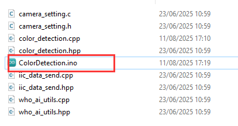

3. Next, select the development board **ESP32S3 Dev Module**.


4. In the menu bar, click **Tools**, and choose the corresponding ESP32S3 controller configuration as illustrated.


> [!NOTE]
>
> **Make sure to set the correct controller configuration before uploading the program.**

5. Finally, click the upload button shown below to upload the code to the ESP32S3 vision module and wait for the upload to complete.


* **ESP32 Program Download**

1. Connect miniHexa to the computer using a Type-C data cable.

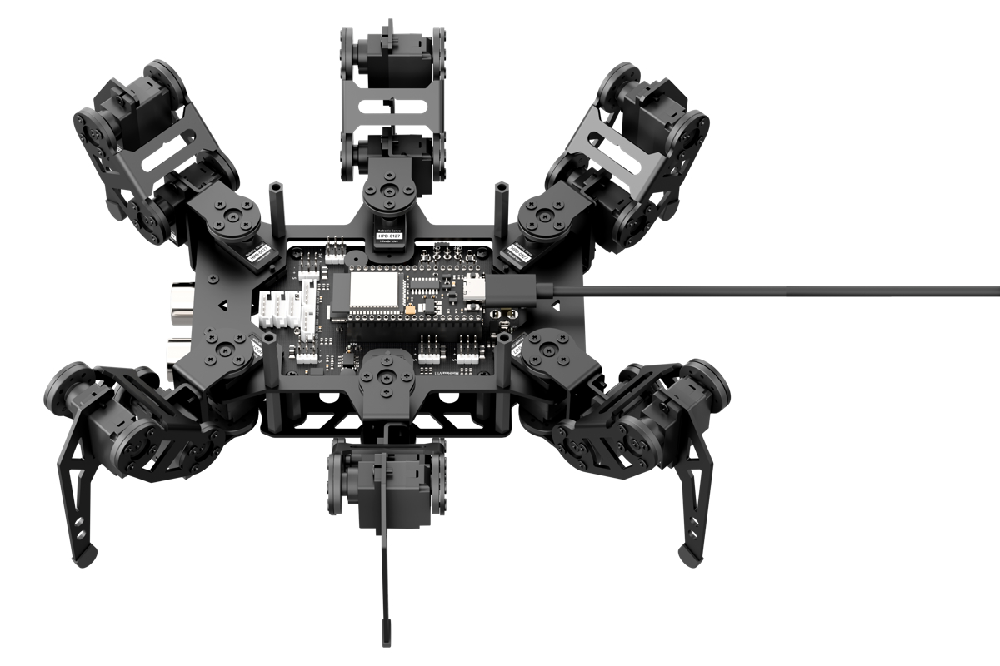

2. Open [**03 Program Files\02 Color Recognition Program\minihexa\color_detection\color_detection.ino**](https://drive.google.com/drive/folders/1bPLw5DP9fKwXzzS77_ohML1nhGvy8awl?usp=sharing).

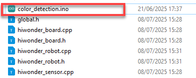

3. Select the development board model when the program opens, and the specific model is shown in the figure below.


4. In the menu bar, click **Tools**, and choose the corresponding ESP32 controller configuration as illustrated.


> [!NOTE]
>
> **Make sure to set the correct controller configuration before uploading the program.**

5. Click **Compile** first, then click **Upload**. After the upload is completed, the program download is completed if the following interface appears in the output box below the software.


#### 5.4.4.5 Project Outcome

When the vision module detects a color block of red, green, or blue, it controls the RGB lights of the illuminated ultrasonic module to light up in the same color.

#### 5.4.4.6 Program Brief Analysis

1. The program imports the `hiwonder_robot.h` library. This library contains methods for interacting with the robot system.

```cpp
    #include "hiwonder_robot.h"
```

2. Create the robot object for subsequent control.

```cpp
    Robot minihexa;
```

3. Create an array `val` for storing color IDs, and two RGB intensity arrays `rgb1` and `rgb2` for the two RGB lights on the illuminated ultrasonic module. Arrays for robot movement speed, center of gravity, and attitude are created: `vel`, `pos`, and `att`.

```cpp
    uint8_t val[4];
    uint8_t rgb1[3] = {0};
    uint8_t rgb2[3] = {0};

    Velocity_t vel = {0.0f,0.0f,0.0f};
    Vector_t pos = {0.0f,0.0f,0.0f};
    Euler_t att = {0.0f,0.0f,0.0f};
```

4. In the `setup()` function, first initialize the serial port with a baud rate of `115200`, then initialize the robot. Next, call the sensor object's `set_ultrasound_rgb()` function to set the two RGB lights of the illuminated ultrasonic module in `RGB_WORK_SOLID_MODE`, which is a constant color mode, according to the intensity ratios in `rgb1` and `rgb2`. Since `rgb1` and `rgb2` are initially all zeros, the RGB lights remain off.

```cpp
    void setup() {
      delay(1000);
      Serial.begin(115200);
      minihexa.begin();
      delay(1000);
      minihexa.sensor.set_ultrasound_rgb(RGB_WORK_SOLID_MODE, rgb1, rgb2);
    }
```

5. In `loop()`, call the vision module sub-object `camera` of the sensor object and use `color_id_detection()` to read the **Color ID Register** of the vision module, storing the data into the `val` array.

> [!NOTE]
>
> **The vision module is preset to detect four colors: red, green, blue, and purple, with IDs `1` through `4`. The Color ID Register has 4 bytes, each corresponding to one color ID in order.**
> **When any color is detected, the corresponding byte in the register stores its ID. Otherwise, it stores `0`.**

```cpp
void loop() {
  Serial.printf("%d %d %d %d\n", val[0], val[1], val[2], val[3]);
  minihexa.sensor.camera.color_id_detection(val, sizeof(val));
  // Color recognition logic
}
```

6. Determine the detected colors from the `val` array and control the illuminated ultrasonic module to light the corresponding color. Since the logic for each color is similar, red is explained as an example. Red corresponds to ID `1` and is stored in the first byte of the Color ID Register. Check if `val[0]` equals `1`. If so, red is detected. Then check the values of the second through fourth bytes to confirm that they are all `0`, ensuring that only the red color is detected. If all conditions are satisfied, set the intensity ratio in `rgb1` to `10:0:0`, and copy this value to `rgb2`. Finally, call the sensor object's `set_ultrasound_rgb()` function to update both RGB lights on the illuminated ultrasonic module to display red.

```cpp
if(val[0] == 1 && val[1] == 0 && val[2] == 0 && val[3] == 0) {
  rgb1[0] = 10;
  rgb1[1] = 0;
  rgb1[2] = 0;
  memcpy(rgb2, rgb1, sizeof(rgb1));
  minihexa.sensor.set_ultrasound_rgb(RGB_WORK_SOLID_MODE, rgb1, rgb2);
  delay(500);
}
else if(val[0] == 0 && val[1] == 2 && val[2] == 0 && val[3] == 0) {
  rgb1[0] = 0;
  rgb1[1] = 10;
  rgb1[2] = 0;
  memcpy(rgb2, rgb1, sizeof(rgb1));
  minihexa.sensor.set_ultrasound_rgb(RGB_WORK_SOLID_MODE, rgb1, rgb2);
}
else if(val[0] == 0 && val[1] == 0 && val[2] == 3 && val[3] == 0) {
  rgb1[0] = 0;
  rgb1[1] = 0;
  rgb1[2] = 10;
  memcpy(rgb2, rgb1, sizeof(rgb1));
  minihexa.sensor.set_ultrasound_rgb(RGB_WORK_SOLID_MODE, rgb1, rgb2);
}
      delay(20);
```

### 5.4.5 Color Threshold Adjustment

#### 5.4.5.1 Overview

This section explains how to use the ESP32-S3 for color recognition and how to modify the target color to be detected.

> [!NOTE]
>
> **The example program used in this section can be found at [03 Program Files\01 Color Recognition Program\esp32s3\ColorDetection](https://drive.google.com/drive/folders/1ShRIlMPliBl2_cQ_7Z52U0h5eQ5t0lVo?usp=sharing). This program is not related to the Color Tracking demo.**
> **The threshold adjustment method described here also applies to the ESP32-S3 program for the Color Tracking demo.**

<p id ="anther5.4.5.2"></p>

#### 5.4.5.2 Downloading the Color Recognition Program

1. Connect one end of the Type-C cable to the ESP32S3 module and the other end to the computer's USB port.

2. Open [**03 Program Files\02 Color Recognition Program\esp32s3\ColorDetection\ColorDetection.ino**](https://drive.google.com/drive/folders/1ShRIlMPliBl2_cQ_7Z52U0h5eQ5t0lVo?usp=sharing).

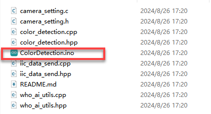

3. Next, select the development board **ESP32S3 Dev Module**.


4. In the menu bar, click **Tools**, and choose the corresponding ESP32S3 controller configuration as illustrated.


5. Finally, click the upload button shown below to upload the code to the ESP32S3 vision module and wait for the upload to complete.


<p id ="anther5.4.5.3"></p>

#### 5.4.5.3 Modifying the Target Color

Here the ESP32-S3 color recognition function is used as an example to demonstrate how to adjust the detection color. Follow the steps below.

1. First, open the [**Color Threshold Tool**](https://drive.google.com/drive/folders/1dF5_pKARpVsDQlfbdwIgqO97Rlcqu_67?usp=sharing).


2. Click **Select Image** and import an image file.


3. Adjust the HSV threshold sliders to segment the image. Refer to the provided HSV range table for guidance.


4. The interface includes six text boxes showing the HSV threshold values. Each is linked to a corresponding slider, as illustrated below.

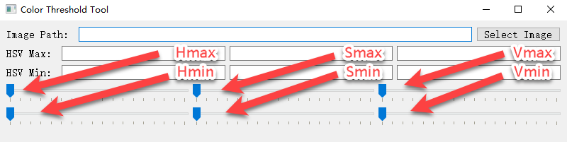

5. On the left side of the tool, the original imported image is shown. On the right side, the processed result after HSV segmentation is displayed. Drag the sliders until only the desired target color remains highlighted. In the recognition result on the right, only the image regions corresponding to the target color appear in white, while all other regions are shown in black.

> [!NOTE]
>
> **The black areas indicate unrecognized regions, meaning that the current HSV thresholds do not detect these colors. The white areas indicate recognized regions, meaning that the current HSV thresholds successfully detect these colors.**

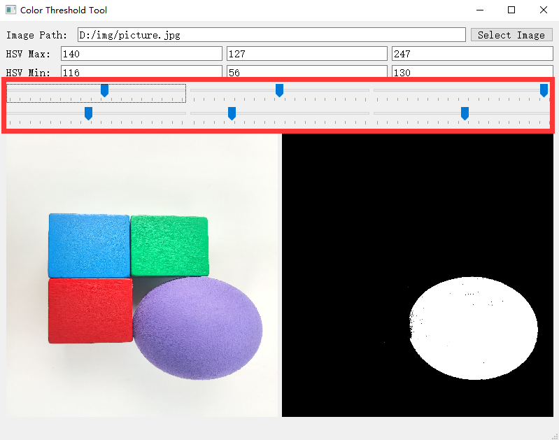

6. Then save the HSV thresholds and open [**03 Program Files\02 Color Recognition Program\esp32s3\ColorDetection\color_detection.cpp**](https://drive.google.com/drive/folders/1ShRIlMPliBl2_cQ_7Z52U0h5eQ5t0lVo?usp=sharing). Modify the color data with the saved HSV array. Finally, refer to [5.4.5.2 Downloading the Color Recognition Program](#anther5.4.5.2) to flash the modified program into the ESP32-S3.

7. In the container shown below, the parameters within each element are defined as follows: `{{Hmin, Hmax, Smin, Smax, Vmin, Vmax}, 64, "Color Name"}`. The corresponding source code is shown below.

```cpp
   vector<color_info_t> std_color_info = {
       {{151, 15, 70, 255, 90, 255}, 64, "red"},
       {{23, 34, 70, 255, 90, 255}, 64, "yellow"},
       {{45, 75, 70, 255, 90, 255}, 64, "green"},
       {{97, 117, 70, 255, 90, 255}, 64, "blue"},
       {{130, 155, 70, 255, 90, 255}, 64, "purple"}
   };
```

8. The following source code shows the recognition color after modification. After the modification, the module no longer recognizes red but instead recognizes purple. When the serial port receives `color[0]`, it indicates that purple has been detected.

> [!NOTE]
>
> **Make sure that the array elements follow the correct format and are separated by commas.**

```cpp
vector<color_info_t> std_color_info = {
    {{116, 140, 56, 127, 130, 247, "purple"},
    {{23, 34, 70, 255, 90, 255}, 64, "yellow"},
    {{45, 75, 70, 255, 90, 255}, 64, "green"},
    {{97, 117, 70, 255, 90, 255}, 64, "blue"},
    {{130, 155, 70, 255, 90, 255}, 64, "purple"}
};
```

9. Once the flashing is complete, the ESP32 camera will be able to recognize objects of other colors.

### 5.4.6 Color Tracking

#### 5.4.6.1 Overview

In this lesson, the ESP32-S3 vision module is used to detect red objects and control the robot to rotate in place to follow the movement of the object.

#### 5.4.6.2 Project Process

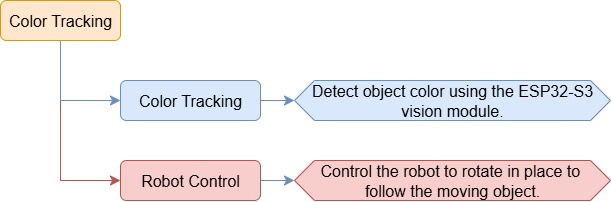

#### 5.4.6.3 Module Instruction

* **ESP32-S3 AI Vision Module**

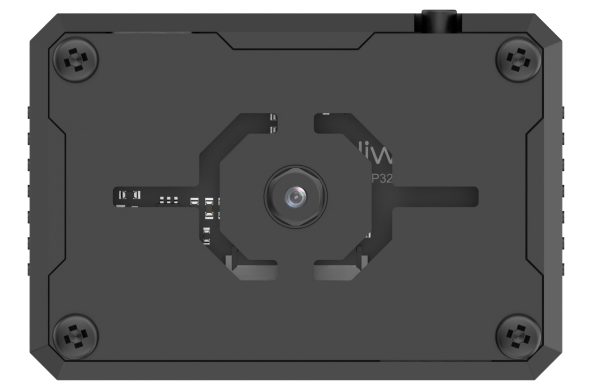

This development board integrates an ESP32-S3 chip and a camera module. After it is installed on the carrier board, it communicates through an I2C Port and can read color and face-detection data through I2C communication.

Module wiring: as shown below, connect the module to any I2C Port highlighted in red on the servo controller before running this program.

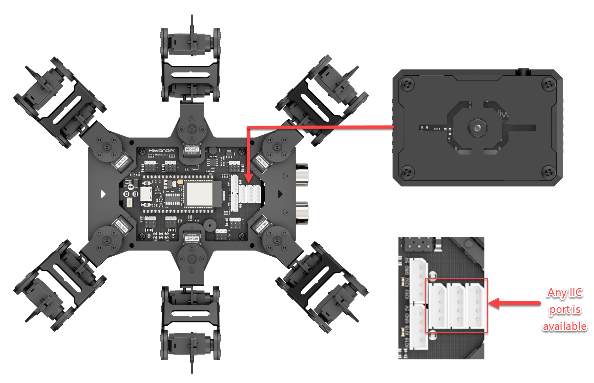

#### 5.4.6.4 Program Download

* **ESP32S3 AI Vision Module Program Download**

1. Connect one end of the Type-C cable to the ESP32S3 module and the other end to the computer's USB port.

2. Open [**03 Program Files\02 Color Tracking Program\esp32s3\ColorDetection\ColorDetection.ino**](https://drive.google.com/drive/folders/1lV43IMUI3CDV_55ORNFbYKTcUKc7JFhF?usp=sharing).


3. Next, select the development board **ESP32S3 Dev Module**.


4. In the menu bar, click **Tools**, and choose the corresponding ESP32 controller configuration as illustrated.


> [!NOTE]
>
> **Make sure to set the correct controller configuration before uploading the program.**

5. Finally, click the upload button shown below to upload the code to the ESP32S3 vision module and wait for the upload to complete.


* **ESP32 Program Download**

1. Connect miniHexa to the computer using a Type-C data cable.


2. Open [**03 Program Files\03 Color Tracking Program\minihexa\color_tracking\color_tracking.ino**](https://drive.google.com/drive/folders/1oY25qbS7u8ZCQC6ZxD2HmXDM2mlvUjcl?usp=sharing).

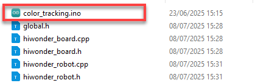

3. Select the development board model when the program opens, and the specific model is shown in the figure below.


4. In the menu bar, click **Tools**, and choose the corresponding ESP32 controller configuration as illustrated.


> [!NOTE]
>
> **Make sure to set the correct controller configuration before uploading the program.**

5. Click **Compile** first, then click **Upload**. After the upload is completed, the program download is completed if the following interface appears in the output box below the software.


#### 5.4.6.5 Project Outcome

When the vision module detects a red object, the robot remains standing in place and adjusts its posture to ensure that the vision module always faces the red object.

> [!NOTE]
>
> **The robot's rotation is limited in the program. It only tracks the object within a range of 20 degrees clockwise or counterclockwise from its current orientation.**

#### 5.4.6.6 Program Brief Analysis

1. The program imports the `hiwonder_robot.h` library. This library contains methods for interacting with the robot system.

```cpp
    #include "hiwonder_robot.h"
```

2. Create the robot and sensor objects for subsequent control.

```cpp
    Robot minihexa;
```

3. Define variables for the robot's yaw angle and its incremental change `increase`, a color ID array `val`, and RGB intensity arrays `rgb1` and `rgb2` for the two RGB lights on the ultrasound module. Arrays for robot movement speed, center of gravity, and attitude are created: `vel`, `pos`, and `att`.

```cpp
    float increase;
    float yaw;
    uint8_t val[4];
    uint8_t rgb1[3] = {0};
    uint8_t rgb2[3] = {0};

    Velocity_t vel = {0.0f,0.0f,0.0f};
    Vector_t pos = {0.0f,0.0f,0.0f};
    Euler_t att = {0.0f,0.0f,0.0f};
```

4. In the `setup()` function, first initialize the serial port with a baud rate of `115200`, then initialize the robot and sensor. Next, call the sensor object's `set_ultrasound_rgb()` function to set the two RGB lights of the illuminated ultrasonic module in `RGB_WORK_SOLID_MODE`, which is a constant color mode, according to the intensity ratios in `rgb1` and `rgb2`. Since `rgb1` and `rgb2` are initially all zeros, the RGB lights remain off.

```cpp
    void setup() {
      Serial.begin(115200);
      minihexa.begin();
      delay(1000);
      minihexa.sensor.set_ultrasound_rgb(RGB_WORK_SOLID_MODE, rgb1, rgb2); 
    }
```

5. In the `loop()` function, first call the vision module's `camera.green_block_detection()` function to read the data for the red color stored in the color register 2 and store it in the `val` array.

> [!NOTE]
>
> **The vision module can detect four preset colors: red, green, blue, and purple, with IDs `1` through `4`. The data for these four IDs are stored sequentially in addresses `0x00` through `0x03`.**
> **Each ID has 4 bytes of data representing the detected color bounding box in the 2D image coordinate system: center point x-coordinate, center point y-coordinate, bounding box width, and bounding box height.**

```cpp
void loop() {
  minihexa.sensor.camera.green_block_detection(val, sizeof(val));
  if(val[0] != 0 && val[1] != 0 && val[2] != 0 && val[3] != 0) {
    increase = fmap((float)val[0], 0, 160, -1.0f, 1.0f);
    yaw = yaw > 20.0f ? 20.0f : yaw < -20.0f ? -20.0f : yaw + increase;
  }
  att = {0.0f, 0.0f, yaw};
  minihexa.move(&vel, &pos, &att, 50); 
  delay(50);
}
```

6. First, check whether the data for ID 2, red, are all zeros. If not, the module has detected the red color. Next, read the x-coordinate of the red bounding box center from `val[0]`, which ranges from `0` to `160`. Map this value to the robot's yaw increment `increase`, ranging from `-1` to `1`, and add it to the current yaw angle `yaw`.

> [!NOTE]
>
> **In color recognition mode, the captured image width is 160 pixels, with `x = 0` at the left edge, `x = 160` at the right edge, and the center at `x = 80`.**

```cpp
void loop() {
  minihexa.sensor.camera.green_block_detection(val, sizeof(val));
  if(val[0] != 0 && val[1] != 0 && val[2] != 0 && val[3] != 0) {
    increase = fmap((float)val[0], 0, 160, -1.0f, 1.0f);
    yaw = yaw > 20.0f ? 20.0f : yaw < -20.0f ? -20.0f : yaw + increase;

  }
```

7. Write the updated `yaw` to the Euler angle array `att` controlling the robot's attitude, then call the `move()` function to execute the movement. Because `yaw` represents rotation around the Z-axis, the robot twists its posture to follow the moving object.

> [!NOTE]
>
> **Due to the robot's physical structure, it cannot rotate indefinitely. Therefore, `yaw` is constrained to ensure the commanded posture remains kinematically feasible.**

```cpp
  att = {0.0f, 0.0f, yaw};
  minihexa.move(&vel, &pos, &att, 50); 
  delay(50);
}
```

### 5.4.7 Vision Line Following

#### 5.4.7.1 Overview

In this lesson, the ESP32-S3 vision module is used to detect red lines and control the robot to follow the line.

#### 5.4.7.2 Project Process

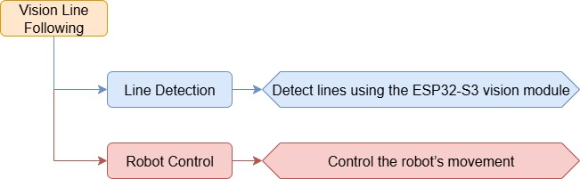

#### 5.4.7.3 Module Instruction

* **ESP32-S3 AI Vision Module**


This development board integrates an ESP32-S3 chip and a camera module. After it is installed on the carrier board, it communicates through an I2C Port and can read color and face-detection data through I2C communication.

Module wiring: as shown below, connect the module to any I2C Port highlighted in red on the servo controller before running this program.


#### 5.4.7.4 Program Download

* **ESP32S3  AI Vision Module Program Download**

1. Connect one end of the Type-C cable to the ESP32S3 module and the other end to the computer's USB port.

2. Open [**03 Program Files\03 Vision Line Following Program\esp32s3\LineFollowing\LineFollowing.ino**](https://drive.google.com/drive/folders/1Atz-WfNx6CL5qs747zhDVLp8g08Z-8u8?usp=sharing).

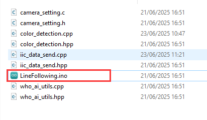

3. Next, select the development board **ESP32S3 Dev Module**.


4. In the menu bar, click **Tools**, and choose the corresponding ESP32S3 controller configuration as illustrated.


> [!NOTE]
>
> **Make sure to set the correct controller configuration before uploading the program.**

5. Finally, click the to upload the code to the ESP32S3 vision module and wait for the upload to complete.


6. In the menu bar, click **Tools**, and choose the corresponding ESP32 controller configuration as illustrated.


> [!NOTE]
>
> **Make sure to set the correct controller configuration before uploading the program.**


* **ESP32 Program Download**

1. Connect miniHexa to the computer using a Type-C data cable.


2. Open [**03 Program Files\04 Vision Line Following Program\minihexa\line_following\line_following.ino**](https://drive.google.com/drive/folders/1_xYfdlciFD4aynxIuoebbr-B77rXuIMH?usp=sharing).


3. Select the development board model when the program opens, and the specific model is shown in the figure below.


4. Click **Compile** first, then click **Upload**. After the upload is completed, the program download is completed if the following interface appears in the output box below the software.


#### 5.4.7.5 Project Outcome

When the vision module detects a red line, the robot moves along the line.

> [!NOTE]
>
> **The vision module is set by default to recognize red lines. To change the default recognition color, refer to [5.4.5.3 Modifying the Target Color](#anther5.4.5.3).**

#### 5.4.7.6 Program Brief Analysis

1. The program imports the `hiwonder_robot.h` library. This library contains definitions for various sensors and interaction methods, while `hiwonder_robot.h` contains methods for interacting with the robot system itself.

```cpp
    #include "hiwonder_robot.h"
```

2. Create the robot and sensor objects for subsequent control.

```cpp
    Robot minihexa;
```

3. Define variables for the robot's yaw angle and its incremental change `increase`, a color ID array `val`, and RGB intensity arrays `rgb1` and `rgb2` for the two RGB lights on the ultrasound module. Arrays for robot movement speed, center of gravity, and attitude are created: `vel`, `pos`, and `att`.

```cpp
    uint8_t val[4];
    uint8_t rgb1[3] = {0};
    uint8_t rgb2[3] = {0};

    Velocity_t vel = {0.0f,0.0f,0.0f};
    Vector_t pos = {0.0f,0.0f,0.0f};
    Euler_t att = {0.0f,0.0f,0.0f};
```

4. In the `setup()` function, first initialize the serial port with a baud rate of `115200`, then initialize the robot and sensor. Next, call the sensor object's `set_ultrasound_rgb()` function to set the two RGB lights of the illuminated ultrasonic module in `RGB_WORK_SOLID_MODE`, which is a constant color mode, according to the intensity ratios in `rgb1` and `rgb2`. Since `rgb1` and `rgb2` are initially all zeros, the RGB lights remain off.

```cpp
void setup() {
  Serial.begin(115200);
  minihexa.begin();
  delay(100);
  minihexa.sensor.set_ultrasound_rgb(RGB_WORK_SOLID_MODE, rgb1, rgb2);
}
```

5. In the main loop, first call the `region2_red_block_detection()` function of the vision module sub-object `camera` under the sensor object to read the red block data detected by the vision module, and store the data into the `val` array.

> [!NOTE]
>
> **Each ID has 4 bytes of data representing the detected color bounding box in the 2D image coordinate system: center point x-coordinate, center point y-coordinate, bounding box width, and bounding box height.**

```cpp
void loop() {
  minihexa.sensor.camera.region2_red_block_detection(val, sizeof(val));
  Serial.println(val[0]);
  // Line following logic
}
```

6. Compare the value of `val[0]`, which represents the x-coordinate of the center point of the detected block. If it is greater than `120`, set the y component of the `vel` parameter to `1` and the z component to `-0.1`. These values are used to control the robot to turn right.

> [!NOTE]
>
> **In color recognition mode, the captured image width is 160 pixels, with `x = 0` at the left edge, `x = 160` at the right edge, and the center at `x = 80`.**

```cpp
if(val[0] > 120) {
  vel = {0.0f, 1.0f, -0.1f};  // Turn right
}
```

7. If `val[0]` is less than `40`, set the y component of the `vel` parameter to `1` and the z component to `0.1`. These values are used to control the robot to turn left. If `val[0]` is between `40` and `120`, the robot is controlled to move straight.

```cpp
else if(val[0] < 40) {
  vel = {0.0f, 1.0f, 0.1f};   // Turn left
}
```

8. Finally, pass the `vel` parameter to the `move()` function to control the robot's movement.

```cpp
else{
  vel = {0.0f, 1.0f, 0.0f};   // Move straight
}
minihexa.move(&vel, &pos, &att, 700);
delay(20);
```

### 5.4.8 Face Recognition

#### 5.4.8.1 Overview

In this lesson, the ESP32-S3 vision module is used to detect faces. Once a face is recognized, the robot will swing three times as a gesture of welcome.

#### 5.4.8.2 Project Process

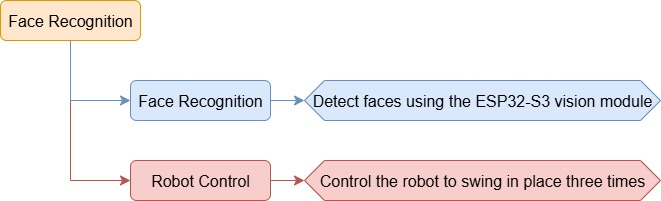

#### 5.4.8.3 Module Instruction

1. ESP32-S3 AI Vision Module


This development board integrates an ESP32-S3 chip and a camera module. After it is installed on the carrier board, it communicates through an I2C Port and can read color and face-detection data through I2C communication.

Module wiring: as shown below, connect the module to any I2C Port highlighted in red on the servo controller before running this program.


2. Glowy Ultrasonic Sensor

The module uses an I2C Port and can read the distance measured by the ultrasonic sensor through I2C communication. Two RGB LEDs are integrated at the ultrasonic probe position. The brightness can be adjusted. Color changes and color mixing across the red channel `R`, green channel `G`, and blue channel `B` make full-color lighting effects possible.


#### 5.4.8.4 Program Download

* **ESP32S3 AI Vision Module Program Download**

1. Connect one end of the Type-C cable to the ESP32S3 module and the other end to the computer's USB port.

2. Open [**03 Program Files\04 Face Recognition Program\esp32s3\FaceDetection\FaceDetection.ino**](https://drive.google.com/drive/folders/1BrkDIldWXR2qFY1NVxKqgic7HpXDl-ps?usp=sharing).

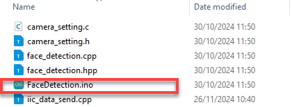

3. Next, select the development board **ESP32S3 Dev Module**.


4. In the menu bar, click **Tools**, and choose the corresponding ESP32S3 controller configuration as illustrated.


> [!NOTE]
>
> **Make sure to set the correct controller configuration before uploading the program.**

5. Finally, click the upload button shown below to upload the code to the ESP32S3 vision module and wait for the upload to complete.


* **ESP32 Program Download**

1. Connect miniHexa to the computer using a Type-C data cable.


2. Open [**03 Program Files\04 Face Recognition Program\minihexa\face_detection\face_detection.ino**](https://drive.google.com/drive/folders/1xwYQCtdQIGuKwnAsIW1EnaegW9VWMW2x?usp=sharing).

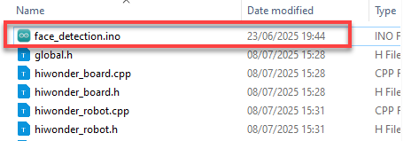

3. Select the development board model when the program opens, and the specific model is shown in the figure below.


4. Click **Compile** first, then click **Upload**. After the upload is completed, the program download is completed if the following interface appears in the output box below the software.

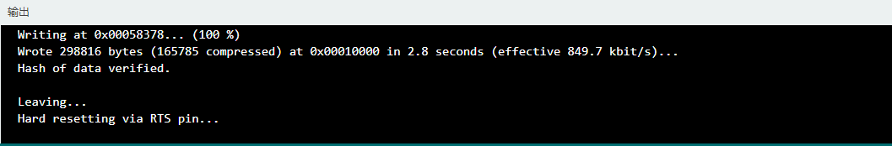

#### 5.4.8.5 Project Outcome

When the vision module detects a face, the robot executes the acting-cute action group.

#### 5.4.8.6 Program Brief Analysis

1. The program imports the `hiwonder_robot.h` library, which contains the methods for interacting with the robot system.

```cpp
    #include "hiwonder_robot.h"
```

2. Create the robot and sensor objects for subsequent control.

```cpp
    Robot minihexa;
```

3. Define the robot's yaw variable and its swing amplitude, as well as the face data array `val`. Arrays for robot movement speed, center of gravity, and attitude are created: `vel`, `pos`, and `att`.

```cpp
    uint8_t val[4];
    float yaw;
    float amplitude;

    Velocity_t vel = {0.0f,0.0f,0.0f};
    Vector_t pos = {0.0f,0.0f,0.0f};
    Euler_t att = {0.0f,0.0f,0.0f};
```

4. In the `setup()` function, first initialize the serial port with a baud rate of `115200`, then initialize the robot.

```cpp
    void setup() {
      Serial.begin(115200);
      minihexa.begin();
    }
```

5. In the main loop, first call the `face_data_receive()` function from the vision module sub-object `camera` of the robot object to read the **Face Recognition Register** of the vision module. The data is then stored into the `val` array.

> [!NOTE]
>
> **The Face Recognition Register consists of 4 bytes, storing the following data in order: the x-coordinate of the bounding box center, the y-coordinate of the bounding box center, the width of the bounding box, and the height of the bounding box, all in the captured image's 2D coordinate system.**

```cpp
void loop() {
  minihexa.sensor.camera.face_data_receive(val, sizeof(val));
  if(val[0] != 0) {
    minihexa.acting_cute();
  }
      delay(20);
}
```

6. First use the value of `val[0]`, the x-coordinate of the bounding box center, as a reference. If it is not zero, it indicates that a face has been detected. Once a face is confirmed, call the `acting_cute()` function to control the robot and execute the action group.

```cpp
    if(val[0] != 0) {
      minihexa.acting_cute();  // Execute the action
    }
```

## 5.5 AI Voice Project

### 5.5.1 Introduction and Installation of WonderEcho

#### 5.5.1.1 Module Introduction


The integrated voice interaction module WonderEcho is built on the CI1302 chip for voice recognition and voice playback. It supports offline neural network acceleration and hardware acceleration for voice signal processing. The module uses deep noise reduction and neural network models to analyze voice input and generate recognition results.

The CI1302 chip has a brain neural network processor core (BNPU), supports offline neural network acceleration and hardware acceleration for voice signal processing, and runs at up to `220 MHz`. It supports offline far-field voice recognition, includes `2 MB` of onboard `FLASH` storage, and can store up to `300` command words.

The module is easy to use and delivers strong voice recognition performance. It is widely used in smart home devices, conversational robots, educational robots, and in-vehicle dispatch terminals.

**Working Principle**

The module uses a wake-word activation mode. Speak the wake word first to activate the voice interaction module. Commands can be recognized only after activation. English is the default recognition language. The English wake word is `Hello Hiwonder`. If no voice is recognized within `15` seconds, the module enters sleep mode. Wake the module again before the next use.

After the CI1302 chip recognizes a command word, it sends the corresponding instruction to the I2C chip and plays back the matching phrase. The I2C chip stores the received voice command and sends it through the I2C peripheral protocol. The supported command words are listed in [**04 WonderEcho Firmware Flash Tutorial/02 Command Word Playback Phrase Protocol List-V3_English Temple.xlsx**](https://drive.google.com/drive/folders/1X9PpUXagVvFnXmACI4NdAyx2eXafkurl?usp=sharing).

**Notes**

1. Use a `5V` power supply. Incorrect voltage may damage the module.

2. Use the module in a quiet environment. Excessive background noise affects recognition performance.

3. Speak the command words clearly and loudly. Avoid speaking too quickly. A distance of less than `5` meters from the module is recommended.

#### 5.5.1.2 Hardware Interface Description


| **No.** | **Hardware Name**         | **Description**                                              |
| :-----: | :------------------------ | :----------------------------------------------------------- |
|    1    | Speaker                   | Converts analog signals into sound                           |
|    2    | Microphone                | Converts sound into analog signals                           |
|    3    | RST button                | Reset button                                                 |
|    4    | Signal indicator blue LED | Stays on during operation. Flashes once when a command word is recognized |
|    5    | Power indicator red LED   | Stays on when the power supply is normal                     |
|    6    | I2C Port                  | Works as an I2C device and is used for power supply and communication with the controller |
|    7    | Type-C Port               | Used for power supply and CI1302 firmware updates            |
|    8    | CI1302 chip               | High-performance voice recognition chip that recognizes voice commands and outputs signals |
|    9    | I2C chip                  | Converts instructions from the voice recognition chip into I2C protocol commands |
|   10    | Audio amplifier chip      | Converts digital signals into analog signals to drive the speaker |

### 5.5.2 Introduction to the Voice Module Library Files

#### 5.5.2.1 Module Initialization

Use `begin()` to specify the pin interface and initialize the module.

```cpp
void HW_Sensor::begin() {
  Wire.setPins(SDA, SCL);
  Wire.begin();
  pinMode(io1_pin, INPUT); 
  pinMode(io3_pin, INPUT); 
}
```

#### 5.5.2.2 Retrieve the Command Word ID

Use the `wire_read_array()` function to communicate with the module through I2C. This code retrieves the command word ID recognized by the module. The return value is a `uint8_t` type.

```cpp
uint8_t Wonder_Echo::rec_recognition(void) {
  uint8_t result = 0;

  wire_read_array(WONDER_ECHO_ADDR, ASR_RESULT_REG, &result, 1);
  return result;
}
```

#### 5.5.2.3 Play Back a Specified Entry by ID

This function requires two parameters. `cmd` is the type ID of the entry to be played back. `0xFF` is the playback type and `0x00` is the command type. `id` is the ID of the entry to be played back. The module receives the data through the I2C protocol and actively plays back the specified entry.

```cpp
void Wonder_Echo::speak(uint8_t cmd,uint8_t id) {
  uint8_t send[2];

  if(cmd == ASR_COMMAND || cmd == ASR_ANNOUNCER) {
    send[0] = cmd;
    send[1] = id;
    wire_write_array(WONDER_ECHO_ADDR, ASR_SPEAK_REG, send, 2);
  }
}
```

### 5.5.3 WonderEcho Firmware Flash Tutorial

#### 5.5.3.1 Notes

The module is factory-flashed with English voice recognition firmware. The wake word is `Hello Hiwonder`. Chinese factory firmware is provided in the same directory as this document. To flash the firmware again, follow the instructions in this document.

#### 5.5.3.2 Firmware Flashing

1. Connect the voice interaction module to the PC with a Type-C data cable.


2. Open [**PACK_UPDATE_TOOL.exe**](https://drive.google.com/drive/folders/1ofuSlt5AO8Q3hgGTGU8_xp6M-PnoiGDw?usp=sharing). Select the **CI1302** chip, then click **Firmware Upgrade**.

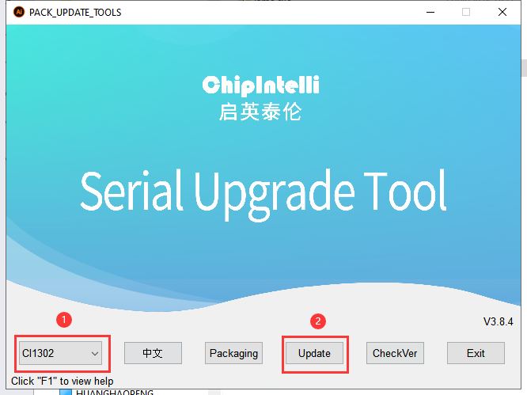

3. Click to select the firmware, then find [**04 WonderEcho Firmware Flash Tutorial/04 CI1302_En_SingleMic_V00729_UART1_115200_2M.bin**](https://drive.google.com/drive/folders/1X9PpUXagVvFnXmACI4NdAyx2eXafkurl?usp=sharing).

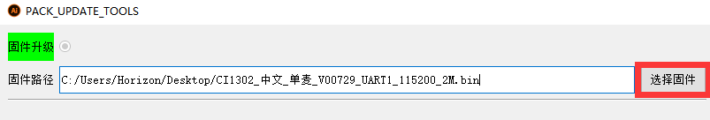

4. Find and select the corresponding serial port.

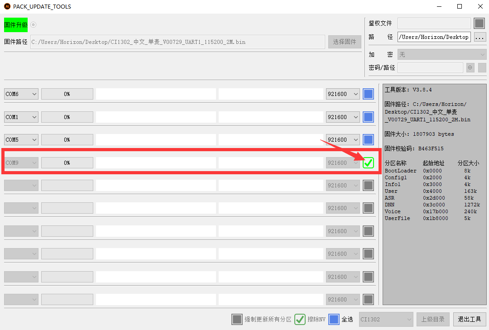

5. Press the RST button on the voice interaction module to start flashing. Wait until the process is complete.

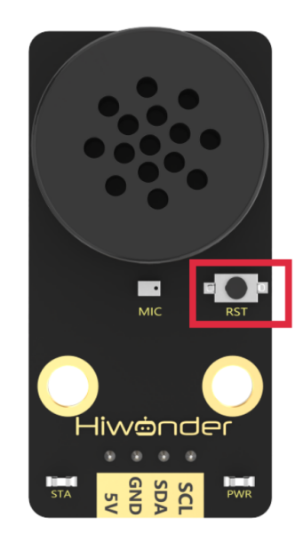


### 5.5.4 Ultrasonic Distance Alert 

#### 5.5.4.1 Feature Overview

This section uses the ultrasonic module to detect obstacles in front of the robot. When an obstacle is too close, the ultrasonic module and the voice interaction module provide a sound and light alert.

#### 5.5.4.2 Project Process

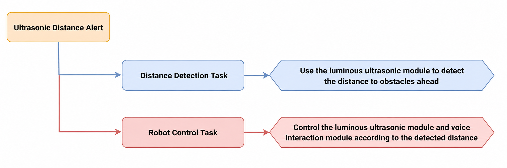

#### 5.5.4.3 Module Description

**WonderEcho Voice Interaction Module**


The integrated voice interaction module WonderEcho is built on the CI1302 chip for voice recognition and voice playback. It supports offline neural network acceleration and hardware acceleration for voice signal processing. The module uses deep noise reduction and neural network models to analyze voice input and generate recognition results.

Module wiring: as shown below, connect the module to any I2C Port highlighted in red on the servo controller before running this program.

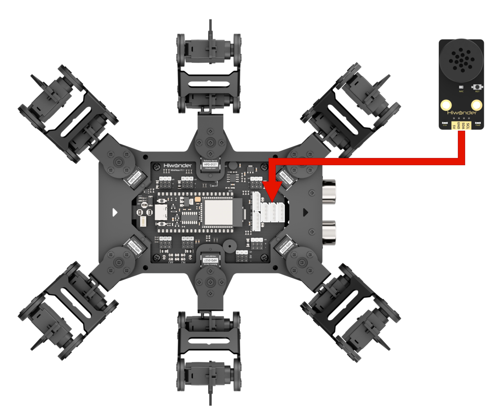

Installation: mount the voice interaction module on the rear panel of miniHexa.

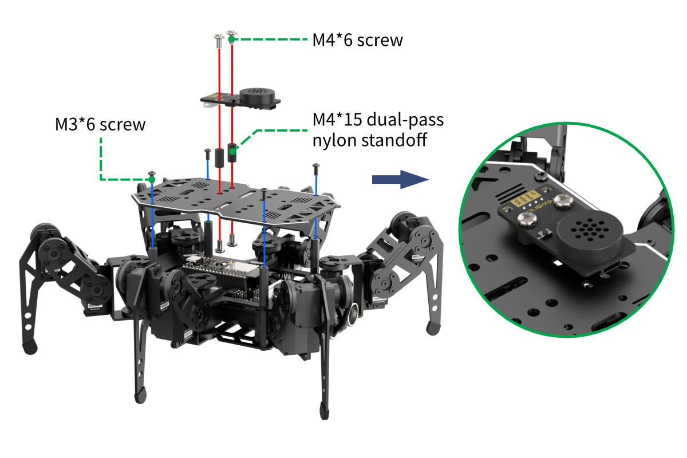

**Glowy Ultrasonic Module**


The module uses an I2C communication interface and can read the distance measured by the ultrasonic sensor through I2C communication. Two RGB LEDs are integrated at the ultrasonic probe position. The brightness can be adjusted. Color changes and color mixing across the red channel `R`, green channel `G`, and blue channel `B` make full-color lighting effects possible.

> [!NOTE]
>
> **The glowy ultrasonic module is already connected to the onboard I2C Port at the factory. No additional wiring is required.**

#### 5.5.4.4 Program Download

1. Connect miniHexa to a PC with a Type-C data cable.


2. Open [**02 Program Files/01 Voice Obstacle Alert Program/asr_ultrasound/asr_ultrasound.ino**](https://drive.google.com/drive/folders/1QHurTR63wHmusCcec2gOpJoHv3rYCXFP?usp=sharing).

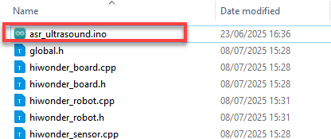

3. After the file opens, select the development board model shown below.


4. Click **Tools** in the menu bar, then select the ESP32 development board configuration shown below.


> [!NOTE]
>
> **Make sure the development board configuration is modified before downloading the program.**

5. Click **Compile**, then click **Upload**. When the following screen appears in the output box at the bottom of the software, the program download is complete.


#### 5.5.4.5 Project Outcome

When the glowy ultrasonic module detects no obstacle ahead or the obstacle is too far away, the module lights up green. When the obstacle is too close, the module lights up red and the voice interaction module plays back `Obstacle ahead`.

#### 5.5.4.6 Program Analysis

1. Import the `hiwonder_robot.h` library. This library contains definitions for sensors and interaction methods, as well as methods for interacting with the robot system.

```cpp
   #include "hiwonder_robot.h"
```

2. Create the robot object and the sensor object for later control.

```cpp
   Robot minihexa;
```

3. Create the distance variable `dis`, the system time variable `tickstart`, and the RGB light intensity arrays `rgb1` and `rgb2` for the two RGB LEDs on the glowy ultrasonic module.

```cpp
   uint16_t dis;
   uint8_t rgb1[3] = {0};
   uint8_t rgb2[3] = {0};
   uint32_t tickstart = 0;
```

4. In `setup()`, start serial communication and set the baud rate to `115200`, then initialize the robot and sensors.

```cpp
   void setup() {
     Serial.begin(115200);
     minihexa.begin();
   }
```

5. In `loop()`, first call the `get_distance()` function of the sensor object to obtain the distance to the obstacle detected by the glowy ultrasonic module. For easier debugging and observation, call `Serial.println()` to forward the obtained data through the serial port.

```cpp
   void loop() {
     dis = minihexa.sensor.get_distance();
     Serial.println(dis);
   }
```

6. Then evaluate the obtained distance value. If the distance is less than `100` mm, it is treated as `Obstacle too close`. Otherwise, it is treated as `No obstacle or obstacle too far away`. The two execution branches are highly similar. The following example uses the `Obstacle too close` branch.

Set `rgb1[0]`, which stores red light intensity for one RGB LED on the glowy ultrasonic module, to `255`. Set `rgb1[1]`, which stores green light intensity, and `rgb1[2]`, which stores blue light intensity, to `0`. Copy the same data to `rgb2`, the light intensity array for the other RGB LED.

Call the `set_ultrasound_rgb()` function of the sensor object to send the light intensity data to the glowy ultrasonic module, and set the module to mode `1`, which disables light gradient effects. The module then lights up red as an alert.

Call the `speak()` function of the voice interaction module subobject under the sensor object. The voice interaction module plays back entry ID `5` of the playback phrase type, `Obstacle ahead`.

> [!NOTE]
>
> **1. The `speak()` function is non-blocking. This function only sends an instruction to the voice interaction module and then exits.**
> **2. To prevent the loop from entering repeatedly within a short time when an obstacle is too close and calling `speak()` again before the previous playback finishes, protect the execution of this function. The internal `speak()` function can run only when the real-time system time obtained by `millis()` is at least `3000ms` greater than the system time `tickstart` recorded during the previous playback.**
> **3. The `speak()` function can also play back entries of the command word type. For example, `asr.speak(ASR_COMMAND, 1)` can play back the response phrase `Going straight` for command word type entry ID `1`.**

```cpp
if (dis < 100) {         // Breathing light mode, 0.1s cycle, red
    rgb1[0] = 255;
    rgb1[1] = 0;
    rgb1[2] = 0;
    memcpy(rgb2, rgb1, sizeof(rgb1));
    minihexa.sensor.set_ultrasound_rgb(1, rgb1, rgb2);
    if(millis() - tickstart > 3000) {
      minihexa.sensor.asr.speak(ASR_ANNOUNCER, 5);
      tickstart = millis();
    }
  }
```

### 5.5.5 Human-Robot Interaction

#### 5.5.5.1 Feature Overview

This section uses the voice interaction module to detect commands and respond with different actions.

#### 5.5.5.2 Project Process

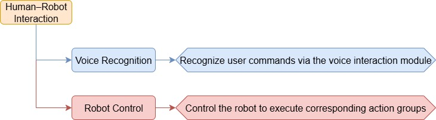

#### 5.5.5.3 Preparation

**Module Installation**


The integrated voice interaction module WonderEcho is built on the CI1302 chip for voice recognition and voice playback. It supports offline neural network acceleration and hardware acceleration for voice signal processing. The module uses deep noise reduction and neural network models to analyze voice input and generate recognition results.

Module wiring: as shown below, connect the module to any I2C Port highlighted in red on the servo controller before running this program.


Installation: mount the voice interaction module on the rear panel of miniHexa.


**Action Group Download**

> [!NOTE]
>
> **miniHexa is factory-flashed with the PC software program. Downloading other programs overwrites this function. To download the action groups again, follow the steps below to download the program again.**

1. Connect miniHexa to a PC with a Type-C data cable.


2. Open [**3. PC Control and Action Group Editing/03 PC Software Program Files/remote/remote.ino**](https://drive.google.com/drive/folders/1yruiHCUgS6uSqDsVWiONNdxExU9UQBUs?usp=sharing).

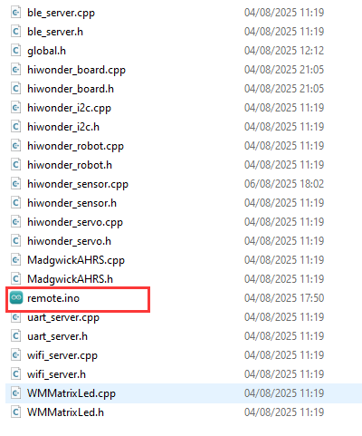

3. After the file opens, select the development board model shown below.


4. Click **Compile**, then click **Upload**. When the following screen appears in the output box at the bottom of the software, the program download is complete.


5. Follow the **Action Download** steps in [**1.Tutorials/3.PC Control and Action Edit Course/01 PC Control and Action Group Editing**](https://drive.google.com/drive/folders/15to4iNPD2X-BtU4Wow6rwxnLdTf-eUKn?usp=sharing) to download Action Group 14 and Action Group 7 to miniHexa.

#### 5.5.5.4 Program Download

1. Connect miniHexa to a PC with a Type-C data cable.


2. Open [**02 Program Files/02 Human-Robot Interaction Program/communicate/communicate.ino**](https://drive.google.com/drive/folders/1rHV6OUsUBaKduYSh08qMlNUMbubJXHnM?usp=sharing).

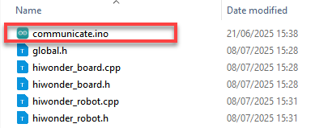

3. After the file opens, select the development board model shown below.


4. Click **Compile**, then click **Upload**. When the following screen appears in the output box at the bottom of the software, the program download is complete.


#### 5.5.5.5 Project Outcome

When a specified command word is recognized, the robot executes the corresponding action group as a response. The mapping between the command word and the action group is as follows:

|  **Spoken Command**  |            **Voice Module Response**             |    **Executed Action Group**     |
| :------------------: | :----------------------------------------------: | :------------------------------: |
|       `Hello`        |                       `Hi`                       |       Run Action Group 14        |
| `Introduce Yourself` | `Hello, I'm Hiwonder, and i can talk and dance.` | Run the acting-cute action group |
|    `Show a Skill`    |                 `Watch closely`                  |        Run Action Group 7        |

#### 5.5.5.6 Program Analysis

1. Import the `hiwonder_robot.h` library. This library contains definitions for sensors and interaction methods, as well as methods for interacting with the robot system.

```cpp
    #include "hiwonder_robot.h"
```

2. Create the robot object and the sensor object for later control.

```cpp
    Robot minihexa;
```

3. Create the command word ID recognition result variable `result`.

```cpp
    uint8_t result;
```

4. In `setup()`, start serial communication and set the baud rate to `115200`, then initialize the robot and sensors.

```cpp
    void setup() {
      Serial.begin(115200);
      minihexa.begin();
    }
```

5. In `loop()`, first call the `rec_recognition()` function of the voice recognition module subobject `asr` under the sensor object to obtain the current recognition result from the voice recognition module. If no command word is recognized, the result is `0`.

```cpp
    void loop() {
      result = minihexa.sensor.asr.rec_recognition();
      switch(result) {
        // Voice recognition result processing
      }
    }
```

6. Then call the `action_group_run()` function of the robot object according to the recognized command word ID to run different action groups.

```cpp
switch(result) {
  case 26:  /* "Hello" recognized */
    minihexa.action_group_run(14);
    break;

  case 27:  /* "Introduce Yourself" recognized */
    minihexa.acting_cute();
    break;

  case 28:  /* "Show a Skill" recognized */
    minihexa.action_group_run(7);
    break;
  
  default:
    break;
}
```

### 5.5.6 Voice Control

#### 5.5.6.1 Feature Overview

This section uses the voice interaction module to detect spoken commands and execute the corresponding movements.

#### 5.5.6.2 Project Process

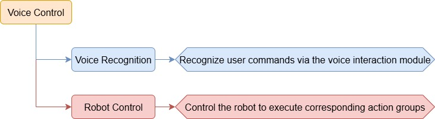

#### 5.5.6.3 Module Description

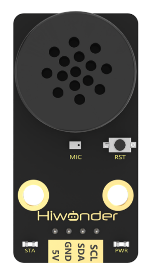

The integrated voice interaction module WonderEcho is built on the CI1302 chip for voice recognition and voice playback. It supports offline neural network acceleration and hardware acceleration for voice signal processing. The module uses deep noise reduction and neural network models to analyze voice input and generate recognition results.

Module wiring: as shown below, connect the module to any I2C Port highlighted in red on the servo controller before running this program.


Installation: mount the voice interaction module on the rear panel of miniHexa.


#### 5.5.6.4 Program Download

1. Connect miniHexa to a PC with a Type-C data cable.


2. Open [**02 Program Files/03 Voice Control Program/asr_control/asr_control.ino**](https://drive.google.com/drive/folders/1cWeepTjiwRxgZfidMR1TpqDMdHAvHSvr?usp=sharing).

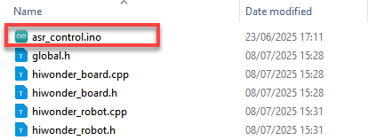

3. After the file opens, select the development board model shown below.


4. Click **Compile**, then click **Upload**. When the following screen appears in the output box at the bottom of the software, the program download is complete.


#### 5.5.6.5 Project Outcome

When a specified command word is recognized, the robot executes the corresponding movement as a response. The mapping between the command word and the movement is as follows:

| **Spoken Command** | **Voice Module Response** |             **Executed Movement**             |
| :----------------: | :-----------------------: | :-------------------------------------------: |
|   `Go straight`    |     `Going straight`      |           Move forward continuously           |
|   `Go backward`    |     `Going backward`      |          Move backward continuously           |
|    `Turn left`     |      `Turning left`       |     Rotate counterclockwise continuously      |
|    `Turn right`    |      `Turning right`      |         Rotate clockwise continuously         |
|       `Stop`       |        `Copy that`        |                  Stop moving                  |
|      `March`       |        `Copy that`        | Move forward two steps in the current heading |

#### 5.5.6.6 Program Analysis

1. Import the `hiwonder_robot.h` library. This library contains definitions for sensors and interaction methods, as well as methods for interacting with the robot system.

```cpp
#include "hiwonder_robot.h"
```

2. Create the robot object and the sensor object for later control.

```cpp
Robot minihexa;
```

3. Create the command word ID recognition result variable `result`. Create the robot movement speed, center of gravity position, and posture arrays `vel`, `pos`, and `att`.

```cpp
uint8_t result;

Velocity_t vel = {0.0f,0.0f,0.0f};
Vector_t pos = {0.0f,0.0f,0.0f};
Euler_t att = {0.0f,0.0f,0.0f};
```

4. In `setup()`, start serial communication and set the baud rate to `115200`, then initialize the robot and sensors.

```cpp
void setup() {
  Serial.begin(115200);
  minihexa.begin();
}
```

5. In the main loop `loop()`, first call the `rec_recognition()` function of the voice recognition module subobject `asr` under the sensor object to obtain the current recognition result from the voice recognition module. If no command word is recognized, the result is `0`.

```cpp
void loop() {
  result = minihexa.sensor.asr.rec_recognition();
  switch(result) {
    // Voice recognition result processing
  }
}
```

6. Then call the `move()` function of the robot object according to the recognized command word ID to execute different movements. The logic executed for each recognized command word is highly similar. The following uses several branches as examples. When the `Go straight` command word is recognized, ID `1`, write `2.0` to `vel[1]`, which stores the y-axis speed in the robot movement speed variable `vel`, and call the `move()` function. The robot then moves along the positive y-axis direction, which is the front of the robot.

```cpp
case 1:  /* Go straight */
  vel = {0.0f, 2.0f, 0.0f};
  minihexa.move(&vel, &pos, &att);
  break;
```

7. When the `Turn right` command word is recognized, ID `4`, write `-2.0` to `vel[2]`, which stores the speed around the z-axis in the robot movement speed variable `vel`, and call the `move()` function. The robot then rotates clockwise to turn right.

```cpp
case 4:  /* Turn right */
  vel = {0.0f, 0.0f, -2.0f};
  minihexa.move(&vel, &pos, &att);
  break;
```

8. When the `March` command word is recognized, ID `29`, write `2.0` to `vel[1]`, which stores the y-axis speed in the robot movement speed variable `vel`, and call the `move()` function. The motion time parameter `time` is set to `1000`, and the step count parameter `step_num` is set to `2`. The robot then moves forward two steps along the positive y-axis direction, which is the front of the robot.

```cpp
case 29:  /* March */
  vel = {0.0f, 2.0f, 0.0f};
  minihexa.move(&vel, &pos, &att, 1000, 2); 
  delay(2100);
  break;
```