## 5.1 Arduino IDE Installation and Deviation Calibration

[TOC]

### 5.1.1 Programming Tool Installation and Introduction

#### 5.1.1.1 Arduino IDE Installation and Interface Overview

Arduino IDE is a powerful software platform designed for Arduino microcontrollers. The installation process is the same for all versions. This section uses the Windows version of Arduino IDE 2.2.1 as an example.

1. Find [**02 ArduinoIDE Installation Package\ArduinoIDE.exe**](https://drive.google.com/drive/folders/1ee1KIROgF1P5Sb8J8OkE_Eipua4i2kV5?usp=sharing) in the same directory as this document, then double-click it to open the installer. To download the latest software version, visit the official Arduino website: [**<u>https://www.arduino.cc/en/software</u>**](https://www.arduino.cc/en/software).

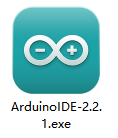

2. Click **I Agree** to start installation.

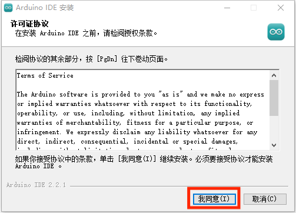

3. Keep the default selected options, then click **Next** to continue.

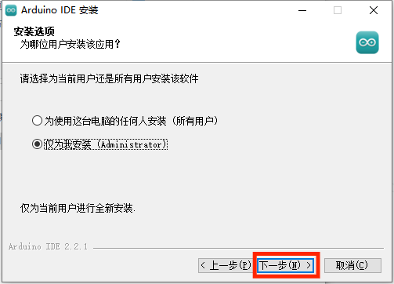

4. Click **Browse** to select the installation path, then click **Install** to start installation.

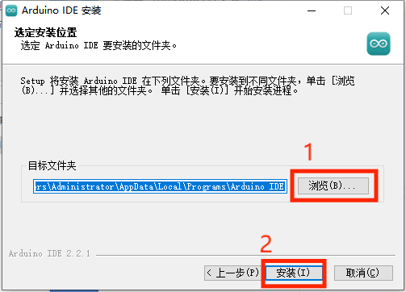

5. Wait for the software installation to complete.

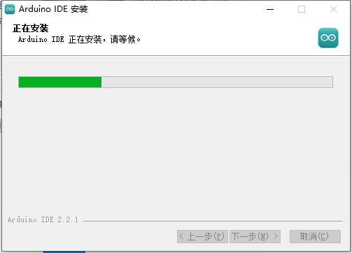

> [!NOTE]
>
> **If the installation prompts for chip driver installation, select "Always trust software from Arduino LLC (A)", then click "Install".**

6. After installation is complete, click **Finish**.

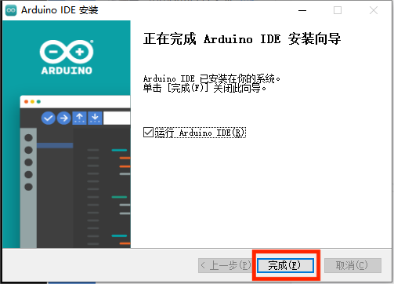

* **Interface Overview**

The main interface of Arduino IDE is shown below. It can be divided into five areas.

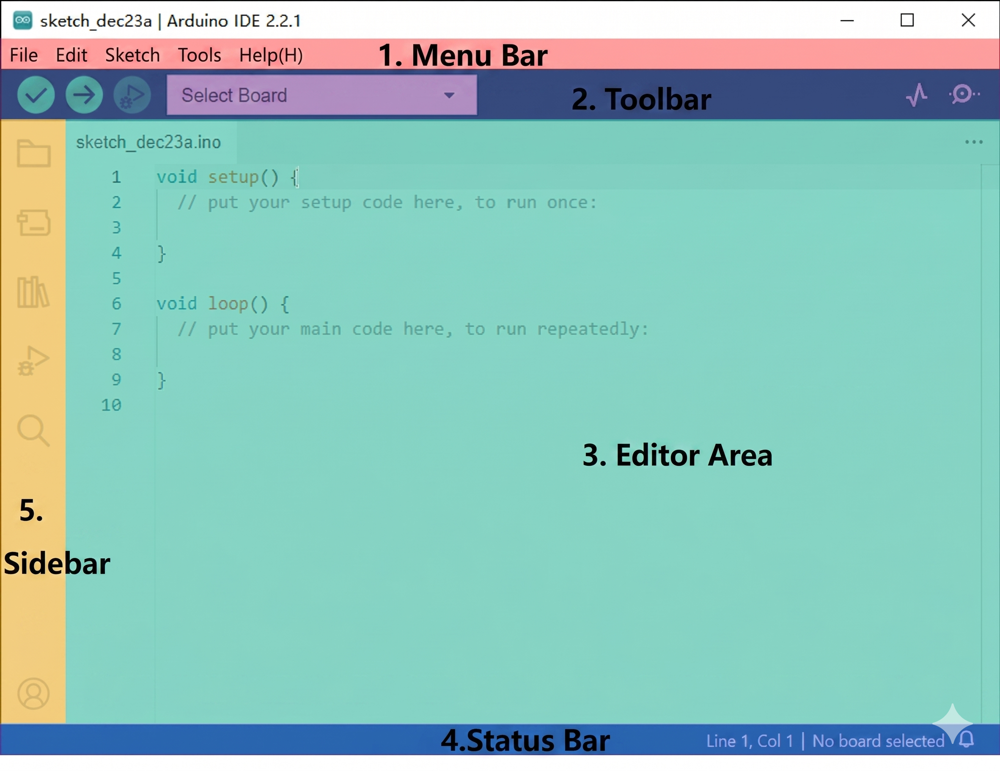

1. **Menu Bar**: Configures Arduino IDE settings.

| **Icon** | **Function** |
| ------------------------------------------------------------ | ---------------------------------------------------- |
| 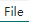 | Create or open project files, and configure interface preferences |
| 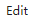 | Edit options for commenting, indenting, finding text, and other text editing tasks |
|  | Project options for project settings, compiling and running, and adding libraries |
|  | Tools options for selecting the development board and port, and viewing development board information |
|  | Help options for getting started and troubleshooting common issues |

2. **Toolbar**: Provides project tools, including program compilation, program download, and serial monitor.

| **Icon** | **Function** |
| ------------------------------------------------------------ | --------------------------------------------------- |
|  | Verify. Check whether a program is written correctly. If no errors are found, compile the project |
|  | Upload. Upload the program to the Arduino controller |
|  | Debug. Some development boards support real-time debugging through Arduino IDE |
|  | Select Board. Select different development boards for project development |
|  | Serial Plotter. Plot data printed to the Arduino serial port as a chart |
|  | Serial Monitor. Print serial port information |

3. **Editor Area**: Edits code.

4. **Status Bar**: Displays editor status, such as code line and column information and development board information.

5. **Sidebar**: The core area of Arduino IDE. It displays the workspace folder, code debugging tools, library installation tools, and other functions.

| **Icon** | **Function** |
| ------------------------------------------------------------ | -------------------------------- |
|  | Project folder. Displays files in the current project |
|  | Board Manager. Adds development board packages |
|  | Library Manager. Adds or removes program libraries |
|  | Debug. Performs real-time project debugging |
|  | Search. Searches or replaces code or variables |

#### 5.1.1.2 Arduino IDE Instructions

* **Arduino IDE Interface Settings**

1. To switch the interface to Chinese, select **File -> Preferences** in Arduino IDE. In the pop-up window, select the language as needed, then click **OK**.

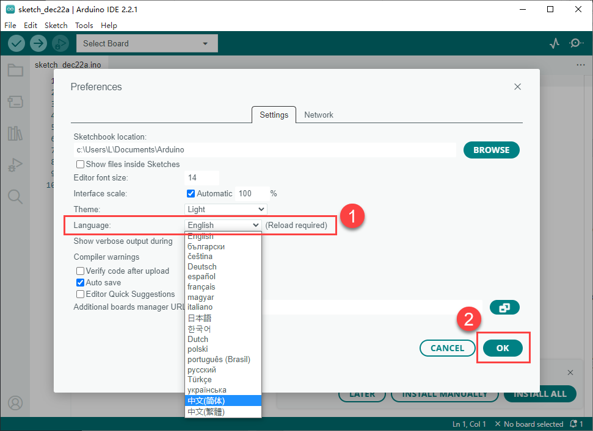

2. Select **File -> Preferences** to modify the project file path, editor font size, color theme, and other settings in the pop-up window.

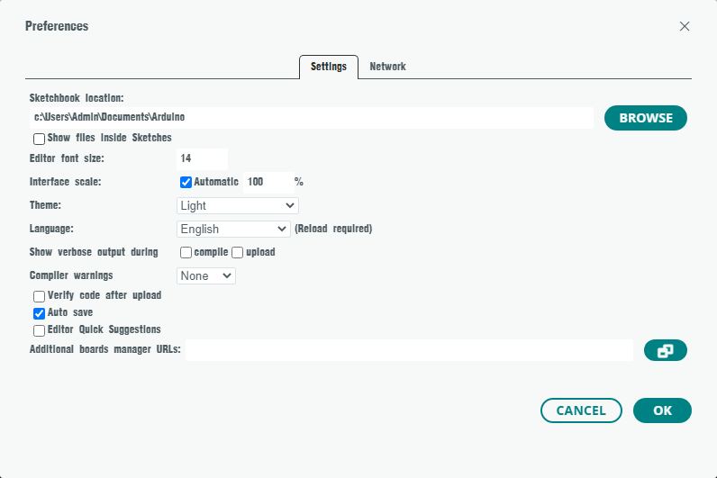

* **Arduino Program Download**

1. This section uses a sample program that prints `hiwonder` as an example. Double-click [**03 Demo\Demo.ino**](https://drive.google.com/drive/folders/1Z6aXv9RwrABSYsazCFOaSWRROnPHPqN_?usp=sharing) in the same directory as this document to open the sample program.

2. Connect the controller board to the PC with a data cable.

3. Find the corresponding development board in **Select Board**. This section uses **ESP32 Dev Module** as an example. The COM port is not fixed. Check Device Manager on the PC to view the COM number. This example uses **COM6**.

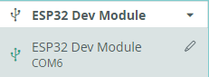

4. Click 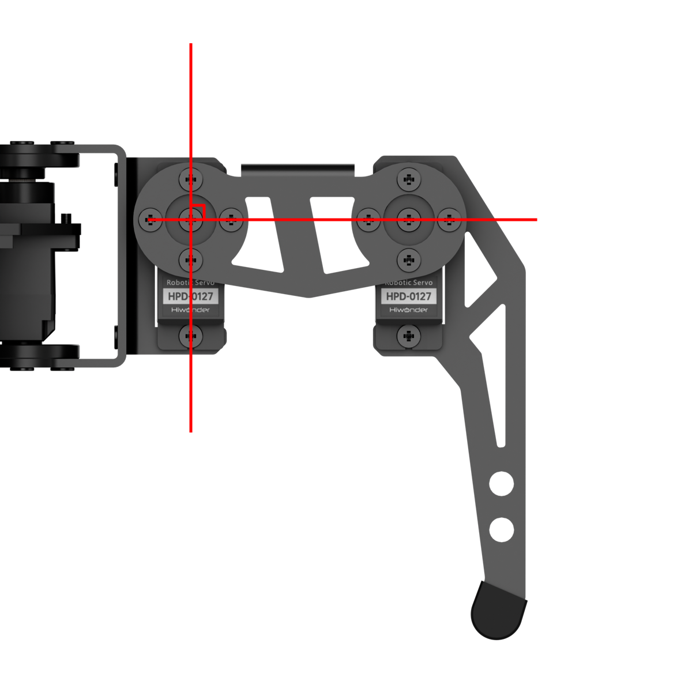 to compile the program and check whether syntax errors or other issues exist.

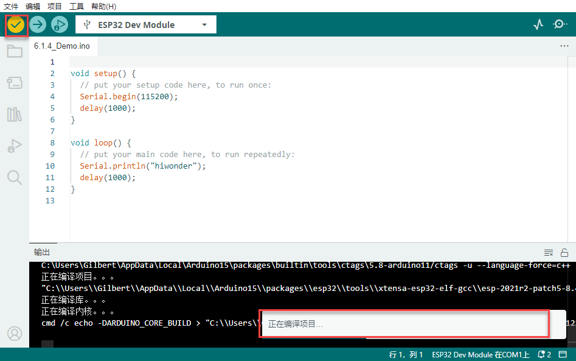

5. After compiling successfully, click  to upload the program to the ESP32 controller board.

6. After upload is complete, click 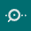 to open Serial Monitor. The text `hiwonder` is printed in Serial Monitor.

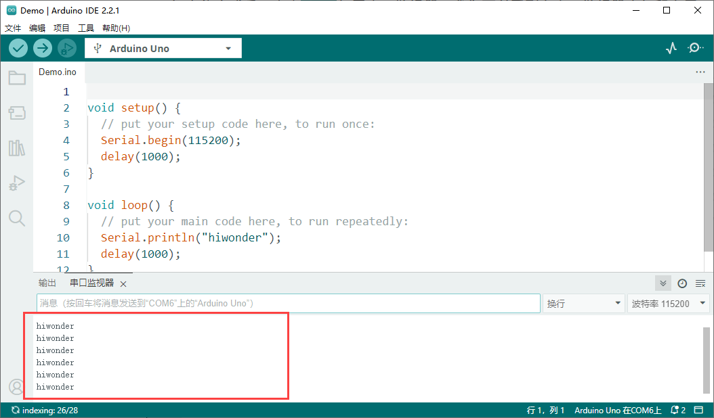

* **Library Import**

Import the required Kinematics and SensorLib libraries before running the program. Use the following method. The Kinematics library is used as an example.

1. In Arduino IDE, select **Sketch -> Include Library -> Add .ZIP Library**.

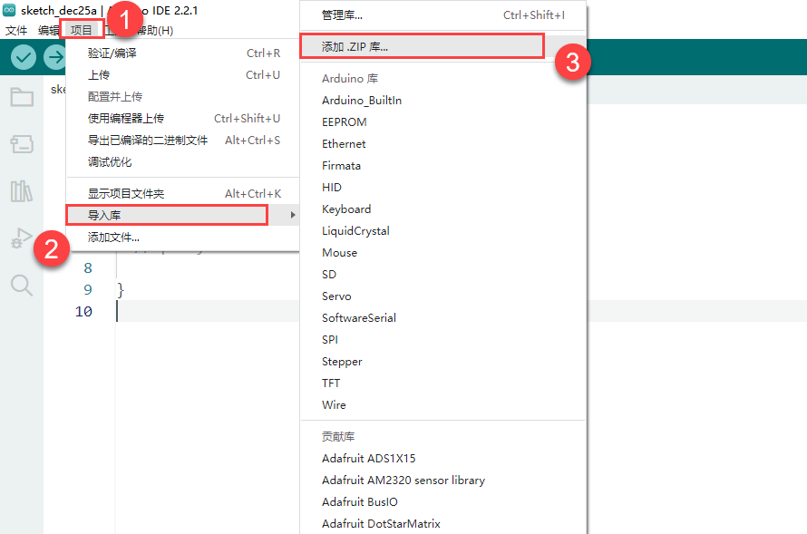

2. In the pop-up window, find [**02 ArduinoIDE Installation Package\kinematics.zip**](https://drive.google.com/drive/folders/1ee1KIROgF1P5Sb8J8OkE_Eipua4i2kV5?usp=sharing), then click **Open**.

3. If the following prompt appears, the library file has been installed.

### 5.1.2 Deviation Calibration

> [!NOTE]
>
> **If a new servo is installed or an original servo is removed, deviation calibration must be performed again.**
>
> **After long-term use, calibrated servos may develop deviations again due to external force. Adjust them again if needed. Perform deviation calibration based on the actual motion behavior of the robot.**

#### 5.1.2.1 Preparation

After miniHexa assembly is complete, perform deviation calibration to ensure that miniHexa can move properly in later tutorials. Before starting deviation calibration, make sure the following work is complete.

1. The deviation calibration program in [**04 Deviation Calibration Program Files**](https://drive.google.com/drive/folders/1hq2QDwmlLqv3EcMR9Z6F49bJ2o6qJZrs?usp=sharing) has been downloaded to miniHexa.

2. Open miniHexa PC software, then connect miniHexa to the PC with a data cable.

3. Open the corresponding calibration PC software, then switch to Action Edit mode.

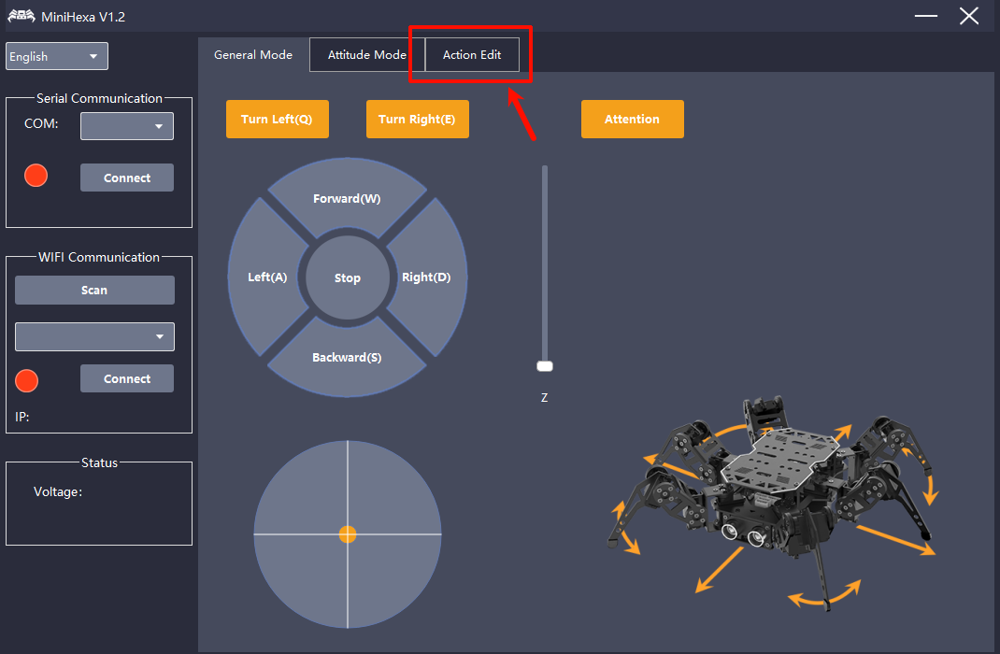

#### 5.1.2.2 Deviation Adjustment Standards

Click . All servos of the miniHexa legs rotate to position value `1500`. Check the legs according to the following standards.

1. After the servos return to the central position, the starting segment of the miniHexa legs should be perpendicular to the red line along the top cover edge.

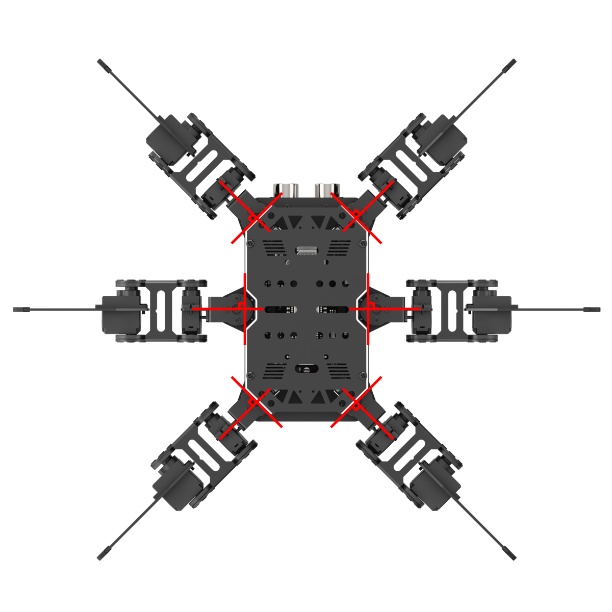

2. The horizontal axis of the middle-joint servo horn should be perpendicular to the longitudinal axis of its servo body. The horizontal axis of the end-joint servo horn should be perpendicular to the horizontal axis of the other servo horn body.

#### 5.1.2.3 Calibration Steps

After long-term use, calibrated servos may develop deviations again due to external force and need to be adjusted again. Follow the steps below to manually calibrate them with PC software. No. 10 servo is used as an example.

1. Click  to read the current servo deviation values.

2. In the miniHexa icon area above, select the slider below the corresponding servo icon. Drag the slider to adjust the servo position deviation value.

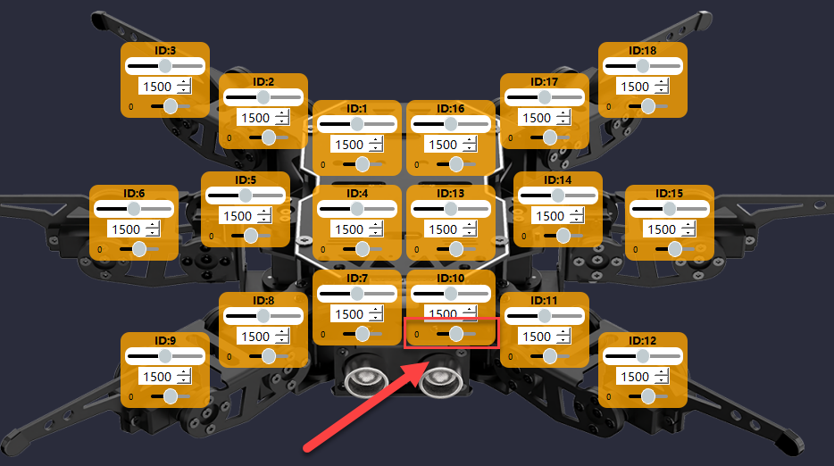

3. The figure above shows that the right leg of the robot shifts to the right. Move the deviation slider to the left to calibrate the corresponding deviation.

4. After one leg is calibrated, be sure to click **Save** to save the calibration values.

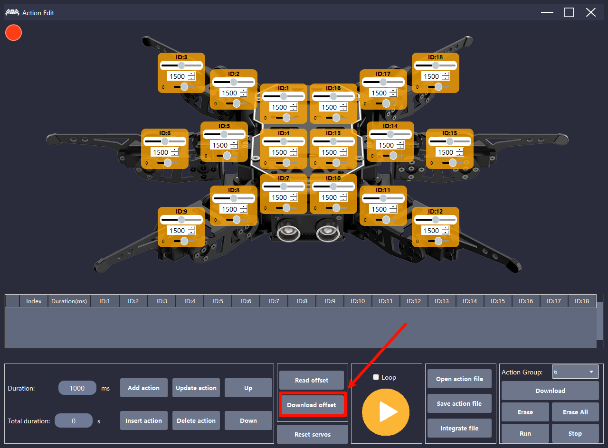

5. After all six legs are checked and calibrated, evaluate the calibration result according to the following standards. If one or more legs fail to meet the standards, calibrate those legs again.

1. Lightly touch a leg of the robot. The contact point of the leg should not show obvious deviation.

2. Slightly shake the robot body. The legs should remain at their original positions without obvious deviation.

3. Place the hexapod robot on the ground. The six legs should have no obvious height difference. Switch to **General Mode** or **Posture Control**, and miniHexa will stand automatically.
