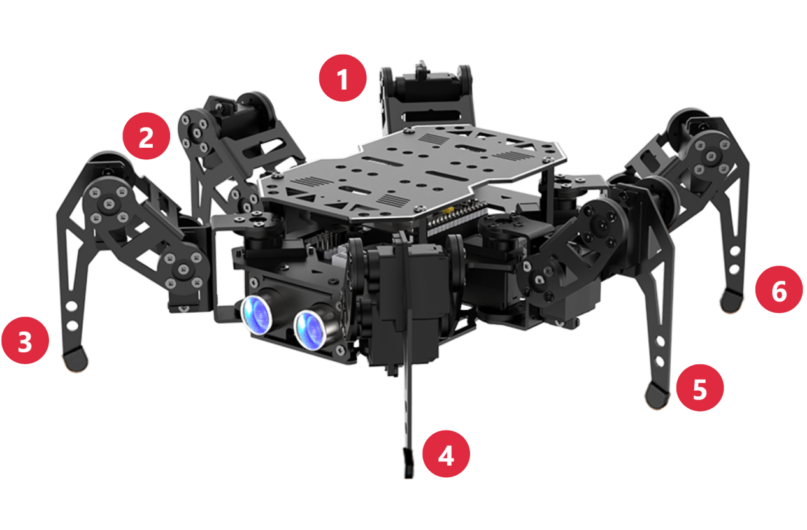
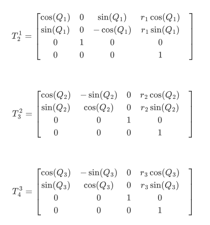
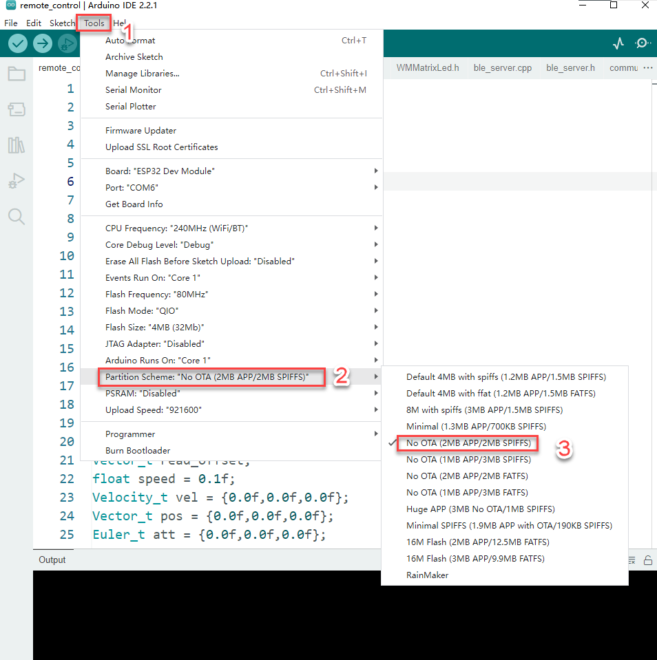

# 5. Kinematematics and Gait Course

## 5.1 Kinematics and Gait Overview

### 5.1.1 Coordinate System Introduction

(1) When controlling miniHexa's movement,the positions of the six legs' contact points can be used as inputs for inverse kinematics, which calculates the rotation angles for all servos to control miniHexa's motion.

(2) First, establish the coordinate system for miniHexa.The origin (0, 0, 0) is at the center of miniHexa's body. Viewed from the front of the robot, Y-axis positive points forward, X-axis positive points to the right, and Z-axis positive points upward. As shown in the figure below:


(3) When setting coordinates,Only the X, Y, and Z values of each of the six leg contact points need to be specified.

### 5.1.2 Gait Overview

(1) A gait is a cyclical pattern that describes how an animal walks.In simpler terms, it explains how an animal moves its legs while walking. Common gait patterns in hexapods include tripod and wave gaits. Under all circumstances, the system must ensure that at least three legs are in contact with the ground to maintain stability.

(2) The table below lists some commonly used terms related to gait description:

| **Term** | **Description** |
|:--:|:---|
| Phase | Can be understood as an angle or a position within a periodic motion. |
| Phase Difference | The lead or lag in movement between different legs. |
| Swing Phase | When a leg is lifted and in the air. |
| Stance Phase | When a leg is in contact with the ground. |
| Cycle | The full process from heel contact to the next heel contact on the same side during walking. |
| Gait Frequency | The number of gait cycles completed per unit of time. |
| Step Length | The distance the foot moves from lift-off to landing within one cycle. |
| Stride | The distance the body moves during one gait cycle. |
| Duty Ratio | The ratio of time a single leg spends in the stance phase relative to the gait cycle. |

### 5.1.3 Tripod Gait Overview

(1) The Tripod Gait is a classic walking pattern for hexapod robots

In six-legged insects, the legs do not move forward simultaneously. Instead, they are divided into two groups of three legs that alternate in a triangular support structure. Simply put, three legs swing while the other three support, then they switch.

(2) This triangular arrangement keeps the body in a statically stable position

(3) Most modern hexapod robots adopt a similar insect-inspired design

With six legs distributed along the sides of the body. The front and rear legs on the left side together with the middle leg on the right side form one group, while the front and rear legs on the right side together with the middle leg on the left side form another group. These two groups create two triangular supports. By swinging the thighs back and forth, the robot alternates between support and swing phases. This is the typical tripod gait walking method.

(4) When the hexapod robot moves in tripod gait,each pair of alternating legs works in turn. For clarity, let's number the robot's legs from its own perspective.



(5) For example, let's analyze the tripod gait using the diagram below


(6) As shown in the right figure, legs 2, 4, and 6 lift and swing forward, while legs 1, 3, and 5 support the body to keep the center of gravity on the diagonal intersection. At this stage, legs 2, 4, and 6 are in the swing phase, and legs 1, 3, and 5 are in the support phase.

(7) Afterward, all six legs touch the ground,legs 1, 3, and 5 remain in place, and legs 2, 4, and 6 move forward. At this point, all legs are in the support phase.

(8) As shown in the left figure,legs 1, 3, and 5 lift and swing forward, while legs 2, 4, and 6 support the body to maintain balance. At this stage, legs 1, 3, and 5 are in the swing phase, and legs 2, 4, and 6 are in the support phase.

(9) Then, all six legs touch the ground,legs 2, 4, and 6 remain in place, and legs 1, 3, and 5 move forward. At this point, all legs are in the support phase.

(10) By completing these four steps,the robot finishes one full tripod gait cycle.

### 5.1.4 Robot Motion Process Analysis

Let's take the motion of a single leg as an example to illustrate the robot's movement process, from the initial standby posture to the final return to standing after completing the motion. For clarity, let's assume the following scenario: the robot is standing still. After receiving a movement command, it starts moving straight forward.

* **Initial Stage**

(1) Before the robot receives the command, the leg we are observing, the middle one in the diagram, is touching the ground.


(2) Once the command is issued, the robot begins its overall movement. The observed leg lifts upward into the **initial posture**, as shown in the diagram below.


* **Motion Stage**

(1) During this stage, the leg always starts from the **initial posture**.


(2) Depending on the motion parameters, the leg swings either forward or backward. In our assumed scenario, the robot moves forward, so the leg first swings forward and downward until the endpoint touches the ground, as shown in the diagram.


(3) After the endpoint lands, the leg continues to swing backward, generating the force that pushes the robot forward, as shown in the diagram.


(4) Finally, the leg swings upward again, returning to its **initial posture**. This completes one full motion cycle of the leg. In the move function, which provides an interface for controlling body movement, you can specify the number of steps (`step_num`). Each step represents one complete cycle: starting from the **initial posture**, swinging, touching down, and returning to the **initial posture**.


* **Final Stage**

(1) After completing its final swing, the leg enters the final stage, starting the motion again from the **initial posture**.


(2) As shown in the figure below, when the leg moves downward and touches the ground, it completes the final action of the stage.


### 5.1.5 Kinematic Analysis of the Robot

Since the robot's overall motion involves the coupling of gait algorithms and inverse kinematics algorithms, the analysis can be rather complex. Therefore, in this section we take a single leg as an example. By doing so, we isolate the gait algorithm and focus directly on the kinematics analysis.

* **Single-Leg Structural Modeling**

(1) The diagram below illustrates the coordinate system modeling of the single-leg structure.


:::{Note}
* In the actual design, a terminal metal plate is mounted at joint O3 of the leg. Its width extends in the same direction as the link $`\mathbf{r}_{\mathbf{2}}`$. Hence, in the subsequent calculations, the width of this terminal plate is treated as the foot-end offset and considered as part of the link $`\mathbf{r}_{\mathbf{2}}`$.
* The D-H parameter table and the derivation of forward and inverse kinematics given below $`\mathbf{r}_{\mathbf{2}}`$ both already account for the foot-end offset.
:::

<table  class="docutils-nobg" border="1">
  <thead>
    <tr>
      <th colspan="5" style="text-align: center; font-weight: bold;">D-H Parameter Table</th>
    </tr>
    <tr>
      <th style="text-align: center;">i</th>
      <th style="text-align: center;">d</th>
      <th style="text-align: center;">theta</th>
      <th style="text-align: center;">r</th>
      <th style="text-align: center;">alpha</th>
    </tr>
  </thead>
  <tbody>
    <tr>
      <td style="text-align: center;">1</td>
      <td style="text-align: center;">0</td>
      <td style="text-align: center;">0</td>
      <td style="text-align: center;">2.85</td>
      <td style="text-align: center;">90</td>
    </tr>
    <tr>
      <td style="text-align: center;">2</td>
      <td style="text-align: center;">0</td>
      <td style="text-align: center;">0</td>
      <td style="text-align: center;">5.2</td>
      <td style="text-align: center;">0</td>
    </tr>
    <tr>
      <td style="text-align: center;">3</td>
      <td style="text-align: center;">0</td>
      <td style="text-align: center;">0</td>
      <td style="text-align: center;">7.2</td>
      <td style="text-align: center;">0</td>
    </tr>
    <tr>
      <td colspan="5" style="font-style: italic; padding: 10px; line-height: 1.5;">
        Explanation of the four D-H parameters:<br>
        (1) d: The displacement of coordinate system a(i+1) relative to a(i) along the Z(i) axis.<br>
        (2) theta: The rotation angle between the x-axes of coordinate systems a(i) and a(i+1).<br>
        (3) r: The mathematical length of the link.<br>
        (4) alpha: The rotation angle required to align Z(i−1) with Z(i+1) about X(i).
      </td>
    </tr>
  </tbody>
</table>

* **Introduction to Single-Leg Forward Kinematics**

(1) Forward kinematics is a fundamental concept for trajectory planning based on joint space and control in robotics. For a legged robot, forward kinematics refers to calculating the position of the foot endpoint from the rotation angles of the three servos on each leg.

(2) The process of forward kinematics can be summarized as follows: given the rotation angles of the servos on one leg, calculate the corresponding leg position, and then determine the 3D coordinates of the foot endpoint.

* **Derivation of Single-Leg Forward Kinematics**

:::{Note}

Known parameters: rotation angles of each servo (joint), including **Q1,Q2,Q3**.

Unknown parameters: D-H parameter table and the 3D coordinates of the foot endpoint, including **px, py,** and **pz**.

:::

(1) From these, the transformation matrices of each joint coordinate system can be derived.



(2) By multiplying the matrices sequentially, we obtain the overall transformation matrix $`T_{4}^{1}`$ from the base coordinate system to the foot endpoint coordinate system.


(3) Among them, $`px`$, $`py`$, and $`pz`$, the coordinates of the endpoint, which is the foot endpoint, can be expressed as:


(4) After simplification and generalization:


(5) This yields the forward kinematics expression that relates the servo rotation angles to the coordinates of the foot endpoint.

* **Single-Leg Inverse Kinematics Overview**

(1) The inverse kinematics of the robot is a fundamental basis for trajectory planning based on the foot endpoint and control. For the robot, inverse kinematics calculates the rotation angles of the three servos on each leg based on the coordinates of the foot endpoint.

(2) The solution procedure for inverse kinematics is as follows: given the coordinates of a leg's endpoint, calculate the positions of the leg segments, and then derive the corresponding servo rotation angles.

(3) Using these servo angles, the controller can compute the required values to drive the servos, thereby controlling the robot's movement.

* **Single-Leg Inverse Kinematics Derivation**

Known parameters: D-H parameter table and the 3D coordinates of the foot endpoint, including px, py, and pz.

Unknown parameters: rotation angles of each servo (joint), including Q1, Q2 and Q3.

(1) First, define a transformation matrix that includes the known foot endpoint coordinates. This matrix will be multiplied with other matrices, including $`Q_{1}`$, $`Q_{2}`$, and $`Q_{3}`$, containing unknown joint parameters to derive expressions for further calculation. As derived from the forward kinematics above, $`T_{4}^{1}`$ satisfies the description. Introduce it here, only focus on the first three elements of the fourth column, which are the known values.


(2) Based on the transformation matrix expressions:


(3) Derive expressions from both sides of the equations:


(4) By equating the first three elements of the fourth column from $`(T_{2}^{1})^{- 1} \cdot T`$ and $`T_{3}^{2} \cdot T_{4}^{3}`$ matrices, we can obtain three expressions:


(5) By further derivation of (1-3), we can solve Q1 in terms of px, py, and pz:


(6) By further examining (1-1) and (1-2), we can see that both equations contain the sine and cosine functions of Q2 and Q2+Q3. For the next step, we simplify these parts using the properties of $`\sin^{2}x + \cos^{2}x = 1`$. First, the non-trigonometric parts of $`Q_{2}`$ and $`Q_{2} + Q_{3}`$ are grouped into $`m_{1}`$ and $`m_{2}`$ to highlight the key elements. From the following expressions, it can be seen that $`\mathbf{Q}_{\mathbf{1}}`$, as derived earlier, is already known, so $`\mathbf{m}_{\mathbf{1}}`$ is a known value, and $`\mathbf{m}_{\mathbf{2}}`$ is a known value.


(7) After simplification, (1-1) and (1-2) can be rewritten as:

$`r_{3} \cdot \cos(Q_{2} + Q_{3}) = m_{1} - r_{2} \cdot \cos(Q_{2})`$（1-4）

$`r_{3} \cdot \sin(Q_{2} + Q_{3}) = m_{2} - r_{2} \cdot \sin(Q_{2})`$（1-5）

(8) Squaring both sides of (1-4) and (1-5) and summing them yields:

$`{r_{3}}^{2} = {r_{2}}^{2} - 2 \cdot \cos(Q_{2}) \cdot r_{2} \cdot m_{1} - 2 \cdot \sin(Q_{2}) \cdot r_{2} \cdot m_{2} + {m_{1}}^{2} + {m_{2}}^{2}`$（1-6）

(9) Next, the above parts of the expressions are further consolidated. From the following expressions, it can be seen that $`\mathbf{n}_{\mathbf{1}}`$, $`\mathbf{n}_{\mathbf{2}}`$, and $`\mathbf{n}_{\mathbf{3}}`$ are all known values.


(10) Further simplification of (1-6):


(11) Further derivation allows solving $`Q_{2}`$ in terms of the expressions $`px`$, $`py`$, and $`pz`$.


(12) By substituting the $`Q_{2}`$ expression back into (1-4) or (1-5), we can obtain the $`Q_{3}`$ expression, as shown below:


(13) Summarizing and organizing, the inverse kinematics expressions for the rotation angles of each servo (joint), $`Q_{1}`$, $`Q_{2}`$, and $`Q_{3}`$, are listed again as follows:


## 5.2 Omnidirectional Movement

### 5.2.1 Overview

This lesson focuses on controlling the robot to move in different directions.

### 5.2.2 Project Process


### 5.2.3 Program Download

[Source Code](../_static/source_code/Kinematematics_and_Gait_Course.zip)

(1) Connect miniHexa to your computer using a Type-C data cable.


(2) Open the program file located at the same path as this document: [Omnidirectional Movement Program->omnidirectional_movement-> omnidirectional_movement.ino](../_static/source_code/Kinematematics_and_Gait_Course.zip)


(3) Select the development board model when you open the program, and the specific model is shown in the figure below.


(4) In the menu bar, click **Tools**, and choose the corresponding ESP32 controller configuration as illustrated.


:::{Note}

Make sure to set the correct controller configuration before uploading the program.
:::

(5) Follow the sequence, first click the **Compile** button, then click the **Upload** button. Once the output window at the bottom of the software shows a success message, the program has been successfully uploaded.


### 5.2.4 Project Outcome

After powering on, miniHexa will sequentially move in the following 10 directions in a loop: forward, forward-right, right, backward-right, backward, backward-left, left, forward-left, rotate in place to the left, and rotate in place to the right.


### 5.2.5 Program Analysis

[Source Code](../_static/source_code/Kinematematics_and_Gait_Course.zip)

(1) The program imports the `hiwonder_robot.h` library, which contains the low-level control interfaces for the robot.

{lineno-start=1}
```c++
#include "hiwonder_robot.h"
```

(2) A `miniHexa` object is initialized, and a movement mode variable `count` is defined. Arrays for robot movement speed, center of gravity, and attitude are created: `vel`(velocity), `pos`(position), and `att`(euler).

{lineno-start=3}
```c++
//Initialize miniHexa object (初始化miniHexa对象)
Robot minihexa;

//Define variable count to record the action mode (定义变量count来记录动作的模式)
uint8_t count = 0;
//Initialize movement state (初始化运动状态)
Velocity_t vel = {0.0f,0.0f,0.0f};
Vector_t pos = {0.0f,0.0f,0.0f};
Euler_t att = {0.0f,0.0f,0.0f};
```

(3) In the `setup()` function, the serial communication baud rate is set to 115200, followed by initialization of the robot and sensors.

{lineno-start=13}
```c++
void setup() {
  Serial.begin(115200);
  minihexa.begin();
}
```

(4) In the main `loop()` function, the robot executes movements in 10 different directions in a cyclic manner according to the `count` variable. By modifying the three parameters in `vel`, the movement direction of the robot can be changed. The first parameter of `vel` controls the speed along the X-axis for left-right translation. The second parameter controls the speed along the Y-axis for forward-backward translation. The third parameter controls the rotational speed around the Z-axis for in-place left-right rotation. Passing `vel` into the `move` function causes the robot to move according to the specified parameters. After 5.5 seconds, the next set of movement parameters is passed into `move`, and the robot switches to the next movement state.

{lineno-start=18}
```c++
void loop() {
  switch(count) {
    case 0://Move forward (前进)
      count++;
      vel = {0.0f, 3.0f, 0.0f};
      break;
  
    case 1:// Move forward-right (右前进)
      count++;
      vel = {2.0f, 2.0f, 0.0f};
      break;

    case 2://Move right (右移)
      count++;
      vel = {3.0f, 0.0f, 0.0f};
      break;

    case 3://Move backward-right (右后退)
      count++;
      vel = {2.0f, -2.0f, 0.0f};
      break;

    case 4:// Move backward (后退)
      count++;
      vel = {0.0f, -3.0f, 0.0f};
      break;

    case 5:// Move backward-left (左后退)
      count++;
      vel = {-2.0f, -2.0f, 0.0f};
      break;

    case 6://Move left (左移动)
      count++;
      vel = {-3.0f, 0.0f, 0.0};
      break;

    case 7://Move forward-left (左前进)
      count++;
      vel = {-2.0f, 2.0f, 0.0f};;
      break;

    case 8://Rotate left in place (原地左转)
      count++;
      vel = {0.0f, 0.0f, 2.0f};
      break;

    case 9://Rotate right in place (原地右转)
      count = 0;
      vel = {0.0f, 0.0f, -2.0f};
      break;
  }
  delay(5500);
  minihexa.move(&vel, &pos, &att, 1800, 3);
}
```

(5) For example, in case 0, the movement direction is controlled by modifying the `vel` parameters. Setting the Y-axis speed to 3 moves the robot forward.

{lineno-start=20}
```c++
    case 0://Move forward (前进)
      count++;
      vel = {0.0f, 3.0f, 0.0f};
      break;
```

(6) In case 1, setting the X-axis speed to 2 moves the robot sideways to the right, and adding a Y-axis speed of 2 results in forward-right diagonal movement.

{lineno-start=25}
```c++
    case 1:// Move forward-right (右前进)
      count++;
      vel = {2.0f, 2.0f, 0.0f};
      break;
```

(7) In case 8, setting the Z-axis speed to 2.0f causes the robot to rotate in place to the left.

{lineno-start=60}
```c++
    case 8://Rotate left in place (原地左转)
      count++;
      vel = {0.0f, 0.0f, 2.0f};
      break;
```

## 5.3 Turn Left and Right

### 5.3.1 Overview

In this lesson, you will control the miniHexa to perform left and right turning movements.

### 5.3.2 Project Process


<p id="anchor_5_3_3"></p>

### 5.3.3 Program Download

[Source Code](../_static/source_code/Kinematematics_and_Gait_Course.zip)

(1) Connect miniHexa to your computer using a Type-C data cable.


(2) Open the program file located in the same folder as this document: [Turn Left and Right Program->Turn_left_and_right_movement-> Turn_left_and_right_movement.ino](../_static/source_code/Kinematematics_and_Gait_Course.zip)


(3) Select the development board model when you open the program, and the specific model is shown in the figure below.


(4) In the menu bar, click **Tools**, and choose the corresponding ESP32 controller configuration as illustrated.



:::{Note}
* Make sure to set the correct controller configuration before uploading the program.
:::

(5) Click **"Compile"** first, then click **"Upload"**. After the upload is completed, the program download is completed if the following interface appears in the output box below the software.


### 5.3.4 Project Outcome

After powering on, the hexapod robot will continuously perform left and right arc turns.


### 5.3.5 Program Analysis

[Source Code](../_static/source_code/Kinematematics_and_Gait_Course.zip)

(1) The program imports the `hiwonder_robot.h` library, which contains the methods for interacting with the robot system.

{lineno-start=1}
```c++
#include "hiwonder_robot.h"
```

(2) A `miniHexa` object is initialized, and a movement mode variable `count` is defined. Arrays for robot movement speed, center of gravity, and attitude are created: `vel`(velocity), `pos`(position), and `att`(euler).

{lineno-start=3}
```c++
//Initialize miniHexa object (初始化miniHexa对象)
Robot minihexa;

//Initialize motion state (初始化运动状态)
Velocity_t vel = {0.0f,0.0f,0.0f};
Vector_t pos = {0.0f,0.0f,0.0f};
Euler_t att = {0.0f,0.0f,0.0f};
```

(3) In the `setup()` function, the serial communication baud rate is set to 115200, followed by initialization of the robot.

{lineno-start=11}
```c++
void setup() {
  Serial.begin(115200);
  minihexa.begin();
}
```

(4) In the `loop()` main function, the robot executes left and right turning movements in a loop by modifying the `vel` array. First to make a left arc turn, set the Y-axis velocity in `vel` to 5 for forward translation, and the Z-axis velocity to 0.2 for left rotation. The combination of these two motions results in the robot turning left.

{lineno-start=16}
```c++
void loop() {
    vel = {0.0f, 5.0f, 0.2f};// Arc-shaped forward left (弧形左前进)
    minihexa.move(&vel, &pos, &att);//Execute movement (执行移动)
    delay(5000);

```

(5) To make a right arc turn, set Y-axis velocity to 5 and Z-axis velocity to -0.2 to turn the robot right.

{lineno-start=21}
```c++
    vel = {0.0f, 5.0f, -0.2f};//Arc-shaped forward right (弧形右前进)
    minihexa.move(&vel, &pos, &att);//Execute movement (执行移动)
    delay(5000);
}

```

### 5.3.6 Feature Extensions

You can modify the turning angle of miniHexa by adjusting its rotation parameter. Follow the steps below:

(1) Locate the turning code in the main function.

{lineno-start=16}
```c++
void loop() {
    vel = {0.0f, 5.0f, 0.2f};// Arc-shaped forward left (弧形左前进)
    minihexa.move(&vel, &pos, &att);//Execute movement (执行移动)
    delay(5000);

    vel = {0.0f, 5.0f, -0.2f};//Arc-shaped forward right (弧形右前进)
    minihexa.move(&vel, &pos, &att);//Execute movement (执行移动)
    delay(5000);
}
```

(2) Modify the third element omega in the `vel` array. For example, change it to 0.3f to increase the turning angle.

:::{Note}
Do not set the omega value too high, as excessive rotation will dominate over forward motion, causing the robot to spin almost in place.
:::

{lineno-start=16}

```c++
void loop() {
    vel = {0.0f, 5.0f, 0.3f};// Arc-shaped forward left (弧形左前进)
    minihexa.move(&vel, &pos, &att);//Execute movement (执行移动)
    delay(5000);

    vel = {0.0f, 5.0f, -0.3f};//Arc-shaped forward right (弧形右前进)
    minihexa.move(&vel, &pos, &att);//Execute movement (执行移动)
    delay(5000);
}
```

(3) After modification, refer to [5.3.3 Program Download](#anchor_5_3_3) in this document to run the updated program.

## 5.4 Speed Adjustment

### 5.4.1 Overview

This lesson demonstrates controlling miniHexa to move at different speeds.

### 5.4.2 Project Process


### 5.4.3 Program Download

[Source Code](../_static/source_code/Kinematematics_and_Gait_Course.zip)

(1) Connect miniHexa to your computer using a Type-C data cable.


(2) Open the program file located in the same directory as this document: [Speed Adjustment Program->velocity_adjust->Velocity_adjust.ino](../_static/source_code/Kinematematics_and_Gait_Course.zip)


(3) Select the development board model when you open the program, and the specific model is shown in the figure below.


(4) In the menu bar, click **Tools**, and choose the corresponding ESP32 controller configuration as illustrated.


:::{Note}

Make sure to set the correct controller configuration before uploading the program.
:::

(5) Click **"Compile"** first, then click **"Upload"**. After the upload is completed, the program download is completed if the following interface appears in the output box below the software.


### 5.4.4 Project Outcome

After powering on, the robot will repeatedly perform in-place left turns at increasing speeds. The speed gradually increases from slow to fast, with each increment being 0.5, up to a speed of 2.0, then resets back to 0.5, repeating the cycle.


### 5.4.5 Program Brief Analysis

[Source Code](../_static/source_code/Kinematematics_and_Gait_Course.zip)

(1) The program imports the `hiwonder_robot.h` library, which contains the methods for interacting with the robot system.

{lineno-start=1}
```c++
#include "hiwonder_robot.h"
```

(2) Initialize the `miniHexa` object and define the variable `count`. Arrays for robot movement speed, center of gravity, and attitude are created: `vel`(velocity), `pos`(position), and `att`(euler).

{lineno-start=3}
```c++
Robot minihexa;

uint8_t count = 0;
//Initialize body motion (初始化机体运动)
Velocity_t vel = {0.0f,0.0f,0.0f};
Vector_t pos = {0.0f,0.0f,0.0f};
Euler_t att = {0.0f,0.0f,0.0f};
```

(3) In the `setup()` function, the serial communication baud rate is set to 115200, followed by initialization of the robot.

{lineno-start=11}
```c++
void setup() {
  Serial.begin(115200);
  minihexa.begin();
}
```

(4) In the `loop()` function, the robot repeatedly performs movements at four different speeds according to the looping value of `count`.

{lineno-start=16}
```c++
void loop() {
  switch(count) {
    case 0://In-place left turn at the slowest speed (原地左转最慢速度)
      count++;
      vel = {0.0f, 0.0f, 1.0f};
      delay(5000);
      break;
  
    case 1://In-place left turn at a slower speed (原地左转较慢速度)
      count++;
      vel = {0.0f, 0.0f, 1.5f};
      delay(5000);
      break;

    case 2://In-place left turn at medium speed (原地左转中速)
      count++;
      vel = {0.0f, 0.0f, 2.0f};
      delay(5000);
      break;

    case 3://In-place left turn at high speed (原地左转高速)
      count = 0;
      vel = {0.0f, 0.0f, 2.5f};
      delay(5000);
      break;
  }

  minihexa.move(&vel, &pos, &att);//Execute motion (执行运动)
}
```

(5) Within the switch statement, the robot's movement speed is switched by modifying the `count` variable and the `vel` array.

{lineno-start=18}
```c++
    case 0://In-place left turn at the slowest speed (原地左转最慢速度)
      count++;
      vel = {0.0f, 0.0f, 1.0f};
      delay(5000);
      break;
  
    case 1://In-place left turn at a slower speed (原地左转较慢速度)
      count++;
      vel = {0.0f, 0.0f, 1.5f};
      delay(5000);
      break;

    case 2://In-place left turn at medium speed (原地左转中速)
      count++;
      vel = {0.0f, 0.0f, 2.0f};
      delay(5000);
      break;

    case 3://In-place left turn at high speed (原地左转高速)
      count = 0;
      vel = {0.0f, 0.0f, 2.5f};
      delay(5000);
      break;
```

## 5.5 Gait Parameter Adjustment

### 5.5.1 Overview

In this lesson, miniHexa's gait parameters are modified to enable the robot to move in different postures.

### 5.5.2 Project Process


### 5.5.3 Program Download

[Source Code](../_static/source_code/Kinematematics_and_Gait_Course.zip)

(1) Connect miniHexa to your computer using a Type-C data cable.


(2) Open the program file located in the same directory as this document: [Gait Parameter AdjustmentProgram->gait_parameter_adjust-> gait_parameter_adjust.ino](../_static/source_code/Kinematematics_and_Gait_Course.zip)


(3) Select the development board model when you open the program, and the specific model is shown in the figure below.


(4) In the menu bar, click **Tools**, and choose the corresponding ESP32 controller configuration as illustrated.


:::{Note}

Make sure to set the correct controller configuration before uploading the program.
:::

(5) Click **"Compile"** first, then click **"Upload"**. After the upload is completed, the program download is completed if the following interface appears in the output box below the software.


### 5.5.4 Project Outcome

After powering on, the robot will sequentially perform movements using six different gait patterns.


### 5.5.5 Program Analysis

[Source Code](../_static/source_code/Kinematematics_and_Gait_Course.zip)

(1) The program imports the `hiwonder_robot.h` library, which contains the methods for interacting with the robot system.

{lineno-start=1}
```c++
#include "hiwonder_robot.h"
```

(2) Initialize the `miniHexa` object and define the variable `count`. The program defines the number of iterations for the gait discretization process (`step_num`), the action execution time (`move_time`), and creates arrays including `vel`(velocity), `pos`(position), and `att`(euler).

{lineno-start=2}
```c++
//Initialize miniHexa object (初始化miniHexa对象)
Robot minihexa;

//Define motion mode variable count (定义运动模式变量count)
uint8_t count = 0;
//Number of iterations in the discretization process (number of footfalls) (离散化过程的迭代次数（落脚次数）)
int step_num = -1;
//Initialize motion duration (初始化运动时间)
uint32_t move_time = 1000;
// Leg lift height (抬腿高度)
float leg_lift = 2.0f;
//Initialize robot motion (初始化机体运动)
Velocity_t vel = {0.0f,0.0f,0.0f};
Vector_t pos = {0.0f,0.0f,0.0f};
Euler_t att = {0.0f,0.0f,0.0f};
```

(3) In the `setup()` function, the serial communication baud rate is set to 115200, followed by initialization of the robot.

{lineno-start=18}
```c++
void setup() {
  Serial.begin(115200);
  minihexa.begin();
}
```

(4) In the `loop()` function, the robot cycles through six different gait modes according to the value of `count`.

{lineno-start=23}
```c++
void loop() {
  switch(count) {
    case 0:
      count++;
      vel = {0.0f, 2.0f, 0.0f};//Forward (前进)
      move_time = 600;//Define runtime (定义运行时间)
      step_num = 3;
      break;
  
    case 1:
      count++;
      vel = {0.0f, 2.0f, 0.0f};
      move_time = 1000;
      step_num = 2;
      break;

    case 2:
      count++;
      vel = {0.0f, -2.0f, 0.0f};
      move_time = 600;
      step_num = 3;
      break;

    case 3:
      count++;
      vel = {0.0f, -2.0f, 0.0f};
      move_time = 1000;
      step_num = 2;
      break;

    case 4:
      count++;
      vel = {0.0f, 0.0f, 2.0f};
      move_time = 600;
      step_num = 2;
      break;

    case 5:
      vel = {0.0f, 0.0f, -2.0f};
      move_time = 1000;
      step_num = -1;
      break;
  }

  minihexa.move(&vel, &pos, &att, move_time, step_num);
  delay(4000);
}
```

(5) The parameters that affect the gait are `move_time`, the duration of the movement, and `step_num`, the number of steps taken. By adjusting these parameters, you can change the robot's gait. In the case 0 branch, the robot's Y-axis of `vel` is set to 2.0. The execution time is set to 600 ms, and the number of steps is 3. The robot will therefore move forward along the positive Y-axis at a velocity of 2.0, taking 3 steps over 600 ms.

{lineno-start=23}
```c++
void loop() {
  switch(count) {
    case 0:
      count++;
      vel = {0.0f, 2.0f, 0.0f};//Forward (前进)
      move_time = 600;//Define runtime (定义运行时间)
      step_num = 3;
      break;
  
    case 1:
      count++;
      vel = {0.0f, 2.0f, 0.0f};
      move_time = 1000;
      step_num = 2;
      break;
```

(6) In the case 5 branch, the robot's Y-axis of `vel` is set to -2.0. The execution time is set to 1000 ms, and the number of steps is -1, indicating continuous movement. In this case, the robot will move backward along the negative Y-axis at a velocity of 2.0, continuously for 1000 ms.

{lineno-start=60}
```c++
    case 5:
      vel = {0.0f, 0.0f, -2.0f};
      move_time = 1000;
      step_num = -1;
      break;
```

## 5.6 Posture Adjustment

### 5.6.1 Overview

In this lesson, you will modify posture parameters to change the motion posture of the robot.

### 5.6.2 Project Process


### 5.6.3 Program Download

[Source Code](../_static/source_code/Kinematematics_and_Gait_Course.zip)

(1) Connect miniHexa to your computer using a Type-C data cable.


(2) Open the program file located in the same directory as this document: [Posture Adjustment Program\pose_adjust\pose_adjust.ino](../_static/source_code/Kinematematics_and_Gait_Course.zip)


(3) Select the development board model when you open the program, and the specific model is shown in the figure below.


(4) In the menu bar, click **Tools**, and choose the corresponding ESP32 controller configuration as illustrated.


:::{Note}
Make sure to set the correct controller configuration before uploading the program.
:::

(5) Click **"Compile"** first, then click **"Upload"**. After the upload is completed, the program download is completed if the following interface appears in the output box below the software.


### 5.6.4 Project Outcome

After powering on, the miniHexa will continuously cycle through 12 different postures.


### 5.6.5 Program Analysis

[Source Code](../_static/source_code/Kinematematics_and_Gait_Course.zip)

(1) The program imports the `hiwonder_robot.h` library, which contains the methods for interacting with the robot system.

{lineno-start=1}

```cpp
#include "hiwonder_robot.h"
```

(2) Initialize the miniHexa object. Define the variable `count`, and create arrays for robot motion speed, center of gravity position, and posture: `vel`(velocity), `pos`(position), and `att`(euler).

{lineno-start=3}

```cpp
Robot minihexa;

uint8_t count = 0;
Velocity_t vel = {0.0f,0.0f,0.0f};
Vector_t pos = {0.0f,0.0f,0.0f};
Euler_t att = {0.0f,0.0f,0.0f};
```

(3) Setup Function

In the `setup()` function, the serial communication baud rate is set to 115200, followed by initialization of the robot.

{lineno-start=10}

```cpp
void setup() {
  Serial.begin(115200);
  minihexa.begin();
}
```

(4) Loop Function

In the `loop()` function, the program cycles through 12 different posture motions according to the value of `count`.

{lineno-start=15}

```cpp
void loop() {
  switch(count) {
    case 0:
      count++;
      pos = {3.0f, 0.0f, 0.0f};
      att = {0.0f, 0.0f, 0.0f};
      delay(1000);
      break;
  
    case 1:
      count++;
      pos = {0.0f, 3.0f, 0.0f};
      delay(1000);
      break;

    case 2:
      count++;
      pos = {-3.0f, 0.0f, 0.0f};
      delay(1000);
      break;

    case 3:
      count++;
      pos = {0.0f, -3.0f, 0.0f};
      delay(1000);
      break;

    case 4:
      count++;
      pos = {0.0f, 0.0f, 3.0f};
      delay(1000);
      break;

    case 5:
      count++;
      pos = {0.0f, -2.0f, -1.0f};
      delay(1000);
      break;

    case 6:
      count++;
      att = {8.0f, 0.0f, 0.0f};
      pos = {0.0f, 0.0f, 0.0f};
      delay(1000);
      break;

    case 7:
      count++;
      att = {-8.0f, 0.0f, 0.0};
      delay(1000);
      break;

    case 8:
      count++;
      att = {0.0f, 12.0f, 0.0f};
      delay(1000);
      break;

    case 9:
      count++;
      att = {0.0f, -12.0f, 0.0f};
      delay(1000);
      break;

    case 10:
      count++;
      att = {0.0f, 0.0f, 12.0f};
      delay(1000);
      break;
  
    case 11:
      count = 0;
      att = {0.0f, 0.0f, -12.0f};
      delay(1000);
      break;
  }

  minihexa.move(&vel, &pos, &att, 600);
}
```

(5) The miniHexa's posture adjustments along the X, Y, and Z axes are controlled by three parameters in the center of gravity position array `POS`. The first parameter represents the X-axis position of the center of gravity, which controls lateral movement. The second parameter represents the Y-axis position of the center of gravity, which controls forward and backward movement. The third parameter represents the Z-axis position of the center of gravity, which controls the height of the body. By modifying these X, Y, and Z parameters, the robot's body posture can be changed.

{lineno-start=16}
```cpp
  switch(count) {
    case 0:
      count++;
      pos = {3.0f, 0.0f, 0.0f};
      att = {0.0f, 0.0f, 0.0f};
      delay(1000);
      break;
  
    case 1:
      count++;
      pos = {0.0f, 3.0f, 0.0f};
      delay(1000);
      break;

    case 2:
      count++;
      pos = {-3.0f, 0.0f, 0.0f};
      delay(1000);
      break;

    case 3:
      count++;
      pos = {0.0f, -3.0f, 0.0f};
      delay(1000);
      break;

    case 4:
      count++;
      pos = {0.0f, 0.0f, 3.0f};
      delay(1000);
      break;

    case 5:
      count++;
      pos = {0.0f, -2.0f, -1.0f};
      delay(1000);
      break;
```

(6) miniHexa's posture adjustments along the X, Y, and Z axes are controlled by the three parameters in the attitude array `att`. The first parameter defines the Euler angle of rotation around the X-axis, also known as the pitch angle. The second parameter defines the Euler angle of rotation around the Y-axis, also known as the roll angle. The third parameter defines the Euler angle of rotation around the Z-axis, also known as the yaw angle. The degree of posture tilt mainly depends on the values of these three parameters. By modifying the values corresponding to the X, Y, and Z axes, the robot's posture can be adjusted accordingly.

{lineno-start=54}

```cpp
    case 6:
      count++;
      att = {8.0f, 0.0f, 0.0f};
      pos = {0.0f, 0.0f, 0.0f};
      delay(1000);
      break;

    case 7:
      count++;
      att = {-8.0f, 0.0f, 0.0};
      delay(1000);
      break;

    case 8:
      count++;
      att = {0.0f, 12.0f, 0.0f};
      delay(1000);
      break;

    case 9:
      count++;
      att = {0.0f, -12.0f, 0.0f};
      delay(1000);
      break;

    case 10:
      count++;
      att = {0.0f, 0.0f, 12.0f};
      delay(1000);
      break;
  
    case 11:
      count = 0;
      att = {0.0f, 0.0f, -12.0f};
      delay(1000);
      break;
```