## 6.1 MicroPython Development Environment Setup and Configuration

[TOC]

### 6.1.1 Programming Tool Installation and Overview

#### 6.1.1.1 Firmware Flashing

> [!NOTE]
>
> **Before flashing the firmware, make sure to save the servo deviation values according to [Read the Deviation Values in the PC Software](#anther6.1.2.1).**

1. Download [**2. Software/5.ESP32S3 Firmware Flashing Tool/flash_download_tool_3.9.7_1**](https://drive.google.com/drive/folders/1rbPG3zhbXIqjQKnRd51mkg0iL94MHgjL?usp=sharing). Then double-click `flash_download_tool_3.9.7.exe` to open the flash tool.

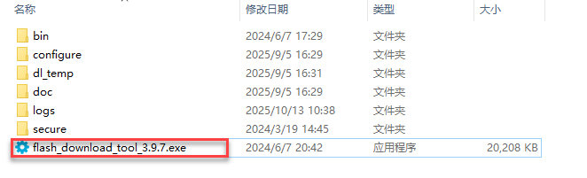

2. Select **ESP32** for ChipType and **Develop** for WorkMode.

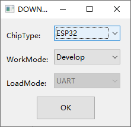

3. Power on miniHexa and connect it to the PC.

4. Select [**2. Software/8.miniHexa Factory Firmware/MicroPython & Scratch Firmware/minihexa_20250929_0x000.bin**](https://drive.google.com/drive/folders/1Lc49i8d9m1sI6gzmsgEuQdy1uPvO0Stg?usp=sharing) and set the address to `0x0000`. Select the correct serial port and baud rate. Click **ERASE** first, then click **START** to begin flashing. Wait until the process is complete.

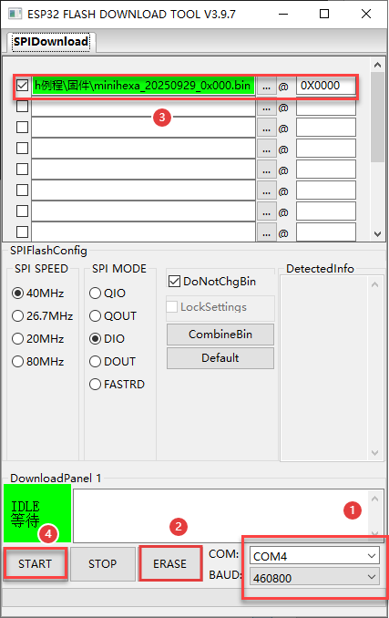

5. After flashing is complete, restart the robot to return it to the initial position. Then follow [6.1.2 Deviation Calibration](#anther6.1.2) to write the deviation values.

#### 6.1.1.2 Python Editor Overview and Usage

This section explains how to connect the [Hiwonder Python Editor](https://drive.google.com/drive/folders/1f9hSVelLa2x4sF1miJddl4e2izL7kGYJ?usp=sharing) and use its main features. The software allows switching the language to English.

> [!NOTE]
>
> **If the editor cannot be opened, rename the editor folder to an English-only name such as `Hiwonder`.**

The editor interface is divided into five areas as shown below:

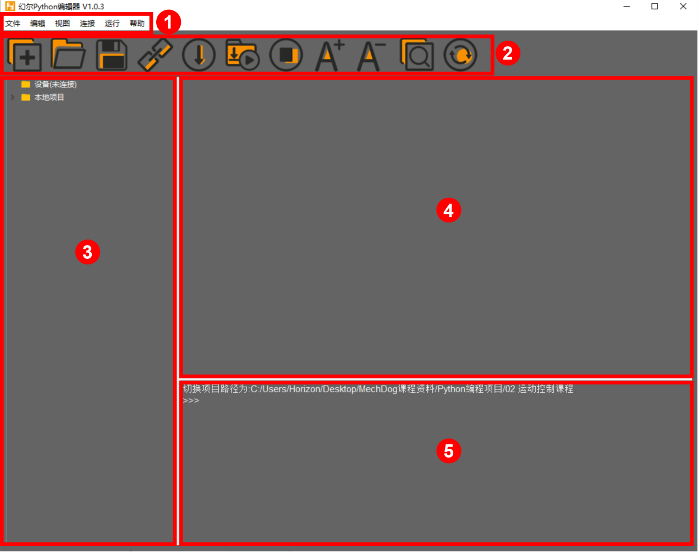

The functions of each area are listed in the table below:

| No. | Area | Function |
| --- | --- | --- |
| 1 | Menu Bar | Includes **File**, **Edit**, **View**, **Connect**, **Run**, and **Help**. |
| 2 | Toolbar | Includes several common shortcut buttons. Their functions correspond to commands in the menu bar. |
| 3 | File List | Contains project files stored on the device and on the local PC. Folders and source code files can be viewed here. |
| 4 | Code Editor | Used to view and edit code. |
| 5 | Terminal | Displays message logs and debugging information. When no device is connected, only message logs are available. |

**Operation Guide**

1. For the first import, left-click **Local Project** to open the file selection list. For later imports, right-click **Local Project -> Switch Project Path**.


2. Select **2. Software/4. Program Collection/5. Python Project**, then click **Select Folder**.

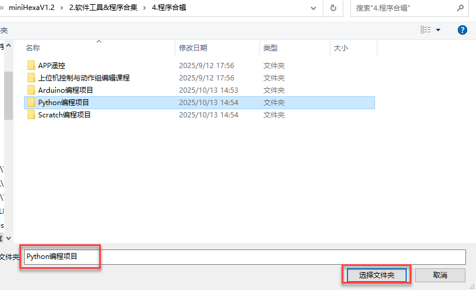

3. The files in the folder are automatically added to the local project and can be viewed under **Local Project**.

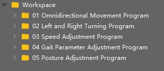

> [!NOTE]
>
> **Importing a local project only imports files from the PC into the editor. It does not download them to the ESP32 controller board.**

**View Files and Programs**

Double-click a program file in the file list to view the code. `02 Omnidirectional Movement Program/main.py` is used here as an example:

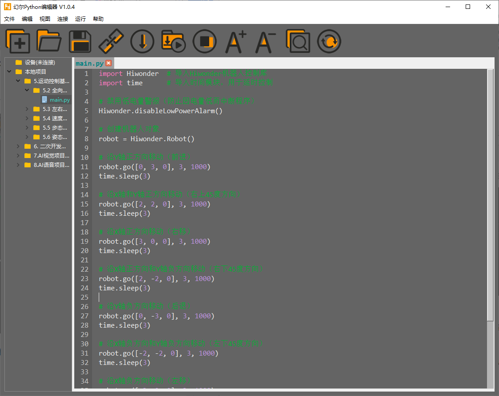

After a program file is downloaded to the ESP32 controller board, double-click the file under **Device** to view it in the same way.

**Code Writing and Saving**

The code editor on the right side supports code creation, viewing, editing, modification, and saving. Read the following notes before writing code:

1. Files cannot be created directly under the **Device** tab. Changes to files under **Device** can be saved only through the download operation. For backup, copy the files to the local project first.

2. Do not modify action group files with the `.rob` extension in the editor. Unknown format errors may occur. Edit action group files in the PC software when needed.

3. Among the provided low-level program files, `main.py` is the main program of the device. All robot functions are launched through this file. Reset and power-on operations also depend on this file. If `main.py` stops responding, subsequent operations cannot continue. For safety, rename the program first if additional features need to be added. If `main.py` is changed to another name and the program becomes stuck during debugging, even when **Ctrl+C** and **Ctrl+D** both fail, reset the controller board, delete the program, and download the required program again.

**Program Download and Execution**

Program download is an interaction between the editor and the device. `02 Omnidirectional Movement Program/main.py` is used here as an example:

1. Under the **Local Project** tab, select `02 Omnidirectional Movement Program/main.py`. Click the toolbar icon  to connect to the ESP32 controller board. Then click the toolbar icon  or right-click the file and select **Download and Run**.

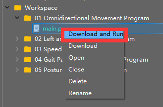

2. The terminal displays the download progress and completion status. Since **Download and Run** is used in the previous step, the running result can also be viewed there.

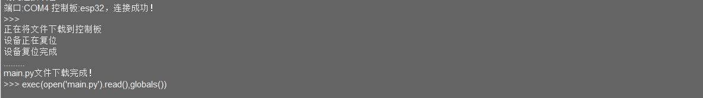

3. After the download is complete, the program appears in the file list under **Device**.


> [!NOTE]
>
> **Also note the following:**
>
> - **If the downloaded file is not named `main.py`, delete the original `main.py` and rename the downloaded file to `main.py`. Another option is to rename the file to `main.py` before downloading.**
>
> - **"Download and Run" first resets the device, which means a restart, and then downloads and runs the program. This helps improve program stability.**
>
> - **If the program does not need to run immediately, click the button  or right-click the target file and select "Download". Before running the program later, click the icon  to reset the device first, then run the program.**

**Terminal Debugging**

The terminal combines the message window and the debugging console. When no device is connected, the terminal can display messages only and cannot be used for editing or debugging. The message viewing function has already been shown in the previous steps. The following section focuses on debugging features.

1. The terminal supports code input. Enter `print(123)` in the terminal and press **Enter**. The result is shown below:


2. The terminal also supports automatic indentation. When a Python statement ends with a colon, such as `if`, `for`, or `while`, pressing **Enter** continues on the next line with the appropriate indentation. Press **Backspace** to remove one indentation level.

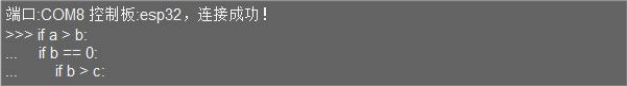

3. To copy and paste code, select the target code and right-click in the terminal.

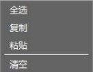

> [!NOTE]
>
> **Press "Ctrl+E" to enter edit mode before pasting code. Otherwise, indentation errors may occur during debugging.**

The image below shows the correct result after copy and paste. The indentation is correct.

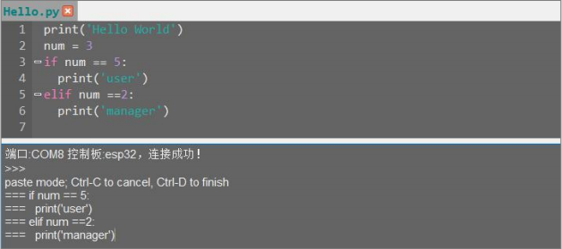

The image below shows incorrect indentation:

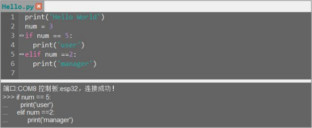

To exit edit mode, press **Ctrl+C**. If an infinite loop is running, press **Ctrl+C** to interrupt it as well.

> [!NOTE]
>
> **"Ctrl+C" only interrupts a running program in the terminal. It does not copy text. "Ctrl+V" does not paste text in the terminal.**

4. Use **Tab** to complete code when entering commands in the terminal. For example, enter `os` and press **Tab**. The result is shown below:

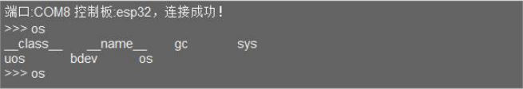

If two or more completions are available, the terminal lists all available options. If only one completion is available, the terminal completes it automatically. If no completion is available, no action is taken.

5. Use the **Up Arrow** and **Down Arrow** keys in the terminal to view previously entered commands and reduce repeated input.

For more commands and command descriptions, visit [http://docs.micropython.org/en/latest/library/uos.html](http://docs.micropython.org/en/latest/library/uos.html)

<p id ="anther6.1.2"></p>

### 6.1.2 Deviation Calibration

<p id ="anther6.1.2.1"></p>

#### 6.1.2.1 Read the Deviation Values in the PC Software

Downloading an Arduino program erases the MicroPython firmware on the ESP32. The original servo deviation values are cleared at the same time. Before programming a MicroPython project, open the PC software and save the servo deviation values.

1. Open [**2. Software/3. PC Software Package/MiniHexa.exe**](https://drive.google.com/drive/folders/1L2N8oZFAkDJX_iJaABmMiacG2YC4CMB5?usp=sharing). Connect miniHexa to the PC with a USB data cable. Then follow the steps shown below. Select the corresponding port. `COM4` is used here as an example. Click **Connect**, then click **Action Edit**.

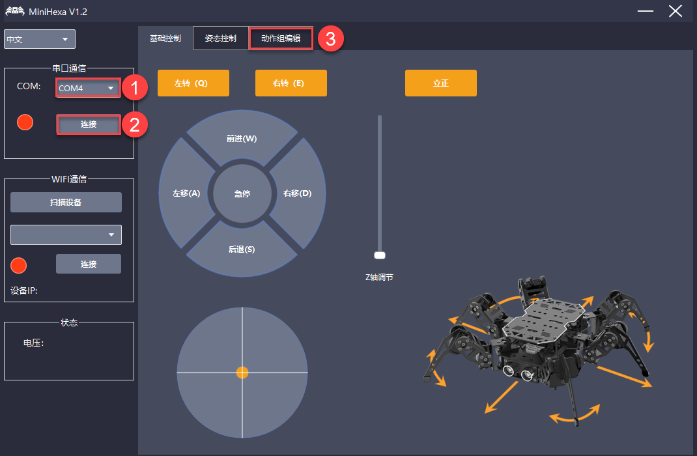

2. Click **Read Deviation** to read the servo deviation values.

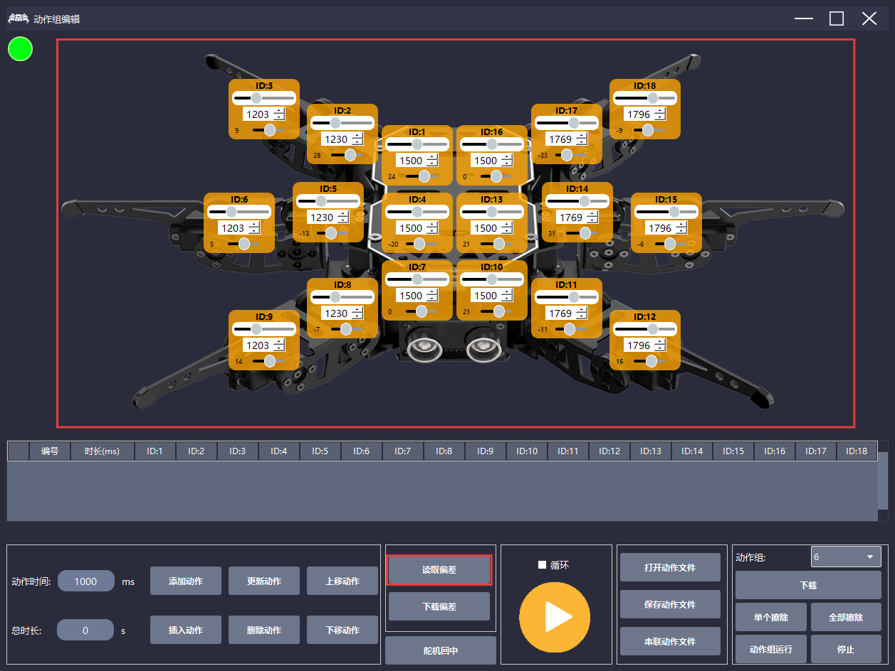

> [!NOTE]
>
> **After the servo deviation values are read, take a screenshot to keep a backup and prevent data loss.**

#### 6.1.2.2 Write the Deviation Values

1. Open the [Hiwonder Python Editor](https://drive.google.com/drive/folders/1f9hSVelLa2x4sF1miJddl4e2izL7kGYJ?usp=sharing).


2. Open [**02 Program Files/Deviation Writing Program/main.py**](https://drive.google.com/drive/folders/1hWTJBswm3QXBqs_q7zQrjuteBzIwvEbe?usp=sharing), then drag it into the Hiwonder Python Editor. The drag operation takes effect only when the file is dropped inside the red box.

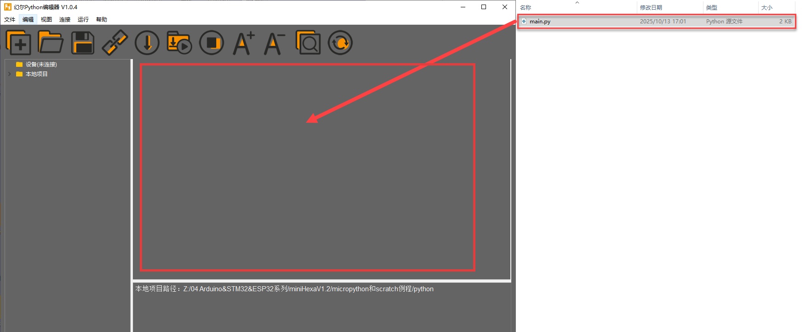

3. Locate the code section that sets the deviation values:

```
# Set servo deviation values
robot.set_deviation(1 , 0)
robot.set_deviation(2 , 0)
robot.set_deviation(3 , 0)
robot.set_deviation(4 , 0)
robot.set_deviation(5 , 0)
robot.set_deviation(6 , 0)
robot.set_deviation(7 , 0)
robot.set_deviation(8 , 0)
robot.set_deviation(9 , 0)
robot.set_deviation(10 , 0)
robot.set_deviation(11 , 0)
robot.set_deviation(12 , 0)
robot.set_deviation(13 , 0)
robot.set_deviation(14 , 0)
robot.set_deviation(15 , 0)
robot.set_deviation(16 , 0)
robot.set_deviation(17 , 0)
robot.set_deviation(18 , 0)
```

4. Write the deviation data read in [Read the Deviation Values in the PC Software](#anther6.1.2.1) into the code.

```
robot.set_deviation(1 , 24)
robot.set_deviation(2 , 28)
robot.set_deviation(3 , 9)
robot.set_deviation(4 , -20)
robot.set_deviation(5 , -13)
robot.set_deviation(6 , -13)
robot.set_deviation(7 , 0)
robot.set_deviation(8 , -7)
robot.set_deviation(9 , 14)
robot.set_deviation(10 , 21)
robot.set_deviation(11 , -11)
robot.set_deviation(12 , 16)
robot.set_deviation(13 , 21)
robot.set_deviation(14 , 31)
robot.set_deviation(15 , -5)
robot.set_deviation(16 , 0)
robot.set_deviation(17 , -33)
robot.set_deviation(18 , -9)
```

5. After setting the deviation values, connect miniHexa to the PC with a Type-C data cable. Click . After the connection is successful, the icon turns green . Then click  to download the program to miniHexa.


> [!NOTE]
>
> **The deviation setting program needs to be downloaded and run on miniHexa only once. After that, the settings are stored in the miniHexa Arduino programming environment. No additional setup is required.**

#### 6.1.2.3 Read the Written Deviation Values

After the deviation values are written, click . The serial port continuously prints the stored servo deviation values.

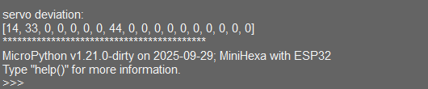
