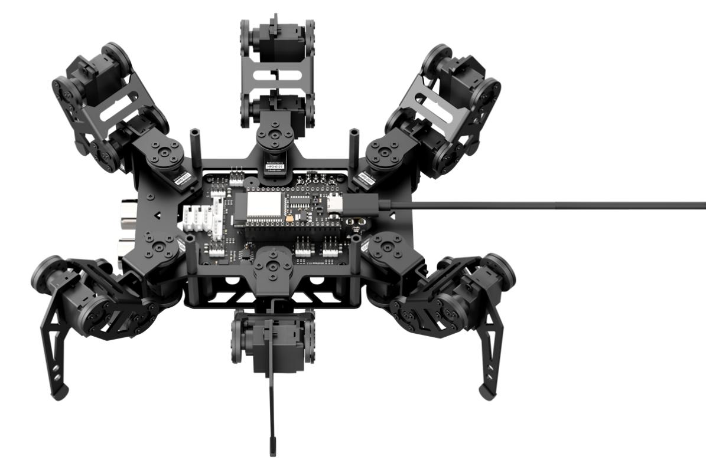
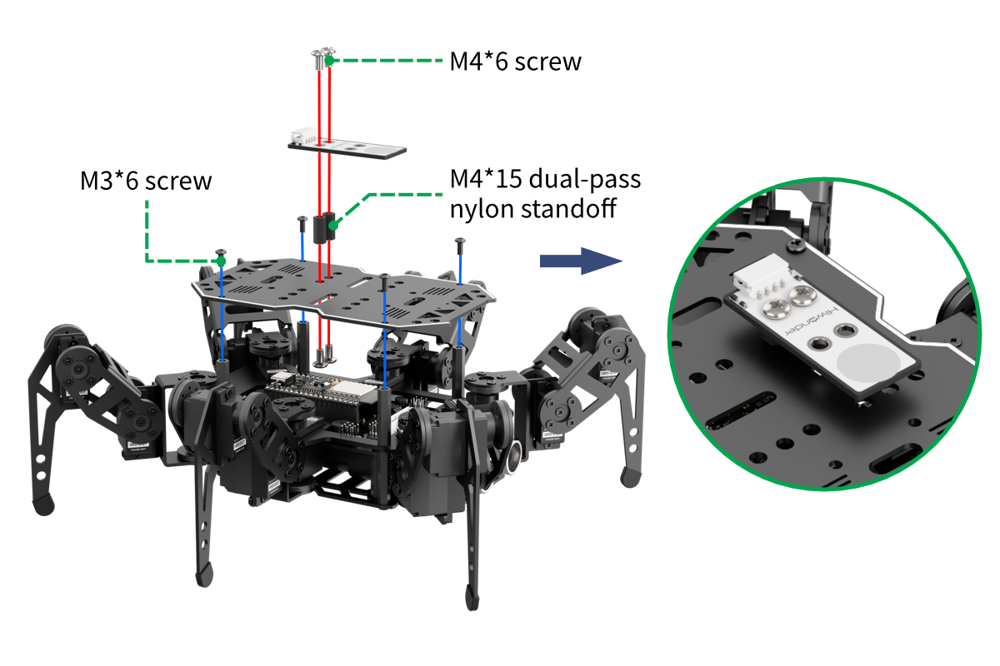
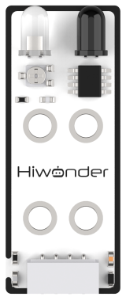

# 6. Secondary Development Course

## 6.1 Action Group Overview and Hands-on Instructions

### 6.1.1 Overview

In this lesson, we will learn about the miniHexa action groups and how to execute actions via programming.

An action group is a pre-defined sequence of actions that allows the robot to perform specific tasks, such as moving, dancing, or other behaviors.

miniHexa comes with 14 built-in action groups that can be directly called by users. The corresponding action group list is as follows:

| **Action Group Number** | **Action Description**  |
| :---------------------: | :---------------------: |
|            1            | Twist Counterclockwise  |
|            2            |     Twist Clockwise     |
|            3            |         Wake Up         |
|            4            |     Wake Up and Run     |
|            5            |        Act Cute         |
|            6            |    Obstacle Crossing    |
|            7            |        Combat 1         |
|            8            |        Combat 2         |
|            9            | Left Foot Kick Forward  |
|           10            |  Left Foot Kick Right   |
|           11            | Right Foot Kick Forward |
|           12            |  Right Foot Kick Left   |
|           13            |        Push Door        |
|           14            |         Waving          |

### 6.1.2 Project Process


### 6.1.3 Program Download

[Source Code]()

(1) Connect miniHexa to your computer using a Type-C data cable.



(2) Open the program file located in the same directory as this document: [Action Group Introduction Program\action_group\action_group.ino]()


(3) Select the development board model when you open the program, and the specific model is shown in the figure below.


(4) In the menu bar, click **Tools**, and choose the corresponding ESP32 controller configuration as illustrated.


:::{Note}

Make sure to set the correct controller configuration before uploading the program.

:::

(5) Click "**Compile**” first, then click "**Upload**". After the upload is completed, the program download is completed if the following interface appears in the output box below the software.


### 6.1.4 Project Outcome

Once powered on, miniHexa will run the pre-edited action groups.

### 6.1.5 Program Brief Analysis

[Source Code]()

(1) The program imports the hiwonder_robot.h library, which contains the methods for interacting with the robot system.

{lineno-start=1}

```
#include "hiwonder_robot.h"
```

(2) Create and define a two-dimensional array write_data for the action groups. The two sub-arrays store the action data.

{lineno-start=5}

```
uint8_t result;

uint8_t write_data[2][60] = {{0,2,1,18,200,0,1,173,6,2,58,4,3,69,2,4,127,6,5,205,4,6,88,2,7,190,6,8,164,3,9,246,3,10,173,6,11,86,6,12,206,8,13,127,6,14,234,6,15,95,9,16,190,6,17,161,7,18,194,9},
                             {0,2,2,18,144,1,1,225,5,2,204,4,3,71,2,4,226,5,5,235,4,6,77,2,7,220,5,8,233,4,9,97,2,10,8,6,11,206,6,12,70,9,13,235,5,14,203,6,15,115,9,16,220,5,17,234,6,18,89,9}};

```

(3) In the setup() function, the serial communication baud rate is set to 115200, followed by initialization of the robot.

{lineno-start=10}

```
void setup() {
  Serial.begin(115200);
  minihexa.begin();
  /*List action group files (列出动作组文件)*/
  minihexa.list_action_group_dir();
  /* Download action group (下载动作组)*/
  minihexa.action_group_download(0, write_data[0], 60);
  minihexa.action_group_download(0, write_data[1], 60);
  /* Run action group (运行动作组) */
  minihexa.action_group_run(0);
}
```

(4) Call list_action_group_dir() to list the action files and their sizes. 

:::{Note}

The action files will only be displayed if the log output is enabled.

:::


(5) Use miniHexa.action_group_download() to download the action groups. Each group may consist of two actions, so both need to be downloaded. Call action_group_run() to execute the action group.

{lineno-start=10}

```
void setup() {
  Serial.begin(115200);
  minihexa.begin();
  /*List action group files (列出动作组文件)*/
  minihexa.list_action_group_dir();
  /* Download action group (下载动作组)*/
  minihexa.action_group_download(0, write_data[0], 60);
  minihexa.action_group_download(0, write_data[1], 60);
  /* Run action group (运行动作组) */
  minihexa.action_group_run(0);
}
```

(6) The loop() function does not contain any program logic, so the program will only execute once.

{lineno-start=21}

```
void loop() {
}
```

### 6.1.6 Feature Extensions

You can add, remove, or edit your own action groups by modifying the two-dimensional array write_data.

(1) Open **action_group.ino** and locate the write_data array to make modifications. For example, you can duplicate an existing action group to make the robot perform a waving motion twice.

{lineno-start=7}

```
uint8_t write_data[2][60] = {{0,2,1,18,200,0,1,173,6,2,58,4,3,69,2,4,127,6,5,205,4,6,88,2,7,190,6,8,164,3,9,246,3,10,173,6,11,86,6,12,206,8,13,127,6,14,234,6,15,95,9,16,190,6,17,161,7,18,194,9},
                             {0,2,2,18,144,1,1,225,5,2,204,4,3,71,2,4,226,5,5,235,4,6,77,2,7,220,5,8,233,4,9,97,2,10,8,6,11,206,6,12,70,9,13,235,5,14,203,6,15,115,9,16,220,5,17,234,6,18,89,9}};

```

(2) Duplicate the original action group and modify the circled data in the diagram. Change the array size from write_data\[2\]\[60\] to write_data\[4\]\[60\]. Update the second element of the array to 4, which indicates that the action group contains 4 actions. Update the third element to specify the action number. For example, set the first action to 1 and the second action to 2.

{lineno-start=}

```
uint8_t write_data[4][60] = {{0,4,1,18,200,0,1,173,6,2,58,4,3,69,2,4,127,6,5,205,4,6,88,2,7,190,6,8,164,3,9,246,3,10,173,6,11,86,6,12,206,8,13,127,6,14,234,6,15,95,9,16,190,6,17,161,7,18,194,9},
                             {0,4,2,18,144,1,1,225,5,2,204,4,3,71,2,4,226,5,5,235,4,6,77,2,7,220,5,8,233,4,9,97,2,10,8,6,11,206,6,12,70,9,13,235,5,14,203,6,15,115,9,16,220,5,17,234,6,18,89,9}

{0,4,3,18,144,1,1,225,5,2,204,4,3,71,2,4,226,5,5,235,4,6,77,2,7,220,5,8,233,4,9,97,2,10,8,6,11,206,6,12,70,9,13,235,5,14,203,6,15,115,9,16,220,5,17,234,6,18,89,9}

{0,4,4,18,144,1,1,225,5,2,204,4,3,71,2,4,226,5,5,235,4,6,77,2,7,220,5,8,233,4,9,97,2,10,8,6,11,206,6,12,70,9,13,235,5,14,203,6,15,115,9,16,220,5,17,234,6,18,89,9}};

```


(3) Add code to download the two new actions.

{lineno-start=10}

```
void setup() {
  Serial.begin(115200);
  minihexa.begin();
  /*List action group files (列出动作组文件)*/
  minihexa.list_action_group_dir();
  /* Download action group (下载动作组)*/
  minihexa.action_group_download(0, write_data[0], 60);
  minihexa.action_group_download(0, write_data[1], 60);
  minihexa.action_group_download(0, write_data[2], 60);
  minihexa.action_group_download(0, write_data[3], 60);
  /* Run action group (运行动作组) */
  minihexa.action_group_run(0);
}
```

(4) After modification, refer to [6.1.3 Program Download]() in this document to run the updated program.

## 6.2 Intelligent Voice Control

### 6.2.1 Overview

In this lesson, the robot detects sound intensity using the sound sensor and moves according to the detected sound levels.

### 6.2.2 Project Process


### 6.2.3 Module Instruction


The onboard sound sensor is designed to detect the level of external sound. It can read the sound level by using the ADC pin to get the pin value. The main working principle is that sound vibrations at the microphone's sensor cause the diaphragm inside the microphone to vibrate. These vibrations lead to changes in capacitance, which then generate a small voltage corresponding to these changes. This voltage is then converted into an electrical signal output.

### 6.2.4 Program Download

[Source Code]()

(1) Connect miniHexa to your computer using a Type-C data cable.


(2) Open the program file located in the same directory as this document: [Voice Control Program\sound_control\sound_control.ino]()


(3) Select the development board model when you open the program, and the specific model is shown in the figure below.


(4) In the menu bar, click **Tools**, and choose the corresponding ESP32 controller configuration as illustrated.


:::{Note}

Make sure to set the correct controller configuration before uploading the program.

:::

(5) Click "**Compile**” first, then click "**Upload**". After the upload is completed, the program download is completed if the following interface appears in the output box below the software.


### 6.2.5 Project Outcome

After powering on, miniHexa performs the startup initialization to stand in its six-legged stance, then continuously monitors the ambient sound. When the detected sound level reaches or exceeds 600, miniHexa will perform a forward walking motion.


### 6.2.6 Program Brief Analysis

[Source Code]()

(1) The program imports the hiwonder_robot.h and hiwonder_sensor.h libraries, which define sensor interfaces and robot interaction methods.

{lineno-start=1}

```
#include "hiwonder_robot.h"
```

(2) The miniHexa object and the sound sensor object are initialized. A variable sound_value is defined to store the detected sound level, and arrays for robot velocity, body center of gravity position, and posture (velocity, position, \_euler) are created.

{lineno-start=3}

```
Robot minihexa;

uint16_t sound_value;

Velocity_t velocity = {0.0f, 0.0f, 0.0f};
Vector_t position = {0.0f, 0.0f, 0.0f};
Euler_t _euler = {0.0f, 0.0f, 0.0f};
```

(3) In the setup() function, the serial communication baud rate is set to 115200, followed by initialization of the robot and sensors.

{lineno-start=11}

```
void setup() {
  Serial.begin(115200);
  minihexa.begin();
}
```

(4) In the loop() function, the program first reads the sound level detected by the sensor (sound_value). It then checks whether this value is greater than or equal to 600. If so, the robot executes a forward movement.

{lineno-start=15}

```
void loop() {
  sound_value = minihexa.board.get_sound_val();
  if(sound_value >= 600) {
    velocity = {0.0f, 2.0f, 0.0f};
    minihexa.move(&velocity, &position, &_euler, 1000, 1);
    delay(1000);
  }
```

### 6.2.7 Feature Extensions

The value of sound_value can be adjusted as needed. For example, increasing the threshold to make the trigger level higher will cause the robot to respond only to louder sounds.

(1) In the main function, locate the code that checks the trigger threshold.

{lineno-start=15}

```
void loop() {
  sound_value = minihexa.board.get_sound_val();
  if(sound_value >= 600) {
    velocity = {0.0f, 2.0f, 0.0f};
    minihexa.move(&velocity, &position, &_euler, 1000, 1);
    delay(1000);
  }
```

(2) Here, the original value of 600 is modified to 1000.

{lineno-start=15}

```
void loop() {
  sound_value = minihexa.board.get_sound_val();
  if(sound_value >= 1000) {
    velocity = {0.0f, 2.0f, 0.0f};
    minihexa.move(&velocity, &position, &_euler, 1000, 1);
    delay(1000);
  }
```

(3) After modification, refer to [6.2.7 Program Download]() in this document to run the updated program.

6.3 Ultrasonic Ranging
---

### 6.3.1 Overview

In this lesson, the robot uses the RGB Ultrasonic Sensor to measure distance. The measured distance is then used to control the color of the sensor’s RGB light.

### 6.3.2 Project Process


### 6.3.3 Module Instruction

This module integrates an IIC communication interface, which allows distance data to be read through the IIC protocol. Additionally, the ultrasonic probe integrates two RGB LEDs, which not only support brightness adjustment but also can produce colorful lighting effects through changes and combinations of the red (R), green (G), and blue (B) channels.


During distance measurement, the module automatically sends out 8 pulses of 40 kHz square waves and waits for a signal to return. If a signal is returned, the module outputs a high-level signal, and the duration of the high-level signal corresponds to the time it takes for the ultrasound to travel to the object and back.

:::{Note}

The sensor comes with the onboard IIC port already connected at the factory. No additional wiring by the user is required.

:::

### 6.3.4 Program Download

[Source Code]()

(1) Connect miniHexa to your computer using a Type-C data cable.


(2) Open the program file located in the same directory as this document: [Ultrasonic Ranging Program\ultrasound\\ ultrasound.ino]()


(3) Select the development board model when you open the program, and the specific model is shown in the figure below.


(4) In the menu bar, click **Tools**, and choose the corresponding ESP32 controller configuration as illustrated.


:::{Note}

Make sure to set the correct controller configuration before uploading the program.

:::

(5) Click "**Compile**” first, then click "**Upload**". After the upload is completed, the program download is completed if the following interface appears in the output box below the software.


### 6.3.5 Project Outcome

When an object approaches the ultrasonic RGB module, the light color changes accordingly.


### 6.3.6 Program Brief Analysis

[Source Code]()

(1) The program imports the hiwonder_robot.h and hiwonder_sensor.h libraries, which define sensor interfaces and robot interaction methods.

{lineno-start=1}

```
#include "hiwonder_robot.h"
```

(2) The miniHexa object and the sensor object are initialized. Then, a variable dis is created to store the measured distance, along with a mapping variable S. In addition, two RGB arrays rgb1 and rgb2 are defined to represent the intensity values of the three primary colors for the ultrasonic RGB lights.

{lineno-start=3}

```
Robot minihexa;

uint8_t s;
uint16_t dis;
uint8_t rgb1[3] = {0};
uint8_t rgb2[3] = {0};
```

(3) In the `setup()` function, the serial communication baud rate is set to 115200, followed by initialization of the robot and sensors.

{lineno-start=10}

```
void setup() {
  Serial.begin(115200);
  minihexa.begin();
}
```

(4) In the loop() function, the program reads the distance detected by the ultrasonic RGB module. Based on the value of dis, the module’s color is updated and the distance is printed through the serial monitor.

{lineno-start=14}

```
void loop() {
  dis = minihexa.sensor.get_distance();
  if (dis > 0 && dis <= 80){         // Breathing light mode, cycle 0.1s, color: red (呼吸灯模式，周期0.1s，颜色红色)
    rgb1[0] = 1;
    rgb1[1] = 0;
    rgb1[2] = 0;
    memcpy(rgb2, rgb1, sizeof(rgb1));
    minihexa.sensor.set_ultrasound_rgb(1, rgb1, rgb2);
  }
  else if (dis > 80 && dis <= 180){   // Red gradient (红色渐变)
    s = map(dis,80,180,0,255);
    rgb1[0] = 255-s;
    rgb1[1] = 0;
    rgb1[2] = 0;
    memcpy(rgb2, rgb1, sizeof(rgb1));
  }
  else if (dis > 180 && dis <= 320){              // Blue gradient (蓝色渐变)
    s = map(dis,180,320,0,255);
    rgb1[0] = 0;
    rgb1[1] = 0;
    rgb1[2] = s;   
    memcpy(rgb2, rgb1, sizeof(rgb1)); 
  }
  else if (dis > 320 && dis <= 500){     // Green gradient (绿色渐变)
    s = map(dis,320,500,0,255);
    rgb1[0] = 0;
    rgb1[1] = s;
    rgb1[2] = 255-s;
    memcpy(rgb2, rgb1, sizeof(rgb1));
  }
  else if (dis > 500){         // Green (绿色)
    rgb1[0] = 0;
    rgb1[1] = 255;
    rgb1[2] = 0;    
    memcpy(rgb2, rgb1, sizeof(rgb1));
  }
  minihexa.sensor.set_ultrasound_rgb(1, rgb1, rgb2);
  Serial.printf("Distance: %d mm\n", dis);
}

```

(5) If the detected distance is between 0 and 80, the RGB light turns red.

{lineno-start=16}

```
  if (dis > 0 && dis <= 80){         // Breathing light mode, cycle 0.1s, color: red (呼吸灯模式，周期0.1s，颜色红色)
    rgb1[0] = 1;
    rgb1[1] = 0;
    rgb1[2] = 0;
    memcpy(rgb2, rgb1, sizeof(rgb1));
    minihexa.sensor.set_ultrasound_rgb(1, rgb1, rgb2);
  }
```

(6) When the distance is between 80 and 180, the RGB light displays a red gradient effect.

{lineno-start=23}

```
  else if (dis > 80 && dis <= 180){   // Red gradient (红色渐变)
    s = map(dis,80,180,0,255);
    rgb1[0] = 255-s;
    rgb1[1] = 0;
    rgb1[2] = 0;
    memcpy(rgb2, rgb1, sizeof(rgb1));
  }
```

(7) For distances in the range of 180 to 320, the RGB light shifts to a blue gradient.

{lineno-start=30}

```
  else if (dis > 180 && dis <= 320){              // Blue gradient (蓝色渐变)
    s = map(dis,180,320,0,255);
    rgb1[0] = 0;
    rgb1[1] = 0;
    rgb1[2] = s;   
    memcpy(rgb2, rgb1, sizeof(rgb1)); 
  }
```

(8) When the detected distance exceeds 500, the RGB light turns green.

{lineno-start=44}

```
  else if (dis > 500){         // Green (绿色)
    rgb1[0] = 0;
    rgb1[1] = 255;
    rgb1[2] = 0;    
    memcpy(rgb2, rgb1, sizeof(rgb1));
  }
```

(9) The corresponding color is set on the ultrasonic RGB module, and the distance value dis is also shown on the OLED display.

{lineno-start=50}

```
  minihexa.sensor.set_ultrasound_rgb(1, rgb1, rgb2);
  Serial.printf("Distance: %d mm\n", dis);
}
```

### 6.3.7 Feature Extensions

You can modify the three parameters of the sensor.set_ultrasound_rgb() function. Parameter 1 defines the lighting mode. 0 for steady light, while 1 for breathing mode. Parameters 2 and 3 set the independent RGB color values.

(1) In the main function, locate the code that sets the RGB color of the ultrasonic module.

{lineno-start=44}

```
  else if (dis > 500){         // Green (绿色)
    rgb1[0] = 0;
    rgb1[1] = 255;
    rgb1[2] = 0;    
    memcpy(rgb2, rgb1, sizeof(rgb1));
  }
```

(2) Then, replace the original green color with black, which turns the light off.

{lineno-start=44}

```
  else if (dis > 500){         // Green (绿色)
    rgb1[0] = 0;
    rgb1[1] = 0;
    rgb1[2] = 0;    
    memcpy(rgb2, rgb1, sizeof(rgb1));
  }
```

(3) After modification, refer to [6.3.4 Program Download]() in this document to run the updated program.

## 6.4 Ultrasonic Obstacle Avoidance

### 6.4.1 Overview

In this lesson, the ultrasonic sensor is used to detect distance. The robot then performs obstacle avoidance based on the detected values.

### 6.4.2 Project Process


### 6.4.3 Module Instruction

This module integrates an IIC communication interface, which allows distance data to be read through the IIC protocol. Additionally, the ultrasonic probe integrates two RGB LEDs, which not only support brightness adjustment but also can produce colorful lighting effects through changes and combinations of the red (R), green (G), and blue (B) channels.


During distance measurement, the module automatically sends out 8 pulses of 40 kHz square waves and waits for a signal to return. If a signal is returned, the module outputs a high-level signal, and the duration of the high-level signal corresponds to the time it takes for the ultrasound to travel to the object and back.

:::{Note}

The sensor comes with the onboard IIC port already connected at the factory. No additional wiring by the user is required.

:::

### 6.4.4 Program Download

[Source Code]()

(1) Connect miniHexa to your computer using a Type-C data cable.


(2) Open the program file located in the same directory as this document: [Ultrasonic Obstacle Avoidance Program\ultrasound_avoidance\\ ultrasound_avoidance.ino]()


(3) Select the development board model when you open the program, and the specific model is shown in the figure below.


(4) In the menu bar, click **Tools**, and choose the corresponding ESP32 controller configuration as illustrated.


:::{Note}

Make sure to set the correct controller configuration before uploading the program.

:::

(5) Click "**Compile**” first, then click "**Upload**". After the upload is completed, the program download is completed if the following interface appears in the output box below the software.


### 6.4.5 Project Outcome

After powering on, the RGB lights on the ultrasonic sensor module glow red, and the ultrasonic sensor starts detecting distance. If the distance is greater than 200, the robot moves forward. If the distance is less than 100, the robot moves backward. Otherwise, the robot rotates in place.


### 6.4.6 Program Brief Analysis

[Source Code]()

(1) The program imports the hiwonder_robot.h and hiwonder_sensor.h libraries. These files provide definitions for sensors, interaction methods, and system control functions of the robot.

{lineno-start=1}

```
#include "hiwonder_robot.h"
```

(2) The code initializes the miniHexa object and the sensor object, and defines two RGB arrays rgb1 and rgb2 to control the lights on the ultrasonic sensor.

{lineno-start=3}

```
Robot minihexa;

uint8_t rgb1[3] = {0, 0, 100};
uint8_t rgb2[3] = {0, 0, 100};
uint16_t dis;

Velocity_t velocity = {0.0f, 0.0f, 0.0f};
Vector_t position = {0.0f, 0.0f, 0.0f};
Euler_t euler = {0.0f, 0.0f, 0.0f};
```

(3) A variable dis is created to store the measured distance. Arrays velocity, position, and \_euler are also defined to represent the robot’s movement speed, center of gravity, and posture.

{lineno-start=3}

```
Robot minihexa;

uint8_t rgb1[3] = {0, 0, 100};
uint8_t rgb2[3] = {0, 0, 100};
uint16_t dis;

Velocity_t velocity = {0.0f, 0.0f, 0.0f};
Vector_t position = {0.0f, 0.0f, 0.0f};
Euler_t euler = {0.0f, 0.0f, 0.0f};
```

(4) In the `setup()` function, the serial communication baud rate is set to 115200, followed by initialization of the robot and sensors.

{lineno-start=13}

```
void setup() {
  Serial.begin(115200);
  minihexa.begin();
  delay(1000);
  minihexa.sensor.set_ultrasound_rgb(0, rgb1, rgb2);
}
```

(5) In the `loop()` function, the program reads the distance value from the ultrasonic sensor. Based on dis, the robot executes the corresponding movement. When the detected distance dis is greater than 200, the robot moves forward. If dis is less than 100, it moves backward. And if dis falls between these two values, the robot rotates in place.

{lineno-start=19}

```
void loop() {
  dis = minihexa.sensor.get_distance();
  minihexa.avoid(dis);
  delay(50);
}
```

### 6.4.7 Feature Extensions

Learn how the minihexa.avoid(); function is written and implemented.

(1) In hiwonder_robot.h, four ultrasonic detection results are defined. Avoid_State {FORWARD, BACK, TURN, WAIT}; corresponds to FORWARD (move forward), BACK (move backward), TURN (rotate), and WAIT (stay idle).

{lineno-start=192}

```
    enum Func_State {CALIBRATE, CRAWL, ACTION_GROUP};
    enum Move_State {MOVING, STOP, REST};
    enum Avoid_State {FORWARD, BACK, TURN, WAIT};
    enum Act_State {READ_FRAME_NUM, READ_FRAME_DATA, ACT_STOP};
    Func_State func_state = CRAWL;
    Move_State move_state = REST;
    Avoid_State avoid_state = FORWARD;
    Act_State act_state = READ_FRAME_NUM;
```

(2) By default, the avoid_state is set to FORWARD (move forward).

{lineno-start=192}

```
    enum Func_State {CALIBRATE, CRAWL, ACTION_GROUP};
    enum Move_State {MOVING, STOP, REST};
    enum Avoid_State {FORWARD, BACK, TURN, WAIT};
    enum Act_State {READ_FRAME_NUM, READ_FRAME_DATA, ACT_STOP};
    Func_State func_state = CRAWL;
    Move_State move_state = REST;
    Avoid_State avoid_state = FORWARD;
    Act_State act_state = READ_FRAME_NUM;
```

(3) When the main program calls minihexa.avoid(), the program first enters the default branch FORWARD in the switch statement. The robot will move forward for a short distance, and then check the ultrasonic value dis. If dis is less than 200 but greater than 100, the robot switches to the TURN (rotate right) state. If dis is less than 100, the robot switches to the BACK (move backward) state.

{lineno-start=690}

```
void Robot::avoid(uint16_t dis) {
  Velocity_t vel = {0.0f, 0.0f, 0.0f};
  Vector_t pos = {0.0f, 0.0f, 0.0f};
  Euler_t att = {0.0f, 0.0f, 0.0f};

  pos = position;
  switch(avoid_state) {
    case FORWARD:
      vel = {0.0f, 2.0f, 0.0f};
      move(&vel, &pos, &att, 800);      
      if(dis < 200 && dis > 100) {
        avoid_state = TURN;
      }
      else if(dis < 100) {
        avoid_state = BACK;
      }
      break;
```

(4) Through the FORWARD (move forward) branch, the program determines which state the robot should enter next, and the miniHexa executes the corresponding movement accordingly.

{lineno-start=708}

```
    case BACK:
      vel = {0.0f, -2.0f, 0.0f};
      move(&vel, &pos, &att, 800);
      if(dis < 200 && dis > 100) {
        avoid_state = TURN;
      }
      else if(dis < 100) {
        avoid_state = BACK;
      }
      break;
      
    case TURN:
      vel = {0.0f, 0.0f, 1.8f};
      move(&vel, &pos, &att, 1000, 4);
      avoid_state = WAIT;
      break;
    
    case WAIT:
      if(_step_num == 0) {
        if(dis > 200 && dis > 100) {
          avoid_state = FORWARD;
        }
        else if(dis < 200 && dis > 100) {
          avoid_state = TURN;
        }
        else if(dis < 100) {
```

## 6.5 Automatic Following

### 6.5.1 Overview

In this lesson, the robot uses the ultrasonic RGB sensor to detect distance and controls its movement based on the measured distance.

### 6.5.2 Project Process


### 6.5.3 Module Instruction

The glowy ultrasonic sensor uses an IIC communication interface and can read distance measurements from the ultrasonic sensor via IIC. Additionally, the ultrasonic probe integrates two RGB LEDs, which not only support brightness adjustment but also can produce colorful lighting effects through changes and combinations of the red (R), green (G), and blue (B) channels.


During distance measurement, the module automatically sends out 8 pulses of 40 kHz square waves and waits for a signal to return. If a signal is returned, the module outputs a high-level signal, and the duration of the high-level signal corresponds to the time it takes for the ultrasound to travel to the object and back.

:::{Note}

The sensor comes with the onboard IIC port already connected at the factory. No additional wiring by the user is required.

:::

### 6.5.4 Program Download

[Source Code]()

(1) Connect miniHexa to your computer using a Type-C data cable.


(2) Open the program file located in the same directory as this document: [Automatic Following Program\follow\follow.ino]()


(3) Select the development board model when you open the program, and the specific model is shown in the figure below.


(4) In the menu bar, click **Tools**, and choose the corresponding ESP32 controller configuration as illustrated.


:::{Note}

Make sure to set the correct controller configuration before uploading the program.

:::

(5) Click "**Compile**” first, then click "**Upload**". After the upload is completed, the program download is completed if the following interface appears in the output box below the software.


### 6.5.5 Project Outcome

After powering on, the miniHexa’s ultrasonic RGB lights turn red. The robot detects objects using the ultrasonic sensor. If the distance is greater than 200, the robot moves forward. If the distance is less than 100, the robot moves backward. If neither condition is met, the robot stops moving.


### 6.5.6 Program Brief Analysis

[Source Code]()

(1) The program imports the `hiwonder_robot.h` and `hiwonder_sensor.h` libraries. These files provide definitions for sensors, interaction methods, and system control functions of the robot.

{lineno-start=1}

```
#include "hiwonder_robot.h"
```

(2) Initialize the miniHexa and sensor objects, and create a variable dis to store the measured distance.

{lineno-start=3}

```
Robot minihexa;

uint16_t dis;
uint8_t rgb1[3] = {0, 0, 100};
uint8_t rgb2[3] = {0, 0, 100};
Velocity_t velocity = {0.0f, 0.0f, 0.0f};
Vector_t position = {0.0f, 0.0f, 0.0f};
Euler_t euler = {0.0f, 0.0f, 0.0f};
```

(3) Create two RGB intensity arrays, rgb1 and rgb2, for the ultrasonic RGB module, and initialize the robot’s movement velocity, center of gravity, and posture arrays: velocity, position, \_euler.

{lineno-start=3}

```
Robot minihexa;

uint16_t dis;
uint8_t rgb1[3] = {0, 0, 100};
uint8_t rgb2[3] = {0, 0, 100};
Velocity_t velocity = {0.0f, 0.0f, 0.0f};
Vector_t position = {0.0f, 0.0f, 0.0f};
Euler_t euler = {0.0f, 0.0f, 0.0f};
```

(4) In the `setup()` function, set the serial communication baud rate to 115200, then initialize the miniHexa and the sensors, and set the initial color of the ultrasonic RGB lights.

{lineno-start=12}

```
void setup() {
  Serial.begin(115200);
  minihexa.begin();
  delay(1000);
  minihexa.sensor.set_ultrasound_rgb(0, rgb1, rgb2);
}
```

(5) In the `loop()` function, the program reads the distance value from the ultrasonic sensor. Based on dis, the robot executes the corresponding movement. If dis \> 200, move forward, and if dis \< 100, move backward. Otherwise, stop.

{lineno-start=18}

```
void loop() {
  dis = minihexa.sensor.get_distance();
  if(dis > 200) {
    velocity = {0.0f, 2.0f, 0.0f};
  }
  else if(dis < 100) {
    velocity = {0.0f, -2.0f, 0.0f};
  }
  else {
    velocity = {0.0f, 0.0f, 0.0f};
  }
  minihexa.move(&velocity, &position, &euler);
  delay(100);
}
```

### 6.5.7 Feature Extensions

You can modify the tracking distance by changing the threshold for stopping movement. For example, to stop when dis \> 999. Steps to modify:

(1) Locate the conditional statement in the main function.

{lineno-start=18}

```
void loop() {
  dis = minihexa.sensor.get_distance();
  if(dis > 200) {
    velocity = {0.0f, 2.0f, 0.0f};
  }
  else if(dis < 100) {
    velocity = {0.0f, -2.0f, 0.0f};
  }
  else {
    velocity = {0.0f, 0.0f, 0.0f};
  }
  minihexa.move(&velocity, &position, &euler);
  delay(100);
}
```

(2) Change the condition from dis \> 400 to dis \> 999 to stop. Adjusting this range allows you to modify the target tracking distance.

{lineno-start=}

```
void loop() {
  dis = minihexa.sensor.get_distance();
  if(dis > 400) {
    velocity = {0.0f, 2.0f, 0.0f};
  }
  else if(dis < 999) {
    velocity = {0.0f, -2.0f, 0.0f};
  }
  else {
    velocity = {0.0f, 0.0f, 0.0f};
  }
  minihexa.move(&velocity, &position, &euler);
  delay(100);
}
```

If you want to explore other movement directions, refer to the file [5.2 Omnidirectional Movement]().

(3) After modification, refer to [6.5.4 Program Download]() in this document to run the updated program.

## 6.6 Self-Balancing

### 6.6.1 Overview

In this lesson, the robot uses the IMU sensor to detect body tilt angles and controls its balance based on the measured data.

### 6.6.2 Project Process


### 6.6.3 Module Instruction

This lesson uses the onboard QMI8658 motion sensor, a versatile sensor commonly used in handheld gaming devices, 3D controllers, portable navigation systems, and similar applications.


It integrates a 3-axis MEMS gyroscope, a 3-axis MEMS accelerometer, and an expandable Digital Motion Processor (DMP).

### 6.6.4 Program Download

[Source Code]()

(1) Connect miniHexa to your computer using a Type-C data cable.


(2) Open the program file located in the same directory as this document: [Self-Balancing Program\balance\balance.ino]()


(3) Select the development board model when you open the program, and the specific model is shown in the figure below.


(4) In the menu bar, click **Tools**, and choose the corresponding ESP32 controller configuration as illustrated.


:::{Note}

Make sure to set the correct controller configuration before uploading the program.

:::

(5) Click "**Compile**” first, then click "**Upload**". After the upload is completed, the program download is completed if the following interface appears in the output box below the software.


### 6.6.5 Project Outcome

miniHexa reads real-time tilt angles from the IMU sensor, performs correction calculations, and maintains self-balance through inverse kinematics.


### 6.6.6 Program Brief Analysis

[Source Code]()

(1) The program imports the `hiwonder_robot.h` and `hiwonder_sensor.h` libraries. These files provide definitions for sensors, interaction methods, and system control functions of the robot.

{lineno-start=1}

```
#include "hiwonder_robot.h"
```

(2) Initialize the miniHexa object and create an IMU sensor object to receive tilt angle data. Also, create arrays for the robot’s movement velocity, center of gravity, and posture: velocity, position, and \_euler.

{lineno-start=3}

```
Robot minihexa;

Velocity_t velocity = {0.0f, 0.0f, 0.0f};
Vector_t position = {0.0f, 0.0f, 0.0f};
Euler_t _euler = {0.0f, 0.0f, 0.0f};
```

(3) In the `setup()` function, the serial communication baud rate is set to 115200, followed by initialization of the robot and sensors. Then, adjust the robot’s Z-axis value.

{lineno-start=9}

```
void setup() {
  Serial.begin(115200);
  minihexa.begin();
  delay(2000);
  position = {0.0f, 0.0f, 1.5f};
  minihexa.move(&velocity, &position, &_euler, 1000);
  delay(1000);
}
```

(4) In the main program loop(), call balance(); to enable the self-balancing function.

{lineno-start=17}

```
void loop() {
  minihexa.balance();
}
```

The definition of the balance() function can be found in **“Self-Balancing Program\balance\hiwonder_robot.cpp”**. miniHexa reads the current IMU posture, applies angle limits, and adjusts roll and pitch in the opposite direction, allowing the robot to maintain balance.

{lineno-start=742}

```
void Robot::balance() {
  float euler[3];
  Velocity_t _velocity = {0.0f, 0.0f, 0.0f};
  Vector_t _position = {0.0f, 0.0f, 0.0f};
  Euler_t _euler = {0.0f, 0.0f, 0.0f};

  _position = position;
  board.get_imu_euler(euler);
  euler[0] = euler[0] > 18.0f ? 18.0f : (euler[0] < -18.0f ? -18.0f : euler[0]);
  euler[1] = euler[1] > 18.0f ? 18.0f : (euler[1] < -18.0f ? -18.0f : euler[1]);
  _euler = {-euler[0],-euler[1],0};
  move(&_velocity, &_position, &_euler, 200);
  delay(50);
}
```


6.7 Dot Matrix Display
---

### 6.7.1 Overview

This lesson demonstrates how to use a dot matrix module to display characters.

### 6.7.2 Project Process


### 6.7.3 Module Instruction

The LED dot matrix module is a display unit that features high brightness, no flickering during display, and easy wiring, and it can show numbers, text, and patterns. This module consists of two red 8x8 LED matrices and is controlled by the TM640B driver chip, which enables control of the dot matrix display.


Module Wiring: Connect the module to the miniHexa controller GPIO pins (IO32, IO14) before running this program.


Installation: Mount the dot matrix module onto the rear panel of miniHexa.


### 6.7.4 Program Download

[Source Code]()

(1) Connect miniHexa to your computer using a Type-C data cable.


(2) Open the program file located in the same directory as this document: [Dot Matrix Display Program\matrix_led\matrix_led.ino]().


(3) Select the development board model when you open the program, and the specific model is shown in the figure below.


(4) In the menu bar, click **Tools**, and choose the corresponding ESP32 controller configuration as illustrated.


:::{Note}

Make sure to set the correct controller configuration before uploading the program.

:::

(5) Click "**Compile**” first, then click "**Upload**". After the upload is completed, the program download is completed if the following interface appears in the output box below the software.


### 6.7.5 Project Outcome

After powering on, miniHexa’s dot matrix screen continuously scrolls the text **“Hiwonder”** from right to left.


### 6.7.6 Program Brief Analysis

[Source Code]()

(1) The program imports the `hiwonder_robot.h` and `WMMatrixLED.h` libraries. `hiwonder_robot.h` contains methods for interacting with the robot’s system, while `WMMatrixLED.h` provides functions for controlling the dot matrix module.

{lineno-start=1}

```
#include "hiwonder_robot.h"
#include "hiwonder_sensor.h"
#include "WMMatrixLED.h"
```

(2) A miniHexa object is initialized, along with the dot matrix module pins. A variable X is defined to store the X-axis position for the scrolling display.

{lineno-start=5}

```
//Create miniHexa object (创建miniHexa对象)
Robot minihexa;
//Initialize matrix module pins (初始化点阵模块引脚)
WMMatrixLed matrix(14, 32);  //  SCK / DIN pin numbers (SCK / DIN 引脚编号)
```

(3) In the `setup()` function, the serial communication baud rate is set to 115200, followed by initialization of the robot and dot matrix module, setting the screen brightness to 5 and clearing the screen.

{lineno-start=10}

```
void setup() {
  Serial.begin(115200);
  minihexa.begin();
  matrix.setBrightness(5);//Set brightness (设置亮度)
  matrix.clearScreen();//Clear screen (清屏幕)
}
```

(4) In the `loop()` function, two variables text and textWidth are defined. text stores the characters to be displayed, and textWidth limits the pixel width of each character. A for loop is then used to implement the scrolling effect.

{lineno-start=17}

```
void loop() {
  const char* text = "Hiwonder";
  int textWidth = 6 * strlen(text); // Each character ~6 pixels (每个字符约6像素)
  for (int x = 16; x > -textWidth; x--) {
    matrix.drawStr(x, 8, text);       //Start displaying (开始显示)
    delay(100);
  }
}
```

## 6.8 Ultrasonic Ranging and Displaying

### 6.8.1 Overview

In this lesson, the LED matrix module is used to display in real time the distance detected by the ultrasonic sensor, while also setting the RGB light color of the ultrasonic module.

### 6.8.2 Project Process


### 6.8.3 Module Instruction

* **Ultrasonic Module**

This module uses an IIC communication interface and can read distance measurements from the ultrasonic sensor via IIC. Additionally, the ultrasonic probe integrates two RGB LEDs, which not only support brightness adjustment but also can produce colorful lighting effects through changes and combinations of the red (R), green (G), and blue (B) channels.


During distance measurement, the module automatically sends out 8 pulses of 40 kHz square waves and waits for a signal to return. If a signal is returned, the module outputs a high-level signal, and the duration of the high-level signal corresponds to the time it takes for the ultrasound to travel to the object and back.

:::{Note}

The sensor comes with the onboard IIC port already connected at the factory. No additional wiring by the user is required.

:::

* **Dot Matrix Module**

The LED dot matrix module is a display unit that features high brightness, no flickering during display, and easy wiring, and it can show numbers, text, and patterns. This module consists of two red 8x8 LED matrices and is controlled by the TM640B driver chip, which enables control of the dot matrix display.


Module Wiring: Connect the module to the miniHexa controller GPIO pins (IO33, IO32) before running this program.


Installation: Mount the dot matrix module onto the rear panel of miniHexa.


### 6.8.4 Program Download

[Source Code]()

(1) Connect miniHexa to your computer using a Type-C data cable.


(2) Open the program file located in the same directory as this document: [Ultrasonic Ranging and Displaying Program\ultrasound\ultrasound.ino]()


(3) Select the development board model when you open the program, and the specific model is shown in the figure below.


(4) In the menu bar, click **Tools**, and choose the corresponding ESP32 controller configuration as illustrated.


:::{Note}

Make sure to set the correct controller configuration before uploading the program.

:::

(5) Click "**Compile**” first, then click "**Upload**". After the upload is completed, the program download is completed if the following interface appears in the output box below the software.


### 6.8.5 Project Outcome

When an obstacle approaches the ultrasonic module, the detected distance will be displayed on the LED matrix, and the RGB lights on the ultrasonic module will change according to the detected distance.


### 6.8.6 Program Brief Analysis

[Source Code]()

(1) Import the libraries `hiwonder_robot.h`, and `WMMatrixLED.h`. `hiwonder_robot.h` contains methods for interacting with the robot system, and `WMMatrixLED.h` provides interaction methods for the LED matrix module.

{lineno-start=1}

```
#include "hiwonder_robot.h"
#include "WMMatrixLED.h"
```

(2) Initialize the miniHexa object, sensor objects, and the LED matrix module object.

{lineno-start=4}

```
Robot minihexa;

WMMatrixLed tm(14,32);

uint8_t s;
uint8_t rgb1[3] = {0, 0, 0};
uint8_t rgb2[3] = {0, 0, 0};
uint16_t dis;
Velocity_t velocity = {0.0f, 0.0f, 0.0f};
Vector_t position = {0.0f, 0.0f, 0.0f};
Euler_t _euler = {0.0f, 0.0f, 0.0f};
```

(3) Then, a variable dis is created to store the measured distance, along with a mapping variable S. In addition, two RGB arrays rgb1 and rgb2 are defined to represent the intensity values of the three primary colors for the ultrasonic RGB lights. Arrays for robot movement speed, center of gravity, and attitude are created: velocity, position, and \_euler.

{lineno-start=4}

```
Robot minihexa;

WMMatrixLed tm(14,32);

uint8_t s;
uint8_t rgb1[3] = {0, 0, 0};
uint8_t rgb2[3] = {0, 0, 0};
uint16_t dis;
Velocity_t velocity = {0.0f, 0.0f, 0.0f};
Vector_t position = {0.0f, 0.0f, 0.0f};
Euler_t _euler = {0.0f, 0.0f, 0.0f};
```

(4) In the `setup()` function, set the serial communication baud rate to 115200, then initialize the robot and sensors, and set the brightness and initial color of the ultrasonic RGB lights.

{lineno-start=16}

```
void setup() {
  Serial.begin(115200);
  minihexa.begin();
  tm.setBrightness(4); //Set brightness (设置亮度)
  minihexa.sensor.set_ultrasound_rgb(1, rgb1, rgb2);
}
```

(5) In the `loop()` function, the detected distance is constrained: if dis is greater than 9999, it is capped at 9999.

{lineno-start=22}

```
void loop() {
  dis = minihexa.sensor.get_distance();
  if(dis > 9999) {
    dis = 9999;
  }
```

(6) If the detected distance is between 0 and 80, set the ultrasonic RGB lights to breathing mode with a 0.1-second cycle in red.

{lineno-start=28}

```
  if (dis > 0 && dis <= 80){         // Breathing light mode, cycle 0.1s, color: red (呼吸灯模式，周期0.1s，颜色红色)
    rgb1[0] = 1;
    rgb1[1] = 0;
    rgb1[2] = 0;
    memcpy(rgb2, rgb1, sizeof(rgb1));
  }
```

(7) If the distance is between 80 and 180, set the RGB lights to a red gradient.

{lineno-start=34}

```
  else if (dis > 80 && dis <= 180){   // Red gradient (红色渐变)
    s = map(dis,80,180,0,255);
    rgb1[0] = 255-s;
    rgb1[1] = 0;
    rgb1[2] = 0;
    memcpy(rgb2, rgb1, sizeof(rgb1));
  }
```

(8) If the distance is between 180 and 320, set the RGB lights to a blue gradient.

{lineno-start=41}

```
  else if (dis > 180 && dis <= 320){              // Blue gradient (蓝色渐变)
    s = map(dis,180,320,0,255);
    rgb1[0] = 0;
    rgb1[1] = 0;
    rgb1[2] = s;   
    memcpy(rgb2, rgb1, sizeof(rgb1)); 
  }
```

(9) If the distance exceeds 500, set the RGB lights to green.

{lineno-start=55}

```
  else if (dis > 500){         // Green (绿色)
    rgb1[0] = 0;
    rgb1[1] = 255;
    rgb1[2] = 0;    
    memcpy(rgb2, rgb1, sizeof(rgb1));
  }
```

(10) The corresponding color is set on the ultrasonic RGB module, and the distance value dis is also shown on the OLED display.

{lineno-start=61}

```
  minihexa.sensor.set_ultrasound_rgb(1, rgb1, rgb2);
  //LED matrix module displays distance (点阵模块显示距离)
  tm.showNum((float)dis,0); 
  delay(20);
} 
```

### 6.8.7 Feature Extensions

You can modify the three parameters of the sensor.set_ultrasound_rgb() function. Parameter 1 defines the lighting mode. 0 for steady light, while 1 for breathing mode. Parameters 2 and 3 set the independent RGB color values.

(1) In the main function, locate the code that sets the RGB color of the ultrasonic module.

{lineno-start=55}

```
  else if (dis > 500){         // Green (绿色)
    rgb1[0] = 0;
    rgb1[1] = 255;
    rgb1[2] = 0;    
    memcpy(rgb2, rgb1, sizeof(rgb1));
  }
```

(2) Then, replace the original green color with black, which turns the light off.

{lineno-start=}

```
  else if (dis > 500){         // Black (黑色)
    rgb1[0] = 0;
    rgb1[1] = 0;
    rgb1[2] = 0;    
    memcpy(rgb2, rgb1, sizeof(rgb1));
  }
```

(3) After modification, refer to [6.8.4 Program Download]() in this document to run the updated program.

## 6.9 Touch Control

### 6.9.1 Overview

In this lesson, you will control miniHexa’s movement by interacting with the touch sensor.

### 6.9.2 Project Process


### 6.9.3 Module Instruction

The touch sensor is a capacitive sensing-based device that primarily detects the presence of a human body or metal through its gold-plated contact surface.


When no contact is made with the metal surface, the sensor outputs a high signal. When touched by a human body or metal, the output switches to a low signal.

Module Wiring: Connect the module to the miniHexa controller GPIO pins (IO33, IO32) before running this program.


Installation: Mount the dot matrix module onto the rear panel of miniHexa.



### 6.9.4 Program Download

[Source Code]()

(1) Connect miniHexa to your computer using a Type-C data cable.


(2) Open the program file located in the same directory as this document: [Touch Control Program\touch_control\touch_control.ino]()


(3) Select the development board model when you open the program, and the specific model is shown in the figure below.


(4) In the menu bar, click **Tools**, and choose the corresponding ESP32 controller configuration as illustrated.


:::{Note}

Make sure to set the correct controller configuration before uploading the program.

:::

(5) Click "**Compile**” first, then click "**Upload**". After the upload is completed, the program download is completed if the following interface appears in the output box below the software.


### 6.9.5 Project Outcome

By touching the metal surface of the touch sensor with your finger,  miniHexa performs an on-the-spot marching motion.


### 6.9.6 Program Brief Analysis

[Source Code]()

(1) The program imports the hiwonder_robot.h library. These files provide definitions for sensors, interaction methods, and system control functions of the robot.

{lineno-start=1}

```
#include "hiwonder_robot.h"
```

(2) Initialize the miniHexa object and sensor object, create a flag for the touch sensor, and create arrays for the robot’s movement velocity, center of gravity, and posture: velocity, position, and \_euler.

{lineno-start=3}

```
Robot minihexa;

uint8_t touch_state;
Velocity_t velocity = {0.0f, 0.0f, 0.0f};
Vector_t position = {0.0f, 0.0f, 0.0f};
Euler_t _euler = {0.0f, 0.0f, 0.0f};
```

(3) In the `setup()` function, the serial communication baud rate is set to 115200, followed by initialization of the robot and sensors.

{lineno-start=10}

```
void setup() {
  Serial.begin(115200);
  minihexa.begin();
}
```

(4) In the `loop()` function, read the sensor value and check the touch sensor flag. If the flag is 0, execute a forward step.

{lineno-start=14}

```
void loop() {

  touch_state = minihexa.sensor.get_touch_state();
  if(touch_state == 0) {
    velocity = {0.0f, 0.02f, 0.0f};
    minihexa.move(&velocity, &position, &_euler, 800, 1);
    delay(2000);
  }
}
```

### 6.9.7 Feature Extensions

**For example, modify touch control to make miniHexa move backward.** Steps to modify:

(1) Locate the function in the main code that executes the motion.

{lineno-start=14}

```
void loop() {

  touch_state = minihexa.sensor.get_touch_state();
  if(touch_state == 0) {
    velocity = {0.0f, 0.02f, 0.0f};
    minihexa.move(&velocity, &position, &_euler, 800, 1);
    delay(2000);
  }
}
```

(2) Change velocity = {0.0f, 0.02f, 0.0f}; to velocity = {0.0f, -0.02f, 0.0f}.

{lineno-start=}

```
void loop() {

  touch_state = minihexa.sensor.get_touch_state();
  if(touch_state == 0) {
    velocity = {0.0f, -0.02f, 0.0f};
    minihexa.move(&velocity, &position, &_euler, 800, 1);
    delay(2000);
  }
}
```

If you want to explore other movement directions, refer to the file [5.2 Omnidirectional Movement]().

(3) After modification, refer to [6.9.7 Program Download]() in this document to run the updated program.

## 6.10 Infrared Obstacle Avoidance

### 6.10.1 Overview

In this lesson, the infrared obstacle avoidance sensor is used to detect distances and control the robot’s movement.

### 6.10.2 Project Process


### 6.10.3 Module Instruction



The infrared obstacle avoidance sensor is used to detect whether there is an obstacle in front of it. The sensor consists of an infrared emitter and a receiver. When an object is present, the emitted infrared light is reflected back and detected by the receiver.

Module Wiring: Connect the modules to the miniHexa controller’s GPIO pins (IO32, IO14, IO18 and IO19) before running this program.


Installation: Mount the infrared obstacle avoidance sensor onto the rear panel of miniHexa.


### 6.10.4 Program Download

[Source Code]()

(1) Connect miniHexa to your computer using a Type-C data cable.


(2) Open the program file located in the same directory as this document: [Infrared Obstacle Avoidance Program\ir_avoidance\ir_avoidance.ino]()


(3) Select the development board model when you open the program, and the specific model is shown in the figure below.


(4) In the menu bar, click **Tools**, and choose the corresponding ESP32 controller configuration as illustrated.


:::{Note}

Make sure to set the correct controller configuration before uploading the program.

:::

(5) Click "**Compile**” first, then click "**Upload**". After the upload is completed, the program download is completed if the following interface appears in the output box below the software.


### 6.10.5 Project Outcome

After powering on, miniHexa uses two infrared sensors to detect whether there are obstacles on its left and right sides. If no obstacles are detected, miniHexa moves forward. If an obstacle is detected on the right, miniHexa rotates in place to the left. If an obstacle is detected on the left, miniHexa rotates in place to the right. If obstacles are detected on both sides, miniHexa first moves backward, then rotates in place to the left.


### 6.10.6 Program Brief Analysis

[Source Code]()

(1) The program imports the hiwonder_robot.h and hiwonder_sensor.h libraries. These files provide definitions for sensors, interaction methods, and system control functions of the robot.

{lineno-start=1}

```
#include "hiwonder_robot.h"
```

(2) Initialize the miniHexa object and sensor object, define the infrared sensor status variables ir1_state and ir2_state, and create arrays for the robot’s movement velocity, center of gravity, and posture: velocity, position, and \_euler.

{lineno-start=3}

```
Robot minihexa;

uint8_t ir1_state;
uint8_t ir2_state;

Velocity_t vel = {0.0f, 0.0f, 0.0f};
Vector_t pos = {0.0f, 0.0f, 1.0f};
Euler_t att = {0.0f, 0.0f, 0.0f};

void setup() {
  Serial.begin(115200);
  minihexa.begin();
  delay(1000);
}
```

(3) In the `setup()` function, the serial communication baud rate is set to 115200, followed by initialization of the robot and sensors.

{lineno-start=12}

```
void setup() {
  Serial.begin(115200);
  minihexa.begin();
  delay(1000);
}
```

(4) In the `loop()` function, the program reads values from the infrared sensors and executes corresponding movement actions based on ir1_state and ir2_state.

{lineno-start=17}

```
void loop() {
  ir1_state = minihexa.sensor.get_ir1_state();
  ir2_state = minihexa.sensor.get_ir2_state();
  if(ir1_state == 0 && ir2_state == 0) {
    vel = {0.0f, -2.0f, 0.0f};
    minihexa.move(&vel, &pos, &att, 800, 2);
    delay(2000);
    vel = {0.0f, 0.0f, 2.0f};
    minihexa.move(&vel, &pos, &att, 800, 2);  
    delay(2000);  
  }
  else if(ir1_state == 0 && ir2_state == 1) {
    vel = {0.0f, 0.0f, 2.0f};
    minihexa.move(&vel, &pos, &att, 800, 2);
    delay(2000);
  }
  else if(ir1_state == 1 && ir2_state == 0) {
    vel = {0.0f, 0.0f, -2.0f};
    minihexa.move(&vel, &pos, &att, 800, 2);
    delay(2000);
  }
  else if(ir1_state == 1 && ir2_state == 1){
    vel = {0.0f, 2.0f, 0.0f};
    minihexa.move(&vel, &pos, &att, 800, -1);
  }
}
```

(5) If obstacles are detected on both sides, the robot first moves backward, then rotates in place to the left.

{lineno-start=20}

```
  if(ir1_state == 0 && ir2_state == 0) {
    vel = {0.0f, -2.0f, 0.0f};
    minihexa.move(&vel, &pos, &att, 800, 2);
    delay(2000);
    vel = {0.0f, 0.0f, 2.0f};
    minihexa.move(&vel, &pos, &att, 800, 2);  
    delay(2000);  
  }
```

(6) If an obstacle is detected on the right, the robot rotates in place to the left.

{lineno-start=28}

```
  else if(ir1_state == 0 && ir2_state == 1) {
    vel = {0.0f, 0.0f, 2.0f};
    minihexa.move(&vel, &pos, &att, 800, 2);
    delay(2000);
  }
```

(7) If an obstacle is detected on the left, the robot rotates in place to the right.

{lineno-start=33}

```
  else if(ir1_state == 1 && ir2_state == 0) {
    vel = {0.0f, 0.0f, -2.0f};
    minihexa.move(&vel, &pos, &att, 800, 2);
    delay(2000);
  }
```

(8) If no obstacles are detected on either side, the robot moves forward.

{lineno-start=38}

```
  else if(ir1_state == 1 && ir2_state == 1){
    vel = {0.0f, 2.0f, 0.0f};
    minihexa.move(&vel, &pos, &att, 800, -1);
  }
```

### 6.10.7 Feature Extensions

(1) If the infrared sensors fail to detect obstacles, the sensor potentiometers can be adjusted. Turning the knob clockwise shortens the detection distance, while turning it counterclockwise increases the distance.

(2) To ensure obstacle detection, turn the knob counterclockwise to increase the detection range.

(3) When properly adjusted, the sensor LED lights up when an obstacle is detected, and turns off when no obstacle is detected.


## 6.11 Intelligent Fall Prevention

### 6.11.1 Overview

This lesson uses infrared obstacle avoidance sensors to detect distance and prevent the robot from falling off an edge by adjusting its movement accordingly.

### 6.11.2 Project Process


### 6.11.3 Module Instruction


The infrared obstacle avoidance sensor is used to detect whether there is an obstacle in front of it. The sensor consists of an infrared emitter and a receiver. When an object is present, the emitted infrared light is reflected back and detected by the receiver.

Module Wiring: Connect the modules to the miniHexa controller’s GPIO pins (IO32, IO14, IO18 and IO19) before running this program.

Installation: Mount the infrared obstacle avoidance sensor onto the two front legs of miniHexa.


### 6.11.4 Program Download

[Source Code]()

(1) Connect miniHexa to your computer using a Type-C data cable.


(2) Open the program file located in the same directory as this document: [Intelligent Fall Prevention Program\fall\fall.ino]()


(3) Select the development board model when you open the program, and the specific model is shown in the figure below.


(4) In the menu bar, click **Tools**, and choose the corresponding ESP32 controller configuration as illustrated.


:::{Note}

Make sure to set the correct controller configuration before uploading the program.

:::

(5) Click "**Compile**” first, then click "**Upload**". After the upload is completed, the program download is completed if the following interface appears in the output box below the software.


### 6.11.5 Project Outcome

miniHexa uses the infrared sensors to detect whether its legs are off the ground. Based on this detection, if a leg is off the ground, the robot moves backward; otherwise, it moves forward.


### 6.11.6 Program Brief Analysis

[Source Code]()

(1) The program imports the `hiwonder_robot.h` and hiwonder_sensor.h libraries. These files provide definitions for sensors, interaction methods, and system control functions of the robot.

{lineno-start=1}

```
#include "hiwonder_robot.h"
```

(2) Initialize the miniHexa object and sensor object, define the infrared sensor status variables ir1_state and ir2_state, and create arrays for the robot’s movement velocity, center of gravity, and posture: velocity, position, and \_euler.

{lineno-start=3}

```
Robot minihexa;

uint8_t ir1_state;
uint8_t ir2_state;

Velocity_t vel = {0.0f, 0.0f, 0.0f};
Vector_t pos = {0.0f, 0.0f, 0.0f};
Euler_t att = {0.0f, 0.0f, 0.0f};

void setup() {
  Serial.begin(115200);
  minihexa.begin();
  delay(1000);
}
```

(3) In the `setup()` function, the serial communication baud rate is set to 115200, followed by initialization of the robot and sensors.

{lineno-start=12}

```
void setup() {
  Serial.begin(115200);
  minihexa.begin();
  delay(1000);
}
```

(4) In the `loop()` function, the program reads the digital values from the infrared sensors and executes corresponding movement actions based on ir1_state and ir2_state. If ir1_state or ir2_state equals 1, the robot moves backward. Otherwise, it moves forward.

{lineno-start=18}

```
void loop() {
  ir1_state = minihexa.sensor.get_ir1_state();
  ir2_state = minihexa.sensor.get_ir2_state();
  if(ir1_state == 1 || ir2_state == 1) {
    vel = {0.0f, -3.0f, 0.0f};
    minihexa.move(&vel, &pos, &att, 600, 3);
    delay(2400);
    vel = {0.0f, 0.0f, 2.0f};
    minihexa.move(&vel, &pos, &att, 600, 4);
    delay(3000);
  }
  else {
    vel = {0.0f, 3.0f, 0.0f};
    minihexa.move(&vel, &pos, &att);
  }
}
```

### 6.11.7 Feature Extensions

You can modify miniHexa’s behavior to stop moving when a leg is detected as off the ground. Steps to modify:

(1) Locate the infrared sensor detection part in the main program that checks whether the legs are off the ground.

{lineno-start=21}

```
  if(ir1_state == 1 || ir2_state == 1) {
    vel = {0.0f, -3.0f, 0.0f};
    minihexa.move(&vel, &pos, &att, 600, 3);
    delay(2400);
    vel = {0.0f, 0.0f, 2.0f};
    minihexa.move(&vel, &pos, &att, 600, 4);
    delay(3000);
  }
  else {
    vel = {0.0f, 3.0f, 0.0f};
    minihexa.move(&vel, &pos, &att);
  }
```

(2) Modify the corresponding vel value to vel = {0.0f, 0.0f, 0.0f} to stop the robot.

{lineno-start=}

```
  if(ir1_state == 1 || ir2_state == 1) {
    vel = {0.0f, 0.0f, 0.0f};
    minihexa.move(&vel, &pos, &att, 600, 3);
    delay(2400);
    vel = {0.0f, 0.0f, 2.0f};
    minihexa.move(&vel, &pos, &att, 600, 4);
    delay(3000);
  }
  else {
    vel = {0.0f, 3.0f, 0.0f};
    minihexa.move(&vel, &pos, &att);
  }
```

(3) After modification, refer to [6.11.4 Program Download]() in this document to run the updated program.

(4) If the infrared sensors fail to detect obstacles, the sensor potentiometers can be adjusted. Turning the knob **clockwise shortens** the detection distance, while turning it **counterclockwise increases** the distance.

(5) To ensure obstacle detection, turn the knob counterclockwise to increase the detection range.

(6) When properly adjusted, the sensor LED lights up when an obstacle is detected, and turns off when no obstacle is detected.

