# 6. Python Project

## 6.1 MicroPython Development Environment Setup and Configuration

### 6.1.1 Programming Tool Installation and Overview

#### 6.1.1.1 Firmware Flashing

:::{Note}
**Before flashing the firmware, make sure to save the servo deviation values according to [Read the Deviation Values in the PC Software](#anther6.1.2.1).**
:::

1. Download [**2. Software/5.ESP32S3 Firmware Flashing Tool/flash_download_tool_3.9.7_1**](https://drive.google.com/drive/folders/1rbPG3zhbXIqjQKnRd51mkg0iL94MHgjL?usp=sharing). Then double-click `flash_download_tool_3.9.7.exe` to open the flash tool.


2. Select **ESP32** for ChipType and **Develop** for WorkMode.


3. Power on miniHexa and connect it to the PC.

4. Select [**2. Software/8.miniHexa Factory Firmware/MicroPython & Scratch Firmware/minihexa_20250929_0x000.bin**](https://drive.google.com/drive/folders/1Lc49i8d9m1sI6gzmsgEuQdy1uPvO0Stg?usp=sharing) and set the address to `0x0000`. Select the correct serial port and baud rate. Click **ERASE** first, then click **START** to begin flashing. Wait until the process is complete.


5. After flashing is complete, restart the robot to return it to the initial position. Then follow [6.1.2 Deviation Calibration](#anther6.1.2) to write the deviation values.

#### 6.1.1.2 Python Editor Overview and Usage

This section explains how to connect the [Hiwonder Python Editor](https://drive.google.com/drive/folders/1f9hSVelLa2x4sF1miJddl4e2izL7kGYJ?usp=sharing) and use its main features. The software allows switching the language to English.

:::{Note}
**If the editor cannot be opened, rename the editor folder to an English-only name such as `Hiwonder`.**
:::

The editor interface is divided into five areas as shown below:


The functions of each area are listed in the table below:

| No.  | Area        | Function                                                     |
| ---- | ----------- | ------------------------------------------------------------ |
| 1    | Menu Bar    | Includes **File**, **Edit**, **View**, **Connect**, **Run**, and **Help**. |
| 2    | Toolbar     | Includes several common shortcut buttons. Their functions correspond to commands in the menu bar. |
| 3    | File List   | Contains project files stored on the device and on the local PC. Folders and source code files can be viewed here. |
| 4    | Code Editor | Used to view and edit code.                                  |
| 5    | Terminal    | Displays message logs and debugging information. When no device is connected, only message logs are available. |

**Operation Guide**

1. For the first import, left-click **Local Project** to open the file selection list. For later imports, right-click **Local Project -> Switch Project Path**.


2. Select **2. Software/4. Program Collection/5. Python Project**, then click **Select Folder**.


3. The files in the folder are automatically added to the local project and can be viewed under **Local Project**.


:::{Note}
**Importing a local project only imports files from the PC into the editor. It does not download them to the ESP32 controller board.**
:::

**View Files and Programs**

Double-click a program file in the file list to view the code. `02 Omnidirectional Movement Program/main.py` is used here as an example:


After a program file is downloaded to the ESP32 controller board, double-click the file under **Device** to view it in the same way.

**Code Writing and Saving**

The code editor on the right side supports code creation, viewing, editing, modification, and saving. Read the following notes before writing code:

1. Files cannot be created directly under the **Device** tab. Changes to files under **Device** can be saved only through the download operation. For backup, copy the files to the local project first.

2. Do not modify action group files with the `.rob` extension in the editor. Unknown format errors may occur. Edit action group files in the PC software when needed.

3. Among the provided low-level program files, `main.py` is the main program of the device. All robot functions are launched through this file. Reset and power-on operations also depend on this file. If `main.py` stops responding, subsequent operations cannot continue. For safety, rename the program first if additional features need to be added. If `main.py` is changed to another name and the program becomes stuck during debugging, even when **Ctrl+C** and **Ctrl+D** both fail, reset the controller board, delete the program, and download the required program again.

**Program Download and Execution**

Program download is an interaction between the editor and the device. `02 Omnidirectional Movement Program/main.py` is used here as an example:

1. Under the **Local Project** tab, select `02 Omnidirectional Movement Program/main.py`. Click the toolbar icon  to connect to the ESP32 controller board. Then click the toolbar icon  or right-click the file and select **Download and Run**.


2. The terminal displays the download progress and completion status. Since **Download and Run** is used in the previous step, the running result can also be viewed there.


3. After the download is complete, the program appears in the file list under **Device**.


:::{Note}
* **If the downloaded file is not named `main.py`, delete the original `main.py` and rename the downloaded file to `main.py`. Another option is to rename the file to `main.py` before downloading.**
* **"Download and Run" first resets the device, which means a restart, and then downloads and runs the program. This helps improve program stability.**
* **If the program does not need to run immediately, click the button  or right-click the target file and select "Download". Before running the program later, click the icon  to reset the device first, then run the program.**
:::

**Terminal Debugging**

The terminal combines the message window and the debugging console. When no device is connected, the terminal can display messages only and cannot be used for editing or debugging. The message viewing function has already been shown in the previous steps. The following section focuses on debugging features.

1. The terminal supports code input. Enter `print(123)` in the terminal and press **Enter**. The result is shown below:


2. The terminal also supports automatic indentation. When a Python statement ends with a colon, such as `if`, `for`, or `while`, pressing **Enter** continues on the next line with the appropriate indentation. Press **Backspace** to remove one indentation level.


3. To copy and paste code, select the target code and right-click in the terminal.


:::{Note}
**Press "Ctrl+E" to enter edit mode before pasting code. Otherwise, indentation errors may occur during debugging.**
:::

The image below shows the correct result after copy and paste. The indentation is correct.


The image below shows incorrect indentation:


To exit edit mode, press **Ctrl+C**. If an infinite loop is running, press **Ctrl+C** to interrupt it as well.

:::{Note}
**"Ctrl+C" only interrupts a running program in the terminal. It does not copy text. "Ctrl+V" does not paste text in the terminal.**
:::

4. Use **Tab** to complete code when entering commands in the terminal. For example, enter `os` and press **Tab**. The result is shown below:


If two or more completions are available, the terminal lists all available options. If only one completion is available, the terminal completes it automatically. If no completion is available, no action is taken.

5. Use the **Up Arrow** and **Down Arrow** keys in the terminal to view previously entered commands and reduce repeated input.

For more commands and command descriptions, visit [http://docs.micropython.org/en/latest/library/uos.html](http://docs.micropython.org/en/latest/library/uos.html)

<p id ="anther6.1.2"></p>

### 6.1.2 Deviation Calibration

<p id ="anther6.1.2.1"></p>

#### 6.1.2.1 Read the Deviation Values in the PC Software

Downloading an Arduino program erases the MicroPython firmware on the ESP32. The original servo deviation values are cleared at the same time. Before programming a MicroPython project, open the PC software and save the servo deviation values.

1. Open [**2. Software/3. PC Software Package/MiniHexa.exe**](https://drive.google.com/drive/folders/1L2N8oZFAkDJX_iJaABmMiacG2YC4CMB5?usp=sharing). Connect miniHexa to the PC with a USB data cable. Then follow the steps shown below. Select the corresponding port. `COM4` is used here as an example. Click **Connect**, then click **Action Edit**.


2. Click **Read offset** to read the servo deviation values.


:::{Note}
**After the servo deviation values are read, take a screenshot to keep a backup and prevent data loss.**
:::

#### 6.1.2.2 Write the Deviation Values

1. Open the [Hiwonder Python Editor](https://drive.google.com/drive/folders/1f9hSVelLa2x4sF1miJddl4e2izL7kGYJ?usp=sharing).


2. Open [**02 Program Files/Deviation Writing Program/main.py**](https://drive.google.com/drive/folders/1hWTJBswm3QXBqs_q7zQrjuteBzIwvEbe?usp=sharing), then drag it into the Hiwonder Python Editor. The drag operation takes effect only when the file is dropped inside the red box.


3. Locate the code section that sets the deviation values:

```
# Set servo deviation values
robot.set_deviation(1 , 0)
robot.set_deviation(2 , 0)
robot.set_deviation(3 , 0)
robot.set_deviation(4 , 0)
robot.set_deviation(5 , 0)
robot.set_deviation(6 , 0)
robot.set_deviation(7 , 0)
robot.set_deviation(8 , 0)
robot.set_deviation(9 , 0)
robot.set_deviation(10 , 0)
robot.set_deviation(11 , 0)
robot.set_deviation(12 , 0)
robot.set_deviation(13 , 0)
robot.set_deviation(14 , 0)
robot.set_deviation(15 , 0)
robot.set_deviation(16 , 0)
robot.set_deviation(17 , 0)
robot.set_deviation(18 , 0)
```

4. Write the deviation data read in [Read the Deviation Values in the PC Software](#anther6.1.2.1) into the code.

```
robot.set_deviation(1 , 24)
robot.set_deviation(2 , 28)
robot.set_deviation(3 , 9)
robot.set_deviation(4 , -20)
robot.set_deviation(5 , -13)
robot.set_deviation(6 , -13)
robot.set_deviation(7 , 0)
robot.set_deviation(8 , -7)
robot.set_deviation(9 , 14)
robot.set_deviation(10 , 21)
robot.set_deviation(11 , -11)
robot.set_deviation(12 , 16)
robot.set_deviation(13 , 21)
robot.set_deviation(14 , 31)
robot.set_deviation(15 , -5)
robot.set_deviation(16 , 0)
robot.set_deviation(17 , -33)
robot.set_deviation(18 , -9)
```

5. After setting the deviation values, connect miniHexa to the PC with a Type-C data cable. Click . After the connection is successful, the icon turns green . Then click  to download the program to miniHexa.


:::{Note}
**The deviation setting program needs to be downloaded and run on miniHexa only once. After that, the settings are stored in the miniHexa Arduino programming environment. No additional setup is required.**
:::

#### 6.1.2.3 Read the Written Deviation Values

After the deviation values are written, click . The serial port continuously prints the stored servo deviation values.


## 6.2 Basic Motion Control

### 6.2.1 Kinematics and Gait Overview

#### 6.2.1.1 Coordinate System Introduction

1. To control miniHexa, specify the contact point coordinates of the six legs. Inverse kinematics is then used to calculate the rotation angles of all servos, which controls the movement of miniHexa.

2. First establish the coordinate system of miniHexa. Use the center of the body as the origin `0, 0, 0`. From the robot's own perspective, the front is the positive Y-axis, the right side is the positive X-axis, and the upward direction is the positive Z-axis, as shown below:


3. When setting coordinates, only the X-axis, Y-axis, and Z-axis values of the six leg contact points need to be specified.

#### 6.2.1.2 Gait Overview

1. Gait is a periodic summary of the walking characteristics of animals. In simple terms, it describes how an animal walks. Common gait patterns of hexapods include tripod gait and wave gait. Under all conditions, at least three legs must remain in contact with the ground to keep the system stable.

2. The table below lists several common terms used in gait descriptions:

|     **Term**     | **Description**                                              |
| :--------------: | :----------------------------------------------------------- |
|      Phase       | The position in periodic motion. The most direct interpretation is angle. |
| Phase Difference | The lead or lag difference in motion between different legs. |
|   Swing Phase    | The leg is lifted and off the ground.                        |
|   Stance Phase   | The leg is in contact with the ground.                       |
|      Cycle       | During locomotion, the complete process from one touchdown of the foot to the next touchdown of the same foot is one cycle. |
|  Gait Frequency  | The number of gait cycles completed per unit time.           |
|   Step Length    | The distance traveled by the foot endpoint from lift-off to touchdown within one cycle. |
|  Stride Length   | The distance traveled by the body within one cycle.          |
|    Duty Cycle    | The ratio between the time a single leg stays in the stance phase and the gait cycle. |

#### 6.2.1.3 Tripod Gait Introduction

1. Tripod gait is a typical walking gait for hexapod robots. In six-legged insects, all six legs do not move forward at the same time. Instead, the three pairs of legs are divided into two groups and advance alternately in a triangular support structure. In simple terms, three legs move up and down alternately with the other three.

2. This triangular support structure keeps the body in a statically stable state.

3. Most hexapod robots currently use an insect-inspired structure. The six legs are distributed on both sides of the body. The front and rear legs on the left side together with the middle leg on the right side form one group. The front and rear legs on the right side together with the middle leg on the left side form the other group. These two groups form two triangular supports. Support and swing are achieved through the forward and backward swing of the thighs. This is the typical tripod gait walking method.

4. When the hexapod robot uses tripod gait, the two leg groups operate alternately. For clarity, the legs are numbered from the robot's own perspective as shown below:

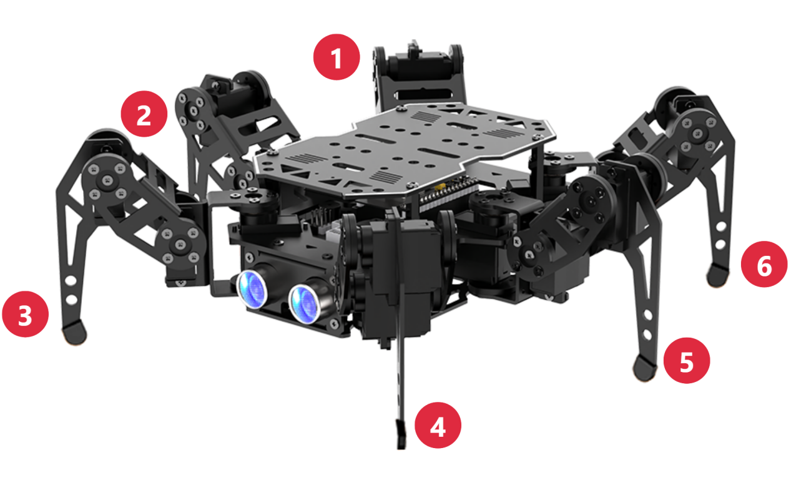

5. The diagram below is used to analyze tripod gait:

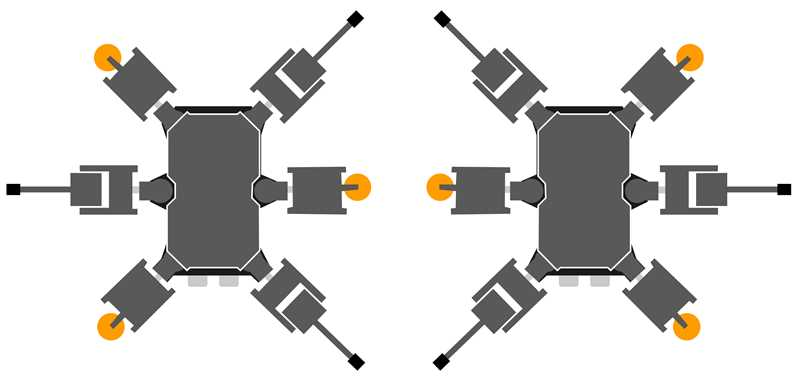

6. As shown on the right side of the figure, legs 2, 4, and 6 lift and swing forward. Legs 1, 3, and 5 support the body and keep the center of gravity at the intersection of the diagonals. At this time, legs 2, 4, and 6 are in the swing phase. Legs 1, 3, and 5 are in the stance phase.

7. Then all six legs touch the ground at the same time. Legs 1, 3, and 5 stay in place. Legs 2, 4, and 6 are farther forward. All legs are in the stance phase.

8. As shown on the left side of the figure, legs 1, 3, and 5 lift and swing forward. Legs 2, 4, and 6 support the body and keep the center of gravity at the intersection of the diagonals. At this time, legs 1, 3, and 5 are in the swing phase. Legs 2, 4, and 6 are in the stance phase.

9. Then all six legs touch the ground at the same time. Legs 2, 4, and 6 stay in place. Legs 1, 3, and 5 are farther forward. All legs are in the stance phase.

10. After these four actions are completed, the robot completes one full gait cycle.

#### 6.2.1.4 Robot Motion Process Analysis

This section uses one leg as an example to explain the motion process from the standing standby stage to the final standing return stage after movement is completed. For ease of description, assume the robot is standing still and receives a command to move straight forward.

**Initial Stage**

1. Before the robot receives the motion command, observe the middle leg in the figure below. It is touching the ground.

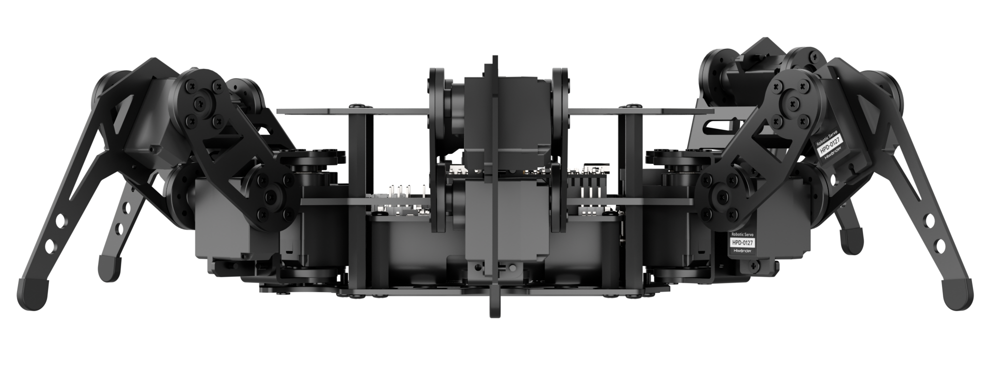

2. After the robot receives the motion command, overall movement begins. When the observed leg is ready to move, it lifts upward to the position directly above, which is the **initial position**, as shown below.

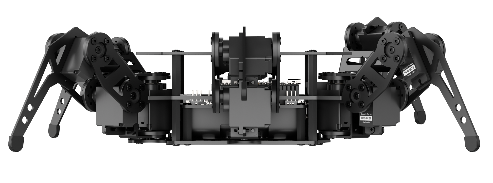

**Motion Stage**

1. During the motion stage, the leg always starts moving from the **initial position**.


2. Based on the motion parameters, the robot controls the leg to swing forward or backward. In the assumed scenario, the robot moves forward, so the leg first swings forward from top to bottom until the toe touches the ground, as shown below.

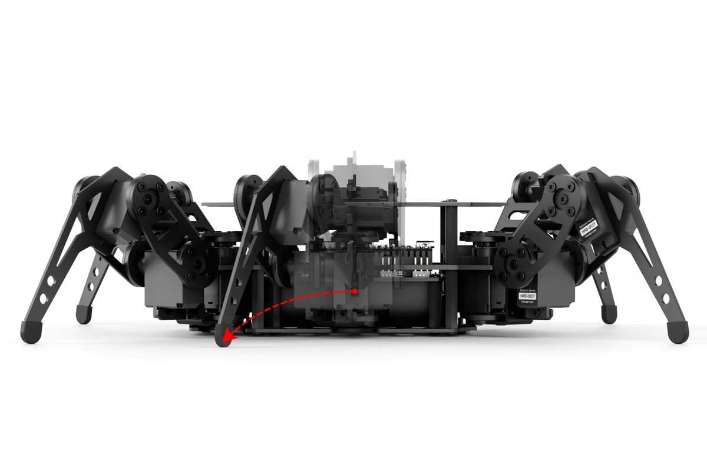

3. After the toe touches the ground, the leg continues to swing backward. The resulting force drives the robot forward, as shown below.

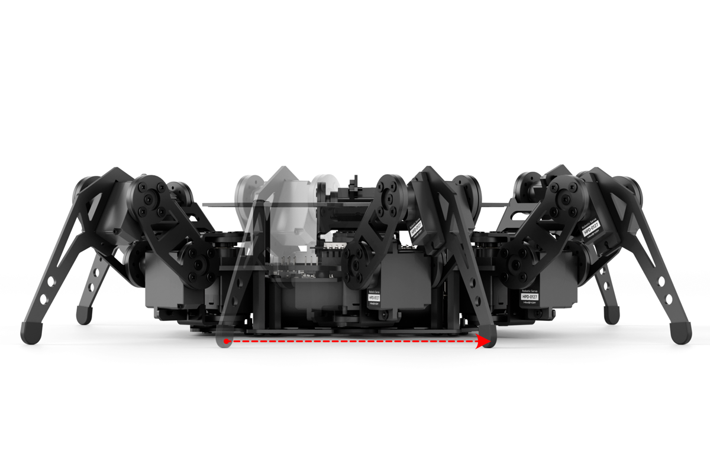

4. Finally, the leg swings upward from bottom to top and returns to the **initial position**. This completes one full motion cycle of the leg. In the `move` function, which is used to control body movement, the movement step count `step_num` can be specified. The movement step count refers to how many cycles one leg completes, starting from the **initial position**, landing on the ground, and swinging back to the **initial position**.

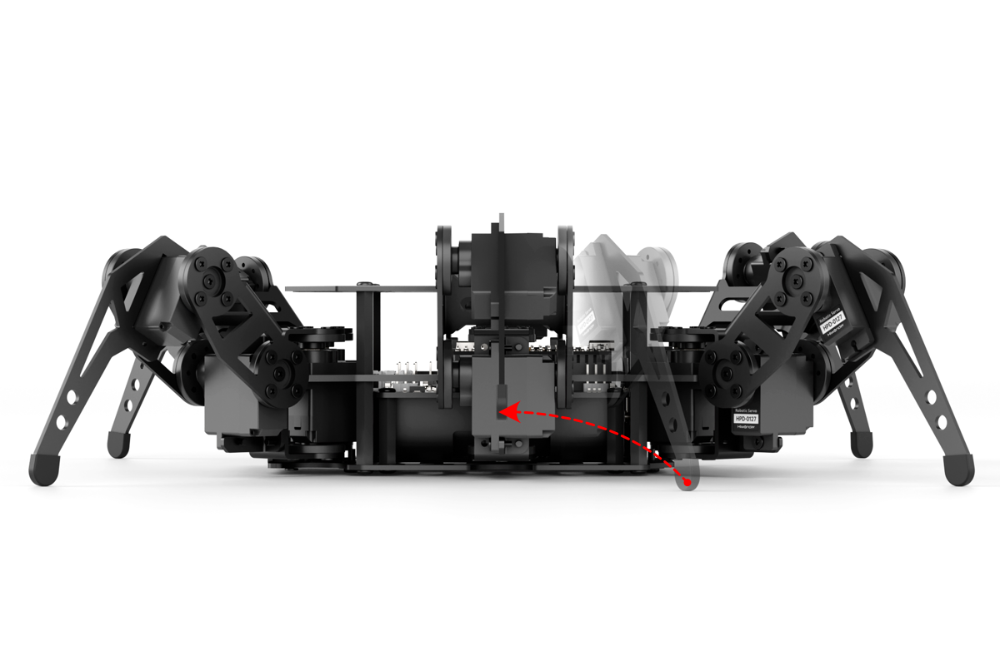

**Finishing Stage**

1. After the leg completes the last swing, it enters the finishing stage. The motion still starts from the **initial position**.


2. As shown below, the leg drops to the ground and completes the final finishing movement.


#### 6.2.1.5 Robot Kinematics Analysis

Because the overall motion of the robot involves the coupling of the gait algorithm and the inverse kinematics algorithm, analyzing the full system directly is relatively complex. Therefore, one leg is used here as an example so that the gait algorithm can be separated from the discussion and the kinematics can be analyzed directly.

**Single-Leg Structural Modeling**

1. The figure below shows the coordinate-system model of a single leg:

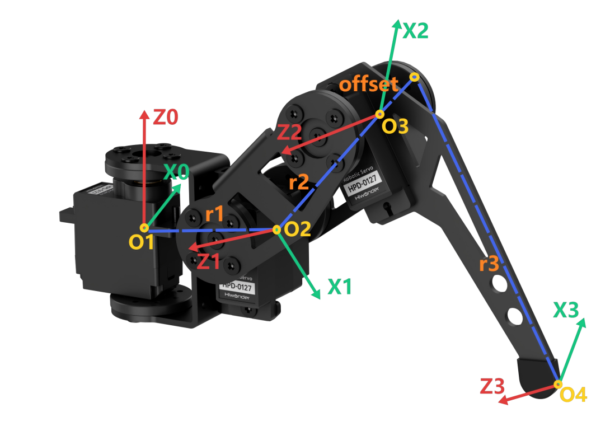

:::{Note}
* **In the actual design, a metal plate is mounted at joint `O3` at the end of the leg. Its width extends in the same direction as link r<sub>2</sub>. Therefore, in the following calculations, that width is treated as the foot-end offset `offset` and is included as part of link r<sub>2</sub>.**
* **In the D-H parameter table and in the forward and inverse kinematics derivations below, r<sub>2</sub> already includes the foot-end offset `offset`.**
:::


**D-H Parameter Table**

| i | d | theta | r | alpha |
|:--:|:--:|:--:|:--:|:--:|
| 1 | 0 | 0 | 2.85 | 90 |
| 2 | 0 | 0 | 5.2 | 0 |
| 3 | 0 | 0 | 7.2 | 0 |

Description of the four D-H parameters:

1. d is the offset of coordinate system a(i+1) relative to coordinate system a(i) along the Z(i) axis
2. theta is the angle between the X-axes of coordinate systems a(i) and a(i+1)
3. r is the mathematical length of the link
4. alpha is the angle from Z(i-1) to Z(i+1) after rotation around X(i)


**Single-Leg Forward Kinematics Overview**

1. Forward kinematics is a fundamental basis for trajectory planning in joint space and for robot control. For this robot, forward kinematics means calculating the foot-end coordinates from the rotation angles of the three servos on one leg.

2. The forward kinematics process is as follows: given the rotation angles of the three servos on one leg, determine the leg position and then calculate the corresponding foot-end coordinates.

**Single-Leg Forward Kinematics Derivation**

**Known parameters:** joint rotation angles Q<sub>1</sub>, Q<sub>2</sub>, and Q<sub>3</sub>

**Unknown parameters:** the D-H parameter table and the foot-end coordinates p<sub>x</sub>, p<sub>y</sub>, and p<sub>z</sub>

1. The transformation matrix expressions of each joint coordinate system are obtained as follows:

$$
T_{2}^{1} = \begin{bmatrix}
\cos(Q_{1}) & 0 & \sin(Q_{1}) & r_{1}\cos(Q_{1}) \\
\sin(Q_{1}) & 0 & - \cos(Q_{1}) & r_{1}\sin(Q_{1}) \\
0 & 1 & 0 & 0 \\
0 & 0 & 0 & 1
\end{bmatrix}
$$

$$
T_{3}^{2} = \begin{bmatrix}
\cos(Q_{2}) & - \sin(Q_{2}) & 0 & r_{2}\cos(Q_{2}) \\
\sin(Q_{2}) & \cos(Q_{2}) & 0 & r_{2}\sin(Q_{2}) \\
0 & 0 & 1 & 0 \\
0 & 0 & 0 & 1
\end{bmatrix}
$$

$$
T_{4}^{3} = \begin{bmatrix}
\cos(Q_{3}) & - \sin(Q_{3}) & 0 & r_{3}\cos(Q_{3}) \\
\sin(Q_{3}) & \cos(Q_{3}) & 0 & r_{3}\sin(Q_{3}) \\
0 & 0 & 1 & 0 \\
0 & 0 & 0 & 1
\end{bmatrix}
$$

2. By multiplying the matrices sequentially, the overall transformation matrix T<sup>1</sup><sub>4</sub> from the base coordinate system to the foot endpoint coordinate system can be obtained:

$$
T_{2}^{1}T_{3}^{2}T_{4}^{3} = T_{4}^{1} = \begin{bmatrix}
\cos(Q_{2} + Q_{3}) \cdot \cos(Q_{1}) & - \sin(Q_{2} + Q_{3}) \cdot \cos(Q_{1}) & \sin(Q_{1}) & px \\
\cos(Q_{2} + Q_{3}) \cdot \sin(Q_{1}) & - \sin(Q_{2} + Q_{3}) \cdot \sin(Q_{1}) & - \cos(Q_{1}) & py \\
\sin(Q_{2} + Q_{3}) & \cos(Q_{2} + Q_{3}) & 0 & pz \\
0 & 0 & 0 & 1
\end{bmatrix}
$$

3. Here p<sub>x</sub>, p<sub>y</sub>, and p<sub>z</sub> are the end-point coordinates, namely the foot-end coordinates. Their expressions are as follows:

$$
\begin{matrix}
px & = r_{1}\cos(Q_{1}) + r_{2}\cos(Q_{1})\cos(Q_{2}) + r_{3}\cos(Q_{1})\cos(Q_{2})\cos(Q_{3}) + r_{3}\cos(Q_{1})\sin(Q_{2})\sin(Q_{3}) \\
py & = r_{1}\sin(Q_{1}) + r_{2}\cos(Q_{2})\sin(Q_{1}) + r_{3}\cos(Q_{2})\cos(Q_{3})\sin(Q_{1}) - r_{3}\sin(Q_{1})\sin(Q_{2})\sin(Q_{3}) \\
pz & = r_{2}\sin(Q_{2}) + r_{3}\cos(Q_{2})\sin(Q_{3}) + r_{3}\cos(Q_{3})\sin(Q_{2})
\end{matrix}
$$

4. After further simplification:

$$
px = \cos(Q_{1}) \cdot (r_{1} + r_{3} \cdot \cos(Q_{2} + Q_{3}) + r_{2} \cdot \cos(Q_{2}))
$$

$$
py = \sin(Q_{1}) \cdot (r_{1} + r_{3} \cdot \cos(Q_{2} + Q_{3}) + r_{2} \cdot \cos(Q_{2}))
$$

$$
pz = r_{3} \cdot \sin(Q_{2} + Q_{3}) + r_{2} \cdot \sin(Q_{2})
$$

5. This yields the forward kinematics expressions that map servo rotation angles to foot-end coordinates.

**Single-Leg Inverse Kinematics Overview**

1. Inverse kinematics is a fundamental basis for trajectory planning based on the end effector and for robot control. For this robot, inverse kinematics means calculating the rotation angles of the three servos on one leg from the foot-end coordinates.

2. The inverse kinematics process is as follows: given the foot-end coordinates of one leg, determine the leg position and then solve for the corresponding servo rotation angles.

3. After the servo rotation angles are obtained, the corresponding values can be calculated to drive the servos directly and achieve robot motion control.

**Single-Leg Inverse Kinematics Derivation**

**Known parameters:** the D-H parameter table and the foot-end coordinates p<sub>x</sub>, p<sub>y</sub>, and p<sub>z</sub>

**Unknown parameters:** joint rotation angles Q<sub>1</sub>, Q<sub>2</sub>, and Q<sub>3</sub>

1. First, define a matrix that contains the known foot-end coordinates. It will later be multiplied by other matrices containing Q<sub>1</sub>, Q<sub>2</sub>, and Q<sub>3</sub> so that several expressions can be derived for further solving. From the forward kinematics derivation above, T<sup>1</sup><sub>4</sub> meets this requirement. Only the first three elements of the fourth column need to be considered here because they are known values:

$$
T = T_{4}^{1} = \begin{bmatrix}
ax & bx & cx & px \\
ay & by & cy & py \\
az & bz & cz & pz \\
0 & 0 & 0 & 1
\end{bmatrix}
$$

2. Based on the expression of the transformation matrix:

$$
(T_{2}^{1})^{- 1} \cdot T = (T_{2}^{1})^{- 1} \cdot T_{2}^{1} \cdot T_{3}^{2} \cdot T_{4}^{3} = T_{3}^{2} \cdot T_{4}^{3}
$$

3. Derive the expressions on both sides:

$$
(T_{2}^{1})^{- 1} \cdot T = \begin{bmatrix}
\cos(Q_{2} + Q_{3}) & - \sin(Q_{2} + Q_{3}) & 0 & px\cos(Q_{1}) - r_{1} + py\sin(Q_{1}) \\
\sin(Q_{2} + Q_{3}) & \cos(Q_{2} + Q_{3}) & 0 & pz \\
0 & 0 & 1 & px\sin(Q_{1}) - py\cos(Q_{1}) \\
0 & 0 & 0 & 1
\end{bmatrix}
$$

$$
T_{3}^{2} \cdot T_{4}^{3} = \begin{bmatrix}
\cos(Q_{2} + Q_{3}) & - \sin(Q_{2} + Q_{3}) & 0 & r_{3}\cos(Q_{2} + Q_{3}) + r_{2}\cos(Q_{2}) \\
\sin(Q_{2} + Q_{3}) & \cos(Q_{2} + Q_{3}) & 0 & r_{3}\sin(Q_{2} + Q_{3}) + r_{2}\sin(Q_{2}) \\
0 & 0 & 1 & 0 \\
0 & 0 & 0 & 1
\end{bmatrix}
$$

4. By equating the first three elements of the fourth column of these two matrices, three expressions are obtained:

`(1-1)`

$$
r_{3} \cdot \cos(Q_{2} + Q_{3}) = px \cdot \cos(Q_{1}) - r_{1} + py \cdot \sin(Q_{1}) - r_{2} \cdot \cos(Q_{2})
$$

`(1-2)`

$$
r_{3} \cdot \sin(Q_{2} + Q_{3}) = pz - r_{2} \cdot \sin(Q_{2})
$$

`(1-3)`

$$
px \cdot \sin(Q_{1}) - py \cdot \cos(Q_{1}) = 0
$$

5. Further derivation of equation `(1-3)` gives the expression for Q<sub>1</sub> in terms of p<sub>x</sub>, p<sub>y</sub>, and p<sub>z</sub>:

$$
Q_{1} = \arctan\left( \frac{px}{py} \right)
$$

6. By observing equations `(1-1)` and `(1-2)`, it can be seen that the two expressions contain trigonometric functions of Q<sub>2</sub> and Q<sub>2</sub>+Q<sub>3</sub>. The next step is to simplify them using the identity sin<sup>2</sup>x + cos<sup>2</sup>x = 1. First, isolate the parts that are not trigonometric functions of Q<sub>2</sub> and Q<sub>2</sub>+Q<sub>3</sub>, and consolidate them into m<sub>1</sub> and m<sub>2</sub>. **Since Q<sub>1</sub> has already been obtained above, both m<sub>1</sub> and m<sub>2</sub> are known values.**

$$
m_{1} = px \cdot \cos(Q_{1}) - r_{1} + py \cdot \sin(Q_{1})
$$

$$
m_{2} = pz
$$

7. After simplification, equations `(1-1)` and `(1-2)` can be rewritten as:

`(1-4)`

$$
r_{3} \cdot \cos(Q_{2} + Q_{3}) = m_{1} - r_{2} \cdot \cos(Q_{2})
$$

`(1-5)`

$$
r_{3} \cdot \sin(Q_{2} + Q_{3}) = m_{2} - r_{2} \cdot \sin(Q_{2})
$$

8. Square both sides of equations `(1-4)` and `(1-5)`, then add the left-hand sides and the right-hand sides respectively to obtain:

`(1-6)`

$$
{r_{3}}^{2} = {r_{2}}^{2} - 2 \cdot \cos(Q_{2}) \cdot r_{2} \cdot m_{1} - 2 \cdot \sin(Q_{2}) \cdot r_{2} \cdot m_{2} + {m_{1}}^{2} + {m_{2}}^{2}
$$

9. Further consolidate parts of the expression above. From the following definitions, n<sub>1</sub>, n<sub>2</sub>, and n<sub>3</sub> are **all known values**:

$$
n_{1} = 2 \cdot r_{2} \cdot m_{1}
$$

$$
n_{2} = 2 \cdot r_{2} \cdot m_{2}
$$

$$
n_{3} = {r_{2}}^{2} + {m_{1}}^{2} + {m_{2}}^{2} - {r_{3}}^{2}
$$

10. After further simplification of equation `(1-6)`:

$$
n_{1} \cdot \cos(Q_{2}) + n_{2} \cdot \sin(Q_{2}) = n_{3}
$$

11. Further derivation yields the expression for Q<sub>2</sub> in terms of p<sub>x</sub>, p<sub>y</sub>, and p<sub>z</sub>:

$$
Q_{2} = \arctan\left( \frac{{n_{1}}^{2} + {n_{2}}^{2} - {n_{3}}^{2}}{n_{3}} \right) + \arctan\left( \frac{n_{2}}{n_{1}} \right)
$$

12. Substitute the expression for Q<sub>2</sub> back into equation `(1-4)` or `(1-5)` to obtain the expression for Q<sub>3</sub>:

$$
Q_{3} = \arctan\left( \frac{m_{2} - r_{2}\sin Q_{2}}{m_{1} - r_{2}\cos Q_{2}} \right) - Q_{2}
$$

13. After consolidation, the inverse kinematics expressions for the joint rotation angles Q<sub>1</sub>, Q<sub>2</sub>, and Q<sub>3</sub> are listed again below:

$$
Q_{1} = \arctan\left( \frac{px}{py} \right)
$$

$$
Q_{2} = \arctan\left( \frac{{n_{1}}^{2} + {n_{2}}^{2} - {n_{3}}^{2}}{n_{3}} \right) + \arctan\left( \frac{n_{2}}{n_{1}} \right)
$$

$$
Q_{3} = \arctan\left( \frac{m_{2} - r_{2}\sin Q_{2}}{m_{1} - r_{2}\cos Q_{2}} \right) - Q_{2}
$$

### 6.2.2 Omnidirectional Movement

#### 6.2.2.1 Feature Overview

This section controls miniHexa to move in different directions.

#### 6.2.2.2 Project Process

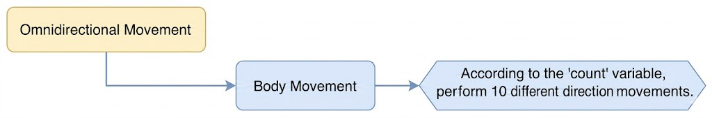

#### 6.2.2.3 Program Download

1. Connect miniHexa to the PC with a Type-C data cable.


2. Open [**02 Program Files/01 Omnidirectional Movement Program/main.py**](https://drive.google.com/drive/folders/1uNtXFtk8j5LnsFnA0_OqDljBBz_XE2NG?usp=sharing) in the same path as this document.

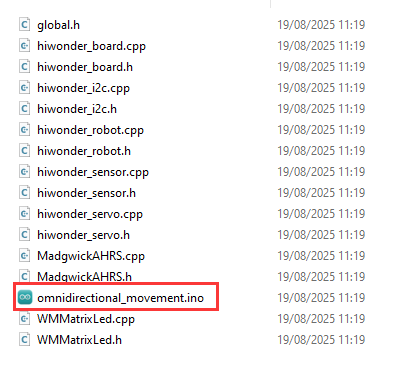

3. After the file is opened, select the development board model shown below:


4. Click **Tools** in the menu bar and select the corresponding ESP32 development board configuration as shown below.


:::{Note}
**Make sure to modify the development board configuration before program download.**
:::

5. Click **Compile** first, then click **Upload**. When the output panel at the bottom displays the success message, the program has been downloaded successfully.


#### 6.2.2.4 Project Outcome

After power-on, the hexapod robot cycles through movement in ten directions: forward, forward-right, right, backward-right, backward, backward-left, left, forward-left, turn left in place, and turn right in place.

#### 6.2.2.5 Program Analysis

1. Import the `hiwonder_robot.h` library file. This library contains the low-level control interfaces of the robot.

```cpp
    #include "hiwonder_robot.h"
```

2. Initialize the `miniHexa` object and define the motion mode variable `count`. Then create the robot motion arrays `vel`, `pos`, and `att`, which represent velocity, position, and Euler angles.

```cpp
    // Initialize miniHexa object
    Robot minihexa;
    
    // Define variable `count` to record the motion mode
    uint8_t count = 0;
    // Initialize motion state
    Velocity_t vel = {0.0f,0.0f,0.0f};
    Vector_t pos = {0.0f,0.0f,0.0f};
    Euler_t att = {0.0f,0.0f,0.0f};
```

3. In the `setup()` function, set the initial serial communication baud rate to `115200`, then initialize the robot.

```cpp
   void setup() {
     Serial.begin(115200);
     minihexa.begin();
   }
```

4. In the `loop()` main function, the ten different movement directions are executed cyclically according to the loop of variable `count`. By modifying the three parameters in `vel`, the direction of body movement can be changed. The first parameter of `vel` controls the left and right movement speed of the body along the X-axis. The second parameter controls the forward and backward movement speed of the body along the Y-axis. The third parameter controls the in-place rotation speed of the body around the Z-axis. After `vel` is passed into the `move` function, the robot starts moving according to the specified parameters. After `5.5 s`, the next group of motion parameters is passed into the `move` function, and the robot switches to the next motion state.

```cpp
    void loop() {
      switch(count) {
        case 0:// Forward
          count++;
          vel = {0.0f, 3.0f, 0.0f};
          break;
      
        case 1:// Forward-right
          count++;
          vel = {2.0f, 2.0f, 0.0f};
          break;

        case 2:// Move right
          count++;
          vel = {3.0f, 0.0f, 0.0f};
          break;

        case 3:// Backward-right
          count++;
          vel = {2.0f, -2.0f, 0.0f};
          break;

        case 4:// Backward
          count++;
          vel = {0.0f, -3.0f, 0.0f};
          break;

        case 5:// Backward-left
          count++;
          vel = {-2.0f, -2.0f, 0.0f};
          break;

        case 6:// Move left
          count++;
          vel = {-3.0f, 0.0f, 0.0};
          break;

        case 7:// Forward-left
          count++;
          vel = {-2.0f, 2.0f, 0.0f};
          break;

        case 8:// Turn left in place
          count++;
          vel = {0.0f, 0.0f, 2.0f};
          break;

        case 9:// Turn right in place
          count = 0;
          vel = {0.0f, 0.0f, -2.0f};
          break;
      }
      delay(5500);
      minihexa.move(&vel, &pos, &att, 1800, 3);
    }
```

5. `case 0` is used here as an example. The movement direction of the body is mainly changed by modifying the parameters of `vel`. When the Y-axis speed is set to `3`, the body moves forward.

```cpp
    case 0:// Forward
      count++;
      vel = {0.0f, 3.0f, 0.0f};  // Set the Y-axis speed to 3 so the body moves forward
      break;
```

6. `case 1` is used here as an example. Set the X-axis speed to `2` so the body translates to the right. Then add a Y-axis speed of `2` so the body moves forward. Under the combined effect of these two directions, the body moves toward the forward-right direction.

```cpp
    case 1:// Forward-right
      count++;
      vel = {2.0f, 2.0f, 0.0f};  // X-axis speed 2 to the right and Y-axis speed 2 forward
      break;
```

7. `case 8` is used here as an example. Set the Z-axis speed to `2.0f`, and the body rotates to the left in place.

```cpp
    case 8:// Turn left in place
      count++;
      vel = {0.0f, 0.0f, 2.0f};  // Z-axis speed 2 so the body turns left in place
      break;
```

### 6.2.3 Turn Left and Right

#### 6.2.3.1 Feature Overview

This section controls miniHexa to perform left and right turning motion.

#### 6.2.3.2 Project Process

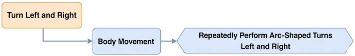

<p id ="6.2.3.3"></p>

#### 6.2.3.3 Program Download

1. Connect miniHexa to the PC with a Type-C data cable.


2. Open [**02 Program Files/02 Left and Right Turning Program/main.py**](https://drive.google.com/drive/folders/1vMsBARtXyrJA-8BzI48BBA0r40aCKdmS?usp=sharing) in the same path as this document.

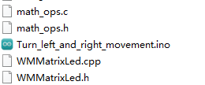

3. After the file is opened, select the development board model shown below:


4. Click **Tools** in the menu bar and select the corresponding ESP32 development board configuration as shown below.


:::{Note}
**Make sure to modify the development board configuration before program download.**
:::

5. Click **Compile** first, then click **Upload**. When the output panel at the bottom displays the success message, the program has been downloaded successfully.


#### 6.2.3.4 Project Outcome

After power-on, the hexapod robot repeatedly performs left and right arc turns.

#### 6.2.3.5 Program Analysis

1. Import the `hiwonder_robot.h` library file. This library contains the low-level control interfaces of the robot.

```cpp
    #include "hiwonder_robot.h"
```

2. Initialize the `miniHexa` object and create the robot motion arrays `vel`, `pos`, and `att`, which represent velocity, position, and Euler angles.

```cpp
    // Initialize miniHexa object
    Robot minihexa;

    // Initialize motion state
    Velocity_t vel = {0.0f,0.0f,0.0f};
    Vector_t pos = {0.0f,0.0f,0.0f};
    Euler_t att = {0.0f,0.0f,0.0f};
```

3. In the `setup()` function, set the initial serial communication baud rate to `115200`, then initialize the robot.

```cpp
    void setup() {
      Serial.begin(115200);
      minihexa.begin();
    }
```

4. In the `loop()` main function, the robot repeatedly performs left and right turns by changing the `vel` array. First execute a left arc turn. Set the Y-axis speed in `vel` to `5` so the robot translates forward. Set the Z-axis speed to `0.2` so the robot rotates to the left. The combined effect of these two motions makes the robot turn left.

```cpp
    void loop() {
        vel = {0.0f, 5.0f, 0.2f};// Left arc forward
        minihexa.move(&vel, &pos, &att);// Execute movement
        delay(5000);
    }
```

5. Set the Y-axis speed to `5` and the Z-axis speed to `-0.2` to make the robot turn right.

```cpp
        vel = {0.0f, 5.0f, -0.2f};// Right arc forward
        minihexa.move(&vel, &pos, &att);// Execute movement
        delay(5000);
    }
```

#### 6.2.3.6 Feature Extension

**This section uses changing the turning angle of miniHexa as an example to show how to modify the turning angle.** Refer to the steps below:

1. Locate the turning code in the main function.

```cpp
    void loop() {
        vel = {0.0f, 5.0f, 0.2f};// Left arc forward
        minihexa.move(&vel, &pos, &att);// Execute movement
        delay(5000);

        vel = {0.0f, 5.0f, -0.2f};// Right arc forward
        minihexa.move(&vel, &pos, &att);// Execute movement
        delay(5000);
    }
```

2. Modify the third value `omega` in `vel`. Here it is changed to `0.3f` to increase the turning angle.

:::{Note}
**The third `omega` value in `vel` should not be set too high. Otherwise, the effect of left rotation will greatly exceed the effect of forward translation, and the robot will behave more like it is rotating in place.**
:::

```cpp
void loop() {
    vel = {0.0f, 5.0f, 0.3f};// Left arc forward with a larger turning angle
    minihexa.move(&vel, &pos, &att);// Execute movement
    delay(5000);

    vel = {0.0f, 5.0f, -0.3f};// Right arc forward with a larger turning angle
    minihexa.move(&vel, &pos, &att);// Execute movement
    delay(5000);
}
```

3. After the modification is completed, refer to [6.2.3.3 Program Download](#6.2.3.3) to run the program.

### 6.2.4 Speed Adjustment

#### 6.2.4.1 Feature Overview

This section controls miniHexa to move at different speeds.

#### 6.2.4.2 Project Process

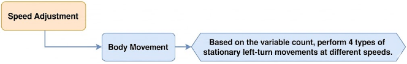

#### 6.2.4.3 Program Download

1. Connect miniHexa to the PC with a Type-C data cable.


2. Open [**02 Program Files/03 Speed Adjustment Program/main.py**](https://drive.google.com/drive/folders/1OsNIM8XQQgXWV5ALEFPNpgF5ZB11HFej?usp=sharing) in the same path as this document.


3. After the file is opened, select the development board model shown below:


4. Click **Tools** in the menu bar and select the corresponding ESP32 development board configuration as shown below.


:::{Note}
**Make sure to modify the development board configuration before program download.**
:::

5. Click **Compile** first, then click **Upload**. When the output panel at the bottom displays the success message, the program has been downloaded successfully.


#### 6.2.4.4 Project Outcome

After power-on, the hexapod robot repeatedly performs left rotation in place from slow to fast. The speed increases by `0.5` each time, from `0.5` to `2.0`, then returns to `0.5` and repeats in sequence.

#### 6.2.4.5 Program Analysis

1. Import the `hiwonder_robot.h` library file. This library contains the low-level control interfaces of the robot.

```cpp
    #include "hiwonder_robot.h"
```

2. Initialize the `miniHexa` object, define the variable `count`, and create the robot motion arrays `vel`, `pos`, and `att` for velocity, position, and Euler angles.

```cpp
    Robot minihexa;

    uint8_t count = 0;
    // Initialize robot motion
    Velocity_t vel = {0.0f,0.0f,0.0f};
    Vector_t pos = {0.0f,0.0f,0.0f};
    Euler_t att = {0.0f,0.0f,0.0f};
```

3. In the `setup()` function, set the initial serial communication baud rate to `115200`, then initialize the robot.

```cpp
    void setup() {
      Serial.begin(115200);
      minihexa.begin();
    }
```

4. In the `loop()` main function, four different movement speeds are executed cyclically according to the changing value of variable `count`.

```cpp
    void loop() {
      switch(count) {
        case 0:// Slowest left turn in place
          count++;
          vel = {0.0f, 0.0f, 1.0f};
          delay(5000);
          break;
      
        case 1:// Slower left turn in place
          count++;
          vel = {0.0f, 0.0f, 1.5f};
          delay(5000);
          break;

        case 2:// Medium-speed left turn in place
          count++;
          vel = {0.0f, 0.0f, 2.0f};
          delay(5000);
          break;

        case 3:// High-speed left turn in place
          count = 0;
          vel = {0.0f, 0.0f, 2.5f};
          delay(5000);
          break;
      }

      minihexa.move(&vel, &pos, &att);// Execute movement
    }
```

5. In the `switch` statement, the rotation speed of miniHexa is changed by modifying the variable `count` and the `vel` array.

```cpp
        case 0:// Slowest left turn in place
          count++;
          vel = {0.0f, 0.0f, 1.0f};  // Z-axis speed 1.0 for the slowest speed
          delay(5000);
          break;
```

### 6.2.5 Gait Parameter Adjustment

#### 6.2.5.1 Feature Overview

This section modifies the gait parameters of miniHexa so the robot can move in different postures.

#### 6.2.5.2 Project Process

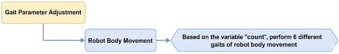

#### 6.2.5.3 Program Download

1. Connect miniHexa to the PC with a Type-C data cable.


2. Open [**02 Program Files/04 Gait Parameter Adjustment Program/main.py**](https://drive.google.com/drive/folders/1HkwBPimfWdRVCInU86PGFtDfNhgNWkpJ?usp=sharing) in the same path as this document.


3. After the file is opened, select the development board model shown below:


4. Click **Tools** in the menu bar and select the corresponding ESP32 development board configuration as shown below.


:::{Note}
**Make sure to modify the development board configuration before program download.**
:::

5. Click **Compile** first, then click **Upload**. When the output panel at the bottom displays the success message, the program has been downloaded successfully.


#### 6.2.5.4 Project Outcome

After power-on, the hexapod robot repeatedly performs movement in six different gait modes.

#### 6.2.5.5 Program Analysis

1. Import the `hiwonder_robot.h` library file. This library contains the low-level control interfaces of the robot.

```cpp
    #include "hiwonder_robot.h"
```

2. Initialize the `miniHexa` object and define the variable `count`. Create `step_num`, which is the number of iterations in the motion discretization process, and `move_time`, which is the motion duration. Then create the robot motion arrays `vel`, `pos`, and `att`, which represent velocity, position, and Euler angles.

```cpp
    // Initialize miniHexa object
    Robot minihexa;

    // Define motion mode variable `count`
    uint8_t count = 0;
    // Number of iterations in the discretized motion process, which is the foothold count
    int step_num = -1;
    // Initialize motion duration
    uint32_t move_time = 1000;
    // Leg lift height
    float leg_lift = 2.0f;
    // Initialize body motion
    Velocity_t vel = {0.0f,0.0f,0.0f};
    Vector_t pos = {0.0f,0.0f,0.0f};
    Euler_t att = {0.0f,0.0f,0.0f};
```

3. In the `setup()` function, set the initial serial communication baud rate to `115200`, then initialize miniHexa.

```cpp
    void setup() {
      Serial.begin(115200);
      minihexa.begin();
    }
```

4. In the `loop()` main function, six different gait modes are executed cyclically according to the changing value of variable `count`.

```cpp
    void loop() {
      switch(count) {
        case 0:
          count++;
          vel = {0.0f, 2.0f, 0.0f};// Forward
          move_time = 600;// Define runtime
          step_num = 3;
          break;
      
        case 1:
          count++;
          vel = {0.0f, 2.0f, 0.0f};
          move_time = 1000;
          step_num = 2;
          break;

        case 2:
          count++;
          vel = {0.0f, -2.0f, 0.0f};
          move_time = 600;
          step_num = 3;
          break;

        case 3:
          count++;
          vel = {0.0f, -2.0f, 0.0f};
          move_time = 1000;
          step_num = 2;
          break;

        case 4:
          count++;
          vel = {0.0f, 0.0f, 2.0f};
          move_time = 600;
          step_num = 2;
          break;

        case 5:
          vel = {0.0f, 0.0f, -2.0f};
          move_time = 1000;
          step_num = -1;
          break;
      }

      minihexa.move(&vel, &pos, &att, move_time, step_num);
      delay(4000);
    }
```

5. The parameters that affect gait are `move_time`, which is the motion duration, and `step_num`, which is the foothold count. The robot gait can be changed by modifying these parameters. In `case 0`, the Y-axis speed in `vel` is set to `2.0`, the motion duration is set to `600 ms`, and the foothold count is `3`. In this state, the robot moves forward along the positive Y-axis at a speed of `2.0`. The motion lasts `600 ms` and completes `3` footholds.

```cpp
        case 0:
          count++;
          vel = {0.0f, 2.0f, 0.0f};// Forward
          move_time = 600;// Define runtime
          step_num = 3;
          break;
```

6. In `case 5`, the motion duration is set to `1000 ms` and the foothold count is set to `-1`, which means continuous walking. In this state, the robot continuously performs the specified movement pattern for `1000 ms`.

```cpp
        case 5:
          vel = {0.0f, 0.0f, -2.0f};
          move_time = 1000;
          step_num = -1;
          break;
```

### 6.2.6 Posture Adjustment

#### 6.2.6.1 Feature Overview

This section changes the motion posture of the hexapod robot by modifying posture parameters.

#### 6.2.6.2 Project Process

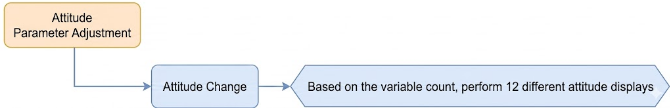

#### 6.2.6.3 Program Download

1. Connect miniHexa to the PC with a Type-C data cable.


2. Open [**02 Program Files/05 Posture Adjustment Program/main.py**](https://drive.google.com/drive/folders/1DDnhawDuzzb2EGBCW40R3joRMjzIQDxi?usp=sharing) in the same path as this document.

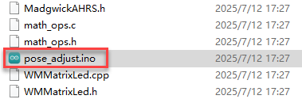

3. After the file is opened, select the development board model shown below:


4. Click **Tools** in the menu bar and select the corresponding ESP32 development board configuration as shown below.


:::{Note}
**Make sure to modify the development board configuration before program download.**
:::

5. Click **Compile** first, then click **Upload**. When the output panel at the bottom displays the success message, the program has been downloaded successfully.


#### 6.2.6.4 Project Outcome

After power-on, miniHexa repeatedly changes among `12` different postures.

#### 6.2.6.5 Program Analysis

1. Import the `hiwonder_robot.h` library file. This library contains the low-level control interfaces of the robot.

```cpp
    #include "hiwonder_robot.h"
```

2. Initialize the `miniHexa` object. Then initialize the variable `count` and create the robot motion arrays `vel`, `pos`, and `att`, which represent velocity, position, and Euler angles.

```cpp
    Robot minihexa;

    uint8_t count = 0;
    Velocity_t vel = {0.0f,0.0f,0.0f};
    Vector_t pos = {0.0f,0.0f,0.0f};
    Euler_t att = {0.0f,0.0f,0.0f};
```

3. In the `setup()` function, set the initial serial communication baud rate to `115200`, then initialize the robot.

```cpp
    void setup() {
      Serial.begin(115200);
      minihexa.begin();
    }
```

4. In the `loop()` main function, twelve different posture movements are executed cyclically according to the changing value of variable `count`.

```cpp
    void loop() {
      switch(count) {
        case 0:
          count++;
          pos = {3.0f, 0.0f, 0.0f};
          att = {0.0f, 0.0f, 0.0f};
          delay(1000);
          break;
      
        case 1:
          count++;
          pos = {0.0f, 3.0f, 0.0f};
          delay(1000);
          break;

        case 2:
          count++;
          pos = {-3.0f, 0.0f, 0.0f};
          delay(1000);
          break;

        case 3:
          count++;
          pos = {0.0f, -3.0f, 0.0f};
          delay(1000);
          break;

        case 4:
          count++;
          pos = {0.0f, 0.0f, 3.0f};
          delay(1000);
          break;

        case 5:
          count++;
          pos = {0.0f, -2.0f, -1.0f};
          delay(1000);
          break;

        case 6:
          count++;
          att = {8.0f, 0.0f, 0.0f};
          pos = {0.0f, 0.0f, 0.0f};
          delay(1000);
          break;

        case 7:
          count++;
          att = {-8.0f, 0.0f, 0.0};
          delay(1000);
          break;

        case 8:
          count++;
          att = {0.0f, 12.0f, 0.0f};
          delay(1000);
          break;

        case 9:
          count++;
          att = {0.0f, -12.0f, 0.0f};
          delay(1000);
          break;

        case 10:
          count++;
          att = {0.0f, 0.0f, 12.0f};
          delay(1000);
          break;
      
        case 11:
          count = 0;
          att = {0.0f, 0.0f, -12.0f};
          delay(1000);
          break;
      }

      minihexa.move(&vel, &pos, &att, 600);
    }
```

5. The three parameters in the `pos` center-of-gravity position array control posture translation of miniHexa along the X-axis, Y-axis, and Z-axis. The first parameter controls left and right translation of the body center of gravity along the X-axis. The second parameter controls forward and backward translation along the Y-axis. The third parameter controls the height of the body center of gravity along the Z-axis. Modify the corresponding parameter values to change the body posture.

```cpp
        case 0:
          count++;
          pos = {3.0f, 0.0f, 0.0f};  // Shift the center of gravity 3.0 to the right along the X-axis
          att = {0.0f, 0.0f, 0.0f};
          delay(1000);
          break;
      
        case 1:
          count++;
          pos = {0.0f, 3.0f, 0.0f};  // Shift the center of gravity forward by 3.0 along the Y-axis
          delay(1000);
          break;

        case 4:
          count++;
          pos = {0.0f, 0.0f, 3.0f};  // Shift the center of gravity upward by 3.0 along the Z-axis
          delay(1000);
          break;
```

6. The three parameters in the `att` posture array control posture tilt of miniHexa around the X-axis, Y-axis, and Z-axis. The first parameter is the Euler angle around the X-axis, which controls pitch. The second parameter is the Euler angle around the Y-axis, which controls roll. The third parameter is the Euler angle around the Z-axis, which controls yaw. Modify the corresponding parameter values on each axis to change the body posture.

```cpp
        case 6:
          count++;
          att = {8.0f, 0.0f, 0.0f};  // Pitch 8 degrees around the X-axis
          pos = {0.0f, 0.0f, 0.0f};
          delay(1000);
          break;
    
        case 8:
          count++;
          att = {0.0f, 12.0f, 0.0f};  // Roll 12 degrees around the Y-axis
          delay(1000);
          break;
    
        case 10:
          count++;
          att = {0.0f, 0.0f, 12.0f};  // Yaw 12 degrees around the Z-axis
          delay(1000);
          break;
```

## 6.3 Secondary Development Project

### 6.3.1 Action Group Introduction and Practice

#### 6.3.1.1 Feature Overview

This section introduces the action groups in miniHexa and explains how to control an action group with a program.

An action group is a predefined sequence of movement steps. It allows the robot to complete a specific task according to the preset sequence, such as moving or dancing.

miniHexa includes `14` built-in action groups. These action groups can be called directly. The corresponding action group names are shown in the table below:

| **Action Group No.** | **Action**              |
| -------------------- | ----------------------- |
| 1                    | Counterclockwise Twist  |
| 2                    | Clockwise Twist         |
| 3                    | Wake Up                 |
| 4                    | Wake-Up Run             |
| 5                    | Acting Cute             |
| 6                    | Obstacle Crossing       |
| 7                    | Battle 1                |
| 8                    | Battle 2                |
| 9                    | Left Foot Forward Kick  |
| 10                   | Left Foot Right Kick    |
| 11                   | Right Foot Forward Kick |
| 12                   | Right Foot Left Kick    |
| 13                   | Door Push               |
| 14                   | Wave                    |

#### 6.3.1.2 Project Process


#### 6.3.1.3 Action Group Download

1. Connect miniHexa to the PC with a Type-C data cable.


2. Open the Hiwonder Python Editor.


3. Right-click **Local Project -> Switch Project Path** on the left side of the editor.


4. Select [**2. Software/10. Action Group Files**](https://drive.google.com/drive/folders/1bR30Kn7b84IqUfwQ5Mr-kZmwecwTGkwo?usp=sharing), then click **Select Folder**.


5. Click the connection icon in the menu bar . After the connection succeeds, the icon turns green .

6. Select all imported action group files. Right-click and select **Download** to download the action groups to miniHexa. Wait until the information panel below shows that all action groups have been downloaded successfully.


7. After the download is complete, click **Device** to confirm that the action groups have been downloaded to miniHexa.


#### 6.3.1.4 Program Download

1. Connect miniHexa to the PC with a Type-C data cable.


2. Open the Hiwonder Python Editor.


3. Open [**02 Program Files/01 Action Group Program/main.py**](https://drive.google.com/drive/folders/1rlNyq0hckdxzli9-WtJB_2z8EdqdWCWR?usp=sharing), then drag it into the Hiwonder Python Editor. The drag operation takes effect only when the file is dropped inside the red box.


4. Click the connection icon in the menu bar . After the connection succeeds, the icon turns green .

5. After the connection succeeds, click the download icon  in the menu bar to download the program to miniHexa. Wait until the information panel below shows that the download is complete.


#### 6.3.1.5 Project Outcome

After power-on, miniHexa runs action group `5`, which is **Acting Cute**.

#### 6.3.1.6 Program Analysis

1. Import the libraries. The `Hiwonder` library is used for robot control. The `time` library is used for delay control.

```python
import Hiwonder  # Import the Hiwonder robot control library
import time      # Import the time module for delay control
```

2. Create the robot object.

```python
# Create robot object
robot = Hiwonder.Robot()
```

3. Call `action_run()`. Parameter `5` calls action group No. `5`.

```python
# Execute action group 5. Acting Cute
robot.action_run(5)
time.sleep(4)
```

4. Reset the robot to the initial state.

```python
# Reset the robot to the initial state
robot.reset()
```

### 6.3.2 Intelligent Voice Control

#### 6.3.2.1 Feature Overview

This section uses the sound sensor to detect sound intensity and controls robot movement based on the detected value.

#### 6.3.2.2 Project Process


#### 6.3.2.3 Module Description


The onboard sound sensor detects ambient sound intensity. The sound level can be obtained by reading the value on the `ADC` pin. Sound causes the microphone diaphragm to vibrate. This changes the capacitance and generates a corresponding small voltage change, which is then converted into an electrical signal for output.

#### 6.3.2.4 Program Download

1. Connect miniHexa to the PC with a Type-C data cable.


2. Open the Hiwonder Python Editor.


3. Open [**02 Intelligent Voice Control Program/main.py**](https://drive.google.com/drive/folders/1asy2QZ-2J_E-mqAMAUdrCQgn5jjbIoWV?usp=sharing), then drag it into the Hiwonder Python Editor. The drag operation takes effect only when the file is dropped inside the red box.


4. Click the connection icon in the menu bar . After the connection succeeds, the icon turns green .

5. After the connection succeeds, click the download icon  in the menu bar to download the program to miniHexa. Wait until the information panel below shows that the download is complete.


#### 6.3.2.5 Project Outcome

After power-on, miniHexa moves into its initial standing pose and then continuously monitors ambient sound. When the detected sound value is greater than `20`, miniHexa moves forward.

#### 6.3.2.6 Program Analysis

1. Import the libraries. The `Hiwonder` library handles robot control, `Hiwonder_DEV` provides access to external sensors, and `time` is used for delays and timing.

```python
import Hiwonder
import Hiwonder_DEV
import time
```

2. Create the robot object and the sound sensor object.

```python
robot = Hiwonder.Robot()
sound = Hiwonder.Sound()
```

3. In the main loop, first read the sound value `val` detected by the sound module. Then check whether the value is greater than `20`. If it is, execute forward movement.

```python
while True:
  val = sound.read()
  if(val >20):
    robot.go([0.0, 2.0, 0.0] , 1 , 1000)
    time.sleep(1)
  time.sleep_ms(10)
```

### 6.3.3 Ultrasonic Distance Measurement

#### 6.3.3.1 Feature Overview

This section uses the glowy ultrasonic module to detect distance and controls the RGB LED color of the module based on the measured distance.

#### 6.3.3.2 Project Process


#### 6.3.3.3 Module Description

The glowy ultrasonic module integrates an `IIC Port`. It supports reading the measured distance data from the ultrasonic sensor through the `IIC` protocol. Two RGB LEDs are integrated at the ultrasonic probe position. The brightness can be adjusted, and multiple colors can be displayed by changing and combining the `R`, `G`, and `B` channels.


During ranging, the module automatically sends eight `40 kHz` square waves and then checks whether a return signal is received. If a signal is received, the module outputs a high level. The duration of the high level is the travel time of the ultrasonic signal from transmission to return.

:::{Note}
**The glowy ultrasonic module is already connected to the onboard `IIC Port` at the factory. No additional wiring is required.**
:::

#### 6.3.3.4 Program Download

1. Connect miniHexa to the PC with a Type-C data cable.


2. Open the Hiwonder Python Editor.


3. Open [**03 Ultrasonic Distance Measurement Program/main.py**](https://drive.google.com/drive/folders/1asy2QZ-2J_E-mqAMAUdrCQgn5jjbIoWV?usp=sharing), then drag it into the Hiwonder Python Editor. The drag operation takes effect only when the file is dropped inside the red box.


4. Click the connection icon in the menu bar . After the connection succeeds, the icon turns green .

5. After the connection succeeds, click the download icon  in the menu bar to download the program to miniHexa. Wait until the information panel below shows that the download is complete.


#### 6.3.3.5 Project Outcome

When an object moves close to the glowy ultrasonic module, the RGB LED color changes according to the detected distance:

- `0 < distance <= 8` changes to red.
- `8 < distance <= 18` changes to a red gradient.
- `18 < distance <= 32` changes to a blue gradient.
- `32 < distance <= 50` changes to a green gradient.
- `distance > 50` changes to green.

#### 6.3.3.6 Program Analysis

1. Import the libraries. The `Hiwonder` library handles robot control, `Hiwonder_DEV` provides access to external sensors, and `time` is used for delays and timing.

```python
import Hiwonder
import Hiwonder_DEV
import time
```

2. Create the robot object and the ultrasonic sensor object.

```python
# Create robot and ultrasonic sensor objects
robot = Hiwonder.Robot()
sonar = Hiwonder_DEV.DEV_SONAR()
```

3. Initialize the RGB LEDs to white.

```python
# Initialize the RGB LEDs to white
sonar.setRGB(0, 255, 255, 255)  # Parameter 1 is the LED index. 0 means both LEDs
                                # Parameters 2 to 4 are the RGB values. 255,255,255 means white
```

4. Map the input value `x` linearly from the input range `[in_min, in_max]` to the output range `[out_min, out_max]`.

```python
def map_value(x, in_min, in_max, out_min, out_max):
    """Map a value from one range to another range"""
    return int((x - in_min) * (out_max - out_min) / (in_max - in_min) + out_min)
```

5. In the `while True` main loop, read the distance detected by the glowy ultrasonic module. Then change the RGB color according to the measured `distance` and print the distance value through the serial port.

6. When `0 < distance <= 8`, the RGB LEDs are set to red.

```python
    # Set the RGB color according to the distance
    if distance > 0 and distance <= 8:
        # Breathing light mode in red. The actual breathing effect requires further implementation
        r, g, b = 255, 0, 0
```

7. When `8 < distance <= 18`, the RGB LEDs display a red gradient.

```python
    elif distance > 8 and distance <= 18:
        # Red gradient. Map the distance from 8-18 to 0-255
        s = map_value(distance, 8, 18, 0, 255)
        r, g, b = 255 - s, 0, 0
```

8. When `18 < distance <= 32`, the RGB LEDs display a blue gradient.

```python
    elif distance > 18 and distance <= 32:
        # Blue gradient. Map the distance from 18-32 to 0-255
        s = map_value(distance, 18, 32, 0, 255)
        r, g, b = 0, 0, s
```

9. When `32 < distance <= 50`, the RGB LEDs display a green gradient.

```python
    elif distance > 32 and distance <= 50:
        # Green gradient. Map the distance from 32-50 to 0-255
        s = map_value(distance, 32, 50, 0, 255)
        r, g, b = 0, s, 255 - s
```

10. When `distance > 50`, the RGB LEDs are set to green.

```python
    else:  # distance > 500
        # Green
        r, g, b = 0, 255, 0
```

### 6.3.4 Automatic Obstacle Avoidance

#### 6.3.4.1 Feature Overview

This section uses the ultrasonic sensor to detect distance and then performs obstacle avoidance based on the detected value.

#### 6.3.4.2 Project Process


#### 6.3.4.3 Module Description

The glowy ultrasonic module integrates an `IIC Port`. It supports reading the measured distance data from the ultrasonic sensor through the `IIC` protocol. Two RGB LEDs are integrated at the ultrasonic probe position. The brightness can be adjusted, and multiple colors can be displayed by changing and combining the `R`, `G`, and `B` channels.


During ranging, the module automatically sends eight `40 kHz` square waves and then checks whether a return signal is received. If a signal is received, the module outputs a high level. The duration of the high level is the travel time of the ultrasonic signal from transmission to return.

:::{Note}
**The glowy ultrasonic module is already connected to the onboard `IIC Port` at the factory. No additional wiring is required.**
:::

#### 6.3.4.4 Program Download

1. Connect miniHexa to the PC with a Type-C data cable.


2. Open the Hiwonder Python Editor.


3. Open [**04 Automatic Obstacle Avoidance/main.py**](https://drive.google.com/drive/folders/1asy2QZ-2J_E-mqAMAUdrCQgn5jjbIoWV?usp=sharing), then drag it into the Hiwonder Python Editor. The drag operation takes effect only when the file is dropped inside the red box.


4. Click the connection icon in the menu bar . After the connection succeeds, the icon turns green .

5. After the connection succeeds, click the download icon  in the menu bar to download the program to miniHexa. Wait until the information panel below shows that the download is complete.


#### 6.3.4.5 Project Outcome

After power-on, the glowy ultrasonic module lights white. miniHexa detects the distance to an object with the ultrasonic sensor. When the distance is greater than `20`, miniHexa moves forward and the RGB LEDs turn green. When the distance is less than `10`, miniHexa moves backward and the RGB LEDs turn red. Otherwise, miniHexa rotates in place and the RGB LEDs turn blue.

#### 6.3.4.6 Program Analysis

1. Import the libraries. The `Hiwonder` library is the robot control library. `Hiwonder_DEV` provides the external sensor interface. The `time` library is used for time-related operations.

```python
import Hiwonder
import Hiwonder_DEV
import time
```

2. Create the robot object and the ultrasonic sensor object.

```python
# Create robot and ultrasonic sensor objects
robot = Hiwonder.Robot()
sonar = Hiwonder_DEV.DEV_SONAR()
```

3. Initialize the RGB LEDs to white.

```python
# Initialize the RGB LEDs to white
sonar.setRGB(0, 255, 255, 255)
```

4. Read the ultrasonic sensor distance.

```python
    distance = sonar.getDistance()
```

5. When the distance is greater than `20`, set the two RGB LEDs to green. At the same time, miniHexa moves forward.

```python
    if distance > 20:
      sonar.setRGB(0,0,250,0)
      robot.go([0,2,0])
```

`setRGB(0,0,250,0)` is the function that sets the RGB LED color. The first parameter `0` means setting both RGB LEDs. `1` means setting the left LED. `2` means setting the right LED. The second parameter `0` is the `R` brightness value. The third parameter `250` is the `G` brightness value. The fourth parameter `0` is the `B` brightness value.

`go([0,2,0])` is the motion control function of miniHexa. `[0,2,0]` represents the speeds along the `x`, `y`, and `z` axes.

6. When the distance is greater than `10` and less than or equal to `20`, set the two RGB LEDs to blue. At the same time, miniHexa rotates in place for `4` steps.

```python
    elif 20 >= distance > 10:
      sonar.setRGB(0,0,0,250)
      robot.go([0,0,1.8], 4,1000)
      time.sleep(4)
```

7. When the distance is less than `10`, set the two RGB LEDs to red. At the same time, miniHexa moves backward for `4` steps.

```python
    else:
      sonar.setRGB(0,250,0,0)
      robot.go([0,-2,0],4,800)
```

### 6.3.5 Automatic Following

#### 6.3.5.1 Feature Overview

This section uses the glowy ultrasonic sensor to detect distance and then controls robot movement according to the detected distance.

#### 6.3.5.2 Project Process


#### 6.3.5.3 Module Description

The glowy ultrasonic module integrates an `IIC Port`. It supports reading the measured distance data from the ultrasonic sensor through the `IIC` protocol. Two RGB LEDs are integrated at the ultrasonic probe position. The brightness can be adjusted, and multiple colors can be displayed by changing and combining the `R`, `G`, and `B` channels.


During ranging, the module automatically sends eight `40 kHz` square waves and then checks whether a return signal is received. If a signal is received, the module outputs a high level. The duration of the high level is the travel time of the ultrasonic signal from transmission to return.

:::{Note}
**The glowy ultrasonic module is already connected to the onboard `IIC Port` at the factory. No additional wiring is required.**
:::

#### 6.3.5.4 Program Download

1. Connect miniHexa to the PC with a Type-C data cable.


2. Open the Hiwonder Python Editor.


3. Open [**05 Automatic Following Program/main.py**](https://drive.google.com/drive/folders/1asy2QZ-2J_E-mqAMAUdrCQgn5jjbIoWV?usp=sharing), then drag it into the Hiwonder Python Editor. The drag operation takes effect only when the file is dropped inside the red box.


4. Click the connection icon in the menu bar . After the connection succeeds, the icon turns green .

5. After the connection succeeds, click the download icon  in the menu bar to download the program to miniHexa. Wait until the information panel below shows that the download is complete.


#### 6.3.5.5 Project Outcome

After power-on, the RGB LEDs on the glowy ultrasonic module light white. miniHexa detects the distance to an object with the ultrasonic sensor. When the distance is greater than `20`, miniHexa moves forward and the RGB LEDs turn green. When the distance is less than `10`, miniHexa moves backward and the RGB LEDs turn red. Otherwise, miniHexa stops and the RGB LEDs turn blue.

#### 6.3.5.6 Program Analysis

1. Import the libraries. The `Hiwonder` library is the robot control library. `Hiwonder_DEV` provides the external sensor interface. The `time` library is used for time-related operations.

```python
import Hiwonder
import Hiwonder_DEV
import time
```

2. Create the robot object and the ultrasonic sensor object.

```python
robot = Hiwonder.Robot()
sonar = Hiwonder_DEV.DEV_SONAR()
```

3. Initialize the RGB LEDs to white.

```python
# Initialize the RGB LEDs to white
sonar.setRGB(0, 255, 255, 255)
```

4. Read the ultrasonic sensor distance.

```python
    distance = sonar.getDistance()
```

5. When the distance is greater than `20`, miniHexa moves forward and the RGB LEDs turn green.

```python
    if distance > 20:
      sonar.setRGB(0,0,250,0)
      robot.go([0,2,0])
```

`setRGB(0,0,250,0)` is the function that sets the RGB LED color. The first parameter `0` means setting both RGB LEDs. `1` means setting the left LED. `2` means setting the right LED. The second parameter `0` is the `R` brightness value. The third parameter `250` is the `G` brightness value. The fourth parameter `0` is the `B` brightness value.

`go([0,2,0])` is the motion control function of miniHexa. `[0,2,0]` represents the speeds along the `x`, `y`, and `z` axes.

6. When the distance is less than `10`, miniHexa moves backward and the RGB LEDs turn red.

```python
    elif distance < 10:
      sonar.setRGB(0,250,0,0)
      robot.go([0,-2,0])
```

7. When neither of the above conditions is met, miniHexa stops and the RGB LEDs turn blue.

```python
    else:
      sonar.setRGB(0,0,0,250)
      robot.go([0,0,0])
```

### 6.3.6 Self-Balancing

#### 6.3.6.1 Feature Overview

This section uses the IMU sensor to detect the body tilt angle and then controls body balance based on the detected result.

#### 6.3.6.2 Project Process


#### 6.3.6.3 Module Description

This section uses the onboard `QMI8658` motion sensor. This sensor is widely used in handheld game devices, `3D` remote controllers, portable navigation devices, and similar products.


It integrates a `3-axis MEMS gyroscope`, a `3-axis MEMS accelerometer`, and an expandable digital motion processor `DMP`.

#### 6.3.6.4 Program Download

1. Connect miniHexa to the PC with a Type-C data cable.


2. Open the Hiwonder Python Editor.


3. Open [**06 Self-Balancing Program/main.py**](https://drive.google.com/drive/folders/1asy2QZ-2J_E-mqAMAUdrCQgn5jjbIoWV?usp=sharing), then drag it into the Hiwonder Python Editor. The drag operation takes effect only when the file is dropped inside the red box.


4. Click the connection icon in the menu bar . After the connection succeeds, the icon turns green .

5. After the connection succeeds, click the download icon  in the menu bar to download the program to miniHexa. Wait until the information panel below shows that the download is complete.


#### 6.3.6.5 Project Outcome

miniHexa reads the real-time tilt value from the IMU sensor, performs compensation calculations, and maintains self-balance through inverse kinematics.

#### 6.3.6.6 Program Analysis

1. Import the libraries. The `Hiwonder` library is the robot control library. The `time` library is used for time-related operations.

```python
import Hiwonder
import time
```

2. Create the robot object and the IMU sensor object.

```python
robot = Hiwonder.Robot()
imu = Hiwonder.IMU()
```

3. Enable the self-balancing function.

```python
# Enable the self-balancing function
robot.homeostasis(True)
```

`homeostasis()` is the function that enables or disables self-balancing. `True` means enable. `False` means disable.

### 6.3.7 Dot Matrix Display

#### 6.3.7.1 Feature Overview

This section uses the dot matrix module to display characters.

#### 6.3.7.2 Project Process


#### 6.3.7.3 Module Description

The LED dot matrix module is an LED matrix display module. It features high brightness, flicker-free display, and convenient wiring. It can display numbers, text, and patterns. The module is composed of two red `8x8` LED arrays. Control of the matrix display is achieved through the `TM640B` driver chip.


Module wiring: before running this program, connect the module to the IO interface on the miniHexa base board at `IO32` and `IO14`, as shown below.


Installation method: install the dot matrix module on the miniHexa back plate.


#### 6.3.7.4 Program Download

1. Connect miniHexa to the PC with a Type-C data cable.


2. Open the Hiwonder Python Editor.


3. Open [**07 Dot Matrix Display Program/main.py**](https://drive.google.com/drive/folders/1asy2QZ-2J_E-mqAMAUdrCQgn5jjbIoWV?usp=sharing), then drag it into the Hiwonder Python Editor. The drag operation takes effect only when the file is dropped inside the red box.


4. Click the connection icon in the menu bar . After the connection succeeds, the icon turns green .

5. After the connection succeeds, click the download icon  in the menu bar to download the program to miniHexa. Wait until the information panel below shows that the download is complete.


#### 6.3.7.5 Project Outcome

After power-on, the dot matrix module alternately displays `abc` and `ABC`.

#### 6.3.7.6 Program Analysis

1. Import the libraries. The `Hiwonder` library handles robot control, `Hiwonder_DEV` provides access to external sensors, and `time` is used for delays and timing.

```python
import Hiwonder
import Hiwonder_DEV
import time
```

2. Create the robot object and initialize the pins of the dot matrix module.

```python
robot = Hiwonder.Robot()

led = Hiwonder_DEV.DEV_Digitaltube(32,14)
```

3. Call `drawStr()` to display `abc` and `ABC` on the dot matrix module.

```python
while True:
  led.drawStr(0,1,"abc")
  time.sleep(2)
  led.drawStr(0,1,"ABC")
  time.sleep(2)
```

`drawStr(0,1,"abc")` is the function that displays a string.

`0` is the number of offset rows.

`1` is the number of offset columns.

`"abc"` is the string to display.

### 6.3.8 Ultrasonic Distance Measurement Display

#### 6.3.8.1 Feature Overview

This section uses the dot matrix module to display in real time the distance detected by the ultrasonic distance measurement module and controls the RGB LED color of the glowy ultrasonic module.

#### 6.3.8.2 Project Process


#### 6.3.8.3 Module Description

1. Ultrasonic module

The module uses an `IIC Port` and can read the distance measured by the ultrasonic sensor through `IIC` communication. Two RGB LEDs are integrated at the ultrasonic probe position. The brightness can be adjusted, and multiple colors can be displayed by changing and combining the `R`, `G`, and `B` channels.


During ranging, the module automatically sends eight `40 kHz` square waves and then checks whether a return signal is received. If a signal is received, the module outputs a high level. The duration of the high level is the travel time of the ultrasonic signal from transmission to return.

:::{Note}
**The glowy ultrasonic module is already connected to the onboard `IIC Port` at the factory. No additional wiring is required.**
:::

2. Dot matrix module

The LED dot matrix module is an LED matrix display module. It features high brightness, flicker-free display, and convenient wiring. It can display numbers, text, and patterns. The module is composed of two red `8x8` LED arrays. Control of the matrix display is achieved through the `TM640B` driver chip.


Module wiring: before running this program, connect the module to the IO interface on the miniHexa base board at `IO32` and `IO33`, as shown below.


Installation method: install the dot matrix module on the miniHexa back plate.


#### 6.3.8.4 Program Download

1. Connect miniHexa to the PC with a Type-C data cable.


2. Open the Hiwonder Python Editor.


3. Open [**08 Ultrasonic Distance Measurement and Displaying Program/main.py**](https://drive.google.com/drive/folders/1asy2QZ-2J_E-mqAMAUdrCQgn5jjbIoWV?usp=sharing), then drag it into the Hiwonder Python Editor. The drag operation takes effect only when the file is dropped inside the red box.


4. Click the connection icon in the menu bar . After the connection succeeds, the icon turns green .

5. After the connection succeeds, click the download icon  in the menu bar to download the program to miniHexa. Wait until the information panel below shows that the download is complete.


#### 6.3.8.5 Project Outcome

When an object moves close to the glowy ultrasonic module, the dot matrix module displays the detected distance in real time, and the RGB LEDs on the glowy ultrasonic module change according to the detected distance.

#### 6.3.8.6 Program Analysis

1. Import the libraries. The `Hiwonder` library is the robot control library. `Hiwonder_DEV` provides the external sensor interface. The `time` library is used for time-related operations.

```python
import Hiwonder
import Hiwonder_DEV
import time
```

2. Create the robot object, initialize the pins of the dot matrix module, and create the ultrasonic sensor object.

```python
robot = Hiwonder.Robot()

sonar = Hiwonder_DEV.DEV_SONAR()
led = Hiwonder_DEV.DEV_Digitaltube(32,33)
```

3. Read the ultrasonic sensor distance.

```python
  distance = sonar.getDistance()
```

4. If `distance` is less than `500`, keep the original value. Otherwise, set `distance` to `500`. Then display the value on the dot matrix module.

```python
  distance = distance if distance < 500 else 500
  led.showNum(distance)
```

### 6.3.9 Touch Control

#### 6.3.9.1 Feature Overview

This section uses the touch sensor to control miniHexa movement.

#### 6.3.9.2 Project Process


#### 6.3.9.3 Module Description

The touch sensor is a capacitive touch sensor. It mainly detects the human body or metal through the gold-plated contact surface.


When there is no contact from a human body or metal, the signal terminal outputs a high level. When a human body or metal touches the metal surface, the signal terminal outputs a low level.

Module wiring: before running this program, connect the module to the IO interface on the miniHexa base board at `IO14` and `IO32`, as shown below.


Installation method: install the touch module on the miniHexa back plate.


#### 6.3.9.4 Program Download

1. Connect miniHexa to the PC with a Type-C data cable.


2. Open the Hiwonder Python Editor.


3. Open [**09 Touch Control Program/main.py**](https://drive.google.com/drive/folders/1asy2QZ-2J_E-mqAMAUdrCQgn5jjbIoWV?usp=sharing), then drag it into the Hiwonder Python Editor. The drag operation takes effect only when the file is dropped inside the red box.


4. Click the connection icon in the menu bar . After the connection succeeds, the icon turns green .

5. After the connection succeeds, click the download icon  in the menu bar to download the program to miniHexa. Wait until the information panel below shows that the download is complete.


#### 6.3.9.5 Project Outcome

Touch the metal surface on the touch sensor. miniHexa then moves forward at speed `1`.

#### 6.3.9.6 Program Analysis

1. Import the libraries. The `Hiwonder` library is the robot control library. `Hiwonder_DEV` provides the external sensor interface. The `time` library is used for time-related operations.

```python
import Hiwonder
import Hiwonder_DEV
import time
```

2. Create the robot object and initialize the touch sensor pin.

```python
robot = Hiwonder.Robot()
touch = Hiwonder_DEV.DEV_TOUCH(32)
```

3. When a touch is detected, miniHexa moves forward at speed `1`.

```python
while True:
  if touch.read() == True:
    robot.go([0,1,0],2,1000)
    time.sleep(2)
```

### 6.3.10 Infrared Obstacle Avoidance

#### 6.3.10.1 Feature Overview

This section uses infrared obstacle avoidance sensors to detect obstacles and control robot movement.

#### 6.3.10.2 Project Process


#### 6.3.10.3 Module Description


The infrared obstacle avoidance sensor is used to detect whether there is an obstacle ahead. The sensor includes one infrared transmitter and one infrared receiver. Once the sensor encounters an obstacle, the infrared light is reflected back and received by the receiver.

Module wiring: before running this program, connect the module to the IO interfaces on the miniHexa base board at `IO32`, `IO14`, `IO18`, and `IO19`, as shown below.


Installation method: install the infrared obstacle avoidance sensors on the miniHexa back plate.


#### 6.3.10.4 Program Download

1. Connect miniHexa to the PC with a Type-C data cable.


2. Open the Hiwonder Python Editor.


3. Open [**10 Infrared Obstacle Avoidance Program/main.py**](https://drive.google.com/drive/folders/1asy2QZ-2J_E-mqAMAUdrCQgn5jjbIoWV?usp=sharing), then drag it into the Hiwonder Python Editor. The drag operation takes effect only when the file is dropped inside the red box.


4. Click the connection icon in the menu bar . After the connection succeeds, the icon turns green .

5. After the connection succeeds, click the download icon  in the menu bar to download the program to miniHexa. Wait until the information panel below shows that the download is complete.


#### 6.3.10.5 Project Outcome

After power-on, miniHexa uses two infrared obstacle avoidance sensors to detect obstacles around the body. If no obstacle is detected, miniHexa moves forward. If one side detects an obstacle, miniHexa turns away from the obstacle. If both sides detect obstacles, miniHexa first moves backward and then rotates in place.

#### 6.3.10.6 Program Analysis

1. Import the libraries. The `Hiwonder` library is the robot control library. `Hiwonder_DEV` provides the external sensor interface. The `time` library is used for time-related operations.

```python
import Hiwonder
import Hiwonder_DEV
import time
```

2. Create the robot object and initialize the pins of the two infrared obstacle avoidance sensors.

```python
robot = Hiwonder.Robot()
ir1 = Hiwonder_DEV.DEV_IR(32)
ir2 = Hiwonder_DEV.DEV_IR(18)
```

3. Read the states of the two sensors.

```python
    ir1_state = ir1.read()
    ir2_state = ir2.read()
```

4. When both sensors detect obstacles, miniHexa first moves backward for `2` seconds and then rotates clockwise for `2` seconds.

```python
    if ir1_state and ir2_state:  # Both sensors detect obstacles
        # Move backward for 2 seconds
        robot.go([0, -2, 0], 2, 800)
        time.sleep(2)
        
        # Rotate clockwise
        robot.go([0, 0, 2], 2, 800)
        time.sleep(2)
```

5. When only sensor `1` detects an obstacle, miniHexa rotates clockwise for `2` seconds.

```python
    elif ir1_state and not ir2_state:  # Only sensor 1 detects an obstacle
        # Rotate clockwise
        robot.go([0, 0, 2], 2, 800)
        time.sleep(2)
```

6. When only sensor `2` detects an obstacle, miniHexa rotates counterclockwise for `2` seconds.

```python
    elif not ir1_state and ir2_state:  # Only sensor 2 detects an obstacle
        # Rotate counterclockwise
        robot.go([0, 0, -2], 2, 800)
        time.sleep(2)
```

7. When neither sensor detects an obstacle, miniHexa keeps moving forward.

```python
    else:  # Neither sensor detects an obstacle
        # Move forward continuously
        robot.go([0, 2, 0], -1, 800)
```

### 6.3.11 Intelligent Fall Prevention

#### 6.3.11.1 Feature Overview

This section uses infrared obstacle avoidance sensors to detect an edge condition and controls robot movement to prevent a fall.

#### 6.3.11.2 Project Process


#### 6.3.11.3 Module Description


The infrared obstacle avoidance sensor is used to detect whether there is an obstacle ahead. The sensor includes one infrared transmitter and one infrared receiver. Once the sensor encounters an obstacle, the infrared light is reflected back and received by the receiver.

Module wiring: before running this program, connect the module to the IO interfaces on the miniHexa base board at `IO32`, `IO14`, `IO18`, and `IO19`, as shown below.

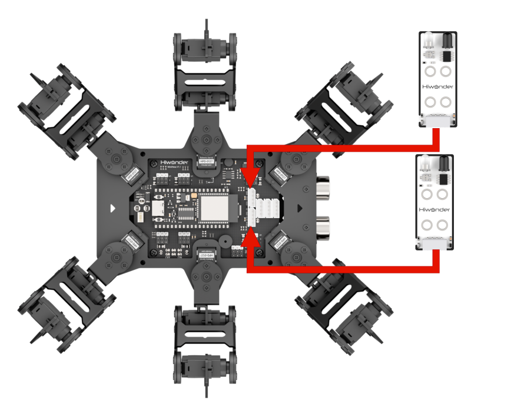

Installation method: install the infrared obstacle avoidance sensors on the front two legs of miniHexa.

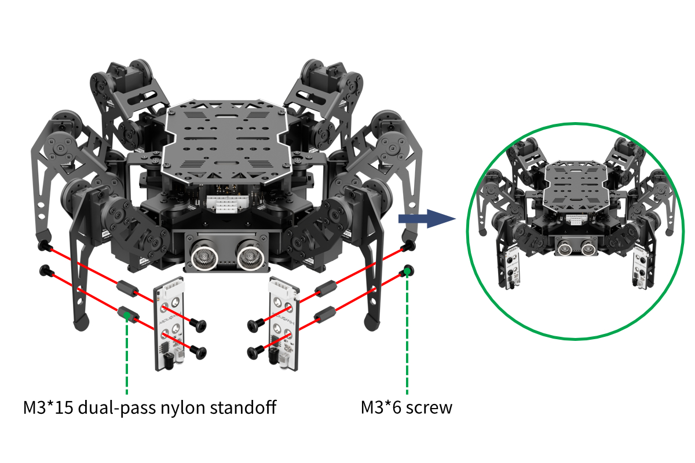

#### 6.3.11.4 Program Download

1. Connect miniHexa to the PC with a Type-C data cable.


2. Open the Hiwonder Python Editor.


3. Open [**11 Intelligent Fall Prevention Program/main.py**](https://drive.google.com/drive/folders/1asy2QZ-2J_E-mqAMAUdrCQgn5jjbIoWV?usp=sharing), then drag it into the Hiwonder Python Editor. The drag operation takes effect only when the file is dropped inside the red box.


4. Click the connection icon in the menu bar . After the connection succeeds, the icon turns green .

5. After the connection succeeds, click the download icon  in the menu bar to download the program to miniHexa. Wait until the information panel below shows that the download is complete.


#### 6.3.11.5 Project Outcome

miniHexa uses the infrared obstacle avoidance sensors to detect edges near its legs to prevent falls. When either sensor is triggered, miniHexa moves backward and then rotates to change direction. Otherwise, miniHexa moves forward continuously.

#### 6.3.11.6 Program Analysis

1. Import the libraries. The `Hiwonder` library is the robot control library. `Hiwonder_DEV` provides the external sensor interface. The `time` library is used for time-related operations.

```python
import Hiwonder
import Hiwonder_DEV
import time
```

2. Create the robot object and initialize the pins of the two infrared obstacle avoidance sensors.

```python
robot = Hiwonder.Robot()
ir1 = Hiwonder_DEV.DEV_IR(32)
ir2 = Hiwonder_DEV.DEV_IR(18)
```

3. Read the states of the two sensors.

```python
    ir1_state = ir1.read()
    ir2_state = ir2.read()
```

4. If either sensor is triggered, miniHexa moves backward and then rotates to change its movement direction.

```python
    # If either sensor is triggered
    if ir1_state or ir2_state:
        # Move backward quickly
        robot.go([0, -3, 0], 3, 1000)
        time.sleep(3)
        
        # Rotate
        robot.go([0, 0, 2], 4, 1000)
        time.sleep(4)
```

5. If neither sensor is triggered, miniHexa moves forward.

```python
    else:
        # Move forward continuously
        robot.go([0, 3, 0])
```

## 6.4 AI Vision Project

### 6.4.1 ESP32-S3 AI Vision Module Overview and Installation

#### 6.4.1.1 Product Introduction

The ESP32-S3 AI vision module is a compact camera module that can operate as a standalone system.

The built-in camera captures images. The ESP32 microcontroller processes the image data and transmits it through the Wi-Fi module. The module also supports multiple communication protocols and low-power operation, so it is widely used in IoT applications.

#### 6.4.1.2 Interface Description


| **Interface Name** |                       **Description**                        |
| :----------------: | :----------------------------------------------------------: |
|  USB serial port   |          Serial communication and firmware flashing          |
|   Custom button    |          The button event can be customized in code          |
|      I2C Port      | Interface for connecting to the controller for secondary development |

#### 6.4.1.3 Notes

1. If water ripples appear in the images captured by the vision module, this may be caused by the rated input current of the module being **≤ 2A**. Check the current output of the power supply.

2. The default image transmission program is preloaded at the factory. Flash the corresponding program when a vision recognition function is required.

#### 6.4.1.4 Module Wiring

Use a 4-pin cable to connect the module to any I2C Port highlighted in red on the servo controller.

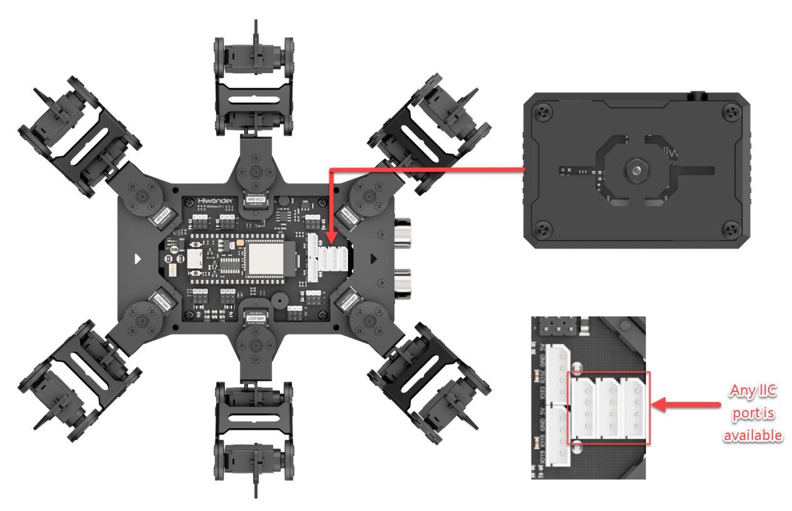

### 6.4.2 Getting Started

#### 6.4.2.1 Notes

1. If the captured image shows water ripple patterns, the input power supply may provide a rated current of `2A` or less. Check the current output of the power supply.

2. The image transmission firmware is preloaded at the factory. It can be tested directly without reflashing. Flash another firmware when another function is required.

#### 6.4.2.2 Device Connection

1. Connect the AI vision module to the PC with a Type-C cable. Check in Device Manager that the port is recognized correctly.

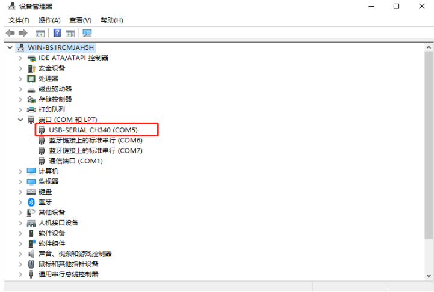

:::{Note}
**If the device does not appear under Ports, the driver may not be installed on the PC. The installation package is available at [2. Software/7.CH34x Driver Tool/ch341ser.exe](https://drive.google.com/drive/folders/1DQjHDVH7Nvnxklj2mXLUrNuWhbSHIlCe?usp=sharing). Install the driver manually if needed.**
:::

2. Connect to the hotspot generated by the module: `HW_ESP32S3CAM`.

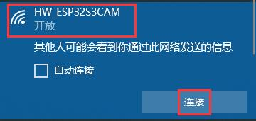

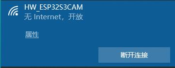

#### 6.4.2.3 Image Transmission

Enter `192.168.5.1` in the browser address bar and press **Enter**. A phone browser or a PC browser can be used. A PC browser is used in the example below. In the page that opens, click  to enter the camera image transmission interface.


### 6.4.3 Controller-Device Communication Principle and Coordinate System Description

#### 6.4.3.1 Introduction

This section introduces how the ESP32S3 module, abbreviated below as ESP32S3, communicates with controllers such as Arduino and ESP32 boards. It explains how the ESP32S3 operates as a device and how the controller accesses ESP32S3 data and control functions.

In this chapter, the ESP32S3 always operates as a device. Information is transmitted through the I2C protocol.

#### 6.4.3.2 Controller-Device Relationship

In a controller-device system, the ESP32S3 operates as the device. Other microcontrollers and similar devices operate as the controller.

**Functions of the ESP32S3 as the device**

1. Receive and parse the signals sent by the controller:

Wait for an I2C signal interrupt. If I2C data is received, call the corresponding function according to the register address contained in the received I2C data.

2. Process data and send feedback:

When the ESP32S3 receives a register read command, call the corresponding transmission function and send the recognized data to the controller.

When the ESP32S3 receives a register setting command, set the fill light brightness.

**Functions of other devices as the controller**

1. Send commands:

Send a data read request to the ESP32S3.

2. Coordinate control:

Manage the coordinated operation of the entire system. Ensure that communication and operation among the controller, the ESP32S3, and other devices connected to the controller remain conflict-free and stable.

3. Receive data:

When the controller reads data, receive the status information sent by the ESP32S3 after the read command is sent. Then parse the data packet and extract the useful information.

#### 6.4.3.3 Device Address and Registers

When the ESP32S3 runs the face detection function:

|       **Address**       |                         **Function**                         |
| :---------------------: | :----------------------------------------------------------: |
|  `0x52` device address  |             Communication address of the ESP32S3             |
| `0x01` register address | Read face data `[int16_t x, y, w, h]`. All data values are `0` when no face is detected |

:::{Note}
**In the face data, `x`, `y`, `w`, and `h` represent the face detection box marked in the original image. These values are the center point `x` coordinate, center point `y` coordinate, detection box width, and detection box height. The unit is pixels. See [6.4.3.4 Module Coordinate System Description](#anther6.4.3.4) for details about the pixel coordinate system used in this mode.**
:::

When the ESP32S3 runs the color recognition function:

|       **Address**       | **Function**                                                 |
| :---------------------: | :----------------------------------------------------------- |
|  `0x52` device address  | Communication address of the ESP32S3                         |
| `0x00` register address | Read color `0` data. The returned data format is `[int16_t x, y, w, h]`. All data values are `0` when no target is detected |
| `0x01` register address | Read color `1` data. The returned data format is `[int16_t x, y, w, h]`. All data values are `0` when no target is detected |

:::{Note}
* **In the color data, `x`, `y`, `w`, and `h` represent the color block detection box marked in the original image. These values are the center point `x` coordinate, center point `y` coordinate, detection box width, and detection box height. The unit is pixels. See [6.4.3.4 Module Coordinate System Description](#anther6.4.3.4) for details about the pixel coordinate system used in this mode.**
* **If multiple color blocks in the camera view match the preset color threshold, the module selects the two largest color blocks in the image and stores their detection box data in the `0x00` and `0x01` register spaces in sequence.**
:::

<p id ="anther6.4.3.4"></p>

#### 6.4.3.4 Module Coordinate System Description

This section briefly introduces the image coordinate systems used when the module runs different functions. Review this section before studying the example programs.

When the example programs are ported for secondary development, establish the mapping between the module image coordinate system and the real-world coordinate system according to this document.

Pay attention to the following two characteristics of the module image coordinate system:

**1. The origin is at the upper-left corner of the screen, not at the center of the screen.**

**2. The Y-axis direction is opposite to the Y-axis direction in a standard Cartesian coordinate system.**

**Image Transmission Mode**

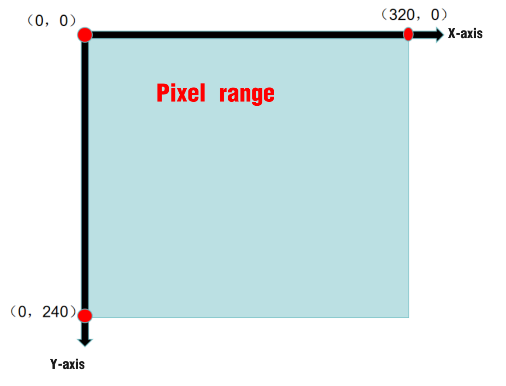

:::{Note}
**The image transmission mode uses a resolution of `320 x 240` to match the image data interface used by the mobile app.**
:::

**Face Detection Mode**

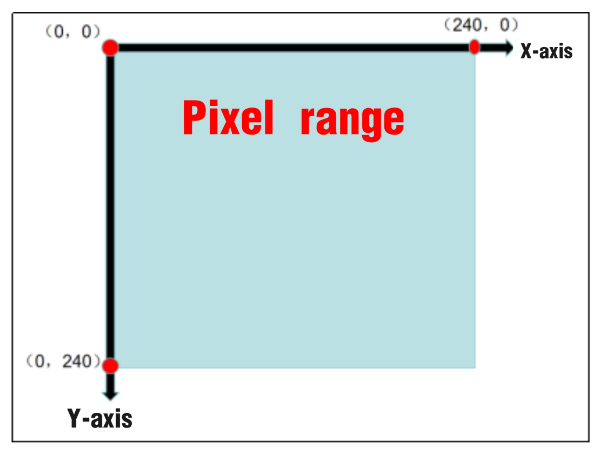

:::{Note}
**To ensure smooth image performance, the face detection mode uses a tested resolution of `240 x 240`.**
:::

**Color Recognition Mode**

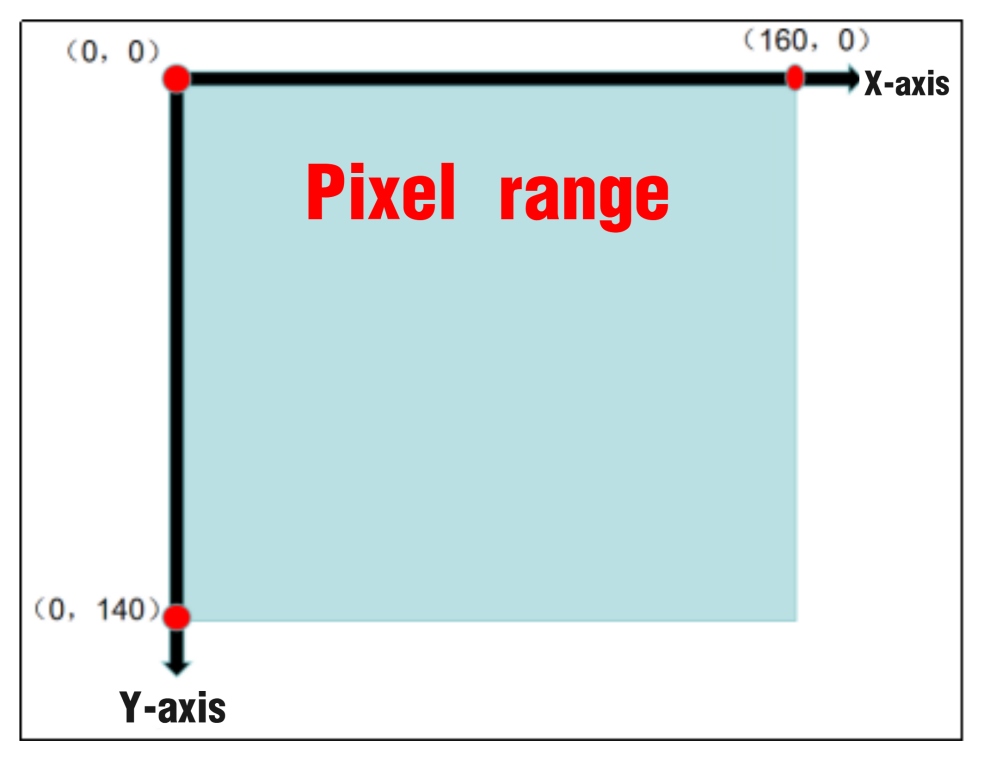

:::{Note}
**To ensure smooth image performance, the color recognition mode uses a tested resolution of `160 x 140`.**
:::

#### 6.4.3.5 Notes

The controller and the ESP32S3 can use different power supplies. The grounds must be connected together during wiring. Stable communication voltage levels depend on a common ground.

### 6.4.4 Color Recognition

#### 6.4.4.1 Feature Overview

This section uses the ESP32-S3 AI vision module to detect red, green, and blue color blocks. The RGB LEDs on the glowy ultrasonic module then light up in the corresponding color.

#### 6.4.4.2 Project Process

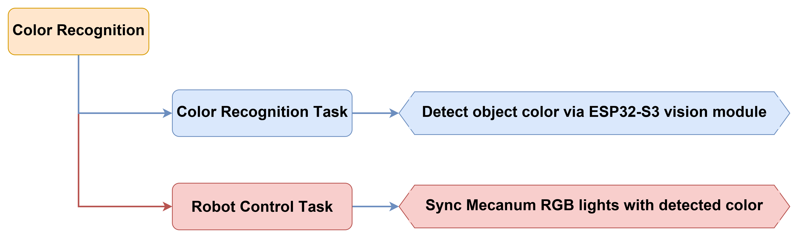

#### 6.4.4.3 Module Description

1. ESP32-S3 AI vision module


This development board integrates an ESP32-S3 chip and a camera module. After it is installed on the carrier board, it communicates through an I2C Port and can read color and face-detection data through I2C communication.

Module wiring: as shown below, connect the module to any I2C Port highlighted in red on the servo controller before running this program.

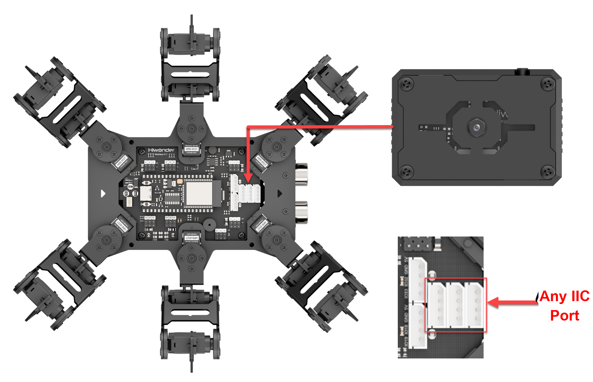

2. Glowy ultrasonic module


The module uses an I2C Port and can read the distance measured by the ultrasonic sensor through I2C communication. Two RGB LEDs are integrated at the ultrasonic probe position. The brightness can be adjusted. Color changes and color mixing across the red channel `R`, green channel `G`, and blue channel `B` make full-color lighting effects possible.

:::{Note}
**The glowy ultrasonic module is already connected to the onboard I2C Port at the factory. No additional wiring is required.**
:::

#### 6.4.4.4 Program Download

1. Program download for the ESP32-S3 AI vision module

(1) Connect the ESP32-S3 AI vision module to a USB port on the PC with a Type-C cable.

(2) Open [**03 Program Files/01 Color Recognition/ColorDetection/ColorDetection.ino**](https://drive.google.com/drive/folders/1Mhv7gtz5axn71-4eS4kVKbmW_ZoB6OGY?usp=sharing).

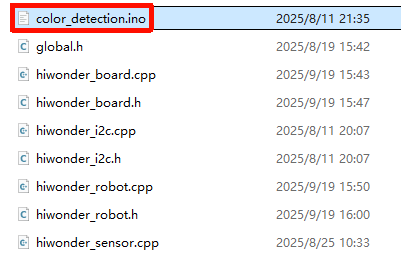

(3) Select **ESP32S3 Dev Module** as the development board.


(4) Click **Tools** in the menu bar. Configure the ESP32S3 development board options as shown below.

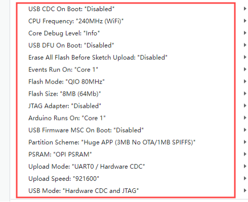

:::{Note}
**Modify the development board configuration before downloading the program to the AI vision module.**
:::

(5) Finally, click  to download the code to the ESP32-S3 AI vision module. Wait until flashing is complete.


2. Program download for Python

(1) Connect miniHexa to the PC with a Type-C data cable.


(2) Open the Hiwonder Python Editor.


(3) Open [**03 Program Files/01 Color Recognition/main.py**](https://drive.google.com/drive/folders/1eFAkppMoa8xR237q0B-EyJtryd0vjn8b?usp=sharing). Then drag it into the Hiwonder Python Editor. The drag operation takes effect only when the file is dropped inside the red box.


(4) Click the connection icon in the menu bar . After the connection succeeds, the icon turns green .

(5) After the connection succeeds, click the download icon in the menu bar  to download the program to miniHexa. Wait until the information panel below shows that the download is complete.


#### 6.4.4.5 Project Outcome

When the AI vision module detects a red, green, or blue color block, the RGB LEDs on the glowy ultrasonic module light in the same color.

#### 6.4.4.6 Program Analysis

1. Import the libraries. `Hiwonder` is the robot control library. `Hiwonder_DEV` provides the interface for external sensors. `time` is used for time-related operations.

```python
import Hiwonder
import Hiwonder_DEV
import time
```

2. Create the robot object, the ultrasonic sensor object, and the ESP32-S3 AI vision module object.

```python
robot = Hiwonder.Robot()
sonar = Hiwonder_DEV.DEV_SONAR()
cam = Hiwonder_DEV.DEV_ESP32S3Cam()
```

3. If red is detected, set the RGB LEDs on the ultrasonic module to red.

```python
  rec = cam.read_color(1)
  if rec:
    print("red")
    sonar.setRGB(0,250,0,0)
```

4. If green is detected, set the RGB LEDs on the ultrasonic module to green.

```python
  else:
    rec = cam.read_color(2)
    if rec:
      print("green")
      sonar.setRGB(0,0,250,0)
```

5. If blue is detected, set the RGB LEDs on the ultrasonic module to blue.

```python
    else:
      rec = cam.read_color(3)
      if rec:
        print("blue")
        sonar.setRGB(0,250,0,0)
```

### 6.4.5 Color Tracking

#### 6.4.5.1 Feature Overview

This section uses the ESP32-S3 AI vision module to detect a red block. The robot then rotates in place to follow the movement of the block.

#### 6.4.5.2 Project Process


#### 6.4.5.3 Module Description

1. ESP32-S3 AI vision module


This development board integrates an ESP32-S3 chip and a camera module. After it is installed on the carrier board, it communicates through an I2C Port and can read color and face-detection data through I2C communication.

Module wiring: as shown below, connect the module to any I2C Port highlighted in red on the servo controller before running this program.


2. Glowy ultrasonic module


The module uses an I2C Port and can read the distance measured by the ultrasonic sensor through I2C communication. Two RGB LEDs are integrated at the ultrasonic probe position. The brightness can be adjusted. Color changes and color mixing across the red channel `R`, green channel `G`, and blue channel `B` make full-color lighting effects possible.

:::{Note}
**The glowy ultrasonic module is already connected to the onboard I2C Port at the factory. No additional wiring is required.**
:::

#### 6.4.5.4 Program Download

1. Program download for the ESP32-S3 AI vision module

(1) Connect the ESP32-S3 AI vision module to a USB port on the PC with a Type-C cable.

(2) Open [**03 Program Files/02 Color Tracking/ColorTracking/ColorTracking.ino**](https://drive.google.com/drive/folders/1kAvnV5BARmgPDHiKGJRAOmJnLAFSy2_Z?usp=sharing).


(3) Select **ESP32S3 Dev Module** as the development board.


(4) Click **Tools** in the menu bar. Configure the ESP32S3 development board options as shown below.


:::{Note}
**Modify the development board configuration before downloading the program to the AI vision module.**
:::

(5) Finally, click  to download the code to the ESP32-S3 AI vision module. Wait until flashing is complete.


2. Program download for Python

(1) Connect miniHexa to the PC with a Type-C data cable.


(2) Open the Hiwonder Python Editor.


(3) Open [**03 Program Files/02 Color Tracking/main.py**](https://drive.google.com/drive/folders/1oxmcowx87lFTyFhkmlCynoxyYpt7XFks?usp=sharing). Then drag it into the Hiwonder Python Editor. The drag operation takes effect only when the file is dropped inside the red box.


(4) Click the connection icon in the menu bar . After the connection succeeds, the icon turns green .

(5) After the connection succeeds, click the download icon in the menu bar  to download the program to miniHexa. Wait until the information panel below shows that the download is complete.


#### 6.4.5.5 Project Outcome

When the AI vision module detects a red block, the robot stays in place and adjusts its posture so that the AI vision module continues to face the red block.

:::{Note}
**A rotation limit is set in the program. The robot tracks the color block only within 20° clockwise or counterclockwise from its current heading.**
:::

#### 6.4.5.6 Program Analysis

1. Import the libraries. `Hiwonder` is the robot control library. `Hiwonder_DEV` provides the interface for external sensors. `time` is used for time-related operations.

```python
import Hiwonder
import Hiwonder_DEV
import time
```

2. Create the robot object, the ultrasonic sensor object, and the ESP32-S3 AI vision module object.

```python
robot = Hiwonder.Robot()
sonar = Hiwonder_DEV.DEV_SONAR()
cam = Hiwonder_DEV.DEV_ESP32S3Cam()
```

3. `fmap` is a linear mapping function. It maps a value linearly from one range to another.

```python
def fmap(x, in_min, in_max, out_min, out_max):
    return (x - in_min) * (out_max - out_min) / (in_max - in_min) + out_min
```

4. In the main loop, continuously read the color recognition result `rec` from the camera. If a target is detected and `rec` is valid, get the center point `x` coordinate from `rec[0]`. Then map the center point `x` coordinate from `[0, 160]` to `[-1, 1]` and add the mapped value to `yaw`. Limit `yaw` to the range `[-20, 20]`. Finally, set the robot body angle and change only the yaw angle. Then wait `0.05` seconds.

```python
while True:
  rec = cam.read_color(1)
  if rec:
    center = int(rec[0])
    yaw += fmap(center , 0 , 160 , -1 , 1)
    yaw = 20 if yaw > 20 else (-20 if yaw < -20 else yaw)
    robot.set_body_angle([0,0,yaw],100)
  time.sleep(0.05)
```

### 6.4.6 Visual Line Following

#### 6.4.6.1 Feature Overview

This section uses the ESP32-S3 AI vision module to detect a red line and control the robot to follow the line.

#### 6.4.6.2 Project Process

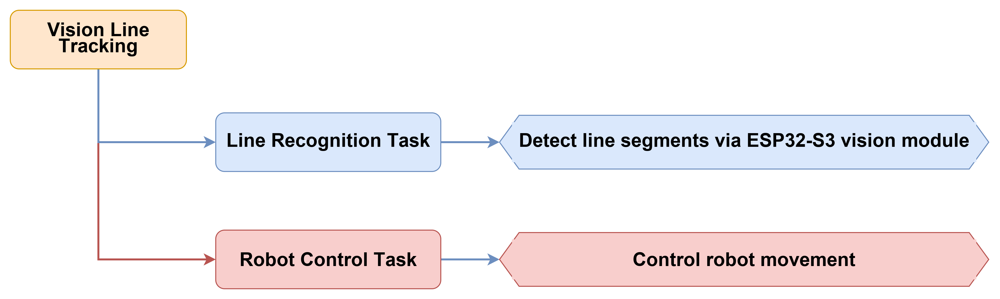

#### 6.4.6.3 Module Description

1. ESP32-S3 AI vision module


This development board integrates an ESP32-S3 chip and a camera module. After it is installed on the carrier board, it communicates through an I2C Port and can read color and face-detection data through I2C communication.

Module wiring: as shown below, connect the module to any I2C Port highlighted in red on the servo controller before running this program.


2. Glowy ultrasonic module


The module uses an I2C Port and can read the distance measured by the ultrasonic sensor through I2C communication. Two RGB LEDs are integrated at the ultrasonic probe position. The brightness can be adjusted. Color changes and color mixing across the red channel `R`, green channel `G`, and blue channel `B` make full-color lighting effects possible.

:::{Note}
**The glowy ultrasonic module is already connected to the onboard I2C Port at the factory. No additional wiring is required.**
:::

#### 6.4.6.4 Program Download

1. Program download for the ESP32-S3 AI vision module

(1) Connect the ESP32-S3 AI vision module to a USB port on the PC with a Type-C cable.

(2) Open [**03 Program Files/03 Vision Line Following/LineFollowing/LineFollowing.ino**](https://drive.google.com/drive/folders/1YAvLb8Dhk0AGjxTqMKvjWiLXbWujyL2V?usp=sharing).

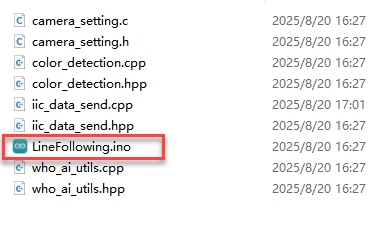

(3) Select **ESP32S3 Dev Module** as the development board.


(4) Click **Tools** in the menu bar. Configure the ESP32S3 development board options as shown below.


:::{Note}
**Modify the development board configuration before downloading the program to the AI vision module.**
:::

(5) Finally, click  to download the code to the ESP32-S3 AI vision module. Wait until flashing is complete.


2. Program download for Python

(1) Connect miniHexa to the PC with a Type-C data cable.


(2) Open the Hiwonder Python Editor.


(3) Open [**03 Program Files/03 Vision Line Following/main.py**](https://drive.google.com/drive/folders/1QSlwV0UznUJhPGsQTH_hI3DBRSBwMXru?usp=sharing). Then drag it into the Hiwonder Python Editor. The drag operation takes effect only when the file is dropped inside the red box.


(4) Click the connection icon in the menu bar . After the connection succeeds, the icon turns green .

(5) After the connection succeeds, click the download icon in the menu bar  to download the program to miniHexa. Wait until the information panel below shows that the download is complete.


#### 6.4.6.5 Project Outcome

When the AI vision module detects a red line, the robot moves along the line.

#### 6.4.6.6 Program Analysis

1. Import the libraries. `Hiwonder` is the robot control library. `Hiwonder_DEV` provides the interface for external sensors. `time` is used for time-related operations.

```python
import Hiwonder
import Hiwonder_DEV
import time
```

2. Create the robot object and the ESP32-S3 AI vision module object.

```python
robot = Hiwonder.Robot()
cam = Hiwonder_DEV.DEV_ESP32S3Cam()
```

3. If the `x` coordinate of the center point of the color region is greater than `120`, move the robot toward the front right.

```python
  if rec:
    if rec[0] > 120:
      robot.go([0,1,-0.1])
```

4. If the `x` coordinate of the center point of the color region is less than `40`, move the robot toward the front left.

```python
    elif rec[0] < 40:
      robot.go([0,1,0.1])
```

5. Otherwise, move the robot straight forward.

```python
    else:
      robot.go([0,1,0])
```

### 6.4.7 Face Detection

#### 6.4.7.1 Feature Overview

This section uses the ESP32-S3 AI vision module to detect faces. Once a face is detected, miniHexa performs a cute action.

#### 6.4.7.2 Project Process

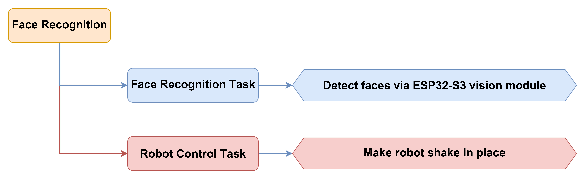

#### 6.4.7.3 Module Description

1. ESP32-S3 AI vision module


This development board integrates an ESP32-S3 chip and a camera module. After it is installed on the carrier board, it communicates through an I2C Port and can read color and face-detection data through I2C communication.

Module wiring: as shown below, connect the module to any I2C Port highlighted in red on the servo controller before running this program.


2. Glowy ultrasonic module


The module uses an I2C Port and can read the distance measured by the ultrasonic sensor through I2C communication. Two RGB LEDs are integrated at the ultrasonic probe position. The brightness can be adjusted. Color changes and color mixing across the red channel `R`, green channel `G`, and blue channel `B` make full-color lighting effects possible.

:::{Note}
**The glowy ultrasonic module is already connected to the onboard I2C Port at the factory. No additional wiring is required.**
:::

#### 6.4.7.4 Program Download

1. Program download for the ESP32-S3 AI vision module

(1) Connect the ESP32-S3 AI vision module to a USB port on the PC with a Type-C cable.

(2) Open [**03 Program Files/04 Face Recognition/FaceDetection/FaceDetection.ino**](https://drive.google.com/drive/folders/1OQjzqNvADhJdqx9q_eVFPC50l4Rb5V_O?usp=sharing).

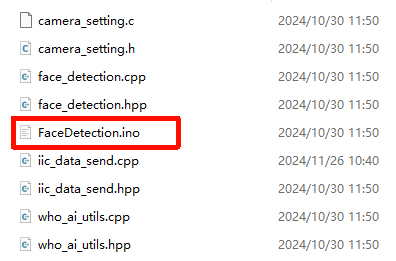

(3) Select **ESP32S3 Dev Module** as the development board.


(4) Click **Tools** in the menu bar. Configure the ESP32S3 development board options as shown below.


:::{Note}
**Modify the development board configuration before downloading the program to the AI vision module.**
:::

(5) Finally, click  to download the code to the ESP32-S3 AI vision module. Wait until flashing is complete.


2. Program download for Python

(1) Connect miniHexa to the PC with a Type-C data cable.


(2) Open the Hiwonder Python Editor.


(3) Open [**03 Program Files/04 Face Recognition/main.py**](https://drive.google.com/drive/folders/14N8BGoi-pXMK26xjB0LSqEuiiP6IoO-f?usp=sharing). Then drag it into the Hiwonder Python Editor. The drag operation takes effect only when the file is dropped inside the red box.


(4) Click the connection icon in the menu bar . After the connection succeeds, the icon turns green .

(5) After the connection succeeds, click the download icon in the menu bar  to download the program to miniHexa. Wait until the information panel below shows that the download is complete.


#### 6.4.7.5 Project Outcome

When a face is detected, the robot pitches forward and backward twice within ±10° and then returns to a level posture.

#### 6.4.7.6 Program Analysis

1. Import the libraries. `Hiwonder` is the robot control library. `Hiwonder_DEV` provides the interface for external sensors. `time` is used for time-related operations.

```python
import Hiwonder
import Hiwonder_DEV
import time
```

2. Create the robot object and the ESP32-S3 AI vision module object.

```python
robot = Hiwonder.Robot()
cam = Hiwonder_DEV.DEV_ESP32S3Cam()
```

3. Use `read_face()` to get the face data. If a face is detected, the function returns the face position array `[x, y, w, h]`. If no face is detected, the function returns `None`. Store the returned data in `rec`.

```python
while True:
  rec = cam.read_face()
```

4. If face data is returned, control miniHexa to pitch forward and backward within ±10° and then return to a level posture.

```python
  if rec:
    if rec[2] > 0:
      # Pitch +10 degrees
      robot.set_body_angle([0, 10, 0], 300)
      time.sleep_ms(300)
      # Pitch -10 degrees
      robot.set_body_angle([0, -10, 0], 300)
      time.sleep_ms(300)
      # Pitch +10 degrees
      robot.set_body_angle([0, 10, 0], 300)
      time.sleep_ms(300)
      # Pitch -10 degrees
      robot.set_body_angle([0, -10, 0], 300)
      time.sleep_ms(300)
      # Return to the level posture
      robot.set_body_angle([0, 0, 0], 300)
      time.sleep_ms(300)
```

`set_body_angle()` is the function that sets the body angle of miniHexa. Use `set_body_angle([0, 10, 0], 300)` as the example.

The first parameter `[0, 10, 0]` represents the body angles `[roll, pitch, yaw]`. The range is ±20°.

The second parameter `300` is the running time.

5. Call `set_body_pose()` to move miniHexa `2 cm` to the right first and then `2 cm` to the left. After this sequence is executed twice, return to the center position.

```python
      # Move 2 cm to the right
      robot.set_body_pose([2.0, 0, 0], 200)
      time.sleep_ms(200)
      # Move 2 cm to the left
      robot.set_body_pose([-2.0, 0, 0], 200)
      time.sleep_ms(200)
      # Move 2 cm to the right
      robot.set_body_pose([2.0, 0, 0], 200)
      time.sleep_ms(200)
      # Move 2 cm to the left
      robot.set_body_pose([-2.0, 0, 0], 200)
      time.sleep_ms(200)
      # Return to the center position
      robot.set_body_pose([0, 0, 0], 200)
      time.sleep_ms(200)
```

`set_body_pose()` is the function that sets the `x`, `y`, and `z` offsets of the miniHexa body from the origin. Use `set_body_pose([2.0, 0, 0], 200)` as the example.

The first parameter `[2.0, 0, 0]` is the `x`, `y`, and `z` offset of the body center from the origin. The range is `[-4.0f, 4.0f]`. The unit is centimeters.

The second parameter `200` is the time used for each step.

## 6.5 AI Voice Project

### 6.5.1 Introduction and Installation of WonderEcho

#### 6.5.1.1 Module Introduction

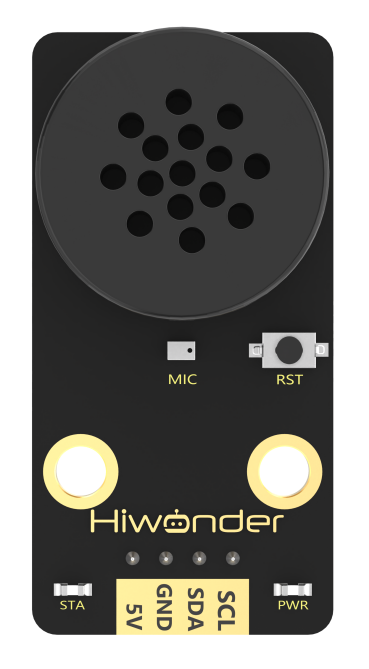

The integrated voice interaction module WonderEcho is built on the CI1302 chip for voice recognition and voice playback. It supports offline neural network acceleration and hardware acceleration for voice signal processing. The module uses deep noise reduction and neural network models to analyze voice input and generate recognition results.

The CI1302 chip integrates a Brain Neural Processing Unit, supports offline neural network acceleration and hardware acceleration for voice signal processing, and runs at up to `220MHz`. It supports offline far-field voice recognition, includes `2MB` of onboard `FLASH` storage, and can store up to `300` command words.

The module is easy to use and delivers strong voice recognition performance. It is widely used in smart home devices, conversational robots, educational robots, and in-vehicle dispatch terminals.

**Working Principle**

The module uses a wake-word activation mode. Speak the wake word first to activate the voice interaction module. Commands can be recognized only after activation.

English is the default recognition language. The default English wake word is `Hello Hiwonder`. 

If no voice is recognized within `15` seconds, the module enters sleep mode. Wake the module again before the next use.

After the CI1302 chip recognizes a command word, it sends the corresponding instruction to the I2C chip and plays back the matching phrase. The I2C chip stores the received voice command and send it through the I2C device protocol. The supported command words are listed in [**03 WonderEcho Firmware Flash Tutorial/Command Word and Playback Phrase Protocol List**](https://drive.google.com/drive/folders/1X9PpUXagVvFnXmACI4NdAyx2eXafkurl?usp=sharing).

**Notes**

1. Use a `5V` power supply. Incorrect voltage may damage the module.

2. Use the module in a quiet environment. Excessive background noise affects recognition performance.

3. Speak the command words clearly and loudly. Avoid speaking too quickly. A distance of less than `5` meters from the module is recommended.

#### 6.5.1.2 Hardware Interface Description

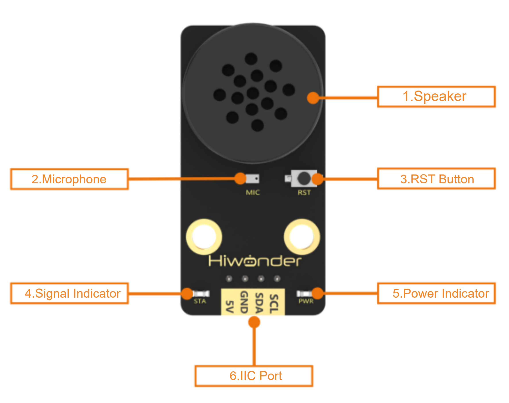

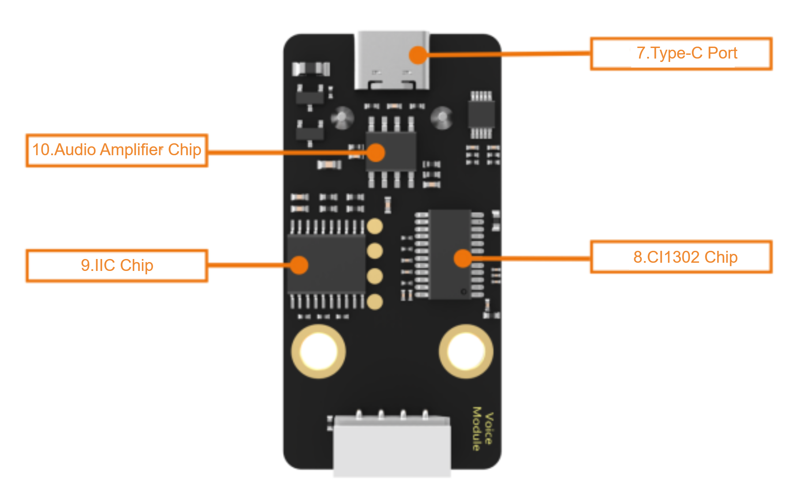

| **No.** | **Hardware Name**         | **Description**                                              |
| :-----: | :------------------------ | :----------------------------------------------------------- |
|    1    | Speaker                   | Converts analog signals into sound                           |
|    2    | Microphone                | Converts sound into analog signals                           |
|    3    | RST button                | Reset button                                                 |
|    4    | Signal indicator blue LED | Stays on during operation. Flashes once when a command word is recognized |
|    5    | Power indicator red LED   | Stays on when the power supply is normal                     |
|    6    | I2C Port                  | Works as an I2C device and is used for power supply and communication with the controller |
|    7    | Type-C Port               | Used for power supply and CI1302 firmware updates            |
|    8    | CI1302 chip               | High-performance voice recognition chip that recognizes voice commands and outputs signals |
|    9    | I2C chip                  | Converts instructions from the voice recognition chip into I2C protocol commands |
|   10    | Audio amplifier chip      | Converts digital signals into analog signals to drive the speaker |

### 6.5.2 Introduction to the Voice Module Library Files

**WonderEcho Code Blocks**

1. Module initialization

Use the following code to initialize the module interface.

```python
asr = Hiwonder_DEV.DEV_ASR()
```

2. Retrieve the command word ID

This code block retrieves the ID of the command word recognized by the module. The return value is an integer.

```python
    result = asr.getResult()
```

3. Play back a specified entry by ID

This function requires two parameters. `cmd` is the type ID of the entry to be played back. `0xFF` is the playback type and `0x00` is the command type. `id` is the ID of the entry to be played back. The module receives the data through the I2C protocol and actively plays back the specified entry.

```python
asr.speak()
```

### 6.5.3 Voice Obstacle Alert

#### 6.5.3.1 Feature Overview

This section uses the ultrasonic module to detect obstacles in front of the robot. When an obstacle is too close, the ultrasonic module and the voice interaction module provide a sound and light alert.

#### 6.5.3.2 Project Process

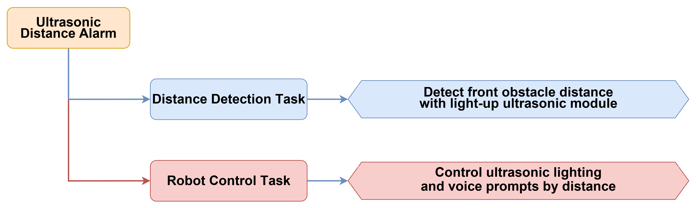

#### 6.5.3.3 Module Description

1. WonderEcho voice interaction module


The integrated voice interaction module WonderEcho is built on the CI1302 chip for voice recognition and voice playback. It supports offline neural network acceleration and hardware acceleration for voice signal processing. The module uses deep noise reduction and neural network models to analyze voice input and generate recognition results.

Module wiring: as shown below, connect the module to any I2C Port highlighted in red on the servo controller before running this program.


Installation: mount the voice interaction module on the rear panel of miniHexa.

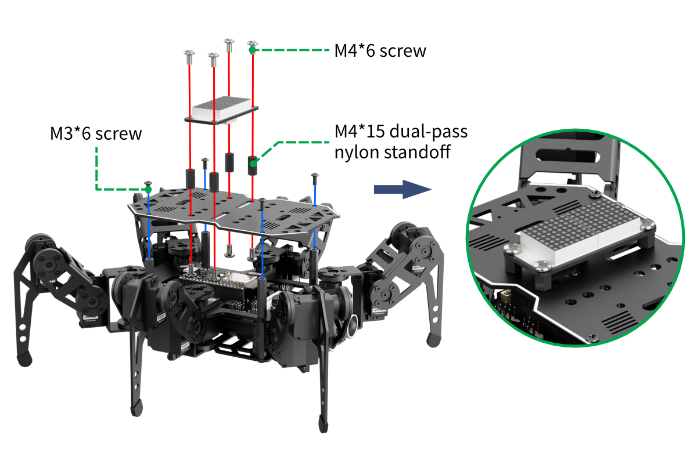

2. Glowy ultrasonic module


The module uses an I2C communication interface and can read the distance measured by the ultrasonic sensor through I2C communication. Two RGB LEDs are integrated at the ultrasonic probe position. The brightness can be adjusted. Color changes and color mixing across the red channel `R`, green channel `G`, and blue channel `B` make full-color lighting effects possible.

:::{Note}
**The glowy ultrasonic module is already connected to the onboard I2C Port at the factory. No additional wiring is required.**
:::

#### 6.5.3.4 Program Download

1. Connect miniHexa to the PC with a Type-C data cable.


2. Open the Hiwonder Python Editor.


3. Open [**02 Program Files/01 Voice Obstacle Alert Program/main.py**](https://drive.google.com/drive/folders/1I8Rl_tRkkZts3azPTikNlRRZDhm71BGt?usp=sharing). Then drag it into the Hiwonder Python Editor. The drag operation takes effect only when the file is dropped inside the red box.


4. Click the connection icon in the menu bar . After the connection succeeds, the icon turns green .

5. After the connection succeeds, click the download icon in the menu bar  to download the program to miniHexa. Wait until the information panel below shows that the download is complete.


#### 6.5.3.5 Project Outcome

When the glowy ultrasonic module detects no obstacle ahead or the obstacle is too far away, the module lights up green. When the obstacle is too close, the module lights up red and the voice interaction module plays back `Obstacle ahead`.

#### 6.5.3.6 Program Analysis

1. Import the libraries. `Hiwonder` is the robot control library. `Hiwonder_DEV` provides the interface for external sensors. `time` is used for time-related operations.

```python
import Hiwonder
import Hiwonder_DEV
import time
```

2. Create the robot object and initialize WonderEcho and the glowy ultrasonic module.

```python
robot = Hiwonder.Robot()
sonar = Hiwonder_DEV.DEV_SONAR()
asr = Hiwonder_DEV.DEV_ASR()
```

3. Get the distance returned by the ultrasonic module.

```python
while True:
    dis = sonar.getDistance()
```

4. If the distance is less than `15`, set the RGB LEDs on the ultrasonic module to red. Then make the voice interaction module play back `Obstacle ahead`.

```python
    if dis < 15:
      r, g, b = 255, 0, 0
      sonar.setRGB(0, r, g, b)
      asr.speak(asr.ASR_ANNOUNCER, 5)
      time.sleep(1.5)
```

5. If the distance is greater than or equal to `15`, set the RGB LEDs on the ultrasonic module to green.

```python
    else:
      r, g, b = 0, 255, 0
      sonar.setRGB(0, r, g, b)
    time.sleep_ms(100)
```

### 6.5.4 Human-Robot Interaction

#### 6.5.4.1 Feature Overview

This section uses the voice interaction module to detect commands and respond with different actions.

#### 6.5.4.2 Project Process


#### 6.5.4.3 Preparation

1. Module installation


The integrated voice interaction module WonderEcho is built on the CI1302 chip for voice recognition and voice playback. It supports offline neural network acceleration and hardware acceleration for voice signal processing. The module uses deep noise reduction and neural network models to analyze voice input and generate recognition results.

Module wiring: as shown below, connect the module to any I2C Port highlighted in red on the servo controller before running this program.


Installation: mount the voice interaction module on the rear panel of miniHexa.


#### 6.5.4.4 Action Group Download

Follow the instructions in [**6.3 Secondary Development Project -> 6.3.1.3 Action Group Download**](https://drive.google.com/drive/folders/12RPhrEyOdwuuFy0W9G4gWTG4TwYFnj-r?usp=sharing) to download the action groups to miniHexa.

#### 6.5.4.5 Program Download

1. Connect miniHexa to the PC with a Type-C data cable.


2. Open the Hiwonder Python Editor.


3. Open [**02 Program Files/02 Human-Robot Interaction Program/main.py**](https://drive.google.com/drive/folders/1I8Rl_tRkkZts3azPTikNlRRZDhm71BGt?usp=sharing). Then drag it into the Hiwonder Python Editor. The drag operation takes effect only when the file is dropped inside the red box.


4. Click the connection icon in the menu bar . After the connection succeeds, the icon turns green .

5. After the connection succeeds, click the download icon in the menu bar  to download the program to miniHexa. Wait until the information panel below shows that the download is complete.


#### 6.5.4.6 Project Outcome

When a specified command word is recognized, the robot executes the corresponding action group as a response. The mapping between the command word and the action group is as follows:

| **Spoken Command**   | **Voice Module Response**                        | **Executed Action**     |
| :------------------- | :----------------------------------------------- | :---------------------- |
| `Hello`              | `Hi`                                             | Run Action Group 14     |
| `Introduce Yourself` | `Hello, i'm Hiwonder, and i can talk and dance.` | Perform the cute action |
| `Show a Skill`       | `Watch closely`                                  | Run Action Group 7      |

#### 6.5.4.7 Program Analysis

1. Import the libraries. `Hiwonder` is the robot control library. `Hiwonder_DEV` provides the interface for external sensors. `time` is used for time-related operations.

```python
import Hiwonder
import Hiwonder_DEV
import time
```

2. Create the robot object and initialize WonderEcho and the glowy ultrasonic module.

```python
robot = Hiwonder.Robot()
sonar = Hiwonder_DEV.DEV_SONAR()
asr = Hiwonder_DEV.DEV_ASR()
```

3. `perform_dance()` is the function that performs the cute action. It uses `set_body_angle()` and `set_body_pose()`.

`set_body_angle()` is the function that sets the body angle. The first parameter is the body angle `[roll, pitch, yaw]`. The range is `[-20.0, 20.0]` degrees. The second parameter is the execution time and is optional.

`set_body_pose()` is the function that sets the `x`, `y`, and `z` offsets of the body from the origin. The first parameter is the `x`, `y`, and `z` offset of the body center from the origin. The range is `[-4.0, 4.0]`. The second parameter is the execution time for each step and is optional.

```python
def perform_dance():
    global robot
    # Part 1: Pitch swing
    # Pitch +10 degrees, body leans forward
    robot.set_body_angle([0.0, 10.0, 0.0], 300)
    time.sleep_ms(600)  # Wait for the action to finish plus extra delay
    
    # Pitch -10 degrees, body leans backward
    robot.set_body_angle([0.0, -10.0, 0.0], 300)
    time.sleep_ms(600)
    
    # Pitch +10 degrees, body leans forward
    robot.set_body_angle([0.0, 10.0, 0.0], 300)
    time.sleep_ms(600)
    
    # Pitch -10 degrees, body leans backward
    robot.set_body_angle([0.0, -10.0, 0.0], 300)
    time.sleep_ms(600)
    
    # Return to the level posture
    robot.set_body_angle([0.0, 0.0, 0.0], 300)
    time.sleep_ms(600)
    
    # Part 2: Horizontal swing along the x-axis
    # Move 2 cm to the right
    robot.set_body_pose([2.0, 0.0, 0], 200)
    time.sleep_ms(400)
    
    # Move 2 cm to the left
    robot.set_body_pose([-2.0, 0.0, 0], 200)
    time.sleep_ms(400)
    
    # Move 2 cm to the right
    robot.set_body_pose([2.0, 0.0, 0], 200)
    time.sleep_ms(400)
    
    # Move 2 cm to the left
    robot.set_body_pose([-2.0, 0.0, 0], 200)
    time.sleep_ms(400)
    
    # Return to the center position
    robot.set_body_pose([0.0, 0.0, 0], 200)
    time.sleep_ms(400)
```

4. Get the ID corresponding to the recognized command word.

```python
    result = asr.getResult()
```

5. When the recognized command word is `Hello`, run Action Group 14.

```python
    if result == 26:
        # "Hello" recognized - run Action Group 14
        robot.action_group_run(14)
```

6. When the recognized command word is `Introduce Yourself`, perform the cute action.

```python
    elif result == 27:
        # "Introduce Yourself" recognized - perform the cute action
        perform_dance()
```

7. When the recognized command word is `Show a Skill`, run Action Group 7.

```python
    elif result == 28:
        # "Show a Skill" recognized - run Action Group 7
        robot.action_group_run(7)
```

### 6.5.5 Voice Control

#### 6.5.5.1 Feature Overview

This section uses the voice interaction module to detect spoken commands and execute the corresponding movements.

#### 6.5.5.2 Project Process


#### 6.5.5.3 Module Description


The integrated voice interaction module WonderEcho is built on the CI1302 chip for voice recognition and voice playback. It supports offline neural network acceleration and hardware acceleration for voice signal processing. The module uses deep noise reduction and neural network models to analyze voice input and generate recognition results.

Module wiring: as shown below, connect the module to any I2C Port highlighted in red on the servo controller before running this program.


Installation: mount the voice interaction module on the rear panel of miniHexa.


#### 6.5.5.4 Program Download

1. Connect miniHexa to the PC with a Type-C data cable.


2. Open the Hiwonder Python Editor.


3. Open [**02 Program Files/03 Voice Control Program/main.py**](https://drive.google.com/drive/folders/1I8Rl_tRkkZts3azPTikNlRRZDhm71BGt?usp=sharing). Then drag it into the Hiwonder Python Editor. The drag operation takes effect only when the file is dropped inside the red box.


4. Click the connection icon in the menu bar . After the connection succeeds, the icon turns green .

5. After the connection succeeds, click the download icon in the menu bar  to download the program to miniHexa. Wait until the information panel below shows that the download is complete.


#### 6.5.5.5 Project Outcome

When a specified command word is recognized, the robot executes the corresponding movement as a response. The mapping between the command word and the movement is as follows:

| **Spoken Command** | **Voice Module Response** | **Executed Movement**                         |
| :----------------- | :------------------------ | :-------------------------------------------- |
| `Go straight`      | `Going straight`          | Move forward continuously                     |
| `Go backward`      | `Going backward`          | Move backward continuously                    |
| `Turn left`        | `Turning left`            | Rotate counterclockwise continuously          |
| `Turn right`       | `Turning right`           | Rotate clockwise continuously                 |
| `Stop`             | `Copy that`               | Stop moving                                   |
| `March`            | `Copy that`               | Move forward two steps in the current heading |

#### 6.5.5.6 Program Analysis

1. Import the libraries. `Hiwonder` is the robot control library. `Hiwonder_DEV` provides the interface for external sensors. `time` is used for time-related operations.

```python
import Hiwonder
import Hiwonder_DEV
import time
```

2. Create the robot object and initialize WonderEcho.

```python
robot = Hiwonder.Robot()
asr = Hiwonder_DEV.DEV_ASR()
```

3. Define the command ID for each spoken command.

```python
FORWARD_ID = 1      # "Go straight"
BACKWARD_ID = 2     # "Go backward"
LEFT_ID = 3         # "Turn left"
RIGHT_ID = 4        # "Turn right"
STOP_ID = 9         # "Stop"
WALK_ID = 29        # "March"
```

4. Get the ID corresponding to the recognized command word.

```python
# Main loop
while True:
    # Run voice recognition
    result = asr.getResult()
```

5. If the recognized command word is `Go straight`, miniHexa moves forward.

```python
    if result == FORWARD_ID:
        # Go straight
        robot.go([0.0, 2.0, 0.0])
```

6. If the recognized command word is `Go backward`, miniHexa moves backward.

```python
    elif result == BACKWARD_ID:
        # Go backward
        robot.go([0.0, -2.0, 0.0])
```

7. If the recognized command word is `Turn left`, miniHexa turns left.

```python
    elif result == LEFT_ID:
        # Turn left
        robot.go([0.0, 0.0, 2.0])
```

8. If the recognized command word is `Turn right`, miniHexa turns right.

```python
    elif result == RIGHT_ID:
        # Turn right
        robot.go([0.0, 0.0, -2.0])
```

9. If the recognized command word is `Stop`, miniHexa stops moving.

```python
    elif result == STOP_ID:
        # Stop
        robot.go([0.0, 0.0, 0.0])
```

10. If the recognized command word is `March`, miniHexa moves forward for two steps.

```python
    elif result == WALK_ID:
        # "March" - move forward two steps
        robot.go([0.0, 2.0, 0.0],2)
        time.sleep(2)
```