## 7.3 Secondary Development Project

[TOC]

### 7.3.1 Action Group Introduction and Practice

#### 7.3.1.1 Feature Overview

This section introduces the action groups in miniHexa and explains how to control an action group with a program.

An action group is a predefined sequence of movement steps. It allows the robot to complete a specific task according to the preset sequence, such as moving or dancing.

miniHexa includes `14` built-in action groups. These action groups can be called directly. The corresponding action group names are shown in the table below:

| **Action Group No.** | **Action** |
| --- | --- |
| 1 | Counterclockwise Twist |
| 2 | Clockwise Twist |
| 3 | Wake Up |
| 4 | Wake Up and Run |
| 5 | Acting Cute |
| 6 | Obstacle Crossing |
| 7 | Battle 1 |
| 8 | Battle 2 |
| 9 | Left Foot Forward Kick |
| 10 | Left Foot Right Kick |
| 11 | Right Foot Forward Kick |
| 12 | Right Foot Left Kick |
| 13 | Door Push |
| 14 | Wave |

#### 7.3.1.2 Project Process

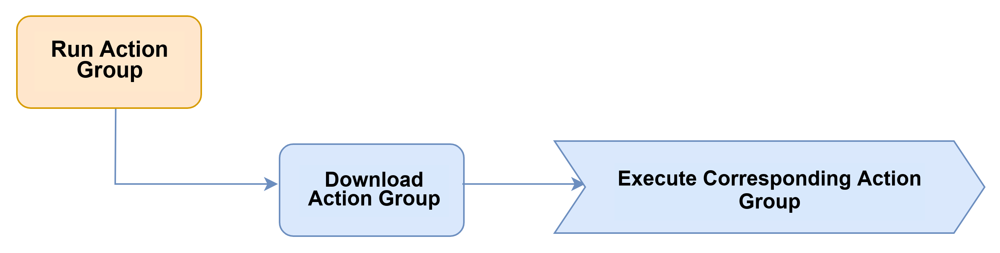

#### 7.3.1.3 Action Group Download

1. Connect miniHexa to the PC with a Type-C data cable.

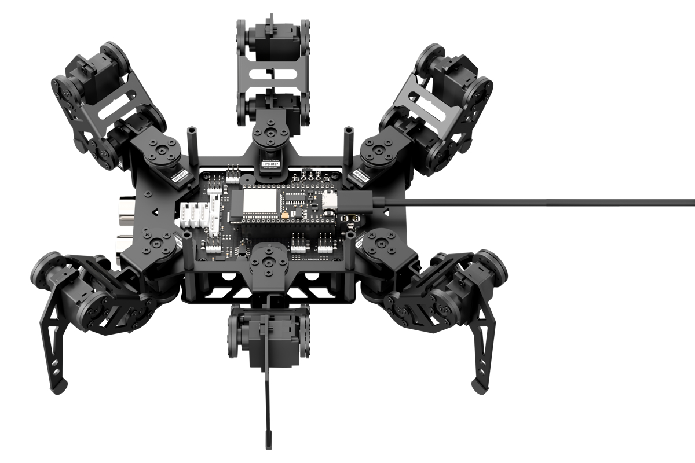

2. Open the Hiwonder Python Editor.

3. Right-click **Local Project -> Switch Project Path** on the left side of the editor.

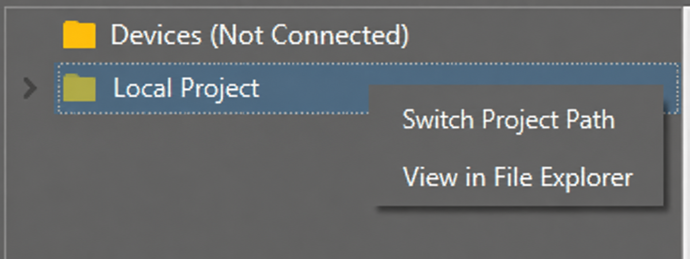

4. Select [**2. Software/10. Action Group Files**](https://drive.google.com/drive/folders/1bR30Kn7b84IqUfwQ5Mr-kZmwecwTGkwo?usp=sharing), then click **Select Folder**.

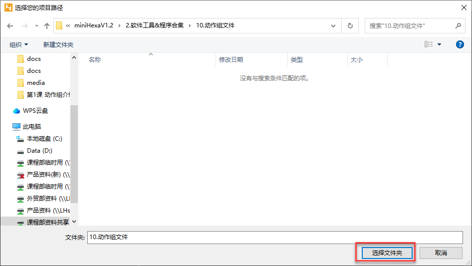

5. Click the connection icon in the menu bar . After the connection succeeds, the icon turns green .

6. Select all imported action group files. Right-click and select **Download** to download the action groups to miniHexa. Wait until the information panel below shows that all action groups have been downloaded successfully.

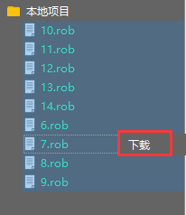

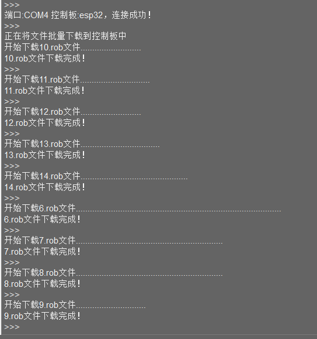

7. After the download is complete, click **Device** to confirm that the action groups have been downloaded to miniHexa.

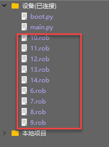

#### 7.3.1.4 Program Download

1. Open the WonderCode software.

2. Open [**02 Program Files/01 Action Group Program/Action Group Introduction and Practice.sb3**](https://drive.google.com/drive/folders/13RQ9oGXlkCDd4qBiH-yjVe07nFF286-m?usp=sharing), then drag it into WonderCode.

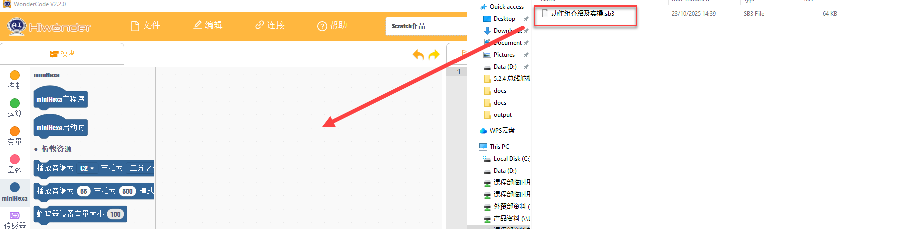

3. Click **Connect** in the menu bar and select the correct `COM` port. `COM4` is used here as an example. After the connection is successful, the **Connection Successful** message is displayed.

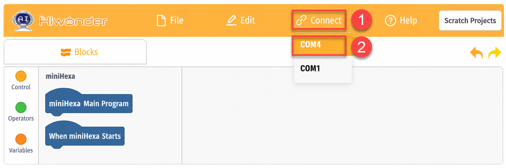

4. Click the upload icon  on the right side to download the program to miniHexa. Wait until the success message is displayed.

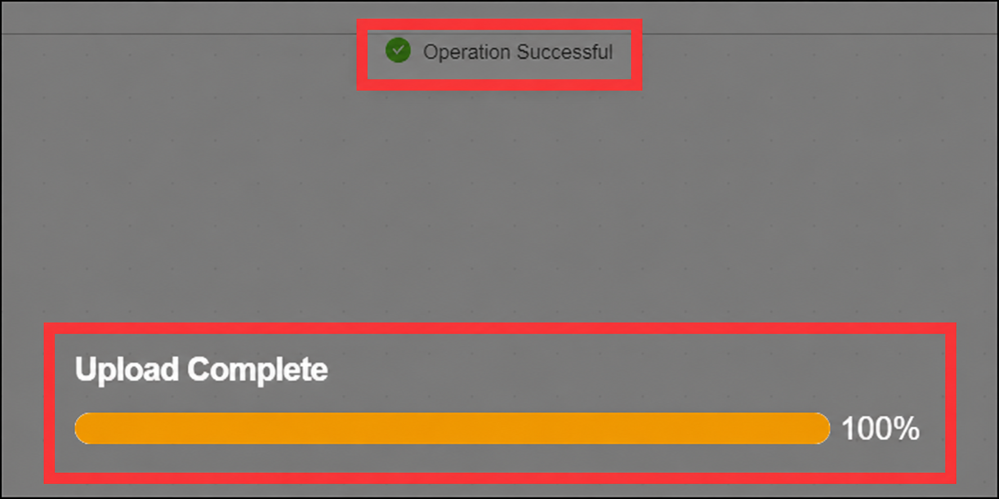

#### 7.3.1.5 Project Outcome

After power-on, miniHexa runs Action Group `9`, which kicks the ball forward with the left foot.

#### 7.3.1.6 Program Analysis

After power-on, miniHexa runs Action Group `9`, which kicks the ball forward with the left foot.

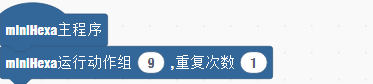

### 7.3.2 Intelligent Voice Control

#### 7.3.2.1 Feature Overview

This section uses the sound sensor to detect sound intensity and controls robot movement based on the detected value.

#### 7.3.2.2 Project Process

#### 7.3.2.3 Module Description

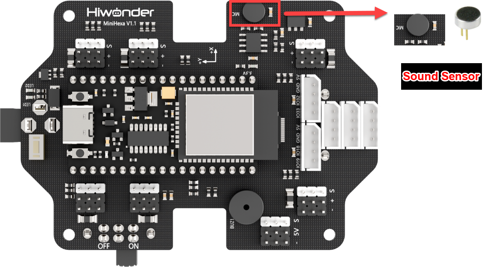

The onboard sound sensor detects ambient sound intensity. The sound level can be obtained by reading the value on the `ADC` pin. Sound causes the microphone diaphragm to vibrate. This changes the capacitance and generates a corresponding small voltage change, which is then converted into an electrical signal for output.

#### 7.3.2.4 Program Download

1. Open the WonderCode software.

2. Open [**02 Program Files/02 Intelligent Voice Control Program/Intelligent Voice Control.sb3**](https://drive.google.com/drive/folders/13RQ9oGXlkCDd4qBiH-yjVe07nFF286-m?usp=sharing), then drag it into WonderCode.

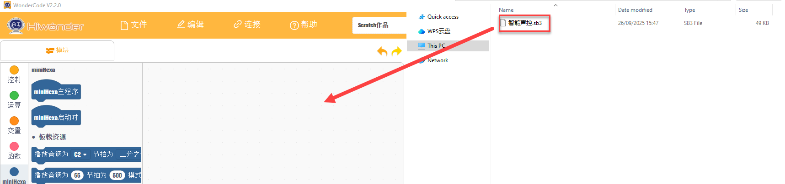

3. Click **Connect** in the menu bar and select the correct `COM` port. `COM4` is used here as an example. After the connection is successful, the **Connection Successful** message is displayed.

4. Click the upload icon  on the right side to download the program to miniHexa. Wait until the success message is displayed.

#### 7.3.2.5 Project Outcome

After power-on, miniHexa enters the initial standing pose and then continuously monitors ambient sound. When the detected sound value is greater than or equal to `20`, miniHexa moves forward.

#### 7.3.2.6 Program Analysis

If the detected sound value is greater than `20`, the robot moves forward for `1` step at speed `2`.

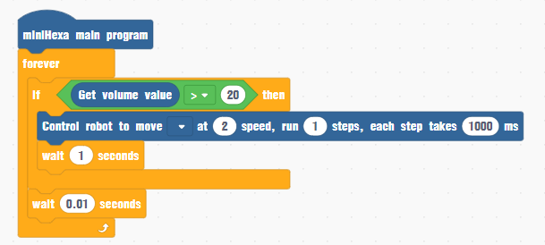

### 7.3.3 Ultrasonic Distance Measurement

#### 7.3.3.1 Feature Overview

This section uses the glowy ultrasonic module to detect distance and controls the RGB LED color of the module based on the measured distance.

#### 7.3.3.2 Project Process

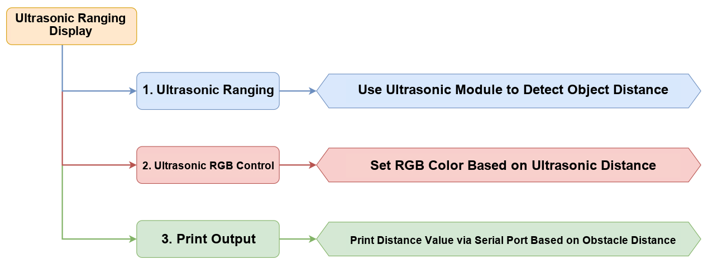

#### 7.3.3.3 Module Description

The glowy ultrasonic module integrates an I2C Port. It supports reading the measured distance data from the ultrasonic sensor through I2C communication. Two RGB LEDs are integrated at the ultrasonic probe position. The brightness can be adjusted, and multiple colors can be displayed by changing and combining the `R`, `G`, and `B` channels.

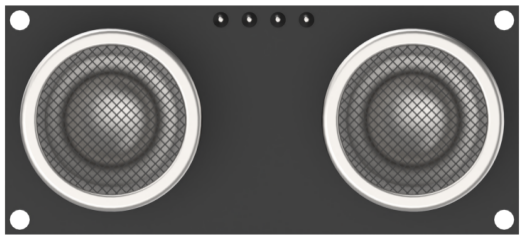

During ranging, the module automatically sends eight `40 kHz` square waves and then checks whether a return signal is received. If a signal is received, the module outputs a high level. The duration of the high level is the travel time of the ultrasonic signal from transmission to return.

> [!NOTE]
>
> **The glowy ultrasonic module is already connected to the onboard I2C Port at the factory. No additional wiring is required.**

#### 7.3.3.4 Program Download

1. Open the WonderCode software.

2. Open [**02 Program Files/03 Ultrasonic Distance Measurement Program/Ultrasonic Distance Measurement.sb3**](https://drive.google.com/drive/folders/13RQ9oGXlkCDd4qBiH-yjVe07nFF286-m?usp=sharing), then drag it into WonderCode.

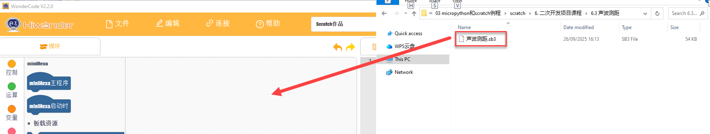

3. Click **Connect** in the menu bar and select the correct `COM` port. `COM4` is used here as an example. After the connection is successful, the **Connection Successful** message is displayed.

4. Click the upload icon  on the right side to download the program to miniHexa. Wait until the success message is displayed.

#### 7.3.3.5 Project Outcome

When an obstacle approaches the glowy ultrasonic module, the RGB LED color changes according to the detected distance.

1. If the obstacle distance is less than or equal to `15`, the RGB LEDs turn red.
2. If the obstacle distance is greater than or equal to `30`, the RGB LEDs turn green.
3. If the obstacle distance is greater than `15` and less than `30`, the RGB LEDs turn blue.

#### 7.3.3.6 Program Analysis

1. `distance` is the obstacle distance detected by the ultrasonic module.

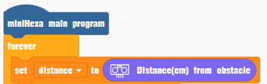

2. If the obstacle distance is less than or equal to `15`, set the RGB LEDs on the ultrasonic module to red.

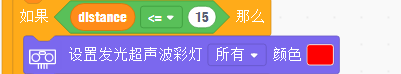

3. If the obstacle distance is greater than or equal to `30`, set the RGB LEDs on the ultrasonic module to green.

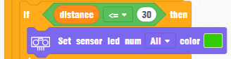

4. If the obstacle distance is greater than `15` and less than `30`, set the RGB LEDs on the ultrasonic module to blue.

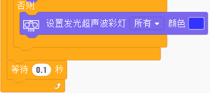

### 7.3.4 Ultrasonic Obstacle Avoidance

#### 7.3.4.1 Feature Overview

This section uses the ultrasonic sensor to detect distance and then avoids obstacles according to the detected value.

#### 7.3.4.2 Project Process

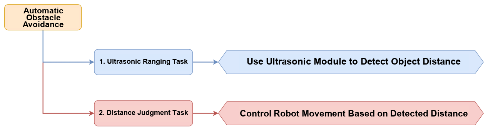

#### 7.3.4.3 Module Description

The glowy ultrasonic module integrates an I2C Port. It supports reading the measured distance data from the ultrasonic sensor through I2C communication. Two RGB LEDs are integrated at the ultrasonic probe position. The brightness can be adjusted, and multiple colors can be displayed by changing and combining the `R`, `G`, and `B` channels.

During ranging, the module automatically sends eight `40 kHz` square waves and then checks whether a return signal is received. If a signal is received, the module outputs a high level. The duration of the high level is the travel time of the ultrasonic signal from transmission to return.

> [!NOTE]
>
> **The glowy ultrasonic module is already connected to the onboard I2C Port at the factory. No additional wiring is required.**

#### 7.3.4.4 Program Download

1. Open the WonderCode software.

2. Open [**02 Program Files/04 Automatic Obstacle Avoidance Program/Automatic Obstacle Avoidance.sb3**](https://drive.google.com/drive/folders/13RQ9oGXlkCDd4qBiH-yjVe07nFF286-m?usp=sharing), then drag it into WonderCode.

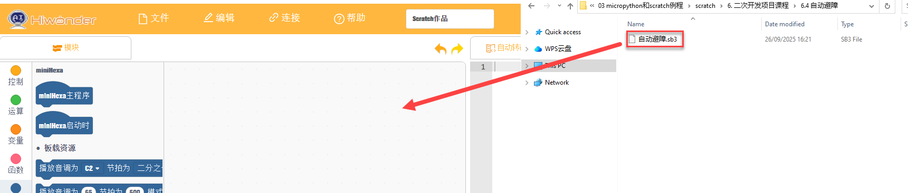

3. Click **Connect** in the menu bar and select the correct `COM` port. `COM4` is used here as an example. After the connection is successful, the **Connection Successful** message is displayed.

4. Click the upload icon  on the right side to download the program to miniHexa. Wait until the success message is displayed.

#### 7.3.4.5 Project Outcome

After power-on, miniHexa measures the distance to objects with the ultrasonic module.

1. If the distance is less than or equal to `10 cm`, miniHexa moves backward and the RGB LEDs turn red.
2. If the distance is greater than `10 cm` and less than or equal to `20 cm`, miniHexa rotates counterclockwise and the RGB LEDs turn green.
3. If the distance is greater than `20 cm`, miniHexa moves forward and the RGB LEDs turn blue.

#### 7.3.4.6 Program Analysis

1. Set `distance` as the obstacle distance detected by the glowy ultrasonic module.

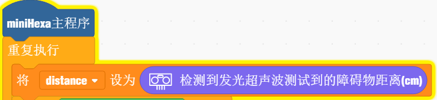

2. If the obstacle distance detected by the ultrasonic module is less than or equal to `10 cm`, control miniHexa to move backward for `4` steps at speed `2`, and set the RGB LEDs to red.

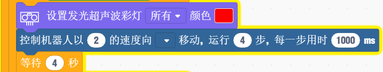

3. If the obstacle distance detected by the ultrasonic module is less than or equal to `20 cm`, control miniHexa to rotate counterclockwise at speed `1.8`.

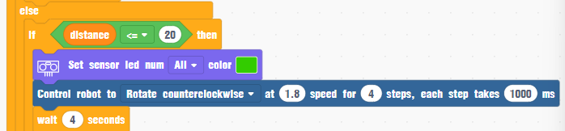

4. If the detected distance is greater than `20 cm`, control miniHexa to move forward at speed `2`.

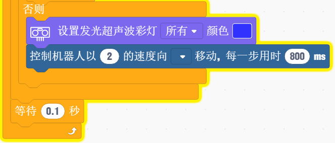

### 7.3.5 Automatic Following

#### 7.3.5.1 Feature Overview

This section uses the glowy ultrasonic sensor to detect distance and then controls robot movement according to the measured result.

#### 7.3.5.2 Project Process

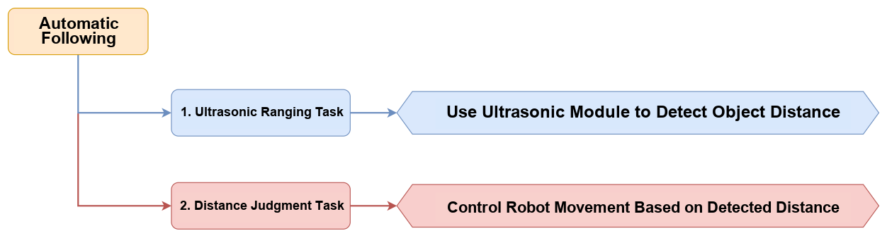

#### 7.3.5.3 Module Description

The glowy ultrasonic module integrates an I2C Port. It supports reading the measured distance data from the ultrasonic sensor through I2C communication. Two RGB LEDs are integrated at the ultrasonic probe position. The brightness can be adjusted, and multiple colors can be displayed by changing and combining the `R`, `G`, and `B` channels.

During ranging, the module automatically sends eight `40 kHz` square waves and then checks whether a return signal is received. If a signal is received, the module outputs a high level. The duration of the high level is the travel time of the ultrasonic signal from transmission to return.

> [!NOTE]
>
> **The glowy ultrasonic module is already connected to the onboard I2C Port at the factory. No additional wiring is required.**

#### 7.3.5.4 Program Download

1. Open the WonderCode software.

2. Open [**02 Program Files/05 Automatic Following Program/Automatic Following.sb3**](https://drive.google.com/drive/folders/13RQ9oGXlkCDd4qBiH-yjVe07nFF286-m?usp=sharing), then drag it into WonderCode.

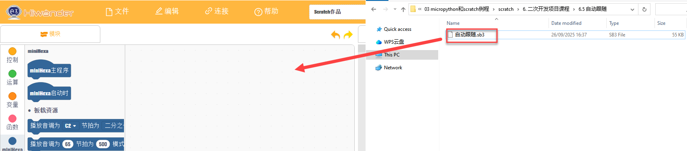

3. Click **Connect** in the menu bar and select the correct `COM` port. `COM4` is used here as an example. After the connection is successful, the **Connection Successful** message is displayed.

4. Click the upload icon  on the right side to download the program to miniHexa. Wait until the success message is displayed.

#### 7.3.5.5 Project Outcome

After power-on, miniHexa measures the distance to objects with the ultrasonic module.

1. If the distance is greater than or equal to `25 cm`, miniHexa moves forward and the RGB LEDs turn green.
2. If the distance is less than or equal to `15 cm`, miniHexa moves backward and the RGB LEDs turn red.
3. If the distance is less than `25 cm` and greater than `15 cm`, miniHexa stops and the RGB LEDs turn blue.

#### 7.3.5.6 Program Analysis

1. Set `distance` as the obstacle distance detected by the glowy ultrasonic module.

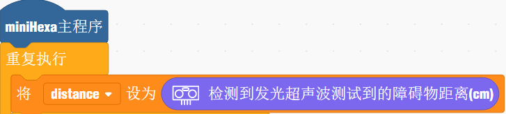

2. If the detected distance is less than or equal to `15`, set the RGB LEDs on the ultrasonic module to red and control the robot to move backward at speed `2`.

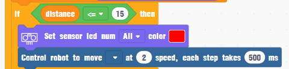

3. If the detected distance is greater than or equal to `25`, set the RGB LEDs on the ultrasonic module to green and control the robot to move forward at speed `2`.

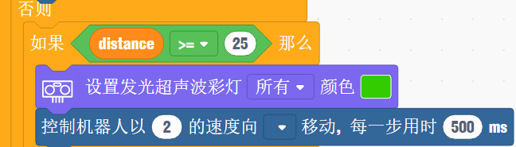

4. If the detected distance is less than `25` and greater than `15`, set the RGB LEDs on the ultrasonic module to blue and stop the robot.

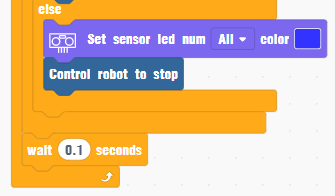

### 7.3.6 Self-Balancing

#### 7.3.6.1 Feature Overview

This section uses the IMU sensor to detect the body tilt angle and then controls the body to maintain balance according to the detected result.

#### 7.3.6.2 Project Process

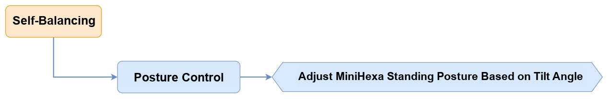

#### 7.3.6.3 Module Description

This section uses the onboard QMI8658 motion sensor. This sensor is widely used in handheld gaming products, 3D remote controllers, portable navigation devices, and other equipment.

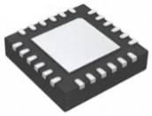

It integrates a 3-axis MEMS gyroscope, a 3-axis MEMS accelerometer, and an expandable Digital Motion Processor `DMP`.

#### 7.3.6.4 Program Download

1. Open the WonderCode software.

2. Open [**02 Program Files/06 Self-Balancing Program/Self-Balancing.sb3**](https://drive.google.com/drive/folders/13RQ9oGXlkCDd4qBiH-yjVe07nFF286-m?usp=sharing), then drag it into WonderCode.

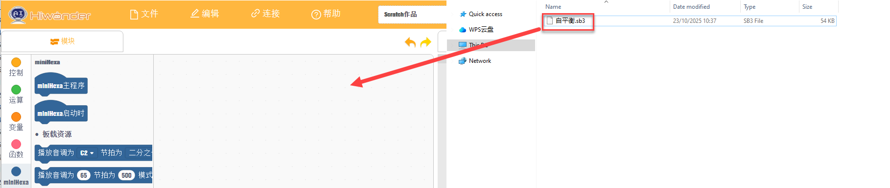

3. Click **Connect** in the menu bar and select the correct `COM` port. `COM4` is used here as an example. After the connection is successful, the **Connection Successful** message is displayed.

4. Click the upload icon  on the right side to download the program to miniHexa. Wait until the success message is displayed.

#### 7.3.6.5 Project Outcome

miniHexa reads the real-time tilt angle from the IMU sensor, performs correction calculations, and achieves self-balancing through inverse kinematics.

#### 7.3.6.6 Program Analysis

Enable the self-balancing function of miniHexa.

### 7.3.7 Dot Matrix Display

#### 7.3.7.1 Feature Overview

This section displays characters with the dot matrix module.

#### 7.3.7.2 Project Process

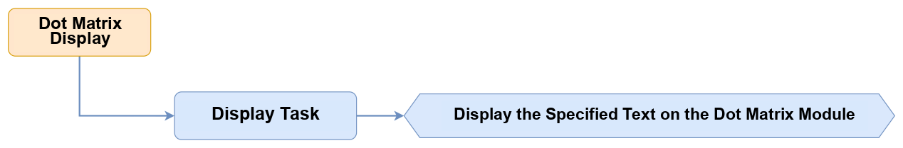

#### 7.3.7.3 Module Description

The LED dot matrix module is a display module with high brightness, flicker-free display, and convenient wiring. It can display numbers, text, patterns, and other content. The module contains two red `8 x 8` LED matrices and uses the `TM640B` driver chip to control the display.

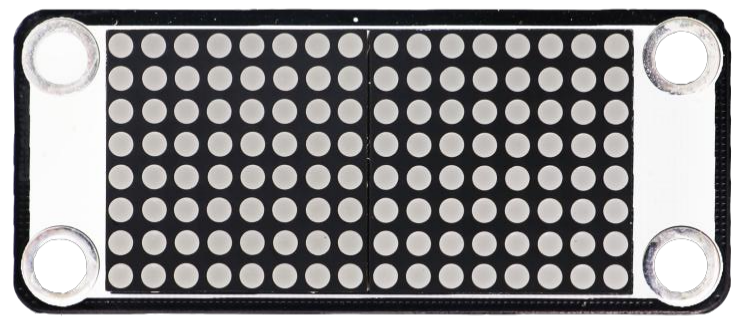

Module wiring: as shown below, connect the module to the `IO32` and `IO33` interfaces on the miniHexa base board before running this program.

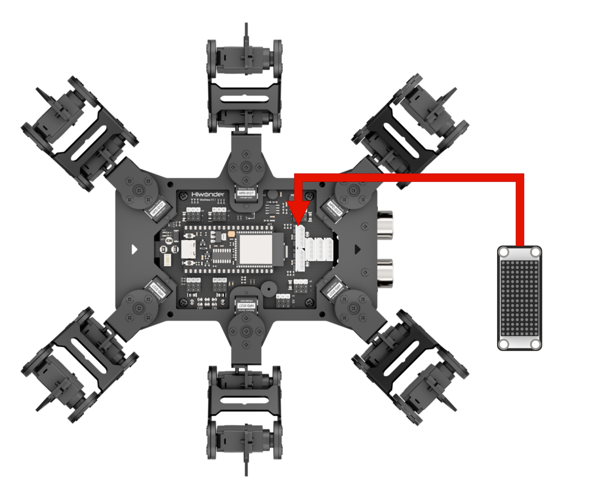

Installation method: mount the dot matrix module on the rear panel of miniHexa.

#### 7.3.7.4 Program Download

1. Open the WonderCode software.

2. Open [**02 Program Files/07 Dot Matrix Display Program/Dot Matrix Display.sb3**](https://drive.google.com/drive/folders/13RQ9oGXlkCDd4qBiH-yjVe07nFF286-m?usp=sharing), then drag it into WonderCode.

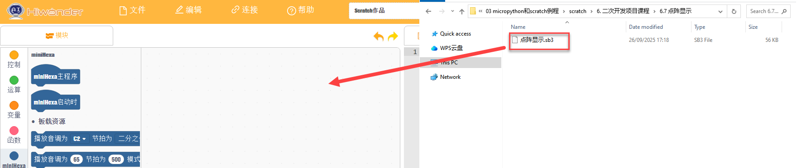

3. Click **Connect** in the menu bar and select the correct `COM` port. `COM4` is used here as an example. After the connection is successful, the **Connection Successful** message is displayed.

4. Click the upload icon  on the right side to download the program to miniHexa. Wait until the success message is displayed.

#### 7.3.7.5 Project Outcome

After power-on, the dot matrix module repeatedly displays `abc` and `ABC`.

#### 7.3.7.6 Program Analysis

1. Initialize the interface pins `IO18` and `IO19` of the dot matrix module.

2. Repeatedly display `abc` and `ABC` on the dot matrix module.

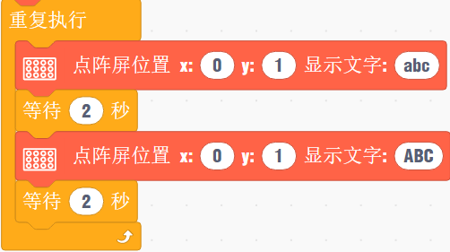

### 7.3.8 Ultrasonic Distance Measurement Display

#### 7.3.8.1 Feature Overview

This section uses the dot matrix module to display the distance measured by the ultrasonic module in real time and changes the RGB LED color of the glowy ultrasonic module.

#### 7.3.8.2 Project Process

#### 7.3.8.3 Module Description

1. Ultrasonic module

The module uses an I2C Port and can read the distance measured by the ultrasonic sensor through I2C communication. Two RGB LEDs are integrated at the ultrasonic probe position. The brightness can be adjusted. Color changes and color mixing across the `R`, `G`, and `B` channels make full-color lighting effects possible.

During ranging, the module automatically sends eight `40 kHz` square waves and then checks whether a return signal is received. If a signal is received, the module outputs a high level. The duration of the high level is the travel time of the ultrasonic signal from transmission to return.

> [!NOTE]
>
> **The glowy ultrasonic module is already connected to the onboard I2C Port at the factory. No additional wiring is required.**

2. Dot matrix module

The LED dot matrix module is a display module with high brightness, flicker-free display, and convenient wiring. It can display numbers, text, patterns, and other content. The module contains two red `8 x 8` LED matrices and uses the `TM640B` driver chip to control the display.

Module wiring: as shown below, connect the module to the `IO32` and `IO33` interfaces on the miniHexa base board before running this program.

Installation method: mount the dot matrix module on the rear panel of miniHexa.

#### 7.3.8.4 Program Download

1. Open the WonderCode software.

2. Open [**02 Program Files/08 Ultrasonic Distance Measurement and Displaying Program/Ultrasonic Distance Measurement Display.sb3**](https://drive.google.com/drive/folders/13RQ9oGXlkCDd4qBiH-yjVe07nFF286-m?usp=sharing), then drag it into WonderCode.

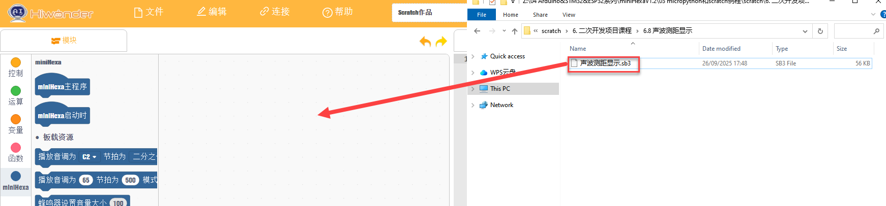

3. Click **Connect** in the menu bar and select the correct `COM` port. `COM4` is used here as an example. After the connection is successful, the **Connection Successful** message is displayed.

4. Click the upload icon  on the right side to download the program to miniHexa. Wait until the success message is displayed.

#### 7.3.8.5 Project Outcome

When an obstacle approaches the glowy ultrasonic module, the dot matrix module displays the detected distance, and the RGB LED color of the glowy ultrasonic module changes according to the distance.

#### 7.3.8.6 Program Analysis

1. Initialize the interface pins `IO18` and `IO19` of the dot matrix module.

2. First set `distance` as the obstacle distance detected by the ultrasonic module, then display the detected `distance` on the dot matrix module.

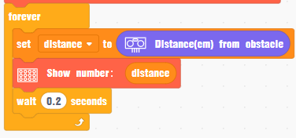

### 7.3.9 Touch Control

#### 7.3.9.1 Feature Overview

This section controls miniHexa movement by touching the touch sensor.

#### 7.3.9.2 Project Process

#### 7.3.9.3 Module Description

The touch sensor is a capacitive touch sensor. It detects the human body or metal mainly through the gold-plated contact surface.

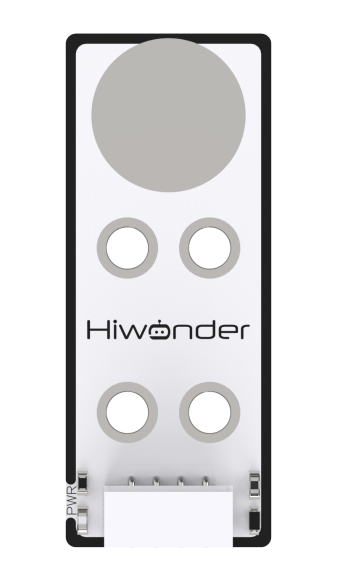

When no person or metal touches the metal surface, the signal terminal outputs a high level. When a person or metal touches the metal surface, the signal terminal outputs a low level.

Module wiring: as shown below, connect the module to the `IO33` and `IO32` interfaces on the miniHexa base board before running this program.

Installation method: mount the dot matrix module on the rear panel of miniHexa.

#### 7.3.9.4 Program Download

1. Open the WonderCode software.

2. Open [**02 Program Files/09 Touch Control Program/Touch Control.sb3**](https://drive.google.com/drive/folders/13RQ9oGXlkCDd4qBiH-yjVe07nFF286-m?usp=sharing), then drag it into WonderCode.

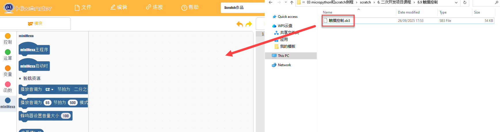

3. Click **Connect** in the menu bar and select the correct `COM` port. `COM4` is used here as an example. After the connection is successful, the **Connection Successful** message is displayed.

4. Click the upload icon  on the right side to download the program to miniHexa. Wait until the success message is displayed.

#### 7.3.9.5 Project Outcome

When the metal surface on the touch sensor is touched with a finger, miniHexa moves forward at speed `2`.

#### 7.3.9.6 Program Analysis

1. Initialize the interface pins `IO32` and `IO14` of the touch sensor.

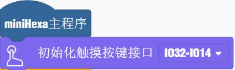

2. If the touch sensor is pressed, control the robot to move forward for `2` steps at speed `2`.

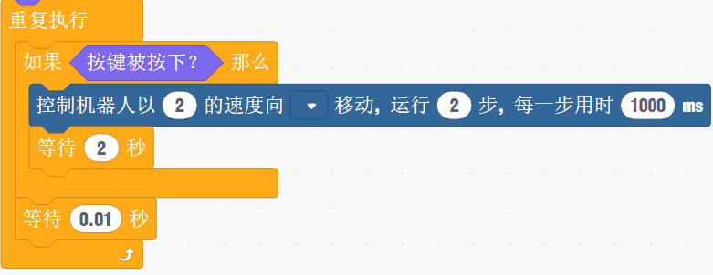

### 7.3.10 Infrared Obstacle Avoidance

#### 7.3.10.1 Feature Overview

This section uses infrared obstacle avoidance sensors to detect obstacles and controls the robot to move accordingly.

#### 7.3.10.2 Project Process

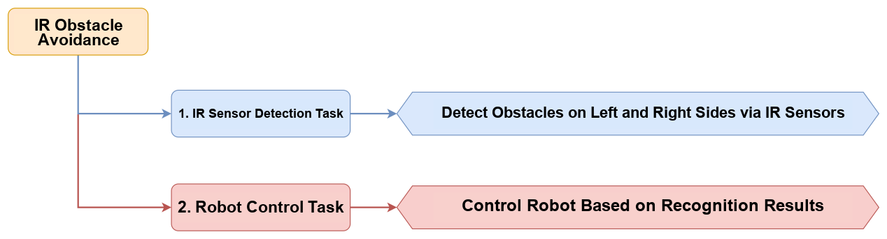

#### 7.3.10.3 Module Description

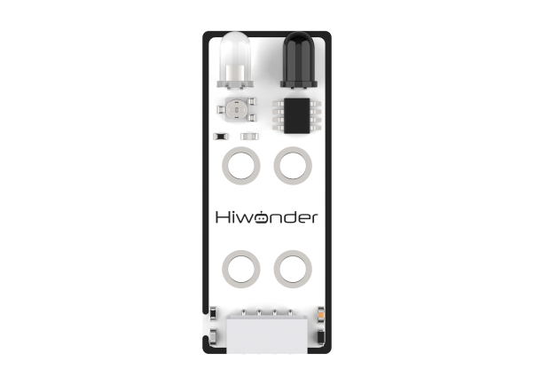

The infrared obstacle avoidance sensor is used to detect whether there is an obstacle ahead. The sensor includes one infrared transmitter and one infrared receiver. Once the sensor encounters an obstacle, the infrared light is reflected back and received by the receiver.

Module wiring: as shown below, connect the module to the `IO32`, `IO14`, `IO18`, and `IO19` interfaces on the miniHexa base board before running this program.

Installation method: mount the infrared sensor module on the rear panel of miniHexa.

#### 7.3.10.4 Program Download

1. Open the WonderCode software.

2. Open [**02 Program Files/10 Infrared Obstacle Avoidance Program/Infrared Obstacle Avoidance.sb3**](https://drive.google.com/drive/folders/13RQ9oGXlkCDd4qBiH-yjVe07nFF286-m?usp=sharing), then drag it into WonderCode.

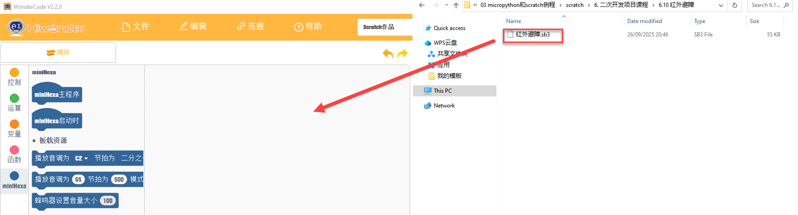

3. Click **Connect** in the menu bar and select the correct `COM` port. `COM4` is used here as an example. After the connection is successful, the **Connection Successful** message is displayed.

4. Click the upload icon  on the right side to download the program to miniHexa. Wait until the success message is displayed.

#### 7.3.10.5 Project Outcome

After power-on, miniHexa uses two infrared obstacle avoidance sensors to detect obstacles around the body. If no obstacle is detected, miniHexa moves forward. If one side detects an obstacle, miniHexa turns away from the obstacle. If both sides detect obstacles, miniHexa first moves backward and then rotates in place.

#### 7.3.10.6 Program Analysis

1. If infrared obstacle avoidance sensor `1` at `IO32` and `IO14` and infrared obstacle avoidance sensor `2` at `IO18` and `IO19` both detect obstacles, first control the robot to move backward for `2` steps at speed `2`, then rotate counterclockwise for `2` steps at speed `2`.

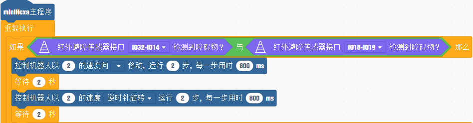

2. If infrared obstacle avoidance sensor `1` detects an obstacle and sensor `2` does not, control the robot to rotate counterclockwise for `2` steps at speed `2`.

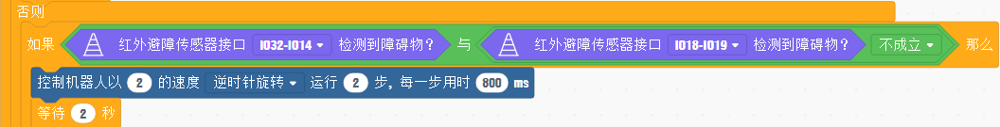

3. If infrared obstacle avoidance sensor `1` does not detect an obstacle and sensor `2` does, control the robot to rotate clockwise for `2` steps at speed `2`.

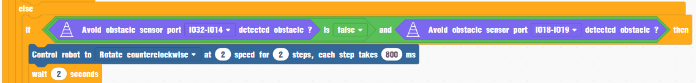

4. If infrared obstacle avoidance sensor `1` and sensor `2` both do not detect obstacles, control the robot to move forward at speed `2`.

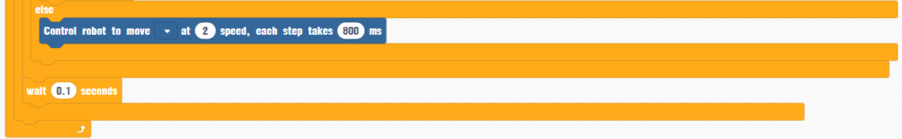

### 7.3.11 Intelligent Fall Prevention

#### 7.3.11.1 Feature Overview

This section uses infrared obstacle avoidance sensors to detect an edge condition and controls robot movement to prevent a fall.

#### 7.3.11.2 Project Process

#### 7.3.11.3 Module Description

The infrared obstacle avoidance sensor is used to detect whether there is an obstacle ahead. The sensor includes one infrared transmitter and one infrared receiver. Once the sensor encounters an obstacle, the infrared light is reflected back and received by the receiver.

Module wiring: as shown below, connect the module to the `IO32`, `IO14`, `IO18`, and `IO19` interfaces on the miniHexa base board before running this program.

Installation method: install the infrared sensor modules on the front two legs of miniHexa.

#### 7.3.11.4 Program Download

1. Open the WonderCode software.

2. Open [**02 Program Files/11 Intelligent Fall Prevention Program/Intelligent Fall Prevention.sb3**](https://drive.google.com/drive/folders/13RQ9oGXlkCDd4qBiH-yjVe07nFF286-m?usp=sharing), then drag it into WonderCode.

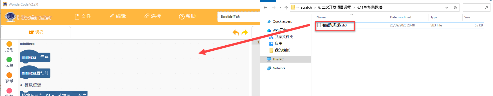

3. Click **Connect** in the menu bar and select the correct `COM` port. `COM4` is used here as an example. After the connection is successful, the **Connection Successful** message is displayed.

4. Click the upload icon  on the right side to download the program to miniHexa. Wait until the success message is displayed.

#### 7.3.11.5 Project Outcome

miniHexa uses the infrared sensor modules to detect whether the front legs are suspended. If either side is suspended, miniHexa moves backward. Otherwise, miniHexa moves forward.

#### 7.3.11.6 Program Analysis

1. If either infrared obstacle avoidance sensor `1` at `IO32` and `IO14` or sensor `2` at `IO18` and `IO19` detects an obstacle, first control the robot to move backward for `2` steps at speed `2`, then rotate counterclockwise for `2` steps at speed `2`.

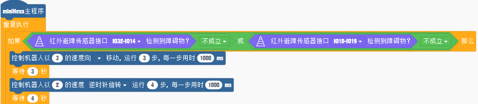

2. If the condition above is not met, control the robot to move forward at speed `2`.

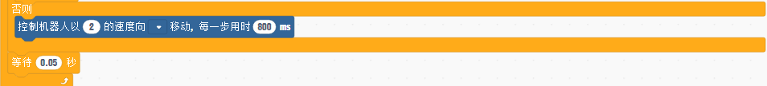
