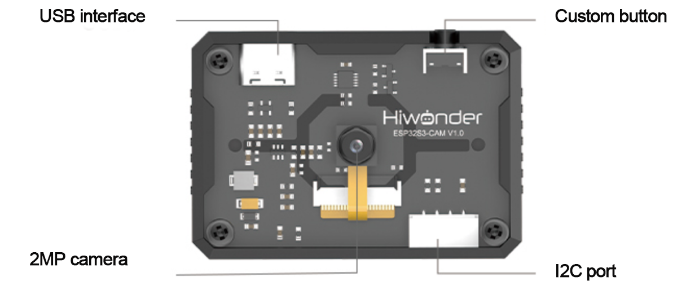
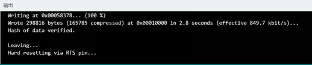
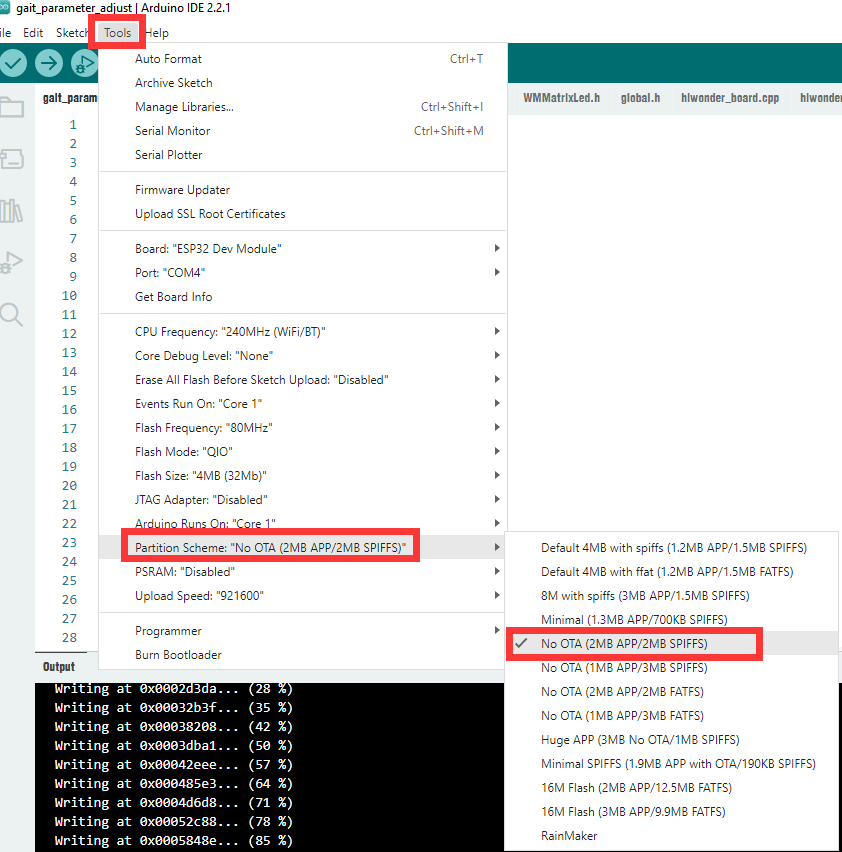

# 7. AI Vision Feature Course

## 7.1 ESP32-S3 AI Vision Module 

### 7.1.1 Introduction to ESP32-S3 AI Vision Module

* **Product Introduction**

The ESP32-S3 AI Vision Module is a compact camera module that can operate independently as a minimum system.

It captures images through the built-in camera, processes the data with the ESP32 microcontroller, and transmits it wirelessly via the Wi-Fi module. It also supports multiple communication protocols and low-power operation, making it widely applicable in various IoT scenarios.

* **Interface Description**



| **Interface Name** |                       **Description**                       |
| :----------------: | :---------------------------------------------------------: |
|  USB Serial Port   |     Used for serial communication and firmware flashing     |
|     Custom Key     |       User-definable key events programmable in code        |
|      IIC Port      | Secondary development interface, connects to the controller |

* **Notice**

(1) If the captured image shows water ripple patterns, it may be caused by the input power supply providing ≤2A of rated current. Please check the current output of the power supply device.

(2) The module comes with a default program for image transmission. For vision recognition functions, flash the corresponding program as needed.

* **Module Wiring**

Use a 4-pin cable to connect the module to any IIC port marked in red on the servo controller.


### 7.1.2 Installation of ESP32-S3 AI Vision Module


### 7.1.3 Getting Started

* **Note**

If the captured image shows water ripple patterns, it may be caused by the input power supply providing ≤2A of rated current. Please check the current output of the power supply device.

:::

The module comes preloaded with firmware for video transmission. You can use it out of the box without flashing any additional firmware. To enable other functions, reflash the corresponding firmware.

* **Device Connection**

(1) Connect the vision module to your computer using a Type-C cable. Check the Device Manager to confirm that the port has been successfully recognized.


:::{Note}

If the device does not appear in the list, your computer may be missing the required driver. You can find the installation package under:  [Appendix->ch34x Driver]() and install it manually.

:::

(2) Connect to the hotspot generated by the module: HW_ESP32S3CAM.


* **Image Transmission**

Open a web browser on mobile or PC, here we take PC as an example. Enter 192.168.5.1 in the address bar and press Enter. On the opened page, click  to access the camera video feed.


### 7.1.4 Device Master-Subordinate Communication Principle & Coordinate System Explanation

* **Introduction**

This section aims to introduce the detailed information about the master-subordinate relationship of the ESP32-S3 module (hereinafter referred to as ESP32-S3) when communicating with different devices such as Arduino or ESP32 controllers. It explains how the ESP32-S3 operates as a subordinate device to communicate with other devices, and how other devices act as the master to access and control data from the ESP32-S3.

In this chapter, the ESP32-S3 functions as a subordinate device, transmitting information via the IIC protocol.

* **Master-Subordinate Relationship**

In a controller–device communication system, the ESP32-S3 acts as the subordinate device, while other microcontrollers or devices serve as the master.

(1) Functions of ESP32-S3 as a Subordinate Device

① Receiving and Parsing Signals from the Controller:

It waits for IIC signal interrupts. When data is received via IIC, the module calls the corresponding function based on the register address information.

② Data Processing and Feedback:

When the ESP32-S3 receives a register read command, it calls the corresponding send function to transmit the detected data to the master device.

When it receives a register write command, it sets the brightness of the auxiliary light accordingly.

(2) Other Devices as Controlling Device

① Command Sending:

The controlling device needs to send data read commands to the ESP32-S3.

② Control coordination:

The controlling device manages the coordination of the entire system, ensuring that communication and operations between the controlling device, the ESP32-S3, and any other devices connected to the controlling device do not conflict, maintaining proper system functionality.

③ Data reception:

When the controlling device reads data, after sending the read command, it needs to receive status information from the ESP32-S3, parse the data packet, and extract the useful information.

* **Device Address and Registers**

When ESP32-S3 is used for face recognition:

|       **Address**       |                       **Description**                        |
| :---------------------: | :----------------------------------------------------------: |
|  0x52 (Device address)  |              Communication address of ESP32-S3               |
| 0x01 (Register address) | Read face data 【int16_t x, y, w, h】. All zeros if no face detected. |

:::{Note}

The x, y, w, h values represent the face detection bounding box in the original image: 

① x-coordinate of the box center 

② y-coordinate of the box center

③ Width of the bounding box 

④ Height of the bounding box. Units are in pixels. The pixel coordinate system is detailed in “Module Coordinate System Explanation.”

:::

When ESP32-S3 is used for color recognition:

|       **Address**       |                       **Description**                        |
| :---------------------: | :----------------------------------------------------------: |
|  0x52 (Device address)  |              Communication address of ESP32-S3               |
| 0x00 (Register address) | Read color 0 data 【int16_t x, y, w, h】. All zeros if not detected. |
| 0x01 (Register address) | Read color 1 data 【int16_t x, y, w, h】. All zeros if not detected. |

:::{Note}

* The x, y, w, h values represent the color block bounding box in the original image:

  ① x-coordinate of the box center

  ② y-coordinate of the box center 

  ③ Width of the bounding box 

  ④ Height of the bounding box. Units are in pixels. Refer to “4. Module Coordinate System Explanation” for the pixel coordinate system.

* If multiple color blocks that meet the preset color thresholds appear in the camera view, the module selects the two largest by area and stores their bounding box data sequentially in registers 0x00 and 0x01.

:::

* **Module Coordinate System Explanation**

This section briefly introduces the image coordinate system design of the camera module when operating in different modes. Readers should understand this before studying the example routines.

When port the example routines for secondary development, you should refer to this document and establish the mapping relationship between the module’s image coordinate system and the real-world coordinate system.

The following are key points about the module image coordinate system:

① The origin is not at the center of the screen but at the top-left corner.

② The Y-axis direction is opposite to the common Cartesian coordinate system.

(1) Image Transmission Mode


:::{Note}

The image transmission mode uses a resolution of 320×240 to match the image data interface requirements of Hiwonder’s mobile app.

:::

(2) Face Recognition Mode


:::{Note}

To ensure smooth image processing, the face recognition mode uses a resolution of 240×240, which is the value determined from Hiwonder’s internal testing.

:::

(3) Color Recognition Mode


:::{Note}

To ensure smooth image processing, the color recognition mode uses a resolution of 160×140, which is the value determined from Hiwonder’s internal testing.

:::

* **Notice**

The power supply of the controlling device and the ESP32-S3 module can be different. However, they must share a common ground when connected to ensure stable communication levels.

## 7.2 Color Threshold Adjustment

This section explains how to use the ESP32-S3 for color recognition and how to modify the target color to be detected.

:::{Note}

* The example program used in this section can be found at: [Color Detection Example\ColorDetection](). This program is not related to the "Color Tracking" demo.

* The threshold adjustment method described here also applies to the ESP32-S3 program for the "Color Recognition" demo.

:::

### 7.2.1  Downloading the Color Recognition Program

(1) Connect one end of the Type-C cable to the ESP32S3 module and the other end to the computer’s USB port.

(2) Open the program file located in the same directory as this document: [Color Detection Example\ColorDetection\ColorDetection.ino]()


(3) Next, select the development board “**ESP32S3 Dev Module**”.


(4) In the menu bar, click **Tools**, and choose the corresponding ESP32S3 controller configuration as illustrated.


(5) Finally, click  to upload the code to the ESP32S3 vision module and wait for the upload to complete.


### 7.2.2 Modifying the Target Color

Here we use the ESP32-S3 color recognition function as an example to demonstrate how to adjust the detection color. Steps to modify:

(1) First to open the tool: [Color Threshold Tool\Color Threshold Tool.exe]()


(2) Click the button to select image and import an image file.


(3) Adjust the HSV threshold sliders to segment the image. You may refer to the provided HSV range table for guidance.


(4) The interface includes six text boxes showing the HSV threshold values. Each is linked to a corresponding slider, as illustrated below.


(5) On the left side of the tool, you will see the original imported image. On the right side, the processed result after HSV segmentation will be displayed. Drag the sliders until only the desired target color remains highlighted. In the recognition result on the right, only the image regions corresponding to the your target color appear in white, while all other regions are shown in black.

:::{Note}

The black areas indicate unrecognized regions, meaning that the current HSV thresholds do not detect these colors. The white areas indicate recognized regions, meaning that the current HSV thresholds successfully detect these colors.

:::


(6) Then save the HSV thresholds and open the file [Color Detection Example\ColorDetection\color_detection.cpp]()  located in the same directory as this document. Modify the color data with the saved HSV array. Finally, refer to section [7.2.1 Downloading the Color Recognition Program]() in this document to flash the modified program into the ESP32-S3.

(7) In the container shown below, the parameters within each element are defined as follows: {{Hmin, Hmax, Smax, Smin, Vmax, Vmin}, 64, “Color Name”}. The corresponding source code is shown in the figure below:


(8) The following figure shows the source code after modifying the recognition color. After the modification, the module no longer recognizes red but instead recognizes purple. When the serial port receives “color\[0\]”, it indicates that purple has been detected.


:::{Note}

Make sure that the array elements follow the correct format and are separated by commas.

:::

(9) Once the flashing is complete, the ESP32 camera will be able to recognize objects of other colors.

## 7.3 Color Recognition

### 7.3.1 Overview

In this lesson, the ESP32-S3 vision module is used to detect red, green, and blue colors. Based on the detected color, the corresponding color on the light-up ultrasonic module will be activated.

### 7.3.2 Project Process


### 7.3.3 Module Instruction

* **ESP32-S3 AI Vision Module**


This is a development board integrating the ESP32-S3 chip and a camera module. Once mounted on the carrier board, it uses the IIC communication interface to read color and face recognition data.

Module connection: As shown in the figure below, please connect the module to any IIC port marked in the red frame on the servo control board before starting the feature.


* **Glowy Ultrasonic Sensor**


This module uses an IIC communication interface and can read distance measurements from the ultrasonic sensor via IIC. Additionally, the ultrasonic probe integrates two RGB LEDs, which not only support brightness adjustment but also can produce colorful lighting effects through changes and combinations of the red (R), green (G), and blue (B) channels.

:::{Note}

The sensor comes with the onboard IIC port already connected at the factory. No additional wiring by the user is required.

:::

### 7.3.4 Program Download

* **ESP32S3 Program Download**

[Source Code]()

(1) Connect one end of the Type-C cable to the ESP32S3 module and the other end to the computer’s USB port.

(2) Open the program file located in the same directory as this document: [Color Recognition Program\ESP32S3Cam_ColorDetection\\ ESP32S3Cam_ColorDetection.ino]()


(3) Next, select the development board “**ESP32S3 Dev Module**”.


(4) In the menu bar, click **Tools**, and choose the corresponding ESP32S3 controller configuration as illustrated.


:::{Note}

Make sure to set the correct controller configuration before uploading the program.

:::

(5) Finally, click  to upload the code to the ESP32S3 vision module and wait for the upload to complete.


* **ESP32 Program Download**

[Source Code]()

(1) Connect miniHexa to your computer using a Type-C data cable.


(2) Open the program file located in the same directory as this document: [Color Recognition Program\miniHexa\color_detection]()


(3) Select the development board model when you open the program, and the specific model is shown in the figure below.


(4) In the menu bar, click **Tools**, and choose the corresponding ESP32 controller configuration as illustrated.


:::{Note}

Make sure to set the correct controller configuration before uploading the program.

:::

(5) Click "**Compile**” first, then click "**Upload**". After the upload is completed, the program download is completed if the following interface appears in the output box below the software.


### 7.3.5 Project Outcome

When the vision module detects a color block of red, green, or blue, it controls the RGB lights of the illuminated ultrasonic module to light up in the same color.


### 7.3.6 Program Brief Analysis

[Source Code]()

(1) The program imports the hiwonder_robot.h library. This library contains methods for interacting with the robot system.

{lineno-start=1}

```
#include "hiwonder_robot.h"
```

(2) Create the robot object for subsequent control.

{lineno-start=3}

```
Robot minihexa;
```

(3) Create an array val for storing color IDs, and two RGB intensity arrays rgb1 and rgb2 for the two RGB lights on the illuminated ultrasonic module. Arrays for robot movement speed, center of gravity, and attitude are created: vel, pos, and att.

{lineno-start=5}

```
uint8_t val[4];
uint8_t rgb1[3] = {0};
uint8_t rgb2[3] = {0};

Velocity_t vel = {0.0f,0.0f,0.0f};
Vector_t pos = {0.0f,0.0f,0.0f};
Euler_t att = {0.0f,0.0f,0.0f};
```

(4) In the setup() function, first initialize the serial port with a baud rate of 115200, then initialize the robot. Next, call the sensor object’s set_ultrasound_rgb function to set the two RGB lights of the illuminated ultrasonic module in RGB_WORK_SOLID_MODE, which is a constant color mode, according to the intensity ratios in rgb1 and rgb2. Since rgb1 and rgb2 are initially all zeros, the RGB lights remain off.

{lineno-start=13}

```
void setup() {
  delay(1000);
  Serial.begin(115200);
  minihexa.begin();
  delay(1000);
  minihexa.sensor.set_ultrasound_rgb(RGB_WORK_SOLID_MODE, rgb1, rgb2);
}
```

(5) In the `loop()`, call the vision module sub-object camera of the sensor object and use color_id_detection to read the “Color ID Register” of the vision module, storing the data into the val array.

:::{Note}

* The vision module is preset to detect four colors: red, green, blue, and purple, with IDs 1–4. The Color ID Register has 4 bytes, each corresponding to one color ID in order.

* When any color is detected, the corresponding byte in the register stores its ID; otherwise, it stores 0.

:::

{lineno-start=20}

```
void loop() {
  Serial.printf("%d %d %d %d\n", val[0], val[1], val[2], val[3]);
  minihexa.sensor.camera.color_id_detection(val, sizeof(val));
```

(6) Determine the detected colors from the val array and control the illuminated ultrasonic module to light the corresponding color. Since the logic for each color is similar, here we explain using red as an example:

① Red corresponds to ID 1 and is stored in the first byte of the Color ID Register. Check if val\[0\] equals 1; if so, red is detected.

② Then check the values of the second through fourth bytes to confirm that they are all 0, ensuring that only the red color is detected.

③ If all conditions are satisfied, set the intensity ratio in rgb1 to 10:0:0, and copy this value to rgb2. Finally, call the sensor object’s set_ultrasound_rgb function to update both RGB lights on the illuminated ultrasonic module to display red.

{lineno-start=23}

```
  if(val[0] == 1 && val[1] == 0 && val[2] == 0 && val[3] == 0) {
    rgb1[0] = 10;
    rgb1[1] = 0;
    rgb1[2] = 0;
    memcpy(rgb2, rgb1, sizeof(rgb1));
    minihexa.sensor.set_ultrasound_rgb(RGB_WORK_SOLID_MODE, rgb1, rgb2);
    delay(500);

  }
```

## 7.4 Color Tracking

### 7.4.1 Overview

In this lesson, let’s use the ESP32-S3 vision module to detect red objects and control the robot to rotate in place to follow the movement of the object.

### 7.4.2 Project Process


### 7.4.3 Module Instruction

* **ESP32-S3 AI Vision Module**


This is a development board integrating the ESP32-S3 chip and a camera module. Once mounted on the carrier board, it uses the IIC communication interface to read color and face recognition data.

Module connection: As shown in the figure below, please connect the module to any IIC port marked in the red frame on the servo control board before starting the feature.


* **Glowy Ultrasonic Sensor**


This module uses an IIC communication interface and can read distance measurements from the ultrasonic sensor via IIC. Additionally, the ultrasonic probe integrates two RGB LEDs, which not only support brightness adjustment but also can produce colorful lighting effects through changes and combinations of the red (R), green (G), and blue (B) channels.

:::{Note}

The sensor comes with the onboard IIC port already connected at the factory. No additional wiring by the user is required.

:::

### 7.4.4 Program Download

* **ESP32S3 Program Download**

[Source Code]()

(1) Connect one end of the Type-C cable to the ESP32S3 module and the other end to the computer’s USB port.

(2) Open the program file located in the same directory as this document: [Color Tracking Program\esp32s3\ColorDetection\ColorDetection.ino]()


(3) Next, select the development board “**ESP32S3 Dev Module**”.


(4) In the menu bar, click **Tools**, and choose the corresponding ESP32 controller configuration as illustrated.


:::{Note}

Make sure to set the correct controller configuration before uploading the program.

:::

(5) Finally, click  to upload the code to the ESP32S3 vision module and wait for the upload to complete.


* **ESP32 Program Download**

[Source Code]()

(1) Connect miniHexa to your computer using a Type-C data cable.


(2) Open the program file located in the same directory as this document: [Color Tracking Program\miniHexa\color_tracking]()


(3) Select the development board model when you open the program, and the specific model is shown in the figure below.


(4) In the menu bar, click **Tools**, and choose the corresponding ESP32 controller configuration as illustrated.


:::{Note}

Make sure to set the correct controller configuration before uploading the program.

:::

(5) Click "**Compile**” first, then click "**Upload**". After the upload is completed, the program download is completed if the following interface appears in the output box below the software.



### 7.4.5 Project Outcome

When the vision module detects a red object, the robot remains standing in place and adjusts its posture to ensure that the vision module always faces the red object.

:::{Note}

The robot's rotation is limited in the program. It only tracks the object within a range of ±20° from its current orientation.

:::


### 7.4.6 Program Brief Analysis

[Source Code]()

(1) The program imports the hiwonder_robot.h library. This library contains methods for interacting with the robot system.

{lineno-start=1}

```
#include "hiwonder_robot.h"
```

(2) Create the robot and sensor objects for subsequent control.

{lineno-start=3}

```
Robot minihexa;
```

(3) Define variables for the robot’s yaw angle and its incremental change increase, a color ID array val, and RGB intensity arrays rgb1 and rgb2 for the two RGB lights on the ultrasound module. Arrays for robot movement speed, center of gravity, and attitude are created: vel, pos, and att.

{lineno-start=5}

```
float increase;
float yaw;
uint8_t val[4];
uint8_t rgb1[3] = {0};
uint8_t rgb2[3] = {0};

Velocity_t vel = {0.0f,0.0f,0.0f};
Vector_t pos = {0.0f,0.0f,0.0f};
Euler_t att = {0.0f,0.0f,0.0f};
```

(4) In the setup() function, first initialize the serial port with a baud rate of 115200, then initialize the robot and sensor. Next, call the sensor object’s set_ultrasound_rgb function to set the two RGB lights of the illuminated ultrasonic module in RGB_WORK_SOLID_MODE, which is a constant color mode, according to the intensity ratios in rgb1 and rgb2. Since rgb1 and rgb2 are initially all zeros, the RGB lights remain off.

{lineno-start=15}

```
void setup() {
  Serial.begin(115200);
  minihexa.begin();
  delay(1000);
  minihexa.sensor.set_ultrasound_rgb(RGB_WORK_SOLID_MODE, rgb1, rgb2); 
}
```

(5) In the loop() function, first call the vision module’s camera.green_block_detection function to read the data for the red color stored in the “color register 2” and store it in the val array.

:::{Note}

* The vision module can detect four preset colors: red, green, blue, and purple, with IDs 1–4. The data for these four IDs are stored sequentially in addresses 0x00–0x03.

* Each ID has 4 bytes of data representing the detected color bounding box in the 2D image coordinate system: center point x-coordinate, center point y-coordinate, bounding box width, and bounding box height.

:::

{lineno-start=21}

```
void loop() {
  minihexa.sensor.camera.green_block_detection(val, sizeof(val));
```

(6) First, check whether the data for ID 2 (red) are all zeros. If not, the module has detected the red color. Next, read the x-coordinate of the red bounding box center from val\[0\], which ranges from 0 to 160. Map this value to the robot’s yaw increment increase, ranging from -1 to 1, and add it to the current yaw angle yaw.

:::{Note}

In color recognition mode, the captured image width is 160 pixels, with x = 0 at the left edge, x = 160 at the right edge, and the center at x = 80.

:::

{lineno-start=23}

```
  if(val[0] != 0 && val[1] != 0 && val[2] != 0 && val[3] != 0) {
    increase = fmap((float)val[0], 0, 160, -1.0f, 1.0f);
    yaw = yaw > 20.0f ? 20.0f : yaw < -20.0f ? -20.0f : yaw + increase;

  }
```

(7) Write the updated yaw to the Euler angle array att controlling the robot’s attitude, then call the move function to execute the movement. Because yaw represents rotation around the Z-axis, the robot twists its posture to follow the moving object.

**Limitations: Due to the robot’s physical structure, it cannot rotate indefinitely. Therefore, yaw is constrained to ensure the commanded posture remains kinematically feasible.**

{lineno-start=28}

```
  att = {0.0f, 0.0f, yaw};
  minihexa.move(&vel, &pos, &att, 50); 
  delay(50);
}
```

## 7.5 Vision Line Following

### 7.5.1 Overview

In this lesson, let's use the ESP32-S3 vision module to detect red lines and control the robot to follow the line.

### 7.5.2 Project Process


### 7.5.3 Module Instruction

* **ESP32-S3 AI Vision Module**


This is a development board integrating the ESP32-S3 chip and a camera module. Once mounted on the carrier board, it uses the IIC communication interface to read color and face recognition data.

Module connection: As shown in the figure below, please connect the module to any IIC port marked in the red frame on the servo control board before starting the feature.


* **Glowy Ultrasonic Sensor**


This module uses an IIC communication interface and can read distance measurements from the ultrasonic sensor via IIC. Additionally, the ultrasonic probe integrates two RGB LEDs, which not only support brightness adjustment but also can produce colorful lighting effects through changes and combinations of the red (R), green (G), and blue (B) channels.

:::{Note}

The sensor comes with the onboard IIC port already connected at the factory. No additional wiring by the user is required.

:::

### 7.5.4 Program Download

* **ESP32S3 Program Download**

[Source Code]()

(1) Connect one end of the Type-C cable to the ESP32S3 module and the other end to the computer’s USB port.

(2) Open the program file located in the same directory as this document: [Vision Line Following Program\esp32s3\LineFollowing\\ LineFollowing.ino]()


(3) Next, select the development board “**ESP32S3 Dev Module**”.


(4) In the menu bar, click **Tools**, and choose the corresponding ESP32S3 controller configuration as illustrated.


:::{Note}

Make sure to set the correct controller configuration before uploading the program.

:::

(5) Finally, click  to upload the code to the ESP32S3 vision module and wait for the upload to complete.


(6) In the menu bar, click **Tools**, and choose the corresponding ESP32 controller configuration as illustrated.



:::{Note}

Make sure to set the correct controller configuration before uploading the program.

:::


* **ESP32 Program Download**

[Source Code]()

(1) Connect miniHexa to your computer using a Type-C data cable.


(2) Open the program file located in the same directory as this document: [Vision Line Following Program\miniHexa\line_following]()


(3) Select the development board model when you open the program, and the specific model is shown in the figure below.


(4) Click "**Compile**” first, then click "**Upload**". After the upload is completed, the program download is completed if the following interface appears in the output box below the software.


### 7.5.5 Project Outcome

When the vision module detects a red line, the robot moves along the line.

:::{Note}

The vision module is set by default to recognize red lines. If you need to change the default recognition color, please refer to the document located at: [7. AI Vision Feature Course->7.2 Color Threshold Adjustment->7.2.2 Modifying the Target Color]()

:::


### 7.5.6 Program Brief Analysis

[Source Code]()

(1) The program imports the `hiwonder_robot.h`   library. hiwonder_robot.h contains methods for interacting with the robot system itself.

{lineno-start=1}

```
#include "hiwonder_robot.h"
```

(2) Create the robot and sensor objects for subsequent control.

{lineno-start=3}

```
Robot minihexa;
```

(3) Define variables for the robot’s yaw angle and its incremental change increase, a color ID array val, and RGB intensity arrays rgb1 and rgb2 for the two RGB lights on the ultrasound module. Arrays for robot movement speed, center of gravity, and attitude are created: vel, pos, and att.

{lineno-start=5}

```
uint8_t val[4];
uint8_t rgb1[3] = {0};
uint8_t rgb2[3] = {0};

Velocity_t vel = {0.0f,0.0f,0.0f};
Vector_t pos = {0.0f,0.0f,0.0f};
Euler_t att = {0.0f,0.0f,0.0f};
```

(4) In the setup() function, first initialize the serial port with a baud rate of 115200, then initialize the robot and sensor.

Next, call the sensor object’s set_ultrasound_rgb function to set the two RGB lights of the illuminated ultrasonic module in RGB_WORK_SOLID_MODE, which is a constant color mode, according to the intensity ratios in rgb1 and rgb2. Since rgb1 and rgb2 are initially all zeros, the RGB lights remain off.

{lineno-start=13}

```
void setup() {
  Serial.begin(115200);
  minihexa.begin();
  delay(100);
  minihexa.sensor.set_ultrasound_rgb(RGB_WORK_SOLID_MODE, rgb1, rgb2);
}
```

(5) In the main loop:

① First, call the region2_red_block_detection function of the vision module sub-object camera under the sensor object to read the red block data detected by the vision module, and store the data into the val array.

:::{Note}

Each ID has 4 bytes of data representing the detected color bounding box in the 2D image coordinate system: center point x-coordinate, center point y-coordinate, bounding box width, and bounding box height.

:::

{lineno-start=19}

```
void loop() {
  minihexa.sensor.camera.region2_red_block_detection(val, sizeof(val));
```

② Compare the value of val\[0\], which represents the x-coordinate of the center point of the detected block. If it is greater than 120, set the y component of the vel parameter to 1 and the z component to -0.1. These values are used to control the robot to turn right.

:::{Note}

In color recognition mode, the captured image width is 160 pixels, with x = 0 at the left edge, x = 160 at the right edge, and the center at x = 80.

:::

{lineno-start=21}

```
  if(val[0] > 120) {
    vel = {0.0f, 1.0f, -0.1f};
  }
```

③ If val\[0\] is less than 40, set the y component of the vel parameter to 1 and the z component to 0.1. These values are used to control the robot to turn left. If val\[0\] is between 40 and 120, the robot is controlled to move straight.

{lineno-start=24}

```
  else if(val[0] < 40) {
    vel = {0.0f, 1.0f, 0.1f};
  }
  else{
    vel = {0.0f, 1.0f, 0.0f};
  }
```

④ Finally, pass the vel parameter to the move function to control the robot’s movement.

{lineno-start=30}

```
  minihexa.move(&vel, &pos, &att, 700);
  delay(20);
}
```

## 7.6 Face Recognition

### 7.6.1 Overview

In this lesson, you will learn to use the ESP32-S3 vision module to detect faces. Once a face is recognized, the robot will swing three times as a gesture of welcome.

### 7.6.2 Project Process


### 7.6.3 Module Instruction

* **ESP32-S3 AI Vision Module**


This is a development board integrating the ESP32-S3 chip and a camera module. Once mounted on the carrier board, it uses the IIC communication interface to read color and face recognition data.

Module connection: As shown in the figure below, please connect the module to any IIC port marked in the red frame on the servo control board before starting the feature.


* **Glowy Ultrasonic Sensor**


This module uses an IIC communication interface and can read distance measurements from the ultrasonic sensor via IIC. Additionally, the ultrasonic probe integrates two RGB LEDs, which not only support brightness adjustment but also can produce colorful lighting effects through changes and combinations of the red (R), green (G), and blue (B) channels.

:::{Note}

The sensor comes with the onboard IIC port already connected at the factory. No additional wiring by the user is required.

:::

### 7.6.4 Program Download

* **ESP32S3 Program Download**

[Source Code]()

(1) Connect one end of the Type-C cable to the ESP32S3 module and the other end to the computer’s USB port.

(2) Open the program file located in the same directory as this document: [Face Recognition Program\esp32s3\FaceDetection\FaceDetection.ino]() 


(3) Next, select the development board “**ESP32S3 Dev Module**”.


(4) In the menu bar, click **Tools**, and choose the corresponding ESP32S3 controller configuration as illustrated.


:::{Note}

Make sure to set the correct controller configuration before uploading the program.

:::

(5) Finally, click  to upload the code to the ESP32S3 vision module and wait for the upload to complete.


* **ESP32 Program Download**

[Source Code]()

(1) Connect miniHexa to your computer using a Type-C data cable.


(2) Open the program file located in the same directory as this document: [Face Recognition Program\miniHexa\face_detection]()


(3) Select the development board model when you open the program, and the specific model is shown in the figure below.


(4) Click "**Compile**” first, then click "**Upload**". After the upload is completed, the program download is completed if the following interface appears in the output box below the software.


### 7.6.5 Project Outcome

When the vision module detects a face, the robot will first swing slightly within ±20° of its current orientation, then swing more widely within ±7°, and finally swing slightly again within ±8°.


### 7.6.6 Program Brief Analysis

[Source Code]()

(1) The program imports the hiwonder_robot.h library, which contains the methods for interacting with the robot system.

{lineno-start=1}

```
#include "hiwonder_robot.h"
```

(2) Create the robot and sensor objects for subsequent control.

{lineno-start=3}

```
Robot minihexa;
```

(3) Define the robot’s yaw variable and its swing amplitude, as well as the face data array val. Arrays for robot movement speed, center of gravity, and attitude are created: vel, pos, and att.

{lineno-start=5}

```
uint8_t val[4];
float yaw;
float amplitude;

Velocity_t vel = {0.0f,0.0f,0.0f};
Vector_t pos = {0.0f,0.0f,0.0f};
Euler_t att = {0.0f,0.0f,0.0f};
```

(4) In the `setup()` function, first initialize the serial port with a baud rate of 115200, then initialize the robot.

{lineno-start=13}

```
void setup() {
  Serial.begin(115200);
  minihexa.begin();
}
```

(5) In the main loop:

First, call the face_data_receive function from the vision module sub-object camera of the robot object to read the **“face recognition register”** of the vision module. The data is then stored into the val array.

:::{Note}

The face recognition register consists of 4 bytes, storing the following data in order: the x-coordinate of the bounding box center, the y-coordinate of the bounding box center, the width of the bounding box, and the height of the bounding box, all in the captured image’s 2D coordinate system.

:::

{lineno-start=17}

```
void loop() {
  minihexa.sensor.camera.face_data_receive(val, sizeof(val));
```

(6) First use the value of val\[0\], the x-coordinate of the bounding box center, as a reference. If it is not zero, it indicates that a face has been detected. Once a face is confirmed, call the acting_cute function to control the robot and execute a three-time swing action sequence.

{lineno-start=19}

```
  if(val[0] != 0) {
    minihexa.acting_cute();
  }
  delay(20);
}
```
