# 7. Scratch Project

## 7.1 Scratch Development Environment Setup

### 7.1.1 Programming Tool Installation and Overview

#### 7.1.1.1 Firmware Flashing

:::{Note}
**Before flashing the firmware, make sure to save the servo deviation values according to [Read the Deviation Values in the PC Software](#anther7.1.2.1).**
:::

1. Extract [**2. Software/5.ESP32S3 Firmware Flashing Tool/flash_download_tool_3.9.7_1.zip**](https://drive.google.com/drive/folders/1rbPG3zhbXIqjQKnRd51mkg0iL94MHgjL?usp=sharing). Then double-click `flash_download_tool_3.9.7.exe` to open the flash tool.


2. Select **ESP32** for ChipType and **Develop** for WorkMode.


3. Power on miniHexa and connect it to the PC.

4. Select [**2. Software/8.miniHexa Factory Firmware/MicroPython & Scratch Firmware/minihexa_20250929_0x000.bin**](https://drive.google.com/drive/folders/1Lc49i8d9m1sI6gzmsgEuQdy1uPvO0Stg?usp=sharing) and set the address to `0x0000`. Select the correct serial port and baud rate. Click **ERASE** first, then click **START** to begin flashing. Wait until the process is complete.


5. After flashing is complete, restart the robot to return it to the initial position. Then follow [7.1.2 Deviation Calibration](#anther7.1.2) to write the deviation values.

#### 7.1.1.2 WonderCode Overview and Usage

* **WonderCode Overview and Installation**

WonderCode is a Scratch programming tool developed for Hiwonder products. It supports automatic conversion between graphical instruction blocks and Python code. Programs can be created by dragging and arranging blocks. This makes it a good choice for beginners who are learning to code.


1. Open [**02 WonderCode Installation Package/WonderCode setup.exe** ](https://drive.google.com/drive/folders/1g9nZuXWNgOqQaxgcV7MN2c_-jN-bExFn?usp=sharing)in the same path as this document.


2. In the language selection window, select **English**, then click **OK**.


3. Select the installation path. Keep the default path or choose a different one as needed. Then click **Next**.


4. In the additional tasks window, **Create a desktop shortcut** is selected by default. Keep the default setting, then continue to the next step.


5. Click **Install** to start the installation.


6. The software installation starts and the progress bar is displayed.


7. After the installation is complete, click **Finish**.


8. After the installation is complete, the **WonderCode** icon appears on the desktop.


* **Device Connection**

1. Connect the device, then double-click **WonderCode** to open the software.


2. Add the device extension before connecting. Otherwise, the connection cannot be established. Click the **Add Extension** button  in the lower-left corner of the main interface. In the pop-up window, select **Robot -> and then select **miniHexa**.


3. Click **Connect**, then connect to the corresponding port.


:::{Note}
**The port number is not fixed and depends on the actual connection on each PC. In this section, "COM4" is used as an example. Do not select "COM1", which is usually reserved for system communication.**
:::

If multiple USB devices are connected and the port number is unclear, open **This PC** on the desktop. Then click **Properties -> Device Manager** to check the port number of the controller.


4. After the device is paired with the software successfully, a connection success message is displayed.


* **Function Description**

The figure below shows the functional layout of the **WonderCode** software.  
① is the menu bar. ② is the blocks area. ③ is the script area. ④ is the code display and upload area.


The corresponding functions are listed in the table below:

| Icon                                                         | Function                                                     |
| ------------------------------------------------------------ | ------------------------------------------------------------ |
|  | Creates, saves, and opens program files.                     |
|  | Switches to online mode. This mode is for reference only and is not required for this course. |
|  | Connects the device to the software and selects the connection port. |
|  | Opens help materials, checks for updates, and installs drivers. |
|  | Displays the program file name. Before programming starts or before the file is saved, the default name is "scratch project". |
|  | Switches between **Online Mode** and **Upload Mode**. Save the edited program before switching. Otherwise, the file may be lost. Online mode is used for Scratch native content such as animations and games. Upload Mode works with the robot hardware to implement different functions. |
|  | Switches the interface language between English, Simplified Chinese, and Traditional Chinese. |
|  | Undoes or restores editing operations while writing the program. |
|  | Switches the editing mode. **Auto Transcode** converts block-based programs into Python. Switching to **Python Programming** allows direct editing in Python. |
|  | Saves the program as Python code.                            |
|  | Opens a saved Python file.                                   |
|  | Interacts with the device and downloads the program to the controller board. |
|  | Adds the extension package for the device.                   |
|  | Controls zoom in, zoom out, and restore default size for the code editing area from top to bottom. |

<p id ="anther7.1.2"></p>

### 7.1.2 Deviation Calibration

<p id ="anther7.1.2.1"></p>

#### 7.1.2.1 Read the Deviation Values in the PC Software

Downloading an Arduino program to the ESP32 erases the existing firmware, which clears the original servo deviation values. Before programming a Scratch project, open the PC software and save the servo deviation values.

1. Open [**2. Software/3. PC Software Package/MiniHexa.exe**](https://drive.google.com/drive/folders/1L2N8oZFAkDJX_iJaABmMiacG2YC4CMB5?usp=sharing). Connect miniHexa to the PC with a USB data cable. Then follow the steps shown below. Select the corresponding port. `COM4` is used here as an example. Click **Connect**, then click **Action Edit**.


2. Click **Read offset** to read the servo deviation values.


:::{Note}
**After the servo deviation values are read, take a screenshot to keep a backup and prevent data loss.**
:::

<p id ="anther7.1.2.2"></p>

#### 7.1.2.2 Write the Deviation Values

1. Open the Hiwonder Python Editor.


2. Open [**03 Program Files/Deviation Calibration Program/main.py**](https://drive.google.com/drive/folders/1wz4VI5Fbgzaa72nXQOk2dubsMRCYK5-Z?usp=sharing), then drag it into the Hiwonder Python Editor. The drag operation takes effect only when the file is dropped inside the red box.


3. Locate the code section that sets the deviation values:

```
# Set servo deviation values
robot.set_deviation(1 , 0)
robot.set_deviation(2 , 0)
robot.set_deviation(3 , 0)
robot.set_deviation(4 , 0)
robot.set_deviation(5 , 0)
robot.set_deviation(6 , 0)
robot.set_deviation(7 , 0)
robot.set_deviation(8 , 0)
robot.set_deviation(9 , 0)
robot.set_deviation(10 , 0)
robot.set_deviation(11 , 0)
robot.set_deviation(12 , 0)
robot.set_deviation(13 , 0)
robot.set_deviation(14 , 0)
robot.set_deviation(15 , 0)
robot.set_deviation(16 , 0)
robot.set_deviation(17 , 0)
robot.set_deviation(18 , 0)
```

4. Write the deviation data read in [Read the Deviation Values in the PC Software](#anther7.1.2.1) into the code.

```
robot.set_deviation(1 , 24)
robot.set_deviation(2 , 28)
robot.set_deviation(3 , 9)
robot.set_deviation(4 , -20)
robot.set_deviation(5 , -13)
robot.set_deviation(6 , -13)
robot.set_deviation(7 , 0)
robot.set_deviation(8 , -7)
robot.set_deviation(9 , 14)
robot.set_deviation(10 , 21)
robot.set_deviation(11 , -11)
robot.set_deviation(12 , 16)
robot.set_deviation(13 , 21)
robot.set_deviation(14 , 31)
robot.set_deviation(15 , -5)
robot.set_deviation(16 , 0)
robot.set_deviation(17 , -33)
robot.set_deviation(18 , -9)
```

5. After the deviation values are set, connect miniHexa to the PC with a Type-C data cable. Click . After the connection is successful, the icon turns green . Then click  to download the program to miniHexa.


:::{Note}
**The deviation calibration program needs to be downloaded to miniHexa and run only once. After that, the settings are stored in the miniHexa Arduino programming environment. No additional setup is required.**
:::

#### 7.1.2.3 Read the Written Deviation Values

After the deviation values are written, click . The serial port continuously prints the stored servo deviation values.


## 7.2 Basic Motion Control

### 7.2.1 Kinematics and Gait Overview

#### 7.2.1.1 Coordinate System Introduction

1. When controlling miniHexa, the contact point coordinates of the six legs can be specified. Inverse kinematics is then used to calculate the rotation angles of all servos, which controls the movement of miniHexa.

2. First establish the coordinate system of miniHexa. Use the center of the body as the origin `0, 0, 0`. From the robot's own perspective, the front is the positive Y-axis, the right side is the positive X-axis, and the upward direction is the positive Z-axis, as shown below:


3. When setting coordinates, only the X-axis, Y-axis, and Z-axis values of the six leg contact points need to be specified.

#### 7.2.1.2 Gait Overview

1. Gait is a periodic summary of the walking characteristics of animals. In simple terms, it describes how an animal walks. Common gait patterns of hexapods include tripod gait and wave gait. Under all conditions, at least three legs must remain in contact with the ground to keep the system stable.

2. The table below lists several common terms used in gait descriptions:

|     **Term**     | **Description**                                              |
| :--------------: | :----------------------------------------------------------- |
|      Phase       | The position in periodic motion. The most direct interpretation is angle. |
| Phase Difference | The lead or lag difference in motion between different legs. |
|   Swing Phase    | The leg is lifted and off the ground.                        |
|   Stance Phase   | The leg is in contact with the ground.                       |
|      Cycle       | During locomotion, the complete process from one touchdown of the foot to the next touchdown of the same foot is one cycle. |
|  Gait Frequency  | The number of gait cycles completed per unit time.           |
|   Step Length    | The distance traveled by the foot endpoint from lift-off to touchdown within one cycle. |
|  Stride Length   | The distance traveled by the body within one cycle.          |
|    Duty Cycle    | The ratio between the time a single leg stays in the stance phase and the gait cycle. |

#### 7.2.1.3 Tripod Gait Introduction

1. Tripod gait is a typical walking gait for hexapod robots. In six-legged insects, all six legs do not move forward at the same time. Instead, the three pairs of legs are divided into two groups and advance alternately in a triangular support structure. In simple terms, three legs move up and down alternately with the other three.

2. This triangular support structure keeps the body in a statically stable state.

3. Most hexapod robots currently use an insect-inspired structure. The six legs are distributed on both sides of the body. The front and rear legs on the left side together with the middle leg on the right side form one group. The front and rear legs on the right side together with the middle leg on the left side form the other group. These two groups form two triangular supports. Support and swing are achieved through the forward and backward swing of the thighs. This is the typical tripod gait walking method.

4. When the hexapod robot uses tripod gait, the two leg groups operate alternately. For clarity, the legs are numbered from the robot's own perspective as shown below:


5. The diagram below is used to analyze tripod gait:


6. As shown on the right side of the figure, legs 2, 4, and 6 lift and swing forward. Legs 1, 3, and 5 support the body and keep the center of gravity at the intersection of the diagonals. At this time, legs 2, 4, and 6 are in the swing phase. Legs 1, 3, and 5 are in the stance phase.

7. Then all six legs touch the ground at the same time. Legs 1, 3, and 5 stay in place. Legs 2, 4, and 6 are farther forward. All legs are in the stance phase.

8. As shown on the left side of the figure, legs 1, 3, and 5 lift and swing forward. Legs 2, 4, and 6 support the body and keep the center of gravity at the intersection of the diagonals. At this time, legs 1, 3, and 5 are in the swing phase. Legs 2, 4, and 6 are in the stance phase.

9. Then all six legs touch the ground at the same time. Legs 2, 4, and 6 stay in place. Legs 1, 3, and 5 are farther forward. All legs are in the stance phase.

10. After these four actions are completed, the robot completes one full gait cycle.

#### 7.2.1.4 Robot Motion Process Analysis

This section uses one leg as an example to explain the motion process from the standing standby stage to the final standing return stage after movement is completed. For ease of description, assume the robot is standing still and receives a command to move straight forward.

**Initial Stage**

1. Before the robot receives the motion command, observe the middle leg in the figure below. It is touching the ground.


2. After the robot receives the motion command, overall movement begins. When the observed leg is ready to move, it lifts upward to the position directly above, which is the **initial position**, as shown below.


**Motion Stage**

1. During the motion stage, the leg always starts moving from the **initial position**.


2. Based on the motion parameters, the robot controls the leg to swing forward or backward. In the assumed scenario, the robot moves forward, so the leg first swings forward from top to bottom until the toe touches the ground, as shown below.


3. After the toe touches the ground, the leg continues to swing backward. The resulting force drives the robot forward, as shown below.


4. Finally, the leg swings upward from bottom to top and returns to the **initial position**. This completes one full motion cycle of the leg. In the `move` function, which is used to control body movement, the movement step count `step_num` can be specified. The movement step count refers to how many cycles one leg completes, starting from the **initial position**, landing on the ground, and swinging back to the **initial position**.


**Final Stage**

1. After the leg completes the last swing, it enters the final stage. The motion still starts from the **initial position**.


2. As shown below, the leg drops to the ground and completes the final finishing movement.


#### 7.2.1.5 Robot Kinematics Analysis

Because the overall motion of the robot involves the coupling of the gait algorithm and the inverse kinematics algorithm, analyzing the full system directly is relatively complex. Therefore, one leg is used here as an example so that the gait algorithm can be separated from the discussion and the kinematics can be analyzed directly.

**Single-Leg Structural Modeling**

1. The figure below shows the coordinate-system model of a single leg:


:::{Note}
* **In the actual design, a metal plate is mounted at joint `O3` at the end of the leg. Its width extends in the same direction as link r<sub>2</sub>. Therefore, in the following calculations, that width is treated as the foot-end offset `offset` and is included as part of link r<sub>2</sub>.**
* **In the D-H parameter table and in the forward and inverse kinematics derivations below, r<sub>2</sub> already includes the foot-end offset `offset`.**
:::

**D-H Parameter Table**

| i | d | theta | r | alpha |
|:--:|:--:|:--:|:--:|:--:|
| 1 | 0 | 0 | 2.85 | 90 |
| 2 | 0 | 0 | 5.2 | 0 |
| 3 | 0 | 0 | 7.2 | 0 |

Description of the four D-H parameters:

1. d is the offset of coordinate system a(i+1) relative to coordinate system a(i) along the Z(i) axis
2. theta is the angle between the X-axes of coordinate systems a(i) and a(i+1)
3. r is the mathematical length of the link
4. alpha is the angle from Z(i-1) to Z(i+1) after rotation around X(i)


**Single-Leg Forward Kinematics Overview**

1. Forward kinematics is a fundamental basis for trajectory planning in joint space and for robot control. For this robot, forward kinematics means calculating the foot-end coordinates from the rotation angles of the three servos on one leg.

2. The forward kinematics process is as follows: given the rotation angles of the three servos on one leg, determine the leg position and then calculate the corresponding foot-end coordinates.

**Single-Leg Forward Kinematics Derivation**

**Known parameters:** joint rotation angles Q<sub>1</sub>, Q<sub>2</sub>, and Q<sub>3</sub>

**Unknown parameters:** the D-H parameter table and the foot-end coordinates p<sub>x</sub>, p<sub>y</sub>, and p<sub>z</sub>

1. The transformation matrix expressions of each joint coordinate system are obtained as follows:

$$
T_{2}^{1} = \begin{bmatrix}
\cos(Q_{1}) & 0 & \sin(Q_{1}) & r_{1}\cos(Q_{1}) \\
\sin(Q_{1}) & 0 & - \cos(Q_{1}) & r_{1}\sin(Q_{1}) \\
0 & 1 & 0 & 0 \\
0 & 0 & 0 & 1
\end{bmatrix}
$$

$$
T_{3}^{2} = \begin{bmatrix}
\cos(Q_{2}) & - \sin(Q_{2}) & 0 & r_{2}\cos(Q_{2}) \\
\sin(Q_{2}) & \cos(Q_{2}) & 0 & r_{2}\sin(Q_{2}) \\
0 & 0 & 1 & 0 \\
0 & 0 & 0 & 1
\end{bmatrix}
$$

$$
T_{4}^{3} = \begin{bmatrix}
\cos(Q_{3}) & - \sin(Q_{3}) & 0 & r_{3}\cos(Q_{3}) \\
\sin(Q_{3}) & \cos(Q_{3}) & 0 & r_{3}\sin(Q_{3}) \\
0 & 0 & 1 & 0 \\
0 & 0 & 0 & 1
\end{bmatrix}
$$

2. By multiplying the matrices sequentially, the overall transformation matrix T<sup>1</sup><sub>4</sub> from the base coordinate system to the foot endpoint coordinate system can be obtained:

$$
T_{2}^{1}T_{3}^{2}T_{4}^{3} = T_{4}^{1} = \begin{bmatrix}
\cos(Q_{2} + Q_{3}) \cdot \cos(Q_{1}) & - \sin(Q_{2} + Q_{3}) \cdot \cos(Q_{1}) & \sin(Q_{1}) & px \\
\cos(Q_{2} + Q_{3}) \cdot \sin(Q_{1}) & - \sin(Q_{2} + Q_{3}) \cdot \sin(Q_{1}) & - \cos(Q_{1}) & py \\
\sin(Q_{2} + Q_{3}) & \cos(Q_{2} + Q_{3}) & 0 & pz \\
0 & 0 & 0 & 1
\end{bmatrix}
$$

3. Here p<sub>x</sub>, p<sub>y</sub>, and p<sub>z</sub> are the end-point coordinates, namely the foot-end coordinates. Their expressions are as follows:

$$
\begin{matrix}
px & = r_{1}\cos(Q_{1}) + r_{2}\cos(Q_{1})\cos(Q_{2}) + r_{3}\cos(Q_{1})\cos(Q_{2})\cos(Q_{3}) + r_{3}\cos(Q_{1})\sin(Q_{2})\sin(Q_{3}) \\
py & = r_{1}\sin(Q_{1}) + r_{2}\cos(Q_{2})\sin(Q_{1}) + r_{3}\cos(Q_{2})\cos(Q_{3})\sin(Q_{1}) - r_{3}\sin(Q_{1})\sin(Q_{2})\sin(Q_{3}) \\
pz & = r_{2}\sin(Q_{2}) + r_{3}\cos(Q_{2})\sin(Q_{3}) + r_{3}\cos(Q_{3})\sin(Q_{2})
\end{matrix}
$$

4. After further simplification:

$$
px = \cos(Q_{1}) \cdot (r_{1} + r_{3} \cdot \cos(Q_{2} + Q_{3}) + r_{2} \cdot \cos(Q_{2}))
$$

$$
py = \sin(Q_{1}) \cdot (r_{1} + r_{3} \cdot \cos(Q_{2} + Q_{3}) + r_{2} \cdot \cos(Q_{2}))
$$

$$
pz = r_{3} \cdot \sin(Q_{2} + Q_{3}) + r_{2} \cdot \sin(Q_{2})
$$

5. This yields the forward kinematics expressions that map servo rotation angles to foot-end coordinates.

**Single-Leg Inverse Kinematics Overview**

1. Inverse kinematics is a fundamental basis for trajectory planning based on the end effector and for robot control. For this robot, inverse kinematics means calculating the rotation angles of the three servos on one leg from the foot-end coordinates.

2. The inverse kinematics process is as follows: given the foot-end coordinates of one leg, determine the leg position and then solve for the corresponding servo rotation angles.

3. After the servo rotation angles are obtained, the corresponding values can be calculated to drive the servos directly and achieve robot motion control.

**Single-Leg Inverse Kinematics Derivation**

**Known parameters:** the D-H parameter table and the foot-end coordinates p<sub>x</sub>, p<sub>y</sub>, and p<sub>z</sub>

**Unknown parameters:** joint rotation angles Q<sub>1</sub>, Q<sub>2</sub>, and Q<sub>3</sub>

1. First, define a matrix that contains the known foot-end coordinates. It will later be multiplied by other matrices containing Q<sub>1</sub>, Q<sub>2</sub>, and Q<sub>3</sub> so that several expressions can be derived for further solving. From the forward kinematics derivation above, T<sup>1</sup><sub>4</sub> meets this requirement. Only the first three elements of the fourth column need to be considered here because they are known values:

$$
T = T_{4}^{1} = \begin{bmatrix}
ax & bx & cx & px \\
ay & by & cy & py \\
az & bz & cz & pz \\
0 & 0 & 0 & 1
\end{bmatrix}
$$

2. Based on the expression of the transformation matrix:

$$
(T_{2}^{1})^{- 1} \cdot T = (T_{2}^{1})^{- 1} \cdot T_{2}^{1} \cdot T_{3}^{2} \cdot T_{4}^{3} = T_{3}^{2} \cdot T_{4}^{3}
$$

3. Derive the expressions on both sides:

$$
(T_{2}^{1})^{- 1} \cdot T = \begin{bmatrix}
\cos(Q_{2} + Q_{3}) & - \sin(Q_{2} + Q_{3}) & 0 & px\cos(Q_{1}) - r_{1} + py\sin(Q_{1}) \\
\sin(Q_{2} + Q_{3}) & \cos(Q_{2} + Q_{3}) & 0 & pz \\
0 & 0 & 1 & px\sin(Q_{1}) - py\cos(Q_{1}) \\
0 & 0 & 0 & 1
\end{bmatrix}
$$

$$
T_{3}^{2} \cdot T_{4}^{3} = \begin{bmatrix}
\cos(Q_{2} + Q_{3}) & - \sin(Q_{2} + Q_{3}) & 0 & r_{3}\cos(Q_{2} + Q_{3}) + r_{2}\cos(Q_{2}) \\
\sin(Q_{2} + Q_{3}) & \cos(Q_{2} + Q_{3}) & 0 & r_{3}\sin(Q_{2} + Q_{3}) + r_{2}\sin(Q_{2}) \\
0 & 0 & 1 & 0 \\
0 & 0 & 0 & 1
\end{bmatrix}
$$

4. By equating the first three elements of the fourth column of these two matrices, three expressions are obtained:

`(1-1)`

$$
r_{3} \cdot \cos(Q_{2} + Q_{3}) = px \cdot \cos(Q_{1}) - r_{1} + py \cdot \sin(Q_{1}) - r_{2} \cdot \cos(Q_{2})
$$

`(1-2)`

$$
r_{3} \cdot \sin(Q_{2} + Q_{3}) = pz - r_{2} \cdot \sin(Q_{2})
$$

`(1-3)`

$$
px \cdot \sin(Q_{1}) - py \cdot \cos(Q_{1}) = 0
$$

5. Further derivation of equation `(1-3)` gives the expression for Q<sub>1</sub> in terms of p<sub>x</sub>, p<sub>y</sub>, and p<sub>z</sub>:

$$
Q_{1} = \arctan\left( \frac{px}{py} \right)
$$

6. By observing equations `(1-1)` and `(1-2)`, it can be seen that the two expressions contain trigonometric functions of Q<sub>2</sub> and Q<sub>2</sub>+Q<sub>3</sub>. The next step is to simplify them using the identity sin<sup>2</sup>x + cos<sup>2</sup>x = 1. First, isolate the parts that are not trigonometric functions of Q<sub>2</sub> and Q<sub>2</sub>+Q<sub>3</sub>, and consolidate them into m<sub>1</sub> and m<sub>2</sub>. **Since Q<sub>1</sub> has already been obtained above, both m<sub>1</sub> and m<sub>2</sub> are known values.**

$$
m_{1} = px \cdot \cos(Q_{1}) - r_{1} + py \cdot \sin(Q_{1})
$$

$$
m_{2} = pz
$$

7. After simplification, equations `(1-1)` and `(1-2)` can be rewritten as:

`(1-4)`

$$
r_{3} \cdot \cos(Q_{2} + Q_{3}) = m_{1} - r_{2} \cdot \cos(Q_{2})
$$

`(1-5)`

$$
r_{3} \cdot \sin(Q_{2} + Q_{3}) = m_{2} - r_{2} \cdot \sin(Q_{2})
$$

8. Square both sides of equations `(1-4)` and `(1-5)`, then add the left-hand sides and the right-hand sides respectively to obtain:

`(1-6)`

$$
{r_{3}}^{2} = {r_{2}}^{2} - 2 \cdot \cos(Q_{2}) \cdot r_{2} \cdot m_{1} - 2 \cdot \sin(Q_{2}) \cdot r_{2} \cdot m_{2} + {m_{1}}^{2} + {m_{2}}^{2}
$$

9. Further consolidate parts of the expression above. From the following definitions, n<sub>1</sub>, n<sub>2</sub>, and n<sub>3</sub> are **all known values**:

$$
n_{1} = 2 \cdot r_{2} \cdot m_{1}
$$

$$
n_{2} = 2 \cdot r_{2} \cdot m_{2}
$$

$$
n_{3} = {r_{2}}^{2} + {m_{1}}^{2} + {m_{2}}^{2} - {r_{3}}^{2}
$$

10. After further simplification of equation `(1-6)`:

$$
n_{1} \cdot \cos(Q_{2}) + n_{2} \cdot \sin(Q_{2}) = n_{3}
$$

11. Further derivation yields the expression for Q<sub>2</sub> in terms of p<sub>x</sub>, p<sub>y</sub>, and p<sub>z</sub>:

$$
Q_{2} = \arctan\left( \frac{{n_{1}}^{2} + {n_{2}}^{2} - {n_{3}}^{2}}{n_{3}} \right) + \arctan\left( \frac{n_{2}}{n_{1}} \right)
$$

12. Substitute the expression for Q<sub>2</sub> back into equation `(1-4)` or `(1-5)` to obtain the expression for Q<sub>3</sub>:

$$
Q_{3} = \arctan\left( \frac{m_{2} - r_{2}\sin Q_{2}}{m_{1} - r_{2}\cos Q_{2}} \right) - Q_{2}
$$

13. After consolidation, the inverse kinematics expressions for the joint rotation angles Q<sub>1</sub>, Q<sub>2</sub>, and Q<sub>3</sub> are listed again below:

$$
Q_{1} = \arctan\left( \frac{px}{py} \right)
$$

$$
Q_{2} = \arctan\left( \frac{{n_{1}}^{2} + {n_{2}}^{2} - {n_{3}}^{2}}{n_{3}} \right) + \arctan\left( \frac{n_{2}}{n_{1}} \right)
$$

$$
Q_{3} = \arctan\left( \frac{m_{2} - r_{2}\sin Q_{2}}{m_{1} - r_{2}\cos Q_{2}} \right) - Q_{2}
$$

### 7.2.2 Omnidirectional Movement

#### 7.2.2.1 Feature Overview

This section controls miniHexa to move in different directions.

#### 7.2.2.2 Project Process

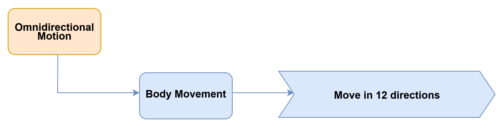

#### 7.2.2.3 Program Download

1. Open the WonderCode software.


2. Open [**02 Program Files/01 Omnidirectional Movement Program/Omnidirectional Movement.sb3**](https://drive.google.com/drive/folders/1zjoidtiDm-W1ti9cxd79LdpU9AV2DJ5Z?usp=sharing), then drag it into WonderCode.

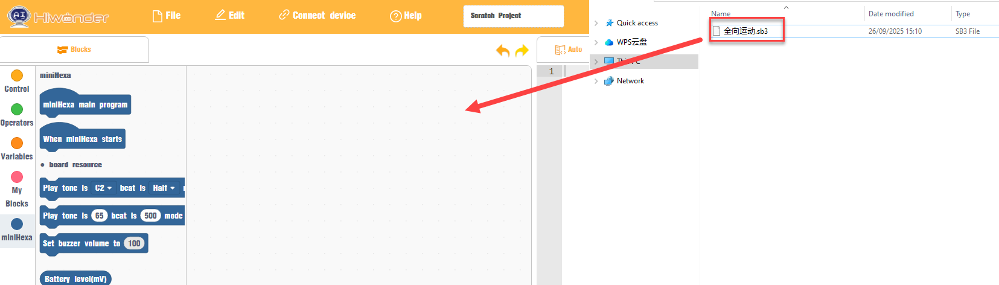

3. Click **Connect** in the menu bar and select the correct `COM` port. `COM4` is used here as an example. After the connection is successful, the **Connected successfully** message is displayed.


4. Click the upload icon  on the right side to download the program to miniHexa. Wait until the success message is displayed.


#### 7.2.2.4 Project Outcome

After power-on, the hexapod robot moves in a loop through eight directions in sequence: forward, backward, move right, move left, forward-left, forward-right, backward-left, and backward-right.

#### 7.2.2.5 Program Analysis

1. Control the robot to move forward for `3` steps at speed `2`.

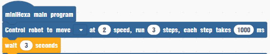

2. Control the robot to move backward for `3` steps at speed `2`.

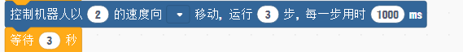

3. Control the robot to move right for `3` steps at speed `2`.

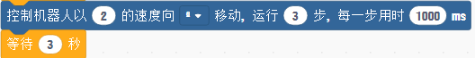

4. Control the robot to move left for `3` steps at speed `2`.

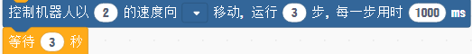

5. Control the robot to move forward-left for `3` steps at speed `2`.

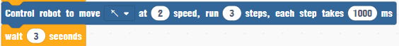

6. Control the robot to move forward-right for `3` steps at speed `2`.

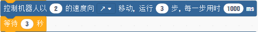

7. Control the robot to move backward-left for `3` steps at speed `2`.


8. Control the robot to move backward-right for `3` steps at speed `2`.

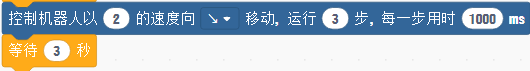

### 7.2.3 Turn Left and Right

#### 7.2.3.1 Feature Overview

This section controls miniHexa to turn left and right.

#### 7.2.3.2 Project Process

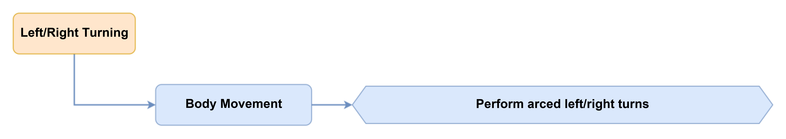

#### 7.2.3.3 Program Download

1. Open the WonderCode software.


2. Open [**02 Program Files/02 Turn Left and Right Program/Turn Left and Right.sb3**](https://drive.google.com/drive/folders/167-LXl6mhPZzYhBYSWVBXOE5ZQuSe_sh?usp=sharing), then drag it into WonderCode.

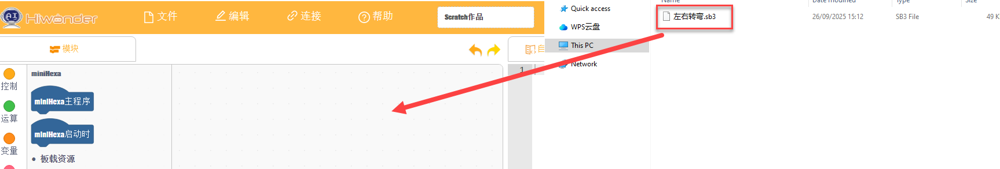

3. Click **Connect** in the menu bar and select the correct `COM` port. `COM4` is used here as an example. After the connection is successful, the **Connected successfully** message is displayed.


4. Click the upload icon  on the right side to download the program to miniHexa. Wait until the success message is displayed.


#### 7.2.3.4 Project Outcome

After power-on, the hexapod robot performs left and right arc turns.

#### 7.2.3.5 Program Analysis

1. Control the robot to rotate counterclockwise for `5` steps at speed `2`, which produces a left turn.

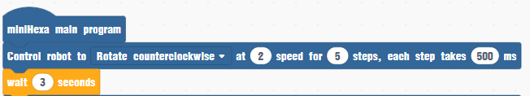

2. Control the robot to rotate clockwise for `5` steps at speed `2`, which produces a right turn.

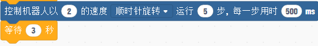

### 7.2.4 Speed Adjustment

#### 7.2.4.1 Feature Overview

This section controls miniHexa to move at different speeds.

#### 7.2.4.2 Project Process

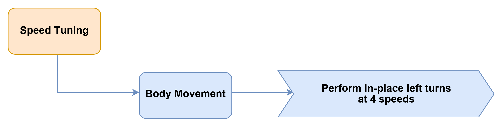

#### 7.2.4.3 Program Download

1. Open the WonderCode software.


2. Open [**02 Program Files/03 Speed Adjustment Program/Speed Adjustment.sb3**](https://drive.google.com/drive/folders/1yyd_aI8x79n0Ilfv6nJ8URpVSPA7Cp-Y?usp=sharing), then drag it into WonderCode.

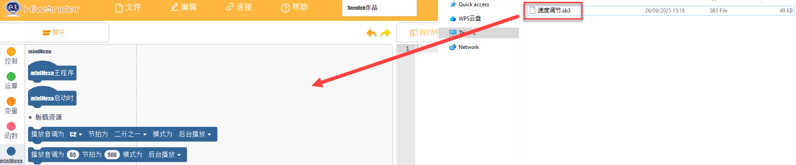

3. Click **Connect** in the menu bar and select the correct `COM` port. `COM4` is used here as an example. After the connection is successful, the **Connected successfully** message is displayed.


4. Click the upload icon  on the right side to download the program to miniHexa. Wait until the success message is displayed.


#### 7.2.4.4 Project Outcome

After power-on, the hexapod robot repeatedly performs in-place left turns from slow to fast. The speed increases from `1` to `2.5` in increments of `0.5`, then returns to `1` and repeats.

#### 7.2.4.5 Program Analysis

1. Control the robot to turn left for `5` steps at speed `1`.

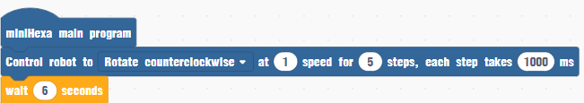

2. Control the robot to turn left for `5` steps at speed `1.5`.

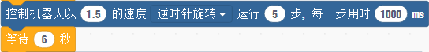

3. Control the robot to turn left for `5` steps at speed `2`.

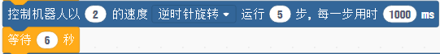

4. Control the robot to turn left for `5` steps at speed `2.5`.

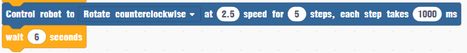

### 7.2.5 Gait Parameter Adjustment

#### 7.2.5.1 Feature Overview

This section changes the gait parameters of miniHexa so that the robot moves with different gait settings.

#### 7.2.5.2 Project Process

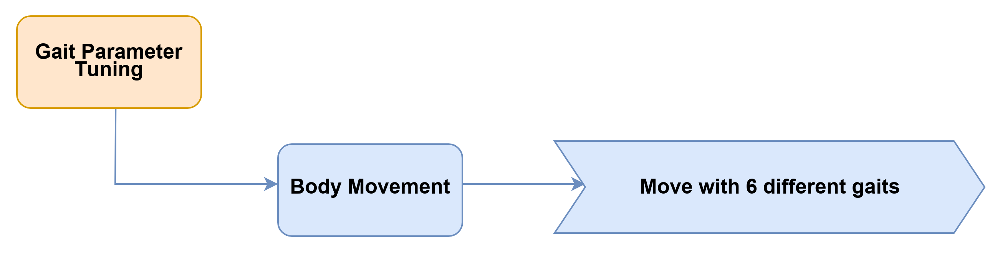

#### 7.2.5.3 Program Download

1. Open the WonderCode software.


2. Open [**02 Program Files/04 Gait Parameter Adjustment Program/Gait Parameter Adjustment.sb3**](https://drive.google.com/drive/folders/1nSxPS4yDq_NLU6K8RrjyTgqGETSHcsEM?usp=sharing), then drag it into WonderCode.

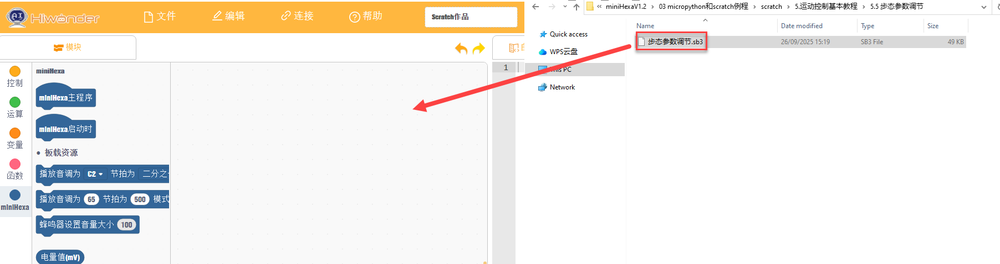

3. Click **Connect** in the menu bar and select the correct `COM` port. `COM4` is used here as an example. After the connection is successful, the **Connected successfully** message is displayed.


4. Click the upload icon  on the right side to download the program to miniHexa. Wait until the success message is displayed.


#### 7.2.5.4 Project Outcome

After power-on, the hexapod robot performs six different gait movements.

#### 7.2.5.5 Program Analysis

1. Control the robot to move forward for `3` steps at speed `2`, with each step taking `500 ms`.

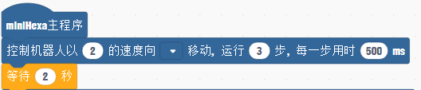

2. Control the robot to move forward for `3` steps at speed `2`, with each step taking `1000 ms`.

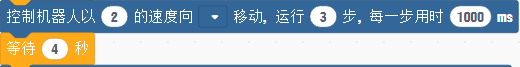

3. Control the robot to move backward for `3` steps at speed `2`, with each step taking `500 ms`.

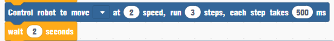

4. Control the robot to move backward for `3` steps at speed `2`, with each step taking `1000 ms`.

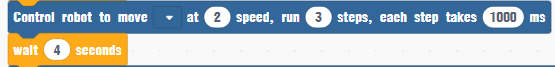

5. Control the robot to rotate clockwise for `3` steps at speed `2`, with each step taking `500 ms`.

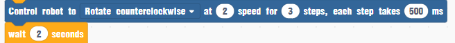

6. Control the robot to rotate clockwise for `3` steps at speed `2`, with each step taking `1000 ms`.

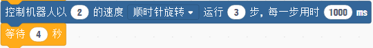

### 7.2.6 Posture Adjustment

#### 7.2.6.1 Feature Overview

This section changes the posture parameters to change the motion posture of the hexapod robot.

#### 7.2.6.2 Project Process

<div style="text-align: center;">
  
</div>


#### 7.2.6.3 Program Download

1. Open the WonderCode software.


2. Open [**02 Program Files/05 Posture Adjustment Program/Posture Adjustment.sb3**](https://drive.google.com/drive/folders/190iP6fUqoQCJRD50e8eNw4QLLo-_wLII?usp=sharing), then drag it into WonderCode.

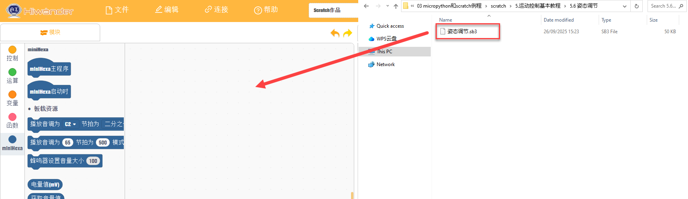

3. Click **Connect** in the menu bar and select the correct `COM` port. `COM4` is used here as an example. After the connection is successful, the **Connected successfully** message is displayed.


4. Click the upload icon  on the right side to download the program to miniHexa. Wait until the success message is displayed.


#### 7.2.6.4 Project Outcome

After power-on, miniHexa changes into `12` different postures.

#### 7.2.6.5 Program Analysis

1. Set the body center to move forward by `2 cm`.

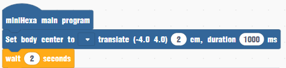

2. Set the body center to move backward by `2 cm`.

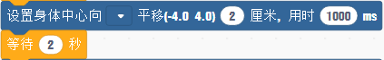

3. Set the body center to move left by `2 cm`.

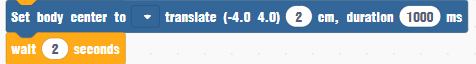

4. Set the body center to move right by `2 cm`.

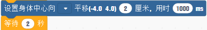

5. Set the robot to the initial position.


6. Rotate the robot around the Z-axis by `10°`.

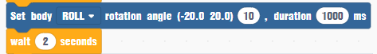

7. Rotate the robot around the Z-axis by `-10°`.

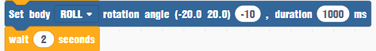

8. Rotate the robot around the X-axis by `10°`.

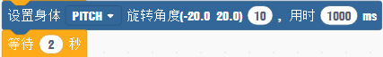

9. Rotate the robot around the X-axis by `-10°`.

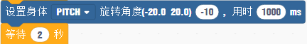

10. Rotate the robot around the Y-axis by `10°`.

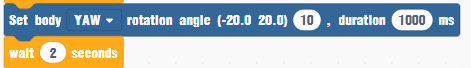

11. Rotate the robot around the Y-axis by `-10°`, then set the robot to the initial position.

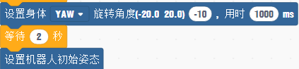

## 7.3 Secondary Development Project

### 7.3.1 Action Group Introduction and Practice

#### 7.3.1.1 Feature Overview

This section introduces the action groups in miniHexa and explains how to control an action group with a program.

An action group is a predefined sequence of movement steps. It allows the robot to complete a specific task according to the preset sequence, such as moving or dancing.

miniHexa includes `14` built-in action groups. These action groups can be called directly. The corresponding action group names are shown in the table below:

| **Action Group No.** | **Action**              |
| -------------------- | ----------------------- |
| 1                    | Counterclockwise Twist  |
| 2                    | Clockwise Twist         |
| 3                    | Wake Up                 |
| 4                    | Wake Up and Run         |
| 5                    | Acting Cute             |
| 6                    | Obstacle Crossing       |
| 7                    | Battle 1                |
| 8                    | Battle 2                |
| 9                    | Left Foot Forward Kick  |
| 10                   | Left Foot Right Kick    |
| 11                   | Right Foot Forward Kick |
| 12                   | Right Foot Left Kick    |
| 13                   | Door Push               |
| 14                   | Wave                    |

#### 7.3.1.2 Project Process


#### 7.3.1.3 Action Group Download

1. Connect miniHexa to the PC with a Type-C data cable.


2. Open the Hiwonder Python Editor.


3. Right-click **Local Project -> Switch Project Path** on the left side of the editor.


4. Select [**2. Software/10. Action Group Files**](https://drive.google.com/drive/folders/1bR30Kn7b84IqUfwQ5Mr-kZmwecwTGkwo?usp=sharing), then click **Select Folder**.


5. Click the connection icon in the menu bar . After the connection succeeds, the icon turns green .

6. Select all imported action group files. Right-click and select **Download** to download the action groups to miniHexa. Wait until the information panel below shows that all action groups have been downloaded successfully.


7. After the download is complete, click **Device** to confirm that the action groups have been downloaded to miniHexa.


#### 7.3.1.4 Program Download

1. Open the WonderCode software.


2. Open [**02 Program Files/01 Action Group Program/Action Group Introduction and Practice.sb3**](https://drive.google.com/drive/folders/13RQ9oGXlkCDd4qBiH-yjVe07nFF286-m?usp=sharing), then drag it into WonderCode.


3. Click **Connect** in the menu bar and select the correct `COM` port. `COM4` is used here as an example. After the connection is successful, the **Connected successfully** message is displayed.


4. Click the upload icon  on the right side to download the program to miniHexa. Wait until the success message is displayed.


#### 7.3.1.5 Project Outcome

After power-on, miniHexa runs Action Group `9`, which kicks the ball forward with the left foot.

#### 7.3.1.6 Program Analysis

After power-on, miniHexa runs Action Group `9`, which kicks the ball forward with the left foot.


### 7.3.2 Intelligent Voice Control

#### 7.3.2.1 Feature Overview

This section uses the sound sensor to detect sound intensity and controls robot movement based on the detected value.

#### 7.3.2.2 Project Process


#### 7.3.2.3 Module Description


The onboard sound sensor detects ambient sound intensity. The sound level can be obtained by reading the value on the `ADC` pin. Sound causes the microphone diaphragm to vibrate. This changes the capacitance and generates a corresponding small voltage change, which is then converted into an electrical signal for output.

#### 7.3.2.4 Program Download

1. Open the WonderCode software.


2. Open [**02 Program Files/02 Intelligent Voice Control Program/Intelligent Voice Control.sb3**](https://drive.google.com/drive/folders/13RQ9oGXlkCDd4qBiH-yjVe07nFF286-m?usp=sharing), then drag it into WonderCode.


3. Click **Connect** in the menu bar and select the correct `COM` port. `COM4` is used here as an example. After the connection is successful, the **Connected successfully** message is displayed.


4. Click the upload icon  on the right side to download the program to miniHexa. Wait until the success message is displayed.


#### 7.3.2.5 Project Outcome

After power-on, miniHexa enters the initial standing pose and then continuously monitors ambient sound. When the detected sound value is greater than or equal to `20`, miniHexa moves forward.

#### 7.3.2.6 Program Analysis

If the detected sound value is greater than `20`, the robot moves forward for `1` step at speed `2`.


### 7.3.3 Ultrasonic Distance Measurement

#### 7.3.3.1 Feature Overview

This section uses the glowy ultrasonic module to detect distance and controls the RGB LED color of the module based on the measured distance.

#### 7.3.3.2 Project Process


#### 7.3.3.3 Module Description

The glowy ultrasonic module integrates an I2C Port. It supports reading the measured distance data from the ultrasonic sensor through I2C communication. Two RGB LEDs are integrated at the ultrasonic probe position. The brightness can be adjusted, and multiple colors can be displayed by changing and combining the `R`, `G`, and `B` channels.


During ranging, the module automatically sends eight `40 kHz` square waves and then checks whether a return signal is received. If a signal is received, the module outputs a high level. The duration of the high level is the travel time of the ultrasonic signal from transmission to return.

:::{Note}
**The glowy ultrasonic module is already connected to the onboard I2C Port at the factory. No additional wiring is required.**
:::

#### 7.3.3.4 Program Download

1. Open the WonderCode software.


2. Open [**02 Program Files/03 Ultrasonic Distance Measurement Program/Ultrasonic Distance Measurement.sb3**](https://drive.google.com/drive/folders/13RQ9oGXlkCDd4qBiH-yjVe07nFF286-m?usp=sharing), then drag it into WonderCode.


3. Click **Connect** in the menu bar and select the correct `COM` port. `COM4` is used here as an example. After the connection is successful, the **Connected successfully** message is displayed.


4. Click the upload icon  on the right side to download the program to miniHexa. Wait until the success message is displayed.


#### 7.3.3.5 Project Outcome

When an obstacle approaches the glowy ultrasonic module, the RGB LED color changes according to the detected distance.

1. If the obstacle distance is less than or equal to `15`, the RGB LEDs turn red.
2. If the obstacle distance is greater than or equal to `30`, the RGB LEDs turn green.
3. If the obstacle distance is greater than `15` and less than `30`, the RGB LEDs turn blue.

#### 7.3.3.6 Program Analysis

1. `distance` is the obstacle distance detected by the ultrasonic module.


2. If the obstacle distance is less than or equal to `15`, set the RGB LEDs on the ultrasonic module to red.


3. If the obstacle distance is greater than or equal to `30`, set the RGB LEDs on the ultrasonic module to green.


4. If the obstacle distance is greater than `15` and less than `30`, set the RGB LEDs on the ultrasonic module to blue.


### 7.3.4 Ultrasonic Obstacle Avoidance

#### 7.3.4.1 Feature Overview

This section uses the ultrasonic sensor to detect distance and then avoids obstacles according to the detected value.

#### 7.3.4.2 Project Process


#### 7.3.4.3 Module Description

The glowy ultrasonic module integrates an I2C Port. It supports reading the measured distance data from the ultrasonic sensor through I2C communication. Two RGB LEDs are integrated at the ultrasonic probe position. The brightness can be adjusted, and multiple colors can be displayed by changing and combining the `R`, `G`, and `B` channels.


During ranging, the module automatically sends eight `40 kHz` square waves and then checks whether a return signal is received. If a signal is received, the module outputs a high level. The duration of the high level is the travel time of the ultrasonic signal from transmission to return.

:::{Note}
**The glowy ultrasonic module is already connected to the onboard I2C Port at the factory. No additional wiring is required.**
:::

#### 7.3.4.4 Program Download

1. Open the WonderCode software.


2. Open [**02 Program Files/04 Automatic Obstacle Avoidance Program/Automatic Obstacle Avoidance.sb3**](https://drive.google.com/drive/folders/13RQ9oGXlkCDd4qBiH-yjVe07nFF286-m?usp=sharing), then drag it into WonderCode.


3. Click **Connect** in the menu bar and select the correct `COM` port. `COM4` is used here as an example. After the connection is successful, the **Connected successfully** message is displayed.


4. Click the upload icon  on the right side to download the program to miniHexa. Wait until the success message is displayed.


#### 7.3.4.5 Project Outcome

After power-on, miniHexa measures the distance to objects with the ultrasonic module.

1. If the distance is less than or equal to `10 cm`, miniHexa moves backward and the RGB LEDs turn red.
2. If the distance is greater than `10 cm` and less than or equal to `20 cm`, miniHexa rotates counterclockwise and the RGB LEDs turn green.
3. If the distance is greater than `20 cm`, miniHexa moves forward and the RGB LEDs turn blue.

#### 7.3.4.6 Program Analysis

1. Set `distance` as the obstacle distance detected by the glowy ultrasonic module.


2. If the obstacle distance detected by the ultrasonic module is less than or equal to `10 cm`, control miniHexa to move backward for `4` steps at speed `2`, and set the RGB LEDs to red.


3. If the obstacle distance detected by the ultrasonic module is less than or equal to `20 cm`, control miniHexa to rotate counterclockwise at speed `1.8`.


4. If the detected distance is greater than `20 cm`, control miniHexa to move forward at speed `2`.


### 7.3.5 Automatic Following

#### 7.3.5.1 Feature Overview

This section uses the glowy ultrasonic sensor to detect distance and then controls robot movement according to the measured result.

#### 7.3.5.2 Project Process


#### 7.3.5.3 Module Description

The glowy ultrasonic module integrates an I2C Port. It supports reading the measured distance data from the ultrasonic sensor through I2C communication. Two RGB LEDs are integrated at the ultrasonic probe position. The brightness can be adjusted, and multiple colors can be displayed by changing and combining the `R`, `G`, and `B` channels.


During ranging, the module automatically sends eight `40 kHz` square waves and then checks whether a return signal is received. If a signal is received, the module outputs a high level. The duration of the high level is the travel time of the ultrasonic signal from transmission to return.

:::{Note}
**The glowy ultrasonic module is already connected to the onboard I2C Port at the factory. No additional wiring is required.**
:::

#### 7.3.5.4 Program Download

1. Open the WonderCode software.


2. Open [**02 Program Files/05 Automatic Following Program/Automatic Following.sb3**](https://drive.google.com/drive/folders/13RQ9oGXlkCDd4qBiH-yjVe07nFF286-m?usp=sharing), then drag it into WonderCode.


3. Click **Connect** in the menu bar and select the correct `COM` port. `COM4` is used here as an example. After the connection is successful, the **Connected successfully** message is displayed.


4. Click the upload icon  on the right side to download the program to miniHexa. Wait until the success message is displayed.


#### 7.3.5.5 Project Outcome

After power-on, miniHexa measures the distance to objects with the ultrasonic module.

1. If the distance is greater than or equal to `25 cm`, miniHexa moves forward and the RGB LEDs turn green.
2. If the distance is less than or equal to `15 cm`, miniHexa moves backward and the RGB LEDs turn red.
3. If the distance is less than `25 cm` and greater than `15 cm`, miniHexa stops and the RGB LEDs turn blue.

#### 7.3.5.6 Program Analysis

1. Set `distance` as the obstacle distance detected by the glowy ultrasonic module.


2. If the detected distance is less than or equal to `15`, set the RGB LEDs on the ultrasonic module to red and control the robot to move backward at speed `2`.


3. If the detected distance is greater than or equal to `25`, set the RGB LEDs on the ultrasonic module to green and control the robot to move forward at speed `2`.


4. If the detected distance is less than `25` and greater than `15`, set the RGB LEDs on the ultrasonic module to blue and stop the robot.


### 7.3.6 Self-Balancing

#### 7.3.6.1 Feature Overview

This section uses the IMU sensor to detect the body tilt angle and then controls the body to maintain balance according to the detected result.

#### 7.3.6.2 Project Process


#### 7.3.6.3 Module Description

This section uses the onboard QMI8658 motion sensor. This sensor is widely used in handheld gaming products, 3D remote controllers, portable navigation devices, and other equipment.


It integrates a 3-axis MEMS gyroscope, a 3-axis MEMS accelerometer, and an expandable Digital Motion Processor `DMP`.

#### 7.3.6.4 Program Download

1. Open the WonderCode software.


2. Open [**02 Program Files/06 Self-Balancing Program/Self-Balancing.sb3**](https://drive.google.com/drive/folders/13RQ9oGXlkCDd4qBiH-yjVe07nFF286-m?usp=sharing), then drag it into WonderCode.


3. Click **Connect** in the menu bar and select the correct `COM` port. `COM4` is used here as an example. After the connection is successful, the **Connected successfully** message is displayed.


4. Click the upload icon  on the right side to download the program to miniHexa. Wait until the success message is displayed.


#### 7.3.6.5 Project Outcome

miniHexa reads the real-time tilt angle from the IMU sensor, performs correction calculations, and achieves self-balancing through inverse kinematics.

#### 7.3.6.6 Program Analysis

Enable the self-balancing function of miniHexa.


### 7.3.7 Dot Matrix Display

#### 7.3.7.1 Feature Overview

This section displays characters with the dot matrix module.

#### 7.3.7.2 Project Process


#### 7.3.7.3 Module Description

The LED dot matrix module is a display module with high brightness, flicker-free display, and convenient wiring. It can display numbers, text, patterns, and other content. The module contains two red `8 x 8` LED matrices and uses the `TM640B` driver chip to control the display.


Module wiring: as shown below, connect the module to the `IO32` and `IO33` interfaces on the miniHexa base board before running this program.


Installation method: mount the dot matrix module on the rear panel of miniHexa.


#### 7.3.7.4 Program Download

1. Open the WonderCode software.


2. Open [**02 Program Files/07 Dot Matrix Display Program/Dot Matrix Display.sb3**](https://drive.google.com/drive/folders/13RQ9oGXlkCDd4qBiH-yjVe07nFF286-m?usp=sharing), then drag it into WonderCode.


3. Click **Connect** in the menu bar and select the correct `COM` port. `COM4` is used here as an example. After the connection is successful, the **Connected successfully** message is displayed.


4. Click the upload icon  on the right side to download the program to miniHexa. Wait until the success message is displayed.


#### 7.3.7.5 Project Outcome

After power-on, the dot matrix module repeatedly displays `abc` and `ABC`.

#### 7.3.7.6 Program Analysis

1. Initialize the interface pins `IO18` and `IO19` of the dot matrix module.


2. Repeatedly display `abc` and `ABC` on the dot matrix module.


### 7.3.8 Ultrasonic Distance Measurement Display

#### 7.3.8.1 Feature Overview

This section uses the dot matrix module to display the distance measured by the ultrasonic module in real time and changes the RGB LED color of the glowy ultrasonic module.

#### 7.3.8.2 Project Process


#### 7.3.8.3 Module Description

1. Ultrasonic module

The module uses an I2C Port and can read the distance measured by the ultrasonic sensor through I2C communication. Two RGB LEDs are integrated at the ultrasonic probe position. The brightness can be adjusted. Color changes and color mixing across the `R`, `G`, and `B` channels make full-color lighting effects possible.


During ranging, the module automatically sends eight `40 kHz` square waves and then checks whether a return signal is received. If a signal is received, the module outputs a high level. The duration of the high level is the travel time of the ultrasonic signal from transmission to return.

:::{Note}
**The glowy ultrasonic module is already connected to the onboard I2C Port at the factory. No additional wiring is required.**
:::

2. Dot matrix module

The LED dot matrix module is a display module with high brightness, flicker-free display, and convenient wiring. It can display numbers, text, patterns, and other content. The module contains two red `8 x 8` LED matrices and uses the `TM640B` driver chip to control the display.


Module wiring: as shown below, connect the module to the `IO32` and `IO33` interfaces on the miniHexa base board before running this program.


Installation method: mount the dot matrix module on the rear panel of miniHexa.


#### 7.3.8.4 Program Download

1. Open the WonderCode software.


2. Open [**02 Program Files/08 Ultrasonic Distance Measurement and Displaying Program/Ultrasonic Distance Measurement Display.sb3**](https://drive.google.com/drive/folders/13RQ9oGXlkCDd4qBiH-yjVe07nFF286-m?usp=sharing), then drag it into WonderCode.


3. Click **Connect** in the menu bar and select the correct `COM` port. `COM4` is used here as an example. After the connection is successful, the **Connected successfully** message is displayed.


4. Click the upload icon  on the right side to download the program to miniHexa. Wait until the success message is displayed.


#### 7.3.8.5 Project Outcome

When an obstacle approaches the glowy ultrasonic module, the dot matrix module displays the detected distance, and the RGB LED color of the glowy ultrasonic module changes according to the distance.

#### 7.3.8.6 Program Analysis

1. Initialize the interface pins `IO18` and `IO19` of the dot matrix module.


2. First set `distance` as the obstacle distance detected by the ultrasonic module, then display the detected `distance` on the dot matrix module.


### 7.3.9 Touch Control

#### 7.3.9.1 Feature Overview

This section controls miniHexa movement by touching the touch sensor.

#### 7.3.9.2 Project Process


#### 7.3.9.3 Module Description

The touch sensor is a capacitive touch sensor. It detects the human body or metal mainly through the gold-plated contact surface.


When no person or metal touches the metal surface, the signal terminal outputs a high level. When a person or metal touches the metal surface, the signal terminal outputs a low level.

Module wiring: as shown below, connect the module to the `IO33` and `IO32` interfaces on the miniHexa base board before running this program.


Installation method: mount the dot matrix module on the rear panel of miniHexa.


#### 7.3.9.4 Program Download

1. Open the WonderCode software.


2. Open [**02 Program Files/09 Touch Control Program/Touch Control.sb3**](https://drive.google.com/drive/folders/13RQ9oGXlkCDd4qBiH-yjVe07nFF286-m?usp=sharing), then drag it into WonderCode.


3. Click **Connect** in the menu bar and select the correct `COM` port. `COM4` is used here as an example. After the connection is successful, the **Connected successfully** message is displayed.


4. Click the upload icon  on the right side to download the program to miniHexa. Wait until the success message is displayed.


#### 7.3.9.5 Project Outcome

When the metal surface on the touch sensor is touched with a finger, miniHexa moves forward at speed `2`.

#### 7.3.9.6 Program Analysis

1. Initialize the interface pins `IO32` and `IO14` of the touch sensor.


2. If the touch sensor is pressed, control the robot to move forward for `2` steps at speed `2`.


### 7.3.10 Infrared Obstacle Avoidance

#### 7.3.10.1 Feature Overview

This section uses infrared obstacle avoidance sensors to detect obstacles and controls the robot to move accordingly.

#### 7.3.10.2 Project Process


#### 7.3.10.3 Module Description


The infrared obstacle avoidance sensor is used to detect whether there is an obstacle ahead. The sensor includes one infrared transmitter and one infrared receiver. Once the sensor encounters an obstacle, the infrared light is reflected back and received by the receiver.

Module wiring: as shown below, connect the module to the `IO32`, `IO14`, `IO18`, and `IO19` interfaces on the miniHexa base board before running this program.


Installation method: mount the infrared sensor module on the rear panel of miniHexa.


#### 7.3.10.4 Program Download

1. Open the WonderCode software.


2. Open [**02 Program Files/10 Infrared Obstacle Avoidance Program/Infrared Obstacle Avoidance.sb3**](https://drive.google.com/drive/folders/13RQ9oGXlkCDd4qBiH-yjVe07nFF286-m?usp=sharing), then drag it into WonderCode.


3. Click **Connect** in the menu bar and select the correct `COM` port. `COM4` is used here as an example. After the connection is successful, the **Connected successfully** message is displayed.


4. Click the upload icon  on the right side to download the program to miniHexa. Wait until the success message is displayed.


#### 7.3.10.5 Project Outcome

After power-on, miniHexa uses two infrared obstacle avoidance sensors to detect obstacles around the body. If no obstacle is detected, miniHexa moves forward. If one side detects an obstacle, miniHexa turns away from the obstacle. If both sides detect obstacles, miniHexa first moves backward and then rotates in place.

#### 7.3.10.6 Program Analysis

1. If infrared obstacle avoidance sensor `1` at `IO32` and `IO14` and infrared obstacle avoidance sensor `2` at `IO18` and `IO19` both detect obstacles, first control the robot to move backward for `2` steps at speed `2`, then rotate counterclockwise for `2` steps at speed `2`.


2. If infrared obstacle avoidance sensor `1` detects an obstacle and sensor `2` does not, control the robot to rotate counterclockwise for `2` steps at speed `2`.


3. If infrared obstacle avoidance sensor `1` does not detect an obstacle and sensor `2` does, control the robot to rotate clockwise for `2` steps at speed `2`.


4. If infrared obstacle avoidance sensor `1` and sensor `2` both do not detect obstacles, control the robot to move forward at speed `2`.


### 7.3.11 Intelligent Fall Prevention

#### 7.3.11.1 Feature Overview

This section uses infrared obstacle avoidance sensors to detect an edge condition and controls robot movement to prevent a fall.

#### 7.3.11.2 Project Process


#### 7.3.11.3 Module Description


The infrared obstacle avoidance sensor is used to detect whether there is an obstacle ahead. The sensor includes one infrared transmitter and one infrared receiver. Once the sensor encounters an obstacle, the infrared light is reflected back and received by the receiver.

Module wiring: as shown below, connect the module to the `IO32`, `IO14`, `IO18`, and `IO19` interfaces on the miniHexa base board before running this program.


Installation method: install the infrared sensor modules on the front two legs of miniHexa.


#### 7.3.11.4 Program Download

1. Open the WonderCode software.


2. Open [**02 Program Files/11 Intelligent Fall Prevention Program/Intelligent Fall Prevention.sb3**](https://drive.google.com/drive/folders/13RQ9oGXlkCDd4qBiH-yjVe07nFF286-m?usp=sharing), then drag it into WonderCode.


3. Click **Connect** in the menu bar and select the correct `COM` port. `COM4` is used here as an example. After the connection is successful, the **Connected successfully** message is displayed.


4. Click the upload icon  on the right side to download the program to miniHexa. Wait until the success message is displayed.


#### 7.3.11.5 Project Outcome

miniHexa uses the infrared sensor modules to detect whether the front legs are suspended. If either side is suspended, miniHexa moves backward. Otherwise, miniHexa moves forward.

#### 7.3.11.6 Program Analysis

1. If either infrared obstacle avoidance sensor `1` at `IO32` and `IO14` or sensor `2` at `IO18` and `IO19` detects an obstacle, first control the robot to move backward for `2` steps at speed `2`, then rotate counterclockwise for `2` steps at speed `2`.


2. If the condition above is not met, control the robot to move forward at speed `2`.


## 7.4 AI Vision Project

### 7.4.1 ESP32-S3 AI Vision Module Overview and Installation

#### 7.4.1.1 Product Introduction

The ESP32-S3 AI vision module is a compact camera module that can operate independently as a standalone system.

The built-in camera captures images. The ESP32 microcontroller processes the image data and transmits it wirelessly through the Wi-Fi module. The module also supports multiple communication protocols and low-power operation, so it is widely used in IoT applications.

#### 7.4.1.2 Interface Description


| **Interface Name** |                       **Description**                        |
| :----------------: | :----------------------------------------------------------: |
|  USB serial port   |          Serial communication and firmware flashing          |
|   Custom button    |          The button event can be customized in code          |
|      I2C Port      | Interface for connecting to the controller for secondary development |

#### 7.4.1.3 Notes

1. If the captured image shows water ripple patterns, the input power supply may provide a rated current of `2A` or less. Check the current output of the power supply.

2. The default image transmission program is preloaded at the factory. Flash the corresponding program when a vision recognition function is required.

#### 7.4.1.4 Module Wiring

Use a 4-pin cable to connect the module to any I2C Port highlighted in red on the servo controller.


### 7.4.2 Getting Started

#### 7.4.2.1 Notes

1. If the captured image shows water ripple patterns, the input power supply may provide a rated current of `2A` or less. Check the current output of the power supply.

2. The image transmission firmware is preloaded at the factory. It can be tested directly without reflashing. Flash another firmware when another function is required.

#### 7.4.2.2 Device Connection

1. Connect the AI vision module to the PC with a Type-C cable. Check in Device Manager that the port is recognized correctly.


:::{Note}
**If the device does not appear under Ports, the driver may not be installed on the PC. The installation package is available at [2. Software/7.CH34x Driver Tool/ch341ser.exe](https://drive.google.com/drive/folders/1DQjHDVH7Nvnxklj2mXLUrNuWhbSHIlCe?usp=sharing). Install the driver manually if needed.**
:::

2. Connect to the hotspot generated by the module: `HW_ESP32S3CAM`.


#### 7.4.2.3 Image Transmission

Enter `192.168.5.1` in the browser address bar and press **Enter**. A phone browser or a PC browser can be used. A PC browser is used in the example below. In the page that opens, click  to enter the camera image transmission interface.


### 7.4.3 Controller-Device Communication Principle and Coordinate System Description

#### 7.4.3.1 Introduction

This section introduces how the ESP32S3 module, abbreviated below as ESP32S3, communicates with controllers such as Arduino and ESP32 boards. It explains how the ESP32S3 operates as a device and how the controller accesses ESP32S3 data and control functions.

In this chapter, the ESP32S3 always operates as a device. Information is transmitted through the I2C protocol.

#### 7.4.3.2 Controller-Device Relationship

In a controller-device system, the ESP32S3 operates as the device. Other microcontrollers and similar devices operate as the controller.

**Functions of the ESP32S3 as the device**

1. Receive and parse the signals sent by the controller:

Wait for an I2C signal interrupt. If I2C data is received, call the corresponding function according to the register address contained in the received I2C data.

2. Process data and send feedback:

When the ESP32S3 receives a register read command, call the corresponding transmission function and send the recognized data to the controller.

When the ESP32S3 receives a register setting command, set the fill light brightness.

**Functions of other devices as the controller**

1. Send commands:

Send a data read request to the ESP32S3.

2. Coordinate control:

Manage the coordinated operation of the entire system. Ensure that communication and operation among the controller, the ESP32S3, and other devices connected to the controller remain conflict-free and stable.

3. Receive data:

When the controller reads data, receive the status information sent by the ESP32S3 after the read command is sent. Then parse the data packet and extract the useful information.

#### 7.4.3.3 Device Address and Registers

When the ESP32S3 runs the face detection function:

|       **Address**       |                         **Function**                         |
| :---------------------: | :----------------------------------------------------------: |
|  `0x52` device address  |             Communication address of the ESP32S3             |
| `0x01` register address | Read face data `[int16_t x, y, w, h]`. All data values are `0` when no face is detected |

:::{Note}
**In the face data, `x`, `y`, `w`, and `h` represent the face detection box marked in the original image. These values are the center point `x` coordinate, center point `y` coordinate, detection box width, and detection box height. The unit is pixels. See [7.4.3.4 Module Coordinate System Description](#anther7.4.3.4) for details about the pixel coordinate system used in this mode.**
:::

When the ESP32S3 runs the color recognition function:

|       **Address**       | **Function**                                                 |
| :---------------------: | :----------------------------------------------------------- |
|  `0x52` device address  | Communication address of the ESP32S3                         |
| `0x00` register address | Read color `0` data. The returned data format is `[int16_t x, y, w, h]`. All data values are `0` when no target is detected |
| `0x01` register address | Read color `1` data. The returned data format is `[int16_t x, y, w, h]`. All data values are `0` when no target is detected |

:::{Note}
* **In the color data, `x`, `y`, `w`, and `h` represent the color block detection box marked in the original image. These values are the center point `x` coordinate, center point `y` coordinate, detection box width, and detection box height. The unit is pixels. See [7.4.3.4 Module Coordinate System Description](#anther7.4.3.4) for details about the pixel coordinate system used in this mode.**
* **If multiple color blocks in the camera view match the preset color threshold, the module selects the two largest color blocks in the image and stores their detection box data in the `0x00` and `0x01` register spaces in sequence.**
:::

<p id ="anther7.4.3.4"></p>

#### 7.4.3.4 Module Coordinate System Description

This section briefly introduces the image coordinate systems used when the module runs different functions. Review this section before studying the example programs.

When the example programs are ported for secondary development, establish the mapping between the module image coordinate system and the real-world coordinate system according to this document.

Pay attention to the following two characteristics of the module image coordinate system:

**1. The origin is at the upper-left corner of the screen, not at the center of the screen.**

**2. The Y-axis direction is opposite to the Y-axis direction in a standard Cartesian coordinate system.**

**Image Transmission Mode**


:::{Note}
**The image transmission mode uses a resolution of `320 x 240` to match the image data interface used by the mobile app.**
:::

**Face Detection Mode**


:::{Note}
**To ensure smooth image performance, the face detection mode uses a tested resolution of `240 x 240`.**
:::

**Color Recognition Mode**


:::{Note}
**To ensure smooth image performance, the color recognition mode uses a tested resolution of `160 x 140`.**
:::

#### 7.4.3.5 Notes

The controller and the ESP32S3 can use different power supplies. The grounds must be connected together during wiring. Stable communication voltage levels depend on a common ground.

### 7.4.4 Color Recognition

#### 7.4.4.1 Feature Overview

This section uses the ESP32-S3 AI vision module to detect red, green, and blue color blocks. The RGB LEDs on the glowy ultrasonic module then light up in the corresponding color.

#### 7.4.4.2 Project Process


#### 7.4.4.3 Module Description

1. ESP32-S3 AI vision module


This development board integrates an ESP32-S3 chip and a camera module. After it is installed on the carrier board, it communicates through an I2C Port and can read color and face-detection data through I2C communication.

Module wiring: as shown below, connect the module to any I2C Port highlighted in red on the servo controller before running this program.


2. Glowy ultrasonic module


The module uses an I2C Port and can read the distance measured by the ultrasonic sensor through I2C communication. Two RGB LEDs are integrated at the ultrasonic probe position. The brightness can be adjusted. Color changes and color mixing across the red channel `R`, green channel `G`, and blue channel `B` make full-color lighting effects possible.

:::{Note}
**The glowy ultrasonic module is already connected to the onboard I2C Port at the factory. No additional wiring is required.**
:::

#### 7.4.4.4 Program Download

1. Program download for the ESP32-S3 AI vision module

(1) Connect the ESP32-S3 AI vision module to a USB port on the PC with a Type-C cable.

(2) Open [**03 Program Files/01 Color Recognition/ColorDetection/ColorDetection.ino**](https://drive.google.com/drive/folders/1xUSnvC_nofds6bt3oBJb-Nn5aiXV7R9H?usp=sharing).


(3) Select **ESP32S3 Dev Module** as the development board.


(4) Click **Tools** in the menu bar. Configure the ESP32S3 development board options as shown below.


:::{Note}
**Modify the development board configuration before downloading the program to the AI vision module.**
:::

(5) Finally, click  to download the code to the ESP32-S3 AI vision module. Wait until flashing is complete.


2. Upload the scratch program.

3. Open the WonderCode software.


2. Open [**03 Program Files/01 Color Recognition/Color Recognition.sb3**](https://drive.google.com/drive/folders/1TB8RrphnO-INFe-MSAofA5rt5lDbKf9w?usp=sharing), then drag it into WonderCode.

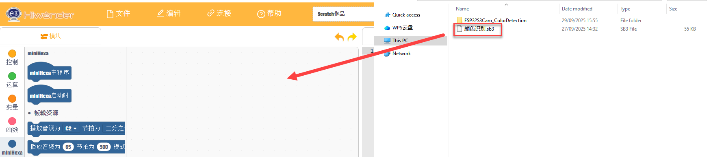

3. Click **Connect** in the menu bar and select the correct `COM` port. `COM4` is used here as an example. After the connection is successful, the **Connected successfully** message is displayed.


4. Click the upload icon  on the right side to download the program to miniHexa. Wait until the success message is displayed.


#### 7.4.4.5 Project Outcome

When the AI vision module detects a red, green, or blue color block, the RGB LEDs on the glowy ultrasonic module light up in the same color.

#### 7.4.4.6 Program Analysis

1. Initialize the I2C interface of the ESP32-S3 AI vision module.

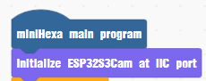

2. If the ESP32-S3 AI vision module reads color `1` red, set the RGB LEDs on the ultrasonic module to red.

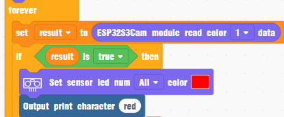

3. If the ESP32-S3 AI vision module reads color `2` green, set the RGB LEDs on the ultrasonic module to green.

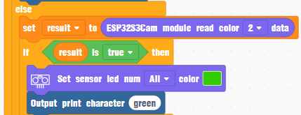

4. If the ESP32-S3 AI vision module reads color `3` blue, set the RGB LEDs on the ultrasonic module to blue.

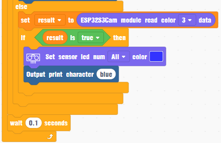

### 7.4.5 Color Tracking

#### 7.4.5.1 Feature Overview

This section uses the ESP32-S3 AI vision module to detect a red object and controls the robot to rotate in place and follow the movement of the object.

#### 7.4.5.2 Project Process


#### 7.4.5.3 Module Description

1. ESP32-S3 AI vision module


This development board integrates an ESP32-S3 chip and a camera module. After it is installed on the carrier board, it communicates through an I2C Port and can read color and face-detection data through I2C communication.

Module wiring: as shown below, connect the module to any I2C Port highlighted in red on the servo controller before running this program.


2. Glowy ultrasonic module


The module uses an I2C Port and can read the distance measured by the ultrasonic sensor through I2C communication. Two RGB LEDs are integrated at the ultrasonic probe position. The brightness can be adjusted. Color changes and color mixing across the red channel `R`, green channel `G`, and blue channel `B` make full-color lighting effects possible.

:::{Note}
**The glowy ultrasonic module is already connected to the onboard I2C Port at the factory. No additional wiring is required.**
:::

#### 7.4.5.4 Program Download

1. Program download for the ESP32-S3 AI vision module

(1) Connect the ESP32-S3 AI vision module to a USB port on the PC with a Type-C cable.

(2) Open [**03 Program Files/02 Color Tracking/ColorTracking/color_tracking.ino**](https://drive.google.com/drive/folders/11zKQ7TEajSBmwoeoDoTiXyNkvsRrsRDC?usp=sharing).


(3) Select **ESP32S3 Dev Module** as the development board.


(4) Click **Tools** in the menu bar. Configure the ESP32S3 development board options as shown below.


:::{Note}
**Modify the development board configuration before downloading the program to the AI vision module.**
:::

(5) Finally, click  to download the code to the ESP32-S3 AI vision module. Wait until flashing is complete.


2. Upload the scratch program.

3. Open the WonderCode software.


2. Open [**03 Program Files/02 Color Tracking/ColorTracking.sb3**](https://drive.google.com/drive/folders/1F4ucKN36JsOaiYMiiDWI_S3x0bFXAZ0p?usp=sharing), then drag it into WonderCode.

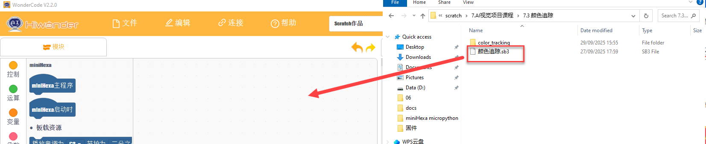

3. Click **Connect** in the menu bar and select the correct `COM` port. `COM4` is used here as an example. After the connection is successful, the **Connected successfully** message is displayed.


4. Click the upload icon  on the right side to download the program to miniHexa. Wait until the success message is displayed.


#### 7.4.5.5 Project Outcome

When the AI vision module detects a red object, the robot stands in place and twists to keep the vision module facing the red object.

#### 7.4.5.6 Program Analysis

1. Initialize the I2C interface of the ESP32-S3 AI vision module.

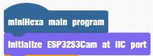

2. Use the ESP32-S3 AI vision module to read the data of color `1`, which is red, and store the result in variable `result`. If red is detected, read the `x` coordinate of the upper-left corner of the detection box from `result`, assign it to variable `center`, then adjust the `yaw` value according to the deviation between the detection box and the image center, and set the body `YAW` rotation angle.

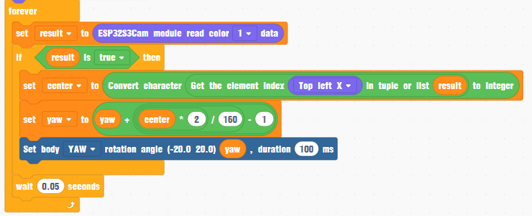

### 7.4.6 Visual Line Following

#### 7.4.6.1 Feature Overview

This section uses the ESP32-S3 AI vision module to detect a red line and controls the robot to follow the line.

#### 7.4.6.2 Project Process


#### 7.4.6.3 Module Description

1. ESP32-S3 AI vision module


This development board integrates an ESP32-S3 chip and a camera module. After it is installed on the carrier board, it communicates through an I2C Port and can read color and face-detection data through I2C communication.

Module wiring: as shown below, connect the module to any I2C Port highlighted in red on the servo controller before running this program.


2. Glowy ultrasonic module


The module uses an I2C Port and can read the distance measured by the ultrasonic sensor through I2C communication. Two RGB LEDs are integrated at the ultrasonic probe position. The brightness can be adjusted. Color changes and color mixing across the red channel `R`, green channel `G`, and blue channel `B` make full-color lighting effects possible.

:::{Note}
**The glowy ultrasonic module is already connected to the onboard I2C Port at the factory. No additional wiring is required.**
:::

#### 7.4.6.4 Program Download

1. Program download for the ESP32-S3 AI vision module

(1) Connect the ESP32-S3 AI vision module to a USB port on the PC with a Type-C cable.

(2) Open [**03 Program Files/03 Vision Line Following/LineFollowing/LineFollowing.ino**](https://drive.google.com/drive/folders/1BR_qn3JEyJb2yr6hua4JdkQp9FBDSQQy?usp=sharing).


(3) Select **ESP32S3 Dev Module** as the development board.


(4) Click **Tools** in the menu bar. Configure the ESP32S3 development board options as shown below.


:::{Note}
**Modify the development board configuration before downloading the program to the AI vision module.**
:::

(5) Finally, click  to download the code to the ESP32-S3 AI vision module. Wait until flashing is complete.


2. Upload the scratch program.

3. Open the WonderCode software.


2. Open [**03 Program Files/04 Vision Line Following/VisionLineFollowing.sb3**](https://drive.google.com/drive/folders/1nANLcmF_9fr1dzWSxBcdv8hFZ-IY11HZ?usp=sharing), then drag it into WonderCode.

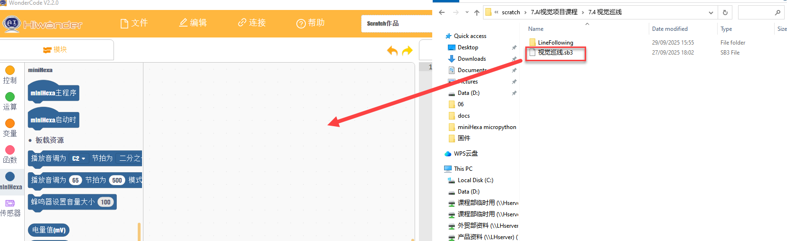

3. Click **Connect** in the menu bar and select the correct `COM` port. `COM4` is used here as an example. After the connection is successful, the **Connected successfully** message is displayed.


4. Click the upload icon  on the right side to download the program to miniHexa. Wait until the success message is displayed.


#### 7.4.6.5 Project Outcome

When the AI vision module detects a red line, the robot follows the line.

#### 7.4.6.6 Program Analysis

1. Initialize the I2C interface of the ESP32-S3 AI vision module.

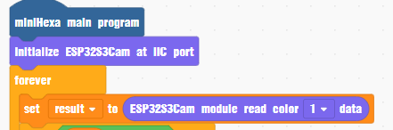

2. If the vision module detects red and the center `x` coordinate of the color region is greater than `120`, the robot moves diagonally forward to the right.

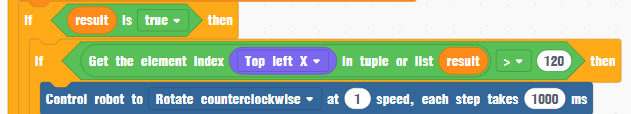

3. If the center `x` coordinate of the color region is less than `40`, the robot moves diagonally forward to the left.

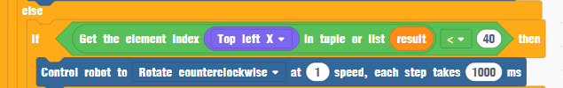

4. Otherwise, the robot moves straight forward.


### 7.4.7 Face Detection

#### 7.4.7.1 Feature Overview

This section uses the ESP32-S3 AI vision module to detect faces. After a face is detected, miniHexa performs a cute action.

#### 7.4.7.2 Project Process


#### 7.4.7.3 Module Description

1. ESP32-S3 AI vision module


This development board integrates an ESP32-S3 chip and a camera module. After it is installed on the carrier board, it communicates through an I2C Port and can read color and face-detection data through I2C communication.

Module wiring: as shown below, connect the module to any I2C Port highlighted in red on the servo controller before running this program.


#### 7.4.7.4 Program Download

1. Program download for the ESP32-S3 AI vision module

(1) Connect the ESP32-S3 AI vision module to a USB port on the PC with a Type-C cable.

(2) Open [**03 Program Files/04 Face Recognition/FaceDetection/FaceDetection.ino**](https://drive.google.com/drive/folders/1xqueBOdC5H0K9TtBWG1KYc45pvKfJZXj?usp=sharing).


(3) Select **ESP32S3 Dev Module** as the development board.


(4) Click **Tools** in the menu bar. Configure the ESP32S3 development board options as shown below.


:::{Note}
**Modify the development board configuration before downloading the program to the AI vision module.**
:::

(5) Finally, click  to download the code to the ESP32-S3 AI vision module. Wait until flashing is complete.


2. Upload the scratch program.

3. Open the WonderCode software.


2. Open [**03 Program Files/05 Face Recognition/FaceRecognition.sb3**](https://drive.google.com/drive/folders/1svb9fqHF9Nhxcq6sA8W8ADHl5xVftBWr?usp=sharing), then drag it into WonderCode.


3. Click **Connect** in the menu bar and select the correct `COM` port. `COM4` is used here as an example. After the connection is successful, the **Connected successfully** message is displayed.


4. Click the upload icon  on the right side to download the program to miniHexa. Wait until the success message is displayed.


#### 7.4.7.5 Project Outcome

When a face is detected, miniHexa performs a cute action.

#### 7.4.7.6 Program Analysis

1. Initialize the I2C interface of the ESP32-S3 AI vision module.


2. If the ESP32-S3 AI vision module detects a face, control miniHexa to swing within `±10°`, then return to the level posture.


## 7.5 AI Voice Project

### 7.5.1 Introduction and Installation of WonderEcho

#### 7.5.1.1 Module Introduction


The integrated voice interaction module WonderEcho is built on the CI1302 chip for voice recognition and voice playback. It supports offline neural network acceleration and hardware acceleration for voice signal processing. The module uses deep noise reduction and neural network models to analyze voice input and generate recognition results.

The CI1302 chip integrates a Brain Neural Processing Unit, supports offline neural network acceleration and hardware acceleration for voice signal processing, and runs at up to `220MHz`. It supports offline far-field voice recognition, includes `2MB` of onboard `FLASH` storage, and can store up to `300` command words.

The module is easy to use and provides reliable voice recognition performance. It is widely used in smart home devices, conversational robots, educational robots, and in-vehicle dispatch terminals.

* **Working Principle**

The module uses a wake-word activation mode. Speak the wake word first to activate the voice interaction module. Commands can be recognized only after activation.

English is the default recognition language. The default English wake word is `Hello Hiwonder`. 

If no voice is recognized within `15` seconds, the module enters sleep mode. Wake the module again before the next use.

After the CI1302 chip recognizes a command word, it sends the corresponding instruction to the I2C chip and plays back the matching phrase. The I2C chip stores the received voice instruction and sends it through the I2C device protocol. The specific command words are listed in [**03 WonderEcho Firmware Flash Tutorial/02 Command Word and Playback Phrase Protocol List.xlsx**](https://drive.google.com/drive/folders/1e-vzqBwLItw3BwNW-aiP2RLdFPgr7MBs?usp=sharing).

* **Notes**

1. Use a `5V` power supply. Incorrect voltage may damage the module.

2. Use the module in a quiet environment. Excessive background noise affects recognition performance.

3. Speak the command words clearly and loudly. Avoid speaking too quickly. For best results, stay within 5 meters of the module.

#### 7.5.1.2 Hardware Interface Description


| **No.** | **Hardware Name**         | **Description**                                              |
| :-----: | :------------------------ | :----------------------------------------------------------- |
|    1    | Speaker                   | Converts analog signals into sound                           |
|    2    | Microphone                | Converts sound into analog signals                           |
|    3    | RST button                | Reset button                                                 |
|    4    | Signal indicator blue LED | Stays on during operation. Flashes once when a command word is recognized |
|    5    | Power indicator red LED   | Stays on when the power supply is normal                     |
|    6    | I2C Port                  | Works as an I2C device and is used for power supply and communication with the controller |
|    7    | Type-C Port               | Used for power supply and CI1302 firmware updates            |
|    8    | CI1302 chip               | High-performance voice recognition chip that recognizes voice commands and outputs signals |
|    9    | I2C chip                  | Converts instructions from the voice recognition chip into I2C protocol commands |
|   10    | Audio amplifier chip      | Converts digital signals into analog signals to drive the speaker |

### 7.5.2 Introduction to the Voice Module Library Files

**WonderEcho Code Blocks**

1. Module initialization

Use the block below to initialize the module interface.


2. Retrieve the command word ID

Use the block below to get the command word ID recognized by the module. The return value is an integer.


3. Play back a specified entry by ID

This block requires two parameters. `cmd` is the entry type ID to be played back. `0xFF` is the playback type and `0x00` is the command type. `id` is the ID of the entry to be played back. The module receives the data through the I2C protocol and actively plays back the specified entry.


### 7.5.3 Voice Obstacle Alert

#### 7.5.3.1 Feature Overview

This section uses the ultrasonic module to detect obstacles in front of the robot. When an obstacle is too close, the ultrasonic module and the voice interaction module provide a sound and light alert.

#### 7.5.3.2 Project Process


#### 7.5.3.3 Module Description

1. WonderEcho voice interaction module


The integrated voice interaction module WonderEcho is built on the CI1302 chip for voice recognition and voice playback. It supports offline neural network acceleration and hardware acceleration for voice signal processing. The module uses deep noise reduction and neural network models to analyze voice input and generate recognition results.

Module wiring: as shown below, connect the module to any I2C Port highlighted in red on the servo controller before running this program.


Installation: mount the voice interaction module on the rear panel of miniHexa.


2. Glowy ultrasonic module


The module uses an I2C communication interface and can read the distance measured by the ultrasonic sensor through I2C communication. Two RGB LEDs are integrated at the ultrasonic probe position. The brightness can be adjusted. Color changes and color mixing across the red channel `R`, green channel `G`, and blue channel `B` make full-color lighting effects possible.

:::{Note}
**The glowy ultrasonic module is already connected to the onboard I2C Port at the factory. No additional wiring is required.**
:::

#### 7.5.3.4 Program Download

1. Open the WonderCode software.


2. Open [**02 Program Files/01 Voice Obstacle Alert Program/Voice Obstacle Alert Program.sb3**](https://drive.google.com/drive/folders/1DZBY90__J_O4Ixpf2nS71hpF21Ai06Fy?usp=sharing), then drag it into WonderCode.


3. Click **Connect** in the menu bar and select the correct `COM` port. `COM4` is used here as an example. After the connection is successful, the **Connected successfully** message is displayed.


4. Click the upload icon  on the right side to download the program to miniHexa. Wait until the success message is displayed.


#### 7.5.3.5 Project Outcome

When the glowy ultrasonic module detects no obstacle ahead or the obstacle is too far away, the module lights up green. When the obstacle is too close, the module lights up red and the voice interaction module plays back `Obstacle ahead`.

#### 7.5.3.6 Program Analysis

1. Initialize the WonderEcho module I2C interface.


2. If the distance detected by the ultrasonic module is less than `15`, set the RGB LED on the ultrasonic module to red. Then make WonderEcho play back `Obstacle ahead`.


3. If the distance is greater than or equal to `15`, set the RGB LED on the ultrasonic module to green.


### 7.5.4 Human-Robot Interaction

#### 7.5.4.1 Feature Overview

This section uses the voice interaction module to detect commands and respond with different actions.

#### 7.5.4.2 Project Process


#### 7.5.4.3 Preparation

1. Module installation


The integrated voice interaction module WonderEcho is built on the CI1302 chip for voice recognition and voice playback. It supports offline neural network acceleration and hardware acceleration for voice signal processing. The module uses deep noise reduction and neural network models to analyze voice input and generate recognition results.

Module wiring: as shown below, connect the module to any I2C Port highlighted in red on the servo controller before running this program.


Installation: mount the voice interaction module on the rear panel of miniHexa.


#### 7.5.4.4 Action Group Download

Follow the instructions in [**7.3 Secondary Development Project -> 7.3.1.3 Action Group Download**](https://drive.google.com/drive/folders/1kPzjVhsJKAJ-pdjfzEKKEYZBVR2Mkj6T?usp=sharing) to download the action groups to miniHexa.

#### 7.5.4.5 Program Download

1. Open the WonderCode software.


2. Open [**02 Program Files/02 Human-Robot Interaction Program/Human-Robot Interaction.sb3**](https://drive.google.com/drive/folders/144ueDYEfzE3HyQkJ_7EEEKB7Ini_2rVy?usp=sharing), then drag it into WonderCode.


3. Click **Connect** in the menu bar and select the correct `COM` port. `COM4` is used here as an example. After the connection is successful, the **Connected successfully** message is displayed.


4. Click the upload icon  on the right side to download the program to miniHexa. Wait until the success message is displayed.


#### 7.5.4.6 Project Outcome

When a specified command word is recognized, the robot executes the corresponding action as a response. The mapping between the command word and the action is as follows:

| **Spoken Command**   | **Voice Module Response**                 | **Executed Action**             |
| :------------------- | :---------------------------------------- | :------------------------------ |
| `Hi`                 | `Hi`                                      | Run Action Group `14`           |
| `Introduce Yourself` | `I'm Hiwonder, and I can talk and dance.` | Perform the left-right movement |
| `Show a Skill`       | `Watch closely.`                          | Run Action Group `7`            |

#### 7.5.4.7 Program Analysis

1. Initialize the WonderEcho module I2C interface.


2. Set `result` to the command word ID recognized by WonderEcho.


3. If the recognized command word ID is `26`, miniHexa runs Action Group `14`.


4. If the recognized command word ID is `27`, miniHexa performs the left-right movement.


5. If the recognized command word ID is `28`, miniHexa runs Action Group `7`.


### 7.5.5 Voice Control

#### 7.5.5.1 Feature Overview

This section uses the voice interaction module to detect spoken commands and execute the corresponding movements.

#### 7.5.5.2 Project Process


#### 7.5.5.3 Module Description


The integrated voice interaction module WonderEcho is built on the CI1302 chip for voice recognition and voice playback. It supports offline neural network acceleration and hardware acceleration for voice signal processing. The module uses deep noise reduction and neural network models to analyze voice input and generate recognition results.

Module wiring: as shown below, connect the module to any I2C Port highlighted in red on the servo controller before running this program.


Installation: mount the voice interaction module on the rear panel of miniHexa.


#### 7.5.5.4 Program Download

1. Open the WonderCode software.


2. Open [**02 Program Files/03 Voice Control Program/Voice Control.sb3**](https://drive.google.com/drive/folders/1ZfDU1EfQAfNjbeJyFZqsBwy7QX48z-GJ?usp=sharing), then drag it into WonderCode.


3. Click **Connect** in the menu bar and select the correct `COM` port. `COM4` is used here as an example. After the connection is successful, the **Connected successfully** message is displayed.


4. Click the upload icon  on the right side to download the program to miniHexa. Wait until the success message is displayed.


#### 7.5.5.5 Project Outcome

When a specified command word is recognized, the robot executes the corresponding movement as a response. The mapping between the command word and the movement is as follows:

| **Spoken Command** | **Voice Module Response** | **Executed Movement**                         |
| :----------------- | :------------------------ | :-------------------------------------------- |
| `Go straight`      | `Going straight`          | Move forward continuously                     |
| `Go backward`      | `Going backward`          | Move backward continuously                    |
| `Turn left`        | `Turning left`            | Rotate counterclockwise continuously          |
| `Turn right`       | `Turning right`           | Rotate clockwise continuously                 |
| `Stop`             | `Copy that`               | Stop moving                                   |
| `March`            | `Copy that`               | Move forward two steps in the current heading |

#### 7.5.5.6 Program Analysis

1. Initialize the WonderEcho module I2C interface.


2. Set `result` to the command word ID returned by WonderEcho. If the ID is `1`, which is `Go straight`, miniHexa moves forward at speed `2`.


3. If the ID is `2`, which is `Go backward`, miniHexa moves backward at speed `2`.


4. If the ID is `3`, which is `Turn left`, miniHexa rotates counterclockwise at speed `2`.


5. If the ID is `4`, which is `Turn right`, miniHexa rotates clockwise at speed `2`.


6. If the ID is `9`, which is `Stop`, miniHexa stops moving.


7. If the ID is `29`, which is `March`, miniHexa moves forward two steps.

