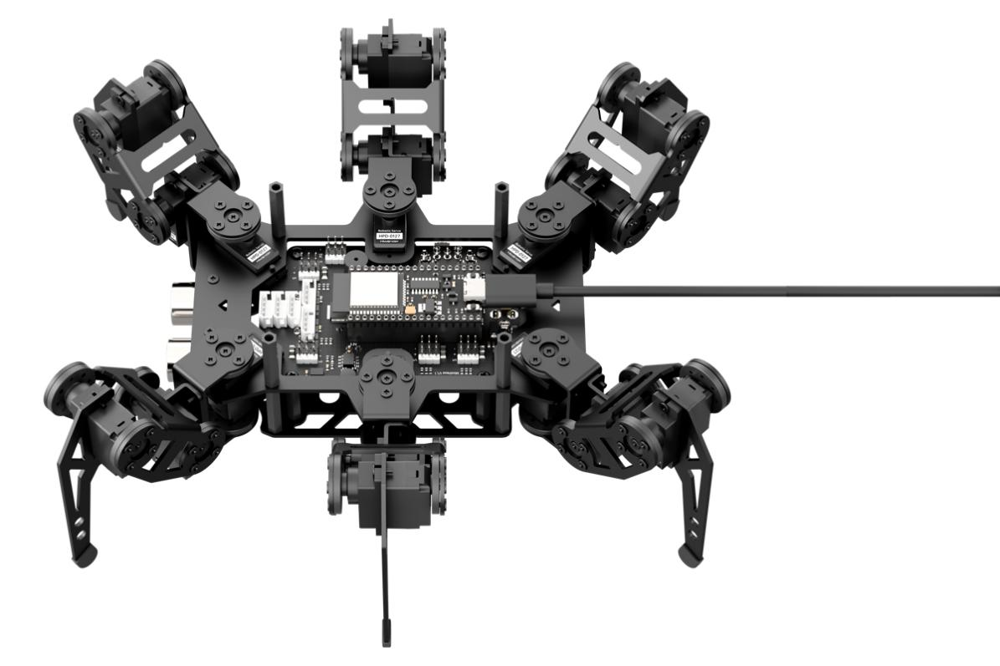
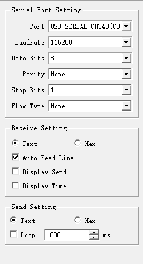
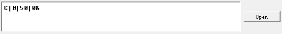
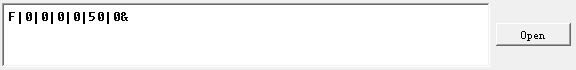
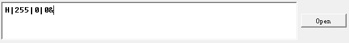
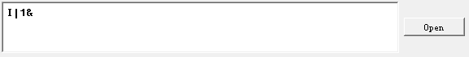
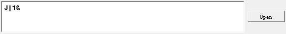
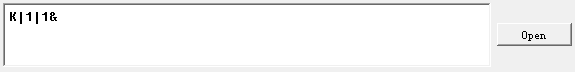

# 8. Serial Communication Hands-on Course

## 8.1 Controller-Device Communication Principle

This section introduces the controller-device relationship when miniHexa communicates with a PC. It explains how miniHexa works as a device to communicate with other equipment and how other equipment works as the controller to control miniHexa.

In this chapter, miniHexa always works as a device and transmits information with other equipment through the UART serial port.

> [!NOTE]
>
> **The communication protocol used between other PC software and miniHexa is the [8.3 miniHexa Communication Protocol](#anther8.3).**

### 8.1.1 Controller-Device Relationship

In a controller-device control system, miniHexa works as the device, and other equipment works as the controller.

### 8.1.2 Functions of miniHexa as a Device

1) Receive and parse signals sent by the controller:

Wait for serial port signals. If data is received through the serial port, parse the serial port data according to the communication protocol, then call the corresponding function based on the data information.

2) Call miniHexa functions based on received data:

After a signal is parsed, call the corresponding miniHexa device function, such as action group calling or single-servo and multi-servo control.

3) Package and return data:

When a read command is received, call the corresponding read function, package the read data into a data packet according to the communication protocol, and send it to the controller device.

### 8.1.3 Other Equipment as the Controller

1) Package and send instructions:

The controller needs to package control instructions and data into a data packet according to the communication protocol, then send it to the device.

2) Coordinate control:

The controller device needs to manage the coordinated operation of the whole system. This ensures that communication and operation between miniHexa and other equipment do not conflict and that the system stays in good working condition.

3) Receive data:

When the controller reads the robot status, it needs to receive the status information data sent by miniHexa after sending the read instruction. This ensures the completeness and correctness of the data. Then parse the data packet and extract useful information from it.

### 8.1.4 Hardware Connection

> [!NOTE]
>
> **Before downloading the program, make sure the serial port driver has been installed.**

1) Use a USB download cable to connect the PC USB port to the USB serial port on the controller board.



### 8.1.5 Data Transmission Format

The default UART serial port data transmission format of miniHexa is:

| Baud Rate | 115200 |
|:------:|:------:|
| Data Bits | 8 |
| Parity Bit | None |
| Stop Bit | 1 |

<p id ="anther8.3"></p>

### 8.1.6 Communication Protocol

For details, see [8.3 miniHexa Communication Protocol](#anther8.3) in this document.


## 8.2 PC Serial Control

This section uses a PC serial port to control miniHexa movement, posture, RGB lights, and other functions.

### 8.2.1 Principle

> [!NOTE]
>
> **This section can be implemented only after the miniHexa device-side program has been flashed. Upload [02 Program Files\9.2.2 miniHexa Device-Side Program](https://drive.google.com/drive/folders/1ulrGCICECrIp0ckmUOvOKp4Qxf9eKs-f?usp=sharing) in the same path as this document first.**

1) After miniHexa is connected to the PC, it can be controlled through serial communication. The default UART serial port data transmission format is:

| Baud Rate | 115200 |
| :----: | :----: |
| Data Bits | 8 |
| Parity Bit | None |
| Stop Bit | 1 |

2) The protocol instruction packet format is described below. The protocol instruction packet starts with a function code, uses `|` to separate fields, and ends with `&`.

### 8.2.2 Preparation

* **Hardware Preparation**

Connect the PC to miniHexa with a Type-C data cable.


* **Software Preparation**

1) First, find the serial port tool in [**02 Program Files\9.2.3 Serial Debug Tool**](https://drive.google.com/drive/folders/1qeC_q1QLt48_JkgVzKEaoHcaHD6a2W8o?usp=sharing), which is in the same path as this section.


2) After the serial debug tool opens, make sure the serial transmission assistant is set to baud rate `115200`, parity bit `None`, data bits `8`, and stop bit `1`. The configuration is shown below.



### 8.2.3 Function Implementation

Control miniHexa by sending protocol instructions:

* **Command Name: Movement Control**

1. Function code: `C`

2. Command data: x-axis data, y-axis data, z-axis data

3. Description: This command controls miniHexa movement.

4. Example: Use the command data `C|0|50|0&` as an example. This command controls miniHexa to move forward at a speed of `50`.




* **Command Name: Posture Control**

1. Function code: `F`

2. Command data: yaw-axis data, roll-axis data, pitch-axis data, x-axis data, y-axis data, z-axis data

3. Description: This command controls the posture of miniHexa.

4. Example: Use the command data `F|0|0|0|0|50|0&` as an example. This command controls the center of gravity of miniHexa to move forward.




* **Command Name: RGB Light Control**

1. Function code: `H`

2. Command data: R component value, G component value, B component value

3. Description: This command controls the RGB light color of the glowy ultrasonic module.

4. Example: Use the command data `H|255|0|0&` as an example. This command sets the glowy ultrasonic module of miniHexa to red.




* **Command Name: Ultrasonic Obstacle Avoidance Control**

1. Function code: `I`

2. Command data: `a`. When `a` is `0`, the obstacle avoidance function is disabled. When `a` is `1`, the obstacle avoidance function is enabled.

3. Description: This command enables or disables ultrasonic obstacle avoidance.

4. Example: Use the command data `I|1&` as an example. This command controls miniHexa to enable obstacle avoidance.




* **Command Name: Self-Balancing Control**

1. Function code: `J`

2. Command data: `a`. When `a` is `0`, the self-balancing function is disabled. When `a` is `1`, the self-balancing function is enabled.

3. Description: This command enables or disables self-balancing.

4. Example: Use the command data `J|1&` as an example. This command controls miniHexa to enable self-balancing.




* **Command Name: Action Group Control**

1. Function code: `K`

2. Command data: sub-function code, action group number

3. Description: This command controls action group running.

4. Example: Use the command data `K|1|1&` as an example. This command controls miniHexa to run Action Group 1.



<p id ="anther8.3"></p>

## 8.3 miniHexa Communication Protocol

### 8.3.1 Movement Control

`C|x-axis data|y-axis data|in-place turn data&`

| `x` | in [-50, 50], negative for left and positive for right |
| ----- | --------------------------------- |
| `y` | in [-50, 50], positive for up and negative for down |
| `z` | `0` - stop, `1` - turn left, `2` - turn right |


### 8.3.2 Posture Control

`F|yaw-axis data|roll-axis data|pitch-axis data|x-axis data|y-axis data|z-axis data&`

| `yaw` | in [-20, 20] |
| --------- | --------------------- |
| `roll` | in [-50, 50] |
| `pitch` | in [-50, 50] |
| `x` | in [-50, 50], positive for left and negative for right |
| `y` | in [-50, 50], positive for up and negative for down |
| `z` | in [0, 30] |


### 8.3.3 Deviation

* **Mode Switch**

`G|0&`

* **Set**

`G|1|a|b|c|d&`

| `a` | Leg number in [1, 6] |
| ----- | ---------------------------- |
| `b` | x-axis deviation data. Step value: +/-1 |
| `c` | y-axis deviation data. Step value: +/-1 |
| `d` | z-axis deviation data. Step value: +/-1 |

* **Save**

Send: `G|2|a&`

| `a` | Leg number in [1, 6] |
| ----- | ------------------- |

Return: `G|2|0&` - failed

`G|2|1&` - succeeded

* **Read**

Send: `G|3|a&`

Return: `G|3|a|b|c|d&`

| `a` | Leg number in [1, 6] |
| ----- | ------------------- |
| `b` | x-axis deviation data |
| `c` | y-axis deviation data |
| `d` | z-axis deviation data |

* **Verify**

`G|4|a&`

| `a` | Leg number |
| ---- | -------- |


### 8.3.4 RGB Light Adjustment

`H|R|G|B&`

| `R` | in [0, 255] |
| ----- | ------------ |
| `G` | in [0, 255] |
| `B` | in [0, 255] |


### 8.3.5 Obstacle Avoidance Switch

`I|a&`

| `a` | `0` disables obstacle avoidance. `1` enables obstacle avoidance. |
| ---- | ------------------------ |


### 8.3.6 Self-Balancing Switch

`J|a&`

| `a` | `0` disables self-balancing. `1` enables self-balancing. |
| ---- | ----------------------------- |


### 8.3.7 Run, Stop, Download, and Erase Action Groups

* **Run**

`K|1|a&`

| `a` | Action group number to run |
| ---- | ------------------ |

**Return format:** Action Group 0 only

```
  $$>current running action frame number<$$
```


* **Stop**

`K|2&`

* **Download**

`K|3|a|b|c|d|e|f|g|h|i&`

Return: `K|3&`

| `a` | Downloaded action group number |
| ----- | ---------------------- |
| `b` | Total number of frames in the action group |
| `c` | Action frame number |
| `d` | Total number of servos to download |
| `e` | Low byte of control time |
| `f` | High byte of control time |
| `g` | Servo ID number |
| `h` | Low byte of servo pulse width value |
| `i` | High byte of servo pulse width value |
| ... | |

* **Erase One**

Send: `K|4|a&`

| `a` | Action group number |
| ---- | ---------- |

Successful erase return: `K&`

* **Erase All**

Send: `K|5&`


### 8.3.8 Servo Control

`L|a|b|c|d|e|f...&`

| `a` | Total number of servos to control |
| ---- | ----------------------------------------------------- |
| `b` | Low byte of servo running time |
| `c` | High byte of servo running time |
| `d` | Servo ID number |
| `e` | Low byte of servo pulse width value |
| `f` | High byte of servo pulse width value |
| ... | The following data parameters are the same as parameters `d`, `e`, and `f` in sequence and control servos with different IDs. |


### 8.3.9 Servo Pulse Width Readback

Return: `M|a|b|c..&`

| `a` | Servo ID number 1-18 |
| ---- | ----------------------------------------------------- |
| `b` | Low byte of servo pulse width value |
| `c` | High byte of servo pulse width value |
| ... | The following data parameters are the same as parameters `d`, `e`, and `f` in sequence and control servos with different IDs. |
