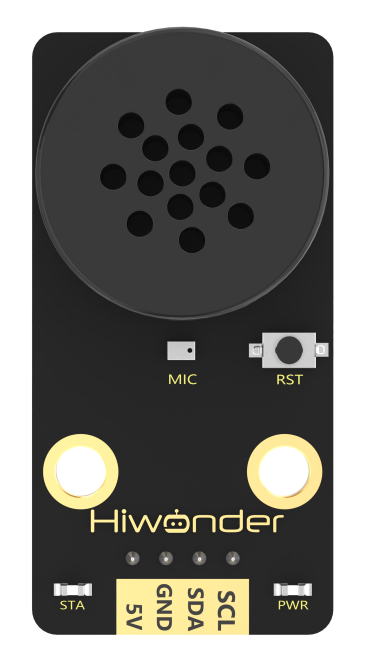
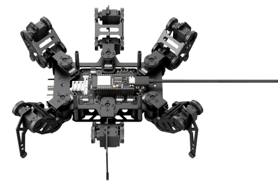

# 8. AI Voice Interaction Course

## 8.1 Introduction and Installation of WonderEcho

### 8.1.1 Voice Interaction Module

* **Voice Interaction Module Instruction**

(1) Introduction



WonderEcho, the integrated voice interaction module, is built on the CI1302 chip and supports both voice recognition and voice playback. It features offline neural network (NN) acceleration and hardware-accelerated voice signal processing. Through advanced noise reduction and neural network models, voice inputs are analyzed to produce recognition results.

The CI1302 chip includes a Brain Neural Processing Unit (BNPU), enabling efficient offline NN computation and voice signal hardware acceleration. With a CPU frequency of up to 220 MHz, it supports far-field offline voice recognition. The chip is equipped with 2MB of onboard flash memory and can store up to 300 voice command entries.

The module is easy to operate and delivers excellent voice recognition performance, making it widely applicable in scenarios such as smart home systems, conversational robots, educational robots, and in-vehicle dispatch terminals.

(2) Working Principle

The module uses a wake word-based activation mechanism. A specific wake word must be spoken to activate the voice interaction system before any command can be recognized. By default, the system operates in English, and the default English wake word is “Hello Hiwonder.” To switch to Chinese recognition, the corresponding Chinese firmware must be flashed. Once switched, the Chinese wake word becomes “小幻小幻” (Xiao Huan Xiao Huan). If no valid voice input is detected within 15 seconds, the module automatically enters sleep mode. To resume operation, the wake word must be spoken again.

When the CI1302 chip successfully recognizes a voice command, the corresponding command is sent to the IIC chip and played back via voice feedback. The IIC chip stores the recognized command and transmits it through the IIC target device protocol. A complete list of supported voice commands and playback phrases can be found in the "Command Word and Playback Phrase Protocol List" located in the same directory as this document.

* **Notice**

A 5V power supply must be used. Supplying incorrect voltage may damage the module.

The operating environment should be quiet. Excessive background noise may affect recognition performance.

When speaking command words, ensure the voice is clear and loud, and avoid speaking too quickly. A distance of less than 5 meters between the user and the module is recommended.

3 Hardware Interface Description


| **No.** |        **Component**        |                       **Description**                        |
| :-----: | :-------------------------: | :----------------------------------------------------------: |
|    1    |           Speaker           |          Converts analog signals into audible sound          |
|    2    |         Microphone          |              Converts sound into analog signals              |
|    3    |         RST Button          |                         Reset button                         |
|    4    | Signal Indicator (Blue LED) |   Remains on and flashes once when a command is recognized   |
|    5    |  Power Indicator (Red LED)  |        Remains on when the module is properly powered        |
|    6    |          IIC Port           | Functions as an IIC target device and is used for power supply and communication with a host controller |
|    7    |         Type-C Port         | Used for power supply and firmware updates for the CI1302 chip |
|    8    |         CI1302 Chip         | High-performance voice recognition chip that processes voice input and outputs signals |
|    9    |          IIC Chip           | Converts instructions from the voice recognition chip into IIC protocol commands |
|   10    |    Audio Amplifier Chip     | Converts digital signals into analog signals to drive the speaker |

### 8.1.2 WonderEcho Firmware Flashing

* **Notice**

By default, the voice interaction module is pre-flashed with English voice recognition firmware, and the wake word is “Hello Hiwonder.” The Chinese factory firmware is located in the same directory as this document, where the wake word is **“Xiao Huan Xiao Huan”**. If you need to re-flash the firmware to Chinese version, please follow the instructions below.

* **Firmware Flashing Steps**

(1) Connect the voice interaction module to your computer using a Type-C data cable.


(2) Open the [Firmware Flashing Tool/PACK_UPDATE_TOOL.exe]() located in the same directory as this document. In the tool, select the **“CI1302”** chip model, then click **“Upgrade.”**


(3) Click **“Select firmware”**, and choose the firmware file named [CI1302_Chinese_SingleMic_V00729_UART1_115200_2M.bin]() found in the same directory as this document.


(4) Locate and select the appropriate serial port.


(5) Press the RST button on the voice interaction module to enter flashing mode and wait for the flashing process to complete successfully.


## 8.2 Voice Module Library Files Introduction

### 8.2.1 WonderEcho Code

* **Module Initialization**

Use `begin()` to specify the pin interface and initialize the module.

{lineno-start=79}

```
void HW_Sensor::begin() {
  Wire.setPins(SDA, SCL);
  Wire.begin();
  pinMode(io1_pin, INPUT); 
  pinMode(io3_pin, INPUT); 
}
```

* **Retrieve Entry ID**

Use the `wire_read_array()` function to communicate with the module via IIC. This code is used to obtain the ID of the entry recognized by the module. The return value is of type uint8.

{lineno-start=6}

```
uint8_t Wonder_Echo::rec_recognition(void) {
  uint8_t result = 0;

  wire_read_array(WONDER_ECHO_ADDR, ASR_RESULT_REG, &result, 1);
  return result;
}
```

* **Broadcast Specified Entry by ID**

This function requires two parameters: cmd, which specifies the entry type ID to be broadcast (0xFF for broadcast type, 0x00 for command type); and id, which specifies the entry ID to be broadcast. Data is sent to the module through the IIC protocol, enabling the voice interaction module to actively play the specified entry.

{lineno-start=13}

```
void Wonder_Echo::speak(uint8_t cmd,uint8_t id) {
  uint8_t send[2];

  if(cmd == ASR_COMMAND || cmd == ASR_ANNOUNCER) {
    send[0] = cmd;
    send[1] = id;
    wire_write_array(WONDER_ECHO_ADDR, ASR_SPEAK_REG, send, 2);
  }
}
```

## 8.3 Voice Obstacle Alert

### 8.3.1 Overview

In this lesson, the ultrasonic module is used to detect obstacles in front of the robot. When the distance is too short, the ultrasonic module works together with the voice interaction module to trigger a sound and light alert.

### 8.3.2 Project Process


### 8.3.3 Module Instruction

* **WonderEcho AI Voice Recognition Module**


WonderEcho, the integrated voice interaction module, is built on the CI1302 chip and supports both voice recognition and voice playback. It features offline neural network (NN) acceleration and hardware-accelerated voice signal processing. Through advanced noise reduction and neural network models, voice inputs are analyzed to produce recognition results.

Module connection: As shown in the figure below, please connect the module to any IIC port marked in the red frame on the servo control board before starting the feature.


Installation: Mount the WonderEcho onto the rear panel of miniHexa.


* **Glowy Ultrasonic Sensor**


This module uses an IIC communication interface and can read distance measurements from the ultrasonic sensor via IIC. Additionally, the ultrasonic probe integrates two RGB LEDs, which not only support brightness adjustment but also can produce colorful lighting effects through changes and combinations of the red (R), green (G), and blue (B) channels.

:::{Note}

The sensor comes with the onboard IIC port already connected at the factory. No additional wiring by the user is required.

:::

### 8.3.4 Program Download

[Source Code]()

(1) Connect miniHexa to your computer using a Type-C data cable.


(2) Open the program file located in the same directory as this document: [Voice Obstacle Alert Program\asr_ultrasound\asr_ultrasound.ino]()


(3) Select the development board model when you open the program, and the specific model is shown in the figure below.


(4) In the menu bar, click **Tools**, and choose the corresponding ESP32 controller configuration as illustrated.


:::{Note}

Make sure to set the correct controller configuration before uploading the program.

:::

(5) Click "**Compile**” first, then click "**Upload**". After the upload is completed, the program download is completed if the following interface appears in the output box below the software.


### 8.3.5 Project Outcome

When the ultrasonic distance sensor with RGB lighting detects no obstacle ahead or the obstacle is too far away, it lights up green. When it detects an obstacle too close, it lights up red and the voice interaction module announces: “Obstacle ahead.”


### 8.3.6 Program Brief Analysis

[Source Code]()

(1) The program imports the hiwonder_robot.h and hiwonder_sensor.h libraries. hiwonder_sensor.h contains definitions for various sensors and interaction methods, while hiwonder_robot.h contains methods for interacting with the robot system itself.

{lineno-start=1}

```
#include "hiwonder_robot.h"
```

(2) Create the robot and sensor objects for subsequent control.

{lineno-start=3}

```
Robot minihexa;
```

(3) Create a distance variable dis, a system time variable tickstart, and two RGB light intensity ratio arrays rgb1 and rgb2 for the ultrasonic ranging module with indicator lights.

{lineno-start=5}

```
uint16_t dis;
uint8_t rgb1[3] = {0};
uint8_t rgb2[3] = {0};
uint32_t tickstart = 0;
```

(4) In the setup() function, first initialize the serial port with a baud rate of 115200, then initialize the robot and sensors.

{lineno-start=10}

```
void setup() {
  Serial.begin(115200);
  minihexa.begin();
}
```

(5) In the main loop, first call the get_distance function from the sensor object to obtain the distance of the obstacle detected by the ultrasonic ranging module with indicator lights. For debugging and observation, use println to forward the acquired data via the serial port.

{lineno-start=15}

```
void loop() {
  dis = minihexa.sensor.get_distance();
  Serial.println(dis);
```

(6) Then, evaluate the obtained distance value. If the value is less than 100 mm, it is considered **obstacle too close**; otherwise, it is regarded as **no obstacle detected or obstacle too far**. Since the execution logic is highly similar in both cases, we will use the “**obstacle too close**” scenario as an example for explanation:

① Set rgb1\[0\], the red channel in the rgb1 array of the ultrasonic ranging module’s RGB light, to 255; set rgb1\[1\], the green channel, and rgb1\[2\], the blue channel, to 0. Then copy the same values to the rgb2 array of the other RGB light.

② Call the set_ultrasound_rgb function of the sensor object to send the light intensity ratio data to the ultrasonic ranging module, specifying mode 1, no light gradient. This will make the module’s RGB lights turn red to indicate an alert.

③ Next, call the speak function of the voice module sub-object under the sensor object to make the voice interaction module broadcast the type-“**speech**” entry with ID 5, which is “**Obstacle ahead**.”

:::{Note}

* The speak function is non-blocking. It only sends the command to the voice interaction module and then exits immediately.

* To prevent the voice interaction module from being interrupted by consecutive speak calls when the obstacle distance is detected as too close, protective measures must be applied to the execution of this function, ensuring that the module finishes the current announcement before receiving the next command. The internal speak function will only execute if the real-time system time obtained via the millis function is at least 3000 ms greater than the tickstart time recorded during the previous announcement.

* The speak function can also broadcast “command word” type entries. For example, asr.speak(ASR_COMMAND, 1) will broadcast the response phrase of the command word with ID 1, which is “Going straight.”

:::

{lineno-start=18}

```
  if (dis < 100) {          
    rgb1[0] = 255;
    rgb1[1] = 0;
    rgb1[2] = 0;
    memcpy(rgb2, rgb1, sizeof(rgb1));
    minihexa.sensor.set_ultrasound_rgb(1, rgb1, rgb2);
    if(millis() - tickstart > 3000) {
      minihexa.sensor.asr.speak(ASR_ANNOUNCER, 5);
      tickstart = millis();
    }
  }
```

## 8.4 Human-Robot Interaction

### 8.4.1 Overview

In this lesson, the voice interaction module is used to detect commands and respond with different actions.

### 8.4.2 Project Process


### 8.4.3 Preparation

* **Module Installation**


WonderEcho, the integrated voice interaction module, is built on the CI1302 chip and supports both voice recognition and voice playback. It features offline neural network (NN) acceleration and hardware-accelerated voice signal processing. Through advanced noise reduction and neural network models, voice inputs are analyzed to produce recognition results.

Module connection: As shown in the figure below, please connect the module to any IIC port marked in the red frame on the servo control board before starting the feature.


Installation: Mount the WonderEcho onto the rear panel of miniHexa.


* **Download the Action Group**

:::{Note}

miniHexa comes with the PC software control program pre-installed. Downloading other feature’s program will overwrite the existing functionality. To download action group again, you will need to re-download the program.

:::

(1) Connect miniHexa to your computer using a Type-C data cable.



(2) Open the program file located at: [PC Software Program Files\remote\remote.ino]().


(3) Select the development board model when you open the program, and the specific model is shown in the figure below.


(4) Click **"Compile”** first, then click **"Upload"**. After the upload is completed, the program download is completed if the following interface appears in the output box below the software.


(5) Refer to the document at [3. PC Control and Action Group Editing->3.5 Execute and Download Actions->3.5.2 Download an Action](), to download Action Group 14 and Action Group 7 to miniHexa.

### 8.4.4 Program Download

[Source Code]()

(1) Connect miniHexa to your computer using a Type-C data cable.


(2) Open the program file located in the same directory as this document: [Human-Robot Interaction Program\communicate]()


(3) Select the development board model when you open the program, and the specific model is shown in the figure below.


(4) Click "**Compile**” first, then click "**Upload**". After the upload is completed, the program download is completed if the following interface appears in the output box below the software.


### 8.4.5 Project Outcome

When you speak a specified keyword, the robot performs the corresponding action group as a response. The mapping between the spoken command, the voice module response, and the executed action group is as follows:

|   Spoken Command   |             Voice Module Response              |     Executed Action Group     |
| :----------------: | :--------------------------------------------: | :---------------------------: |
|       Hello        |                       Hi                       |      Run action group 14      |
| Introduce Yourself | Hello, I'm Hiwonder, and I can talk and dance. | Execute action group Act cute |
|    Show a Skill    |                 Watch closely                  |      Run action group 7       |


### 8.4.6 Program Brief Analysis

[Source Code]()

(1) The program imports the hiwonder_robot.h and hiwonder_sensor.h libraries. hiwonder_sensor.h contains definitions for various sensors and interaction methods, while hiwonder_robot.h contains methods for interacting with the robot system itself.

{lineno-start=1}

```
#include "hiwonder_robot.h"
```

(2) Create the robot and sensor objects for subsequent control.

{lineno-start=3}

```
Robot minihexa;
```

(3) Create a variable result to store the recognized keyword ID.

{lineno-start=5}

```
uint8_t result;
```

(4) In the setup() function, first initialize the serial port with a baud rate of 115200, then initialize the robot and sensors.

{lineno-start=7}

```
void setup() {
  Serial.begin(115200);
  minihexa.begin();
}
```

(5) In the main loop loop(), call the rec_recognition function of the voice recognition module sub-object asr to obtain the current recognition result from the voice module. Returns 0 if no keyword is recognized.

{lineno-start=12}

```
void loop() {
  result = minihexa.sensor.asr.rec_recognition();
```

(6) Based on the recognized keyword ID, call the robot object's action_group_run function to execute the corresponding action group.

{lineno-start=12}

```
void loop() {
  result = minihexa.sensor.asr.rec_recognition();
  switch(result) {
    case 26:   
      minihexa.action_group_run(14);
      break;

    case 27:   
      minihexa.acting_cute();
      break;

    case 28:  
      minihexa.action_group_run(7);
      break;
    
    default:
      break;
  }
}
```

## 8.5 Voice Control

### 8.5.1 Overview

In this lesson, the robot detects user-issued commands through the voice interaction module and executes corresponding movements.

### 8.5.2 Project Process


### 8.5.3 Module Instruction


WonderEcho, the integrated voice interaction module, is built on the CI1302 chip and supports both voice recognition and voice playback. It features offline neural network (NN) acceleration and hardware-accelerated voice signal processing. Through advanced noise reduction and neural network models, voice inputs are analyzed to produce recognition results.

Module connection: As shown in the figure below, please connect the module to any IIC port marked in the red frame on the servo control board before starting the feature.


Installation: Mount the WonderEcho onto the rear panel of miniHexa.


### 8.5.4 Program Download

(1) Connect miniHexa to your computer using a Type-C data cable.


(2) Open the program file located in the same directory as this document: [Voice Control Program\asr_control\asr_control.ino]()


(3) Select the development board model when you open the program, and the specific model is shown in the figure below.


(4) Click "**Compile**” first, then click "**Upload**". After the upload is completed, the program download is completed if the following interface appears in the output box below the software.


### 8.5.5 Project Outcome

When you speak a specified keyword, the robot performs the corresponding action as a response. The mapping between the spoken command, the voice module response, and the executed action is as follows:

| Spoken Command | Voice Module Response |               Executed Action               |
| :------------: | :-------------------: | :-----------------------------------------: |
|  Go straight   |    Going straight     |          Move forward continuously          |
|  Go backward   |    Going backward     |         Move backward continuously          |
|   Turn left    |     Turning left      |    Rotate counterclockwise continuously     |
|   Turn right   |     Turning right     |        Rotate clockwise continuously        |
|      Stop      |       Copy that       |                 Stop moving                 |
|     March      |       Copy that       | Move forward 2 steps in current orientation |


### 8.5.6 Program Brief Analysis

[Source Code]()

(1) The program imports the `hiwonder_robot.h` and `hiwonder_sensor.h` libraries. hiwonder_sensor.h contains definitions for various sensors and interaction methods, while hiwonder_robot.h contains methods for interacting with the robot system itself.

{lineno-start=1}

```
#include "hiwonder_robot.h"
```

(2) Create the robot and sensor objects for subsequent control.

{lineno-start=3}

```
Robot minihexa;
```

(3) Create a variable result to store the recognized command ID, and create arrays vel, pos, and att for the robot’s movement speed, center of gravity, and attitude.

{lineno-start=5}

```
uint8_t result;

Velocity_t vel = {0.0f,0.0f,0.0f};
Vector_t pos = {0.0f,0.0f,0.0f};
Euler_t att = {0.0f,0.0f,0.0f};
```

(4) In the setup() function, first initialize the serial port with a baud rate of 115200, then initialize the robot and sensors.

{lineno-start=11}

```
void setup() {
  Serial.begin(115200);
  minihexa.begin();
}
```

(5) In the main loop loop(), call the rec_recognition function of the voice recognition module sub-object asr to obtain the current recognition result from the voice module. Returns 0 if no keyword is recognized.

{lineno-start=16}

```
void loop() {
  result = minihexa.sensor.asr.rec_recognition();
```

(6) Next, based on the recognized command ID, call the robot’s move function to execute the corresponding motion. The execution logic for each recognized command is highly similar. The following examples illustrate some branches:

① When the “**Go straight**” command (ID=1) is recognized, set vel\[1\], the y-axis speed, to 2.0 and pass vel to the move function. The robot moves forward along the positive y-axis.

{lineno-start=19}

```
    case 1:  /* Move forward (前进) */
      vel = {0.0f, 2.0f, 0.0f};
      minihexa.move(&vel, &pos, &att);
      break;
```

② When the “**Turn right**” command (ID=2) is recognized, set vel\[2\], the Z-axis rotational speed, to -1.0 and pass vel to the move function. The robot rotates clockwise to turn right.

{lineno-start=34}

```
    case 4:  /* Turn right (右转) */
      vel = {0.0f, 0.0f, -2.0f};
      minihexa.move(&vel, &pos, &att);
      break;
```

③ When the “**March**” command (ID=29) is recognized, set vel\[1\] to 2.0 and pass vel to the move function, specifying the movement duration time=1000 and step count step_num=2. The robot moves forward along the positive y-axis for 2 steps.

{lineno-start=44}

```
    case 29:  /* March (走两步) */
      vel = {0.0f, 2.0f, 0.0f};
      minihexa.move(&vel, &pos, &att, 1000, 2); 
      delay(2100);
      break;
```
