# 9. Serial Communication Hands-on Course

## 9.1 Communication Principles Between Controller and Device

This section aims to provide detailed information on the controller-device relationship when miniHexa communicates with a PC host. It explains how miniHexa functions as a device to communicate with other devices, and how those devices act as the master to control miniHexa.

In this section, miniHexa always acts as a device communicating with external controllers via the UART serial interface.

### 9.1.1 Controller–Device Relationship

In a controller–device communication system, the miniHexa acts as the device, while other devices serve as the master.

* **Functions of miniHexa as a Device**

(1) Receiving and Parsing Signals from the Controller:

The robot continuously monitors its serial interface. When data is received, it parses the serial data based on the communication protocol and invokes the corresponding functionality accordingly.

(2) Performing Actions Based on Incoming Commands:

Once the signal is decoded, the miniHexa executes the relevant functions, such as triggering an action group or controlling servos.

(3) Data Packaging and Response:

For data requests, the robot invokes the relevant read function, packages the result into a protocol-compliant data packet, and returns it to the controller.

* **Functions of Other Devices as the Controller**                                                                                   

(1) Command Construction and Transmission:

The controller must format control commands and data into data packets according to the protocol and transmit them to the device.

(2) Control coordination:                                       

The controller is responsible for managing system coordination, ensuring stable communication and smooth operation between miniHexa and other components.

(3) Data reception:

When retrieving status information from miniHexa, the controller sends a read command, receives the returned data, verifies its integrity, and extracts the needed information from the data packet.

### 9.1.2 Hardware Connection

:::{Note}

Before downloading the program, please ensure that the serial port driver has been installed.

:::

(1) Connect the controller to the computer using a USB cable.

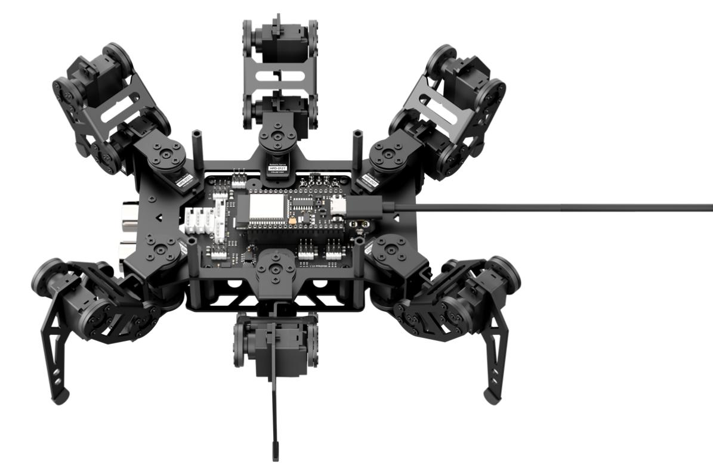

### 9.1.3 Data Transmission Format

miniHexa uses the following default UART serial communication settings:

| Baud Rate  | 115200 |
| :--------: | :----: |
| Data Bits  |   8    |
| Parity Bit |  None  |
|  Stop Bit  |   1    |

### 9.1.4 Communication Protocol：

Refer to the file [miniHexa Host & APP Communication Protocol]() under the same directory of this document.

## 9.2 PC Serial Control

This section demonstrates controlling miniHexa’s movement, posture, and RGB lights via a PC serial port.

### 9.2.1 Principle of Operation

:::{Note}

This section requires the device-side program for miniHexa to be preloaded. Please first upload the [miniHexa Device-Side Program]().

:::

(1) After connecting miniHexa to the PC, serial communication is established to control miniHexa. The default UART serial data format is:

| Baud Rate  | 115200 |
| :--------: | :----: |
| Data Bits  |   8    |
| Parity Bit |  None  |
|  Stop Bit  |   1    |

(2) The protocol instruction packet format is as follows: each packet starts with a function code, fields are separated by a “\|” symbol, and the packet ends with “&”.

### 9.2.2 Preparation

* **Hardware Preparation**

Connect the PC host to the miniHexa using a Type-C data cable.

* **Software Preparation**

(1) Open the [Serial Debug Tool]() included in Appendix.

(2) Set the tool to use a baud rate of 115200, parity of None, 8 data bits, 1 stop bit, and ensure data is sent and received in ASCII mode.

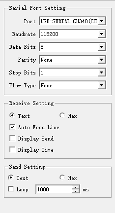

### 9.2.3 Program Outcome

Control the miniHexa by sending protocol commands:

* **Command: Movement Control**

Function Code: C

Command Data: X-axis, Y-axis, Z-axis data

Description: This command is used to control the movement of the miniHexa.

Example: Sending the command "C\|0\|50\|0&" will make the miniHexa move forward at a speed of 50.

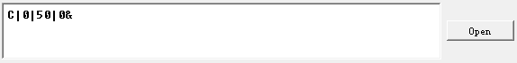

* **Command Name: Attitude Control**

Function Code: F

Command Data: Yaw, Roll, Pitch, X, Y, Z data

Description: This command is used to control the attitude of the miniHexa.

Example: Sending **"F\|0\|0\|0\|0\|50\|0&"** will move the miniHexa’s center of gravity forward.

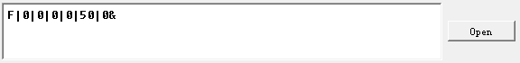

* **Command Name: RGB Light Control**

Function Code: H

Command Data: R value, G value, B value

Description: This command is used to control the RGB lights of the ultrasonic module.

Example: Sending **"H\|255\|0\|0&"** will set the miniHexa’s ultrasonic RGB lights to red.

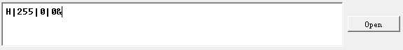

* **Command Name: Ultrasonic Obstacle Avoidance Control**

Function Code: I

Command Data: a (0 to disable obstacle avoidance, 1 to enable)

Description: This command is used to enable or disable the ultrasonic obstacle avoidance function.

Example: Sending "I\|1&" will enable obstacle avoidance on the miniHexa.

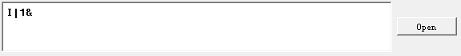

* **Command Name: Self-Balancing Control**

Function Code: J

Command Data: a (0 to disable self-balancing, 1 to enable)

Description: This command is used to enable or disable the self-balancing function.

Example: Sending **"I\|1&"** will enable self-balancing on the miniHexa.

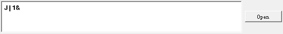

* **Command Name: Action Group Control**

Function Code: K

Command Data: Sub-function code, Action group ID

Description: This command is used to run a specific action group.

Example: Sending **"K\|1\|1&"** will make the miniHexa execute Action Group 1.

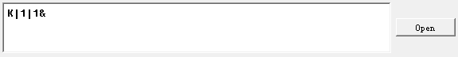

## 9.3 miniHexa Host & APP Communication Protocol

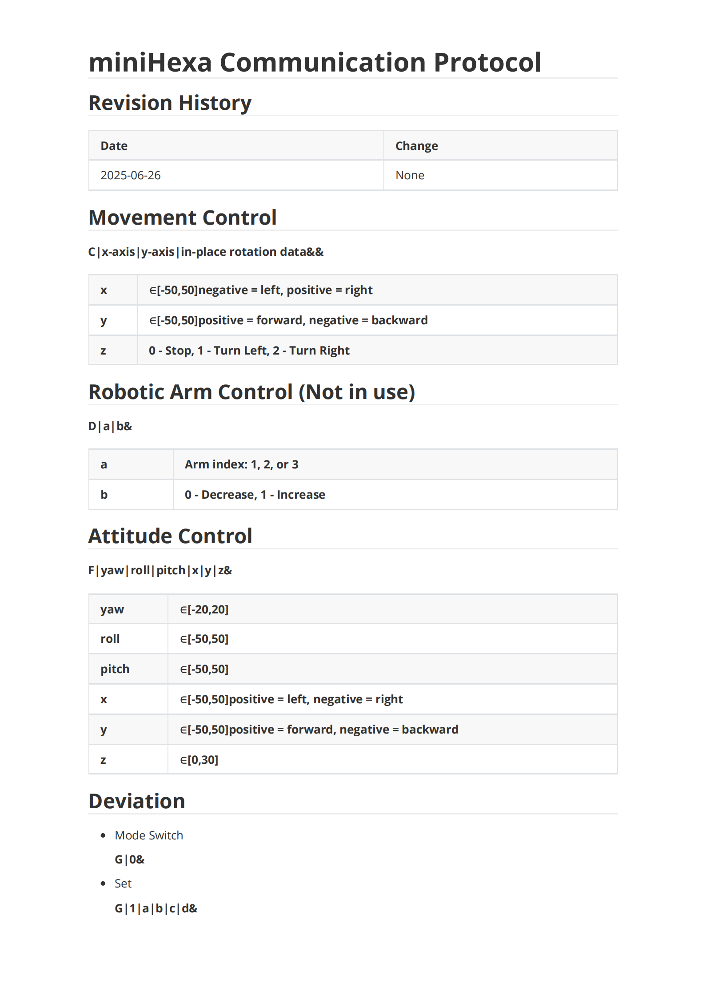

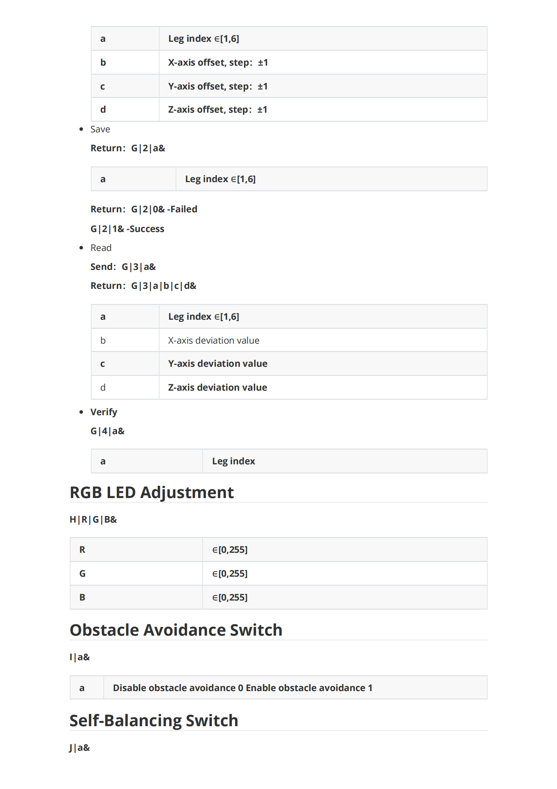

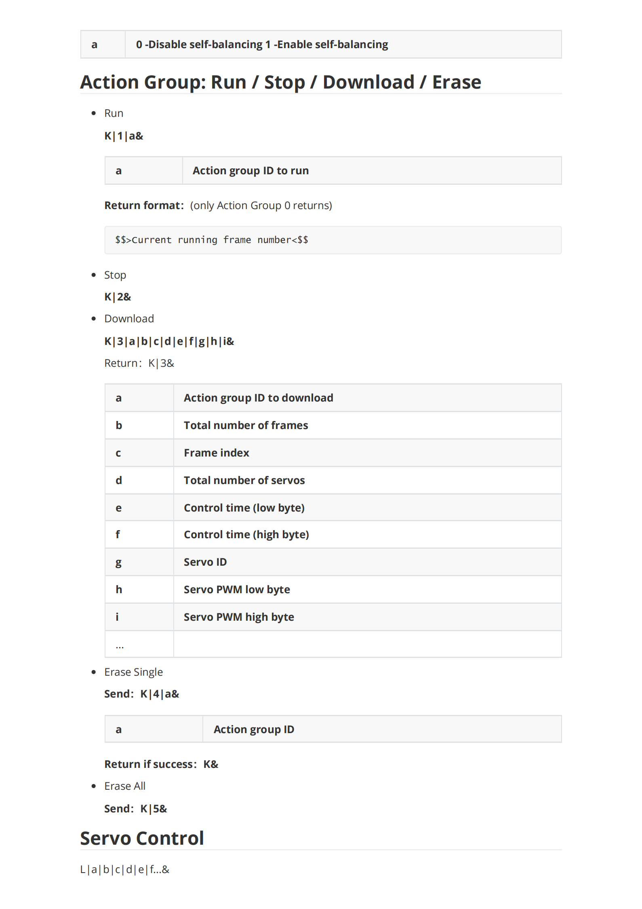

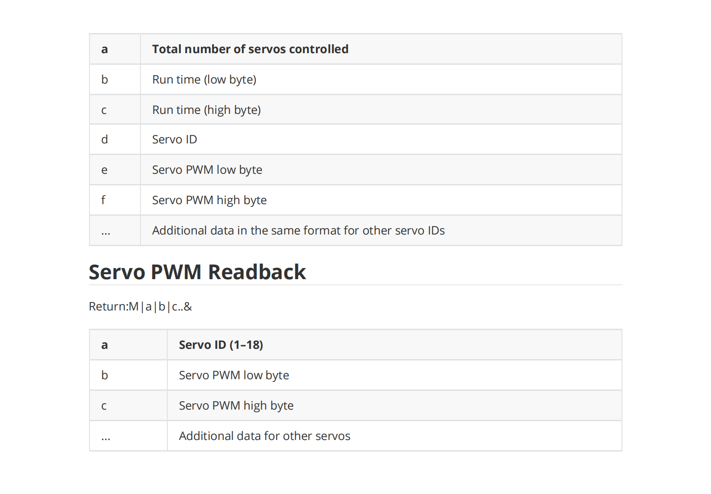